# Unlocked View

<cite>
**Referenced Files in This Document**
- [UnlockedTimeFilter.cs](file://src/Unlimotion.ViewModel/UnlockedTimeFilter.cs)
- [MainWindowViewModel.cs](file://src/Unlimotion.ViewModel/MainWindowViewModel.cs)
- [DurationFilter.cs](file://src/Unlimotion.ViewModel/DurationFilter.cs)
- [SortDefinition.cs](file://src/Unlimotion.ViewModel/SortDefinition.cs)
- [TaskItemViewModel.cs](file://src/Unlimotion.ViewModel/TaskItemViewModel.cs)
- [TaskTreeManager.cs](file://src/Unlimotion.TaskTreeManager/TaskTreeManager.cs)
- [TaskAvailabilityCalculationTests.cs](file://src/Unlimotion.Test/TaskAvailabilityCalculationTests.cs)
</cite>

## Table of Contents
1. [Introduction](#introduction)
2. [Core Architecture](#core-architecture)
3. [UnlockedTimeFilter Implementation](#unlockedtimefilter-implementation)
4. [Reactive Pipeline](#reactive-pipeline)
5. [AutoRefreshOnObservable Mechanism](#autorefreshonobservable-mechanism)
6. [Sorting and Organization](#sorting-and-organization)
7. [Task Availability Calculations](#task-availability-calculations)
8. [Filter Combinations](#filter-combinations)
9. [Time Zone Considerations](#time-zone-considerations)
10. [Common Issues and Edge Cases](#common-issues-and-edge-cases)
11. [Performance Optimization](#performance-optimization)
12. [Troubleshooting Guide](#troubleshooting-guide)

## Introduction

The Unlocked view in Unlimotion serves as a specialized task management interface that displays tasks currently available for completion based on complex availability rules. This view implements a sophisticated reactive filtering system that dynamically updates task visibility as task properties change in real-time.

The Unlocked view operates on the principle that tasks become "unlocked" when they meet specific availability criteria defined by the business logic, primarily focusing on the `IsCanBeCompleted` property. Unlike traditional task lists that show all tasks regardless of their readiness, the Unlocked view presents only tasks that are currently ready to be worked on.

## Core Architecture

The Unlocked view architecture follows a reactive programming pattern built on the DynamicData library, which provides powerful observable collections and transformation capabilities. The system consists of several interconnected components that work together to deliver real-time task filtering and display.

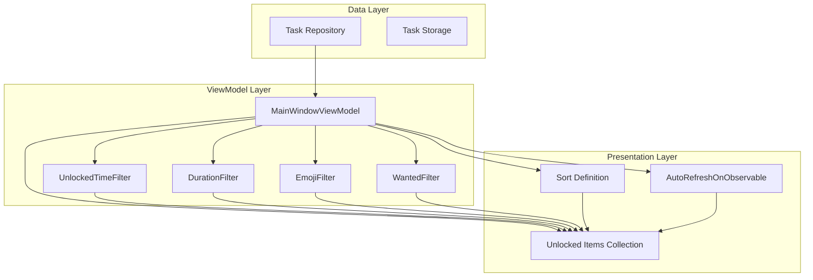

**Diagram sources**
- [MainWindowViewModel.cs](file://src/Unlimotion.ViewModel/MainWindowViewModel.cs#L485-L540)
- [UnlockedTimeFilter.cs](file://src/Unlimotion.ViewModel/UnlockedTimeFilter.cs#L1-L58)

**Section sources**
- [MainWindowViewModel.cs](file://src/Unlimotion.ViewModel/MainWindowViewModel.cs#L1-L50)
- [UnlockedTimeFilter.cs](file://src/Unlimotion.ViewModel/UnlockedTimeFilter.cs#L1-L58)

## UnlockedTimeFilter Implementation

The `UnlockedTimeFilter` class serves as the foundation for determining which tasks qualify as "unlocked." It defines six distinct categories of unlocked tasks, each with specific temporal criteria:

### Filter Categories

The UnlockedTimeFilter provides six predefined categories:

1. **Unplanned**: Tasks with no planned dates
2. **Overdue**: Tasks with deadlines that have passed
3. **Urgent**: Tasks with deadlines today
4. **Today**: Tasks scheduled for today
5. **Maybe**: Tasks with flexible scheduling windows
6. **Future**: Tasks scheduled for future dates

### Core Predicate Logic

The fundamental unlocking predicate is implemented as:

```csharp
public static readonly Predicate<TaskItemViewModel> IsUnlocked = e => e.IsCanBeCompleted && 
                                                                            e.IsCompleted == false;
```

This predicate ensures that only tasks meeting two critical conditions appear in the unlocked view:
- **IsCanBeCompleted**: The task is technically ready for completion
- **IsCompleted == false**: The task hasn't been marked as completed

### Temporal Filtering Criteria

Each unlock category implements specific temporal logic:

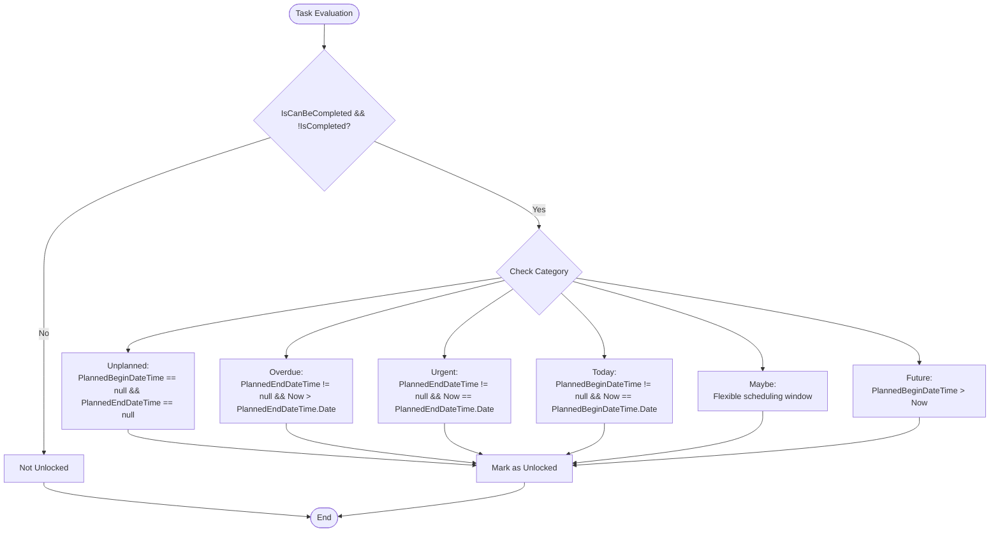

**Diagram sources**
- [UnlockedTimeFilter.cs](file://src/Unlimotion.ViewModel/UnlockedTimeFilter.cs#L15-L50)

**Section sources**
- [UnlockedTimeFilter.cs](file://src/Unlimotion.ViewModel/UnlockedTimeFilter.cs#L15-L58)

## Reactive Pipeline

The reactive pipeline in `MainWindowViewModel` orchestrates the filtering process through a sophisticated chain of observable transformations. This pipeline ensures that the UnlockedItems collection remains synchronized with all relevant task changes.

### Pipeline Architecture

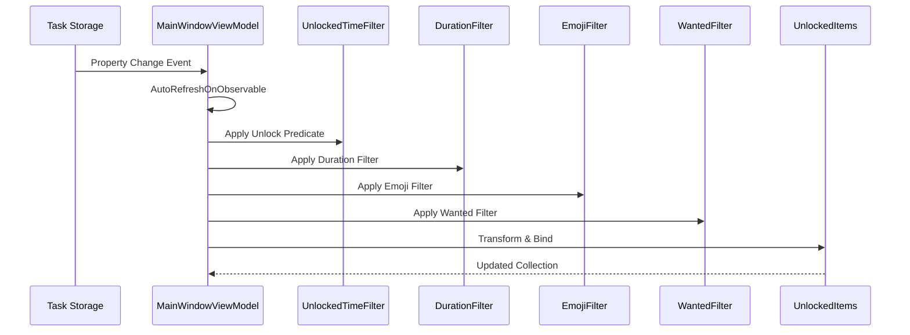

**Diagram sources**
- [MainWindowViewModel.cs](file://src/Unlimotion.ViewModel/MainWindowViewModel.cs#L485-L540)

### Observable Chain Configuration

The reactive pipeline is configured with specific observable triggers that monitor critical task properties:

```csharp
// Core unlock properties monitored for automatic refresh
.AutoRefreshOnObservable(m => m.WhenAnyValue(
    m => m.IsCanBeCompleted,
    m => m.IsCompleted,
    m => m.UnlockedDateTime,
    m => m.PlannedBeginDateTime,
    m => m.Wanted,
    m => m.PlannedDuration,
    m => m.PlannedEndDateTime))
```

This configuration ensures that the UnlockedItems collection updates immediately when any property affecting task availability changes.

### Filter Composition

The pipeline applies multiple filters in sequence:

1. **UnlockedTimeFilter**: Applies temporal criteria
2. **DurationFilter**: Filters based on planned duration
3. **EmojiFilter**: Applies emoji-based categorization
4. **EmojiExcludeFilter**: Excludes tasks with specific emojis
5. **WantedFilter**: Handles user preference for wanted tasks

**Section sources**
- [MainWindowViewModel.cs](file://src/Unlimotion.ViewModel/MainWindowViewModel.cs#L485-L540)

## AutoRefreshOnObservable Mechanism

The `AutoRefreshOnObservable` mechanism is the cornerstone of real-time updates in the Unlocked view. This feature automatically triggers collection refreshes when monitored properties change, eliminating the need for manual refresh operations.

### Implementation Details

The AutoRefresh mechanism works by subscribing to specific property change events and triggering collection updates when relevant changes occur:

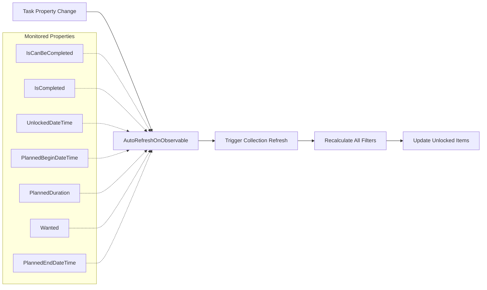

**Diagram sources**
- [MainWindowViewModel.cs](file://src/Unlimotion.ViewModel/MainWindowViewModel.cs#L485-L495)

### Throttling and Performance

The AutoRefresh mechanism includes intelligent throttling to prevent excessive updates during rapid property changes:

```csharp
// Throttling prevents excessive refreshes during bulk operations
propertyChanged
    .Where(_ => MainWindowViewModel._isInited)
    .Throttle(PropertyChangedThrottleTimeSpanDefault)
```

This throttling ensures that the system remains responsive even when multiple properties change simultaneously.

### Property-Specific Monitoring

Different filters monitor different property sets:

- **UnlockedTimeFilter**: Monitors availability-related properties
- **DurationFilter**: Monitors duration and planning properties
- **EmojiFilter**: Monitors emoji and categorization properties

**Section sources**
- [MainWindowViewModel.cs](file://src/Unlimotion.ViewModel/MainWindowViewModel.cs#L485-L495)
- [TaskItemViewModel.cs](file://src/Unlimotion.ViewModel/TaskItemViewModel.cs#L203-L232)

## Sorting and Organization

The Unlocked view supports multiple sorting strategies controlled by the `CurrentSortDefinitionForUnlocked` setting. This flexibility allows users to organize unlocked tasks according to their preferred criteria.

### Available Sort Definitions

The system provides comprehensive sorting options:

| Sort Type | Description | Key Properties |
|-----------|-------------|----------------|
| Comfort | Priority-based ordering | CompletedDateTime, ArchiveDateTime, UnlockedDateTime, CreatedDateTime |
| Emodji | Alphabetical by emoji | GetAllEmoji |
| Created Ascending/Descending | Chronological creation order | CreatedDateTime |
| Unlocked Ascending/Descending | Availability timing | UnlockedDateTime |
| Archive Ascending/Descending | Archival timeline | ArchiveDateTime |
| Completed Ascending/Descending | Completion status | CompletedDateTime |
| Title Ascending/Descending | Alphabetical by title | OnlyTextTitle |
| Importance | Priority-based sorting | Importance |
| Planned Duration | Time estimation | PlannedDuration |

### Sort Definition Implementation

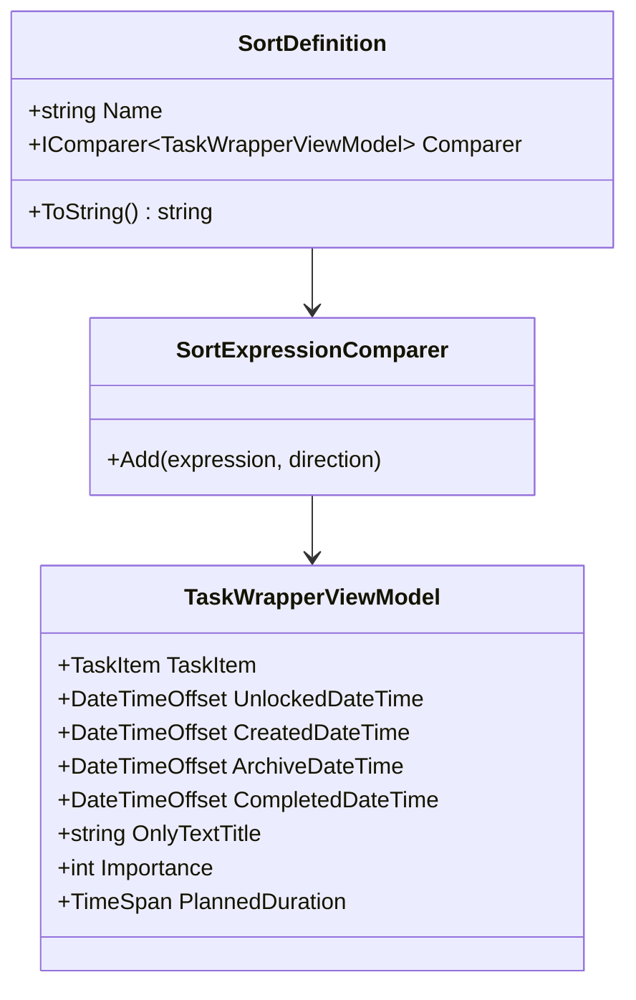

**Diagram sources**
- [SortDefinition.cs](file://src/Unlimotion.ViewModel/SortDefinition.cs#L5-L238)

### Dynamic Sort Updates

The sorting system responds dynamically to configuration changes:

```csharp
// Automatic persistence of sort preferences
this.WhenAnyValue(m => m.CurrentSortDefinitionForUnlocked)
    .Subscribe(b => _configuration?.GetSection("AllTasks:CurrentSortDefinitionForUnlocked").Set(b.Name))
```

**Section sources**
- [SortDefinition.cs](file://src/Unlimotion.ViewModel/SortDefinition.cs#L1-L238)
- [MainWindowViewModel.cs](file://src/Unlimotion.ViewModel/MainWindowViewModel.cs#L40-L50)

## Task Availability Calculations

Task availability is determined by complex business rules that consider task dependencies, completion status, and temporal constraints. The availability calculation system ensures that only truly ready-to-complete tasks appear in the unlocked view.

### Availability Business Rules

The availability calculation follows these core principles:

1. **All contained tasks must be completed** (IsCompleted != false)
2. **All blocking tasks must be completed** (IsCompleted != false)
3. **Temporal constraints must be satisfied** (planned dates, deadlines)
4. **User preferences must be respected** (wanted status)

### Calculation Process

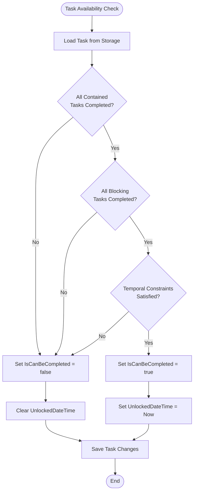

**Diagram sources**
- [TaskTreeManager.cs](file://src/Unlimotion.TaskTreeManager/TaskTreeManager.cs#L629-L699)

### Temporal Availability Logic

The system evaluates temporal availability based on planned schedules:

```csharp
// Temporal availability calculation
if (newIsCanBeCompleted && (!previousIsCanBeCompleted || task.UnlockedDateTime == null))
{
    // Task became available - set UnlockedDateTime
    task.UnlockedDateTime = DateTimeOffset.UtcNow;
}
```

### Dependency Management

The availability system handles complex dependency relationships:

- **Contains Tasks**: Child tasks must be completed
- **Blocked By Tasks**: Blocking tasks must be completed  
- **Parent Tasks**: Parent dependencies are considered
- **Sibling Dependencies**: Related tasks affect availability

**Section sources**
- [TaskTreeManager.cs](file://src/Unlimotion.TaskTreeManager/TaskTreeManager.cs#L629-L699)
- [TaskAvailabilityCalculationTests.cs](file://src/Unlimotion.Test/TaskAvailabilityCalculationTests.cs#L1-L100)

## Filter Combinations

The Unlocked view supports sophisticated filter combinations that allow users to create highly customized task views. These filters work together to provide precise control over which tasks appear in the unlocked collection.

### Filter Interaction Matrix

| Filter Type | Scope | Combination Behavior |
|-------------|-------|---------------------|
| UnlockedTimeFilter | Temporal | AND with other filters |
| DurationFilter | Time Estimation | AND with other filters |
| EmojiFilter | Categorization | OR logic within filter group |
| EmojiExcludeFilter | Exclusion | AND with inclusion filters |
| WantedFilter | User Preference | AND with other filters |

### Complex Filter Scenarios

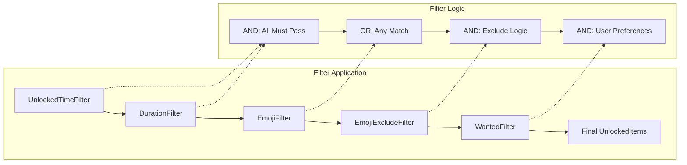

**Diagram sources**
- [MainWindowViewModel.cs](file://src/Unlimotion.ViewModel/MainWindowViewModel.cs#L378-L410)

### Filter Persistence

Filter states are automatically persisted across sessions:

```csharp
// Automatic persistence of filter states
this.WhenAnyValue(m => m.ShowWanted)
    .Subscribe(b => _configuration?.GetSection("AllTasks:ShowWanted").Set(b))
```

**Section sources**
- [MainWindowViewModel.cs](file://src/Unlimotion.ViewModel/MainWindowViewModel.cs#L313-L410)

## Time Zone Considerations

The Unlocked view handles time zone complexities through careful datetime manipulation and offset management. Proper timezone handling ensures accurate temporal filtering across different geographic locations.

### DateTime Handling Strategy

The system employs a consistent approach to datetime handling:

1. **UTC Storage**: All datetime values are stored in UTC format
2. **Local Offset Calculation**: Display times adjust to local timezone offsets
3. **Date Boundary Detection**: Date comparisons use local date boundaries

### Time Zone Conversion Pattern

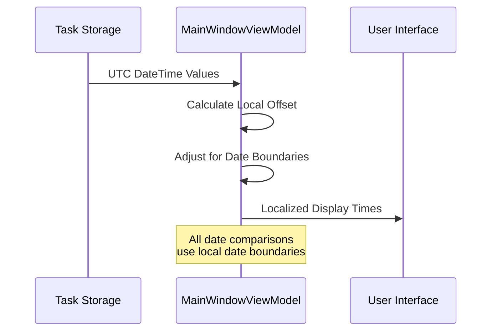

**Diagram sources**
- [MainWindowViewModel.cs](file://src/Unlimotion.ViewModel/MainWindowViewModel.cs#L420-L430)

### Edge Case Handling

The system addresses several time zone edge cases:

- **Daylight Saving Time**: Automatic offset adjustments
- **Date Boundary Crossings**: Proper midnight boundary detection
- **International Operations**: Consistent UTC-based storage
- **Local vs. Global Views**: Flexible timezone conversion

### Temporal Filter Adaptation

Temporal filters adapt to local time zones:

```csharp
// Date filter adaptation for local time zones
var dateTime = task.ArchiveDateTime?.Add(DateTimeOffset.Now.Offset).Date;
return filter.Item1 <= dateTime && dateTime <= filter.Item2;
```

**Section sources**
- [MainWindowViewModel.cs](file://src/Unlimotion.ViewModel/MainWindowViewModel.cs#L420-L430)

## Common Issues and Edge Cases

Understanding common issues and edge cases helps developers maintain robust Unlocked view functionality and troubleshoot problems effectively.

### Availability Calculation Issues

#### Problem: Tasks Remain Locked After Dependencies Complete
**Cause**: Circular dependencies or incorrect completion status propagation
**Solution**: Verify dependency relationships and completion status synchronization

#### Problem: Incorrect Unlock Timing
**Cause**: Temporal constraint misalignment or timezone issues
**Solution**: Review planned dates and ensure proper UTC/local time handling

### Filter Performance Issues

#### Problem: Slow Filter Updates During Bulk Operations
**Cause**: Excessive AutoRefresh triggers during batch updates
**Solution**: Implement bulk update modes and disable individual property monitoring

#### Problem: Memory Leaks in Long-Running Sessions
**Cause**: Observable subscriptions not properly disposed
**Solution**: Ensure all observables are properly disposed using DisposableList

### Temporal Edge Cases

#### Problem: Midnight Boundary Issues
**Cause**: Date comparison across midnight boundaries
**Solution**: Use local date boundaries for temporal filtering

#### Problem: Time Zone Drift
**Cause**: Inconsistent timezone handling across operations
**Solution**: Standardize on UTC for internal storage and calculate offsets for display

### Duration-Based Filtering Issues

#### Problem: Inaccurate Duration Calculations
**Cause**: Null duration handling or precision loss
**Solution**: Implement proper null checking and use TimeSpan arithmetic carefully

#### Problem: Duration Filter Misclassification
**Cause**: Boundary condition errors in duration ranges
**Solution**: Review duration filter predicates for inclusive/exclusive boundaries

### Performance Optimization Strategies

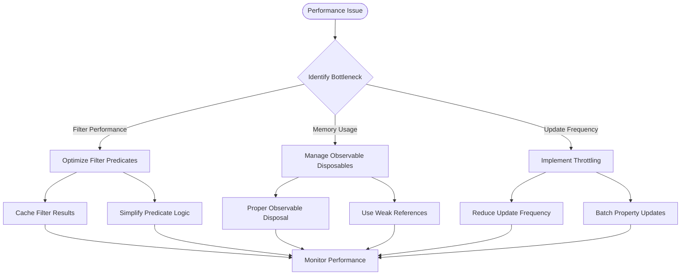

**Section sources**
- [TaskAvailabilityCalculationTests.cs](file://src/Unlimotion.Test/TaskAvailabilityCalculationTests.cs#L1-L100)

## Performance Optimization

The Unlocked view implements several performance optimization strategies to ensure responsive operation even with large task collections.

### Reactive Stream Optimization

The system optimizes reactive streams through:

- **Selective Property Monitoring**: Only monitor properties that affect unlock status
- **Throttling Mechanisms**: Prevent excessive updates during rapid changes
- **Lazy Evaluation**: Defer expensive calculations until necessary
- **Memory Management**: Proper disposal of observables and subscriptions

### Collection Binding Optimization

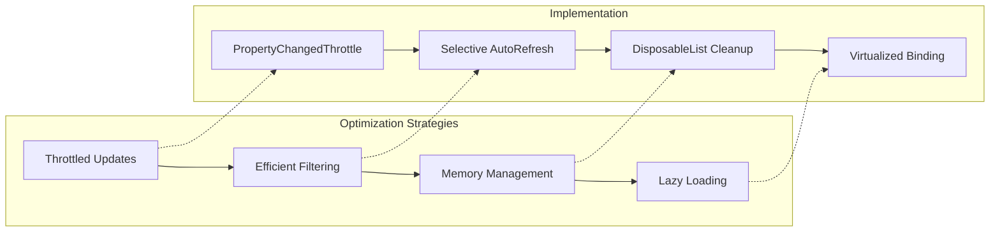

### Memory Management Best Practices

The system implements comprehensive memory management:

- **Automatic Disposal**: All observables are managed through DisposableList
- **Weak References**: Prevent memory leaks in long-running operations
- **Collection Cleanup**: Proper cleanup of filtered collections
- **Subscription Management**: Careful management of observable subscriptions

**Section sources**
- [MainWindowViewModel.cs](file://src/Unlimotion.ViewModel/MainWindowViewModel.cs#L485-L495)
- [TaskItemViewModel.cs](file://src/Unlimotion.ViewModel/TaskItemViewModel.cs#L203-L232)

## Troubleshooting Guide

This section provides systematic approaches to diagnosing and resolving common issues with the Unlocked view functionality.

### Diagnostic Approach

#### Step 1: Verify Task Availability
Check if tasks meet basic unlock criteria:
- Confirm `IsCanBeCompleted` is true
- Verify `IsCompleted` is false
- Review planned dates and deadlines

#### Step 2: Examine Filter States
Ensure filters are configured correctly:
- Check UnlockedTimeFilter settings
- Verify duration filter selections
- Review emoji filter configurations
- Confirm wanted filter preferences

#### Step 3: Monitor Observable Triggers
Verify that AutoRefresh mechanisms are functioning:
- Check property change notifications
- Monitor subscription lifecycles
- Verify throttling intervals

### Common Diagnostic Patterns

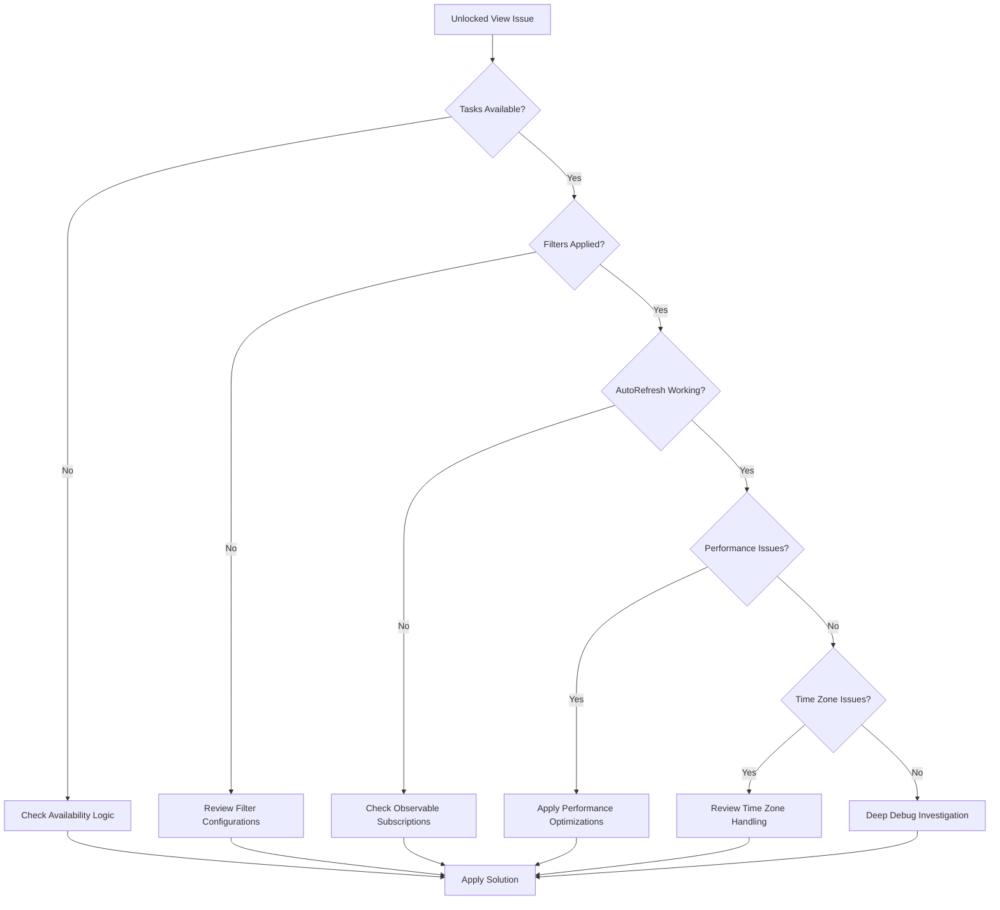

### Specific Troubleshooting Scenarios

#### Scenario: No Tasks Displayed in Unlocked View
**Diagnostic Steps**:
1. Verify task availability calculations
2. Check filter configurations
3. Review AutoRefresh triggers
4. Examine observable subscriptions

#### Scenario: Incorrect Task Ordering
**Diagnostic Steps**:
1. Verify sort definition settings
2. Check sort comparer implementations
3. Review property change notifications
4. Examine collection binding logic

#### Scenario: Performance Degradation
**Diagnostic Steps**:
1. Monitor observable subscription counts
2. Check throttling effectiveness
3. Review filter complexity
4. Examine memory usage patterns

### Logging and Monitoring

Implement comprehensive logging for troubleshooting:

```csharp
// Example diagnostic logging
_logger.Debug($"Task {taskId} availability changed: {previousStatus} -> {newStatus}");
_logger.Debug($"AutoRefresh triggered for properties: {string.Join(", ", changedProperties)}");
_logger.Debug($"Filter evaluation took {elapsedMs}ms for {taskCount} tasks");
```

**Section sources**
- [MainWindowViewModel.cs](file://src/Unlimotion.ViewModel/MainWindowViewModel.cs#L485-L540)
- [TaskItemViewModel.cs](file://src/Unlimotion.ViewModel/TaskItemViewModel.cs#L203-L232)