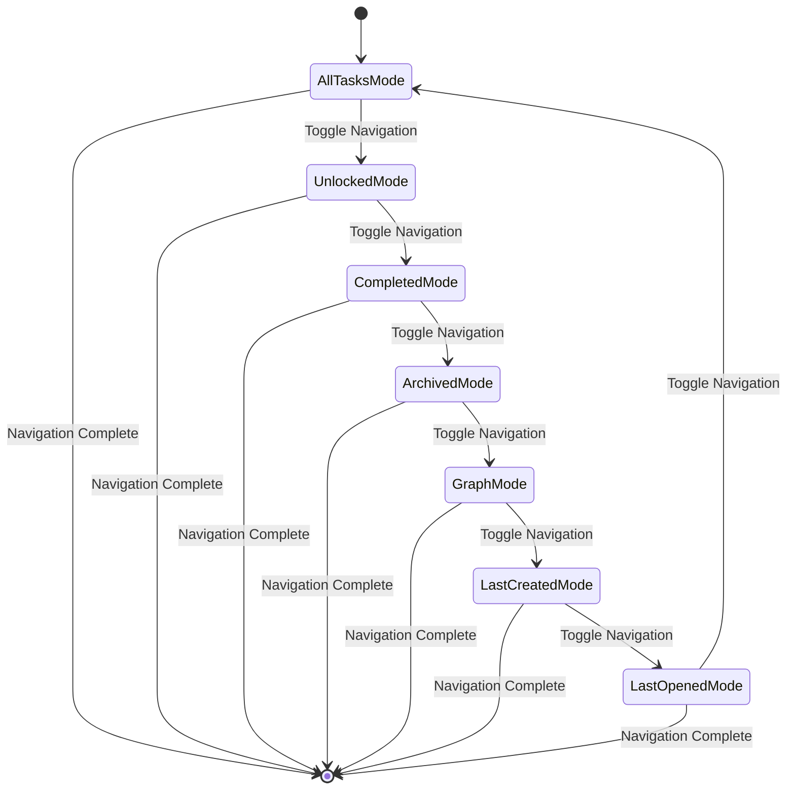
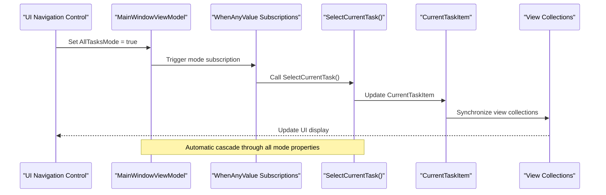
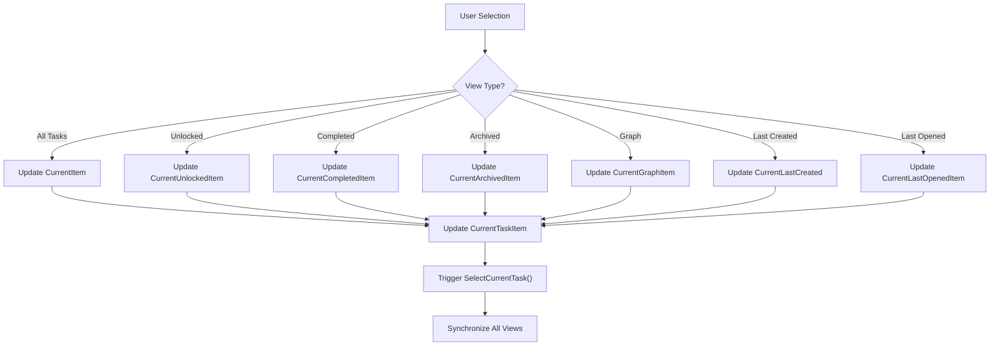
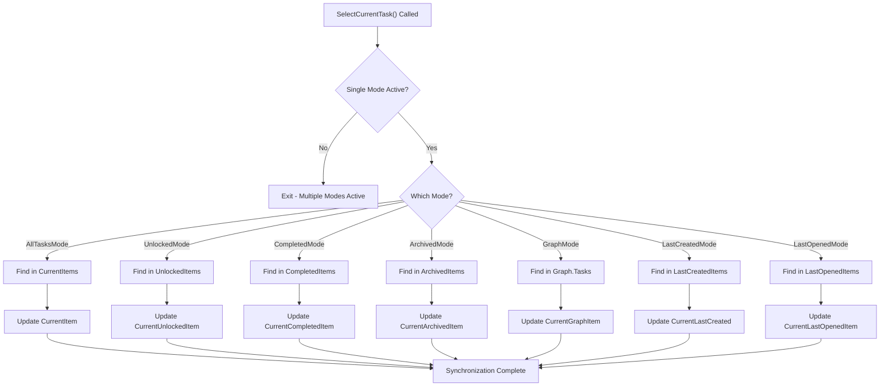
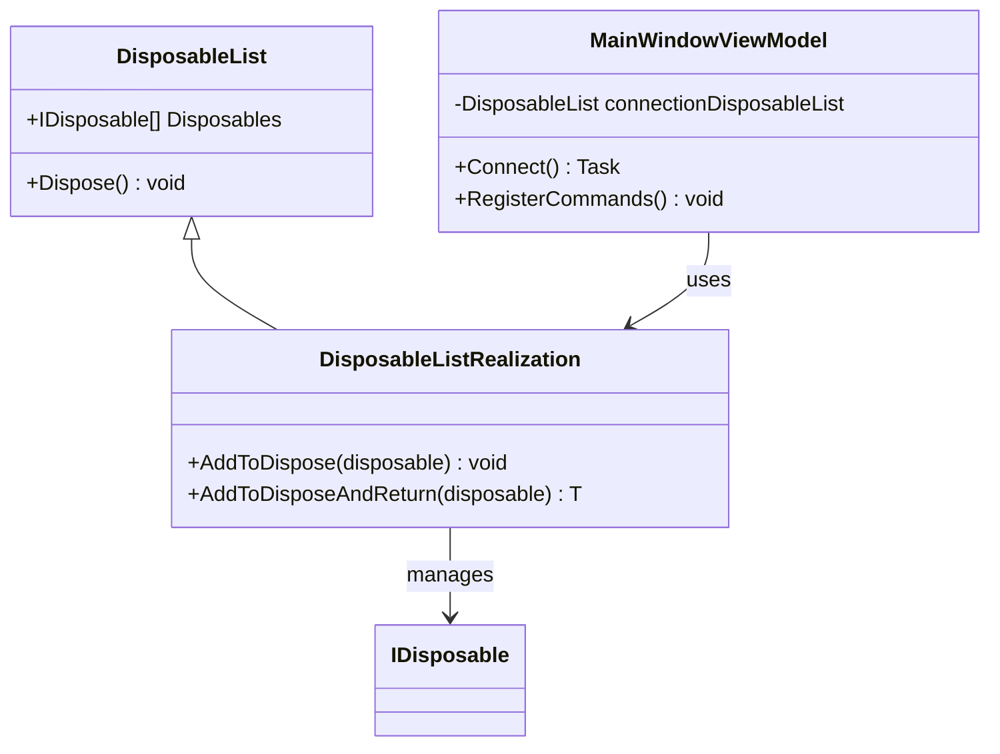

# View Navigation Mechanism

<cite>
**Referenced Files in This Document**
- [MainWindowViewModel.cs](file://src/Unlimotion.ViewModel/MainWindowViewModel.cs)
- [TaskItemViewModel.cs](file://src/Unlimotion.ViewModel/TaskItemViewModel.cs)
- [TaskWrapperViewModel.cs](file://src/Unlimotion.ViewModel/TaskWrapperViewModel.cs)
- [GraphViewModel.cs](file://src/Unlimotion.ViewModel/GraphViewModel.cs)
- [DisposableList.cs](file://src/Unlimotion.ViewModel/DisposableList.cs)
- [DisposableListExtensions.cs](file://src/Unlimotion.ViewModel/DisposableListExtensions.cs)
- [MainWindowViewModelTests.cs](file://src/Unlimotion.Test/MainWindowViewModelTests.cs)
</cite>

## Table of Contents
1. [Introduction](#introduction)
2. [Navigation Mode System](#navigation-mode-system)
3. [Reactive Subscription Architecture](#reactive-subscription-architecture)
4. [CurrentTaskItem Central Coordination](#currenttaskitem-central-coordination)
5. [View-Specific Collections Management](#view-specific-collections-management)
6. [SelectCurrentTask Synchronization Logic](#selectcurrenttask-synchronization-logic)
7. [Memory Management and Disposal](#memory-management-and-disposal)
8. [Common Issues and Solutions](#common-issues-and-solutions)
9. [Practical Implementation Examples](#practical-implementation-examples)
10. [Best Practices](#best-practices)

## Introduction

Unlimotion's view navigation mechanism is built around a sophisticated reactive architecture that coordinates between multiple view modes and maintains consistent selection state across different task categories. The system centers around boolean mode properties that act as navigation indicators, with ReactiveUI's WhenAnyValue subscriptions creating automatic synchronization pipelines that keep the UI responsive and consistent.

The navigation system manages seven distinct view modes: All Tasks, Unlocked, Completed, Archived, Graph, Last Created, and Last Opened. Each mode maintains its own collection of task wrappers while sharing a central CurrentTaskItem that serves as the selection coordinator across all views.

## Navigation Mode System

The navigation system operates through seven primary boolean properties that serve as mode indicators:



**Diagram sources**
- [MainWindowViewModel.cs](file://src/Unlimotion.ViewModel/MainWindowViewModel.cs#L945-L955)

### Mode Property Definitions

Each mode property controls a specific aspect of the application's navigation:

- **AllTasksMode**: Controls the main task tree view with all available tasks
- **UnlockedMode**: Shows tasks that are currently available for work
- **CompletedMode**: Displays finished tasks with completion timestamps
- **ArchivedMode**: Shows tasks marked as archived
- **GraphMode**: Provides visual graph representation of task relationships
- **LastCreatedMode**: Focuses on recently created tasks
- **LastOpenedMode**: Shows tasks accessed most recently

**Section sources**
- [MainWindowViewModel.cs](file://src/Unlimotion.ViewModel/MainWindowViewModel.cs#L945-L955)

## Reactive Subscription Architecture

The navigation system relies heavily on ReactiveUI's WhenAnyValue to create reactive pipelines that automatically update the UI when navigation occurs. These subscriptions form the backbone of the synchronization mechanism.



**Diagram sources**
- [MainWindowViewModel.cs](file://src/Unlimotion.ViewModel/MainWindowViewModel.cs#L183-L188)
- [MainWindowViewModel.cs](file://src/Unlimotion.ViewModel/MainWindowViewModel.cs#L825-L876)

### Key Subscription Patterns

The system implements several critical subscription patterns:

1. **Mode Property Subscriptions**: Monitor all navigation mode changes
2. **Individual View Item Subscriptions**: Track selection changes within each view
3. **CurrentTaskItem Subscriptions**: Coordinate selection across all views
4. **Configuration Persistence Subscriptions**: Maintain user preferences

**Section sources**
- [MainWindowViewModel.cs](file://src/Unlimotion.ViewModel/MainWindowViewModel.cs#L183-L188)
- [MainWindowViewModel.cs](file://src/Unlimotion.ViewModel/MainWindowViewModel.cs#L117-L152)
- [MainWindowViewModel.cs](file://src/Unlimotion.ViewModel/MainWindowViewModel.cs#L149-L185)

## CurrentTaskItem Central Coordination

The CurrentTaskItem property serves as the central selection coordinator, with individual view items (CurrentItem, CurrentUnlockedItem, etc.) updating it when selected. This creates a unidirectional data flow that ensures consistency across the application.



**Diagram sources**
- [MainWindowViewModel.cs](file://src/Unlimotion.ViewModel/MainWindowViewModel.cs#L117-L152)
- [MainWindowViewModel.cs](file://src/Unlimotion.ViewModel/MainWindowViewModel.cs#L149-L185)

### Selection Propagation Logic

The selection propagation follows a specific pattern where individual view items update the central CurrentTaskItem, which then triggers synchronization across all views:

**Section sources**
- [MainWindowViewModel.cs](file://src/Unlimotion.ViewModel/MainWindowViewModel.cs#L117-L152)
- [MainWindowViewModel.cs](file://src/Unlimotion.ViewModel/MainWindowViewModel.cs#L149-L185)

## View-Specific Collections Management

Each navigation mode maintains its own collection of task wrappers, managed through ReactiveUI bindings that automatically update when the underlying data changes.

### Collection Types and Their Purposes

| Collection | Purpose | Filtering Applied | Sorting |
|------------|---------|-------------------|---------|
| CurrentItems | All available tasks | Task filter, emoji filter | Custom sort comparer |
| UnlockedItems | Available for work | Unlocked time filter, duration filter | Sort comparer for unlocked |
| CompletedItems | Finished tasks | Completion date filter | Descending completion date |
| ArchivedItems | Archived tasks | Archive date filter | Descending archive date |
| LastCreatedItems | Recently created | Creation date filter | Descending creation date |
| LastOpenedItems | Recently accessed | None | Reverse chronological |

**Section sources**
- [MainWindowViewModel.cs](file://src/Unlimotion.ViewModel/MainWindowViewModel.cs#L473-L503)
- [MainWindowViewModel.cs](file://src/Unlimotion.ViewModel/MainWindowViewModel.cs#L533-L566)
- [MainWindowViewModel.cs](file://src/Unlimotion.ViewModel/MainWindowViewModel.cs#L591-L628)

## SelectCurrentTask Synchronization Logic

The SelectCurrentTask method serves as the core synchronization engine, determining which view collection contains the CurrentTaskItem and updating the appropriate view-specific property.



**Diagram sources**
- [MainWindowViewModel.cs](file://src/Unlimotion.ViewModel/MainWindowViewModel.cs#L825-L876)

### FindTaskWrapperViewModel Implementation

The FindTaskWrapperViewModel method implements a sophisticated search algorithm that handles both direct matches and hierarchical parent-child relationships:

**Section sources**
- [MainWindowViewModel.cs](file://src/Unlimotion.ViewModel/MainWindowViewModel.cs#L878-L945)

## Memory Management and Disposal

The navigation system implements comprehensive memory management through ReactiveUI's DisposableList pattern, ensuring proper cleanup of subscriptions and preventing memory leaks during rapid navigation.

### DisposableList Architecture



**Diagram sources**
- [DisposableList.cs](file://src/Unlimotion.ViewModel/DisposableList.cs#L5-L28)
- [DisposableListExtensions.cs](file://src/Unlimotion.ViewModel/DisposableListExtensions.cs#L5-L16)

### Disposal Pattern Implementation

The system follows a strict disposal pattern where all subscriptions are added to the DisposableList and properly disposed when navigation changes occur:

**Section sources**
- [MainWindowViewModel.cs](file://src/Unlimotion.ViewModel/MainWindowViewModel.cs#L25-L35)
- [DisposableList.cs](file://src/Unlimotion.ViewModel/DisposableList.cs#L5-L28)
- [DisposableListExtensions.cs](file://src/Unlimotion.ViewModel/DisposableListExtensions.cs#L5-L16)

## Common Issues and Solutions

### Race Conditions During Rapid Navigation

**Problem**: Rapid switching between navigation modes can cause race conditions where multiple subscriptions attempt to update the same properties simultaneously.

**Solution**: The system implements a mutual exclusion pattern through the SelectCurrentTask method, which only executes when exactly one mode is active:

```csharp
if (AllTasksMode ^ UnlockedMode ^ CompletedMode ^ ArchivedMode ^ GraphMode ^ LastCreatedMode ^ LastOpenedMode)
```

This XOR operation ensures that only one mode can be active at a time, preventing race conditions.

### Memory Management of View-Specific Collections

**Problem**: Frequent navigation can lead to memory accumulation if view-specific collections aren't properly managed.

**Solution**: The system implements proper disposal patterns and uses ReactiveUI's auto-dispose capabilities. Each subscription is added to the DisposableList and automatically cleaned up when navigation changes.

**Section sources**
- [MainWindowViewModel.cs](file://src/Unlimotion.ViewModel/MainWindowViewModel.cs#L183-L188)
- [MainWindowViewModel.cs](file://src/Unlimotion.ViewModel/MainWindowViewModel.cs#L825-L876)

## Practical Implementation Examples

### Example 1: Changing Navigation Mode

When a user switches from All Tasks to Unlocked mode, the following sequence occurs:

1. **Mode Property Change**: AllTasksMode becomes false, UnlockedMode becomes true
2. **Subscription Trigger**: WhenAnyValue subscription detects mode change
3. **SelectCurrentTask Execution**: Method determines which collection contains CurrentTaskItem
4. **View Synchronization**: CurrentUnlockedItem is updated with the matching wrapper
5. **UI Update**: The UI reflects the new selection in the unlocked tasks view

### Example 2: Selection Propagation

When a user selects a task in the completed tasks view:

1. **Selection Event**: CurrentCompletedItem is updated
2. **Subscription Trigger**: WhenAnyValue subscription detects selection change
3. **CurrentTaskItem Update**: Central property is updated
4. **Cross-View Synchronization**: SelectCurrentTask ensures consistency across all views
5. **UI Refresh**: All relevant views show the same selected task

### Example 3: Memory Cleanup During Navigation

When navigating away from a view mode:

1. **Disposal Trigger**: New navigation mode activates
2. **Previous Disposal**: Previous subscriptions are disposed
3. **New Subscriptions**: Fresh subscriptions are created for the new mode
4. **Memory Release**: Old view-specific collections are garbage collected

**Section sources**
- [MainWindowViewModelTests.cs](file://src/Unlimotion.Test/MainWindowViewModelTests.cs#L895-L915)

## Best Practices

### Navigation Mode Management

1. **Mutual Exclusion**: Ensure only one navigation mode is active at a time
2. **Consistent State**: Use SelectCurrentTask to maintain synchronization
3. **Proper Disposal**: Always dispose subscriptions when navigation changes

### Reactive Programming Patterns

1. **Subscription Management**: Use DisposableList for automatic cleanup
2. **Throttling**: Apply appropriate throttling to prevent excessive updates
3. **Error Handling**: Implement robust error handling for reactive streams

### Memory Management

1. **Resource Cleanup**: Properly dispose of subscriptions and collections
2. **Reference Management**: Avoid strong references that prevent garbage collection
3. **Collection Optimization**: Use appropriate collection types for different scenarios

### Performance Considerations

1. **Lazy Loading**: Implement lazy loading for expensive operations
2. **Batch Updates**: Batch multiple property changes when possible
3. **Efficient Searches**: Use optimized search algorithms for task finding

The Unlimotion view navigation mechanism demonstrates a sophisticated approach to reactive UI coordination, combining boolean mode indicators with ReactiveUI's powerful subscription system to create a responsive and consistent user experience. The careful balance of reactive programming patterns, memory management, and synchronization logic provides a robust foundation for complex task management applications.