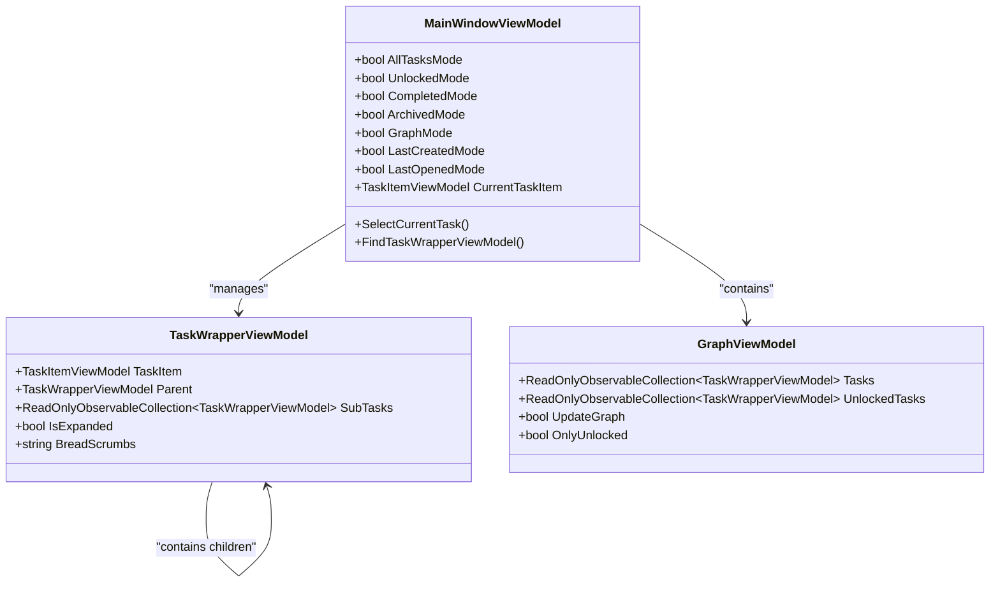
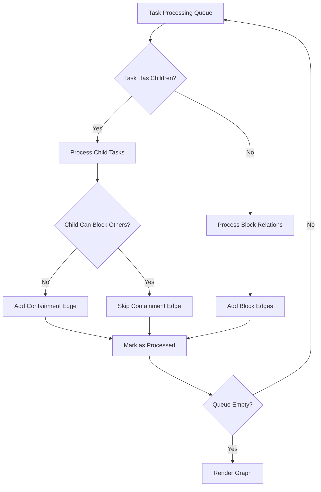
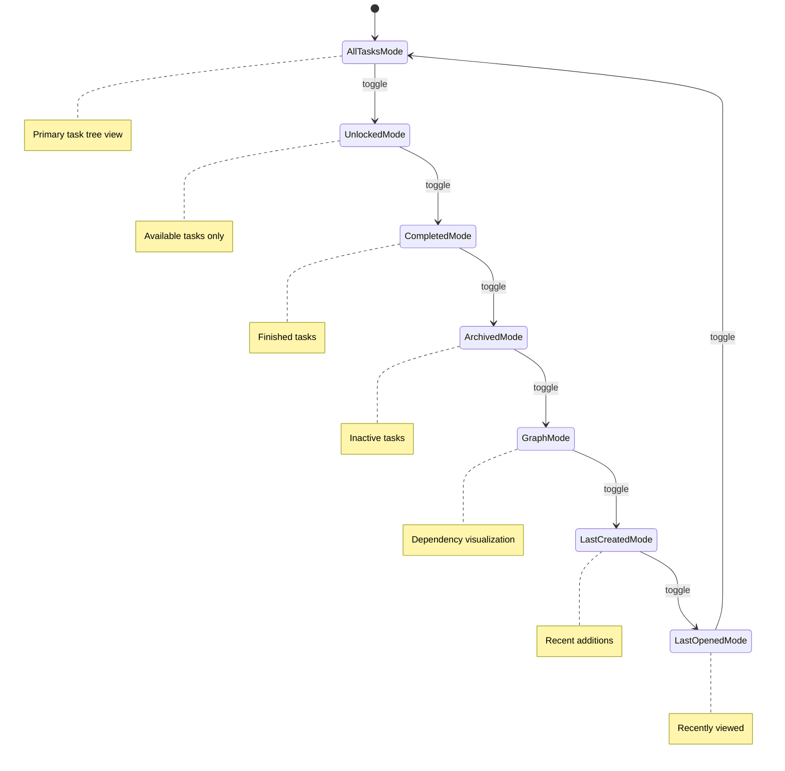
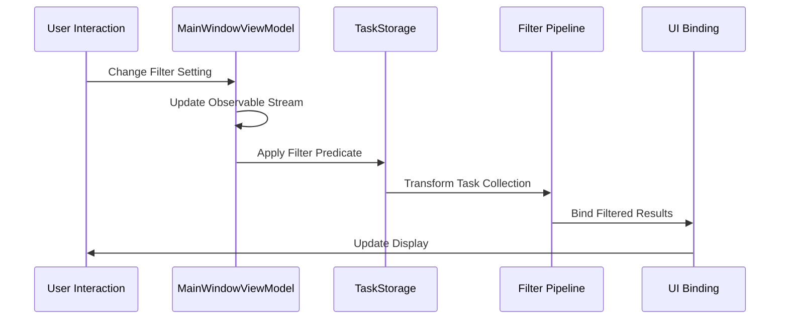
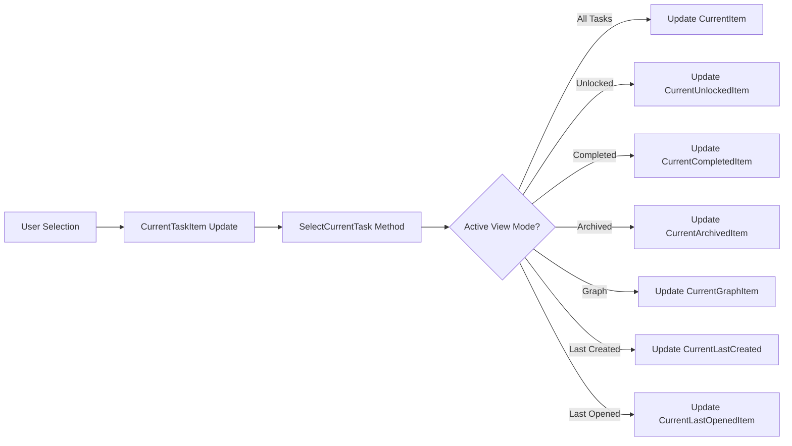

# Views and Navigation

<cite>
**Referenced Files in This Document**
- [MainWindowViewModel.cs](file://src/Unlimotion.ViewModel/MainWindowViewModel.cs)
- [GraphViewModel.cs](file://src/Unlimotion.ViewModel/GraphViewModel.cs)
- [UnlockedTimeFilter.cs](file://src/Unlimotion.ViewModel/UnlockedTimeFilter.cs)
- [GraphControl.axaml.cs](file://src/Unlimotion/Views/GraphControl.axaml.cs)
- [TaskItemViewModel.cs](file://src/Unlimotion.ViewModel/TaskItemViewModel.cs)
- [TaskWrapperViewModel.cs](file://src/Unlimotion.ViewModel/TaskWrapperViewModel.cs)
- [SortDefinition.cs](file://src/Unlimotion.ViewModel/SortDefinition.cs)
- [DateFilter.cs](file://src/Unlimotion.ViewModel/DateFilter.cs)
- [DurationFilter.cs](file://src/Unlimotion.ViewModel/DurationFilter.cs)
- [MainWindow.axaml.cs](file://src/Unlimotion/Views/MainWindow.axaml.cs)
- [MainScreen.axaml.cs](file://src/Unlimotion/Views/MainScreen.axaml.cs)
</cite>

## Table of Contents
1. [Introduction](#introduction)
2. [Navigation System Architecture](#navigation-system-architecture)
3. [All Tasks View](#all-tasks-view)
4. [Unlocked View](#unlocked-view)
5. [Completed and Archived Views](#completed-and-archived-views)
6. [Roadmap View](#roadmap-view)
7. [Last Created View](#last-created-view)
8. [View Management System](#view-management-system)
9. [ReactiveUI Observables and Filtering](#reactiveui-observables-and-filtering)
10. [Task Selection Synchronization](#task-selection-synchronization)
11. [Advanced Filtering Systems](#advanced-filtering-systems)
12. [Performance Considerations](#performance-considerations)
13. [Conclusion](#conclusion)

## Introduction

Unlimotion's application employs a sophisticated multi-view navigation system built on ReactiveUI framework principles. The system provides six distinct task views, each serving specific organizational and analytical purposes while maintaining seamless synchronization across the interface. The navigation architecture leverages observable streams, hierarchical task structures, and real-time filtering to deliver an intuitive task management experience.

## Navigation System Architecture

The navigation system centers around the `MainWindowViewModel` class, which orchestrates seven primary view modes through boolean properties that act as mutually exclusive selectors. This architecture ensures that only one view mode is active at any given time, preventing conflicts and maintaining UI consistency.

**Diagram sources**
- [MainWindowViewModel.cs](file://src/Unlimotion.ViewModel/MainWindowViewModel.cs#L941-L972)
- [TaskWrapperViewModel.cs](file://src/Unlimotion.ViewModel/TaskWrapperViewModel.cs#L50-L125)
- [GraphViewModel.cs](file://src/Unlimotion.ViewModel/GraphViewModel.cs#L7-L30)

**Section sources**
- [MainWindowViewModel.cs](file://src/Unlimotion.ViewModel/MainWindowViewModel.cs#L941-L972)

## All Tasks View

The All Tasks view serves as the primary organizational interface, displaying a hierarchical tree structure of tasks with expandable parent-child relationships. This view emphasizes task completion status and availability, making it ideal for comprehensive task management.

### Hierarchical Organization

The All Tasks view utilizes a sophisticated tree structure where each task can contain child tasks, forming nested relationships. The view automatically expands parent tasks when their child tasks are selected, enhancing usability and providing immediate context.

### Filtering and Display Logic

The view applies comprehensive filtering based on task completion states:
- **Active Tasks**: Tasks where `IsCompleted == false`
- **Completed Tasks**: Tasks where `IsCompleted == true` (when ShowCompleted is enabled)
- **Archived Tasks**: Tasks where `IsCompleted == null` (when ShowArchived is enabled)

### Real-Time Updates

The All Tasks view maintains real-time synchronization through ReactiveUI observables that monitor task changes, completion status modifications, and structural updates. This ensures that any modification to task relationships or completion states immediately reflects in the view hierarchy.

**Section sources**
- [MainWindowViewModel.cs](file://src/Unlimotion.ViewModel/MainWindowViewModel.cs#L437-L475)

## Unlocked View

The Unlocked view focuses exclusively on tasks that are currently available for completion, determined by the `UnlockedTimeFilter` criteria. This view helps users concentrate on actionable tasks based on temporal and planning factors.

### Unlock Criteria

Tasks qualify as "unlocked" when they meet two conditions:
1. `IsCanBeCompleted == true`: The task is eligible for completion
2. `IsCompleted == false`: The task hasn't been marked as completed

### Temporal Filtering

The Unlocked view incorporates five temporal categories defined in `UnlockedTimeFilter.GetDefinitions()`:

| Category | Predicate Condition | Description |
|----------|-------------------|-------------|
| Unplanned | `PlannedBeginDateTime == null && PlannedEndDateTime == null` | Tasks without scheduling |
| Overdue | `PlannedEndDateTime != null && DateTime.Now.Date > PlannedEndDateTime.Date` | Past-due tasks |
| Urgent | `PlannedEndDateTime != null && DateTime.Now.Date == PlannedEndDateTime.Date` | Due today |
| Today | `PlannedBeginDateTime != null && DateTime.Now.Date == PlannedBeginDateTime.Date` | Scheduled for today |
| Maybe | Complex condition covering future and flexible scheduling | Flexible timeline tasks |
| Future | `PlannedBeginDateTime != null && PlannedBeginDateTime.Date > DateTime.Now.Date` | Upcoming tasks |

### Dynamic Filtering

The view dynamically applies unlock filters based on user selections, allowing users to focus on specific temporal categories while maintaining the core unlock criteria.

**Section sources**
- [UnlockedTimeFilter.cs](file://src/Unlimotion.ViewModel/UnlockedTimeFilter.cs#L13-L57)
- [MainWindowViewModel.cs](file://src/Unlimotion.ViewModel/MainWindowViewModel.cs#L378-L410)

## Completed and Archived Views

The application provides separate views for completed and archived tasks, each serving distinct organizational purposes.

### Completed View

The Completed view displays tasks that have been marked as finished (`IsCompleted == true`). This view prioritizes chronological organization, sorting tasks by completion date in descending order to show recent completions at the top.

### Archived View

The Archived view shows tasks that have been moved to an inactive state (`IsCompleted == null`). These tasks are typically removed from active consideration but retained for historical reference. The view also sorts by archive date in descending order.

### State-Based Filtering

Both views utilize state-based filtering:
- **Completed View**: Filters tasks where `IsCompleted == true`
- **Archived View**: Filters tasks where `IsCompleted == null`

### Date Range Filtering

Both views support date range filtering through the `CompletedDateFilter` and `ArchivedDateFilter` systems, enabling users to focus on specific time periods for review and analysis.

**Section sources**
- [MainWindowViewModel.cs](file://src/Unlimotion.ViewModel/MainWindowViewModel.cs#L520-L580)
- [MainWindowViewModel.cs](file://src/Unlimotion.ViewModel/MainWindowViewModel.cs#L582-L620)

## Roadmap View

The Roadmap view provides a graph-based visualization of task dependencies using the `GraphControl` and `GraphViewModel` components. This view transforms the hierarchical task structure into a network representation that highlights relationships and dependencies.

### Graph Construction

The `GraphControl` builds visual representations by analyzing task relationships:

**Diagram sources**
- [GraphControl.axaml.cs](file://src/Unlimotion/Views/GraphControl.axaml.cs#L75-L150)

### Dependency Visualization

The graph system distinguishes between two types of relationships:
- **Containment Edges**: Represent parent-child task relationships where child tasks are contained within parent tasks
- **Block Edges**: Represent blocking relationships where tasks prevent each other from being completed

### Interactive Features

The Roadmap view supports interactive navigation:
- **Zoom Controls**: Keyboard shortcuts for zooming and panning
- **Selection Synchronization**: Clicking on graph nodes selects corresponding tasks in other views
- **Dynamic Updates**: Real-time updates when task relationships change

**Section sources**
- [GraphControl.axaml.cs](file://src/Unlimotion/Views/GraphControl.axaml.cs#L75-L150)
- [GraphViewModel.cs](file://src/Unlimotion.ViewModel/GraphViewModel.cs#L7-L30)

## Last Created View

The Last Created view displays tasks in reverse chronological order based on creation date, providing quick access to recently added tasks. This view is particularly useful for tracking new additions and maintaining awareness of recent activity.

### Sorting Mechanism

The view applies a descending sort on `CreatedDateTime`, ensuring that newly created tasks appear at the top of the list regardless of their completion status or other attributes.

### Filtering Capabilities

Like other views, the Last Created view supports comprehensive filtering including:
- **Temporal Filters**: Creation date range limitations
- **Emoji Filters**: Category-based task grouping
- **Completion Status**: Show/hide based on completion state
- **Wanted Status**: Focus on desired tasks

### Use Cases

This view serves several practical purposes:
- **Recent Activity Monitoring**: Quick identification of new tasks
- **Workflow Tracking**: Following the progression of recent projects
- **Priority Assessment**: Evaluating the impact of new tasks on existing workload

**Section sources**
- [MainWindowViewModel.cs](file://src/Unlimotion.ViewModel/MainWindowViewModel.cs#L622-L680)

## View Management System

The `MainWindowViewModel` orchestrates view switching through a sophisticated state management system that ensures mutual exclusivity and maintains consistency across the interface.

### Mode Properties

The view system operates through seven exclusive boolean properties:

### Selection Synchronization

The `SelectCurrentTask()` method ensures that when switching between views, the currently selected task remains synchronized across all view modes. This prevents loss of context when users navigate between different organizational perspectives.

### Current Item Management

Each view mode maintains its own current item reference:
- `CurrentItem`: All Tasks view selection
- `CurrentUnlockedItem`: Unlocked view selection  
- `CurrentCompletedItem`: Completed view selection
- `CurrentArchivedItem`: Archived view selection
- `CurrentGraphItem`: Graph view selection
- `CurrentLastCreated`: Last Created view selection
- `CurrentLastOpenedItem`: Last Opened view selection

**Section sources**
- [MainWindowViewModel.cs](file://src/Unlimotion.ViewModel/MainWindowViewModel.cs#L840-L876)

## ReactiveUI Observables and Filtering

Unlimotion's filtering system leverages ReactiveUI's powerful observable streams to create dynamic, responsive filtering that adapts in real-time to user interactions and data changes.

### Observable Streams Architecture

The filtering system operates through a pipeline of observable transformations:

**Diagram sources**
- [MainWindowViewModel.cs](file://src/Unlimotion.ViewModel/MainWindowViewModel.cs#L183-L216)

### Task Filtering Pipeline

Each view mode establishes its own filtering pipeline:

1. **Base Filter**: Completion state filtering
2. **Temporal Filter**: Date range restrictions
3. **Category Filter**: Emoji-based grouping
4. **Custom Filter**: User-defined criteria
5. **Sorting**: Ordered presentation

### Dynamic Filter Composition

Filters are composed dynamically based on user selections:
- **Emoji Filters**: Enable/disable specific task categories
- **Duration Filters**: Filter by planned task duration
- **Time Filters**: Temporal unlock criteria
- **Wanted Filters**: Focus on desired tasks

### Performance Optimizations

The reactive system includes several performance optimizations:
- **Throttled Updates**: Prevents excessive re-computation
- **Selective Refresh**: Only affected areas update
- **Memory Management**: Automatic cleanup of unused subscriptions

**Section sources**
- [MainWindowViewModel.cs](file://src/Unlimotion.ViewModel/MainWindowViewModel.cs#L246-L282)
- [MainWindowViewModel.cs](file://src/Unlimotion.ViewModel/MainWindowViewModel.cs#L347-L410)

## Task Selection Synchronization

The application maintains consistent task selection across all view modes through a sophisticated synchronization system that tracks the currently selected task and updates all relevant view contexts.

### Selection Tracking

The `CurrentTaskItem` property serves as the central selection anchor, with each view mode maintaining its own specialized current item reference. This design ensures that selection state is preserved appropriately for each view's context.

### Cross-View Synchronization

When users select a task in one view, the selection automatically propagates to other views through the selection synchronization mechanism:

**Diagram sources**
- [MainWindowViewModel.cs](file://src/Unlimotion.ViewModel/MainWindowViewModel.cs#L840-L876)

### Selection Persistence

The synchronization system preserves selection context during view transitions:
- **Task Preservation**: Selected tasks remain highlighted when switching views
- **Hierarchy Maintenance**: Parent-child relationships are maintained during selection
- **Scroll Position**: Selection updates preserve scroll position in tree views

### Conflict Resolution

When multiple views attempt to modify the same task simultaneously, the system resolves conflicts through:
- **Last-Write-Wins**: More recent operations take precedence
- **Validation Checks**: Ensures data integrity during concurrent modifications
- **Rollback Capability**: Ability to undo conflicting changes

**Section sources**
- [MainWindowViewModel.cs](file://src/Unlimotion.ViewModel/MainWindowViewModel.cs#L183-L216)

## Advanced Filtering Systems

Unlimotion implements multiple sophisticated filtering systems that work together to provide comprehensive task organization and discovery capabilities.

### Emoji-Based Filtering

The emoji filter system enables category-based task organization:

| Filter Type | Purpose | Implementation |
|-------------|---------|----------------|
| All Emoji Filter | Show all tasks regardless of category | Universal filter |
| Specific Emoji Filters | Filter by individual categories | Emoji-based predicate |
| Exclusion Filters | Hide specific categories | Negative filtering |

### Duration-Based Filtering

The duration filter system categorizes tasks by planned duration:

| Duration Range | Predicate | Use Case |
|----------------|-----------|----------|
| No Duration | `PlannedDuration == null` | Tasks without time estimates |
| ≤5 minutes | `PlannedDuration <= 5 min` | Quick tasks |
| 5-30 minutes | `5 min < Duration <= 30 min` | Short tasks |
| 30 minutes - 2 hours | `30 min < Duration <= 2 hours` | Medium tasks |
| 2-24 hours | `2 hours < Duration <= 1 day` | Long tasks |
| >24 hours | `Duration > 1 day` | Extended projects |

### Temporal Filtering

Multiple temporal filtering systems provide different time-based perspectives:

- **Creation Date Filter**: Track task birth dates
- **Completion Date Filter**: Monitor task finish times  
- **Archive Date Filter**: Manage inactive task timelines
- **Unlock Time Filter**: Schedule-based availability

### Wanted Status Filtering

The wanted filter system allows users to mark and filter tasks based on personal importance or interest, providing a customizable priority system.

**Section sources**
- [MainWindowViewModel.cs](file://src/Unlimotion.ViewModel/MainWindowViewModel.cs#L280-L315)
- [DurationFilter.cs](file://src/Unlimotion.ViewModel/DurationFilter.cs#L13-L50)
- [DateFilter.cs](file://src/Unlimotion.ViewModel/DateFilter.cs#L13-L75)

## Performance Considerations

The reactive filtering system is designed with performance optimization in mind, employing several strategies to maintain responsiveness even with large task collections.

### Memory Management

- **Automatic Disposal**: All observable subscriptions are automatically disposed when no longer needed
- **Weak References**: Prevents memory leaks in long-running applications
- **Lazy Loading**: Task hierarchies are loaded on-demand to reduce initial memory footprint

### Computational Efficiency

- **Throttled Updates**: Prevents excessive computation during rapid user interactions
- **Incremental Updates**: Only affected portions of the task tree are reprocessed
- **Caching Strategies**: Frequently accessed data is cached to avoid redundant calculations

### Scalability Features

- **Virtualization**: Large task lists use virtual scrolling to maintain performance
- **Batch Operations**: Multiple task modifications are batched to reduce overhead
- **Background Processing**: Heavy computations occur on background threads

### Monitoring and Diagnostics

The system includes built-in performance monitoring to identify bottlenecks and optimize resource usage.

## Conclusion

Unlimotion's views and navigation system represents a sophisticated approach to task management interface design. Through the integration of ReactiveUI observables, hierarchical task structures, and comprehensive filtering systems, the application provides users with multiple perspectives on their task collections while maintaining consistency and performance.

The modular architecture ensures that each view mode can evolve independently while sharing common infrastructure, making the system both maintainable and extensible. The reactive foundation guarantees that the interface remains responsive and up-to-date, even as task collections grow in size and complexity.

This design demonstrates how modern MVVM frameworks can be leveraged to create intuitive, powerful task management interfaces that adapt to user needs while providing deep analytical capabilities through multiple view perspectives.