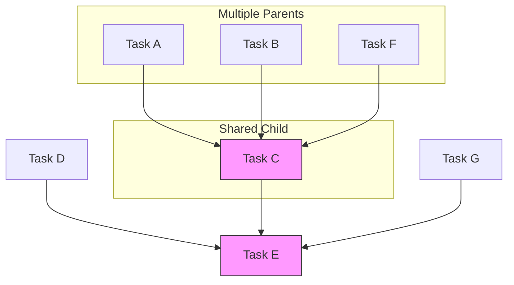
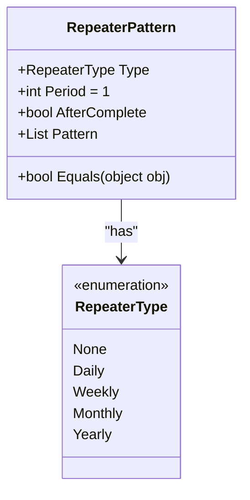
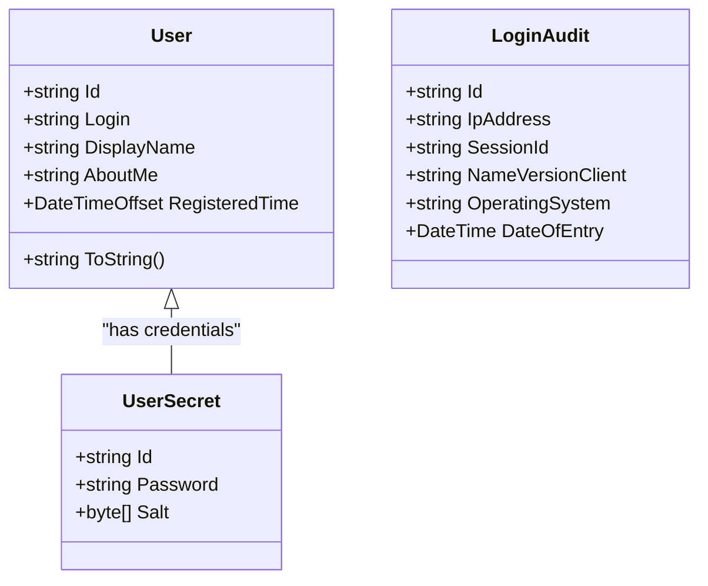
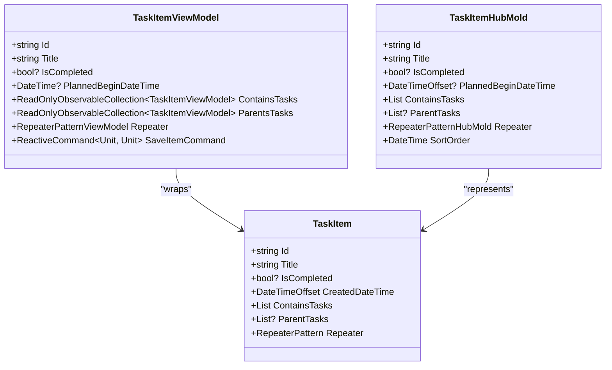
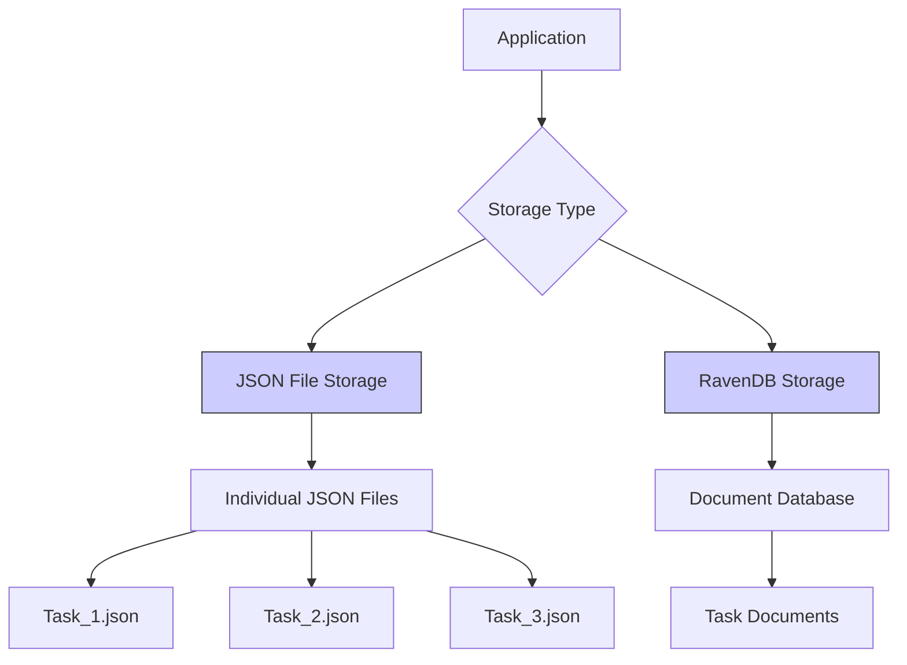
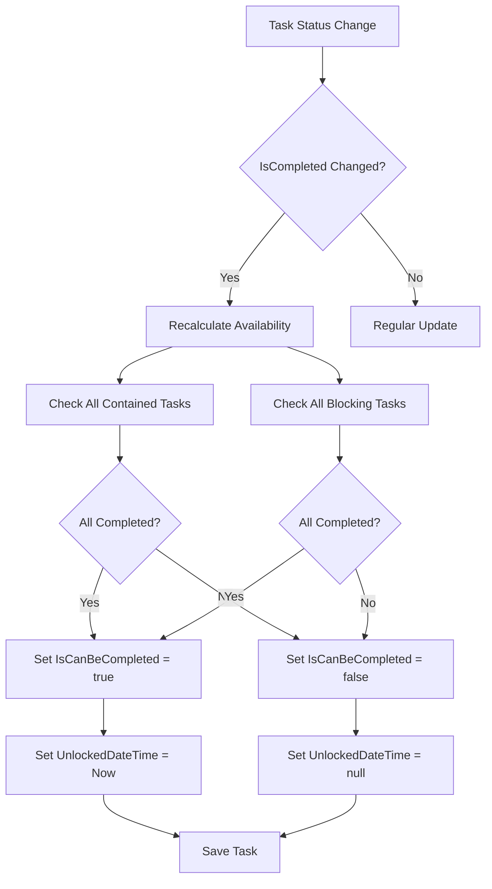

# Data Models

<cite>
**Referenced Files in This Document**   
- [TaskItem.cs](file://src/Unlimotion.Domain/TaskItem.cs)
- [RepeaterPattern.cs](file://src/Unlimotion.Domain/RepeaterPattern.cs)
- [RepeaterType.cs](file://src/Unlimotion.Domain/RepeaterType.cs)
- [User.cs](file://src/Unlimotion.Domain/User.cs)
- [LoginAudit.cs](file://src/Unlimotion.Domain/LoginAudit.cs)
- [TaskItemViewModel.cs](file://src/Unlimotion.ViewModel/TaskItemViewModel.cs)
- [TaskItemHubMold.cs](file://src/Unlimotion.Interface/TaskItemHubMold.cs)
- [ServerTaskStorage.cs](file://src/Unlimotion/ServerTaskStorage.cs)
- [TaskTreeManager.cs](file://src/Unlimotion.TaskTreeManager/TaskTreeManager.cs)
</cite>

## Table of Contents
1. [Introduction](#introduction)
2. [Core Entity: TaskItem](#core-entity-taskitem)
3. [Task Relationships and Graph Structure](#task-relationships-and-graph-structure)
4. [Recurring Tasks: RepeaterPattern](#recurring-tasks-repeaterpattern)
5. [User and Authentication Models](#user-and-authentication-models)
6. [Model Inheritance and Layering](#model-inheritance-and-layering)
7. [Data Storage and Serialization](#data-storage-and-serialization)
8. [Business Rules and Validation](#business-rules-and-validation)
9. [Conclusion](#conclusion)

## Introduction
This document provides comprehensive documentation of Unlimotion's core data models, detailing the structure, relationships, and behavior of the application's primary entities. The system is built around a flexible task management model that supports complex hierarchical relationships, recurring tasks, and sophisticated blocking logic. The data model is designed to support both JSON file storage and RavenDB document storage, with consistent serialization of complex object graphs. The architecture follows a clean separation of concerns with distinct domain, view, and service models, enabling robust business logic implementation and cross-platform compatibility.

## Core Entity: TaskItem
The TaskItem is the central entity in Unlimotion's data model, representing individual tasks with rich metadata and complex behavioral rules. The domain model contains comprehensive properties for task management, including temporal, relational, and status information.

### TaskItem Properties
The TaskItem schema includes the following key properties:

| Property | Type | Description | Default Value |
|---------|------|-------------|---------------|
| Id | string | Unique identifier for the task | Generated |
| UserId | string | Reference to the owning user | null |
| Title | string | Task name or description | null |
| Description | string | Detailed task description | null |
| IsCompleted | bool? | Three-state completion status (true/false/null) | false |
| IsCanBeCompleted | bool | Whether the task meets all prerequisites for completion | true |
| CreatedDateTime | DateTimeOffset | Timestamp when the task was created | Current UTC time |
| UnlockedDateTime | DateTimeOffset? | When the task became available for completion | null |
| CompletedDateTime | DateTimeOffset? | When the task was marked as completed | null |
| ArchiveDateTime | DateTimeOffset? | When the task was archived | null |
| PlannedBeginDateTime | DateTimeOffset? | Scheduled start time | null |
| PlannedEndDateTime | DateTimeOffset? | Scheduled end time | null |
| PlannedDuration | TimeSpan? | Expected duration of the task | null |
| Importance | int | Priority level of the task | 0 |
| Wanted | bool | Whether the task is desired or obligatory | false |
| Version | int | Concurrency control version | 0 |
| SortOrder | DateTime? | Ordering for display purposes | null |

**Section sources**
- [TaskItem.cs](file://src/Unlimotion.Domain/TaskItem.cs#L1-L32)

## Task Relationships and Graph Structure
Unlimotion implements a sophisticated directed acyclic graph (DAG) structure for task relationships, allowing for complex organizational patterns beyond simple hierarchical trees.

### Relationship Collections
The TaskItem maintains four primary relationship collections that define its position in the task graph:

| Collection | Type | Purpose | Relationship Type |
|-----------|------|---------|-------------------|
| ContainsTasks | List<string> | Child tasks contained within this task | Composition |
| ParentTasks | List<string>? | Parent tasks that contain this task | Composition |
| BlocksTasks | List<string> | Tasks that this task blocks | Dependency |
| BlockedByTasks | List<string>? | Tasks that block this task | Dependency |

This structure enables multiple inheritance patterns where a task can have multiple parents, creating a DAG rather than a strict tree. The graph structure supports complex workflows where tasks can be components of multiple larger projects or objectives simultaneously.

**Diagram sources**
- [TaskItem.cs](file://src/Unlimotion.Domain/TaskItem.cs#L15-L18)

**Section sources**
- [TaskItem.cs](file://src/Unlimotion.Domain/TaskItem.cs#L15-L18)
- [TaskTreeManager.cs](file://src/Unlimotion.TaskTreeManager/TaskTreeManager.cs#L100-L150)

## Recurring Tasks: RepeaterPattern
The RepeaterPattern model enables the creation of recurring tasks with flexible scheduling options, supporting daily, weekly, monthly, and yearly recurrence patterns.

### RepeaterPattern Properties
| Property | Type | Description | Default Value |
|---------|------|-------------|---------------|
| Type | RepeaterType | Frequency type (None, Daily, Weekly, Monthly, Yearly) | None |
| Period | int | Interval multiplier (e.g., every 2 days) | 1 |
| AfterComplete | bool | Whether to create next occurrence after completion | false |
| Pattern | List<int> | Additional pattern data (e.g., specific days of week) | null |

The RepeaterType enumeration defines the available recurrence frequencies:
- None: No recurrence
- Daily: Daily recurrence
- Weekly: Weekly recurrence
- Monthly: Monthly recurrence  
- Yearly: Yearly recurrence

When a recurring task is completed, the system automatically creates a new instance with updated planned dates according to the recurrence pattern, provided the repeater configuration specifies this behavior.

**Diagram sources**
- [RepeaterPattern.cs](file://src/Unlimotion.Domain/RepeaterPattern.cs#L1-L23)
- [RepeaterType.cs](file://src/Unlimotion.Domain/RepeaterType.cs#L1-L9)

**Section sources**
- [RepeaterPattern.cs](file://src/Unlimotion.Domain/RepeaterPattern.cs#L1-L23)
- [RepeaterType.cs](file://src/Unlimotion.Domain/RepeaterType.cs#L1-L9)
- [TaskTreeManager.cs](file://src/Unlimotion.TaskTreeManager/TaskTreeManager.cs#L500-L530)

## User and Authentication Models
The user management system consists of two related models that handle user identity and authentication tracking.

### User Model
The User entity represents system users with basic profile information:

| Property | Type | Description |
|---------|------|-------------|
| Id | string | Unique identifier |
| Login | string | User's login name |
| DisplayName | string | Display name for the user |
| AboutMe | string | User biography or description |
| RegisteredTime | DateTimeOffset | Account creation timestamp |

### UserSecret Model
The UserSecret class (not directly referenced in the main document but part of the User file) handles authentication credentials:

| Property | Type | Description |
|---------|------|-------------|
| Id | string | Reference to User Id |
| Password | string | Hashed password |
| Salt | byte[] | Password salt for hashing |

### LoginAudit Model
The LoginAudit entity tracks user authentication history:

| Property | Type | Description |
|---------|------|-------------|
| Id | string | Unique identifier |
| IpAddress | string | Client IP address |
| SessionId | string | Authentication session identifier |
| NameVersionClient | string | Client application information |
| OperatingSystem | string | Client operating system |
| DateOfEntry | DateTime | Timestamp of login event |

**Diagram sources**
- [User.cs](file://src/Unlimotion.Domain/User.cs#L1-L24)
- [LoginAudit.cs](file://src/Unlimotion.Domain/LoginAudit.cs#L1-L13)

**Section sources**
- [User.cs](file://src/Unlimotion.Domain/User.cs#L1-L24)
- [LoginAudit.cs](file://src/Unlimotion.Domain/LoginAudit.cs#L1-L13)

## Model Inheritance and Layering
Unlimotion implements a layered architecture with distinct models for different application layers, following the principle of separation of concerns.

### Domain Model Hierarchy
The system maintains three primary representations of task data:

1. **Domain Model (TaskItem)**: Business logic entity with complete data and behavior
2. **View Model (TaskItemViewModel)**: UI-focused representation with reactive properties and commands
3. **Service Model (TaskItemHubMold)**: Serialization-optimized model for API communication

### Inheritance Relationships
The TaskItemViewModel inherits from DisposableList and encapsulates the TaskItem domain model, providing additional UI-specific functionality like command bindings and observable collections. The TaskItemHubMold serves as a DTO (Data Transfer Object) for network transmission, containing a flattened representation of the task data optimized for serialization.

**Diagram sources**
- [TaskItem.cs](file://src/Unlimotion.Domain/TaskItem.cs#L1-L32)
- [TaskItemViewModel.cs](file://src/Unlimotion.ViewModel/TaskItemViewModel.cs#L1-L50)
- [TaskItemHubMold.cs](file://src/Unlimotion.Interface/TaskItemHubMold.cs#L1-L28)

**Section sources**
- [TaskItem.cs](file://src/Unlimotion.Domain/TaskItem.cs#L1-L32)
- [TaskItemViewModel.cs](file://src/Unlimotion.ViewModel/TaskItemViewModel.cs#L1-L50)
- [TaskItemHubMold.cs](file://src/Unlimotion.Interface/TaskItemHubMold.cs#L1-L28)

## Data Storage and Serialization
Unlimotion supports multiple storage backends with consistent data representation across different persistence mechanisms.

### Storage Implementations
The system implements two primary storage mechanisms:

1. **JSON File Storage**: File-based persistence using individual JSON files per task
2. **RavenDB Document Storage**: NoSQL document database storage with advanced querying capabilities

Both storage implementations serialize the complete object graph, including all relationships and nested entities. The ServerTaskStorage class handles RavenDB operations, while FileTaskStorage manages the JSON file system.

### Serialization Considerations
Complex object graphs are serialized with reference preservation, maintaining the integrity of the directed acyclic graph structure. The system handles circular references through careful design of the relationship collections, ensuring that parent-child relationships are represented by ID references rather than direct object references.

**Section sources**
- [ServerTaskStorage.cs](file://src/Unlimotion/ServerTaskStorage.cs#L1-L50)
- [FileTaskStorage.cs](file://src/Unlimotion/FileTaskStorage.cs#L1-L50)

## Business Rules and Validation
The system enforces several critical business rules to maintain data integrity and support the application's workflow requirements.

### Completion State Rules
The three-state IsCompleted property (true, false, null) enables sophisticated task management:
- **true**: Task is completed
- **false**: Task is active and not completed
- **null**: Task is archived (treated as completed for blocking purposes)

Archived tasks (IsCompleted = null) are treated as completed when evaluating blocking conditions, allowing for clean task history while maintaining workflow integrity.

### Data Validation Rules
Key validation rules include:
- Tasks must have non-empty names before creation is allowed
- Parent-child relationships must not create cycles (enforced by DAG structure)
- Completion status changes trigger automatic availability recalculation
- Recurring tasks generate new instances according to their RepeaterPattern

### Availability Calculation
A task's IsCanBeCompleted status is determined by two conditions:
1. All contained tasks must be completed (IsCompleted != false)
2. All blocking tasks must be completed (IsCompleted != false)

When these conditions are met, IsCanBeCompleted is set to true and UnlockedDateTime is updated. If either condition fails, IsCanBeCompleted is set to false and UnlockedDateTime is cleared.

**Section sources**
- [TaskItem.cs](file://src/Unlimotion.Domain/TaskItem.cs#L10-L11)
- [TaskTreeManager.cs](file://src/Unlimotion.TaskTreeManager/TaskTreeManager.cs#L600-L700)

## Conclusion
Unlimotion's data model is designed to support complex task management workflows with flexible relationships, recurring tasks, and sophisticated dependency rules. The architecture separates concerns through distinct domain, view, and service models, enabling robust business logic implementation while maintaining clean interfaces between application layers. The directed acyclic graph structure for task relationships provides greater flexibility than traditional hierarchical task systems, allowing tasks to participate in multiple contexts simultaneously. The three-state completion model (completed, active, archived) combined with the IsCanBeCompleted availability flag enables sophisticated workflow management that respects both completion status and task dependencies. The system's support for multiple storage backends ensures flexibility in deployment scenarios while maintaining consistent data representation across different persistence mechanisms.