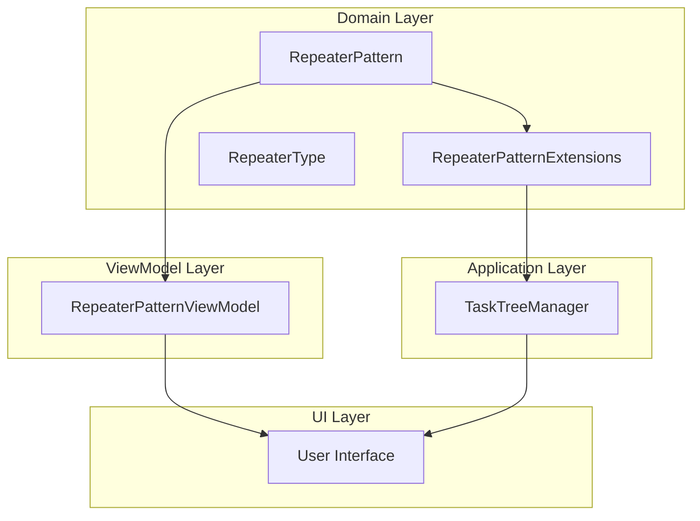
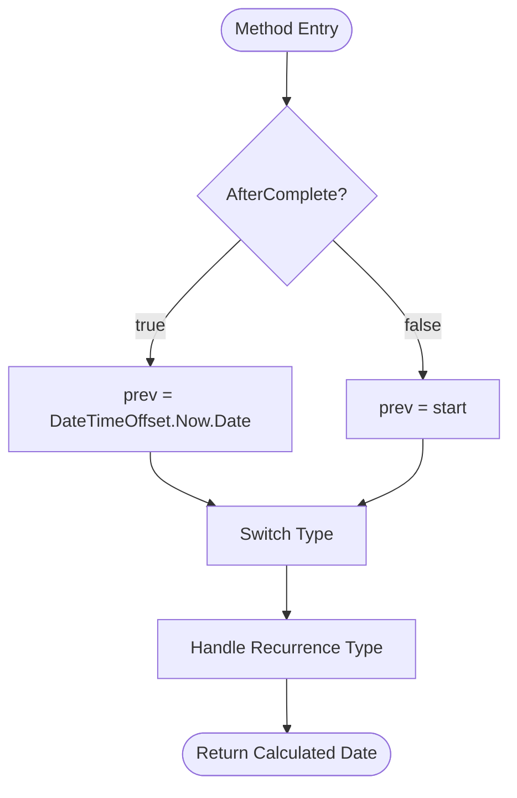
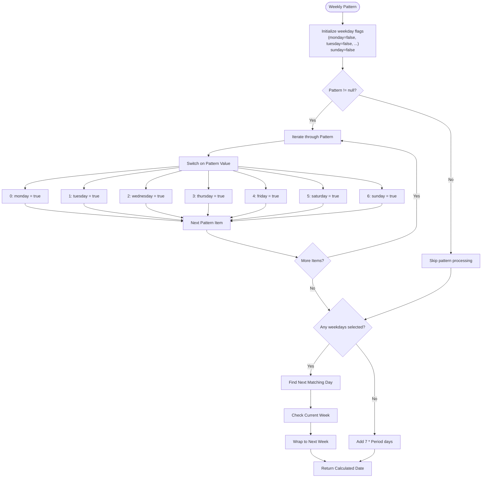
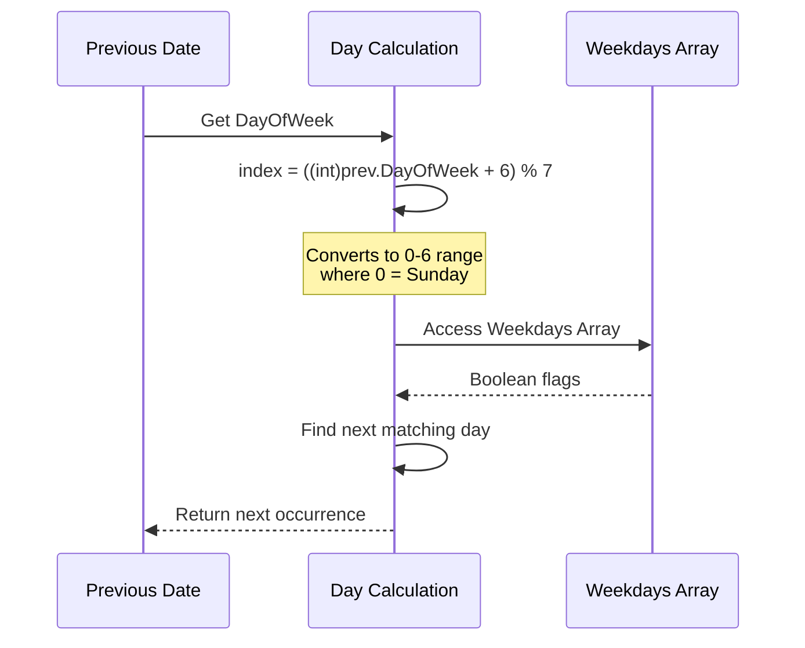
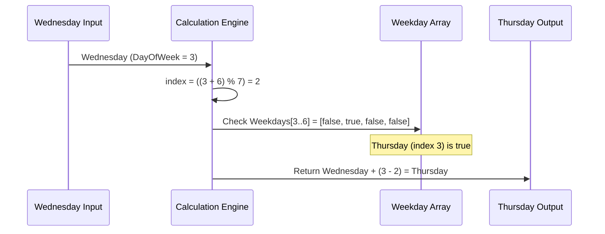
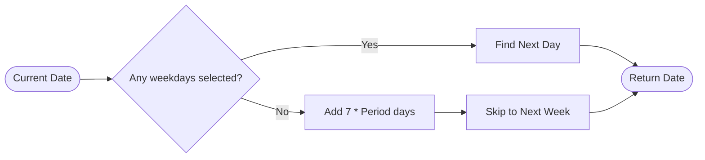
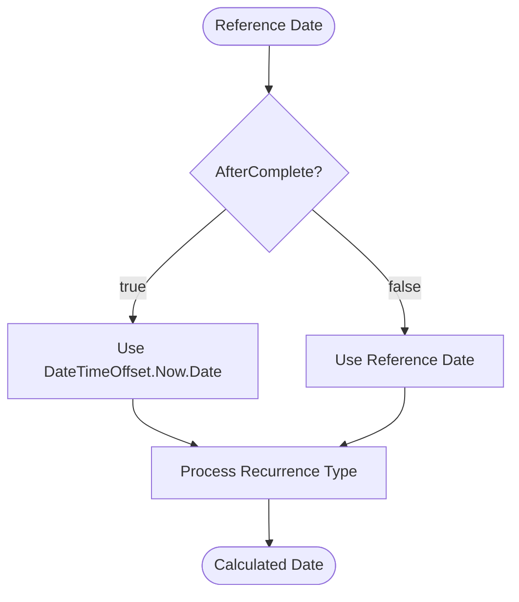
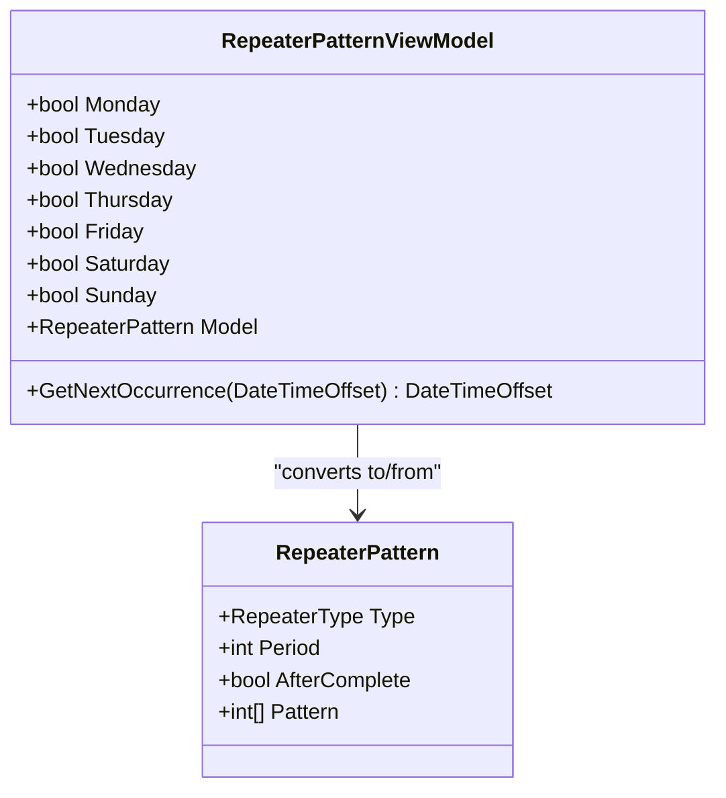
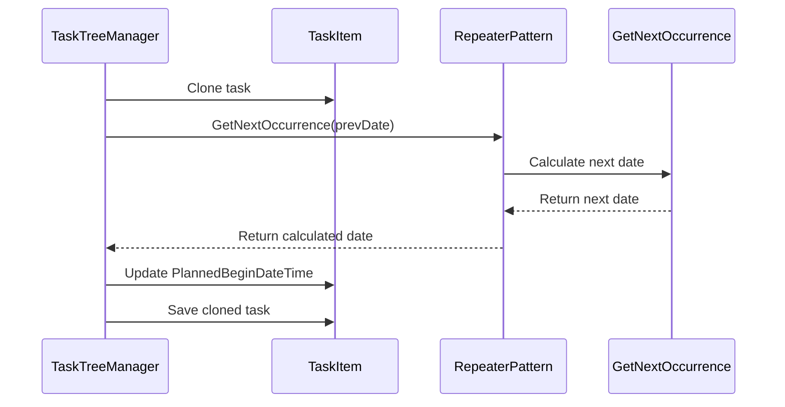

# Next Occurrence Calculation

<cite>
**Referenced Files in This Document**
- [RepeaterPatternExtensions.cs](file://src/Unlimotion.Domain/RepeaterPatternExtensions.cs)
- [RepeaterPattern.cs](file://src/Unlimotion.Domain/RepeaterPattern.cs)
- [RepeaterType.cs](file://src/Unlimotion.Domain/RepeaterType.cs)
- [RepeaterPatternViewModel.cs](file://src/Unlimotion.ViewModel/RepeaterPatternViewModel.cs)
- [TaskTreeManager.cs](file://src/Unlimotion.TaskTreeManager/TaskTreeManager.cs)
</cite>

## Table of Contents
1. [Introduction](#introduction)
2. [Architecture Overview](#architecture-overview)
3. [Core Implementation Analysis](#core-implementation-analysis)
4. [Recurrence Type Handling](#recurrence-type-handling)
5. [Weekly Recurrence Algorithm](#weekly-recurrence-algorithm)
6. [Edge Case Management](#edge-case-management)
7. [Performance Analysis](#performance-analysis)
8. [Practical Examples](#practical-examples)
9. [MVVM Pattern Implementation](#mvvm-pattern-implementation)
10. [Integration Patterns](#integration-patterns)
11. [Conclusion](#conclusion)

## Introduction

The GetNextOccurrence method is a critical component in the Unlimotion scheduling system that calculates the next occurrence date for recurring tasks based on various recurrence patterns. This method serves as the core engine for determining when a task should recur next, handling complex scenarios including weekly patterns with multiple selected days, period-based recurrences, and special AfterComplete flag behavior.

The method operates through two primary implementations: a static extension method in the Domain layer (`RepeaterPatternExtensions`) and a ViewModel implementation (`RepeaterPatternViewModel`) that supports the MVVM pattern for UI binding. Both implementations share identical logic but serve different architectural purposes within the application.

## Architecture Overview

The next occurrence calculation system follows a layered architecture pattern with clear separation of concerns:

**Diagram sources**
- [RepeaterPatternExtensions.cs](file://src/Unlimotion.Domain/RepeaterPatternExtensions.cs#L8-L83)
- [RepeaterPatternViewModel.cs](file://src/Unlimotion.ViewModel/RepeaterPatternViewModel.cs#L105-L172)
- [TaskTreeManager.cs](file://src/Unlimotion.TaskTreeManager/TaskTreeManager.cs#L790-L792)

**Section sources**
- [RepeaterPatternExtensions.cs](file://src/Unlimotion.Domain/RepeaterPatternExtensions.cs#L1-L83)
- [RepeaterPatternViewModel.cs](file://src/Unlimotion.ViewModel/RepeaterPatternViewModel.cs#L1-L172)

## Core Implementation Analysis

Both implementations follow the same fundamental algorithm structure but differ in their presentation and usage contexts:

### Method Signature and Parameters

The GetNextOccurrence method accepts a single parameter: `DateTimeOffset start`, representing the reference date from which to calculate the next occurrence. The method returns a `DateTimeOffset` representing the calculated next occurrence date.

### AfterComplete Flag Processing

The method begins by evaluating the `AfterComplete` flag, which determines the calculation base date:

**Diagram sources**
- [RepeaterPatternExtensions.cs](file://src/Unlimotion.Domain/RepeaterPatternExtensions.cs#L9-L14)
- [RepeaterPatternViewModel.cs](file://src/Unlimotion.ViewModel/RepeaterPatternViewModel.cs#L107-L112)

**Section sources**
- [RepeaterPatternExtensions.cs](file://src/Unlimotion.Domain/RepeaterPatternExtensions.cs#L8-L16)
- [RepeaterPatternViewModel.cs](file://src/Unlimotion.ViewModel/RepeaterPatternViewModel.cs#L105-L113)

## Recurrence Type Handling

The method implements distinct algorithms for each recurrence type, with varying complexity and computational requirements:

### None Type
Returns the previous date unchanged, effectively disabling recurrence.

### Daily Type
Simple addition of the period in days to the previous date.

### Monthly Type
Uses `AddMonths(period)` for month-based recurrence calculations.

### Yearly Type
Uses `AddYears(period)` for year-based recurrence calculations.

### Weekly Type Complexity
The weekly recurrence type represents the most complex algorithm, requiring pattern analysis and day-of-week calculations.

**Section sources**
- [RepeaterPatternExtensions.cs](file://src/Unlimotion.Domain/RepeaterPatternExtensions.cs#L17-L83)
- [RepeaterPatternViewModel.cs](file://src/Unlimotion.ViewModel/RepeaterPatternViewModel.cs#L114-L172)

## Weekly Recurrence Algorithm

The weekly recurrence algorithm is the most sophisticated part of the system, handling multiple selected days and complex day-of-week calculations:

### Pattern to Weekday Flags Conversion

The algorithm begins by converting the integer pattern list into boolean weekday flags:

**Diagram sources**
- [RepeaterPatternExtensions.cs](file://src/Unlimotion.Domain/RepeaterPatternExtensions.cs#L22-L50)
- [RepeaterPatternViewModel.cs](file://src/Unlimotion.ViewModel/RepeaterPatternViewModel.cs#L118-L150)

### Day-of-Week Index Calculation

The algorithm uses a modular arithmetic approach to convert the current day of week to an index:

**Diagram sources**
- [RepeaterPatternExtensions.cs](file://src/Unlimotion.Domain/RepeaterPatternExtensions.cs#L51-L60)
- [RepeaterPatternViewModel.cs](file://src/Unlimotion.ViewModel/RepeaterPatternViewModel.cs#L125-L134)

### Next Day Finding Algorithm

The algorithm implements a two-phase search:

1. **Current Week Search**: Scans forward from the current day to find the next matching day
2. **Next Week Search**: If no match found in current week, searches the next week

**Section sources**
- [RepeaterPatternExtensions.cs](file://src/Unlimotion.Domain/RepeaterPatternExtensions.cs#L51-L75)
- [RepeaterPatternViewModel.cs](file://src/Unlimotion.ViewModel/RepeaterPatternViewModel.cs#L125-L165)

## Edge Case Management

The system handles several edge cases to ensure robust operation:

### Empty Pattern Handling
When no weekdays are selected in a weekly pattern, the algorithm adds 7 * Period days to the previous date, effectively skipping the current week entirely.

### Null Pattern Validation
Both implementations include null checks for the pattern list to prevent null reference exceptions.

### Invalid Type Handling
The method throws `ArgumentOutOfRangeException` for unsupported recurrence types, ensuring type safety.

### Period Validation
While not explicitly shown in the code, the system assumes positive period values, with negative periods potentially causing unexpected behavior.

**Section sources**
- [RepeaterPatternExtensions.cs](file://src/Unlimotion.Domain/RepeaterPatternExtensions.cs#L76-L83)
- [RepeaterPatternViewModel.cs](file://src/Unlimotion.ViewModel/RepeaterPatternViewModel.cs#L166-L172)

## Performance Analysis

### Time Complexity Analysis

| Operation | Time Complexity | Space Complexity |
|-----------|----------------|------------------|
| Daily/Monthly/Yearly | O(1) | O(1) |
| Weekly (no pattern) | O(1) | O(1) |
| Weekly (with pattern) | O(n) where n ≤ 7 | O(1) |
| Pattern conversion | O(m) where m = pattern length | O(1) |

### Computational Efficiency

The weekly algorithm demonstrates optimal efficiency through:
- **Early termination**: Stops searching as soon as a matching day is found
- **Minimal iterations**: Maximum 14 iterations for weekly patterns (7 in current week + 7 in next week)
- **Direct array access**: Uses boolean arrays for constant-time day lookups

### Memory Usage

Both implementations use minimal memory:
- No dynamic allocation during normal operation
- Constant memory footprint regardless of pattern complexity
- Stack-based execution for all operations

## Practical Examples

### Example 1: Weekly Pattern [0,3] from Wednesday

Given a weekly pattern with Monday (0) and Thursday (3) selected, and starting from Wednesday:

**Diagram sources**
- [RepeaterPatternExtensions.cs](file://src/Unlimotion.Domain/RepeaterPatternExtensions.cs#L51-L60)
- [RepeaterPatternViewModel.cs](file://src/Unlimotion.ViewModel/RepeaterPatternViewModel.cs#L125-L134)

### Example 2: Empty Weekly Pattern

When no weekdays are selected, the algorithm adds 7 * Period days:

**Diagram sources**
- [RepeaterPatternExtensions.cs](file://src/Unlimotion.Domain/RepeaterPatternExtensions.cs#L76-L83)
- [RepeaterPatternViewModel.cs](file://src/Unlimotion.ViewModel/RepeaterPatternViewModel.cs#L166-L172)

### Example 3: AfterComplete Flag Behavior

When AfterComplete is true, the calculation uses the current date instead of the reference date:

**Diagram sources**
- [RepeaterPatternExtensions.cs](file://src/Unlimotion.Domain/RepeaterPatternExtensions.cs#L9-L14)
- [RepeaterPatternViewModel.cs](file://src/Unlimotion.ViewModel/RepeaterPatternViewModel.cs#L107-L112)

## MVVM Pattern Implementation

The `RepeaterPatternViewModel` provides a UI-friendly wrapper around the domain model, implementing the MVVM pattern for data binding:

### Property-Based Design

The ViewModel exposes individual weekday properties as boolean flags, allowing for easy UI binding:

| Property | Integer Value | Purpose |
|----------|---------------|---------|
| Monday | 0 | Sunday flag |
| Tuesday | 1 | Monday flag |
| Wednesday | 2 | Tuesday flag |
| Thursday | 3 | Wednesday flag |
| Friday | 4 | Thursday flag |
| Saturday | 5 | Friday flag |
| Sunday | 6 | Saturday flag |

### Bidirectional Data Binding

The ViewModel supports bidirectional data flow between the UI and the underlying domain model:

**Diagram sources**
- [RepeaterPatternViewModel.cs](file://src/Unlimotion.ViewModel/RepeaterPatternViewModel.cs#L10-L172)
- [RepeaterPattern.cs](file://src/Unlimotion.Domain/RepeaterPattern.cs#L6-L23)

### UI Integration Benefits

The ViewModel implementation provides several advantages for UI integration:
- **Observable properties**: Changes automatically notify the UI
- **Validation support**: Can include validation logic
- **Format conversion**: Handles display formatting
- **Command binding**: Supports user interaction patterns

**Section sources**
- [RepeaterPatternViewModel.cs](file://src/Unlimotion.ViewModel/RepeaterPatternViewModel.cs#L10-L172)

## Integration Patterns

### Task Tree Manager Integration

The domain extension method integrates seamlessly with the TaskTreeManager for automatic task cloning and recurrence:

**Diagram sources**
- [TaskTreeManager.cs](file://src/Unlimotion.TaskTreeManager/TaskTreeManager.cs#L790-L792)

### Extension Method Pattern

The static extension method follows .NET conventions for adding functionality to existing types without modification:

**Section sources**
- [TaskTreeManager.cs](file://src/Unlimotion.TaskTreeManager/TaskTreeManager.cs#L790-L792)

## Conclusion

The GetNextOccurrence method represents a sophisticated yet efficient solution for recurring task scheduling in the Unlimotion system. Its dual implementation approach—domain extension method and ViewModel wrapper—demonstrates excellent architectural separation while maintaining functional consistency.

The weekly recurrence algorithm showcases advanced algorithmic thinking with its pattern-to-day conversion, modular arithmetic for day indexing, and efficient two-phase search strategy. The method's robust edge case handling ensures reliable operation across diverse scheduling scenarios.

Performance characteristics demonstrate optimal complexity for each recurrence type, with the weekly algorithm achieving O(n) complexity where n is bounded by 7, ensuring predictable execution times regardless of pattern complexity.

The MVVM pattern implementation in the ViewModel provides seamless UI integration capabilities, enabling rich user experiences while maintaining clean separation between business logic and presentation concerns.