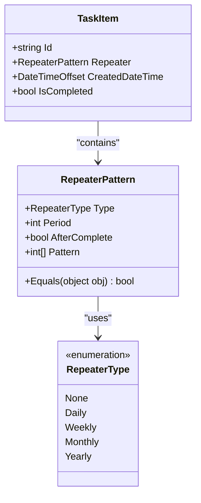
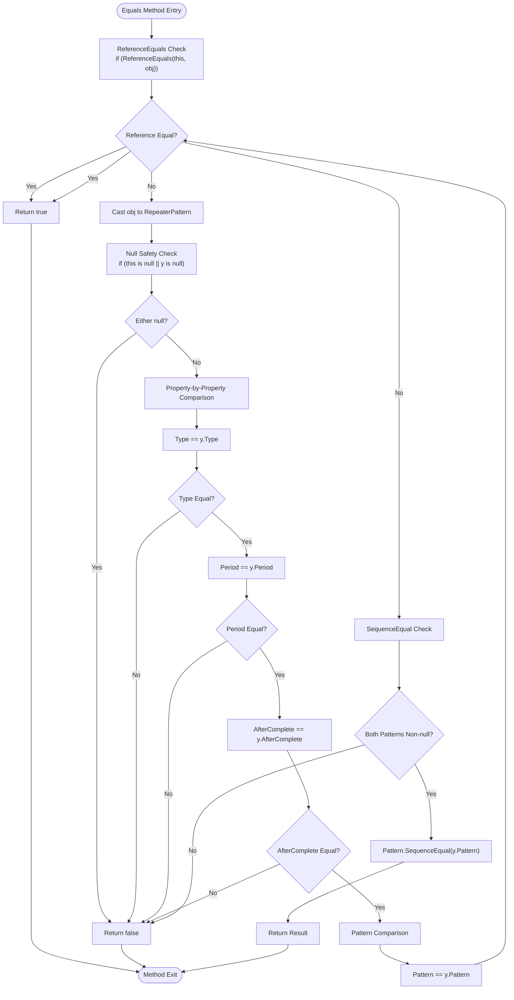
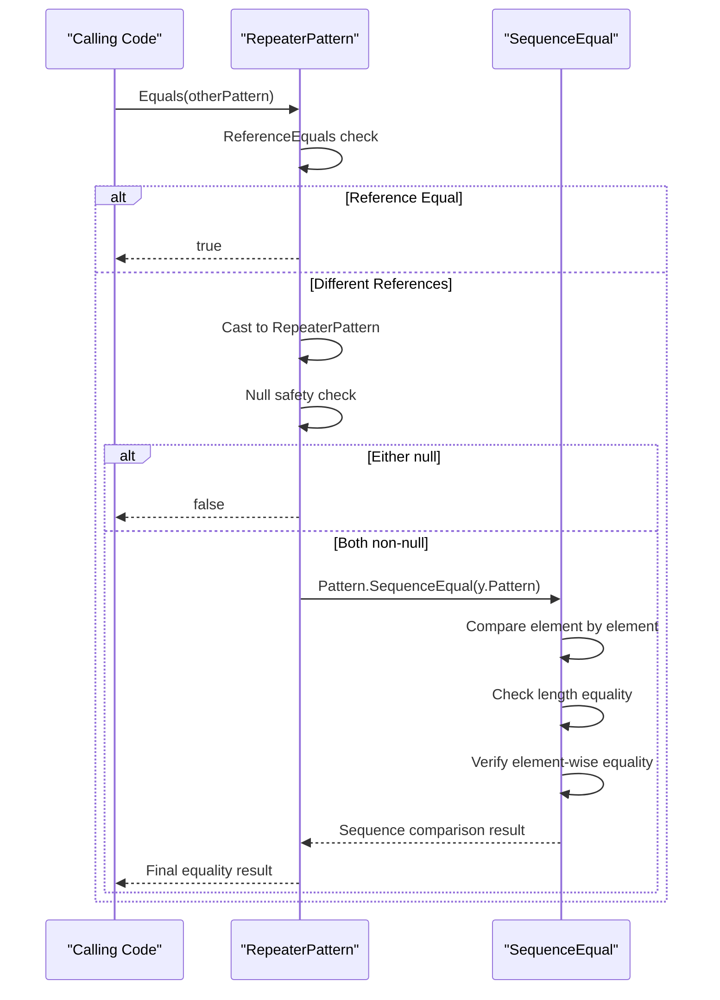
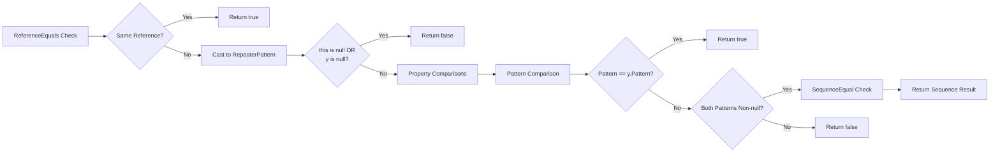

# Pattern Equality and Comparison

<cite>
**Referenced Files in This Document**
- [RepeaterPattern.cs](file://src/Unlimotion.Domain/RepeaterPattern.cs)
- [RepeaterType.cs](file://src/Unlimotion.Domain/RepeaterType.cs)
- [RepeaterPatternExtensions.cs](file://src/Unlimotion.Domain/RepeaterPatternExtensions.cs)
- [TaskItem.cs](file://src/Unlimotion.Domain/TaskItem.cs)
- [RepeaterPatternViewModel.cs](file://src/Unlimotion.ViewModel/RepeaterPatternViewModel.cs)
- [RepeaterPatternMold.cs](file://src/Unlimotion.Server.ServiceModel/Molds/Tasks/RepeaterPatternMold.cs)
</cite>

## Table of Contents
1. [Introduction](#introduction)
2. [RepeaterPattern Class Overview](#repeaterpattern-class-overview)
3. [Equals Method Implementation Analysis](#equals-method-implementation-analysis)
4. [Property Comparison Logic](#property-comparison-logic)
5. [Pattern List Comparison with SequenceEqual](#pattern-list-comparison-with-sequenceequal)
6. [Null Safety and Reference Checking](#null-safety-and-reference-checking)
7. [Application Context and Use Cases](#application-context-and-use-cases)
8. [Examples of Equality Scenarios](#examples-of-equality-scenarios)
9. [Performance Considerations](#performance-considerations)
10. [Best Practices and Guidelines](#best-practices-and-guidelines)
11. [Troubleshooting Common Issues](#troubleshooting-common-issues)

## Introduction

The `RepeaterPattern.Equals` method is a critical component in the Unlimotion scheduling system, responsible for determining whether two `RepeaterPattern` instances represent identical recurrence patterns. This method ensures accurate comparison of all pattern properties, including the complex list-based weekly recurrence patterns, making it essential for detecting changes in task repetition settings and maintaining data consistency throughout the application.

The implementation demonstrates sophisticated equality checking that goes beyond simple property comparison, incorporating null safety, sequence equality for pattern lists, and efficient reference checking to provide reliable pattern matching for scheduling operations.

## RepeaterPattern Class Overview

The `RepeaterPattern` class serves as the core data structure for defining recurring task patterns in the Unlimotion system. It encapsulates four primary properties that collectively determine how frequently and when tasks should recur.

**Diagram sources**
- [RepeaterPattern.cs](file://src/Unlimotion.Domain/RepeaterPattern.cs#L6-L10)
- [RepeaterType.cs](file://src/Unlimotion.Domain/RepeaterType.cs#L3-L9)
- [TaskItem.cs](file://src/Unlimotion.Domain/TaskItem.cs#L23)

**Section sources**
- [RepeaterPattern.cs](file://src/Unlimotion.Domain/RepeaterPattern.cs#L1-L24)
- [RepeaterType.cs](file://src/Unlimotion.Domain/RepeaterType.cs#L1-L10)

## Equals Method Implementation Analysis

The `Equals` method in the `RepeaterPattern` class follows a carefully structured approach to ensure comprehensive and accurate equality comparison. The implementation prioritizes performance through early termination conditions while maintaining robustness through proper null handling.

**Diagram sources**
- [RepeaterPattern.cs](file://src/Unlimotion.Domain/RepeaterPattern.cs#L13-L22)

The method employs a layered comparison strategy that evaluates properties in order of computational cost and likelihood of difference, optimizing performance while ensuring accuracy.

**Section sources**
- [RepeaterPattern.cs](file://src/Unlimotion.Domain/RepeaterPattern.cs#L13-L22)

## Property Comparison Logic

The `Equals` method performs a systematic comparison of all four key properties, each serving a distinct role in defining recurrence behavior:

### Type Property Comparison
The `Type` property determines the fundamental recurrence pattern category (None, Daily, Weekly, Monthly, Yearly). This comparison uses the built-in equality operator for enumerations, ensuring type safety and preventing invalid comparisons.

### Period Property Comparison  
The `Period` property specifies the interval between recurrence occurrences. The default value is 1, but users can configure custom periods. This integer comparison provides precise matching for recurrence intervals.

### AfterComplete Property Comparison
The `AfterComplete` boolean flag controls whether recurrence counting starts immediately or after task completion. This property is crucial for scheduling accuracy and must match exactly between instances.

### Pattern List Comparison
The `Pattern` property contains a list of integers representing specific recurrence criteria (e.g., days of the week for weekly patterns). This property requires special handling due to its collection nature and potential null values.

**Section sources**
- [RepeaterPattern.cs](file://src/Unlimotion.Domain/RepeaterPattern.cs#L18-L21)

## Pattern List Comparison with SequenceEqual

The most sophisticated aspect of the equality comparison involves the `Pattern` list, which requires careful handling of null values and sequence equality. The implementation uses the `SequenceEqual` extension method to compare the contents of both lists while maintaining strict ordering requirements.

**Diagram sources**
- [RepeaterPattern.cs](file://src/Unlimotion.Domain/RepeaterPattern.cs#L22)
- [RepeaterPatternExtensions.cs](file://src/Unlimotion.Domain/RepeaterPatternExtensions.cs#L15-L83)

The `SequenceEqual` method ensures that:
- Both lists contain the same elements in the exact same order
- The lists have identical lengths
- Each corresponding pair of elements is equal according to their respective equality semantics

This strict ordering requirement is essential for weekly recurrence patterns, where the sequence of day indices (0-6) defines specific recurrence criteria.

**Section sources**
- [RepeaterPattern.cs](file://src/Unlimotion.Domain/RepeaterPattern.cs#L22)

## Null Safety and Reference Checking

The implementation incorporates multiple layers of null safety and reference checking to prevent exceptions and ensure robust operation:

### Reference Equality Check
The initial `ReferenceEquals` check provides immediate return for identical object references, offering optimal performance for self-comparisons and avoiding unnecessary processing.

### Null Safety Chain
Following the reference check, the method validates both the current instance and the compared object against null values. This two-stage null check prevents null reference exceptions while maintaining logical correctness.

### Pattern Null Handling
The pattern comparison includes explicit null checks before invoking `SequenceEqual`, ensuring that null patterns are handled appropriately and preventing runtime exceptions.

**Diagram sources**
- [RepeaterPattern.cs](file://src/Unlimotion.Domain/RepeaterPattern.cs#L14-L22)

**Section sources**
- [RepeaterPattern.cs](file://src/Unlimotion.Domain/RepeaterPattern.cs#L14-L22)

## Application Context and Use Cases

The `RepeaterPattern.Equals` method plays a crucial role in several key areas of the Unlimotion application:

### Change Detection in Recurrence Settings
The method enables the system to detect modifications to task recurrence patterns, triggering appropriate updates to scheduled events and maintaining synchronization across different application components.

### Task Synchronization
When tasks are shared or synchronized between different clients or platforms, the equality method ensures that recurrence patterns remain consistent across all instances.

### Duplicate Prevention
During task creation or modification, the system can use pattern equality to prevent the creation of duplicate recurring tasks with identical recurrence settings.

### Performance Optimization
By providing efficient equality comparison, the method supports performance optimizations in scheduling algorithms that rely on pattern matching and deduplication.

### Data Validation
The method serves as a validation mechanism to ensure that recurrence patterns conform to expected formats and constraints before being processed by scheduling engines.

**Section sources**
- [RepeaterPatternExtensions.cs](file://src/Unlimotion.Domain/RepeaterPatternExtensions.cs#L15-L83)

## Examples of Equality Scenarios

Understanding when two `RepeaterPattern` instances are considered equal helps developers implement correct logic in their applications. Here are comprehensive examples demonstrating various equality scenarios:

### Identical Patterns (Equal)
Two `RepeaterPattern` instances with identical property values are considered equal regardless of object identity:

| Property | Instance A | Instance B | Equality Result |
|----------|------------|------------|-----------------|
| Type | Weekly | Weekly | Equal |
| Period | 1 | 1 | Equal |
| AfterComplete | false | false | Equal |
| Pattern | [0, 2, 4] | [0, 2, 4] | Equal |

### Different Types (Not Equal)
Patterns with different recurrence types are never equal, regardless of other property values:

| Property | Instance A | Instance B | Equality Result |
|----------|------------|------------|-----------------|
| Type | Weekly | Monthly | Not Equal |
| Period | 1 | 1 | Irrelevant |
| AfterComplete | false | false | Irrelevant |
| Pattern | [0, 2, 4] | [0, 2, 4] | Irrelevant |

### Different Periods (Not Equal)
Patterns with different recurrence intervals are considered unequal:

| Property | Instance A | Instance B | Equality Result |
|----------|------------|------------|-----------------|
| Type | Weekly | Weekly | Equal |
| Period | 1 | 2 | Not Equal |
| AfterComplete | false | false | Equal |
| Pattern | [0, 2, 4] | [0, 2, 4] | Equal |

### Different AfterComplete Flags (Not Equal)
The `AfterComplete` property affects when recurrence counting begins:

| Property | Instance A | Instance B | Equality Result |
|----------|------------|------------|-----------------|
| Type | Weekly | Weekly | Equal |
| Period | 1 | 1 | Equal |
| AfterComplete | false | true | Not Equal |
| Pattern | [0, 2, 4] | [0, 2, 4] | Equal |

### Different Pattern Sequences (Not Equal)
Even small differences in pattern sequences result in inequality:

| Property | Instance A | Instance B | Equality Result |
|----------|------------|------------|-----------------|
| Type | Weekly | Weekly | Equal |
| Period | 1 | 1 | Equal |
| AfterComplete | false | false | Equal |
| Pattern | [0, 2, 4] | [0, 4, 2] | Not Equal |

### Null vs Non-null Patterns (Not Equal)
Comparing a null pattern with a non-null pattern results in inequality:

| Property | Instance A | Instance B | Equality Result |
|----------|------------|------------|-----------------|
| Type | Weekly | Weekly | Equal |
| Period | 1 | 1 | Equal |
| AfterComplete | false | false | Equal |
| Pattern | null | [0, 2, 4] | Not Equal |

### Empty vs Non-empty Patterns (Not Equal)
Empty patterns and non-empty patterns with the same type are considered different:

| Property | Instance A | Instance B | Equality Result |
|----------|------------|------------|-----------------|
| Type | Weekly | Weekly | Equal |
| Period | 1 | 1 | Equal |
| AfterComplete | false | false | Equal |
| Pattern | [] | [0, 2, 4] | Not Equal |

**Section sources**
- [RepeaterPattern.cs](file://src/Unlimotion.Domain/RepeaterPattern.cs#L13-L22)

## Performance Considerations

The `Equals` method is designed with performance optimization in mind, employing several strategies to minimize computational overhead while maintaining accuracy:

### Early Termination Conditions
The method implements early termination at the first sign of inequality, avoiding unnecessary computation when differences are detected in the most likely changing properties (Type, Period, AfterComplete).

### Efficient Reference Checking
The initial `ReferenceEquals` check provides O(1) performance for self-comparisons and identical object references, eliminating the need for property-by-property comparison in these common cases.

### Lazy Pattern Comparison
The pattern comparison is deferred until later in the evaluation process, allowing earlier property checks to quickly eliminate inequality before potentially expensive sequence comparison occurs.

### Memory Access Optimization
The method accesses properties sequentially, minimizing cache misses and optimizing memory access patterns for typical comparison scenarios.

### SequenceEqual Efficiency
The `SequenceEqual` method is optimized for collection comparison, performing element-wise comparison with early termination on first mismatch, providing efficient pattern list comparison.

**Section sources**
- [RepeaterPattern.cs](file://src/Unlimotion.Domain/RepeaterPattern.cs#L14-L22)

## Best Practices and Guidelines

To effectively utilize the `RepeaterPattern.Equals` method and ensure reliable application behavior, developers should follow these established best practices:

### Consistent Pattern Initialization
Always initialize `RepeaterPattern` instances with appropriate default values to avoid unexpected null reference issues during equality comparisons.

### Immutable Pattern Lists
Consider using immutable collections for the `Pattern` property to prevent accidental modification after equality comparisons have been performed.

### Defensive Programming
When comparing patterns received from external sources, implement defensive validation to ensure data integrity before relying on equality results.

### Performance Monitoring
Monitor the performance impact of pattern comparisons in high-frequency operations, considering caching strategies for frequently compared patterns.

### Testing Strategies
Implement comprehensive unit tests covering all equality scenarios, including edge cases with null values, empty patterns, and different property combinations.

### Documentation Standards
Document the specific requirements for pattern equality in your application context, particularly regarding the significance of pattern ordering for weekly recurrence patterns.

## Troubleshooting Common Issues

Several common issues can arise when working with `RepeaterPattern.Equals`, and understanding their resolution approaches is essential for maintaining application reliability:

### Unexpected Inequality Results
If two seemingly identical patterns are returning false from equality comparisons, verify that:
- All property values match exactly, including enumeration values
- Pattern lists contain elements in the same order
- Neither pattern is null unless both are null
- Default property values are consistently applied

### Performance Degradation
If pattern equality comparisons are causing performance issues:
- Review the frequency of comparisons in your application logic
- Consider implementing caching for frequently compared patterns
- Evaluate whether pattern immutability could improve performance
- Profile the comparison operations to identify bottlenecks

### Null Reference Exceptions
While the `Equals` method includes null safety, external code accessing pattern properties may still encounter null reference issues:
- Validate pattern existence before accessing properties
- Implement null guards in consuming code
- Consider using nullable reference types for improved safety

### Ordering Sensitivity
The pattern list comparison is sensitive to element ordering, which can lead to unexpected results:
- Document the significance of pattern ordering in your application
- Implement validation to ensure consistent pattern ordering
- Consider normalization strategies for pattern comparison

**Section sources**
- [RepeaterPattern.cs](file://src/Unlimotion.Domain/RepeaterPattern.cs#L14-L22)