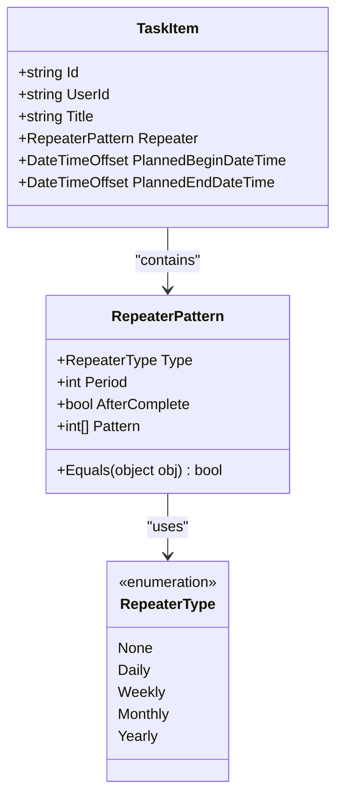
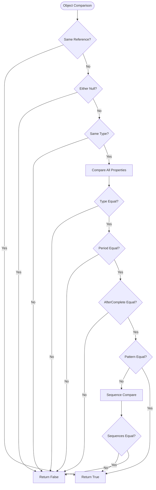
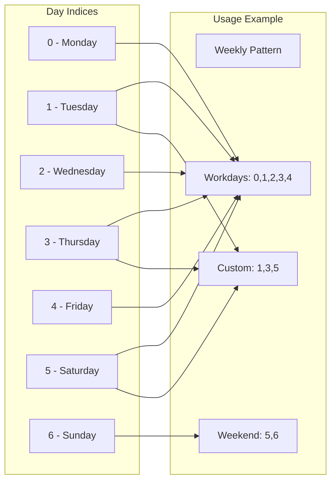
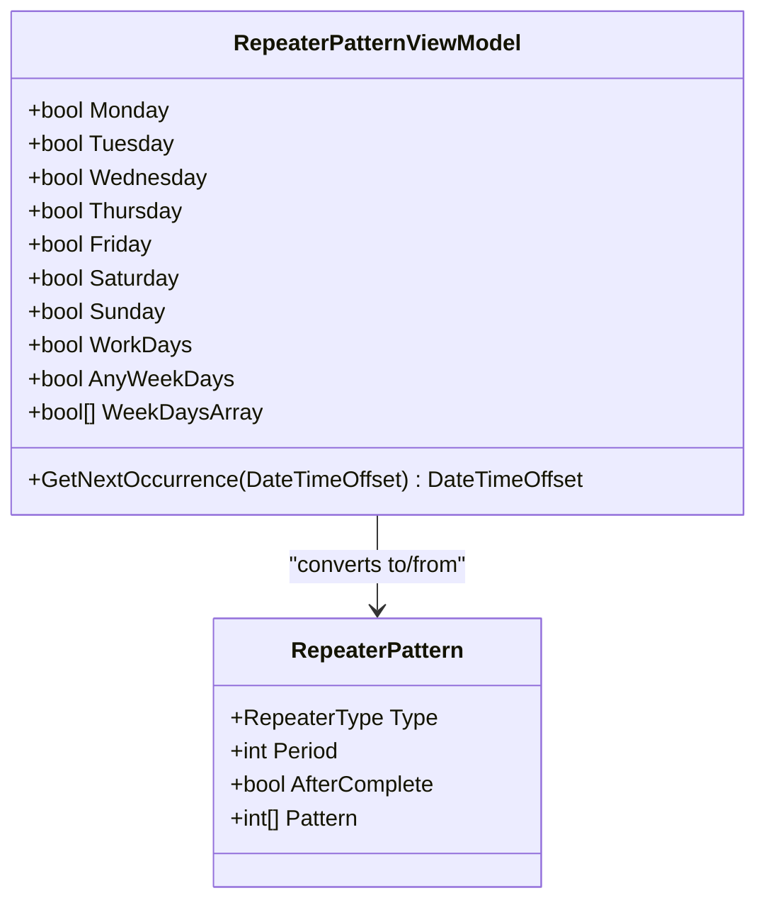
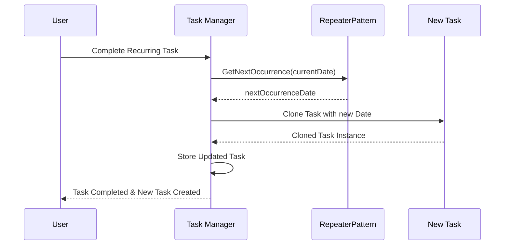
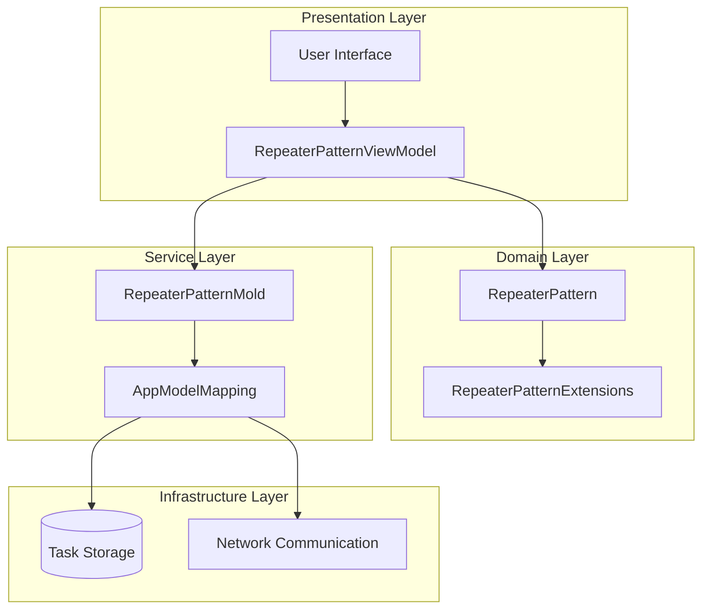

# RepeaterPattern Model Documentation

<cite>
**Referenced Files in This Document**
- [RepeaterPattern.cs](file://src/Unlimotion.Domain/RepeaterPattern.cs)
- [RepeaterType.cs](file://src/Unlimotion.Domain/RepeaterType.cs)
- [RepeaterPatternExtensions.cs](file://src/Unlimotion.Domain/RepeaterPatternExtensions.cs)
- [RepeaterPatternViewModel.cs](file://src/Unlimotion.ViewModel/RepeaterPatternViewModel.cs)
- [RepeaterPatternMold.cs](file://src/Unlimotion.Server.ServiceModel/Molds/Tasks/RepeaterPatternMold.cs)
- [TaskItem.cs](file://src/Unlimotion.Domain/TaskItem.cs)
- [AppModelMapping.cs](file://src/Unlimotion/AppModelMapping.cs)
</cite>

## Table of Contents
1. [Introduction](#introduction)
2. [Core Data Model](#core-data-model)
3. [Enum Definitions](#enum-definitions)
4. [Property Details](#property-details)
5. [Equality Implementation](#equality-implementation)
6. [Pattern Property Usage](#pattern-property-usage)
7. [ViewModel Integration](#viewmodel-integration)
8. [Extension Methods](#extension-methods)
9. [Task Creation Workflow](#task-creation-workflow)
10. [Usage Examples](#usage-examples)
11. [Integration Patterns](#integration-patterns)
12. [Best Practices](#best-practices)

## Introduction

The RepeaterPattern model is a core component of the Unlimotion task management system that enables recurring task scheduling. It provides a flexible framework for defining how frequently tasks should repeat and when they should occur, supporting various recurrence patterns from daily to yearly intervals with customizable day selections for weekly patterns.

The model consists of two main layers: the core domain model (`RepeaterPattern`) and a user-friendly presentation layer (`RepeaterPatternViewModel`). This dual-layer architecture ensures clean separation between business logic and user interface concerns while maintaining data integrity and providing intuitive configuration options.

## Core Data Model

The `RepeaterPattern` class serves as the fundamental data structure for recurring task definitions within the Unlimotion domain. It encapsulates all necessary information to determine when and how often a task should recur.



**Diagram sources**
- [RepeaterPattern.cs](file://src/Unlimotion.Domain/RepeaterPattern.cs#L5-L23)
- [RepeaterType.cs](file://src/Unlimotion.Domain/RepeaterType.cs#L3-L9)
- [TaskItem.cs](file://src/Unlimotion.Domain/TaskItem.cs#L24)

**Section sources**
- [RepeaterPattern.cs](file://src/Unlimotion.Domain/RepeaterPattern.cs#L1-L24)
- [TaskItem.cs](file://src/Unlimotion.Domain/TaskItem.cs#L24)

## Enum Definitions

The `RepeaterType` enumeration defines the five supported recurrence patterns, each serving specific scheduling needs:

| Type | Description | Use Case |
|------|-------------|----------|
| None | No recurrence | Single-use tasks |
| Daily | Every N days | Regular maintenance, daily routines |
| Weekly | Every N weeks on selected days | Weekly meetings, work schedules |
| Monthly | Every N months | Monthly bills, monthly reviews |
| Yearly | Every N years | Annual events, yearly reports |

**Section sources**
- [RepeaterType.cs](file://src/Unlimotion.Domain/RepeaterType.cs#L1-L10)

## Property Details

### Type Property
The `Type` property determines the base recurrence pattern and is essential for calculating next occurrence dates. It accepts values from the `RepeaterType` enumeration and influences the behavior of the `GetNextOccurrence` method.

### Period Property
The `Period` property specifies the interval multiplier for the recurrence pattern. Its default value is 1, meaning the recurrence occurs every period (e.g., every 1 day, every 2 weeks). Higher values create less frequent recurrences (e.g., every 2 days, every 3 weeks).

### AfterComplete Property
The `AfterComplete` boolean flag controls whether recurrence calculations are based on the original scheduled time or the completion time. When `true`, the next occurrence is calculated from the current date when the task is completed, enabling dynamic scheduling adjustments.

### Pattern Property
The `Pattern` property is a list of integer indices representing specific days of the week for weekly recurrence patterns. The indices correspond to the standard ISO 8601 day numbering system:
- 0 = Monday
- 1 = Tuesday  
- 2 = Wednesday
- 3 = Thursday
- 4 = Friday
- 5 = Saturday
- 6 = Sunday

This property is only meaningful for `Weekly` recurrence types and is ignored for other pattern types.

**Section sources**
- [RepeaterPattern.cs](file://src/Unlimotion.Domain/RepeaterPattern.cs#L7-L11)

## Equality Implementation

The `Equals` method provides comprehensive comparison functionality for `RepeaterPattern` instances, ensuring accurate equality checks across all properties. The implementation handles several critical scenarios:



**Diagram sources**
- [RepeaterPattern.cs](file://src/Unlimotion.Domain/RepeaterPattern.cs#L12-L23)

The method performs a four-part comparison:
1. **Reference equality** for identical instances
2. **Null checking** to prevent null reference exceptions
3. **Type verification** to ensure compatible comparisons
4. **Property-wise comparison** including special handling for the `Pattern` list using `SequenceEqual` for deep comparison

**Section sources**
- [RepeaterPattern.cs](file://src/Unlimotion.Domain/RepeaterPattern.cs#L12-L23)

## Pattern Property Usage

The `Pattern` property serves as the foundation for weekly recurrence customization. When configured for `Weekly` recurrence, it allows users to specify exactly which days of the week should trigger task occurrences.

### Day Index Mapping

The pattern system uses zero-based indexing aligned with ISO 8601 standards:



**Diagram sources**
- [RepeaterPatternViewModel.cs](file://src/Unlimotion.ViewModel/RepeaterPatternViewModel.cs#L47-L65)

### Pattern Validation and Usage

The system automatically validates pattern configurations and handles edge cases:
- **Empty patterns**: When no days are selected, the pattern defaults to weekly recurrence without specific day filtering
- **Full week patterns**: Including all seven days creates a daily-like pattern with weekly frequency
- **Partial patterns**: Selecting specific days enables precise weekly scheduling

**Section sources**
- [RepeaterPatternViewModel.cs](file://src/Unlimotion.ViewModel/RepeaterPatternViewModel.cs#L47-L65)

## ViewModel Integration

The `RepeaterPatternViewModel` class provides a user-friendly interface for configuring recurring tasks through boolean properties representing individual days of the week. This presentation layer bridges the gap between the domain model and user interface requirements.

### Boolean Property Mapping

The ViewModel exposes seven boolean properties for day selection, each corresponding to a specific day:

| Property | Day | Index Value |
|----------|-----|-------------|
| Monday | Monday | 0 |
| Tuesday | Tuesday | 1 |
| Wednesday | Wednesday | 2 |
| Thursday | Thursday | 3 |
| Friday | Friday | 4 |
| Saturday | Saturday | 5 |
| Sunday | Sunday | 6 |

### WorkDays Convenience Property

The `WorkDays` property provides a convenient way to select all weekdays (Monday through Friday) simultaneously:



**Diagram sources**
- [RepeaterPatternViewModel.cs](file://src/Unlimotion.ViewModel/RepeaterPatternViewModel.cs#L105-L172)

### Two-Way Data Binding

The ViewModel implements bidirectional data binding:
- **From ViewModel to Model**: Converts boolean properties to pattern list during serialization
- **From Model to ViewModel**: Populates boolean properties from pattern list during deserialization

**Section sources**
- [RepeaterPatternViewModel.cs](file://src/Unlimotion.ViewModel/RepeaterPatternViewModel.cs#L20-L70)

## Extension Methods

The `RepeaterPatternExtensions` class provides the core functionality for calculating next occurrence dates based on the recurrence pattern. This extension method serves as the engine for task scheduling logic.

### Next Occurrence Calculation Logic

The `GetNextOccurrence` method implements sophisticated date calculation algorithms tailored to each recurrence type:

```mermaid
flowchart TD
Start([GetNextOccurrence]) --> AfterComplete{AfterComplete?}
AfterComplete --> |Yes| SetNow[Set prev = Now.Date]
AfterComplete --> |No| SetStart[Set prev = start]
SetNow --> Switch{Repeater.Type}
SetStart --> Switch
Switch --> |None| ReturnPrev[Return prev]
Switch --> |Daily| AddDays[Add Days: prev.AddDays(Period)]
Switch --> |Weekly| WeeklyLogic[Weekly Pattern Logic]
Switch --> |Monthly| AddMonths[Add Months: prev.AddMonths(Period)]
Switch --> |Yearly| AddYears[Add Years: prev.AddYears(Period)]
WeeklyLogic --> ConvertPattern[Convert Pattern to Flags]
ConvertPattern --> HasPattern{Has Pattern?}
HasPattern --> |No| AddWeeks[Add Weeks: prev.AddDays(7*Period)]
HasPattern --> |Yes| FindNext[Find Next Occurring Day]
FindNext --> ReturnWeekly[Return Calculated Date]
AddDays --> ReturnDate[Return Calculated Date]
AddMonths --> ReturnDate
AddYears --> ReturnDate
AddWeeks --> ReturnDate
ReturnPrev --> End([End])
ReturnDate --> End
ReturnWeekly --> End
```

**Diagram sources**
- [RepeaterPatternExtensions.cs](file://src/Unlimotion.Domain/RepeaterPatternExtensions.cs#L8-L83)

### Weekly Pattern Complexity

The weekly recurrence logic is particularly sophisticated, handling day-of-week calculations and pattern matching:

1. **Pattern Conversion**: Transforms the integer pattern list into boolean flags for each day
2. **Current Day Offset**: Calculates the offset from the current day to find the next occurrence
3. **Forward Search**: Looks ahead from the current day to find the next matching day
4. **Wraparound Logic**: Handles cases where the next occurrence spans into the next week
5. **Fallback Calculation**: Uses the standard weekly interval when no specific pattern is defined

**Section sources**
- [RepeaterPatternExtensions.cs](file://src/Unlimotion.Domain/RepeaterPatternExtensions.cs#L8-L83)

## Task Creation Workflow

The RepeaterPattern model integrates seamlessly into the task creation workflow, enabling automatic task cloning and scheduling based on recurrence patterns. This integration supports the core functionality of recurring task management.

### Task Cloning Process

When a recurring task is marked as completed, the system automatically creates a new instance with the next occurrence date:



**Diagram sources**
- [TaskCompletionChangeTests.cs](file://src/Unlimotion.Test/TaskCompletionChangeTests.cs#L90-L127)

### Integration Points

The model integrates with several key system components:
- **Task Storage**: Persists recurrence patterns alongside task metadata
- **Notification System**: Triggers reminders based on calculated next occurrences
- **Calendar Views**: Displays recurring tasks with appropriate scheduling information
- **Export/Import**: Maintains pattern integrity during data migration

**Section sources**
- [TaskItem.cs](file://src/Unlimotion.Domain/TaskItem.cs#L24)

## Usage Examples

### Daily Recurrence Example

Creating a daily task that repeats every 2 days:

```csharp
// Configuration for daily recurrence
var dailyPattern = new RepeaterPattern
{
    Type = RepeaterType.Daily,
    Period = 2,           // Every 2 days
    AfterComplete = true, // Restart from completion date
    Pattern = null        // Not applicable for daily patterns
};
```

### Weekly Recurrence Example

Setting up a weekly meeting pattern for Mondays and Wednesdays:

```csharp
// Configuration for weekly recurrence
var weeklyPattern = new RepeaterPattern
{
    Type = RepeaterType.Weekly,
    Period = 1,           // Every week
    AfterComplete = false,// Restart from original schedule
    Pattern = new List<int> { 0, 2 }  // Monday (0) and Wednesday (2)
};
```

### Monthly Recurrence Example

Creating a monthly bill payment task:

```csharp
// Configuration for monthly recurrence
var monthlyPattern = new RepeaterPattern
{
    Type = RepeaterType.Monthly,
    Period = 1,           // Every month
    AfterComplete = true, // Restart from completion date
    Pattern = null        // Not applicable for monthly patterns
};
```

### Workdays Convenience Example

Using the WorkDays property for efficient weekday scheduling:

```csharp
// Using ViewModel for weekday configuration
var viewModel = new RepeaterPatternViewModel
{
    Type = RepeaterType.Weekly,
    Period = 1,
    WorkDays = true      // Automatically sets Monday-Friday
};

// Resulting pattern: [0, 1, 2, 3, 4]
```

## Integration Patterns

### Model Mapping Architecture

The system employs a layered architecture with clear separation of concerns:



**Diagram sources**
- [AppModelMapping.cs](file://src/Unlimotion/AppModelMapping.cs#L26-L33)
- [RepeaterPatternViewModel.cs](file://src/Unlimotion.ViewModel/RepeaterPatternViewModel.cs#L8-L17)

### Serialization Patterns

The model supports multiple serialization formats for different system contexts:
- **Domain Model**: Native C# serialization for internal operations
- **Service Model**: Mold classes for service communication
- **Hub Model**: Simplified models for real-time communication

**Section sources**
- [AppModelMapping.cs](file://src/Unlimotion/AppModelMapping.cs#L26-L33)

## Best Practices

### Pattern Design Guidelines

1. **Use Appropriate Types**: Select the most specific recurrence type that meets requirements
2. **Configure Period Wisely**: Choose sensible interval values to avoid excessive task creation
3. **Leverage AfterComplete**: Use this flag strategically based on scheduling requirements
4. **Validate Patterns**: Ensure pattern lists contain valid day indices (0-6)

### Performance Considerations

1. **Pattern Caching**: Cache frequently accessed pattern calculations
2. **Lazy Evaluation**: Defer expensive calculations until necessary
3. **Memory Management**: Dispose of temporary pattern objects efficiently

### Error Handling

1. **Null Safety**: Always check for null patterns before processing
2. **Range Validation**: Validate period values are positive integers
3. **Type Consistency**: Ensure pattern types match expected enumeration values

### Testing Strategies

1. **Unit Tests**: Verify pattern calculations across all recurrence types
2. **Integration Tests**: Test complete workflow from user input to task creation
3. **Boundary Testing**: Validate edge cases like wraparound periods and empty patterns