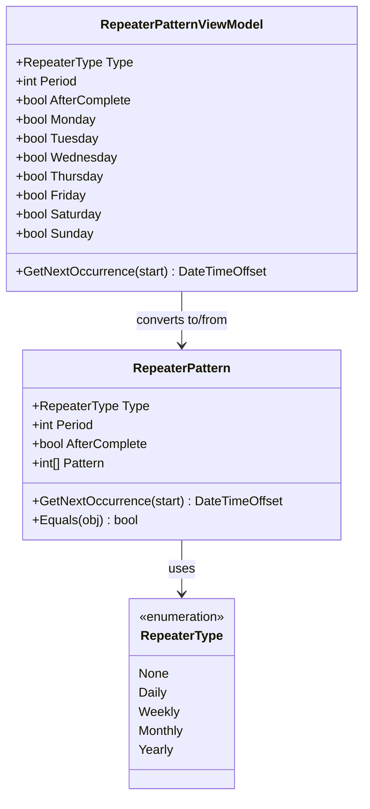
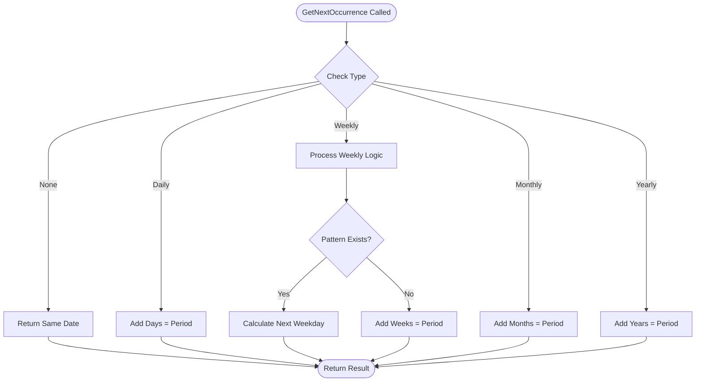
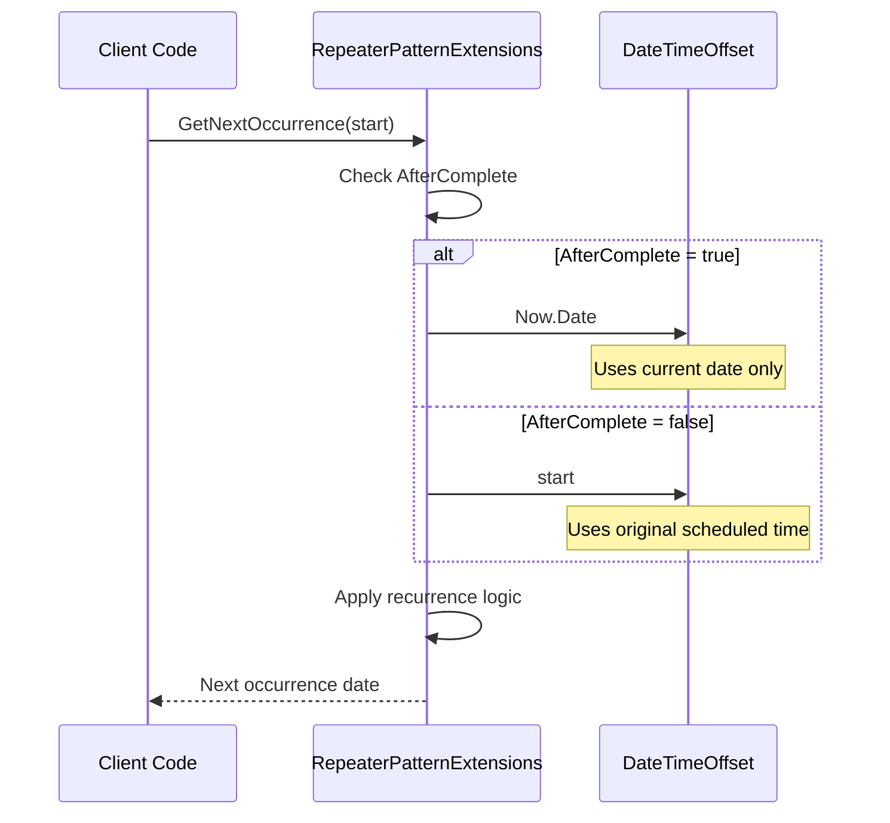
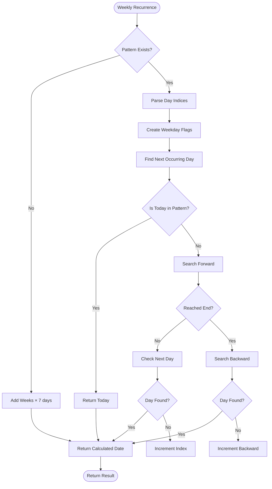
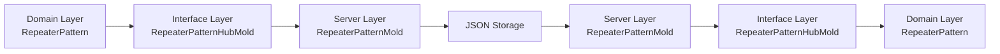
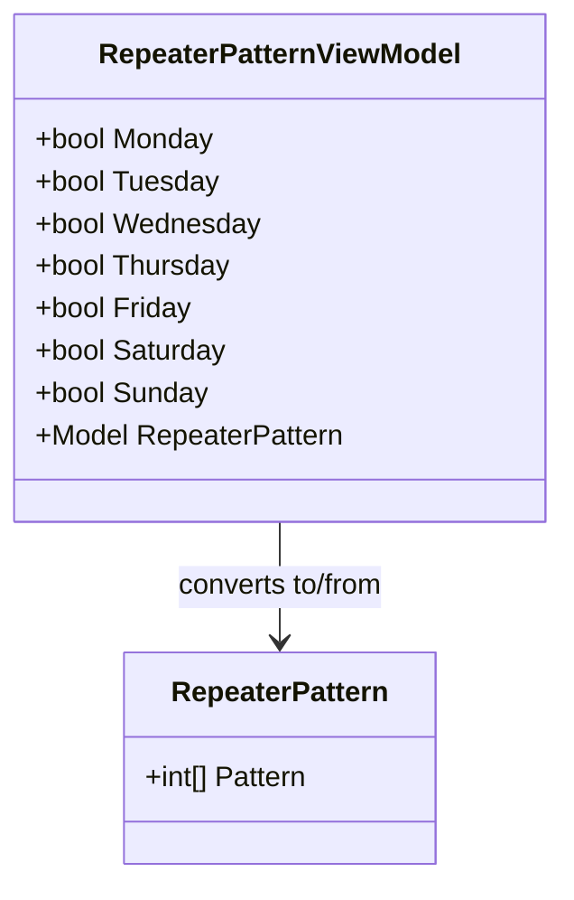

# RepeaterPattern Properties

<cite>
**Referenced Files in This Document**
- [RepeaterPattern.cs](file://src/Unlimotion.Domain/RepeaterPattern.cs)
- [RepeaterType.cs](file://src/Unlimotion.Domain/RepeaterType.cs)
- [RepeaterPatternExtensions.cs](file://src/Unlimotion.Domain/RepeaterPatternExtensions.cs)
- [RepeaterPatternViewModel.cs](file://src/Unlimotion.ViewModel\RepeaterPatternViewModel.cs)
- [RepeaterPatternHubMold.cs](file://src/Unlimotion.Interface\RepeaterPatternHubMold.cs)
- [RepeaterPatternMold.cs](file://src\Unlimotion.Server.ServiceModel\Molds\Tasks\RepeaterPatternMold.cs)
- [AppModelMapping.cs](file://src\Unlimotion\AppModelMapping.cs)
- [AppModelMapping.cs](file://src\Unlimotion.Server\AppModelMapping.cs)
</cite>

## Table of Contents
1. [Introduction](#introduction)
2. [Core Properties Overview](#core-properties-overview)
3. [Type Property](#type-property)
4. [Period Property](#period-property)
5. [AfterComplete Property](#aftercomplete-property)
6. [Pattern Property](#pattern-property)
7. [Data Types and Constraints](#data-types-and-constraints)
8. [Serialization and Model Mapping](#serialization-and-model-mapping)
9. [Usage Examples](#usage-examples)
10. [Implementation Details](#implementation-details)
11. [Best Practices](#best-practices)

## Introduction

The RepeaterPattern class is a fundamental component in the Unlimotion task management system that enables recurring task scheduling. It provides a flexible framework for defining how often tasks should repeat and when the recurrence calculations should begin. The pattern consists of four core properties that work together to create sophisticated recurring task behaviors.

This documentation covers the complete specification of the RepeaterPattern properties, including their data types, default values, constraints, and practical usage scenarios. Understanding these properties is essential for implementing recurring task functionality in the Unlimotion application.

## Core Properties Overview

The RepeaterPattern class contains four primary properties that define the recurrence behavior of tasks:



**Diagram sources**
- [RepeaterPattern.cs](file://src\Unlimotion.Domain\RepeaterPattern.cs#L6-L12)
- [RepeaterType.cs](file://src\Unlimotion.Domain\RepeaterType.cs#L3-L9)
- [RepeaterPatternViewModel.cs](file://src\Unlimotion.ViewModel\RepeaterPatternViewModel.cs#L8-L172)

## Type Property

The Type property determines the fundamental recurrence frequency of a task. It uses the RepeaterType enumeration to specify whether the task repeats daily, weekly, monthly, yearly, or not at all.

### Enumeration Values

| Value | Description | Recurrence Frequency |
|-------|-------------|---------------------|
| None | No repetition | Single occurrence only |
| Daily | Daily recurrence | Every N days |
| Weekly | Weekly recurrence | Every N weeks on specified days |
| Monthly | Monthly recurrence | Every N months |
| Yearly | Yearly recurrence | Every N years |

### Implementation Details

The Type property serves as the primary switch in the recurrence calculation logic. Different types trigger different calculation algorithms:



**Diagram sources**
- [RepeaterPatternExtensions.cs](file://src\Unlimotion.Domain\RepeaterPatternExtensions.cs#L10-L83)

**Section sources**
- [RepeaterType.cs](file://src\Unlimotion.Domain\RepeaterType.cs#L3-L9)
- [RepeaterPatternExtensions.cs](file://src\Unlimotion.Domain\RepeaterPatternExtensions.cs#L12-L16)

## Period Property

The Period property acts as a multiplier for the recurrence interval. It specifies how many units of time should pass between occurrences of the task.

### Default Value and Range

- **Default Value**: 1 (minimum value)
- **Range**: Positive integers (typically 1-100)
- **Purpose**: Multiplies the base interval defined by the Type property

### Usage Patterns

| Type | Period Effect | Example |
|------|---------------|---------|
| Daily | Every N days | Period=2 → Every other day |
| Weekly | Every N weeks | Period=3 → Every 3 weeks |
| Monthly | Every N months | Period=6 → Every 6 months |
| Yearly | Every N years | Period=5 → Every 5 years |

### Calculation Logic

The Period property is applied differently based on the Type:

- **Daily**: `DateTimeOffset.AddDays(Period)`
- **Weekly**: Used to calculate total days offset (Period × 7 days)
- **Monthly**: `DateTimeOffset.AddMonths(Period)`
- **Yearly**: `DateTimeOffset.AddYears(Period)`

**Section sources**
- [RepeaterPattern.cs](file://src\Unlimotion.Domain\RepeaterPattern.cs#L8-L9)
- [RepeaterPatternExtensions.cs](file://src\Unlimotion.Domain\RepeaterPatternExtensions.cs#L17-L18)

## AfterComplete Property

The AfterComplete property determines when the recurrence calculation should begin - either from the original scheduled start time or from the completion time of the previous occurrence.

### Behavior Comparison

| AfterComplete = false | AfterComplete = true |
|----------------------|---------------------|
| Recurrence starts from original scheduled time | Recurrence starts from completion time |
| Fixed schedule regardless of completion | Flexible schedule based on completion |
| Predictable recurrence intervals | Adaptive recurrence based on actual completion |

### Implementation Logic



**Diagram sources**
- [RepeaterPatternExtensions.cs](file://src\Unlimotion.Domain\RepeaterPatternExtensions.cs#L11-L15)

### Practical Implications

- **False (default)**: Task recurs according to original schedule, regardless of when it was completed
- **True**: Task recurs based on when it was actually completed, potentially creating variable intervals

**Section sources**
- [RepeaterPattern.cs](file://src\Unlimotion.Domain\RepeaterPattern.cs#L10-L11)
- [RepeaterPatternExtensions.cs](file://src\Unlimotion.Domain\RepeaterPatternExtensions.cs#L11-L15)

## Pattern Property

The Pattern property is specifically used for Weekly recurrence to specify which days of the week the task should repeat on. It contains a list of integer indices representing weekdays.

### Weekday Index Mapping

| Index | Day of Week | ISO Standard | US Standard |
|-------|-------------|--------------|-------------|
| 0 | Monday | ✓ |  |
| 1 | Tuesday | ✓ |  |
| 2 | Wednesday | ✓ |  |
| 3 | Thursday | ✓ |  |
| 4 | Friday | ✓ |  |
| 5 | Saturday | ✓ | ✓ |
| 6 | Sunday | ✓ | ✓ |

### Pattern Validation and Constraints

- **Type**: `List<int>`
- **Null Safety**: Can be null (interpreted as no specific days)
- **Index Range**: 0-6 (inclusive)
- **Duplicate Handling**: Duplicates are allowed but ignored
- **Empty List**: Interpreted as no specific days (equivalent to repeating every week)

### Weekly Recurrence Logic

The Pattern property enables sophisticated weekly scheduling:



**Diagram sources**
- [RepeaterPatternExtensions.cs](file://src\Unlimotion.Domain\RepeaterPatternExtensions.cs#L19-L65)

### Pattern Examples

| Pattern Value | Description | Recurrence Schedule |
|---------------|-------------|-------------------|
| `[0,2,4]` | Monday, Wednesday, Friday | Every Monday, Wednesday, and Friday |
| `[1,3,5]` | Tuesday, Thursday, Saturday | Every Tuesday, Thursday, and Saturday |
| `[6]` | Sunday only | Every Sunday |
| `[]` or null | No specific days | Every week (7 days) |
| `[0,1,2,3,4,5,6]` | All days | Every day (use Daily type instead) |

**Section sources**
- [RepeaterPattern.cs](file://src\Unlimotion.Domain\RepeaterPattern.cs#L12-L13)
- [RepeaterPatternExtensions.cs](file://src\Unlimotion.Domain\RepeaterPatternExtensions.cs#L19-L65)

## Data Types and Constraints

### Property Specifications

| Property | Type | Default | Constraints | Null Safety |
|----------|------|---------|-------------|-------------|
| Type | RepeaterType | None | Required, cannot be null | Cannot be null |
| Period | int | 1 | Must be ≥ 1 | Cannot be null |
| AfterComplete | bool | false | Boolean value | Cannot be null |
| Pattern | List\<int\> | null | 0-6 indices only | Nullable |

### Validation Rules

1. **Type Validation**: Must be a valid RepeaterType enumeration value
2. **Period Validation**: Must be a positive integer (≥ 1)
3. **Pattern Validation**: Contains only indices 0-6 when present
4. **Type-Specific Constraints**:
   - Weekly type requires Pattern to be valid weekday indices
   - Other types ignore Pattern property

### Equality Implementation

The RepeaterPattern class implements custom equality logic that handles null Pattern values and compares sequences properly:

**Section sources**
- [RepeaterPattern.cs](file://src\Unlimotion.Domain\RepeaterPattern.cs#L6-L23)

## Serialization and Model Mapping

The RepeaterPattern properties are serialized and deserialized through multiple model representations for different layers of the application architecture.

### Model Transformation Pipeline



**Diagram sources**
- [AppModelMapping.cs](file://src\Unlimotion\AppModelMapping.cs#L28-L30)
- [AppModelMapping.cs](file://src\Unlimotion.Server\AppModelMapping.cs#L26-L28)

### HubMold Variants

The system uses two different mold representations:

#### Interface Layer Mold
- **File**: [RepeaterPatternHubMold.cs](file://src\Unlimotion.Interface\RepeaterPatternHubMold.cs#L5-L10)
- **Purpose**: Communication between client and server
- **Type**: Uses RepeaterTypeHubMold enumeration

#### Server Service Model Mold
- **File**: [RepeaterPatternMold.cs](file://src\Unlimotion.Server.ServiceModel\Molds\Tasks\RepeaterPatternMold.cs#L7-L19)
- **Purpose**: Internal server-side representation
- **Type**: Uses RepeaterTypeMold enumeration with localization attributes

### Mapping Configuration

The AutoMapper configuration ensures seamless conversion between models:

**Section sources**
- [AppModelMapping.cs](file://src\Unlimotion\AppModelMapping.cs#L28-L30)
- [AppModelMapping.cs](file://src\Unlimotion.Server\AppModelMapping.cs#L26-L28)

## Usage Examples

### Basic Daily Recurrence

```csharp
// Every other day (daily recurrence with period=2)
var dailyPattern = new RepeaterPattern
{
    Type = RepeaterType.Daily,
    Period = 2,
    AfterComplete = false,
    Pattern = null
};
```

### Weekly Recurrence with Specific Days

```csharp
// Monday, Wednesday, Friday (weekly recurrence)
var weeklyPattern = new RepeaterPattern
{
    Type = RepeaterType.Weekly,
    Period = 1,
    AfterComplete = false,
    Pattern = new List<int> { 0, 2, 4 } // Monday, Wednesday, Friday
};
```

### Monthly Recurrence

```csharp
// Every 3 months
var monthlyPattern = new RepeaterPattern
{
    Type = RepeaterType.Monthly,
    Period = 3,
    AfterComplete = false,
    Pattern = null
};
```

### Completion-Based Recurrence

```csharp
// Recur based on completion time (flexible schedule)
var flexiblePattern = new RepeaterPattern
{
    Type = RepeaterType.Daily,
    Period = 1,
    AfterComplete = true, // Start counting from completion
    Pattern = null
};
```

### Workday Only Recurrence

```csharp
// Monday to Friday (workdays only)
var workdayPattern = new RepeaterPattern
{
    Type = RepeaterType.Weekly,
    Period = 1,
    AfterComplete = false,
    Pattern = new List<int> { 0, 1, 2, 3, 4 } // Monday through Friday
};
```

## Implementation Details

### Next Occurrence Calculation

The core recurrence logic is implemented in the `GetNextOccurrence` extension method, which handles all recurrence types and edge cases.

#### Key Algorithm Features

1. **Flexible Start Point**: Respects AfterComplete setting
2. **Type-Specific Logic**: Different algorithms for each recurrence type
3. **Weekly Complexity**: Sophisticated weekday calculation for weekly patterns
4. **Null Safety**: Proper handling of null Pattern values
5. **Sequence Comparison**: Robust comparison for equality checking

#### Weekly Recurrence Complexity

The weekly recurrence calculation is particularly sophisticated, handling:

- **Forward Search**: Finding the next occurring day in the current week
- **Backward Search**: Wrapping to the next week if needed
- **Pattern Validation**: Ensuring valid weekday indices
- **Edge Cases**: Handling empty patterns and boundary conditions

**Section sources**
- [RepeaterPatternExtensions.cs](file://src\Unlimotion.Domain\RepeaterPatternExtensions.cs#L10-L83)

### ViewModel Integration

The RepeaterPatternViewModel provides a user-friendly interface for configuring recurrence patterns through boolean properties for each weekday.

#### Weekday Mapping

The ViewModel converts between the internal integer-based pattern and boolean flags:



**Diagram sources**
- [RepeaterPatternViewModel.cs](file://src\Unlimotion.ViewModel\RepeaterPatternViewModel.cs#L15-L50)

**Section sources**
- [RepeaterPatternViewModel.cs](file://src\Unlimotion.ViewModel\RepeaterPatternViewModel.cs#L15-L94)

## Best Practices

### Design Guidelines

1. **Choose Appropriate Type**: Use Weekly type only when Pattern contains specific days
2. **Set Reasonable Periods**: Avoid extremely large period values that could cause overflow
3. **Consider AfterComplete Impact**: Think about whether recurrence should be completion-based
4. **Validate Pattern Indices**: Ensure Pattern contains only valid weekday indices (0-6)

### Common Patterns

| Use Case | Recommended Configuration |
|----------|------------------------|
| Daily Reminder | `Type: Daily, Period: 1` |
| Bi-weekly Meeting | `Type: Weekly, Period: 2, Pattern: [0]` (Monday) |
| Weekly Report | `Type: Weekly, Period: 1, Pattern: [4]` (Friday) |
| Monthly Review | `Type: Monthly, Period: 1` |
| Annual Maintenance | `Type: Yearly, Period: 1` |

### Performance Considerations

- **Pattern Size**: Smaller patterns (fewer days) are more efficient
- **Period Size**: Larger periods reduce calculation frequency
- **AfterComplete**: True mode may require more frequent recalculations

### Error Handling

The implementation includes robust error handling for:
- Invalid weekday indices in Pattern
- Null Pattern values
- Edge cases in weekly recurrence calculations
- Type-specific constraint violations