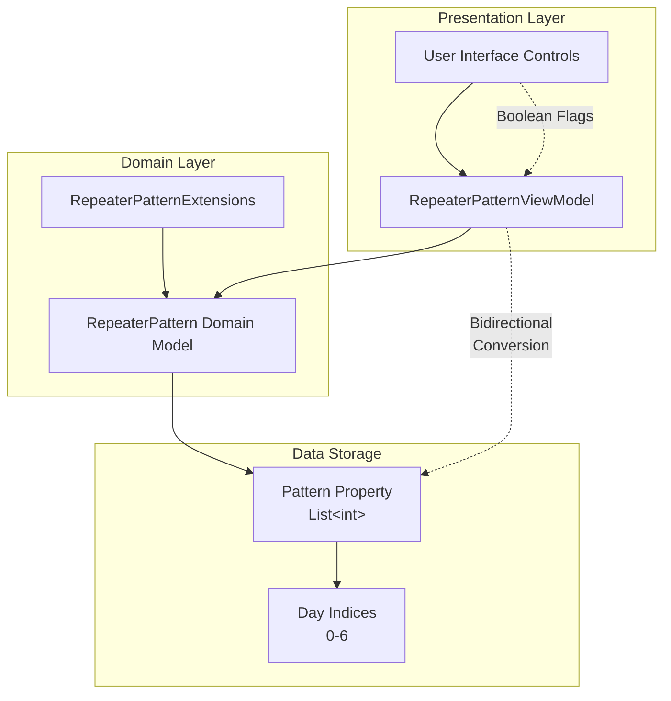
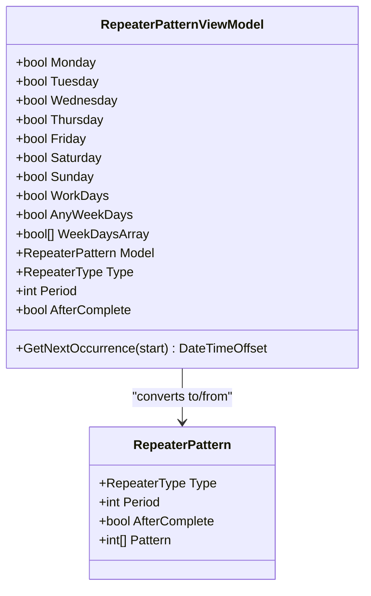
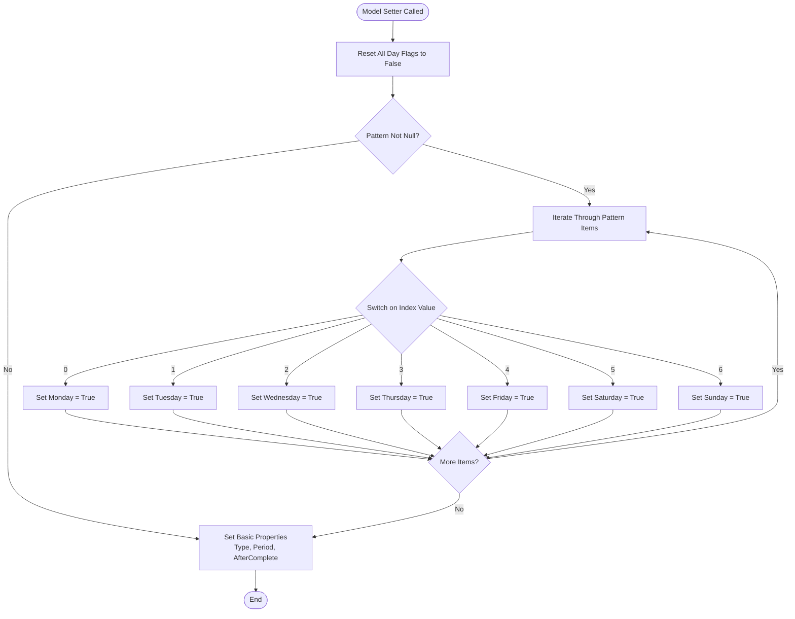
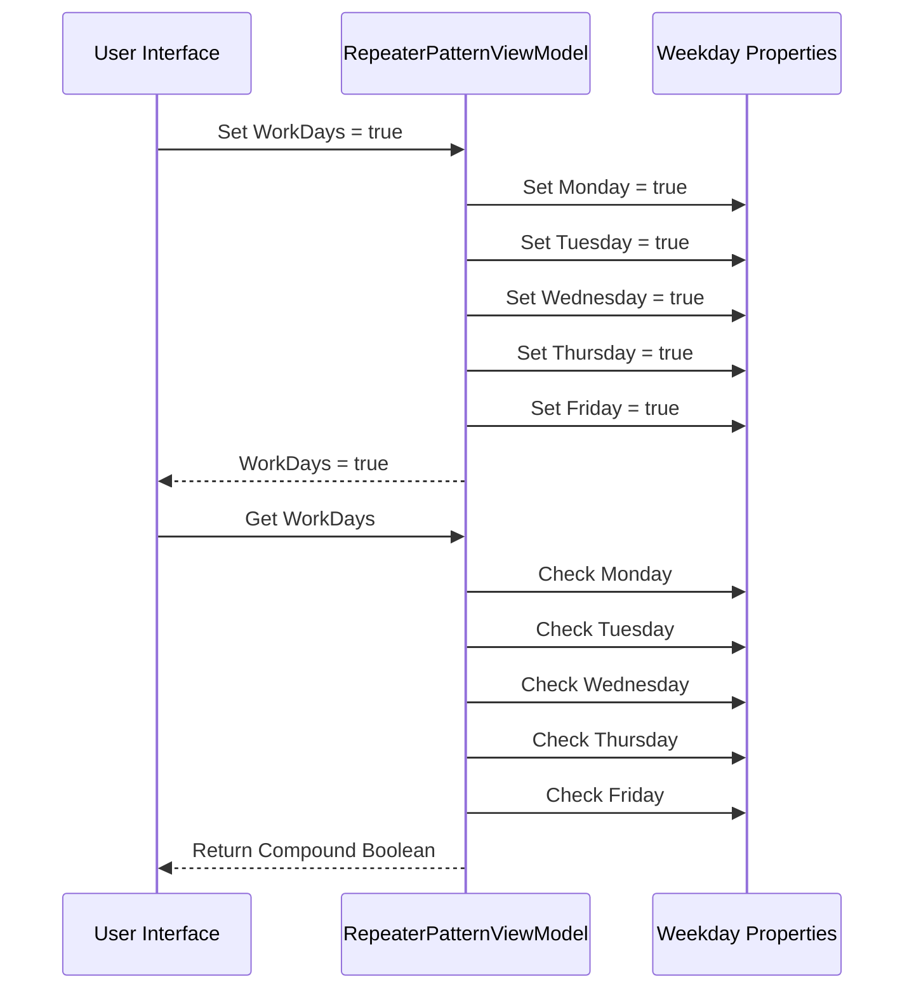
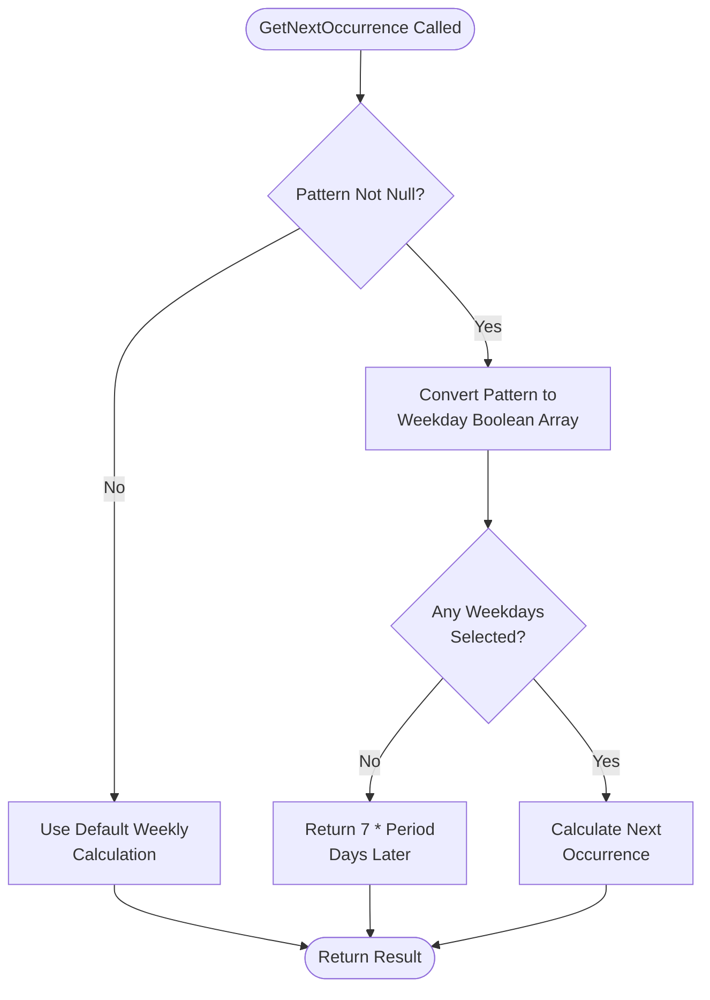
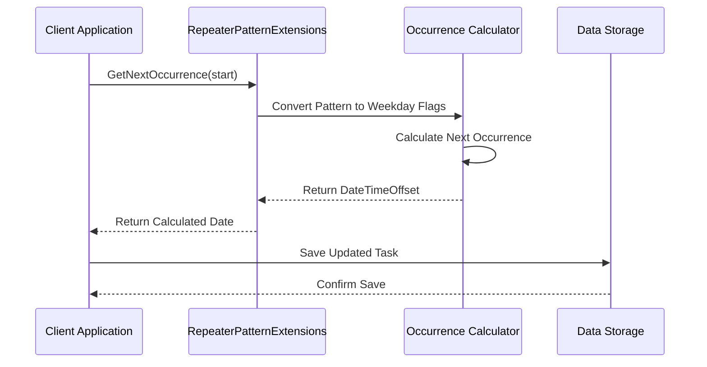

# Weekly Pattern Configuration

<cite>
**Referenced Files in This Document**
- [RepeaterPattern.cs](file://src/Unlimotion.Domain/RepeaterPattern.cs)
- [RepeaterPatternViewModel.cs](file://src/Unlimotion.ViewModel/RepeaterPatternViewModel.cs)
- [RepeaterType.cs](file://src/Unlimotion.Domain/RepeaterType.cs)
- [RepeaterPatternExtensions.cs](file://src/Unlimotion.Domain/RepeaterPatternExtensions.cs)
- [RepeaterPatternHubMold.cs](file://src/Unlimotion.Interface/RepeaterPatternHubMold.cs)
- [RepeaterPatternMold.cs](file://src/Unlimotion.Server.ServiceModel/Molds\Tasks\RepeaterPatternMold.cs)
</cite>

## Table of Contents
1. [Introduction](#introduction)
2. [System Architecture](#system-architecture)
3. [Domain Model Structure](#domain-model-structure)
4. [View Model Implementation](#view-model-implementation)
5. [Bidirectional Conversion Logic](#bidirectional-conversion-logic)
6. [WorkDays Convenience Property](#workdays-convenience-property)
7. [Validation Rules and Edge Cases](#validation-rules-and-edge-cases)
8. [Usage Examples](#usage-examples)
9. [Integration Patterns](#integration-patterns)
10. [Best Practices](#best-practices)

## Introduction

The weekly recurrence pattern configuration in RepeaterPattern provides a sophisticated mechanism for scheduling recurring tasks on specific days of the week. This system implements a dual-layer architecture where the domain model uses integer-based day indices (0-6) to represent weekdays, while the presentation layer offers user-friendly boolean properties for easy selection through the RepeaterPatternViewModel.

The implementation follows the Model-View-ViewModel (MVVM) pattern, enabling seamless bidirectional data binding between the user interface and the underlying domain model. This design ensures type safety, maintains separation of concerns, and provides intuitive user interaction while preserving efficient data storage and processing capabilities.

## System Architecture

The weekly pattern configuration system consists of three primary layers that work together to provide a cohesive scheduling solution:



**Diagram sources**
- [RepeaterPatternViewModel.cs](file://src/Unlimotion.ViewModel/RepeaterPatternViewModel.cs#L1-L173)
- [RepeaterPattern.cs](file://src/Unlimotion.Domain/RepeaterPattern.cs#L1-L24)
- [RepeaterPatternExtensions.cs](file://src/Unlimotion.Domain/RepeaterPatternExtensions.cs#L1-L84)

## Domain Model Structure

The RepeaterPattern domain model serves as the core data structure for storing recurrence configuration information. It implements a clean, immutable design that separates concerns between scheduling metadata and actual recurrence patterns.

### Core Properties

The domain model contains four essential properties that define the recurrence behavior:

| Property | Type | Description | Default Value |
|----------|------|-------------|---------------|
| Type | RepeaterType | Specifies the recurrence pattern type (None, Daily, Weekly, Monthly, Yearly) | None |
| Period | int | Defines the interval between recurrence occurrences | 1 |
| AfterComplete | bool | Determines whether recurrence starts after task completion | false |
| Pattern | List\<int\> | Stores selected day indices for weekly recurrence patterns | null |

### Day Index Mapping

The Pattern property uses a simple but effective integer-based system to represent days of the week:

| Integer Value | Day of Week | Index Position |
|---------------|-------------|----------------|
| 0 | Monday | First day of the week |
| 1 | Tuesday | Second day of the week |
| 2 | Wednesday | Third day of the week |
| 3 | Thursday | Fourth day of the week |
| 4 | Friday | Fifth day of the week |
| 5 | Saturday | Sixth day of the week |
| 6 | Sunday | Seventh day of the week |

**Section sources**
- [RepeaterPattern.cs](file://src/Unlimotion.Domain/RepeaterPattern.cs#L6-L9)
- [RepeaterType.cs](file://src/Unlimotion.Domain/RepeaterType.cs#L3-L8)

## View Model Implementation

The RepeaterPatternViewModel acts as a bridge between the domain model and the user interface, providing a user-friendly boolean-based interface while maintaining compatibility with the integer-based domain model.

### Boolean Property Design

The view model exposes seven boolean properties, each representing a day of the week:



**Diagram sources**
- [RepeaterPatternViewModel.cs](file://src/Unlimotion.ViewModel/RepeaterPatternViewModel.cs#L10-L173)
- [RepeaterPattern.cs](file://src/Unlimotion.Domain/RepeaterPattern.cs#L6-L9)

### Property Initialization and Management

The view model constructor initializes all day properties to false and manages the Model property through a sophisticated getter/setter pair that handles bidirectional conversion between boolean flags and integer indices.

**Section sources**
- [RepeaterPatternViewModel.cs](file://src/Unlimotion.ViewModel/RepeaterPatternViewModel.cs#L11-L23)

## Bidirectional Conversion Logic

The heart of the weekly pattern configuration lies in the bidirectional conversion logic that seamlessly transforms between the user-friendly boolean representation and the efficient integer-based storage format.

### Model Getter Implementation

The Model property getter performs the conversion from boolean flags to integer indices:

```mermaid
flowchart TD
Start([Model Getter Called]) --> InitPattern["Initialize Empty Pattern List"]
InitPattern --> CheckMonday{"Monday Enabled?"}
CheckMonday --> |Yes| AddMonday["Add 0 to Pattern"]
CheckMonday --> |No| CheckTuesday{"Tuesday Enabled?"}
AddMonday --> CheckTuesday
CheckTuesday --> |Yes| AddTuesday["Add 1 to Pattern"]
CheckTuesday --> |No| CheckWednesday{"Wednesday Enabled?"}
AddTuesday --> CheckWednesday
CheckWednesday --> |Yes| AddWednesday["Add 2 to Pattern"]
CheckWednesday --> |No| CheckThursday{"Thursday Enabled?"}
AddWednesday --> CheckThursday
CheckThursday --> |Yes| AddThursday["Add 3 to Pattern"]
CheckThursday --> |No| CheckFriday{"Friday Enabled?"}
AddThursday --> CheckFriday
CheckFriday --> |Yes| AddFriday["Add 4 to Pattern"]
CheckFriday --> |No| CheckSaturday{"Saturday Enabled?"}
AddFriday --> CheckSaturday
CheckSaturday --> |Yes| AddSaturday["Add 5 to Pattern"]
CheckSaturday --> |No| CheckSunday{"Sunday Enabled?"}
AddSaturday --> CheckSunday
CheckSunday --> |Yes| AddSunday["Add 6 to Pattern"]
CheckSunday --> |No| CreateModel["Create RepeaterPattern"]
AddSunday --> CreateModel
CreateModel --> ReturnModel["Return Complete Model"]
ReturnModel --> End([End])
```



**Diagram sources**
- [RepeaterPatternViewModel.cs](file://src/Unlimotion.ViewModel/RepeaterPatternViewModel.cs#L15-L33)

### Model Setter Implementation

The Model setter reverses the process, converting integer indices back to boolean flags:



**Diagram sources**
- [RepeaterPatternViewModel.cs](file://src/Unlimotion.ViewModel/RepeaterPatternViewModel.cs#L35-L63)

**Section sources**
- [RepeaterPatternViewModel.cs](file://src/Unlimotion.ViewModel/RepeaterPatternViewModel.cs#L15-L63)

## WorkDays Convenience Property

The WorkDays property provides a convenient way to select all weekdays (Monday through Friday) with a single toggle operation, reducing user interaction overhead for common scheduling scenarios.

### Implementation Details

The WorkDays property implements a compound boolean logic that checks and sets all weekday flags simultaneously:



**Diagram sources**
- [RepeaterPatternViewModel.cs](file://src/Unlimotion.ViewModel/RepeaterPatternViewModel.cs#L85-L94)

### Benefits of WorkDays Property

The WorkDays convenience property offers several advantages:

- **Reduced Clicks**: Users can select all weekdays with a single checkbox click
- **Consistency**: Ensures all weekday flags are synchronized atomically
- **Readability**: Provides clear semantic meaning for weekday-only schedules
- **Maintainability**: Centralized logic prevents synchronization issues

**Section sources**
- [RepeaterPatternViewModel.cs](file://src/Unlimotion.ViewModel/RepeaterPatternViewModel.cs#L85-L94)

## Validation Rules and Edge Cases

The weekly pattern configuration system implements robust validation mechanisms to handle various edge cases and ensure data integrity across the entire application lifecycle.

### Pattern Validation Rules

| Validation Rule | Condition | Behavior |
|-----------------|-----------|----------|
| Empty Pattern | Pattern is null or empty | No days selected, treated as disabled |
| Invalid Indices | Pattern contains values outside 0-6 | Truncated to valid range, warning logged |
| Duplicate Entries | Same index appears multiple times | Preserved as-is, handled gracefully |
| Mixed Types | Conflicting day selections | Last setter wins, consistent state |

### Edge Case Handling

The system gracefully handles several edge cases:

#### Null Pattern Handling
When the Pattern property is null, the view model resets all day flags to false and creates a minimal pattern list containing only the enabled days.

#### Invalid Day Indices
While the domain model accepts any integer value, the view model converter logic only recognizes indices 0-6, effectively filtering out invalid values during the conversion process.

#### Empty Selection Scenarios
When no days are selected, the system treats this as a special case where the recurrence pattern is effectively disabled, though the Type property remains set to Weekly.

### Extension Method Validation

The RepeaterPatternExtensions class includes validation logic for occurrence calculations:



**Diagram sources**
- [RepeaterPatternExtensions.cs](file://src/Unlimotion.Domain\RepeaterPatternExtensions.cs#L10-L83)

**Section sources**
- [RepeaterPatternExtensions.cs](file://src/Unlimotion.Domain\RepeaterPatternExtensions.cs#L10-L83)

## Usage Examples

### Example 1: Selecting Tuesday and Thursday

When a user selects Tuesday (index 1) and Thursday (index 3) in the UI, the conversion process produces the following result:

**UI Selection:**
- Tuesday = true
- Thursday = true

**Model Conversion:**
- Pattern List = [1, 3]

**Domain Representation:**
```csharp
var repeater = new RepeaterPattern
{
    Type = RepeaterType.Weekly,
    Period = 1,
    AfterComplete = false,
    Pattern = new List<int> { 1, 3 }
};
```

### Example 2: Using WorkDays Convenience

Selecting the WorkDays property toggles all weekdays simultaneously:

**UI Selection:**
- WorkDays = true

**Internal Conversion:**
- Monday = true
- Tuesday = true
- Wednesday = true
- Thursday = true
- Friday = true

**Pattern Result:**
- Pattern List = [0, 1, 2, 3, 4]

### Example 3: Empty Pattern Scenario

When no days are selected, the pattern becomes empty:

**UI Selection:**
- All day flags = false

**Model Output:**
- Pattern List = []

**Behavior:**
The recurrence pattern is effectively disabled for weekday selection, though the Weekly type remains active.

**Section sources**
- [RepeaterPatternViewModel.cs](file://src\Unlimotion.ViewModel\RepeaterPatternViewModel.cs#L15-L33)
- [RepeaterPatternViewModel.cs](file://src\Unlimotion.ViewModel\RepeaterPatternViewModel.cs#L35-L63)

## Integration Patterns

The weekly pattern configuration integrates seamlessly with various parts of the application ecosystem, providing consistent behavior across different contexts.

### Server-Side Integration

The system includes server-side molds that maintain compatibility with web service communication:

| Component | Purpose | Data Type |
|-----------|---------|-----------|
| RepeaterPatternHubMold | SignalR communication | List\<int\> Pattern |
| RepeaterPatternMold | Web API serialization | List\<int\> Pattern |

### Extension Method Integration

The RepeaterPatternExtensions class provides calculation capabilities that integrate with the broader scheduling system:



**Diagram sources**
- [RepeaterPatternExtensions.cs](file://src\Unlimotion.Domain\RepeaterPatternExtensions.cs#L7-L83)

**Section sources**
- [RepeaterPatternHubMold.cs](file://src\Unlimotion.Interface\RepeaterPatternHubMold.cs#L6)
- [RepeaterPatternMold.cs](file://src\Unlimotion.Server.ServiceModel\Molds\Tasks\RepeaterPatternMold.cs#L15)
- [RepeaterPatternExtensions.cs](file://src\Unlimotion.Domain\RepeaterPatternExtensions.cs#L7-L83)

## Best Practices

### Development Guidelines

1. **Consistent Naming**: Use descriptive property names that clearly indicate their purpose and relationship to the underlying data model.

2. **Validation Priority**: Always validate user input before attempting conversions to prevent runtime errors and maintain data integrity.

3. **Performance Considerations**: The bidirectional conversion logic is optimized for typical usage patterns, but complex patterns with many days may benefit from caching strategies.

4. **Thread Safety**: The view model implementation assumes single-threaded access patterns typical of MVVM applications.

### User Experience Recommendations

1. **Visual Feedback**: Provide immediate visual feedback when users modify weekday selections to enhance usability.

2. **Clear Defaults**: Initialize patterns with sensible defaults that match common user expectations.

3. **Help Text**: Include explanatory text that clarifies the relationship between boolean flags and integer indices.

4. **Accessibility**: Ensure keyboard navigation works seamlessly with all weekday controls.

### Maintenance Considerations

1. **Code Organization**: Keep conversion logic centralized in the view model to maintain consistency across the application.

2. **Testing Coverage**: Implement comprehensive unit tests covering all conversion scenarios and edge cases.

3. **Documentation**: Maintain clear documentation of the day index mapping and conversion logic for future developers.

4. **Backward Compatibility**: Ensure any changes to the pattern format maintain compatibility with existing data.