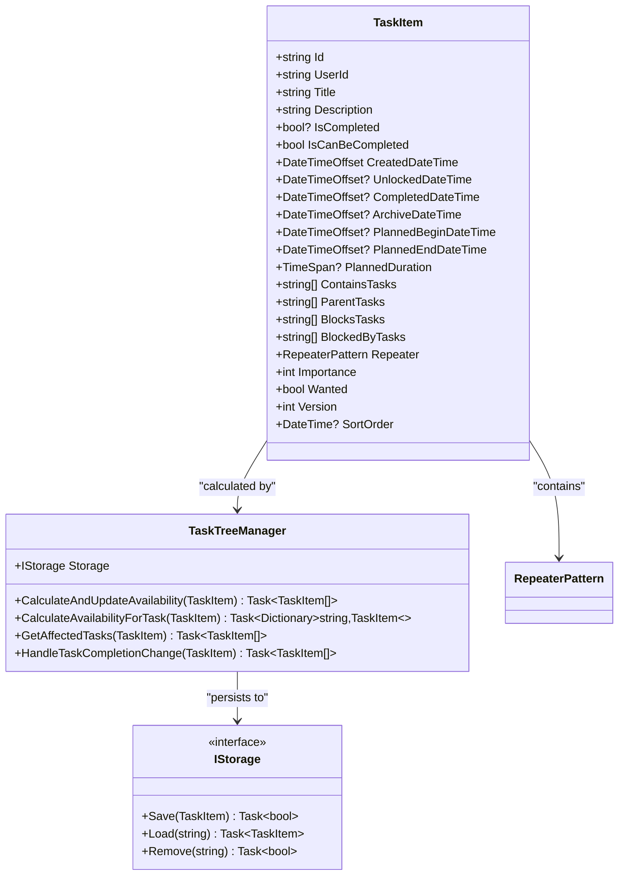
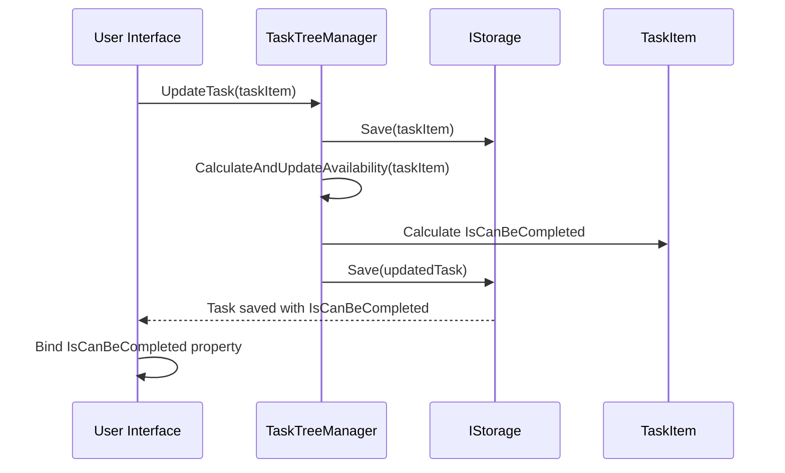
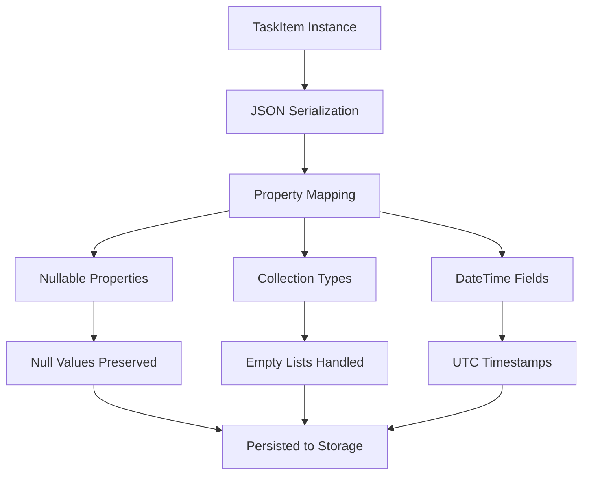
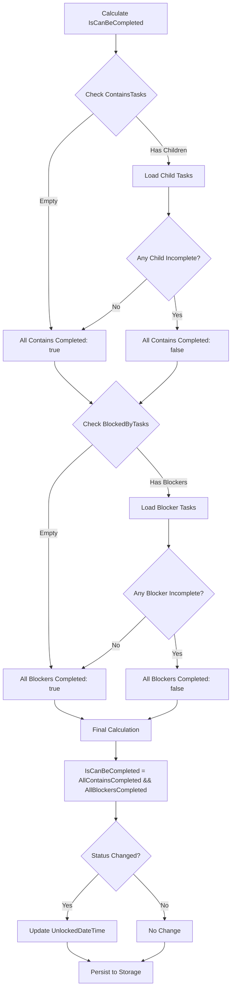
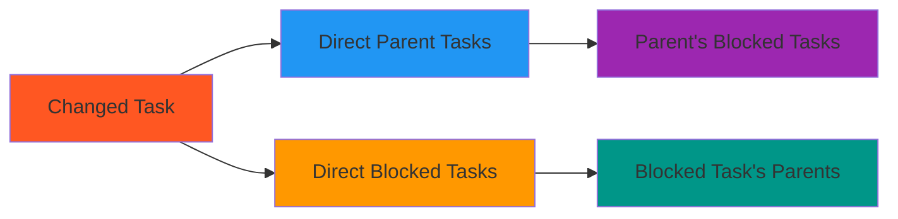
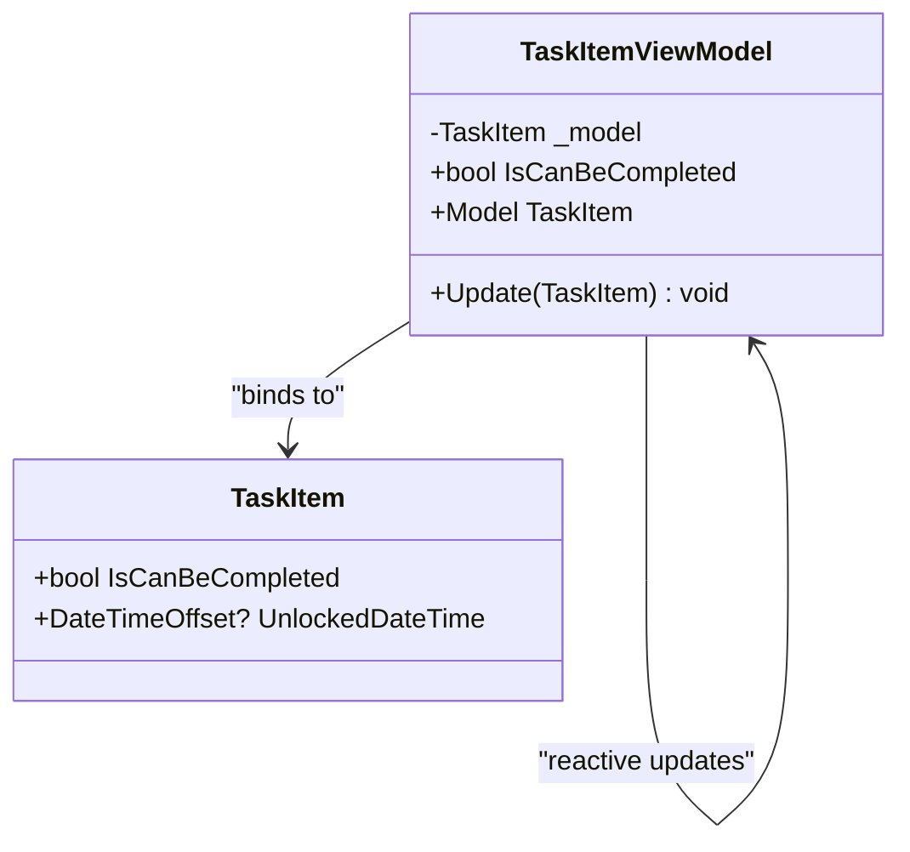
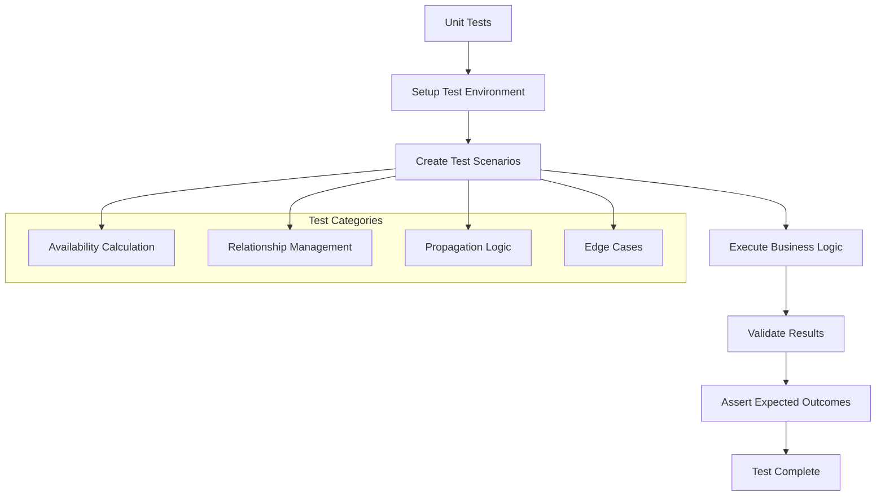

# Domain Model (TaskItem)

<cite>
**Referenced Files in This Document**
- [TaskItem.cs](file://src/Unlimotion.Domain/TaskItem.cs)
- [TaskTreeManager.cs](file://src/Unlimotion.TaskTreeManager/TaskTreeManager.cs)
- [ITaskTreeManager.cs](file://src/Unlimotion.TaskTreeManager/ITaskTreeManager.cs)
- [RepeaterPattern.cs](file://src/Unlimotion.Domain/RepeaterPattern.cs)
- [TaskItemViewModel.cs](file://src/Unlimotion.ViewModel/TaskItemViewModel.cs)
- [FileTaskStorage.cs](file://src/Unlimotion/FileTaskStorage.cs)
- [InMemoryStorage.cs](file://src/Unlimotion.Test/InMemoryStorage.cs)
- [TaskAvailabilityCalculationTests.cs](file://src/Unlimotion.Test/TaskAvailabilityCalculationTests.cs)
</cite>

## Table of Contents
1. [Introduction](#introduction)
2. [Core Architecture](#core-architecture)
3. [TaskItem Properties](#taskitem-properties)
4. [Relationship Management](#relationship-management)
5. [Business Logic Integration](#business-logic-integration)
6. [Serialization and Persistence](#serialization-and-persistence)
7. [Availability Calculation](#availability-calculation)
8. [UI Layer Integration](#ui-layer-integration)
9. [Testing and Validation](#testing-and-validation)
10. [Performance Considerations](#performance-considerations)

## Introduction

The TaskItem domain model serves as the core data structure for task management in the Unlimotion system. It represents a persistent entity that encapsulates all aspects of a task, including its content, relationships, scheduling information, and business logic state. The model is designed to support complex hierarchical task structures with containment relationships, blocking dependencies, and sophisticated availability calculations.

As part of the separation of concerns architecture, the TaskItem model now includes the `IsCanBeCompleted` property, which was previously calculated reactively in the presentation layer. This change enables efficient querying, historical tracking, and server-side availability checks while maintaining consistency across all application layers.

## Core Architecture

The TaskItem domain model follows a clean domain-driven design approach, separating data structure from business logic. The model itself is a simple POCO (Plain Old CLR Object) that contains all necessary properties for task representation, while the business logic resides in the TaskTreeManager service.



**Diagram sources**
- [TaskItem.cs](file://src/Unlimotion.Domain/TaskItem.cs#L5-L30)
- [TaskTreeManager.cs](file://src/Unlimotion.TaskTreeManager/TaskTreeManager.cs#L1-L50)
- [ITaskTreeManager.cs](file://src/Unlimotion.TaskTreeManager/ITaskTreeManager.cs#L6-L42)

**Section sources**
- [TaskItem.cs](file://src/Unlimotion.Domain/TaskItem.cs#L1-L33)
- [TaskTreeManager.cs](file://src/Unlimotion.TaskTreeManager/TaskTreeManager.cs#L1-L100)

## TaskItem Properties

The TaskItem model contains comprehensive properties organized into several functional categories:

### Core Identity Properties
- **Id**: Unique identifier for the task (string)
- **UserId**: Associated user identifier for multi-user support
- **Title**: Human-readable task name
- **Description**: Detailed task description

### Lifecycle Properties
- **IsCompleted**: Nullable boolean indicating completion state
  - `false`: Active/in-progress task
  - `true`: Completed task
  - `null`: Archived task (treated as completed for blocking purposes)
- **CreatedDateTime**: Task creation timestamp (default: UtcNow)
- **UnlockedDateTime**: Timestamp when task became available for completion
- **CompletedDateTime**: Timestamp when task was marked as completed
- **ArchiveDateTime**: Timestamp when task was archived

### Planning Properties
- **PlannedBeginDateTime**: Scheduled start date/time
- **PlannedEndDateTime**: Scheduled end date/time  
- **PlannedDuration**: Duration of the task
- **Importance**: Priority level (int)
- **Wanted**: User preference flag (bool)
- **Version**: Incremental version counter for conflict resolution
- **SortOrder**: Ordering field for display purposes

### Relationship Collections
The model stores relationships as string collections containing task IDs, enabling flexible hierarchical structures:

- **ContainsTasks**: List of child task IDs (containment relationships)
- **ParentTasks**: List of parent task IDs (reverse containment relationships)
- **BlocksTasks**: List of tasks this task blocks
- **BlockedByTasks**: List of tasks that block this task

### Advanced Features
- **Repeater**: Repeating pattern configuration for recurring tasks
- **SortOrder**: DateTime field for task ordering

**Section sources**
- [TaskItem.cs](file://src/Unlimotion.Domain/TaskItem.cs#L5-L30)

## Relationship Management

The TaskItem model implements a sophisticated relationship management system using string-based task ID collections. This approach provides flexibility while maintaining referential integrity through the TaskTreeManager service.

```mermaid
graph TB
subgraph "Task Relationships"
A[Task A<br/>ContainsTasks: [B,C]<br/>ParentTasks: []]
B[Task B<br/>ContainsTasks: []<br/>ParentTasks: [A]]
C[Task C<br/>ContainsTasks: []<br/>ParentTasks: [A]]
D[Task D<br/>BlocksTasks: [E]<br/>BlockedByTasks: []]
E[Task E<br/>BlocksTasks: []<br/>BlockedByTasks: [D]]
end
A -.->|"Contains"| B
A -.->|"Contains"| C
B -.->|"Parent"| A
C -.->|"Parent"| A
D -.->|"Blocks"| E
E -.->|"Blocked By"| D
```

**Diagram sources**
- [TaskItem.cs](file://src/Unlimotion.Domain/TaskItem.cs#L18-L23)

### Relationship Types

#### Containment Relationships
- **ContainsTasks**: Defines child tasks that must be completed before the parent can be completed
- **ParentTasks**: Reverse relationship for navigation from child to parent
- **Business Rule**: All contained tasks must be completed (IsCompleted != false) for parent to be available

#### Blocking Relationships  
- **BlocksTasks**: Defines tasks that this task prevents from being completed
- **BlockedByTasks**: Reverse relationship for identifying blockers
- **Business Rule**: All blocking tasks must be completed for this task to be available

### Relationship Integrity

The TaskTreeManager ensures relationship integrity through several mechanisms:
- **Bidirectional Updates**: Adding a relationship updates both sides
- **Circular Dependency Prevention**: Built-in detection and handling
- **Cascade Operations**: Changes propagate through affected relationships

**Section sources**
- [TaskTreeManager.cs](file://src/Unlimotion.TaskTreeManager/TaskTreeManager.cs#L450-L550)

## Business Logic Integration

The TaskItem model integrates with the TaskTreeManager to provide comprehensive business logic for task management. The integration follows a clear separation of concerns where the domain model stores calculated state while the manager handles business rules.

### Availability Calculation Integration

The TaskItem now includes the `IsCanBeCompleted` property, which represents the calculated availability state determined by the TaskTreeManager. This property is persisted to storage and can be queried without runtime calculation.



**Diagram sources**
- [TaskTreeManager.cs](file://src/Unlimotion.TaskTreeManager/TaskTreeManager.cs#L629-L665)
- [ITaskTreeManager.cs](file://src/Unlimotion.TaskTreeManager/ITaskTreeManager.cs#L35-L42)

### Integration Points

The TaskTreeManager provides several integration points that trigger availability recalculation:

| Method | Triggers Recalculation | Affected Tasks |
|--------|----------------------|----------------|
| `AddChildTask` | Always | Parent task |
| `CreateBlockingBlockedByRelation` | Always | Blocked task only |
| `BreakParentChildRelation` | Always | Parent task |
| `BreakBlockingBlockedByRelation` | Always | Blocked task only |
| `DeleteTask` | Always | All parents + all blocked tasks |
| `UpdateTask` | If IsCompleted changed | Task + parents + blocked tasks |

**Section sources**
- [TaskTreeManager.cs](file://src/Unlimotion.TaskTreeManager/TaskTreeManager.cs#L629-L700)
- [ITaskTreeManager.cs](file://src/Unlimotion.TaskTreeManager/ITaskTreeManager.cs#L6-L35)

## Serialization and Persistence

The TaskItem model supports seamless serialization and persistence through JSON serialization, with automatic handling of the newly introduced `IsCanBeCompleted` property.

### JSON Serialization Behavior

The model leverages JSON.NET for serialization, with automatic handling of nullable properties and collection types:



**Diagram sources**
- [FileTaskStorage.cs](file://src/Unlimotion/FileTaskStorage.cs#L210-L248)

### Storage Integration

The TaskItem model works seamlessly with various storage implementations:

#### File Storage
- JSON file per task
- Automatic serialization/deserialization
- Atomic write operations

#### Memory Storage (Testing)
- In-memory dictionary storage
- Cloning for thread safety
- Immediate persistence

#### RavenDB Storage
- Document-based persistence
- Automatic ID prefixing for uniqueness
- Bulk operations support

### Data Migration

The system includes automatic migration capabilities for existing data:

- **Initial Migration**: Calculates `IsCanBeCompleted` for all existing tasks
- **One-time Operation**: Runs during first application startup
- **Report Generation**: Creates migration report for audit purposes

**Section sources**
- [FileTaskStorage.cs](file://src/Unlimotion/FileTaskStorage.cs#L210-L291)
- [InMemoryStorage.cs](file://src/Unlimotion.Test/InMemoryStorage.cs#L10-L36)

## Availability Calculation

The heart of the TaskItem model's business logic lies in its availability calculation system, which determines whether a task can be completed based on complex dependency relationships.

### Business Rules

A task can be completed when both conditions are met:

1. **All contained tasks are completed**: `ContainsTasks.All(taskId => GetTask(taskId).IsCompleted != false)`
2. **All blocking tasks are completed**: `BlockedByTasks.All(taskId => GetTask(taskId).IsCompleted != false)`

### Calculation Algorithm



**Diagram sources**
- [TaskTreeManager.cs](file://src/Unlimotion.TaskTreeManager/TaskTreeManager.cs#L640-L699)

### Availability State Management

The system manages availability state transitions with automatic timestamp tracking:

| Event | IsCanBeCompleted Before | IsCanBeCompleted After | UnlockedDateTime Action |
|-------|------------------------|------------------------|-------------------------|
| Task becomes available | `false` | `true` | Set to current UTC time |
| Task becomes blocked | `true` | `false` | Clear to `null` |
| No change | `true` | `true` | No action |
| No change | `false` | `false` | No action |

### Propagation Logic

When a task's completion status changes, the system identifies and recalculates affected tasks:



**Diagram sources**
- [TaskTreeManager.cs](file://src/Unlimotion.TaskTreeManager/TaskTreeManager.cs#L700-L750)

**Section sources**
- [TaskTreeManager.cs](file://src/Unlimotion.TaskTreeManager/TaskTreeManager.cs#L629-L750)
- [TaskAvailabilityCalculationTests.cs](file://src/Unlimotion.Test/TaskAvailabilityCalculationTests.cs#L121-L385)

## UI Layer Integration

The TaskItem model integrates seamlessly with the presentation layer through the TaskItemViewModel, which provides reactive bindings and UI-specific functionality.

### Property Binding Architecture

The TaskItemViewModel maintains a simplified binding architecture by consuming the pre-calculated `IsCanBeCompleted` property from the domain model:



**Diagram sources**
- [TaskItemViewModel.cs](file://src/Unlimotion.ViewModel/TaskItemViewModel.cs#L570-L588)

### Reactive Subscriptions

The UI layer now relies on the TaskTreeManager for availability calculations, reducing reactive complexity:

- **Removed Reactive Logic**: Previously calculated `IsCanBeCompleted` through reactive subscriptions
- **Simplified Property**: Direct binding to `TaskItem.IsCanBeCompleted`
- **Automatic Updates**: ViewModel receives updated values through storage notifications

### Collection Synchronization

The TaskItemViewModel includes sophisticated collection synchronization logic for relationship collections:

- **Bidirectional Updates**: Maintains consistency between observable collections and model lists
- **Efficient Updates**: Uses hash sets for optimal performance during synchronization
- **Change Tracking**: Monitors collection changes for UI updates

**Section sources**
- [TaskItemViewModel.cs](file://src/Unlimotion.ViewModel/TaskItemViewModel.cs#L570-L665)

## Testing and Validation

The TaskItem model includes comprehensive testing coverage through dedicated unit tests that validate availability calculation logic and relationship management.

### Test Coverage Areas

The testing suite covers critical scenarios:

- **Basic Availability**: Tasks with no dependencies should be available
- **Containment Logic**: Tasks with completed children should be available
- **Blocking Logic**: Tasks with incomplete blockers should not be available
- **Mixed Dependencies**: Tasks with both contained and blocking dependencies
- **Propagation Logic**: Changes trigger appropriate recalculation cascades
- **Edge Cases**: Archived tasks, null values, and boundary conditions

### Test Implementation



**Diagram sources**
- [TaskAvailabilityCalculationTests.cs](file://src/Unlimotion.Test/TaskAvailabilityCalculationTests.cs#L1-L50)

### Validation Strategies

The testing framework employs several validation approaches:

- **State Verification**: Ensures correct availability state after operations
- **Timestamp Validation**: Verifies `UnlockedDateTime` updates appropriately
- **Propagation Testing**: Validates cascade effects of relationship changes
- **Consistency Checks**: Ensures bidirectional relationship integrity

**Section sources**
- [TaskAvailabilityCalculationTests.cs](file://src/Unlimotion.Test/TaskAvailabilityCalculationTests.cs#L121-L683)

## Performance Considerations

The TaskItem model and associated business logic are designed with performance optimization in mind, particularly for applications with large task hierarchies.

### Optimization Techniques

#### Lazy Loading
- Relationships are loaded on-demand during availability calculations
- Task dependencies are cached during calculation batches
- Circular dependency detection prevents infinite loops

#### Batch Operations
- Multiple relationship changes are batched for efficiency
- Availability calculations are grouped to minimize storage I/O
- Affected task propagation uses efficient collection algorithms

#### Memory Management
- Weak references prevent memory leaks in long-running applications
- Collection synchronization uses hash-based lookups for O(1) performance
- ViewModel caching reduces redundant calculations

### Scalability Factors

| Factor | Impact | Mitigation |
|--------|--------|------------|
| Task Count | Linear calculation time | Batch processing, caching |
| Dependency Depth | Exponential propagation | Topological sorting, limits |
| Relationship Changes | Variable impact | Selective recalculation |
| Storage I/O | Bottleneck factor | Async operations, batching |

### Monitoring and Profiling

The system includes built-in monitoring capabilities:

- **Calculation Timing**: Tracks availability calculation duration
- **Storage Performance**: Monitors save/load operation times
- **Memory Usage**: Tracks collection sizes and growth
- **Error Rates**: Logs calculation failures and recoveries

### Best Practices

For optimal performance:

1. **Minimize Relationship Changes**: Batch related operations
2. **Use Appropriate Filters**: Leverage `IsCanBeCompleted` for queries
3. **Implement Caching**: Cache frequently accessed task data
4. **Monitor Propagation**: Track cascade effects of changes
5. **Optimize Storage**: Use appropriate storage backend for scale