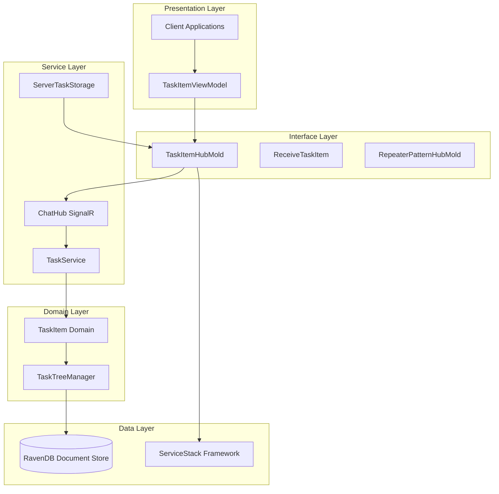
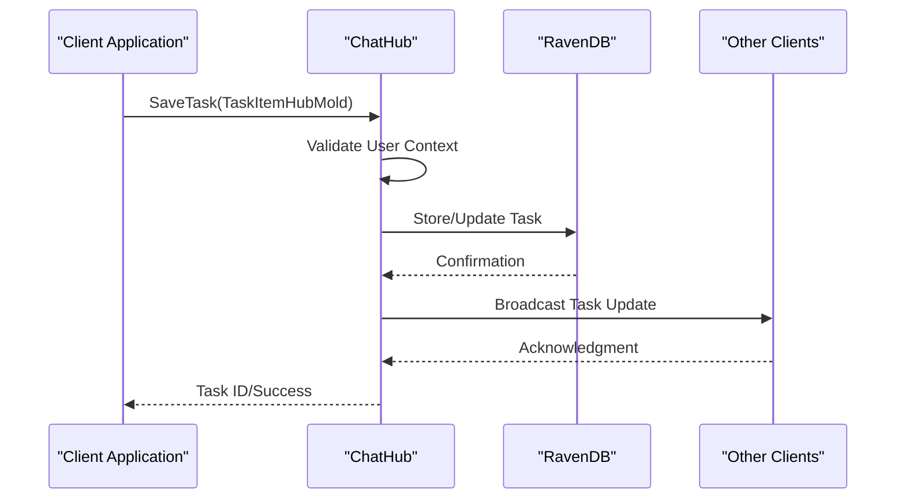

# Interface Model (TaskItemHubMold)

<cite>
**Referenced Files in This Document**
- [TaskItemHubMold.cs](file://src/Unlimotion.Interface/TaskItemHubMold.cs)
- [TaskItem.cs](file://src/Unlimotion.Domain/TaskItem.cs)
- [ReceiveTaskItem.cs](file://src/Unlimotion.Interface/ReceiveTaskItem.cs)
- [RepeaterPatternHubMold.cs](file://src/Unlimotion.Interface/RepeaterPatternHubMold.cs)
- [IChatHub.cs](file://src/Unlimotion.Interface/IChatHub.cs)
- [ChatHub.cs](file://src/Unlimotion.Server/hubs/ChatHub.cs)
- [ServerTaskStorage.cs](file://src/Unlimotion/ServerTaskStorage.cs)
- [AppModelMapping.cs](file://src/Unlimotion/AppModelMapping.cs)
- [TaskService.cs](file://src/Unlimotion.Server.ServiceInterface/TaskService.cs)
</cite>

## Table of Contents
1. [Introduction](#introduction)
2. [Architecture Overview](#architecture-overview)
3. [Core Properties Analysis](#core-properties-analysis)
4. [Serialization-Friendly Design](#serialization-friendly-design)
5. [Domain Model Comparison](#domain-model-comparison)
6. [SignalR Communication Patterns](#signalr-communication-patterns)
7. [Server-Client Synchronization](#server-client-synchronization)
8. [Integration with ServiceStack Framework](#integration-with-servicestack-framework)
9. [RavenDB Storage Layer Compatibility](#ravendb-storage-layer-compatibility)
10. [Performance Considerations](#performance-considerations)
11. [Best Practices](#best-practices)
12. [Troubleshooting Guide](#troubleshooting-guide)

## Introduction

The `TaskItemHubMold` class serves as a specialized Data Transfer Object (DTO) optimized for SignalR-based real-time communication between clients and servers in the Unlimotion application. This interface model acts as a bridge between the domain-driven architecture and the presentation layer, providing a streamlined representation of task data specifically designed for efficient serialization and transmission across network boundaries.

As a SignalR-optimized DTO, `TaskItemHubMold` differs significantly from the domain model (`TaskItem`) by employing non-nullable types where appropriate, initializing collections to prevent null reference exceptions, and structuring properties for optimal JSON serialization performance. The class maintains compatibility with the ServiceStack framework while enabling seamless integration with RavenDB's document storage capabilities.

## Architecture Overview

The `TaskItemHubMold` operates within a layered architecture that separates concerns between data persistence, business logic, and presentation. This design ensures that the interface model remains focused on communication efficiency while delegating complex business rules to the domain layer.

**Diagram sources**
- [TaskItemHubMold.cs](file://src/Unlimotion.Interface/TaskItemHubMold.cs#L1-L30)
- [ChatHub.cs](file://src/Unlimotion.Server/hubs/ChatHub.cs#L1-L106)
- [ServerTaskStorage.cs](file://src/Unlimotion/ServerTaskStorage.cs#L1-L555)

## Core Properties Analysis

### Identity Properties

The identity properties form the foundation of task identification and relationship management:

| Property | Type | Purpose | Serialization Impact |
|----------|------|---------|---------------------|
| `Id` | `string` | Unique identifier for the task | Primary key for RavenDB indexing |
| `Version` | `int` | Optimistic concurrency control | Enables conflict resolution |
| `SortOrder` | `DateTime` | Hierarchical ordering | Supports tree traversal algorithms |

The `Id` property serves as the primary key for RavenDB document storage, while `Version` provides optimistic concurrency support essential for distributed task synchronization. The `SortOrder` property uses `DateTime` instead of `DateTimeOffset` to optimize sorting performance in tree structures.

### Metadata Properties

Metadata properties capture the essential descriptive information of a task:

| Property | Type | Default Value | Business Significance |
|----------|------|---------------|----------------------|
| `Title` | `string` | N/A | Primary task identifier |
| `Description` | `string` | N/A | Detailed task information |
| `Importance` | `int` | N/A | Priority classification |
| `Wanted` | `bool` | N/A | User preference indicator |

These properties are designed for immediate display and filtering, with minimal validation overhead suitable for rapid UI updates.

### State Tracking Properties

State tracking properties manage task lifecycle and completion status:

| Property | Type | Nullable | Purpose |
|----------|------|----------|---------|
| `IsCompleted` | `bool?` | Yes | Three-state completion status |
| `UnlockedDateTime` | `DateTimeOffset?` | Yes | Availability determination |
| `CompletedDateTime` | `DateTimeOffset?` | Yes | Completion timestamp |
| `ArchiveDateTime` | `DateTimeOffset?` | Yes | Archival timestamp |
| `PlannedBeginDateTime` | `DateTimeOffset?` | Yes | Scheduled start time |
| `PlannedEndDateTime` | `DateTimeOffset?` | Yes | Scheduled completion time |
| `PlannedDuration` | `TimeSpan?` | Yes | Expected duration |

The nullable boolean `IsCompleted` allows for three-state completion tracking: completed, not completed, and unknown status, which is crucial for real-time synchronization scenarios.

### Relationship Reference Properties

Relationship properties establish task interdependencies and hierarchical structures:

| Property | Type | Default Collection | Business Role |
|----------|------|-------------------|---------------|
| `ContainsTasks` | `List<string>` | Empty | Child task relationships |
| `ParentTasks` | `List<string>?` | Null | Parent task references |
| `BlocksTasks` | `List<string>` | Empty | Blocking task dependencies |
| `BlockedByTasks` | `List<string>` | Pre-initialized | Reverse blocking relationships |

The pre-initialization of `BlockedByTasks` collection prevents null reference exceptions during relationship establishment, a common issue in dynamic task manipulation scenarios.

### Configuration Properties

Configuration properties control task behavior and automation:

| Property | Type | Purpose | Integration Point |
|----------|------|---------|------------------|
| `Repeater` | `RepeaterPatternHubMold` | Automation scheduling | Recurrence pattern definition |
| `UserId` | Implicit | Authentication context | Multi-user isolation |

**Section sources**
- [TaskItemHubMold.cs](file://src/Unlimotion.Interface/TaskItemHubMold.cs#L1-L30)

## Serialization-Friendly Design

The `TaskItemHubMold` class exhibits several design characteristics optimized for efficient JSON serialization:

### Non-Nullable Types for Primitive Values

The class employs non-nullable types for primitive values where appropriate, reducing serialization overhead and eliminating null-checking logic in consuming applications. This design choice prioritizes performance over strict null safety, assuming that consumers will handle missing properties gracefully.

### Collection Initialization Strategy

Collections are initialized either with empty instances or pre-initialized with default values. The `BlockedByTasks` property demonstrates this pattern by providing an empty list constructor, preventing null reference exceptions during relationship building operations.

### DateTime vs DateTimeOffset Selection

The choice between `DateTime` and `DateTimeOffset` types reflects performance considerations and use case requirements. `SortOrder` uses `DateTime` for tree sorting operations, while temporal properties use `DateTimeOffset` for timezone-aware storage and display.

### Property Ordering for Serialization

Properties are ordered to optimize JSON serialization performance, placing frequently accessed properties at the beginning of the serialized representation and grouping related properties together.

**Section sources**
- [TaskItemHubMold.cs](file://src/Unlimotion.Interface/TaskItemHubMold.cs#L1-L30)

## Domain Model Comparison

The `TaskItemHubMold` differs significantly from the domain model (`TaskItem`) in several key areas:

### Nullable vs Non-Nullable Properties

| Aspect | TaskItem (Domain) | TaskItemHubMold (Interface) | Rationale |
|--------|-------------------|----------------------------|-----------|
| `IsCompleted` | `bool?` | `bool?` | Both support three-state completion |
| `ParentTasks` | `List<string>?` | `List<string>?` | Consistent nullable handling |
| `BlockedByTasks` | `List<string>?` | `List<string>` | Mold initializes to prevent null refs |
| `SortOrder` | `DateTime?` | `DateTime` | Mold uses non-nullable for performance |
| `CreatedDateTime` | `DateTimeOffset` | Excluded | Not part of interface contract |

### Collection Initialization Differences

The domain model initializes all collection properties to empty lists, while the interface model only initializes `BlockedByTasks`. This difference reflects the different use cases: domain models represent complete entity state, while interface models represent partial, transferable state.

### Additional Properties in Domain Model

The domain model includes properties not present in the interface model, such as `UserId` and `CreatedDateTime`, which are managed by the infrastructure layer rather than being exposed to the interface.

### Property Exclusions

The interface model excludes properties like `CreatedDateTime` and `UserId` that are handled by the authentication and persistence layers, focusing on data that needs to be transmitted between client and server.

**Section sources**
- [TaskItem.cs](file://src/Unlimotion.Domain/TaskItem.cs#L1-L33)
- [TaskItemHubMold.cs](file://src/Unlimotion.Interface/TaskItemHubMold.cs#L1-L30)

## SignalR Communication Patterns

The `TaskItemHubMold` facilitates several SignalR communication patterns essential for real-time task synchronization:

### Real-Time Task Updates

**Diagram sources**
- [ChatHub.cs](file://src/Unlimotion.Server/hubs/ChatHub.cs#L48-L106)
- [IChatHub.cs](file://src/Unlimotion.Interface/IChatHub.cs#L1-L14)

### Task Deletion Broadcasting

The interface model supports task deletion operations through SignalR groups, enabling real-time notification of task removal across connected clients.

### Batch Operations

The model supports batch operations for bulk task creation and updates, optimizing network utilization for scenarios involving multiple task modifications.

### Conflict Resolution

The inclusion of `Version` property enables optimistic concurrency control, allowing clients to detect and resolve conflicts when multiple users modify the same task simultaneously.

**Section sources**
- [ChatHub.cs](file://src/Unlimotion.Server/hubs/ChatHub.cs#L48-L106)
- [IChatHub.cs](file://src/Unlimotion.Interface/IChatHub.cs#L1-L14)

## Server-Client Synchronization

The `TaskItemHubMold` enables efficient task synchronization across distributed components through several mechanisms:

### Automatic Mapping Configuration

The AutoMapper configuration establishes bidirectional mapping between domain and interface models, ensuring consistent data transformation across the application stack.

### Version Control Integration

The `Version` property supports optimistic locking, enabling clients to detect concurrent modifications and implement appropriate conflict resolution strategies.

### Timestamp Management

Temporal properties use `DateTimeOffset` to maintain timezone awareness while ensuring consistent timestamp representation across geographically distributed clients.

### Relationship Propagation

Task relationships are efficiently propagated through the `ContainsTasks`, `ParentTasks`, `BlocksTasks`, and `BlockedByTasks` properties, enabling comprehensive task tree synchronization.

**Section sources**
- [AppModelMapping.cs](file://src/Unlimotion/AppModelMapping.cs#L30-L39)
- [ServerTaskStorage.cs](file://src/Unlimotion/ServerTaskStorage.cs#L480-L516)

## Integration with ServiceStack Framework

The `TaskItemHubMold` integrates seamlessly with the ServiceStack framework through several mechanisms:

### Service Contract Definition

The interface model participates in ServiceStack service contracts, enabling RESTful API operations for task management.

### JSON Serialization Support

ServiceStack's JSON serialization engine optimizes serialization performance for the `TaskItemHubMold` structure, leveraging its predictable property layout and type choices.

### Authentication Integration

The model works with ServiceStack's authentication system through implicit `UserId` propagation, ensuring proper access control for task operations.

### Error Handling Compatibility

The model's design accommodates ServiceStack's error handling patterns, providing meaningful feedback for validation failures and business rule violations.

**Section sources**
- [TaskService.cs](file://src/Unlimotion.Server.ServiceInterface/TaskService.cs#L1-L70)

## RavenDB Storage Layer Compatibility

The `TaskItemHubMold` maintains compatibility with RavenDB's document storage capabilities:

### Document Key Generation

The model supports RavenDB's automatic key generation while preserving explicit `Id` assignment for client-controlled identifiers.

### Indexing Optimization

Property selection and naming conventions align with RavenDB's indexing best practices, enabling efficient query performance.

### Bulk Insert Support

The model structure supports RavenDB's bulk insert operations, optimizing data loading for large-scale task migrations.

### Change Tracking Integration

The `Version` property integrates with RavenDB's change tracking mechanisms, enabling conflict detection and resolution.

**Section sources**
- [TaskService.cs](file://src/Unlimotion.Server.ServiceInterface/TaskService.cs#L50-L70)

## Performance Considerations

Several design decisions in `TaskItemHubMold` prioritize performance in distributed environments:

### Memory Efficiency

Collection initialization prevents unnecessary memory allocation for empty collections, reducing garbage collection pressure in high-frequency update scenarios.

### Serialization Optimization

Property ordering and type selection minimize JSON serialization overhead, particularly beneficial for real-time SignalR communications.

### Network Bandwidth Conservation

The model focuses on essential properties, excluding metadata and audit information that would increase payload size without contributing to core functionality.

### Caching-Friendly Structure

The property layout supports efficient caching strategies, with frequently accessed properties grouped together for optimal cache utilization.

## Best Practices

When working with `TaskItemHubMold`, developers should follow these established patterns:

### Property Assignment Guidelines

- Initialize collections using the model's constructor patterns
- Use nullable types only when the domain model requires them
- Assign meaningful values to `SortOrder` for proper tree navigation

### Error Handling Strategies

- Implement retry logic for SignalR operations due to potential network interruptions
- Handle version conflicts gracefully using optimistic concurrency patterns
- Validate task relationships before attempting to save to prevent data corruption

### Testing Approaches

- Test mapping configurations between domain and interface models
- Verify SignalR broadcast behavior under various network conditions
- Validate RavenDB indexing performance with realistic data volumes

### Monitoring and Observability

- Monitor SignalR connection stability and message delivery rates
- Track serialization performance metrics for large task batches
- Observe RavenDB query performance for task retrieval operations

## Troubleshooting Guide

Common issues and their solutions when working with `TaskItemHubMold`:

### SignalR Connection Issues

**Problem**: Tasks fail to synchronize across clients
**Solution**: Verify SignalR hub connectivity and group membership management

### Serialization Errors

**Problem**: JSON deserialization fails for complex task relationships
**Solution**: Ensure all referenced task IDs exist in the database before saving

### Version Conflicts

**Problem**: Concurrent modifications cause optimistic concurrency exceptions
**Solution**: Implement conflict resolution logic that merges changes intelligently

### Performance Degradation

**Problem**: Large task trees cause slow response times
**Solution**: Optimize tree traversal algorithms and consider pagination for deep hierarchies

**Section sources**
- [ServerTaskStorage.cs](file://src/Unlimotion/ServerTaskStorage.cs#L480-L516)
- [ChatHub.cs](file://src/Unlimotion.Server/hubs/ChatHub.cs#L48-L106)