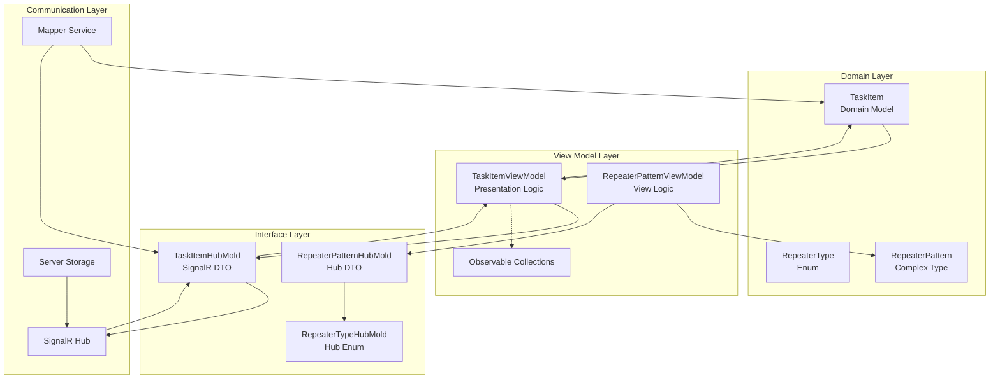
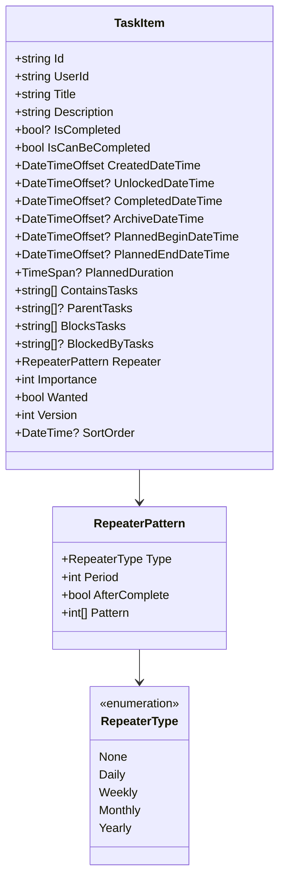
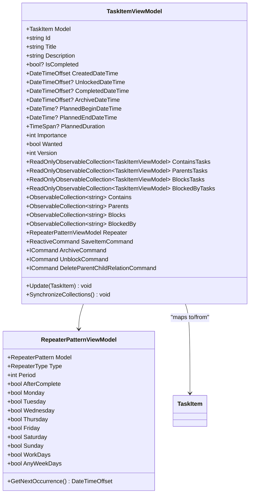
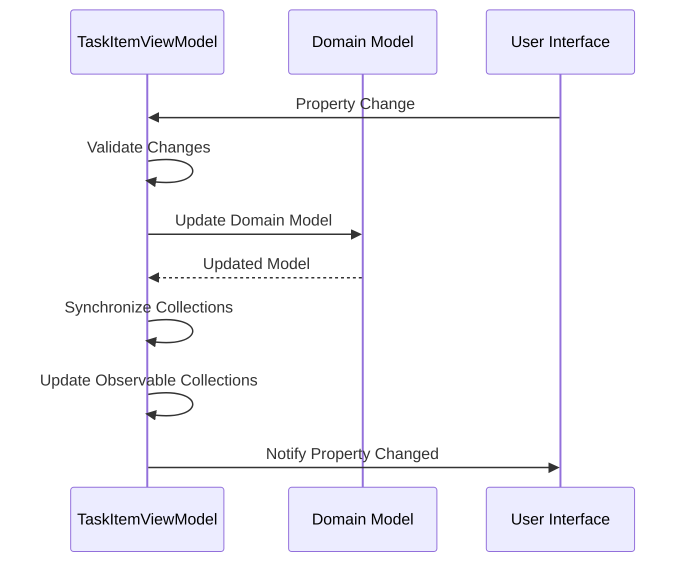
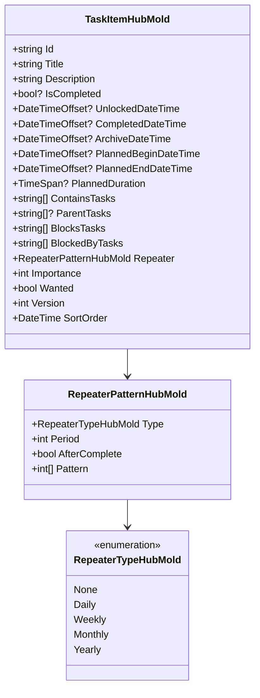
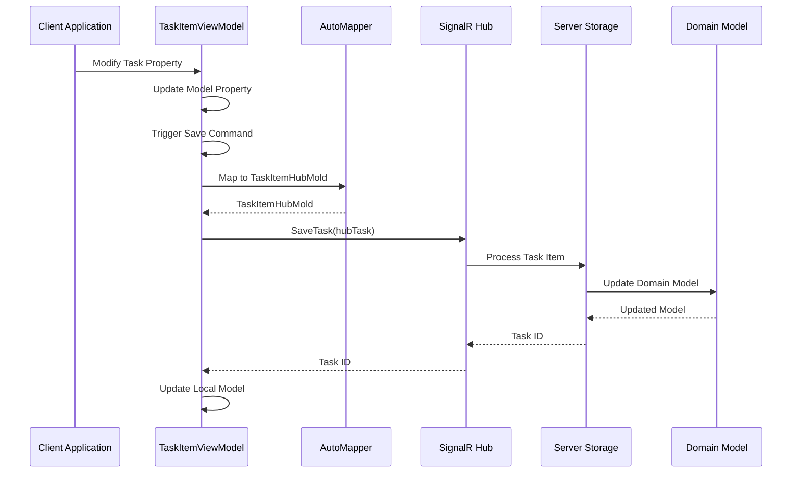
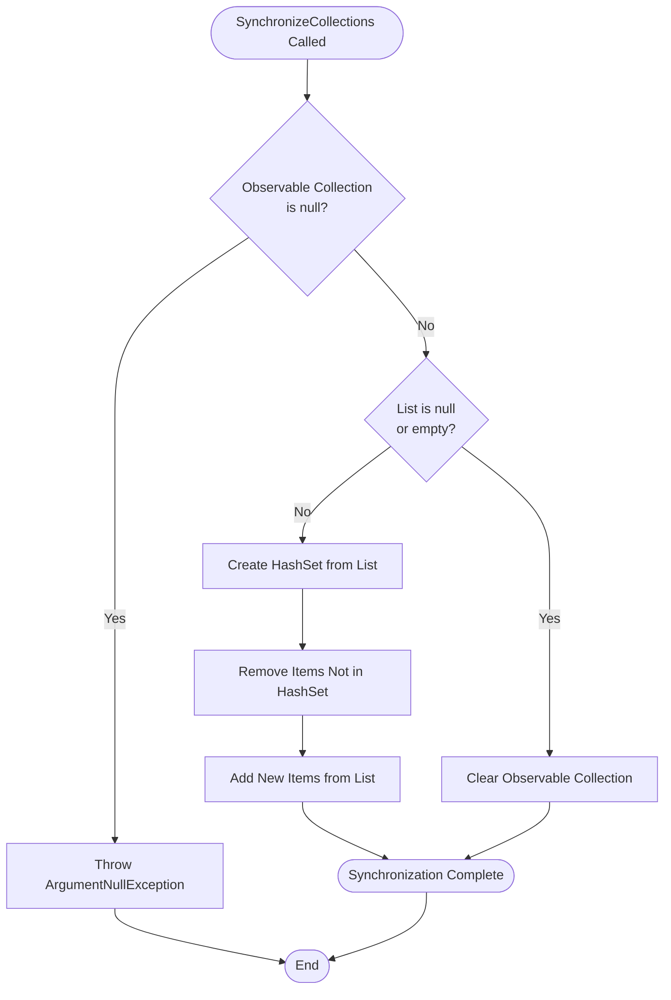
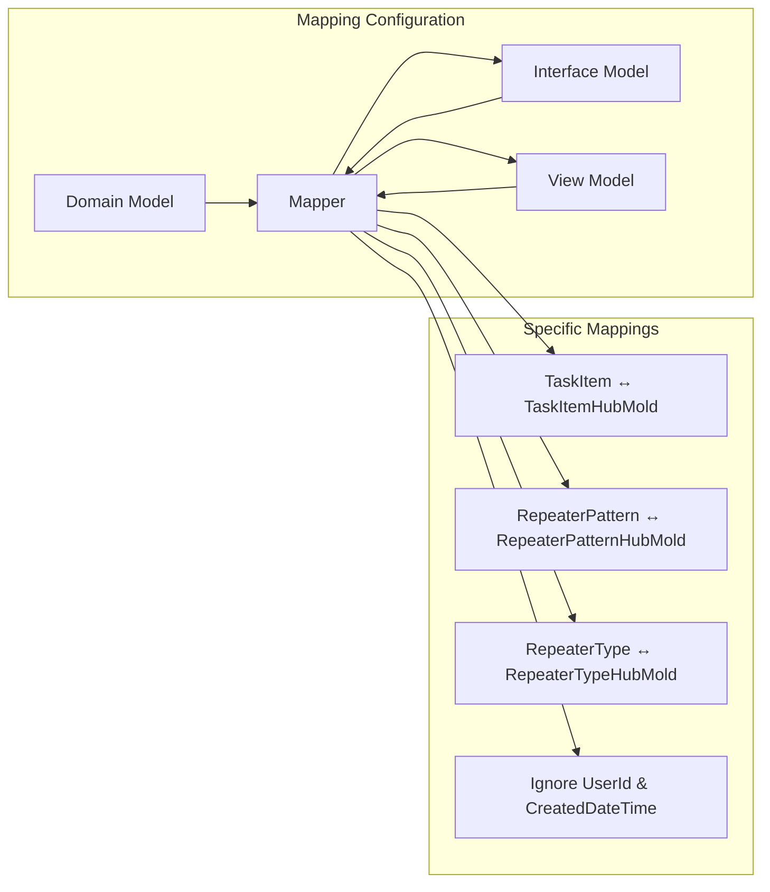

# Model Layering and Cross-Layer Communication

<cite>
**Referenced Files in This Document**
- [TaskItem.cs](file://src/Unlimotion.Domain/TaskItem.cs)
- [TaskItemViewModel.cs](file://src/Unlimotion.ViewModel/TaskItemViewModel.cs)
- [TaskItemHubMold.cs](file://src/Unlimotion.Interface/TaskItemHubMold.cs)
- [AppModelMapping.cs](file://src/Unlimotion/AppModelMapping.cs)
- [ServerTaskStorage.cs](file://src/Unlimotion/ServerTaskStorage.cs)
- [RepeaterPatternViewModel.cs](file://src/Unlimotion.ViewModel/RepeaterPatternViewModel.cs)
- [RepeaterPatternHubMold.cs](file://src/Unlimotion.Interface/RepeaterPatternHubMold.cs)
- [RepeaterType.cs](file://src/Unlimotion.Domain/RepeaterType.cs)
- [RepeaterTypeHubMold.cs](file://src/Unlimotion.Interface/RepeaterTypeHubMold.cs)
- [ReceiveTaskItem.cs](file://src/Unlimotion.Interface/ReceiveTaskItem.cs)
</cite>

## Table of Contents
1. [Introduction](#introduction)
2. [Layer Architecture Overview](#layer-architecture-overview)
3. [Domain Model Layer](#domain-model-layer)
4. [View Model Layer](#view-model-layer)
5. [Interface Model Layer](#interface-model-layer)
6. [Cross-Layer Communication](#cross-layer-communication)
7. [Data Synchronization Mechanisms](#data-synchronization-mechanisms)
8. [Mapping Strategies](#mapping-strategies)
9. [Performance Considerations](#performance-considerations)
10. [Best Practices](#best-practices)
11. [Troubleshooting Guide](#troubleshooting-guide)

## Introduction

The Unlimotion application implements a sophisticated three-layer model architecture designed to separate concerns between domain logic, presentation logic, and external communication. This architecture enables seamless data flow between the domain model (TaskItem), view model (TaskItemViewModel), and interface model (TaskItemHubMold) while maintaining data consistency and optimizing performance for SignalR-based real-time communication.

The model layering architecture serves several critical purposes:
- **Separation of Concerns**: Each layer handles specific responsibilities without overlap
- **Data Consistency**: Bidirectional synchronization ensures data integrity across layers
- **Communication Efficiency**: Optimized serialization for SignalR communication
- **Extensibility**: Modular design allows for easy modifications and additions

## Layer Architecture Overview

The TaskItem model follows a layered architecture pattern with clear boundaries between three distinct layers:

**Diagram sources**
- [TaskItem.cs](file://src/Unlimotion.Domain/TaskItem.cs#L1-L33)
- [TaskItemViewModel.cs](file://src/Unlimotion.ViewModel/TaskItemViewModel.cs#L1-L666)
- [TaskItemHubMold.cs](file://src/Unlimotion.Interface/TaskItemHubMold.cs#L1-L30)

Each layer serves specific purposes and maintains distinct responsibilities:

- **Domain Layer**: Contains core business logic and data structures
- **View Model Layer**: Handles presentation logic and reactive updates
- **Interface Layer**: Provides serialization-friendly data transfer objects

## Domain Model Layer

The domain model represents the core business entities and contains the fundamental data structures used throughout the application. The TaskItem domain model serves as the authoritative source of truth for task-related data.

### TaskItem Domain Model Structure

The TaskItem class in the domain layer contains comprehensive task information with nullable properties for flexibility:

**Diagram sources**
- [TaskItem.cs](file://src/Unlimotion.Domain/TaskItem.cs#L6-L32)
- [RepeaterType.cs](file://src/Unlimotion.Domain/RepeaterType.cs#L3-L9)

### Key Domain Model Features

The domain model emphasizes data integrity and business logic:

- **Nullable Properties**: Essential fields use nullable types to represent undefined states
- **Version Tracking**: Implements optimistic concurrency through version numbers
- **Relationship Management**: Supports hierarchical task relationships (contains, parent, blocks)
- **Repeater Patterns**: Complex scheduling capabilities for recurring tasks

**Section sources**
- [TaskItem.cs](file://src/Unlimotion.Domain/TaskItem.cs#L1-L33)

## View Model Layer

The view model layer extends the domain model with presentation-specific logic and reactive capabilities. The TaskItemViewModel acts as a bridge between the domain model and the UI, providing observable properties and business logic for the presentation layer.

### TaskItemViewModel Architecture

The TaskItemViewModel implements a sophisticated reactive architecture with automatic synchronization:

**Diagram sources**
- [TaskItemViewModel.cs](file://src/Unlimotion.ViewModel/TaskItemViewModel.cs#L20-L666)
- [RepeaterPatternViewModel.cs](file://src/Unlimotion.ViewModel/RepeaterPatternViewModel.cs#L8-L173)

### Model Property Synchronization

The Model property in TaskItemViewModel serves as the central synchronization mechanism between the view model and domain model:

**Diagram sources**
- [TaskItemViewModel.cs](file://src/Unlimotion.ViewModel/TaskItemViewModel.cs#L430-L480)

The synchronization process involves:

1. **Property Mapping**: Direct property assignment from domain model to view model
2. **Collection Synchronization**: Special handling for relationship collections
3. **Repeater Pattern Updates**: Complex type synchronization with validation
4. **Version Management**: Maintains version consistency across layers

**Section sources**
- [TaskItemViewModel.cs](file://src/Unlimotion.ViewModel/TaskItemViewModel.cs#L430-L520)

## Interface Model Layer

The interface model layer provides serialization-friendly data transfer objects specifically designed for SignalR communication. The TaskItemHubMold serves as the primary DTO for transmitting task data between client and server.

### TaskItemHubMold Structure

The TaskItemHubMold optimizes for JSON serialization and SignalR communication:

**Diagram sources**
- [TaskItemHubMold.cs](file://src/Unlimotion.Interface/TaskItemHubMold.cs#L6-L29)
- [RepeaterPatternHubMold.cs](file://src/Unlimotion.Interface/RepeaterPatternHubMold.cs#L5-L10)
- [RepeaterTypeHubMold.cs](file://src/Unlimotion.Interface/RepeaterTypeHubMold.cs#L3-L9)

### Key Differences Between Layers

The interface model introduces several important differences from the domain model:

| Feature | Domain Model | Interface Model |
|---------|-------------|----------------|
| SortOrder Type | `DateTime?` (nullable) | `DateTime` (non-nullable) |
| ParentTasks Collection | `List<string>?` (nullable) | `List<string>` (always present) |
| BlockedByTasks Collection | `List<string>?` (nullable) | `List<string>` (default initialized) |
| Repeater Pattern | Complex object | Simplified DTO |
| Version Field | Int with default | Int with default |

These differences optimize the interface model for:
- **Serialization Efficiency**: Non-nullable types reduce JSON payload size
- **Backward Compatibility**: Default-initialized collections prevent null reference exceptions
- **SignalR Performance**: Optimized data structures for real-time communication

**Section sources**
- [TaskItemHubMold.cs](file://src/Unlimotion.Interface/TaskItemHubMold.cs#L1-L30)

## Cross-Layer Communication

The application implements sophisticated cross-layer communication mechanisms that enable seamless data flow while maintaining separation of concerns.

### SignalR Communication Flow

**Diagram sources**
- [ServerTaskStorage.cs](file://src/Unlimotion/ServerTaskStorage.cs#L480-L495)
- [TaskItemViewModel.cs](file://src/Unlimotion.ViewModel/TaskItemViewModel.cs#L40-L45)

### Communication Patterns

The application employs several communication patterns:

1. **Push Notifications**: Server-initiated updates via SignalR
2. **Pull Requests**: Client requests for data synchronization
3. **Bidirectional Updates**: Real-time synchronization of changes
4. **Conflict Resolution**: Version-based conflict detection and resolution

**Section sources**
- [ServerTaskStorage.cs](file://src/Unlimotion/ServerTaskStorage.cs#L460-L520)

## Data Synchronization Mechanisms

The TaskItemViewModel implements comprehensive data synchronization mechanisms to maintain consistency across all layers.

### Collection Synchronization Logic

The `SynchronizeCollections` method handles complex relationship synchronization:

**Diagram sources**
- [TaskItemViewModel.cs](file://src/Unlimotion.ViewModel/TaskItemViewModel.cs#L625-L666)

### Synchronization Features

The synchronization system provides:

- **Bidirectional Updates**: Changes propagate from domain to view model and vice versa
- **Efficient Comparison**: Uses hash sets for O(n) performance
- **Minimal UI Updates**: Only changed items trigger UI notifications
- **Relationship Integrity**: Maintains referential integrity across collections

**Section sources**
- [TaskItemViewModel.cs](file://src/Unlimotion.ViewModel/TaskItemViewModel.cs#L625-L666)

## Mapping Strategies

The application uses AutoMapper for efficient and reliable cross-layer data mapping with explicit configuration for each transformation.

### AutoMapper Configuration

The mapping configuration establishes clear transformation rules:

**Diagram sources**
- [AppModelMapping.cs](file://src/Unlimotion/AppModelMapping.cs#L15-L39)

### Mapping Rules and Constraints

The AutoMapper configuration implements specific rules:

1. **UserId Ignored**: User identification handled separately from task data
2. **CreatedDateTime Ignored**: Timestamps managed by the storage system
3. **SortOrder Excluded**: Sorting handled by presentation logic
4. **Bidirectional Mapping**: Full round-trip capability for all models

### Manual Mapping Implementation

For complex scenarios requiring custom logic, the application implements manual mapping:

- **Repeater Pattern Conversion**: Complex object-to-DTO transformation
- **Collection Synchronization**: Custom logic for relationship management
- **Property Validation**: Business rule enforcement during mapping

**Section sources**
- [AppModelMapping.cs](file://src/Unlimotion/AppModelMapping.cs#L15-L39)

## Performance Considerations

The model layering architecture incorporates several performance optimization strategies to ensure efficient operation at scale.

### Memory Management

- **Lazy Loading**: Collections loaded on-demand to reduce memory footprint
- **Weak References**: Prevent memory leaks in long-running applications
- **Disposable Pattern**: Proper resource cleanup for reactive streams

### Serialization Optimization

- **DTO Design**: Minimal payload size through optimized data structures
- **Nullable Types**: Reduced JSON serialization overhead
- **Default Initialization**: Eliminates null checks in client-side code

### Reactive Performance

- **Throttling**: Property change events throttled to prevent excessive updates
- **Batch Operations**: Multiple changes batched into single updates
- **Selective Synchronization**: Only changed properties trigger updates

### Caching Strategies

- **Model Caching**: Domain models cached for frequently accessed data
- **View Model Caching**: Presentation state cached for UI responsiveness
- **Mapping Caching**: AutoMapper compiled mappings for optimal performance

## Best Practices

### Layer Separation Guidelines

1. **Domain Layer**: Contains pure business logic, no UI dependencies
2. **View Model Layer**: Handles presentation logic, reactive updates
3. **Interface Layer**: Focuses on serialization and communication

### Data Consistency Patterns

- **Version-Based Concurrency**: Use version numbers for conflict detection
- **Immutable Transforms**: Create new instances for data modifications
- **Event-Driven Updates**: Use reactive patterns for state changes

### Error Handling Strategies

- **Graceful Degradation**: Failures in one layer don't crash the entire system
- **Retry Logic**: Automatic retry for transient failures
- **Fallback Values**: Default values for missing or invalid data

### Testing Approaches

- **Unit Testing**: Individual layer functionality testing
- **Integration Testing**: Cross-layer communication validation
- **Performance Testing**: Load testing for scalability verification

## Troubleshooting Guide

### Common Issues and Solutions

#### Data Synchronization Problems

**Issue**: View model properties not updating after domain model changes
**Solution**: Verify Model property setter is called and synchronization logic executes

**Issue**: Collection relationships not maintaining integrity
**Solution**: Check SynchronizeCollections method implementation and relationship validation

#### Mapping Errors

**Issue**: AutoMapper configuration errors during startup
**Solution**: Verify all required mappings are configured and no circular dependencies exist

**Issue**: Data loss during mapping transformations
**Solution**: Review mapping configuration and implement custom mapping logic for complex types

#### Performance Issues

**Issue**: Slow UI updates during bulk operations
**Solution**: Implement batch processing and throttle property change notifications

**Issue**: High memory usage with large datasets
**Solution**: Enable lazy loading and implement pagination for large collections

### Debugging Tools

- **Property Change Monitoring**: Track property change events for debugging
- **Mapping Validation**: Verify AutoMapper configuration correctness
- **Performance Profiling**: Monitor memory usage and serialization performance

**Section sources**
- [TaskItemViewModel.cs](file://src/Unlimotion.ViewModel/TaskItemViewModel.cs#L203-L232)
- [AppModelMapping.cs](file://src/Unlimotion/AppModelMapping.cs#L10-L15)