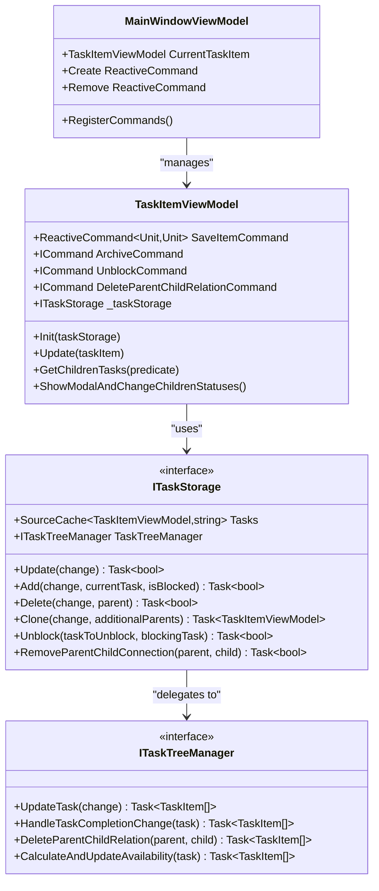
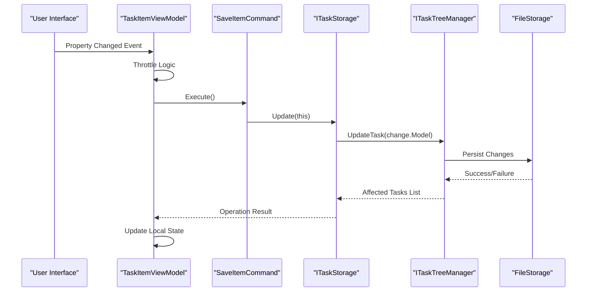
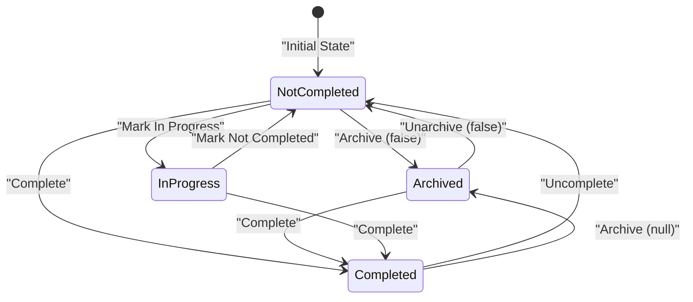
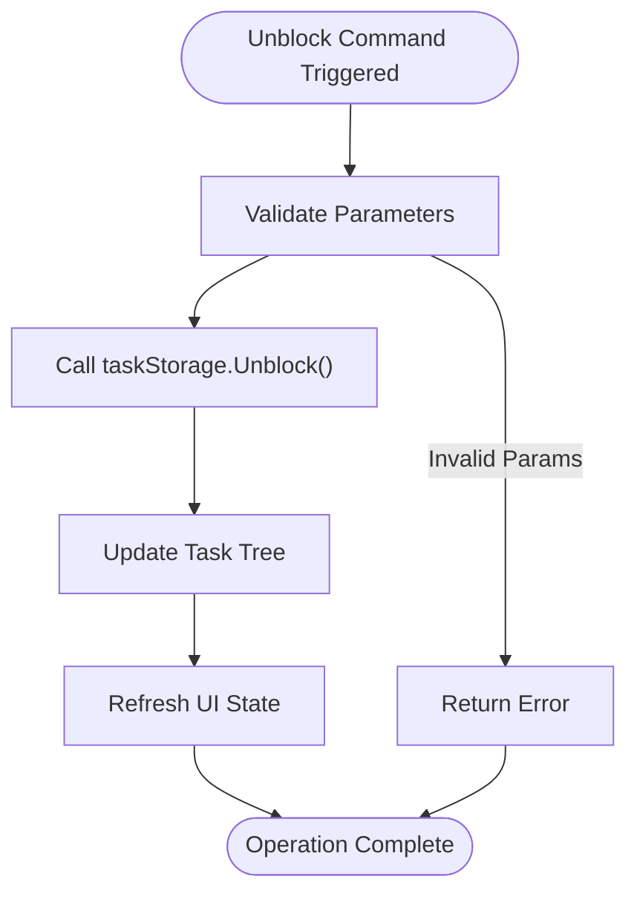
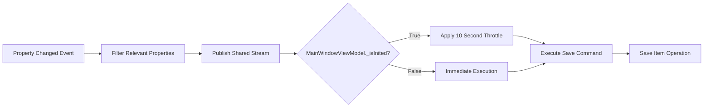
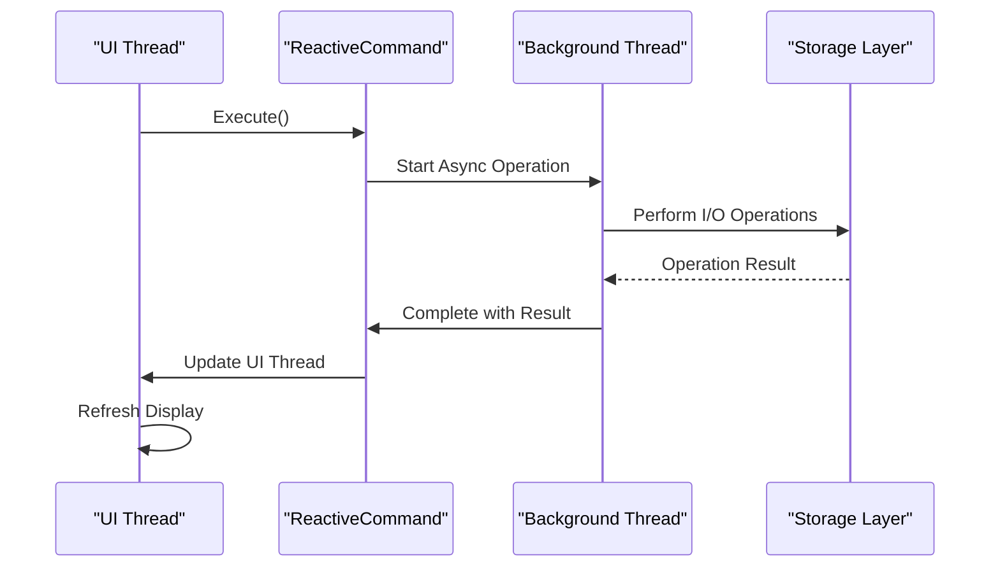
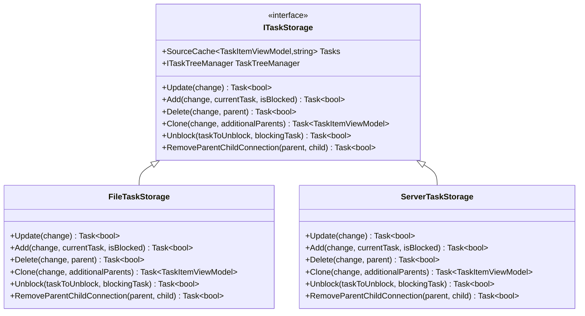
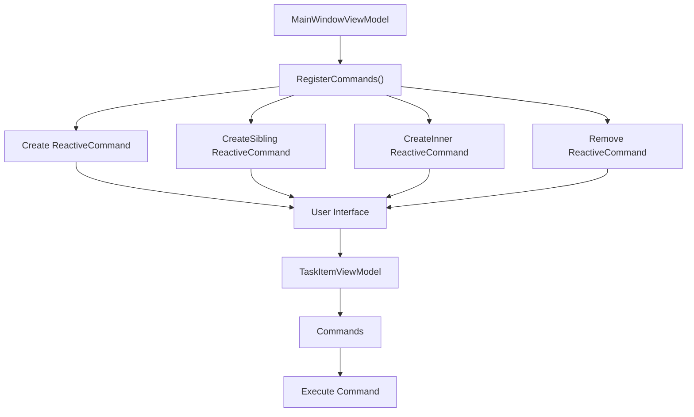
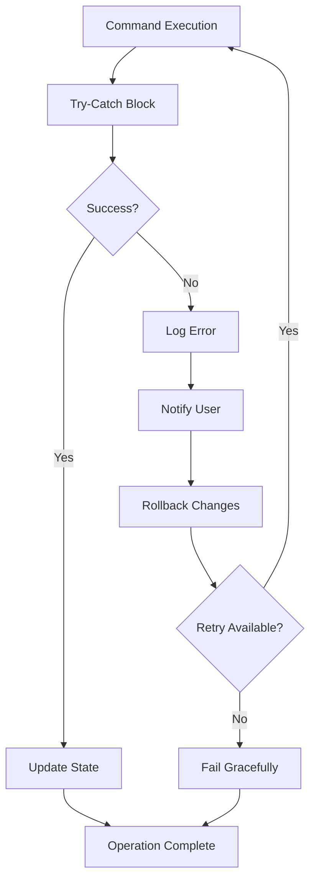

# Commands and User Actions

<cite>
**Referenced Files in This Document**
- [TaskItemViewModel.cs](file://src/Unlimotion.ViewModel/TaskItemViewModel.cs)
- [ITaskStorage.cs](file://src/Unlimotion.ViewModel/ITaskStorage.cs)
- [ITaskTreeManager.cs](file://src/Unlimotion.TaskTreeManager/ITaskTreeManager.cs)
- [FileTaskStorage.cs](file://src/Unlimotion/FileTaskStorage.cs)
- [TaskTreeManager.cs](file://src/Unlimotion.TaskTreeManager/TaskTreeManager.cs)
- [MainWindowViewModel.cs](file://src/Unlimotion.ViewModel/MainWindowViewModel.cs)
- [SetDurationCommands.cs](file://src/Unlimotion.ViewModel/SetDurationCommands.cs)
- [Action.cs](file://src/Unlimotion.ViewModel/Action.cs)
</cite>

## Table of Contents
1. [Introduction](#introduction)
2. [Command Architecture Overview](#command-architecture-overview)
3. [SaveItemCommand Implementation](#saveitemcommand-implementation)
4. [ArchiveCommand Implementation](#archivecommand-implementation)
5. [Parameterized Commands](#parameterized-commands)
6. [Throttling Mechanism](#throttling-mechanism)
7. [Thread Safety and Reactive Programming](#thread-safety-and-reactive-programming)
8. [Storage Layer Integration](#storage-layer-integration)
9. [UI Command Binding](#ui-command-binding)
10. [Error Handling and Validation](#error-handling-and-validation)
11. [Testing and Quality Assurance](#testing-and-quality-assurance)
12. [Performance Considerations](#performance-considerations)

## Introduction

The Unlimotion task management system employs a sophisticated command pattern implementation built on ReactiveUI's ReactiveCommand framework. This system encapsulates user actions through four primary commands: SaveItemCommand, ArchiveCommand, UnblockCommand, and DeleteParentChildRelationCommand. These commands provide thread-safe execution, automatic persistence, and intelligent state management for task operations.

The command system serves as the bridge between user interface interactions and the underlying data persistence layer, ensuring that all user actions are properly validated, logged, and persisted while maintaining application responsiveness through reactive programming patterns.

## Command Architecture Overview

The command system is structured around the TaskItemViewModel class, which acts as a ViewModel for individual task items in the application. Each command follows the MVVM pattern, separating concerns between user interface actions, business logic, and data persistence.

**Diagram sources**
- [TaskItemViewModel.cs](file://src/Unlimotion.ViewModel/TaskItemViewModel.cs#L17-L666)
- [ITaskStorage.cs](file://src/Unlimotion.ViewModel/ITaskStorage.cs#L9-L32)
- [ITaskTreeManager.cs](file://src/Unlimotion.TaskTreeManager/ITaskTreeManager.cs#L7-L42)

**Section sources**
- [TaskItemViewModel.cs](file://src/Unlimotion.ViewModel/TaskItemViewModel.cs#L17-L666)
- [ITaskStorage.cs](file://src/Unlimotion.ViewModel/ITaskStorage.cs#L9-L32)

## SaveItemCommand Implementation

The SaveItemCommand serves as the primary persistence mechanism for task modifications. Implemented as a ReactiveCommand that encapsulates asynchronous operations, it ensures thread-safe execution and proper error handling.

### Command Definition and Initialization

The SaveItemCommand is initialized during the TaskItemViewModel construction process and delegates to the ITaskStorage.Update method for persistence operations.

**Diagram sources**
- [TaskItemViewModel.cs](file://src/Unlimotion.ViewModel/TaskItemViewModel.cs#L45-L49)
- [FileTaskStorage.cs](file://src/Unlimotion/FileTaskStorage.cs#L346-L352)

### Persistence Workflow

The SaveItemCommand follows a multi-stage persistence workflow that ensures data consistency and proper state management:

1. **Command Execution**: The ReactiveCommand triggers the asynchronous update operation
2. **Storage Delegation**: The command delegates to ITaskStorage.Update, passing the current ViewModel
3. **Tree Management**: The storage layer forwards to ITaskTreeManager for business logic processing
4. **File Persistence**: The TaskTreeManager coordinates with the storage backend for actual file operations
5. **State Synchronization**: The system updates local state based on the operation results

### Thread Safety Mechanisms

The SaveItemCommand implements several thread safety mechanisms:

- **ReactiveCommand Pattern**: Built-in thread safety for command execution
- **Asynchronous Operations**: Non-blocking execution preventing UI thread starvation
- **Immutable State Transitions**: Ensures consistent state during concurrent operations
- **Event-Driven Updates**: Reactive patterns prevent race conditions

**Section sources**
- [TaskItemViewModel.cs](file://src/Unlimotion.ViewModel/TaskItemViewModel.cs#L45-L49)
- [FileTaskStorage.cs](file://src/Unlimotion/FileTaskStorage.cs#L346-L352)

## ArchiveCommand Implementation

The ArchiveCommand manages the state transitions between completed, archived, and uncompleted states, with sophisticated child task management capabilities. It operates on the IsCompleted property and handles complex hierarchical state changes.

### State Transition Logic

The ArchiveCommand implements a tri-state system for task completion:

**Diagram sources**
- [TaskItemViewModel.cs](file://src/Unlimotion.ViewModel/TaskItemViewModel.cs#L136-L171)

### Child Task Management

The ArchiveCommand includes intelligent child task management that maintains consistency across the task hierarchy:

1. **Recursive Discovery**: Uses GetChildrenTasks to identify all descendant tasks
2. **Conditional Filtering**: Applies predicates to find tasks matching specific criteria
3. **Batch Operations**: Processes multiple tasks efficiently
4. **User Confirmation**: Provides modal dialogs for bulk operations

### Implementation Details

The ArchiveCommand implementation demonstrates several advanced patterns:

- **Pattern Matching**: Uses switch expressions for clean state handling
- **Functional Composition**: Chains operations for complex state transformations
- **Error Recovery**: Handles edge cases gracefully
- **User Experience**: Provides feedback through notification systems

**Section sources**
- [TaskItemViewModel.cs](file://src/Unlimotion.ViewModel/TaskItemViewModel.cs#L136-L171)
- [TaskItemViewModel.cs](file://src/Unlimotion.ViewModel/TaskItemViewModel.cs#L534-L573)

## Parameterized Commands

The UnblockCommand and DeleteParentChildRelationCommand demonstrate the use of parameterized ReactiveCommands that accept typed parameters for specialized operations.

### UnblockCommand Implementation

The UnblockCommand enables task unlocking by removing blocking relationships:

**Diagram sources**
- [TaskItemViewModel.cs](file://src/Unlimotion.ViewModel/TaskItemViewModel.cs#L178-L182)

### DeleteParentChildRelationCommand Implementation

This command removes parent-child relationships between tasks, enabling flexible task restructuring:

The command accepts a TaskItemViewModel parameter representing the parent task to disconnect from the current task. The implementation delegates to ITaskStorage.RemoveParentChildConnection, which coordinates with the TaskTreeManager for proper state management.

### Parameter Validation

Both parameterized commands implement robust validation:

- **Null Checks**: Verify parameter existence before processing
- **Type Safety**: Ensure parameter types match expectations
- **Business Logic Validation**: Apply domain-specific rules
- **Error Handling**: Provide meaningful error messages

**Section sources**
- [TaskItemViewModel.cs](file://src/Unlimotion.ViewModel/TaskItemViewModel.cs#L178-L186)

## Throttling Mechanism

The throttling mechanism prevents excessive save operations during rapid property changes, optimizing performance and reducing unnecessary I/O operations.

### Throttling Configuration

The system implements configurable throttling through several mechanisms:

**Diagram sources**
- [TaskItemViewModel.cs](file://src/Unlimotion.ViewModel/TaskItemViewModel.cs#L203-L232)

### Property Filtering

The throttling system applies intelligent filtering to reduce unnecessary saves:

- **Relevant Properties**: Only monitors Title, Description, Planning dates, Duration, Repeater, Importance, and Wanted
- **Conditional Execution**: Different throttling behavior based on initialization state
- **Merge Strategy**: Combines immediate and throttled streams for optimal performance

### Performance Benefits

The throttling mechanism provides significant performance improvements:

- **Reduced I/O Operations**: Limits file system writes during rapid changes
- **Improved Responsiveness**: Prevents UI freezing during bulk operations
- **Resource Conservation**: Reduces CPU and memory usage during intensive editing
- **Intelligent Timing**: Balances responsiveness with performance

**Section sources**
- [TaskItemViewModel.cs](file://src/Unlimotion.ViewModel/TaskItemViewModel.cs#L39-L71)
- [TaskItemViewModel.cs](file://src/Unlimotion.ViewModel/TaskItemViewModel.cs#L203-L232)

## Thread Safety and Reactive Programming

The command system leverages ReactiveUI's ReactiveCommand extensively to ensure thread-safe execution and proper asynchronous operation patterns.

### ReactiveCommand Benefits

ReactiveCommand provides several threading advantages:

- **Thread-Safe Execution**: Built-in synchronization for command invocation
- **Cancellation Support**: Proper cleanup of ongoing operations
- **Error Propagation**: Structured exception handling
- **State Management**: Automatic enabled/disabled state management

### Asynchronous Patterns

The system implements several asynchronous patterns:

**Diagram sources**
- [TaskItemViewModel.cs](file://src/Unlimotion.ViewModel/TaskItemViewModel.cs#L45-L49)

### Memory Management

The system implements proper memory management through:

- **Disposable Pattern**: Automatic resource cleanup
- **Weak References**: Prevent memory leaks in event subscriptions
- **Automatic Disposal**: Integration with ReactiveUI's disposable lifecycle
- **Event Unsubscription**: Proper cleanup of event handlers

**Section sources**
- [TaskItemViewModel.cs](file://src/Unlimotion.ViewModel/TaskItemViewModel.cs#L45-L49)
- [TaskItemViewModel.cs](file://src/Unlimotion.ViewModel/TaskItemViewModel.cs#L203-L232)

## Storage Layer Integration

The command system integrates seamlessly with the storage layer through well-defined interfaces and delegation patterns.

### Storage Abstraction

The ITaskStorage interface provides a clean abstraction between commands and persistence:

**Diagram sources**
- [ITaskStorage.cs](file://src/Unlimotion.ViewModel/ITaskStorage.cs#L9-L32)
- [FileTaskStorage.cs](file://src/Unlimotion/FileTaskStorage.cs#L17-L458)

### Transaction Management

The storage layer implements transaction-like behavior:

- **Atomic Operations**: Either complete successfully or fail cleanly
- **Consistency Guarantees**: Maintains data integrity across operations
- **Rollback Capability**: Supports undo operations where applicable
- **Concurrency Control**: Manages simultaneous access to shared resources

**Section sources**
- [ITaskStorage.cs](file://src/Unlimotion.ViewModel/ITaskStorage.cs#L9-L32)
- [FileTaskStorage.cs](file://src/Unlimotion/FileTaskStorage.cs#L346-L352)

## UI Command Binding

The commands are exposed to the user interface through standard WPF/XAML binding patterns, with proper command parameter support and state management.

### Command Registration

Commands are registered in the MainWindowViewModel and made available to the UI:

**Diagram sources**
- [MainWindowViewModel.cs](file://src/Unlimotion.ViewModel/MainWindowViewModel.cs#L65-L120)

### Parameter Binding

The UI supports parameterized commands through various mechanisms:

- **Command Parameters**: Direct parameter passing from UI elements
- **DataContext Binding**: Automatic parameter resolution
- **Multi-Parameter Support**: Complex operations requiring multiple inputs
- **Validation Integration**: Parameter validation before command execution

### State Synchronization

The UI maintains proper state synchronization through:

- **Two-Way Binding**: Automatic updates between UI and ViewModel
- **Command Enabled State**: Dynamic enable/disable based on conditions
- **Visual Feedback**: Progress indicators and status messages
- **Error Display**: User-friendly error reporting

**Section sources**
- [MainWindowViewModel.cs](file://src/Unlimotion.ViewModel/MainWindowViewModel.cs#L65-L120)

## Error Handling and Validation

The command system implements comprehensive error handling and validation to ensure robust operation under various failure conditions.

### Validation Strategies

Multiple validation layers protect against invalid operations:

- **Pre-Execution Validation**: Parameter and state validation before command execution
- **Business Logic Validation**: Domain-specific rule enforcement
- **Storage Validation**: Persistence layer validation
- **Post-Execution Validation**: Result verification

### Error Recovery

The system implements graceful error recovery:

### User Feedback

Error handling provides meaningful user feedback:

- **Context-Aware Messages**: Error messages tailored to the specific operation
- **Recovery Suggestions**: Guidance on how to resolve issues
- **Logging Integration**: Comprehensive logging for debugging
- **Progress Indication**: Visual feedback during long-running operations

**Section sources**
- [TaskItemViewModel.cs](file://src/Unlimotion.ViewModel/TaskItemViewModel.cs#L136-L171)

## Testing and Quality Assurance

The command system includes comprehensive testing coverage to ensure reliability and maintainability.

### Test Coverage Areas

Testing focuses on several critical areas:

- **Command Execution**: Verification of proper command invocation
- **State Transitions**: Validation of state change logic
- **Error Conditions**: Testing of failure scenarios
- **Performance Metrics**: Throttling and concurrency testing
- **Integration Tests**: End-to-end command workflow validation

### Mock Infrastructure

The testing infrastructure includes specialized mocks:

- **Storage Mocks**: Simulated storage operations for isolated testing
- **Tree Manager Mocks**: Controlled tree management behavior
- **Notification Mocks**: User interaction simulation
- **Event Mocks**: Event-driven behavior testing

### Quality Metrics

The system maintains quality through:

- **Code Coverage**: Comprehensive test coverage metrics
- **Performance Benchmarks**: Throttling effectiveness measurement
- **Memory Usage**: Resource consumption monitoring
- **Concurrency Testing**: Multi-threaded operation validation

**Section sources**
- [TaskItemViewModel.cs](file://src/Unlimotion.ViewModel/TaskItemViewModel.cs#L136-L171)

## Performance Considerations

The command system is designed with performance optimization as a primary concern, implementing several strategies to ensure responsive operation under load.

### Optimization Strategies

Several optimization techniques are employed:

- **Lazy Loading**: Deferred initialization of expensive resources
- **Caching**: Intelligent caching of frequently accessed data
- **Batch Operations**: Grouping related operations for efficiency
- **Async Processing**: Non-blocking operation execution
- **Resource Pooling**: Efficient reuse of expensive objects

### Scalability Factors

The system scales effectively through:

- **Modular Design**: Independent component operation
- **Event-Driven Architecture**: Loose coupling between components
- **Configurable Throttling**: Adjustable performance characteristics
- **Memory Management**: Efficient resource utilization
- **I/O Optimization**: Minimized file system operations

### Monitoring and Profiling

Performance monitoring includes:

- **Execution Timing**: Command execution duration tracking
- **Resource Usage**: Memory and CPU consumption monitoring
- **Throughput Metrics**: Operations per second measurements
- **Bottleneck Identification**: Performance bottleneck detection
- **Trend Analysis**: Long-term performance trend monitoring

The command system represents a sophisticated implementation of modern MVVM patterns, combining reactive programming, asynchronous operations, and comprehensive error handling to provide a robust foundation for task management operations in the Unlimotion application.