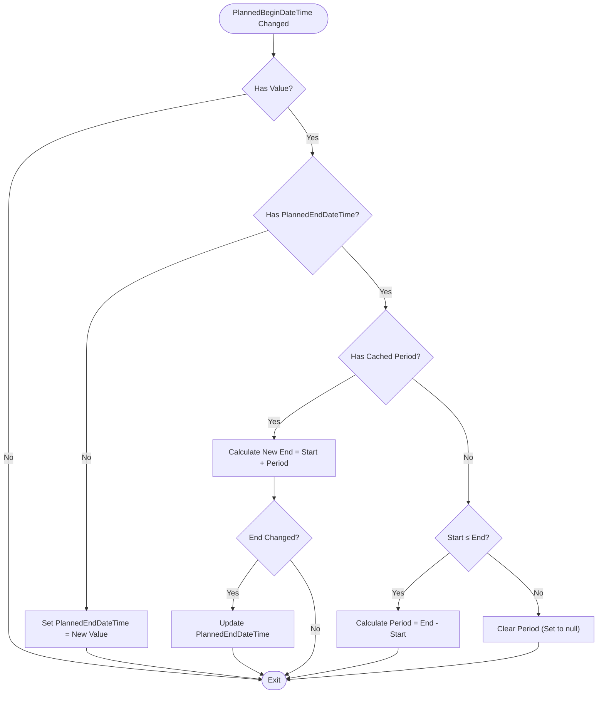
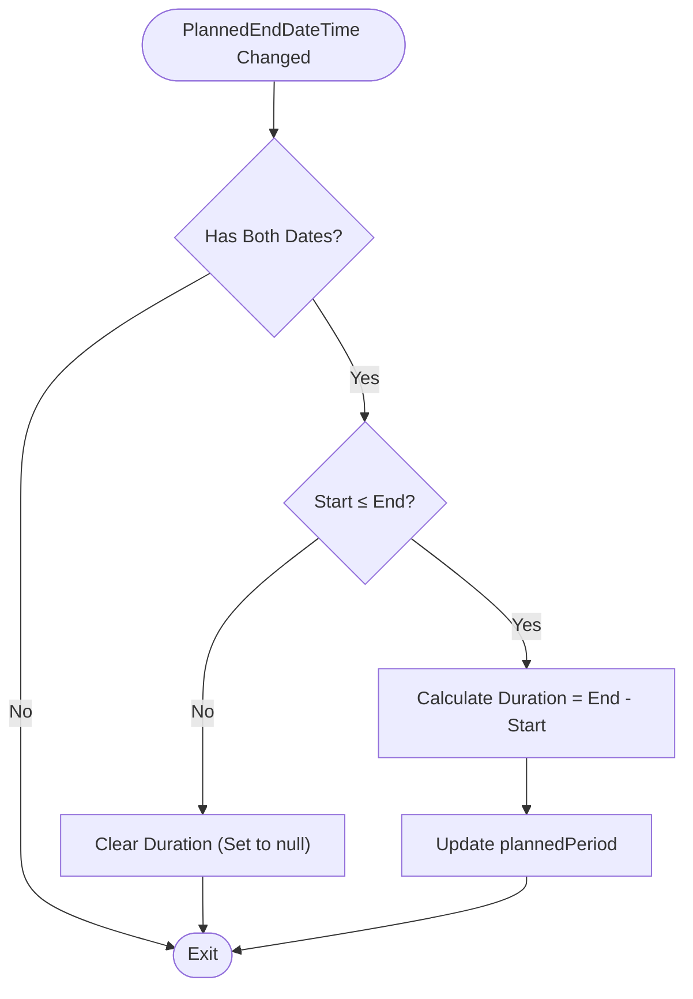
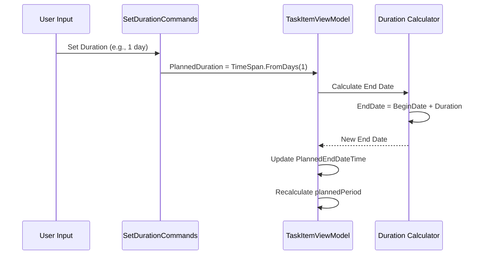
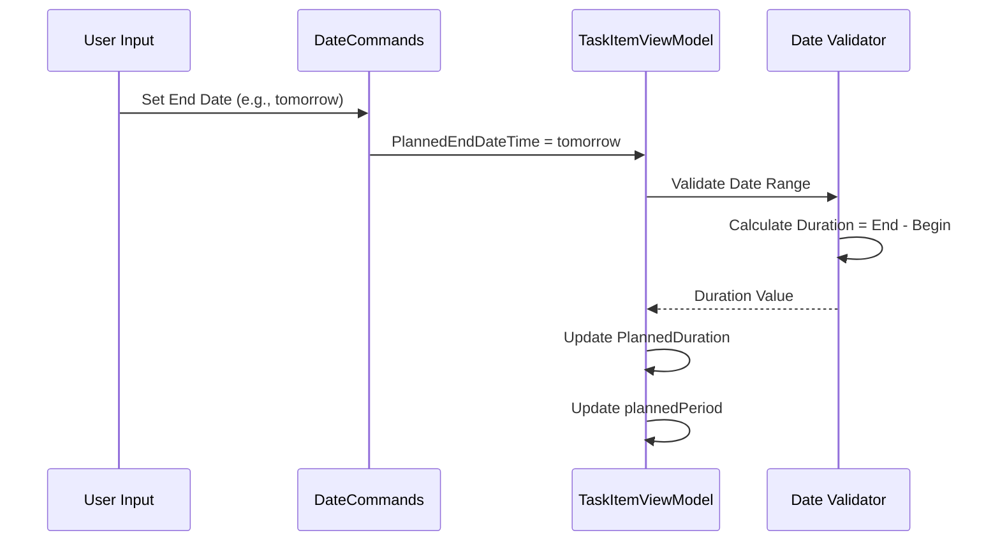
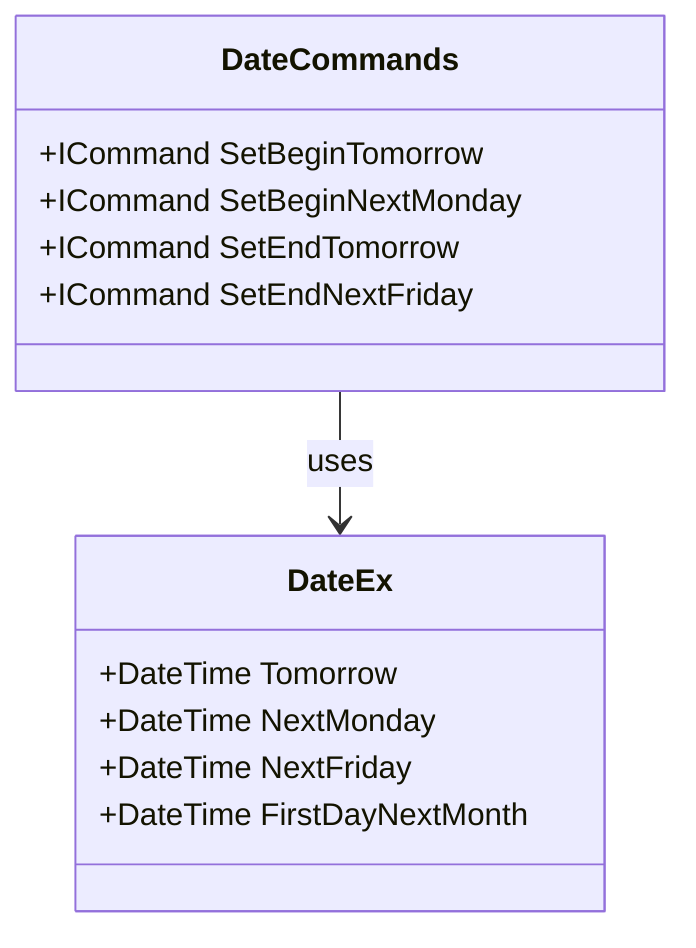
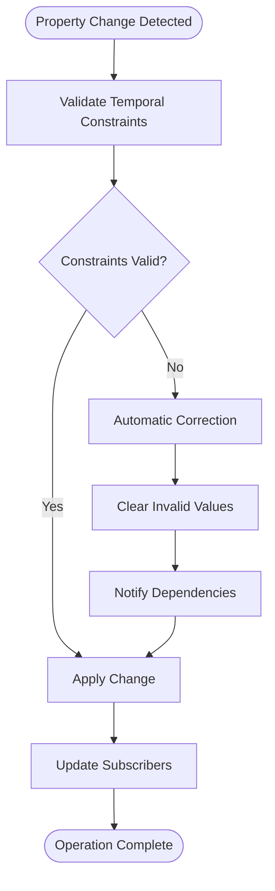

# Date and Duration Management

<cite>
**Referenced Files in This Document**
- [TaskItemViewModel.cs](file://src/Unlimotion.ViewModel/TaskItemViewModel.cs)
- [DateCommands.cs](file://src/Unlimotion.ViewModel/DateCommands.cs)
- [SetDurationCommands.cs](file://src/Unlimotion.ViewModel/SetDurationCommands.cs)
- [DateEx.cs](file://src/Unlimotion.ViewModel/DateEx.cs)
</cite>

## Table of Contents
1. [Introduction](#introduction)
2. [System Architecture](#system-architecture)
3. [Core Components](#core-components)
4. [Reactive Subscription System](#reactive-subscription-system)
5. [Bidirectional Relationship Management](#bidirectional-relationship-management)
6. [Edge Case Handling](#edge-case-handling)
7. [Command-Based Operations](#command-based-operations)
8. [Data Integrity Maintenance](#data-integrity-maintenance)
9. [Performance Considerations](#performance-considerations)
10. [Troubleshooting Guide](#troubleshooting-guide)

## Introduction

The date and duration management system in TaskItemViewModel implements a sophisticated reactive architecture that maintains consistency between planned start dates, end dates, and calculated durations. This system ensures data integrity through automatic recalculation when any temporal property changes, providing users with a seamless experience while preventing invalid date ranges and maintaining logical temporal relationships.

The system operates on three primary temporal properties: `PlannedBeginDateTime`, `PlannedEndDateTime`, and `PlannedDuration`. These properties form a bidirectional relationship where changes to one automatically trigger recalculations in the others, ensuring that all temporal constraints remain valid.

## System Architecture

The date and duration management system follows a reactive programming pattern built on the ReactiveUI framework. The architecture consists of several interconnected components that work together to maintain temporal consistency.

```mermaid
graph TB
subgraph "TaskItemViewModel"
PBDT[PlannedBeginDateTime]
PEDT[PlannedEndDateTime]
PDur[PlannedDuration]
PP[PlannedPeriod]
end
subgraph "Reactive Subscriptions"
S1[WhenAnyValue(PBDT)]
S2[WhenAnyValue(PEDT)]
S3[WhenAnyValue(Duration)]
end
subgraph "Command System"
DC[DateCommands]
SD[SetDurationCommands]
end
subgraph "Utility Classes"
DE[DateEx]
Helper[Helper Methods]
end
PBDT --> S1
PEDT --> S2
PDur --> S3
S1 --> PP
S2 --> PP
S3 --> PP
DC --> PBDT
DC --> PEDT
SD --> PDur
DE --> DC
Helper --> S1
Helper --> S2
```

**Diagram sources**
- [TaskItemViewModel.cs](file://src/Unlimotion.ViewModel/TaskItemViewModel.cs#L240-L300)
- [DateCommands.cs](file://src/Unlimotion.ViewModel/DateCommands.cs#L10-L54)
- [SetDurationCommands.cs](file://src/Unlimotion.ViewModel/SetDurationCommands.cs#L10-L46)

## Core Components

### Temporal Properties

The system manages three fundamental temporal properties:

| Property | Type | Purpose | Validation |
|----------|------|---------|------------|
| `PlannedBeginDateTime` | `DateTime?` | Task start date/time | Must be ≤ `PlannedEndDateTime` |
| `PlannedEndDateTime` | `DateTime?` | Task completion date/time | Must be ≥ `PlannedBeginDateTime` |
| `PlannedDuration` | `TimeSpan?` | Task duration | Calculated from date difference |

### Internal State Management

The system maintains internal state through the `plannedPeriod` field, which stores the calculated time difference between start and end dates. This cached value prevents redundant calculations and ensures consistency across property changes.

**Section sources**
- [TaskItemViewModel.cs](file://src/Unlimotion.ViewModel/TaskItemViewModel.cs#L40-L50)

## Reactive Subscription System

The reactive system forms the backbone of the temporal management, using `WhenAnyValue` subscriptions to monitor property changes and trigger automatic recalculations.

### PlannedBeginDateTime Subscription

The subscription for `PlannedBeginDateTime` handles two primary scenarios:

1. **Existing End Date Scenario**: When a new start date is set and an end date already exists, the system attempts to preserve the original duration by adding the cached `plannedPeriod` to the new start date.

2. **New Range Calculation**: When no cached period exists, the system calculates a new duration based on the relationship between the new start date and the existing end date.



**Diagram sources**
- [TaskItemViewModel.cs](file://src/Unlimotion.ViewModel/TaskItemViewModel.cs#L240-L285)

### PlannedEndDateTime Subscription

The end date subscription focuses on calculating and validating the duration between start and end dates:



**Diagram sources**
- [TaskItemViewModel.cs](file://src/Unlimotion.ViewModel/TaskItemViewModel.cs#L287-L300)

**Section sources**
- [TaskItemViewModel.cs](file://src/Unlimotion.ViewModel/TaskItemViewModel.cs#L240-L300)

## Bidirectional Relationship Management

The system implements a sophisticated bidirectional relationship where changes to either date property automatically update the other while maintaining logical temporal constraints.

### Duration-to-Date Propagation

When `PlannedDuration` is set, the system updates `PlannedEndDateTime` based on the current `PlannedBeginDateTime`:



**Diagram sources**
- [SetDurationCommands.cs](file://src/Unlimotion.ViewModel/SetDurationCommands.cs#L18-L30)

### Date-to-Duration Propagation

The reverse relationship works similarly, where changes to date boundaries trigger duration recalculation:



**Diagram sources**
- [DateCommands.cs](file://src/Unlimotion.ViewModel/DateCommands.cs#L20-L30)

**Section sources**
- [TaskItemViewModel.cs](file://src/Unlimotion.ViewModel/TaskItemViewModel.cs#L240-L300)
- [SetDurationCommands.cs](file://src/Unlimotion.ViewModel/SetDurationCommands.cs#L10-L46)

## Edge Case Handling

The system implements comprehensive edge case handling to maintain data integrity under various user interaction scenarios.

### Start Date Exceeds End Date

When a user sets a start date that exceeds the current end date, the system gracefully handles this scenario:

1. **Immediate Detection**: The system detects when `PlannedBeginDateTime > PlannedEndDateTime`
2. **Period Reset**: The cached `plannedPeriod` is cleared to prevent invalid calculations
3. **Constraint Enforcement**: Future calculations recognize the invalid state and prevent propagation of incorrect values

### Null Value Management

The system handles null values consistently across all temporal properties:

| Scenario | Behavior |
|----------|----------|
| Setting `PlannedBeginDateTime` to null | Clears `PlannedEndDateTime` and `PlannedDuration` |
| Setting `PlannedEndDateTime` to null | Preserves `PlannedBeginDateTime` but clears `PlannedDuration` |
| Setting `PlannedDuration` to null | Preserves both date properties but clears the duration |

### Circular Reference Prevention

The reactive system includes safeguards against infinite loops:

1. **Change Detection**: Before updating a property, the system checks if the new value differs from the current value
2. **Conditional Updates**: Only applies updates when necessary to prevent unnecessary recalculations
3. **Subscription Management**: Proper cleanup of subscriptions to prevent memory leaks

**Section sources**
- [TaskItemViewModel.cs](file://src/Unlimotion.ViewModel/TaskItemViewModel.cs#L269-L291)

## Command-Based Operations

The system provides specialized command classes that offer convenient date and duration manipulation capabilities.

### DateCommands Implementation

The `DateCommands` class provides pre-defined date setting operations with appropriate constraints:

| Command | Purpose | Constraints |
|---------|---------|-------------|
| `SetBeginToday` | Sets start to current date | No constraints |
| `SetBeginTomorrow` | Sets start to next day | Requires future date |
| `SetBeginNextMonday` | Sets start to next Monday | Calculates future Monday |
| `SetEndToday` | Sets end to current date | Must be ≥ start date |
| `SetEnd1Month` | Sets end to one month later | Adds months to start date |

### DateEx Utility Functions

The `DateEx` utility class provides intelligent date calculation methods:



**Diagram sources**
- [DateEx.cs](file://src/Unlimotion.ViewModel/DateEx.cs#L8-L58)
- [DateCommands.cs](file://src/Unlimotion.ViewModel/DateCommands.cs#L10-L54)

### SetDurationCommands Implementation

The `SetDurationCommands` class offers predefined duration values:

| Command | Duration | Use Case |
|---------|----------|----------|
| `OneMinCommand` | 1 minute | Very short tasks |
| `OneHourCommand` | 1 hour | Standard meetings |
| `OneDayCommand` | 1 day | Full-day tasks |
| `FourDaysCommand` | 4 days | Extended projects |
| `EightDaysCommand` | 8 days | Long-term tasks |

**Section sources**
- [DateCommands.cs](file://src/Unlimotion.ViewModel/DateCommands.cs#L10-L54)
- [SetDurationCommands.cs](file://src/Unlimotion.ViewModel/SetDurationCommands.cs#L10-L46)
- [DateEx.cs](file://src/Unlimotion.ViewModel/DateEx.cs#L8-L58)

## Data Integrity Maintenance

The system implements multiple layers of data integrity checks to ensure temporal consistency.

### Constraint Validation

Each property change triggers validation of temporal constraints:

1. **Start-End Relationship**: Ensures `PlannedBeginDateTime ≤ PlannedEndDateTime`
2. **Duration Consistency**: Validates that calculated duration matches date difference
3. **Null Handling**: Maintains consistency when properties are set to null

### Automatic Correction

When inconsistencies are detected, the system automatically corrects them:



### Transaction Safety

The system ensures atomic updates to prevent partial state changes:

1. **Batch Updates**: Related property changes are processed together
2. **Rollback Capability**: Invalid states trigger immediate rollback
3. **Consistency Checks**: Final validation occurs before applying changes

**Section sources**
- [TaskItemViewModel.cs](file://src/Unlimotion.ViewModel/TaskItemViewModel.cs#L240-L300)

## Performance Considerations

The reactive system is optimized for performance while maintaining responsiveness.

### Throttling Mechanisms

The system implements throttling to prevent excessive recalculations:

1. **Property Change Throttling**: Changes are throttled to reduce CPU usage
2. **Save Operation Throttling**: Automatic saves are delayed to batch multiple changes
3. **Subscription Optimization**: Efficient subscription management prevents memory leaks

### Lazy Evaluation

Certain calculations are performed lazily to improve startup performance:

1. **Computed Properties**: Derived values are calculated only when accessed
2. **Conditional Subscriptions**: Some subscriptions activate only when needed
3. **Cached Results**: Frequently used calculations are cached

### Memory Management

The system includes comprehensive memory management:

1. **Disposable Pattern**: Proper cleanup of subscriptions and resources
2. **Weak References**: Prevents memory leaks in long-running applications
3. **Resource Pooling**: Efficient reuse of temporary objects

**Section sources**
- [TaskItemViewModel.cs](file://src/Unlimotion.ViewModel/TaskItemViewModel.cs#L220-L240)

## Troubleshooting Guide

Common issues and their solutions when working with the date and duration management system.

### Issue: End Date Not Updating When Start Date Changes

**Symptoms**: Changing `PlannedBeginDateTime` doesn't update `PlannedEndDateTime`

**Causes**:
- Cached `plannedPeriod` is null
- Subscription not properly initialized
- Property change notifications not firing

**Solutions**:
1. Verify that both dates are set before changing start date
2. Check subscription initialization in `Init()` method
3. Ensure property change notifications are properly implemented

### Issue: Duration Showing Incorrect Values

**Symptoms**: `PlannedDuration` displays unexpected values

**Causes**:
- Inconsistent date calculations
- Cached period corruption
- Subscription timing issues

**Solutions**:
1. Recalculate duration by temporarily setting end date
2. Clear cached period and recalculate
3. Verify subscription order and dependencies

### Issue: Infinite Recalculation Loops

**Symptoms**: Application becomes unresponsive during date changes

**Causes**:
- Circular property dependencies
- Missing change detection
- Improper subscription management

**Solutions**:
1. Add change detection before property updates
2. Review subscription dependencies
3. Implement proper disposal patterns

### Debugging Tips

1. **Enable Logging**: Add logging to subscription callbacks
2. **Monitor Property Changes**: Track when properties are updated
3. **Validate State**: Check invariants after each change
4. **Test Edge Cases**: Verify behavior with null values and extreme dates

**Section sources**
- [TaskItemViewModel.cs](file://src/Unlimotion.ViewModel/TaskItemViewModel.cs#L240-L300)