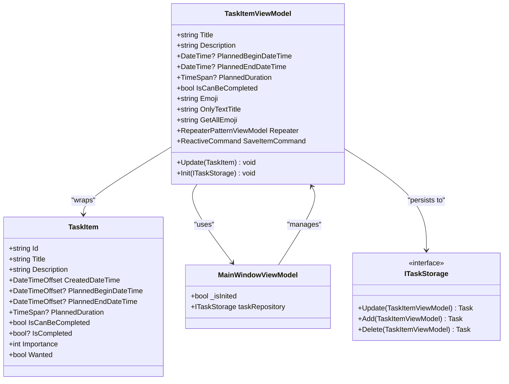
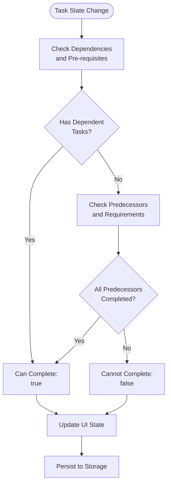
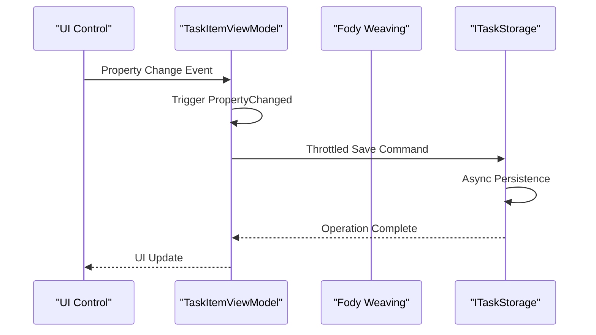
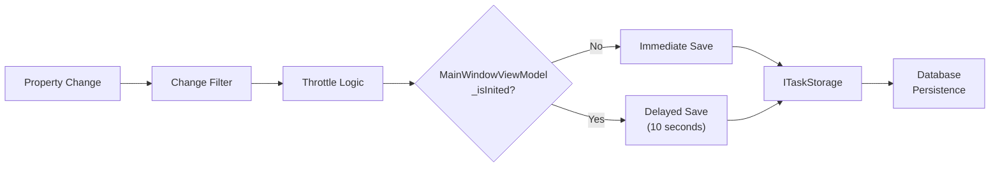
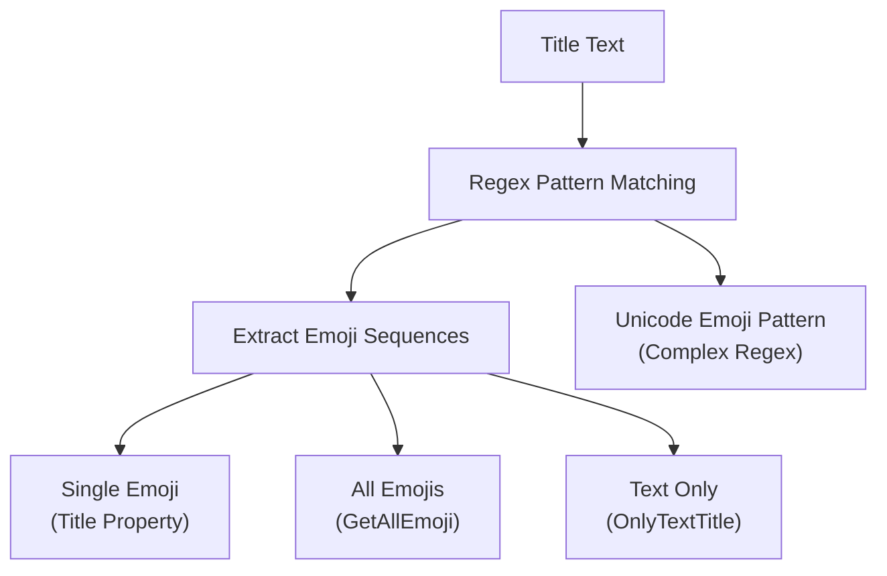
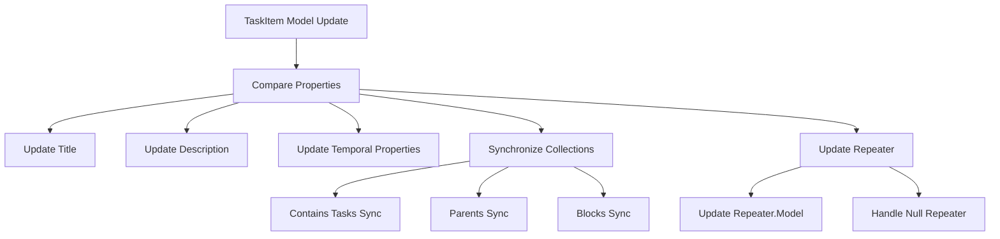
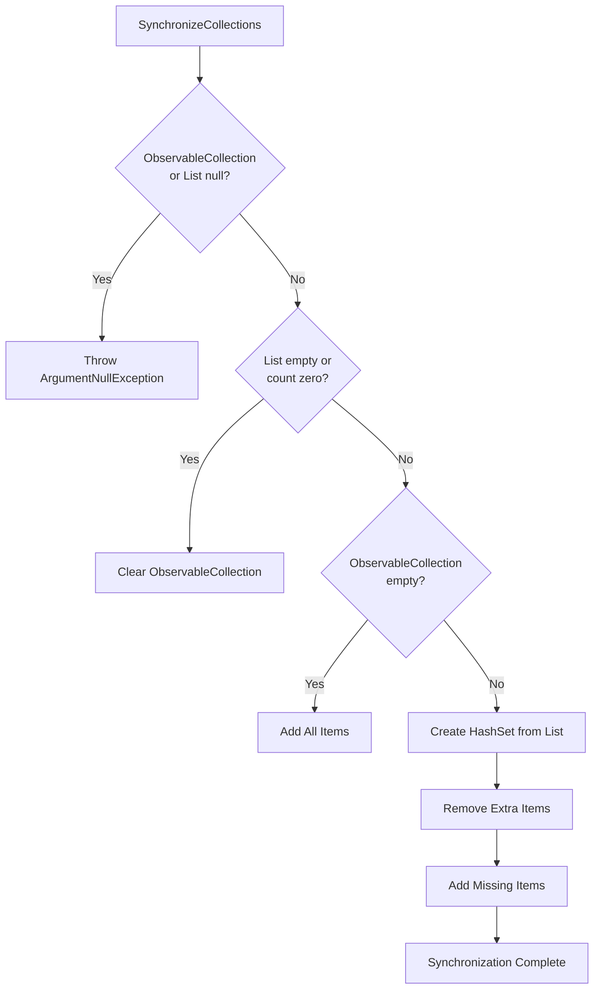
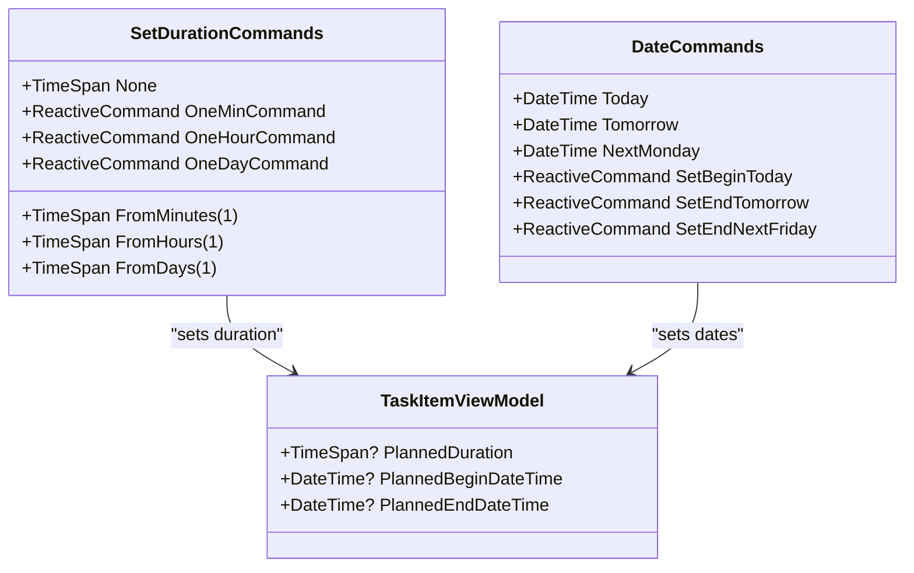
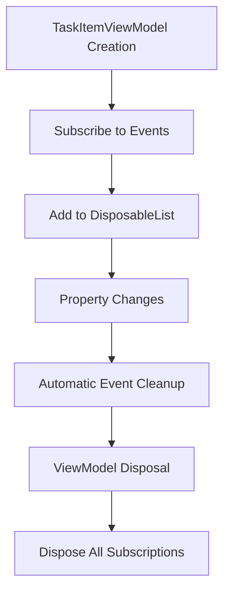

# Properties and Data Binding

<cite>
**Referenced Files in This Document**
- [TaskItemViewModel.cs](file://src/Unlimotion.ViewModel/TaskItemViewModel.cs)
- [TaskItem.cs](file://src/Unlimotion.Domain/TaskItem.cs)
- [FodyWeavers.xml](file://src/Unlimotion.ViewModel/FodyWeavers.xml)
- [MainWindowViewModel.cs](file://src/Unlimotion.ViewModel/MainWindowViewModel.cs)
- [SetDurationCommands.cs](file://src/Unlimotion.ViewModel/SetDurationCommands.cs)
- [DateCommands.cs](file://src/Unlimotion.ViewModel/DateCommands.cs)
- [RepeaterPatternViewModel.cs](file://src/Unlimotion.ViewModel/RepeaterPatternViewModel.cs)
</cite>

## Table of Contents
1. [Introduction](#introduction)
2. [Architecture Overview](#architecture-overview)
3. [Core Properties Analysis](#core-properties-analysis)
4. [Data Binding Implementation](#data-binding-implementation)
5. [Reactive Property System](#reactive-property-system)
6. [Computed Properties](#computed-properties)
7. [Property Synchronization](#property-synchronization)
8. [UI Integration Patterns](#ui-integration-patterns)
9. [Performance Considerations](#performance-considerations)
10. [Best Practices](#best-practices)

## Introduction

The TaskItemViewModel class serves as the primary data binding layer between the domain TaskItem model and the user interface in the Unlimotion application. Built on the MVVM (Model-View-ViewModel) pattern, it provides a reactive, declarative approach to property management with automatic UI synchronization through Fody's INotifyPropertyChanged implementation.

This documentation explores how properties like Title, Description, PlannedBeginDateTime, PlannedEndDateTime, and PlannedDuration are exposed to the UI while maintaining bidirectional data flow and automatic persistence through the reactive command system.

## Architecture Overview

The TaskItemViewModel follows a layered architecture that separates concerns between data modeling, business logic, and presentation:



**Diagram sources**
- [TaskItemViewModel.cs](file://src/Unlimotion.ViewModel/TaskItemViewModel.cs#L20-L664)
- [TaskItem.cs](file://src/Unlimotion.Domain/TaskItem.cs#L5-L32)

**Section sources**
- [TaskItemViewModel.cs](file://src/Unlimotion.ViewModel/TaskItemViewModel.cs#L20-L473)
- [TaskItem.cs](file://src/Unlimotion.Domain/TaskItem.cs#L5-L32)

## Core Properties Analysis

### Basic Information Properties

The fundamental properties provide essential task metadata and are directly bound to UI controls:

| Property | Type | Purpose | Data Binding |
|----------|------|---------|--------------|
| Title | string | Task display name | Two-way binding with validation |
| Description | string | Detailed task description | Rich text editor binding |
| Id | string | Unique identifier | Read-only, auto-generated |
| Version | int | Concurrency control | Optimistic locking mechanism |

### Temporal Properties

Time-related properties demonstrate sophisticated data binding with automatic synchronization:

| Property | Type | Purpose | Synchronization Logic |
|----------|------|---------|----------------------|
| PlannedBeginDateTime | DateTime? | Task start date/time | Automatic end date adjustment |
| PlannedEndDateTime | DateTime? | Task completion target | Depends on duration or begin date |
| PlannedDuration | TimeSpan? | Task duration estimate | Bidirectional calculation with dates |
| CreatedDateTime | DateTimeOffset | Task creation timestamp | Immutable, system-generated |
| CompletedDateTime | DateTimeOffset? | Completion timestamp | Nullable, user-set |
| ArchiveDateTime | DateTimeOffset? | Archival timestamp | Manual or automated |

### Business Logic Properties

The IsCanBeCompleted property reflects domain logic computed from task state:



**Diagram sources**
- [TaskItemViewModel.cs](file://src/Unlimotion.ViewModel/TaskItemViewModel.cs#L588-L625)

**Section sources**
- [TaskItemViewModel.cs](file://src/Unlimotion.ViewModel/TaskItemViewModel.cs#L475-L520)
- [TaskItem.cs](file://src/Unlimotion.Domain/TaskItem.cs#L10-L25)

## Data Binding Implementation

### Fody INotifyPropertyChanged Integration

The `[AddINotifyPropertyChangedInterface]` attribute automatically generates property change notifications, eliminating boilerplate code:



**Diagram sources**
- [TaskItemViewModel.cs](file://src/Unlimotion.ViewModel/TaskItemViewModel.cs#L185-L203)
- [FodyWeavers.xml](file://src/Unlimotion.ViewModel/FodyWeavers.xml#L3-L3)

### Reactive Command System

The SaveItemCommand demonstrates reactive data persistence:



**Diagram sources**
- [TaskItemViewModel.cs](file://src/Unlimotion.ViewModel/TaskItemViewModel.cs#L185-L203)

**Section sources**
- [TaskItemViewModel.cs](file://src/Unlimotion.ViewModel/TaskItemViewModel.cs#L185-L203)
- [FodyWeavers.xml](file://src/Unlimotion.ViewModel/FodyWeavers.xml#L1-L4)

## Reactive Property System

### Automatic Property Synchronization

The system automatically synchronizes related properties through reactive subscriptions:

```mermaid
sequenceDiagram
participant Begin as "PlannedBeginDateTime"
participant Period as "plannedPeriod"
participant End as "PlannedEndDateTime"
participant Duration as "PlannedDuration"
Begin->>Begin : Value Changed
Begin->>Period : Calculate Duration
Period->>End : Update End Date
End->>Period : Recalculate Period
Duration->>Period : Direct Assignment
Note over Begin,Duration : Circular dependency resolution
```

**Diagram sources**
- [TaskItemViewModel.cs](file://src/Unlimotion.ViewModel/TaskItemViewModel.cs#L205-L250)

### Collection Synchronization

Observable collections maintain UI consistency through specialized synchronization logic:

| Collection | Purpose | Synchronization Method |
|------------|---------|----------------------|
| Contains | Child tasks | Dynamic filtering and binding |
| Parents | Parent tasks | Hierarchical navigation |
| Blocks | Blocking tasks | Dependency resolution |
| BlockedBy | Blocked by tasks | Reverse dependency tracking |

**Section sources**
- [TaskItemViewModel.cs](file://src/Unlimotion.ViewModel/TaskItemViewModel.cs#L45-L71)
- [TaskItemViewModel.cs](file://src/Unlimotion.ViewModel/TaskItemViewModel.cs#L588-L625)

## Computed Properties

### Emoji Extraction System

The Emoji property provides parsed title information for visual representation:



**Diagram sources**
- [TaskItemViewModel.cs](file://src/Unlimotion.ViewModel/TaskItemViewModel.cs#L431-L440)

### Repeater Pattern Integration

The Repeater property manages recurring task patterns with complex validation:

| Property | Type | Validation | UI Impact |
|----------|------|------------|-----------|
| Type | RepeaterType | Enum constraint | Dropdown selection |
| AfterComplete | bool | Boolean toggle | Checkbox state |
| Period | TimeSpan | Positive duration | Duration picker |
| Pattern | List<int> | Weekday selection | Multi-select grid |

**Section sources**
- [TaskItemViewModel.cs](file://src/Unlimotion.ViewModel/TaskItemViewModel.cs#L431-L440)
- [RepeaterPatternViewModel.cs](file://src/Unlimotion.ViewModel/RepeaterPatternViewModel.cs#L10-L50)

## Property Synchronization

### Model-to-ViewModel Updates

The Update method handles bidirectional synchronization between the domain model and ViewModel:



**Diagram sources**
- [TaskItemViewModel.cs](file://src/Unlimotion.ViewModel/TaskItemViewModel.cs#L588-L625)

### Collection Synchronization Algorithm

The SynchronizeCollections method ensures UI collection consistency:



**Diagram sources**
- [TaskItemViewModel.cs](file://src/Unlimotion.ViewModel/TaskItemViewModel.cs#L627-L664)

**Section sources**
- [TaskItemViewModel.cs](file://src/Unlimotion.ViewModel/TaskItemViewModel.cs#L588-L625)
- [TaskItemViewModel.cs](file://src/Unlimotion.ViewModel/TaskItemViewModel.cs#L627-L664)

## UI Integration Patterns

### Command-Based Property Setting

The SetDurationCommands and DateCommands provide structured property modification:



**Diagram sources**
- [SetDurationCommands.cs](file://src/Unlimotion.ViewModel/SetDurationCommands.cs#L8-L46)
- [DateCommands.cs](file://src/Unlimotion.ViewModel/DateCommands.cs#L8-L54)

### Reactive Property Dependencies

The system establishes reactive relationships between properties:

| Source Property | Target Property | Reaction Type | Throttle |
|-----------------|-----------------|---------------|----------|
| PlannedBeginDateTime | PlannedEndDateTime | Automatic | No |
| PlannedEndDateTime | PlannedBeginDateTime | Automatic | No |
| PlannedDuration | PlannedEndDateTime | Calculation | No |
| Repeater | All Repeater Properties | Validation | 2 seconds |
| Any Editable Property | SaveItemCommand | Persistence | 10 seconds |

**Section sources**
- [SetDurationCommands.cs](file://src/Unlimotion.ViewModel/SetDurationCommands.cs#L8-L46)
- [DateCommands.cs](file://src/Unlimotion.ViewModel/DateCommands.cs#L8-L54)
- [TaskItemViewModel.cs](file://src/Unlimotion.ViewModel/TaskItemViewModel.cs#L205-L250)

## Performance Considerations

### Throttling and Debouncing

The system implements intelligent throttling to prevent excessive saves:

- **Property Change Throttling**: 10-second delay during active editing
- **Repeater Property Throttling**: 2-second delay for pattern changes
- **Immediate Saves**: During initialization phase for better UX

### Memory Management

DisposableList base class ensures proper resource cleanup:



**Diagram sources**
- [TaskItemViewModel.cs](file://src/Unlimotion.ViewModel/TaskItemViewModel.cs#L20-L473)

**Section sources**
- [TaskItemViewModel.cs](file://src/Unlimotion.ViewModel/TaskItemViewModel.cs#L39-L473)

## Best Practices

### Property Design Guidelines

1. **Immutable Domain Models**: TaskItem remains immutable while TaskItemViewModel handles mutable presentation logic
2. **Reactive Dependencies**: Related properties automatically update through reactive subscriptions
3. **Validation Integration**: Property changes trigger validation and UI state updates
4. **Resource Management**: Proper disposal of event subscriptions prevents memory leaks

### Data Binding Patterns

1. **Two-Way Binding**: For editable properties like Title and Description
2. **One-Way Binding**: For computed properties like Emoji and GetAllEmoji
3. **Command Binding**: For complex operations requiring validation and feedback
4. **Conditional Binding**: Based on task state and user permissions

### Error Handling

The system implements graceful error handling through:

- **Null Safety**: Comprehensive null checks in property setters
- **Validation**: Real-time validation with immediate UI feedback
- **Recovery**: Automatic recovery from inconsistent states
- **Logging**: Structured logging for debugging and monitoring

**Section sources**
- [TaskItemViewModel.cs](file://src/Unlimotion.ViewModel/TaskItemViewModel.cs#L588-L625)
- [TaskItemViewModel.cs](file://src/Unlimotion.ViewModel/TaskItemViewModel.cs#L627-L664)