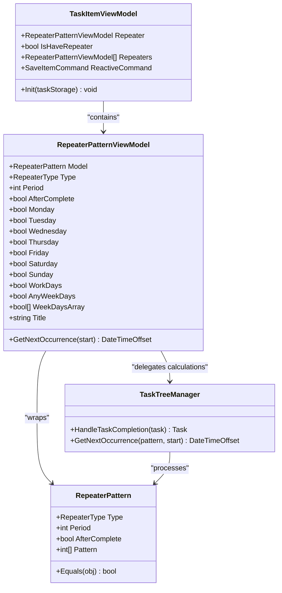
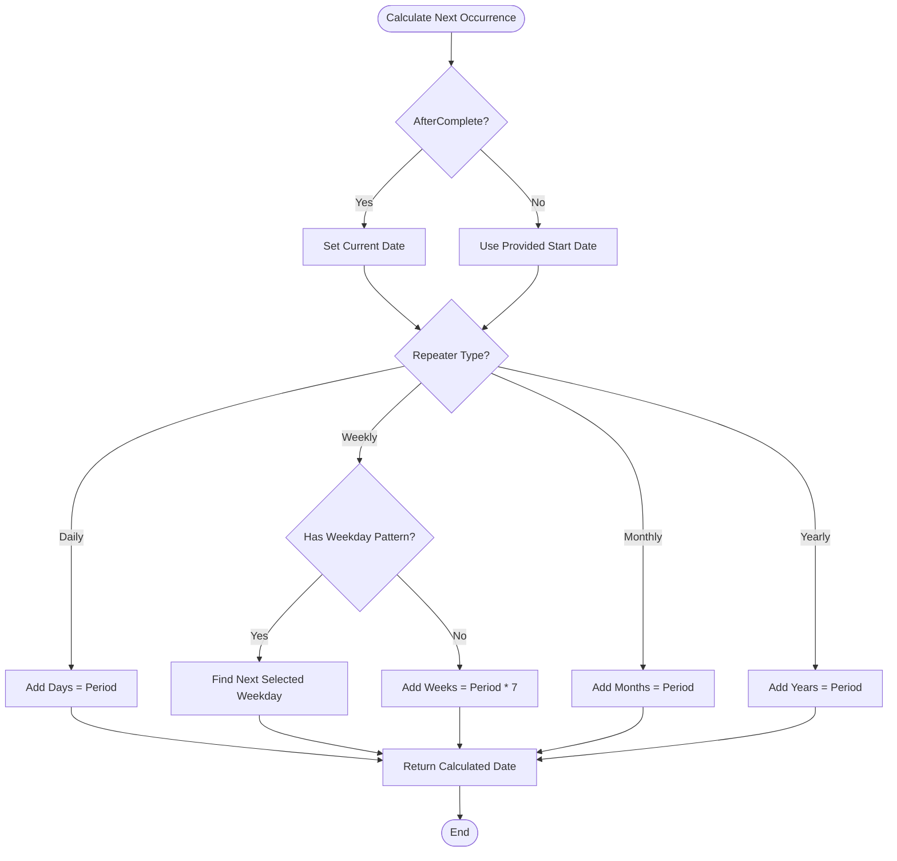
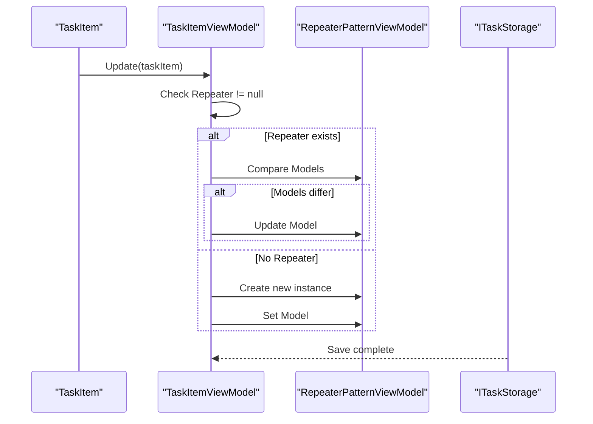
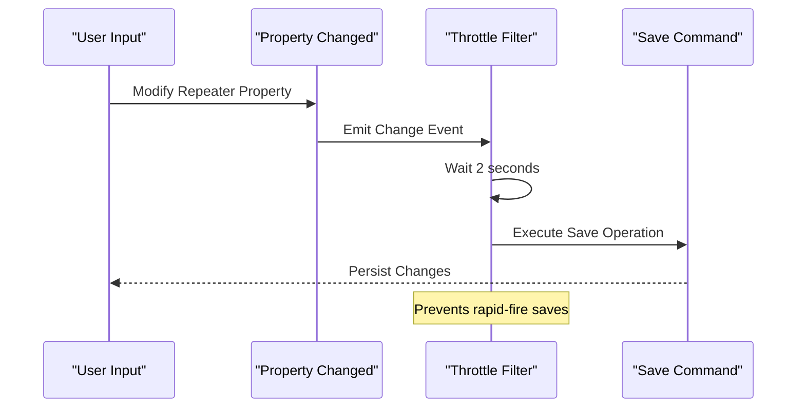
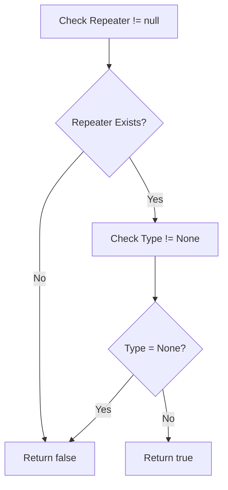

# Repeater Pattern Integration

<cite>
**Referenced Files in This Document**
- [RepeaterPatternViewModel.cs](file://src/Unlimotion.ViewModel/RepeaterPatternViewModel.cs)
- [TaskItemViewModel.cs](file://src/Unlimotion.ViewModel/TaskItemViewModel.cs)
- [RepeaterPattern.cs](file://src/Unlimotion.Domain/RepeaterPattern.cs)
- [RepeaterType.cs](file://src/Unlimotion.Domain/RepeaterType.cs)
- [RepeaterPatternExtensions.cs](file://src/Unlimotion.Domain/RepeaterPatternExtensions.cs)
- [TaskTreeManager.cs](file://src/Unlimotion.TaskTreeManager/TaskTreeManager.cs)
</cite>

## Table of Contents
1. [Introduction](#introduction)
2. [Core Architecture](#core-architecture)
3. [RepeaterPatternViewModel Implementation](#repeaternatternviewmodel-implementation)
4. [TaskItemViewModel Integration](#taskitemviewmodel-integration)
5. [Reactive Property Monitoring](#reactive-property-monitoring)
6. [Automatic Persistence](#automatic-persistence)
7. [Predefined Repeater Templates](#predefined-repeater-templates)
8. [Null Checking Simplification](#null-checking-simplification)
9. [Usage Patterns](#usage-patterns)
10. [Performance Considerations](#performance-considerations)
11. [Troubleshooting Guide](#troubleshooting-guide)
12. [Conclusion](#conclusion)

## Introduction

The repeater pattern functionality in Unlimotion provides sophisticated recurring task behavior through a comprehensive system built around the `RepeaterPatternViewModel` class. This system enables users to define recurring schedules for tasks with various frequencies (daily, weekly, monthly, yearly) and customizable patterns. The implementation leverages reactive programming principles to monitor property changes and automatically persist updates with intelligent throttling mechanisms.

The repeater system consists of several interconnected components that work together to provide seamless recurring task management. At its core, the system transforms user-defined repetition patterns into actionable scheduling logic that integrates with the broader task management infrastructure.

## Core Architecture

The repeater pattern system follows a layered architecture that separates concerns between data representation, business logic, and presentation:

**Diagram sources**
- [RepeaterPatternViewModel.cs](file://src/Unlimotion.ViewModel/RepeaterPatternViewModel.cs#L8-L173)
- [RepeaterPattern.cs](file://src/Unlimotion.Domain/RepeaterPattern.cs#L6-L24)
- [TaskItemViewModel.cs](file://src/Unlimotion.ViewModel/TaskItemViewModel.cs#L511-L523)

**Section sources**
- [RepeaterPatternViewModel.cs](file://src/Unlimotion.ViewModel/RepeaterPatternViewModel.cs#L1-L173)
- [TaskItemViewModel.cs](file://src/Unlimotion.ViewModel/TaskItemViewModel.cs#L1-L666)

## RepeaterPatternViewModel Implementation

The `RepeaterPatternViewModel` serves as the primary interface for managing repeating task patterns. It encapsulates the business logic for calculating next occurrence dates and provides a user-friendly abstraction over the underlying `RepeaterPattern` model.

### Core Properties and Configuration

The ViewModel exposes comprehensive properties for configuring repetition patterns:

| Property | Type | Purpose | Default Value |
|----------|------|---------|---------------|
| `Type` | `RepeaterType` | Defines the base repetition frequency | `None` |
| `Period` | `int` | Specifies the interval multiplier | `1` |
| `AfterComplete` | `bool` | Determines if recurrence starts after completion | `false` |
| `Monday-Friday` | `bool` | Individual weekday flags for weekly patterns | `false` |
| `WorkDays` | `bool` | Bulk setter for Monday-Friday weekdays | `false` |
| `AnyWeekDays` | `bool` | Indicates if any weekdays are selected | Calculated |

### Pattern Calculation Logic

The repeater implements sophisticated date calculation algorithms for determining next occurrence dates:

**Diagram sources**
- [RepeaterPatternViewModel.cs](file://src/Unlimotion.ViewModel/RepeaterPatternViewModel.cs#L75-L120)
- [RepeaterPatternExtensions.cs](file://src/Unlimotion.Domain/RepeaterPatternExtensions.cs#L8-L83)

### Template Generation

The ViewModel provides template functionality for common repetition patterns:

**Section sources**
- [RepeaterPatternViewModel.cs](file://src/Unlimotion.ViewModel/RepeaterPatternViewModel.cs#L8-L173)

## TaskItemViewModel Integration

The `TaskItemViewModel` integrates the repeater functionality as a first-class property, enabling seamless management of recurring tasks within the task lifecycle.

### Property Declaration and Initialization

The repeater property is declared as a nullable `RepeaterPatternViewModel` and initialized through the task update mechanism:

**Diagram sources**
- [TaskItemViewModel.cs](file://src/Unlimotion.ViewModel/TaskItemViewModel.cs#L595-L615)

### Reactive Subscription Setup

The TaskItemViewModel establishes reactive subscriptions to monitor repeater property changes and trigger automatic persistence:

**Section sources**
- [TaskItemViewModel.cs](file://src/Unlimotion.ViewModel/TaskItemViewModel.cs#L511-L523)
- [TaskItemViewModel.cs](file://src/Unlimotion.ViewModel/TaskItemViewModel.cs#L280-L335)

## Reactive Property Monitoring

The system implements comprehensive reactive monitoring to detect changes in repeater properties and respond appropriately.

### Property Change Detection

The monitoring system tracks specific repeater properties that affect recurrence behavior:

| Monitored Property | Trigger Condition | Impact |
|-------------------|-------------------|---------|
| `AfterComplete` | Boolean toggle | Changes recurrence timing |
| `Period` | Numeric change | Alters frequency multiplier |
| `Monday-Sunday` | Individual flags | Modifies weekday patterns |
| `Type` | Enum change | Switches recurrence algorithm |

### Throttling Mechanism

To prevent excessive save operations during rapid property changes, the system implements a 2-second throttling window:

**Diagram sources**
- [TaskItemViewModel.cs](file://src/Unlimotion.ViewModel/TaskItemViewModel.cs#L320-L335)

**Section sources**
- [TaskItemViewModel.cs](file://src/Unlimotion.ViewModel/TaskItemViewModel.cs#L280-L335)

## Automatic Persistence

The repeater system ensures that changes are automatically persisted through the reactive command execution mechanism.

### Save Command Integration

The `SaveItemCommand` is configured to execute automatically when repeater properties change, leveraging the throttled reactive subscription:

### Throttle Configuration

The system uses a configurable throttle time (default 10 seconds) for general property changes and a shorter 2-second throttle specifically for repeater modifications. This balance optimizes user experience while preventing excessive database operations.

**Section sources**
- [TaskItemViewModel.cs](file://src/Unlimotion.ViewModel/TaskItemViewModel.cs#L280-L335)
- [TaskItemViewModel.cs](file://src/Unlimotion.ViewModel/TaskItemViewModel.cs#L45-L50)

## Predefined Repeater Templates

The `Repeaters` collection provides a comprehensive set of predefined repeater templates for common use cases:

| Template | Type | WorkDays | Purpose |
|----------|------|----------|---------|
| None | `RepeaterType.None` | N/A | Disable repetition |
| Daily | `RepeaterType.Daily` | N/A | Every day recurrence |
| Workdays | `RepeaterType.Weekly` | `true` | Monday-Friday only |
| Weekly | `RepeaterType.Weekly` | `false` | Full week recurrence |
| Monthly | `RepeaterType.Monthly` | N/A | Monthly recurrence |
| Yearly | `RepeaterType.Yearly` | N/A | Annual recurrence |

These templates provide immediate usability and serve as starting points for custom configurations.

**Section sources**
- [TaskItemViewModel.cs](file://src/Unlimotion.ViewModel/TaskItemViewModel.cs#L515-L523)

## Null Checking Simplification

The `IsHaveRepeater` property provides a simplified null-checking mechanism for determining if a task has an active repeater pattern:

**Diagram sources**
- [TaskItemViewModel.cs](file://src/Unlimotion.ViewModel/TaskItemViewModel.cs#L513)

This property eliminates the need for complex null checks and type comparisons in UI logic and business operations.

**Section sources**
- [TaskItemViewModel.cs](file://src/Unlimotion.ViewModel/TaskItemViewModel.cs#L513)

## Usage Patterns

### Basic Repeater Setup

Setting up a basic daily repeating task involves configuring the repeater type and period:

### Advanced Weekly Patterns

Creating custom weekly patterns allows for flexible weekday selection:

### Completion Handling

The system automatically handles task completion and creates new instances based on repeater patterns:

**Section sources**
- [TaskTreeManager.cs](file://src/Unlimotion.TaskTreeManager/TaskTreeManager.cs#L777-L795)

## Performance Considerations

### Memory Management

The repeater system implements efficient memory management through:

- Lazy initialization of repeater collections
- Proper disposal of reactive subscriptions
- Minimal object creation during property updates

### Computational Efficiency

Date calculation algorithms are optimized for common use cases:

- Efficient weekday pattern matching
- Early termination in date calculations
- Minimal allocations in hot paths

### Throttling Benefits

The throttling mechanism provides significant performance benefits:

- Reduces database write operations
- Improves UI responsiveness during bulk edits
- Prevents race conditions in rapid property changes

## Troubleshooting Guide

### Common Issues and Solutions

**Issue**: Repeater changes not persisting
- **Cause**: Reactive subscription not firing
- **Solution**: Verify repeater property is properly bound and `MainWindowViewModel._isInited` is true

**Issue**: Incorrect next occurrence dates
- **Cause**: Weekday pattern misconfiguration
- **Solution**: Check individual weekday flags and ensure logical consistency

**Issue**: Excessive save operations
- **Cause**: Rapid property changes without throttling
- **Solution**: Adjust throttle timing or batch property changes

### Debugging Techniques

Enable logging for repeater property changes to diagnose issues:

### Validation Checks

Implement validation for repeater configurations:

**Section sources**
- [TaskItemViewModel.cs](file://src/Unlimotion.ViewModel/TaskItemViewModel.cs#L280-L335)

## Conclusion

The repeater pattern integration in Unlimotion provides a robust and user-friendly system for managing recurring tasks. Through careful separation of concerns, reactive programming principles, and thoughtful design patterns, the system delivers reliable automatic persistence while maintaining excellent performance characteristics.

The combination of predefined templates, flexible configuration options, and intelligent throttling creates an experience that balances power and simplicity. The reactive architecture ensures that changes are immediately reflected while preventing performance degradation from excessive operations.

Future enhancements could include additional repeater types, more sophisticated pattern matching, and enhanced visualization of recurrence schedules. The current architecture provides a solid foundation for such extensions while maintaining backward compatibility and system stability.