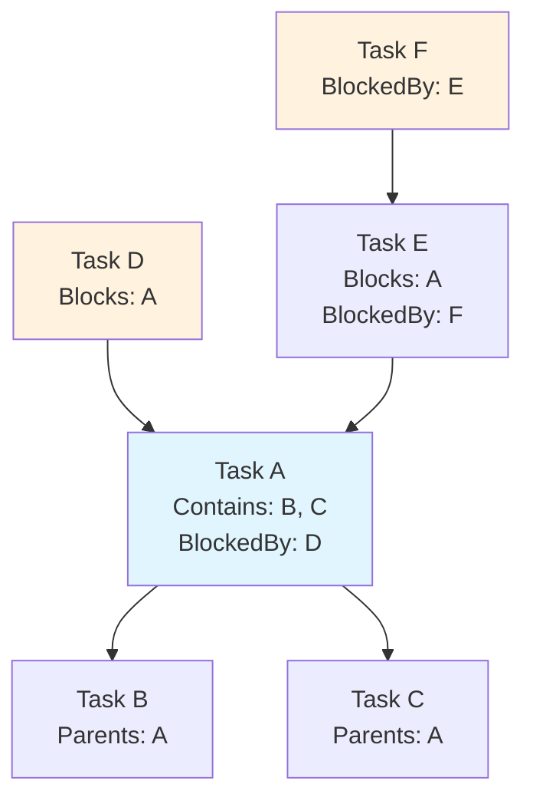
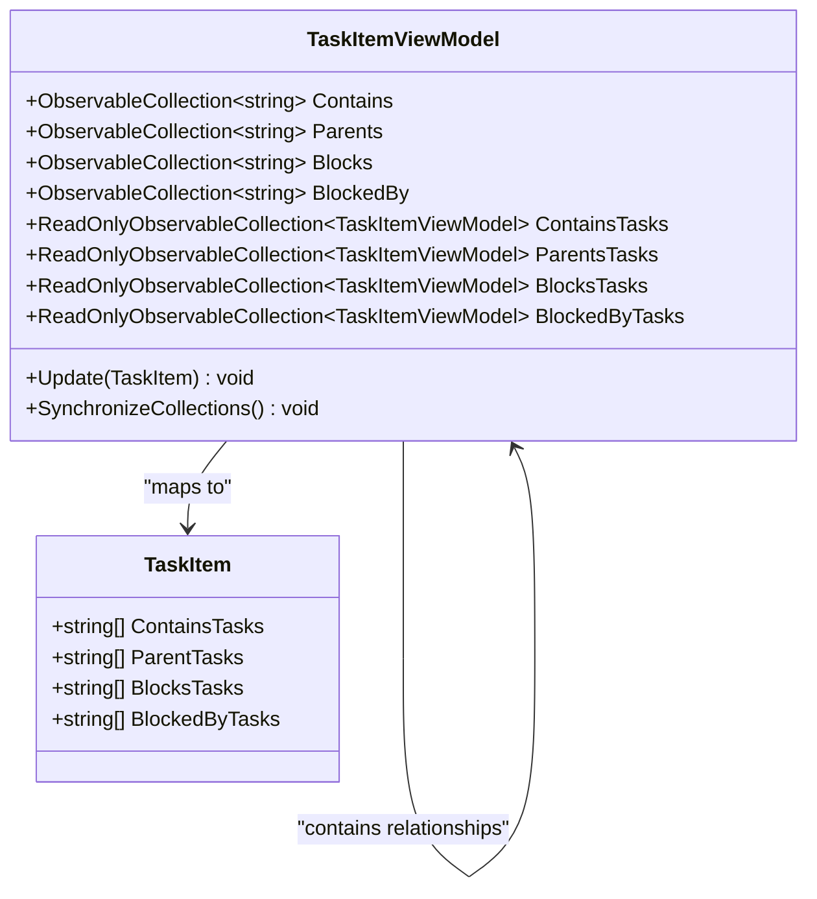
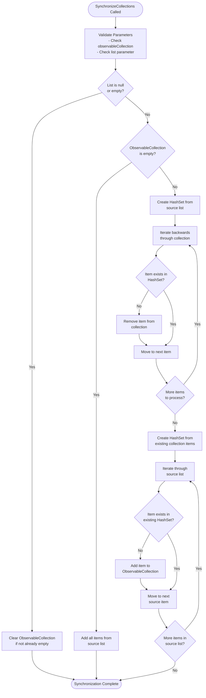
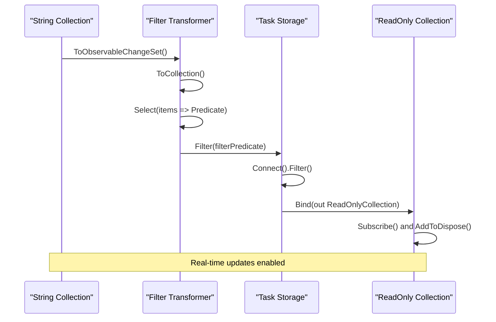
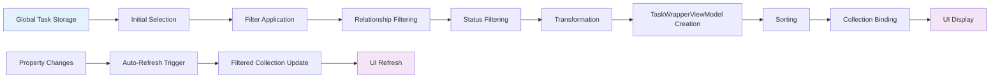
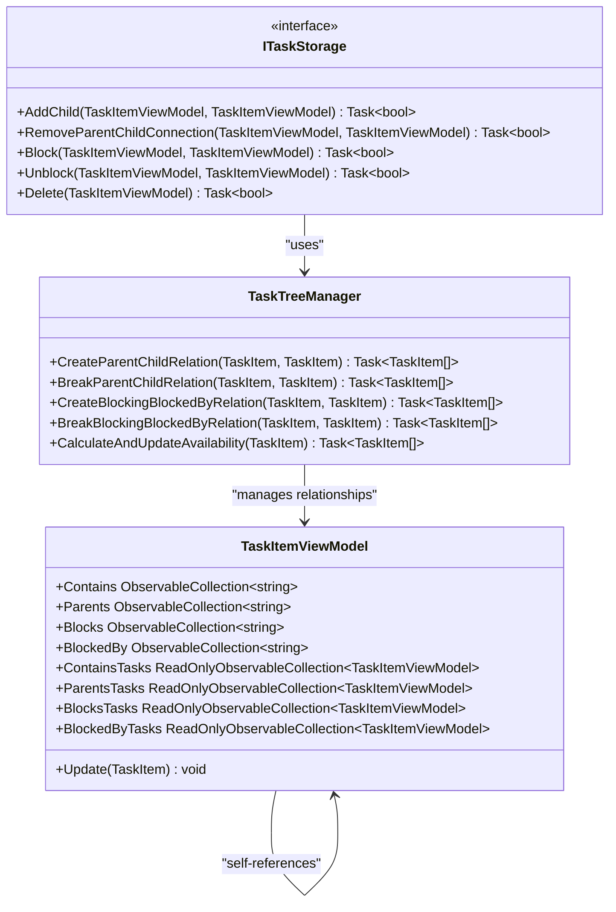
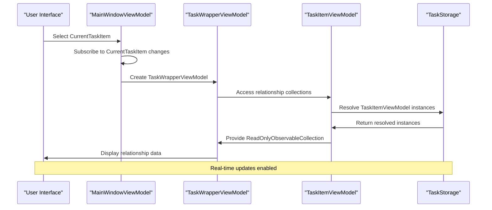

# Task Relationships and Collections

<cite>
**Referenced Files in This Document**
- [TaskItemViewModel.cs](file://src/Unlimotion.ViewModel/TaskItemViewModel.cs)
- [TaskItem.cs](file://src/Unlimotion.Domain/TaskItem.cs)
- [ITaskStorage.cs](file://src/Unlimotion.ViewModel/ITaskStorage.cs)
- [MainWindowViewModel.cs](file://src/Unlimotion.ViewModel/MainWindowViewModel.cs)
- [TaskWrapperViewModel.cs](file://src/Unlimotion.ViewModel/TaskWrapperViewModel.cs)
- [TaskTreeManager.cs](file://src/Unlimotion.TaskTreeManager/TaskTreeManager.cs)
- [TaskStorageExtensions.cs](file://src/Unlimotion\TaskStorageExtensions.cs)
</cite>

## Table of Contents
1. [Introduction](#introduction)
2. [Relationship Types Overview](#relationship-types-overview)
3. [Core Collection Properties](#core-collection-properties)
4. [Synchronization Mechanism](#synchronization-mechanism)
5. [DynamicData Binding System](#dynamicdata-binding-system)
6. [Reactive Filtering and Transformation](#reactive-filtering-and-transformation)
7. [Task Relationship Management](#task-relationship-management)
8. [View Model Integration](#view-model-integration)
9. [Performance Considerations](#performance-considerations)
10. [Troubleshooting Guide](#troubleshooting-guide)
11. [Conclusion](#conclusion)

## Introduction

The TaskItemViewModel in Unlimotion implements a sophisticated relationship management system that handles four distinct types of task connections: Contains, Parents, Blocks, and BlockedBy. This system enables complex hierarchical task structures with bidirectional dependencies, allowing tasks to be organized in flexible parent-child relationships while maintaining strict blocking constraints.

The relationship management system operates through a combination of ObservableCollection<string> properties that store task identifiers and ReadOnlyObservableCollection<TaskItemViewModel> properties that provide strongly-typed access to related tasks. The synchronization between these collections is handled through the SynchronizeCollections method, while DynamicData bindings enable real-time updates across the entire application.

## Relationship Types Overview

The task relationship system supports four fundamental relationship types that define how tasks interact with each other:

### Contains Relationships
Contains relationships represent the hierarchical containment of tasks within parent tasks. A task with Contains relationships is considered a child task that contributes to the completion of its parent tasks. These relationships form the core of the task tree structure, enabling decomposition of complex tasks into manageable subtasks.

### Parents Relationships  
Parents relationships establish the reverse containment relationship. A task with Parent relationships is contained within one or more parent tasks. This bidirectional relationship allows a single task to belong to multiple parent tasks simultaneously, enabling flexible organizational patterns and cross-project task associations.

### Blocks Relationships
Blocks relationships define forward-blocking dependencies where the current task prevents the completion of other tasks. A task with Blocks relationships creates dependencies that must be resolved before the blocked tasks can progress. This relationship type enforces strict ordering constraints in task execution.

### BlockedBy Relationships
BlockedBy relationships represent backward-blocking dependencies where the current task depends on other tasks for completion. A task with BlockedBy relationships cannot be unlocked until all blocking dependencies are satisfied. This relationship type creates the inverse dependency chain that ensures proper task sequencing.

**Diagram sources**
- [TaskItemViewModel.cs](file://src/Unlimotion.ViewModel/TaskItemViewModel.cs#L430-L440)
- [TaskItem.cs](file://src/Unlimotion.Domain/TaskItem.cs#L15-L20)

## Core Collection Properties

The TaskItemViewModel maintains four primary ObservableCollection<string> properties that serve as the foundation for relationship management:

### Contains Property
The Contains collection stores identifiers of child tasks that are contained within the current task. These relationships represent the decomposition of the current task into smaller, manageable components. The collection is maintained as a string-based identifier list that corresponds to the ContainsTasks property in the underlying TaskItem model.

### Parents Property  
The Parents collection stores identifiers of parent tasks that contain the current task. This collection establishes the reverse containment relationship and enables navigation from child tasks back to their parent containers. Like Contains, this collection maintains string identifiers that correspond to the ParentTasks property in the model.

### Blocks Property
The Blocks collection stores identifiers of tasks that are blocked by the current task. These relationships define forward dependencies where the current task prevents the completion of other tasks. The collection maintains string identifiers that correspond to the BlocksTasks property in the TaskItem model.

### BlockedBy Property
The BlockedBy collection stores identifiers of tasks that block the current task. These relationships define backward dependencies where the current task cannot be completed until other tasks are finished. The collection maintains string identifiers that correspond to the BlockedByTasks property in the TaskItem model.

**Diagram sources**
- [TaskItemViewModel.cs](file://src/Unlimotion.ViewModel/TaskItemViewModel.cs#L430-L440)
- [TaskItem.cs](file://src/Unlimotion.Domain/TaskItem.cs#L15-L20)

**Section sources**
- [TaskItemViewModel.cs](file://src/Unlimotion.ViewModel/TaskItemViewModel.cs#L430-L440)
- [TaskItem.cs](file://src/Unlimotion.Domain/TaskItem.cs#L15-L20)

## Synchronization Mechanism

The SynchronizeCollections method serves as the core synchronization mechanism that maintains consistency between the string-based identifier collections and the underlying TaskItem model. This method ensures that changes in the model are properly reflected in the view model collections and vice versa.

### Synchronization Process

The synchronization process follows a three-phase approach:

1. **Validation Phase**: The method validates input parameters and handles null or empty collections appropriately
2. **Removal Phase**: Removes elements from the ObservableCollection that are not present in the source list
3. **Addition Phase**: Adds elements from the source list that are not present in the ObservableCollection

### Synchronization Algorithm

The synchronization algorithm employs efficient set-based operations to minimize unnecessary modifications:

- Uses HashSet for O(1) lookups during removal operations
- Maintains separate tracking for existing items and new additions
- Processes collections in reverse order during removal to prevent index shifting issues

### Error Handling and Edge Cases

The synchronization method includes comprehensive error handling for various scenarios:
- Null collection validation with appropriate exceptions
- Empty list handling with collection clearing
- Performance optimization through early termination conditions
- Memory-efficient processing using hash sets for duplicate detection

**Diagram sources**
- [TaskItemViewModel.cs](file://src/Unlimotion.ViewModel/TaskItemViewModel.cs#L627-L665)

**Section sources**
- [TaskItemViewModel.cs](file://src/Unlimotion.ViewModel/TaskItemViewModel.cs#L627-L665)

## DynamicData Binding System

The DynamicData binding system enables real-time synchronization between the string-based identifier collections and the strongly-typed ReadOnlyObservableCollection<TaskItemViewModel> properties. This system provides automatic updates whenever task relationships change, ensuring that the user interface remains consistent with the underlying data model.

### Binding Architecture

The binding system operates through a series of reactive streams that transform string identifiers into TaskItemViewModel instances:

1. **Identifier Stream**: Observable collections of string identifiers
2. **Filter Transformation**: Dynamic filters that convert identifiers to predicates
3. **Task Resolution**: Lookup of TaskItemViewModel instances from the global task storage
4. **Collection Binding**: Binding of resolved TaskItemViewModel instances to ReadOnlyObservableCollection properties

### Reactive Filter Implementation

Each relationship type uses a specialized filter implementation that converts string identifiers to functional predicates:

**Diagram sources**
- [TaskItemViewModel.cs](file://src/Unlimotion.ViewModel/TaskItemViewModel.cs#L69-L104)
- [TaskItemViewModel.cs](file://src/Unlimotion.ViewModel/TaskItemViewModel.cs#L106-L139)

### Binding Lifecycle Management

The binding system includes comprehensive lifecycle management to prevent memory leaks and ensure proper cleanup:

- Automatic subscription disposal through AddToDispose extension
- Reactive stream composition with proper disposal chains
- Memory-efficient binding with minimal overhead
- Thread-safe operations through ReactiveUI framework

**Section sources**
- [TaskItemViewModel.cs](file://src/Unlimotion.ViewModel/TaskItemViewModel.cs#L69-L139)

## Reactive Filtering and Transformation

The reactive filtering system provides powerful capabilities for transforming raw task data into filtered, sorted, and transformed collections suitable for display in the user interface. This system enables dynamic filtering based on various criteria while maintaining real-time updates.

### Filter Composition

The filtering system supports multiple filter layers that can be composed together:

1. **Default Filters**: Basic filtering criteria provided by the system
2. **Custom Filters**: User-defined filtering expressions
3. **Relationship Filters**: Filters based on task relationships
4. **Status Filters**: Filters based on task completion status

### Transformation Pipeline

The transformation pipeline processes task data through multiple stages:

1. **Initial Selection**: Select tasks from the global task storage
2. **Filter Application**: Apply configured filters to reduce the dataset
3. **Transformation**: Convert TaskItemViewModel instances to TaskWrapperViewModel instances
4. **Sorting**: Apply sorting criteria to organize the collection
5. **Binding**: Bind the processed collection to the UI

### Auto-Refresh Mechanisms

The system includes auto-refresh capabilities that automatically update filtered collections when relevant properties change:

- **Property Change Detection**: Monitors specific properties for changes
- **Trigger-Based Updates**: Triggers refresh when monitored properties change
- **Efficient Refresh**: Optimized refresh operations to minimize performance impact

**Diagram sources**
- [TaskWrapperViewModel.cs](file://src/Unlimotion.ViewModel/TaskWrapperViewModel.cs#L85-L110)
- [MainWindowViewModel.cs](file://src/Unlimotion.ViewModel/MainWindowViewModel.cs#L780-L841)

**Section sources**
- [TaskWrapperViewModel.cs](file://src/Unlimotion.ViewModel/TaskWrapperViewModel.cs#L85-L110)
- [MainWindowViewModel.cs](file://src/Unlimotion.ViewModel/MainWindowViewModel.cs#L780-L841)

## Task Relationship Management

The task relationship management system handles the creation, modification, and deletion of task relationships through a comprehensive set of operations managed by the TaskTreeManager and ITaskStorage interfaces.

### Relationship Creation Operations

The system supports various relationship creation scenarios:

1. **Parent-Child Relationships**: Establishing containment relationships between tasks
2. **Blocking Relationships**: Creating forward and backward blocking dependencies
3. **Multi-Parent Relationships**: Allowing a single task to have multiple parent relationships
4. **Recursive Relationship Management**: Handling complex relationship chains

### Relationship Modification Operations

Relationship modification operations include:

- **Adding Parent Relationships**: Incorporating tasks into new parent containers
- **Removing Parent Relationships**: Dissolving parent-child connections
- **Modifying Blocking Relationships**: Adjusting blocking dependencies
- **Moving Tasks Between Containers**: Relocating tasks within the hierarchy

### Relationship Deletion Operations

The system provides safe deletion mechanisms that handle cascading effects:

- **Cascade Deletion**: Removing dependent relationships when tasks are deleted
- **Reference Cleanup**: Cleaning up orphaned references
- **Consistency Validation**: Ensuring data consistency after deletions
- **Transaction Support**: Providing rollback capabilities for failed operations

**Diagram sources**
- [ITaskStorage.cs](file://src/Unlimotion.ViewModel/ITaskStorage.cs#L15-L32)
- [TaskTreeManager.cs](file://src/Unlimotion.TaskTreeManager/TaskTreeManager.cs#L486-L527)
- [TaskItemViewModel.cs](file://src/Unlimotion.ViewModel/TaskItemViewModel.cs#L588-L625)

**Section sources**
- [ITaskStorage.cs](file://src/Unlimotion.ViewModel/ITaskStorage.cs#L15-L32)
- [TaskTreeManager.cs](file://src/Unlimotion.TaskTreeManager/TaskTreeManager.cs#L486-L527)

## View Model Integration

The TaskItemViewModel integrates seamlessly with the broader application architecture through the MainWindowViewModel and TaskWrapperViewModel systems, providing comprehensive relationship management capabilities throughout the user interface.

### MainWindowViewModel Integration

The MainWindowViewModel manages relationship views through specialized TaskWrapperViewModel instances:

1. **CurrentItemContains**: Manages the "Contains" relationship view
2. **CurrentItemParents**: Manages the "Parents" relationship view  
3. **CurrentItemBlocks**: Manages the "Blocks" relationship view
4. **CurrentItemBlockedBy**: Manages the "BlockedBy" relationship view

### TaskWrapperViewModel Architecture

The TaskWrapperViewModel provides a presentation layer that bridges between the raw task data and the user interface:

- **Child Selector**: Defines how child tasks are selected and filtered
- **Remove Actions**: Handles relationship removal operations
- **Sorting Comparers**: Provides sorting capabilities for relationship collections
- **Filter Chains**: Supports complex filtering scenarios

### Relationship Navigation

The system provides intuitive navigation capabilities for exploring task relationships:

- **Hierarchical Navigation**: Navigate up and down the task hierarchy
- **Relationship Exploration**: Explore related tasks through different relationship types
- **Cross-Reference Viewing**: View the same task from multiple relationship perspectives
- **Contextual Information**: Display relevant information about relationship contexts

**Diagram sources**
- [MainWindowViewModel.cs](file://src/Unlimotion.ViewModel/MainWindowViewModel.cs#L780-L841)
- [TaskWrapperViewModel.cs](file://src/Unlimotion.ViewModel/TaskWrapperViewModel.cs#L68-L124)

**Section sources**
- [MainWindowViewModel.cs](file://src/Unlimotion.ViewModel/MainWindowViewModel.cs#L780-L841)
- [TaskWrapperViewModel.cs](file://src/Unlimotion.ViewModel/TaskWrapperViewModel.cs#L68-L124)

## Performance Considerations

The relationship management system incorporates several performance optimization strategies to ensure responsive operation even with large task datasets:

### Memory Management

- **Lazy Loading**: Relationship collections are loaded on-demand to minimize memory usage
- **Weak References**: Proper disposal patterns prevent memory leaks
- **Collection Optimization**: Efficient collection operations minimize memory allocation
- **Disposal Patterns**: Comprehensive disposal chains ensure resource cleanup

### Reactive Stream Optimization

- **Stream Composition**: Optimized reactive stream compositions minimize overhead
- **Filter Efficiency**: Efficient filtering reduces processing costs
- **Auto-Refresh Control**: Controlled auto-refresh prevents excessive updates
- **Subscription Management**: Proper subscription lifecycle management

### Data Access Patterns

- **Batch Operations**: Related operations are batched for efficiency
- **Caching Strategies**: Frequently accessed data is cached appropriately
- **Asynchronous Processing**: Long-running operations use asynchronous patterns
- **Resource Pooling**: Shared resources are pooled for reuse

### Scalability Considerations

- **O(n) Operations**: Core operations maintain linear time complexity
- **Index Utilization**: String-based indexing for fast lookups
- **Parallel Processing**: Suitable operations are processed in parallel
- **Progressive Loading**: Large datasets are loaded progressively

## Troubleshooting Guide

Common issues and solutions for relationship management problems:

### Synchronization Issues

**Problem**: Relationship collections are out of sync with the underlying model
**Solution**: Verify that the Update method is called with the latest TaskItem data and that SynchronizeCollections is invoked correctly

**Problem**: Changes to relationships are not reflected in the UI
**Solution**: Check that the binding subscriptions are properly established and that the Dispose pattern is correctly implemented

### Performance Problems

**Problem**: Slow relationship loading or updates
**Solution**: Review filter efficiency, check for unnecessary subscriptions, and verify disposal patterns

**Problem**: Memory leaks or high memory usage
**Solution**: Ensure proper disposal of subscriptions and check for circular references

### Data Integrity Issues

**Problem**: Orphaned relationships or inconsistent state
**Solution**: Verify that relationship operations are atomic and that rollback mechanisms are properly implemented

**Problem**: Circular dependencies causing infinite loops
**Solution**: Implement cycle detection and prevention mechanisms in relationship creation operations

## Conclusion

The TaskItemViewModel relationship management system provides a robust foundation for complex task hierarchies and dependencies in the Unlimotion application. Through the combination of ObservableCollection<string> properties for identifier storage, ReadOnlyObservableCollection<TaskItemViewModel> properties for typed access, and DynamicData bindings for real-time updates, the system enables sophisticated task organization while maintaining excellent performance characteristics.

The reactive filtering and transformation capabilities ensure that users can explore task relationships dynamically, while the comprehensive lifecycle management prevents memory leaks and ensures proper resource cleanup. The integration with the broader application architecture through MainWindowViewModel and TaskWrapperViewModel provides seamless user experience across all relationship management scenarios.

This system demonstrates advanced patterns for managing complex data relationships in modern desktop applications, combining reactive programming principles with traditional MVVM architecture to create a responsive and maintainable solution for task relationship management.