# View Model (TaskItemViewModel)

<cite>
**Referenced Files in This Document**
- [TaskItemViewModel.cs](file://src/Unlimotion.ViewModel/TaskItemViewModel.cs)
- [TaskItem.cs](file://src/Unlimotion.Domain/TaskItem.cs)
- [DisposableList.cs](file://src/Unlimotion.ViewModel/DisposableList.cs)
- [ITaskStorage.cs](file://src/Unlimotion.ViewModel/ITaskStorage.cs)
- [SetDurationCommands.cs](file://src/Unlimotion.ViewModel/SetDurationCommands.cs)
- [DateCommands.cs](file://src/Unlimotion.ViewModel/DateCommands.cs)
- [RepeaterPatternViewModel.cs](file://src/Unlimotion.ViewModel/RepeaterPatternViewModel.cs)
- [FodyWeavers.xml](file://src/Unlimotion.ViewModel/FodyWeavers.xml)
- [UpdateType.cs](file://src/Unlimotion.ViewModel/Models/UpdateType.cs)
</cite>

## Table of Contents
1. [Introduction](#introduction)
2. [MVVM Pattern Implementation](#mvvm-pattern-implementation)
3. [Core Architecture](#core-architecture)
4. [INotifyPropertyChanged Implementation](#inotifypropertychanged-implementation)
5. [Reactive Commands](#reactive-commands)
6. [Model Property and Bidirectional Mapping](#model-property-and-bidirectional-mapping)
7. [Collection Synchronization with DynamicData](#collection-synchronization-with-dynamicdata)
8. [Reactive Subscriptions and Property Change Propagation](#reactive-subscriptions-and-property-change-propagation)
9. [Domain Model Integration](#domain-model-integration)
10. [Performance Optimizations](#performance-optimizations)
11. [Error Handling and Edge Cases](#error-handling-and-edge-cases)
12. [Testing Considerations](#testing-considerations)

## Introduction

The TaskItemViewModel class serves as the central bridge between the user interface and domain logic in the Unlimotion application's MVVM (Model-View-ViewModel) architecture. This sophisticated ViewModel implements the MVVM pattern to separate presentation logic from business logic while maintaining real-time synchronization between the UI and underlying data models.

The TaskItemViewModel acts as a comprehensive wrapper around the TaskItem domain entity, providing reactive property notifications, command implementations, and collection management capabilities. It leverages modern reactive programming patterns through ReactiveUI and DynamicData libraries to deliver responsive user experiences while maintaining clean separation of concerns.

## MVVM Pattern Implementation

The TaskItemViewModel exemplifies the MVVM pattern through its strategic separation of responsibilities:

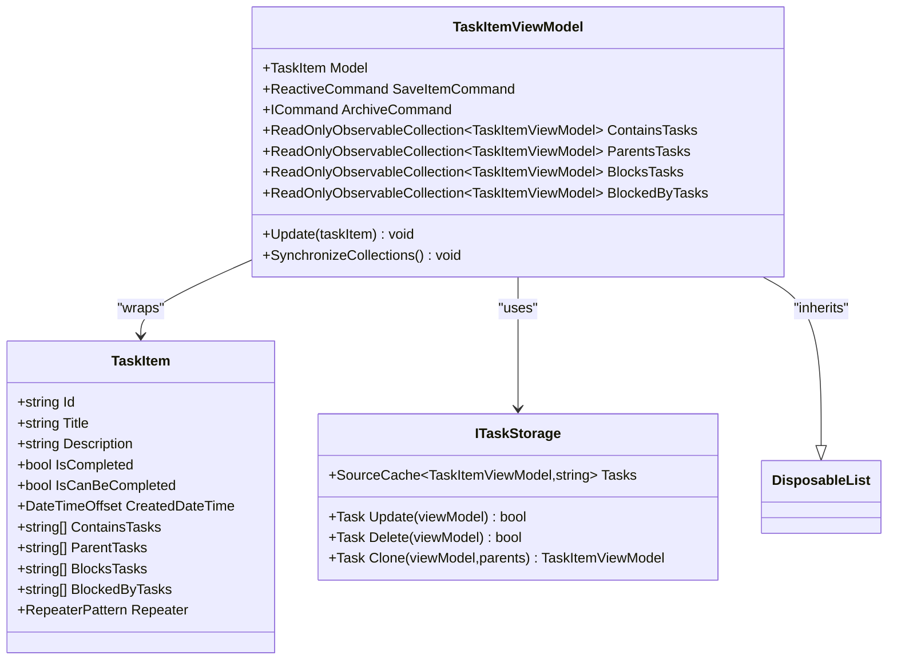

**Diagram sources**
- [TaskItemViewModel.cs](file://src/Unlimotion.ViewModel/TaskItemViewModel.cs#L20-L666)
- [TaskItem.cs](file://src/Unlimotion.Domain/TaskItem.cs#L5-L32)
- [ITaskStorage.cs](file://src/Unlimotion.ViewModel/ITaskStorage.cs#L10-L27)

The ViewModel maintains a clear separation where:
- **View Layer**: Handles user interactions and displays data
- **ViewModel Layer**: Manages presentation logic and data transformation
- **Model Layer**: Contains business logic and domain entities

**Section sources**
- [TaskItemViewModel.cs](file://src/Unlimotion.ViewModel/TaskItemViewModel.cs#L20-L30)

## Core Architecture

The TaskItemViewModel inherits from DisposableList, establishing a foundation for resource management and subscription lifecycle control:

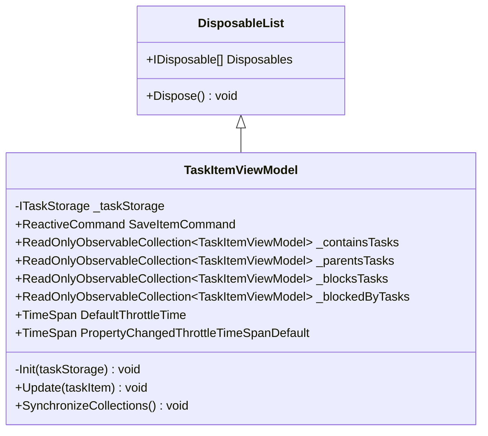

**Diagram sources**
- [TaskItemViewModel.cs](file://src/Unlimotion.ViewModel/TaskItemViewModel.cs#L20-L30)
- [DisposableList.cs](file://src/Unlimotion.ViewModel/DisposableList.cs#L5-L28)

The architecture emphasizes:
- **Resource Management**: Automatic cleanup of reactive subscriptions
- **State Management**: Centralized property change tracking
- **Dependency Injection**: TaskStorage integration for persistence operations

**Section sources**
- [TaskItemViewModel.cs](file://src/Unlimotion.ViewModel/TaskItemViewModel.cs#L20-L30)
- [DisposableList.cs](file://src/Unlimotion.ViewModel/DisposableList.cs#L5-L28)

## INotifyPropertyChanged Implementation

The TaskItemViewModel leverages Fody's PropertyChanged weaving to automatically implement INotifyPropertyChanged without boilerplate code:

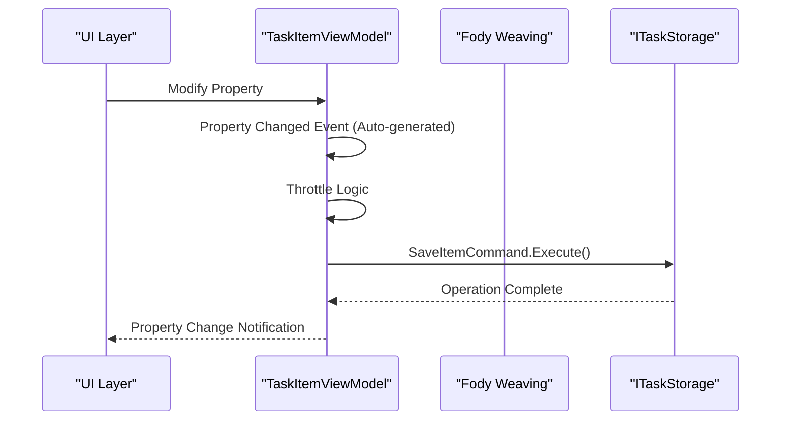

**Diagram sources**
- [TaskItemViewModel.cs](file://src/Unlimotion.ViewModel/TaskItemViewModel.cs#L203-L250)
- [FodyWeavers.xml](file://src/Unlimotion.ViewModel/FodyWeavers.xml#L1-L3)

The implementation features:
- **Automatic Property Change Detection**: Fody generates PropertyChanged events
- **Selective Property Monitoring**: Only relevant properties trigger save operations
- **Throttling Mechanism**: Prevents excessive save operations during rapid changes
- **Conditional Execution**: Saves only when the application is initialized

**Section sources**
- [TaskItemViewModel.cs](file://src/Unlimotion.ViewModel/TaskItemViewModel.cs#L203-L250)
- [FodyWeavers.xml](file://src/Unlimotion.ViewModel/FodyWeavers.xml#L1-L3)

## Reactive Commands

The TaskItemViewModel implements several reactive commands that encapsulate business logic and provide asynchronous operation support:

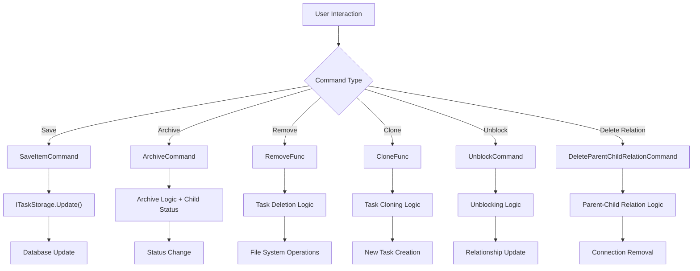

**Diagram sources**
- [TaskItemViewModel.cs](file://src/Unlimotion.ViewModel/TaskItemViewModel.cs#L39-L171)
- [SetDurationCommands.cs](file://src/Unlimotion.ViewModel/SetDurationCommands.cs#L8-L46)
- [DateCommands.cs](file://src/Unlimotion.ViewModel/DateCommands.cs#L8-L54)

### Command Details

| Command | Purpose | Implementation |
|---------|---------|----------------|
| SaveItemCommand | Persist changes to storage | ReactiveCommand.CreateFromTask with throttling |
| ArchiveCommand | Toggle completion/archive state | Conditional logic with child task handling |
| RemoveFunc | Delete task with parent consideration | Async deletion with confirmation logic |
| CloneFunc | Duplicate task with new parent | Task cloning with relationship preservation |
| UnblockCommand | Remove blocking relationships | Direct storage operation |
| DeleteParentChildRelationCommand | Break parent-child connections | Relationship removal logic |

**Section sources**
- [TaskItemViewModel.cs](file://src/Unlimotion.ViewModel/TaskItemViewModel.cs#L39-L171)
- [SetDurationCommands.cs](file://src/Unlimotion.ViewModel/SetDurationCommands.cs#L8-L46)
- [DateCommands.cs](file://src/Unlimotion.ViewModel/DateCommands.cs#L8-L54)

## Model Property and Bidirectional Mapping

The Model property serves as the primary mechanism for bidirectional synchronization between the ViewModel and the underlying TaskItem domain model:

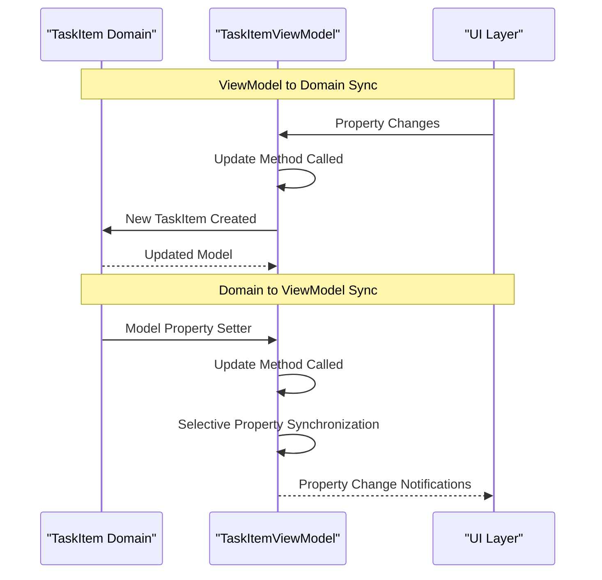

**Diagram sources**
- [TaskItemViewModel.cs](file://src/Unlimotion.ViewModel/TaskItemViewModel.cs#L173-L201)
- [TaskItemViewModel.cs](file://src/Unlimotion.ViewModel/TaskItemViewModel.cs#L575-L622)

### Update Method Implementation

The Update method performs intelligent property synchronization:

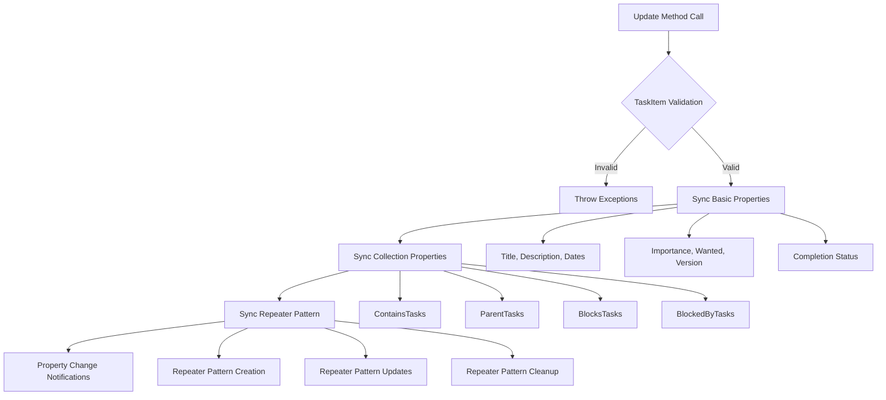

**Diagram sources**
- [TaskItemViewModel.cs](file://src/Unlimotion.ViewModel/TaskItemViewModel.cs#L575-L622)

**Section sources**
- [TaskItemViewModel.cs](file://src/Unlimotion.ViewModel/TaskItemViewModel.cs#L173-L201)
- [TaskItemViewModel.cs](file://src/Unlimotion.ViewModel/TaskItemViewModel.cs#L575-L622)

## Collection Synchronization with DynamicData

The TaskItemViewModel leverages DynamicData for real-time collection synchronization and reactive updates:

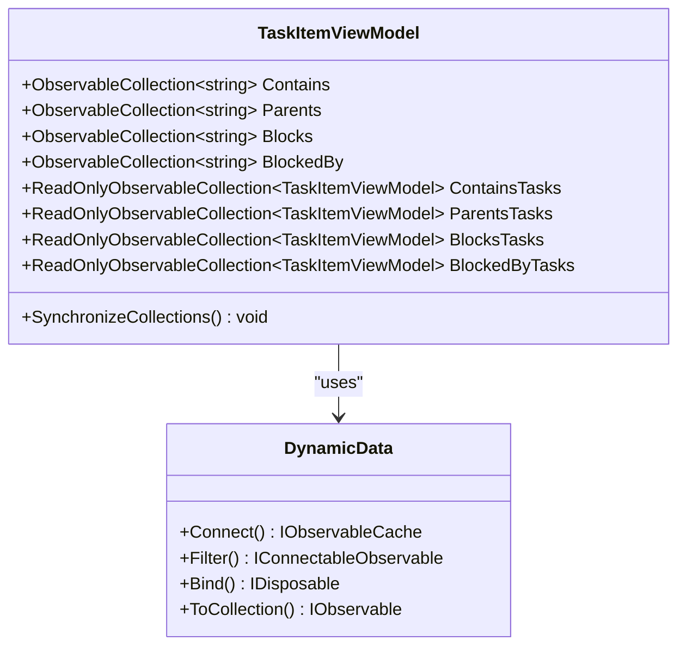

**Diagram sources**
- [TaskItemViewModel.cs](file://src/Unlimotion.ViewModel/TaskItemViewModel.cs#L39-L120)

### Collection Synchronization Process

The SynchronizeCollections utility ensures efficient ObservableCollection maintenance:

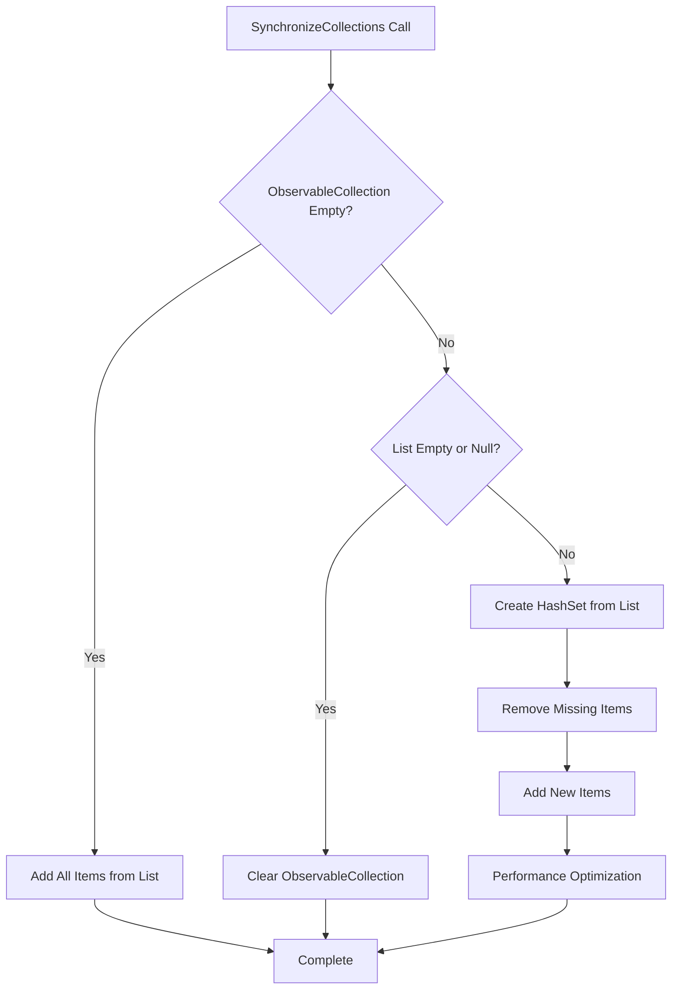

**Diagram sources**
- [TaskItemViewModel.cs](file://src/Unlimotion.ViewModel/TaskItemViewModel.cs#L623-L665)

**Section sources**
- [TaskItemViewModel.cs](file://src/Unlimotion.ViewModel/TaskItemViewModel.cs#L39-L120)
- [TaskItemViewModel.cs](file://src/Unlimotion.ViewModel/TaskItemViewModel.cs#L623-L665)

## Reactive Subscriptions and Property Change Propagation

The TaskItemViewModel implements sophisticated reactive subscriptions for automatic property synchronization and business logic execution:

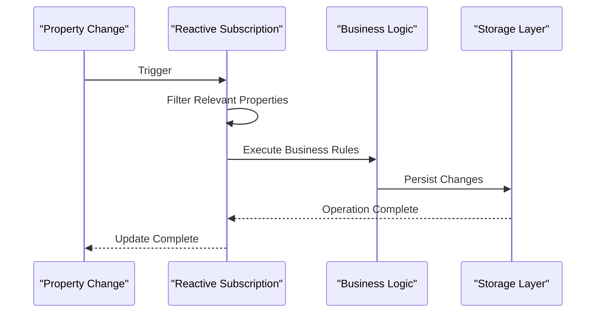

**Diagram sources**
- [TaskItemViewModel.cs](file://src/Unlimotion.ViewModel/TaskItemViewModel.cs#L203-L250)
- [TaskItemViewModel.cs](file://src/Unlimotion.ViewModel/TaskItemViewModel.cs#L252-L280)
- [TaskItemViewModel.cs](file://src/Unlimotion.ViewModel/TaskItemViewModel.cs#L282-L308)

### Key Subscription Patterns

| Subscription Type | Trigger | Action | Throttling |
|------------------|---------|--------|------------|
| Property Changes | Specific properties | Auto-save | Yes (10 seconds) |
| Completion Status | IsCompleted change | TaskTreeManager update | No |
| Date Changes | PlannedBeginDateTime | Calculate PlannedPeriod | No |
| Date Changes | PlannedEndDateTime | Calculate PlannedPeriod | No |
| Repeater Changes | Repeater property | Save with delay | Yes (2 seconds) |

**Section sources**
- [TaskItemViewModel.cs](file://src/Unlimotion.ViewModel/TaskItemViewModel.cs#L203-L250)
- [TaskItemViewModel.cs](file://src/Unlimotion.ViewModel/TaskItemViewModel.cs#L252-L280)
- [TaskItemViewModel.cs](file://src/Unlimotion.ViewModel/TaskItemViewModel.cs#L282-L308)

## Domain Model Integration

The TaskItemViewModel consumes pre-calculated values from the domain model, optimizing performance and reducing redundant calculations:

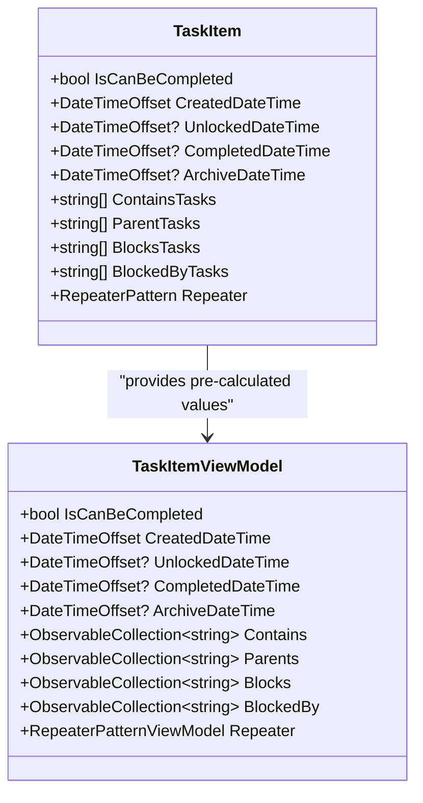

**Diagram sources**
- [TaskItem.cs](file://src/Unlimotion.Domain/TaskItem.cs#L5-L32)
- [TaskItemViewModel.cs](file://src/Unlimotion.ViewModel/TaskItemViewModel.cs#L173-L201)

### Pre-calculated Value Consumption

The ViewModel leverages domain model optimizations:
- **IsCanBeCompleted**: Pre-calculated business logic determination
- **Timestamps**: Immutable creation and modification timestamps
- **Relationship Collections**: Optimized parent/child relationship management
- **Repeater Patterns**: Efficient recurrence pattern representation

**Section sources**
- [TaskItem.cs](file://src/Unlimotion.Domain/TaskItem.cs#L5-L32)
- [TaskItemViewModel.cs](file://src/Unlimotion.ViewModel/TaskItemViewModel.cs#L173-L201)

## Performance Optimizations

The TaskItemViewModel implements several performance optimizations to ensure responsive user experiences:

### Throttling Mechanisms

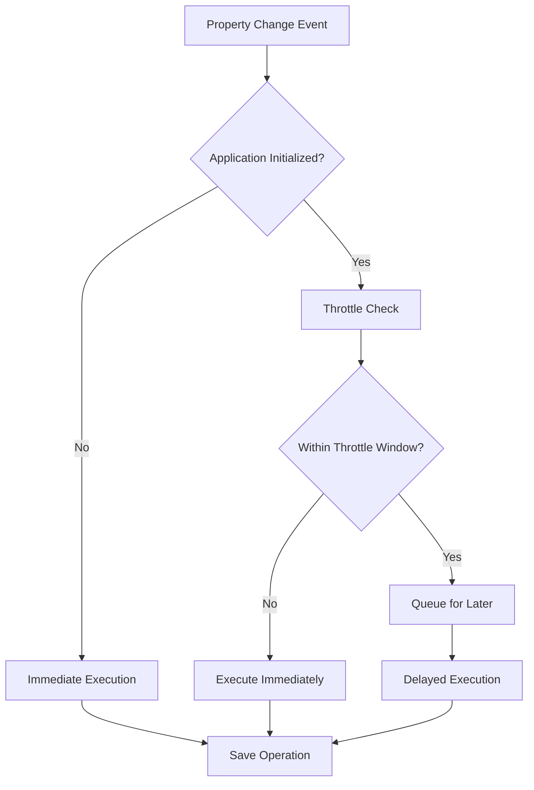

**Diagram sources**
- [TaskItemViewModel.cs](file://src/Unlimotion.ViewModel/TaskItemViewModel.cs#L232-L250)

### Collection Synchronization Optimizations

The SynchronizeCollections method employs several optimization strategies:
- **HashSet-based Lookups**: O(1) element existence checks
- **Reverse Iteration**: Safe removal during iteration
- **Batch Operations**: Minimize UI updates
- **Conditional Processing**: Skip unnecessary operations

### Memory Management

The DisposableList base class ensures proper resource cleanup:
- **Automatic Disposal**: Subscription cleanup on ViewModel disposal
- **Exception Safety**: Graceful handling of disposal exceptions
- **Lifecycle Management**: Proper cleanup timing

**Section sources**
- [TaskItemViewModel.cs](file://src/Unlimotion.ViewModel/TaskItemViewModel.cs#L232-L250)
- [TaskItemViewModel.cs](file://src/Unlimotion.ViewModel/TaskItemViewModel.cs#L623-L665)
- [DisposableList.cs](file://src/Unlimotion.ViewModel/DisposableList.cs#L5-L28)

## Error Handling and Edge Cases

The TaskItemViewModel implements comprehensive error handling and edge case management:

### Validation Strategies

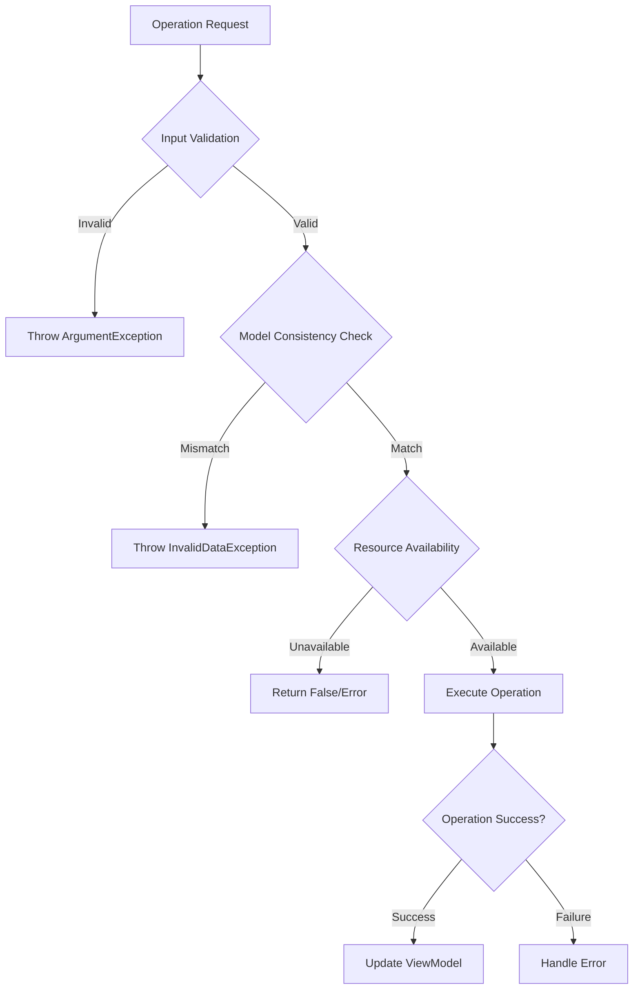

**Diagram sources**
- [TaskItemViewModel.cs](file://src/Unlimotion.ViewModel/TaskItemViewModel.cs#L575-L580)

### Edge Case Handling

| Scenario | Handling Strategy | Implementation |
|----------|------------------|----------------|
| Null TaskItem | Argument validation | ArgumentNullException |
| ID Mismatch | Consistency check | InvalidDataException |
| Empty Collections | Conditional processing | Null/empty list checks |
| Concurrent Access | Throttling mechanism | ReactiveUI throttling |
| Resource Cleanup | Disposable pattern | Automatic disposal |

**Section sources**
- [TaskItemViewModel.cs](file://src/Unlimotion.ViewModel/TaskItemViewModel.cs#L575-L580)
- [TaskItemViewModel.cs](file://src/Unlimotion.ViewModel/TaskItemViewModel.cs#L623-L665)

## Testing Considerations

The TaskItemViewModel's architecture supports comprehensive testing through several mechanisms:

### Mockable Dependencies

The ViewModel's constructor-based dependency injection enables easy mocking:
- **ITaskStorage**: Storage operations simulation
- **Reactive Commands**: Asynchronous operation testing
- **Collection Properties**: State verification

### Testable Business Logic

The separation of concerns allows isolated testing:
- **Update Method**: Property synchronization logic
- **Collection Synchronization**: ObservableCollection behavior
- **Command Execution**: Business rule validation

### Reactive Testing Patterns

The reactive nature supports testing through:
- **Property Change Verification**: ReactiveUI testing utilities
- **Command Execution Testing**: Async operation validation
- **Subscription Lifecycle**: Resource cleanup verification

**Section sources**
- [TaskItemViewModel.cs](file://src/Unlimotion.ViewModel/TaskItemViewModel.cs#L20-L30)
- [ITaskStorage.cs](file://src/Unlimotion.ViewModel/ITaskStorage.cs#L10-L27)