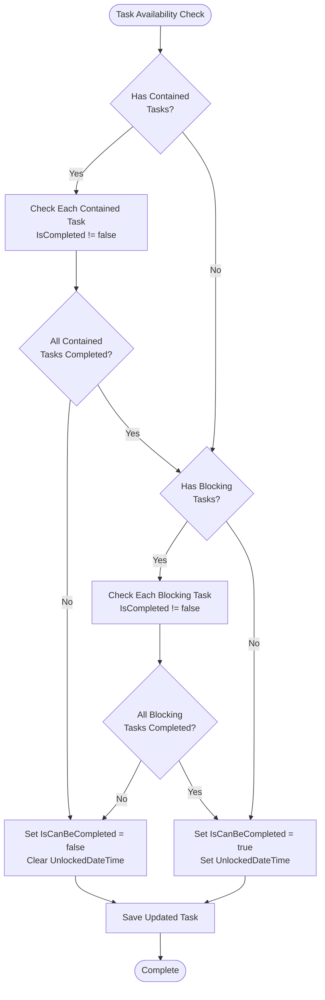
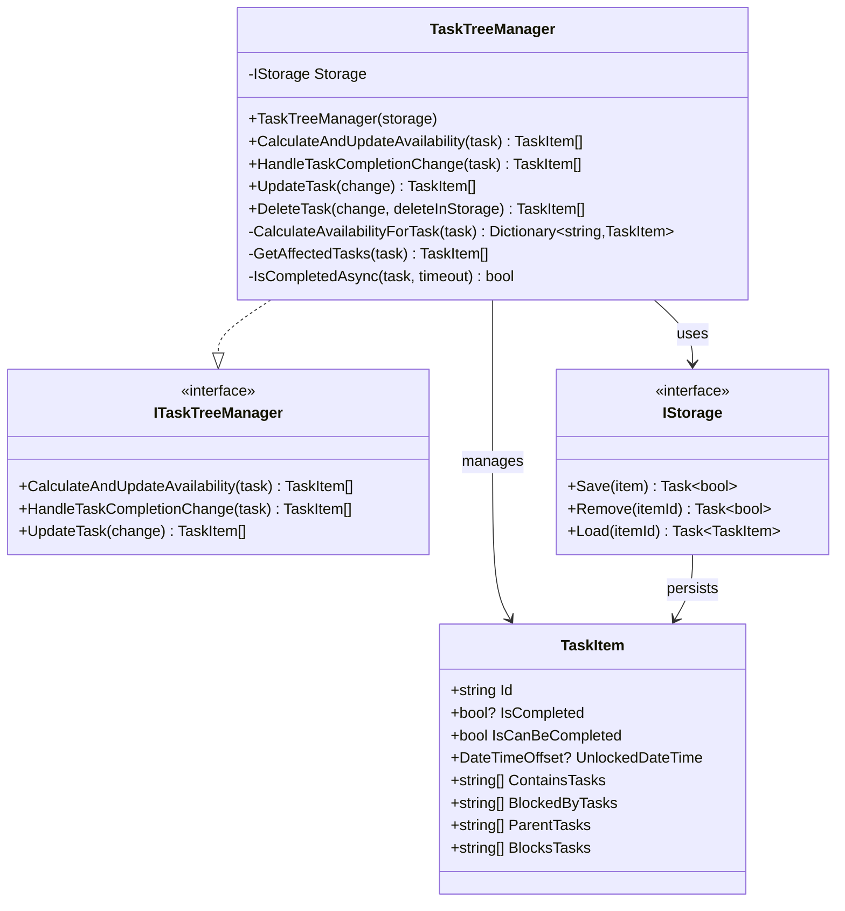
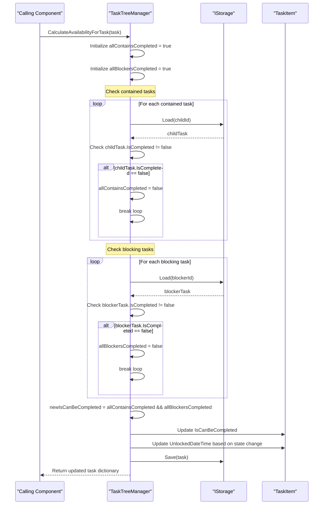
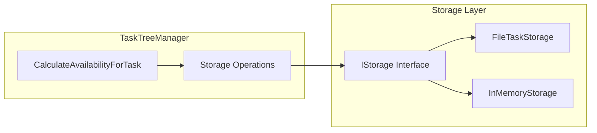
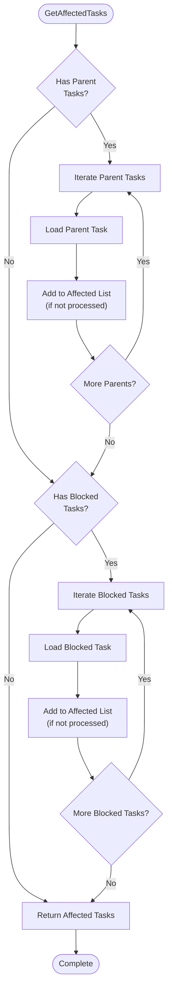
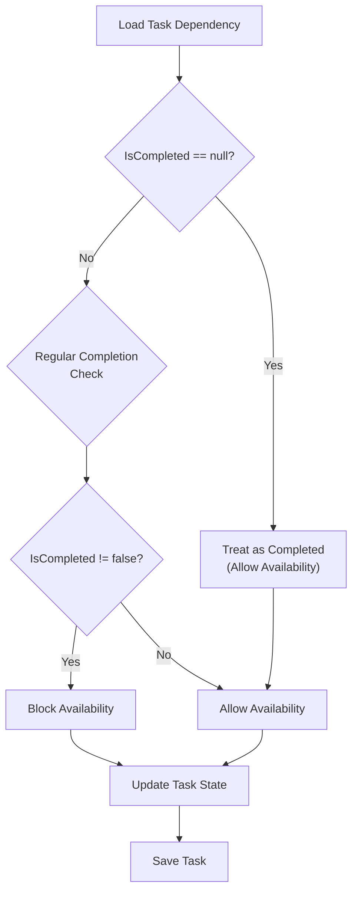
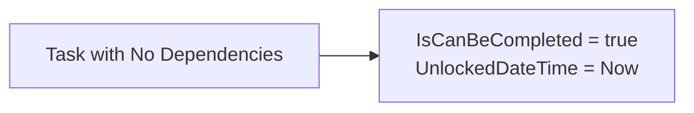
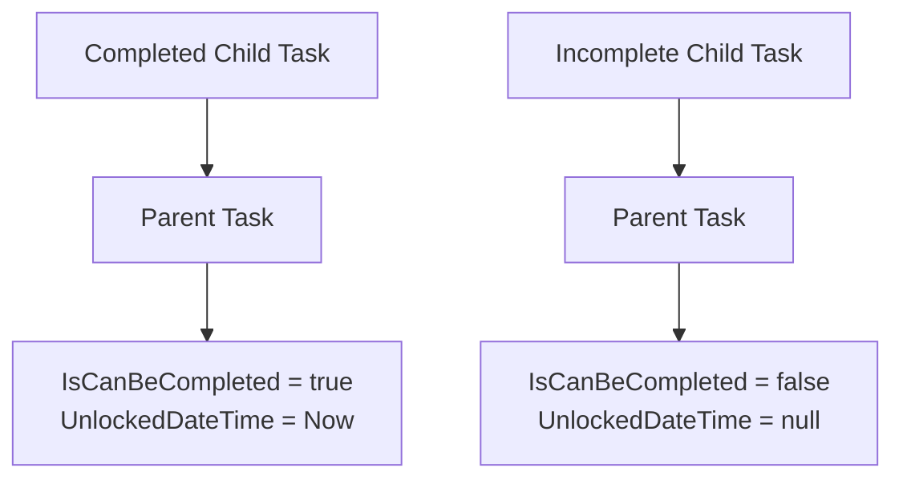
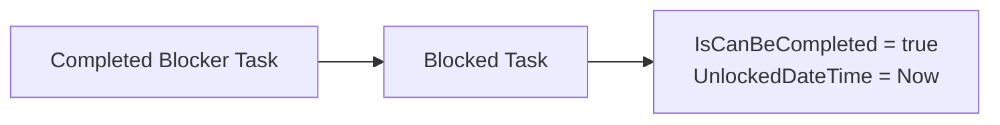
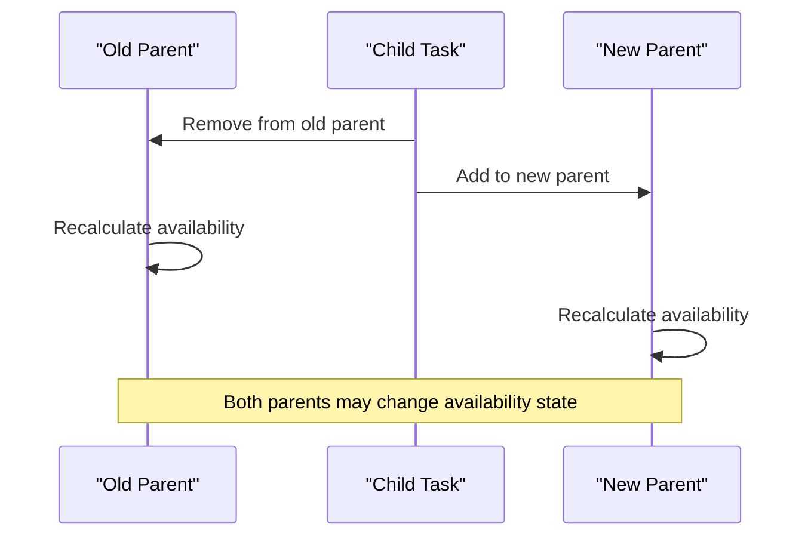

# Availability Calculation Logic

<cite>
**Referenced Files in This Document**
- [TaskTreeManager.cs](file://src/Unlimotion.TaskTreeManager/TaskTreeManager.cs)
- [ITaskTreeManager.cs](file://src/Unlimotion.TaskTreeManager/ITaskTreeManager.cs)
- [TaskItem.cs](file://src/Unlimotion.Domain/TaskItem.cs)
- [TaskAvailabilityCalculationTests.cs](file://src/Unlimotion.Test/TaskAvailabilityCalculationTests.cs)
- [InMemoryStorage.cs](file://src/Unlimotion.Test/InMemoryStorage.cs)
- [IStorage.cs](file://src/Unlimotion.TaskTreeManager/IStorage.cs)
- [FileTaskStorage.cs](file://src/Unlimotion/FileTaskStorage.cs)
- [TaskCompletionChangeTests.cs](file://src/Unlimotion.Test/TaskCompletionChangeTests.cs)
</cite>

## Table of Contents
1. [Introduction](#introduction)
2. [Core Business Rules](#core-business-rules)
3. [TaskTreeManager Architecture](#tasktreemanager-architecture)
4. [CalculateAvailabilityForTask Method](#calculateavailabilityfortask-method)
5. [Storage Integration](#storage-integration)
6. [Dependency Management](#dependency-management)
7. [Archived Task Handling](#archived-task-handling)
8. [Unit Test Examples](#unit-test-examples)
9. [Performance Considerations](#performance-considerations)
10. [Troubleshooting Guide](#troubleshooting-guide)

## Introduction

The availability calculation logic in Unlimotion's TaskTreeManager determines whether a task can be marked as "can be completed" based on complex dependency relationships. This system ensures that tasks are only available for completion when all their prerequisites are satisfied, maintaining data integrity and logical workflow consistency.

The core functionality revolves around two primary business rules that govern task availability, with special handling for archived tasks and cascading recalculation of affected dependencies.

## Core Business Rules

The availability calculation follows strict business rules that determine when a task can be completed:

### Primary Availability Rules

1. **Contained Task Completion Requirement**: All tasks contained within a parent task must be completed (IsCompleted != false)
2. **Blocking Task Completion Requirement**: All tasks that block this task must be completed (IsCompleted != false)

### Special Case: Archived Tasks

- **Archived tasks (IsCompleted = null)**: These are treated as completed for availability calculations, allowing parent tasks to become available even when containing archived subtasks
- **Regular tasks**: Tasks with IsCompleted = true are considered completed, while IsCompleted = false tasks block availability

**Diagram sources**
- [TaskTreeManager.cs](file://src/Unlimotion.TaskTreeManager/TaskTreeManager.cs#L645-L690)

**Section sources**
- [TaskTreeManager.cs](file://src/Unlimotion.TaskTreeManager/TaskTreeManager.cs#L645-L690)
- [IMPLEMENTATION_SUMMARY.md](file://IMPLEMENTATION_SUMMARY.md#L84-L93)

## TaskTreeManager Architecture

The TaskTreeManager serves as the central orchestrator for availability calculations, implementing a sophisticated dependency resolution system.

### Class Structure

**Diagram sources**
- [TaskTreeManager.cs](file://src/Unlimotion.TaskTreeManager/TaskTreeManager.cs#L10-L15)
- [ITaskTreeManager.cs](file://src/Unlimotion.TaskTreeManager/ITaskTreeManager.cs#L7-L42)
- [IStorage.cs](file://src/Unlimotion.TaskTreeManager/IStorage.cs#L5-L10)
- [TaskItem.cs](file://src/Unlimotion.Domain/TaskItem.cs#L6-L32)

### Key Components

- **Storage Layer**: Abstracted persistence mechanism supporting multiple storage backends
- **Availability Calculator**: Core logic engine for dependency resolution
- **Event Propagation**: Cascading updates to affected dependent tasks
- **Retry Mechanism**: Robust operation handling with timeout protection

**Section sources**
- [TaskTreeManager.cs](file://src/Unlimotion.TaskTreeManager/TaskTreeManager.cs#L10-L15)
- [ITaskTreeManager.cs](file://src/Unlimotion.TaskTreeManager/ITaskTreeManager.cs#L7-L42)

## CalculateAvailabilityForTask Method

The `CalculateAvailabilityForTask` method implements the core availability calculation logic, serving as the foundation for all availability determinations.

### Method Implementation Details

The method follows a systematic approach to evaluate task availability:

1. **Initialization**: Sets up completion flags for contained and blocking tasks
2. **Contained Task Evaluation**: Iterates through all contained tasks to verify completion status
3. **Blocking Task Evaluation**: Checks all blocking tasks for completion status
4. **Availability Determination**: Combines evaluation results to determine final availability
5. **State Management**: Updates timestamps and saves the modified task

### Availability Calculation Algorithm

**Diagram sources**
- [TaskTreeManager.cs](file://src/Unlimotion.TaskTreeManager/TaskTreeManager.cs#L645-L690)

### State Change Management

The method implements intelligent state change detection:

- **Availability Increase**: When a task becomes available (IsCanBeCompleted = true), sets UnlockedDateTime to current UTC timestamp
- **Availability Decrease**: When a task becomes blocked (IsCanBeCompleted = false), clears UnlockedDateTime
- **No Change**: Preserves existing state when availability remains unchanged

**Section sources**
- [TaskTreeManager.cs](file://src/Unlimotion.TaskTreeManager/TaskTreeManager.cs#L645-L690)

## Storage Integration

The availability calculation integrates seamlessly with the storage layer through the IStorage abstraction, enabling support for multiple persistence backends.

### Storage Operations

**Diagram sources**
- [IStorage.cs](file://src/Unlimotion.TaskTreeManager/IStorage.cs#L5-L10)
- [FileTaskStorage.cs](file://src/Unlimotion/FileTaskStorage.cs#L18-L25)

### Storage Backend Features

- **FileTaskStorage**: Production-ready file-based persistence with automatic migration support
- **InMemoryStorage**: Testing and development backend for unit testing scenarios
- **Transaction Safety**: Built-in retry mechanisms handle concurrent access scenarios

### Migration Support

The system includes automatic migration capabilities for legacy data:

- **IsCanBeCompleted Field Migration**: Automatically calculates availability for existing tasks
- **Backward Compatibility**: Maintains data integrity during migration process
- **Progress Tracking**: Provides detailed migration reports and progress monitoring

**Section sources**
- [FileTaskStorage.cs](file://src/Unlimotion/FileTaskStorage.cs#L100-L130)
- [IStorage.cs](file://src/Unlimotion.TaskTreeManager/IStorage.cs#L5-L10)

## Dependency Management

The TaskTreeManager implements sophisticated dependency management to ensure comprehensive availability calculations across complex task hierarchies.

### Affected Task Discovery

The `GetAffectedTasks` method identifies all tasks impacted by changes to a specific task:

**Diagram sources**
- [TaskTreeManager.cs](file://src/Unlimotion.TaskTreeManager/TaskTreeManager.cs#L710-L750)

### Cascading Updates

When availability changes occur, the system automatically propagates updates to affected tasks:

1. **Parent Task Updates**: When child tasks change, parent availability is recalculated
2. **Blocking Task Updates**: When blocking relationships change, affected tasks are updated
3. **Recursive Propagation**: Updates cascade through the dependency tree

### Dependency Resolution Algorithm

The system handles complex dependency scenarios through systematic evaluation:

- **Depth-First Traversal**: Processes dependencies in logical order
- **Cycle Detection**: Prevents infinite loops in circular dependency scenarios
- **Efficient Caching**: Uses hash sets to prevent duplicate processing

**Section sources**
- [TaskTreeManager.cs](file://src/Unlimotion.TaskTreeManager/TaskTreeManager.cs#L710-L750)

## Archived Task Handling

The availability calculation system includes specialized handling for archived tasks, which represent completed but retained tasks that should not block parent task availability.

### Archived Task Semantics

Archived tasks (IsCompleted = null) are treated differently from regular completed tasks:

- **Availability Impact**: Archived tasks do not block parent task availability
- **Dependency Resolution**: Parent tasks remain available even when containing archived subtasks
- **Historical Preservation**: Archived tasks maintain historical context without affecting workflow

### Implementation Details

**Diagram sources**
- [TaskAvailabilityCalculationTests.cs](file://src/Unlimotion.Test/TaskAvailabilityCalculationTests.cs#L105-L125)

### Test Scenarios

The system includes comprehensive test coverage for archived task handling:

- **Basic Archived Task**: Single archived child allows parent availability
- **Mixed Dependencies**: Parent with both completed and archived children remains available
- **Complex Hierarchies**: Multi-level dependencies with archived tasks

**Section sources**
- [TaskAvailabilityCalculationTests.cs](file://src/Unlimotion.Test/TaskAvailabilityCalculationTests.cs#L105-L125)

## Unit Test Examples

The test suite provides comprehensive coverage of availability calculation scenarios, demonstrating real-world usage patterns and edge cases.

### Basic Availability Tests

#### No Dependencies Scenario
Tasks without dependencies are always available:

**Diagram sources**
- [TaskAvailabilityCalculationTests.cs](file://src/Unlimotion.Test/TaskAvailabilityCalculationTests.cs#L15-L35)

#### Completed Child Dependency
Parent tasks require all contained tasks to be completed:

**Diagram sources**
- [TaskAvailabilityCalculationTests.cs](file://src/Unlimotion.Test/TaskAvailabilityCalculationTests.cs#L43-L87)

### Blocking Relationship Tests

#### Completed Blocker Scenario
Tasks blocked by completed blockers become available:

**Diagram sources**
- [TaskAvailabilityCalculationTests.cs](file://src/Unlimotion.Test/TaskAvailabilityCalculationTests.cs#L145-L165)

#### Mixed Dependency Scenarios
Complex dependency combinations demonstrate comprehensive evaluation:

- **Multiple Contained Tasks**: All must be completed
- **Multiple Blocking Tasks**: All must be completed  
- **Mixed Scenarios**: Combination of contained and blocking dependencies

### Advanced Scenarios

#### Task Movement and Availability
Moving tasks between containers affects availability:

**Diagram sources**
- [TaskAvailabilityCalculationTests.cs](file://src/Unlimotion.Test/TaskAvailabilityCalculationTests.cs#L350-L420)

#### Completion Change Handling
Changing task completion status triggers comprehensive recalculation:

- **Completion to Incompletion**: Triggers blocking state propagation
- **Incompletion to Completion**: May trigger availability increases
- **Archived Status Changes**: Special handling for null IsCompleted values

**Section sources**
- [TaskAvailabilityCalculationTests.cs](file://src/Unlimotion.Test/TaskAvailabilityCalculationTests.cs#L15-L717)
- [TaskCompletionChangeTests.cs](file://src/Unlimotion.Test/TaskCompletionChangeTests.cs#L15-L86)

## Performance Considerations

The availability calculation system is designed for optimal performance across various usage patterns and data sizes.

### Optimization Strategies

#### Efficient Dependency Traversal
- **Early Termination**: Stops evaluation when conditions are violated
- **Hash Set Caching**: Prevents redundant processing of affected tasks
- **Batch Operations**: Groups related updates for efficiency

#### Memory Management
- **Lazy Loading**: Loads task dependencies only when needed
- **Reference Management**: Minimizes memory footprint during calculations
- **Garbage Collection Friendly**: Proper disposal patterns for temporary objects

### Scalability Factors

- **Linear Complexity**: Availability calculations scale linearly with dependency depth
- **Parallel Processing**: Independent calculations can be executed concurrently
- **Storage Efficiency**: Optimized storage operations minimize I/O overhead

### Performance Monitoring

The system includes built-in performance tracking:

- **Operation Timing**: Tracks calculation duration for performance analysis
- **Memory Usage**: Monitors memory consumption during complex calculations
- **Storage Latency**: Measures storage operation performance

## Troubleshooting Guide

Common issues and their resolutions when working with availability calculations.

### Common Issues

#### Incorrect Availability States
**Symptoms**: Tasks appear available when they shouldn't be
**Causes**: 
- Circular dependencies not properly detected
- Archived tasks incorrectly blocking availability
- Storage synchronization issues

**Resolution**: 
1. Verify task dependency relationships
2. Check IsCompleted values for accuracy
3. Ensure storage consistency

#### Performance Degradation
**Symptoms**: Slow availability calculations
**Causes**:
- Deep dependency hierarchies
- Large numbers of affected tasks
- Concurrent access conflicts

**Resolution**:
1. Optimize dependency structures
2. Implement batch processing for bulk operations
3. Review concurrent access patterns

#### Data Integrity Issues
**Symptoms**: Inconsistent availability states across sessions
**Causes**:
- Storage corruption
- Migration failures
- Concurrent modification conflicts

**Resolution**:
1. Run data integrity checks
2. Re-run migrations if necessary
3. Implement proper locking mechanisms

### Debugging Tools

The system provides several debugging capabilities:

- **Logging Integration**: Comprehensive logging for availability calculations
- **State Inspection**: Ability to inspect task states and dependencies
- **Performance Metrics**: Built-in performance monitoring and reporting

**Section sources**
- [TaskTreeManager.cs](file://src/Unlimotion.TaskTreeManager/TaskTreeManager.cs#L597-L620)