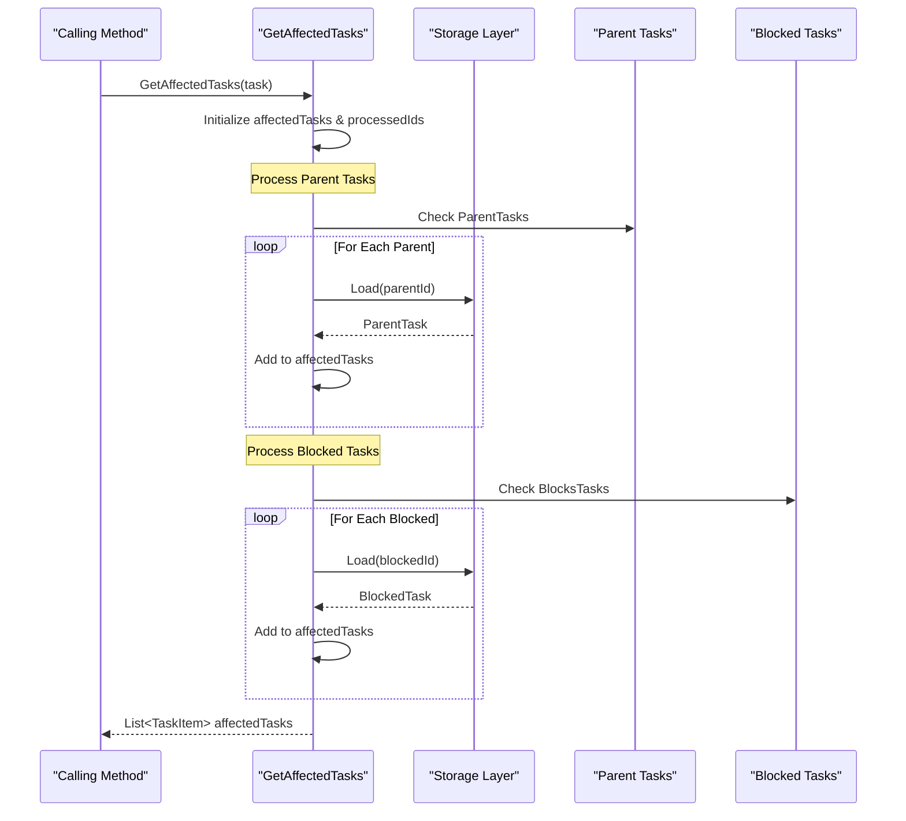

# Availability Calculation Propagation

<cite>
**Referenced Files in This Document**
- [TaskTreeManager.cs](file://src/Unlimotion.TaskTreeManager/TaskTreeManager.cs)
- [ITaskTreeManager.cs](file://src/Unlimotion.TaskTreeManager/ITaskTreeManager.cs)
- [TaskItem.cs](file://src/Unlimotion.Domain/TaskItem.cs)
- [TaskAvailabilityCalculationTests.cs](file://src/Unlimotion.Test/TaskAvailabilityCalculationTests.cs)
- [AutoUpdatingDictionary.cs](file://src/Unlimotion.TaskTreeManager/AutoUpdatingDictionary.cs)
</cite>

## Table of Contents
1. [Introduction](#introduction)
2. [System Architecture](#system-architecture)
3. [Core Components](#core-components)
4. [Availability Calculation Mechanism](#availability-calculation-mechanism)
5. [Propagation Through Task Graph](#propagation-through-task-graph)
6. [Detailed Component Analysis](#detailed-component-analysis)
7. [Business Rules and Dependencies](#business-rules-and-dependencies)
8. [Examples and Scenarios](#examples-and-scenarios)
9. [Performance Considerations](#performance-considerations)
10. [Testing and Validation](#testing-and-validation)
11. [Conclusion](#conclusion)

## Introduction

The Unlimotion task management system implements a sophisticated availability calculation propagation mechanism that ensures consistent state across complex task networks. When a task's availability changes, the system automatically identifies and recalculates the availability of all dependent tasks, maintaining data integrity throughout the task graph.

This propagation system operates on two primary dependency types:
- **Parent-child relationships**: Tasks that contain other tasks (ParentTasks)
- **Blocking relationships**: Tasks that prevent other tasks from becoming available (BlocksTasks)

The system ensures that when a task's completion status changes, all affected tasks are recalculated according to the established business rules, preventing inconsistencies in the task availability state.

## System Architecture

The availability calculation propagation system is built around the TaskTreeManager, which serves as the central orchestrator for all task-related operations and availability calculations.

**Diagram sources**
- [TaskTreeManager.cs](file://src/Unlimotion.TaskTreeManager/TaskTreeManager.cs#L10-L15)
- [TaskItem.cs](file://src/Unlimotion.Domain/TaskItem.cs#L6-L32)

**Section sources**
- [TaskTreeManager.cs](file://src/Unlimotion.TaskTreeManager/TaskTreeManager.cs#L10-L15)
- [ITaskTreeManager.cs](file://src/Unlimotion.TaskTreeManager/ITaskTreeManager.cs#L7-L42)

## Core Components

### TaskTreeManager

The TaskTreeManager serves as the central hub for all task operations and availability calculations. It implements the ITaskTreeManager interface and provides methods for:

- Creating, updating, and deleting tasks
- Managing parent-child relationships
- Managing blocking relationships
- Calculating and propagating availability changes

### TaskItem Model

The TaskItem class defines the core data structure representing individual tasks in the system. Key properties include:

| Property | Type | Purpose | Dependency Impact |
|----------|------|---------|-------------------|
| IsCompleted | bool? | Completion status (true/false/null) | Affects availability calculation |
| IsCanBeCompleted | bool | Current availability state | Determined by business rules |
| ContainsTasks | List<string> | Child tasks | Parent tasks depend on completion |
| ParentTasks | List<string> | Parent tasks | Child tasks depend on availability |
| BlocksTasks | List<string> | Tasks blocked by this task | Blocked tasks depend on completion |
| BlockedByTasks | List<string> | Tasks blocking this task | Blocking tasks affect availability |
| UnlockedDateTime | DateTimeOffset? | When task became available | Managed during availability changes |

### AutoUpdatingDictionary

The AutoUpdatingDictionary provides efficient collection management for batch operations, ensuring that task updates are applied consistently across the propagation chain.

**Section sources**
- [TaskTreeManager.cs](file://src/Unlimotion.TaskTreeManager/TaskTreeManager.cs#L10-L15)
- [TaskItem.cs](file://src/Unlimotion.Domain/TaskItem.cs#L6-L32)
- [AutoUpdatingDictionary.cs](file://src/Unlimotion.TaskTreeManager/AutoUpdatingDictionary.cs#L5-L27)

## Availability Calculation Mechanism

### Business Rules

The system implements two fundamental business rules for determining task availability:

1. **All contained tasks must be completed**: A parent task cannot become available until all its child tasks are completed
2. **All blocking tasks must be completed**: A task cannot become available until all tasks blocking it are completed

### CalculateAndUpdateAvailability Method

The primary method for triggering availability recalculation, this method orchestrates the entire propagation process:

**Diagram sources**
- [TaskTreeManager.cs](file://src/Unlimotion.TaskTreeManager/TaskTreeManager.cs#L620-L649)

### CalculateAvailabilityForTask Method

This internal method performs the actual availability calculation for a single task:

**Diagram sources**
- [TaskTreeManager.cs](file://src/Unlimotion.TaskTreeManager/TaskTreeManager.cs#L651-L712)

**Section sources**
- [TaskTreeManager.cs](file://src/Unlimotion.TaskTreeManager/TaskTreeManager.cs#L620-L712)

## Propagation Through Task Graph

### GetAffectedTasks Method

The GetAffectedTasks method identifies all tasks that depend on the current task's state change:

**Diagram sources**
- [TaskTreeManager.cs](file://src/Unlimotion.TaskTreeManager/TaskTreeManager.cs#L714-L754)

### Propagation Types

The system handles two distinct types of propagation:

#### 1. Upward Propagation (Parent Tasks)
When a child task completes, all parent tasks must recalculate their availability. This ensures that parent tasks only become available when all their contained tasks are completed.

#### 2. Forward Propagation (Blocked Tasks)
When a blocking task completes, all tasks it blocks must recalculate their availability. This ensures that tasks only become available when all blocking dependencies are satisfied.

**Section sources**
- [TaskTreeManager.cs](file://src/Unlimotion.TaskTreeManager/TaskTreeManager.cs#L714-L754)

## Detailed Component Analysis

### Relationship Management Methods

The system provides several methods for managing task relationships, each triggering appropriate availability recalculations:

#### Parent-Child Relationships
- **CreateParentChildRelation**: Establishes parent-child relationships and recalculates parent availability
- **BreakParentChildRelation**: Removes parent-child relationships and recalculates affected parent availability

#### Blocking Relationships  
- **CreateBlockingBlockedByRelation**: Creates blocking relationships and recalculates blocked task availability
- **BreakBlockingBlockedByRelation**: Removes blocking relationships and recalculates affected blocked task availability

### Update Operations

When tasks are updated, the system intelligently determines whether availability recalculation is needed:

**Diagram sources**
- [TaskTreeManager.cs](file://src/Unlimotion.TaskTreeManager/TaskTreeManager.cs#L250-L275)

**Section sources**
- [TaskTreeManager.cs](file://src/Unlimotion.TaskTreeManager/TaskTreeManager.cs#L447-L527)
- [TaskTreeManager.cs](file://src/Unlimotion.TaskTreeManager/TaskTreeManager.cs#L560-L601)

## Business Rules and Dependencies

### Availability Calculation Rules

The system enforces strict business rules for task availability:

| Condition | Availability Status | Action |
|-----------|-------------------|---------|
| All contained tasks completed AND all blocking tasks completed | Available (IsCanBeCompleted = true) | Set UnlockedDateTime |
| Any contained task incomplete OR any blocking task incomplete | Blocked (IsCanBeCompleted = false) | Clear UnlockedDateTime |
| Mixed state (some contained tasks completed, some incomplete) | Blocked | Clear UnlockedDateTime |

### Dependency Relationships

The system maintains bidirectional relationships between tasks:

**Diagram sources**
- [TaskItem.cs](file://src/Unlimotion.Domain/TaskItem.cs#L18-L25)

**Section sources**
- [TaskTreeManager.cs](file://src/Unlimotion.TaskTreeManager/TaskTreeManager.cs#L651-L712)
- [TaskItem.cs](file://src/Unlimotion.Domain/TaskItem.cs#L18-L25)

## Examples and Scenarios

### Scenario 1: Completing a Child Task

When a child task completes, its parent task's availability is recalculated:

**Diagram sources**
- [TaskTreeManager.cs](file://src/Unlimotion.TaskTreeManager/TaskTreeManager.cs#L250-L275)
- [TaskAvailabilityCalculationTests.cs](file://src/Unlimotion.Test\TaskAvailabilityCalculationTests.cs#L386-L420)

### Scenario 2: Unblocking a Task

When a blocking task completes, all blocked tasks are recalculated:

**Diagram sources**
- [TaskTreeManager.cs](file://src/Unlimotion.TaskTreeManager\TaskTreeManager.cs#L560-L601)

### Scenario 3: Complex Nested Dependencies

In complex task hierarchies with multiple levels of dependencies:

When SubChild completes:
1. Child1 recalculates (becomes available)
2. Parent recalculates (still blocked by Blocker1)
3. GrandParent remains blocked (still blocked by Parent)

**Section sources**
- [TaskAvailabilityCalculationTests.cs](file://src\Unlimotion.Test\TaskAvailabilityCalculationTests.cs#L386-L420)
- [TaskAvailabilityCalculationTests.cs](file://src\Unlimotion.Test\TaskAvailabilityCalculationTests.cs#L593-L624)

## Performance Considerations

### Batch Operations

The system uses the AutoUpdatingDictionary to batch multiple task updates, reducing the number of storage operations and improving performance during propagation.

### Lazy Loading

Tasks are loaded from storage only when needed, reducing memory usage and improving performance for large task graphs.

### Prevention of Infinite Loops

The GetAffectedTasks method uses a HashSet to track processed task IDs, preventing infinite loops in complex dependency graphs with circular references.

### Retry Logic

The IsCompletedAsync method provides retry logic with exponential backoff for handling concurrent modifications and ensuring consistency.

**Section sources**
- [AutoUpdatingDictionary.cs](file://src\Unlimotion.TaskTreeManager\AutoUpdatingDictionary.cs#L5-L27)
- [TaskTreeManager.cs](file://src\Unlimotion.TaskTreeManager\TaskTreeManager.cs#L602-L619)

## Testing and Validation

The system includes comprehensive unit tests that validate various propagation scenarios:

### Test Categories

1. **Basic Availability Tests**: Simple parent-child relationships
2. **Blocking Relationship Tests**: Tasks with blocking dependencies  
3. **Complex Propagation Tests**: Multi-level dependency chains
4. **Edge Case Tests**: Null values, archived tasks, mixed states
5. **Relationship Management Tests**: Adding, removing, and modifying relationships

### Key Test Scenarios

| Test Category | Focus Area | Validation Points |
|---------------|------------|-------------------|
| Basic Availability | Simple parent-child | Task becomes available when child completes |
| Blocking Relationships | Blocked tasks | Task becomes available when blocker completes |
| Complex Propagation | Multi-level dependencies | Correct upward and forward propagation |
| Edge Cases | Null states | Proper handling of null IsCompleted values |
| Relationship Changes | Dynamic modifications | Correct recalculation after relationship changes |

**Section sources**
- [TaskAvailabilityCalculationTests.cs](file://src\Unlimotion.Test\TaskAvailabilityCalculationTests.cs#L15-L718)

## Conclusion

The availability calculation propagation system in Unlimotion provides a robust and efficient mechanism for maintaining consistent state across complex task networks. Through the CalculateAndUpdateAvailability and GetAffectedTasks methods, the system ensures that:

1. **Consistency**: All dependent tasks are recalculated when a task's availability changes
2. **Efficiency**: Propagation is optimized to minimize unnecessary calculations
3. **Reliability**: Comprehensive testing ensures correct behavior across all scenarios
4. **Scalability**: The system handles complex dependency graphs with multiple levels of relationships

The separation of business logic into the TaskTreeManager, combined with the clear definition of dependency relationships, creates a maintainable and testable architecture that supports the complex requirements of modern task management systems.

This propagation mechanism is essential for maintaining data integrity in applications where task dependencies are dynamic and complex, ensuring that users always see accurate availability information regardless of how tasks are organized or modified.