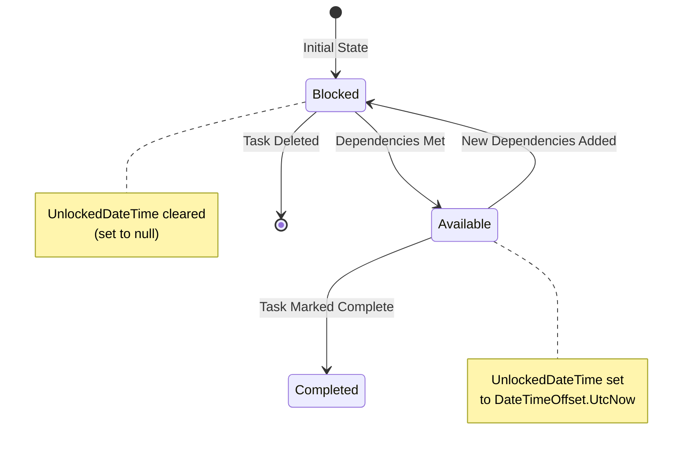
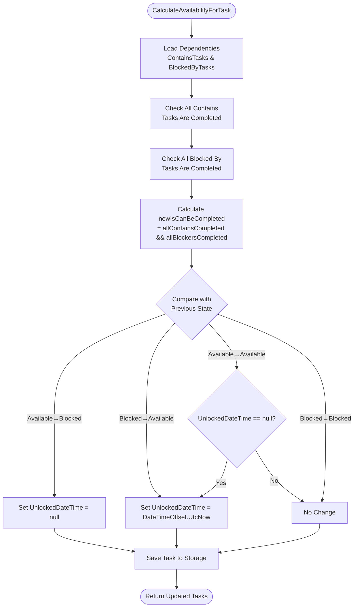
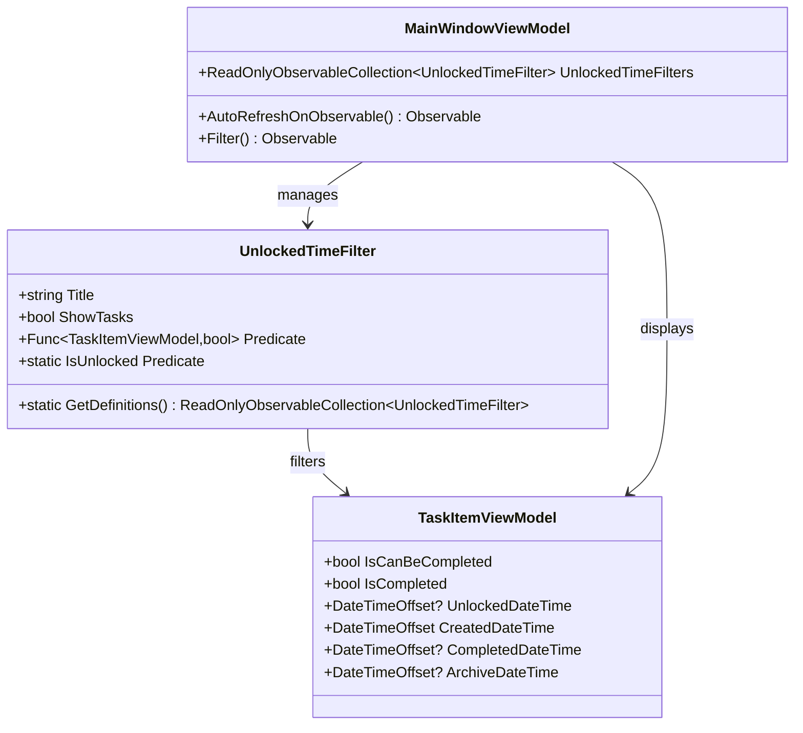
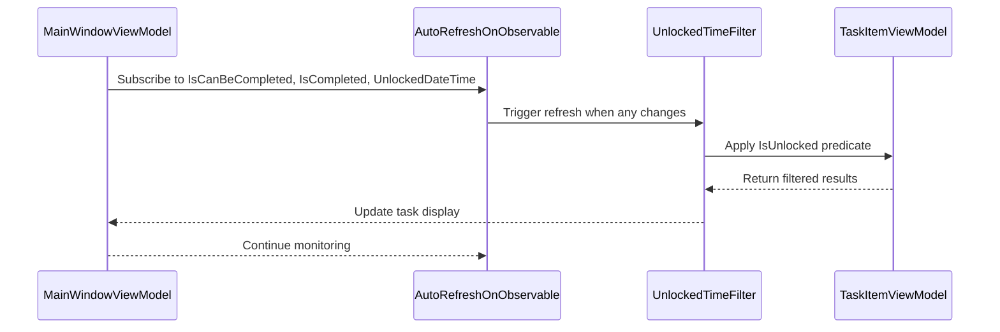
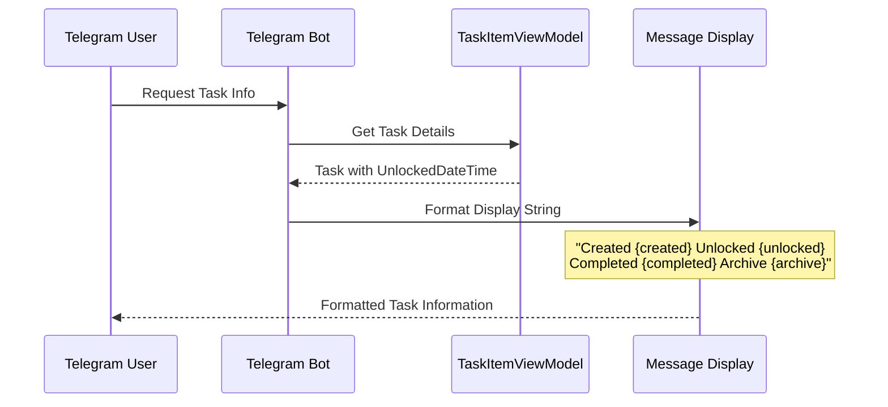

# Availability State Transitions and UnlockedDateTime

<cite>
**Referenced Files in This Document**
- [TaskItem.cs](file://src/Unlimotion.Domain/TaskItem.cs)
- [TaskTreeManager.cs](file://src/Unlimotion.TaskTreeManager/TaskTreeManager.cs)
- [TaskAvailabilityCalculationTests.cs](file://src/Unlimotion.Test\TaskAvailabilityCalculationTests.cs)
- [UnlockedTimeFilter.cs](file://src\Unlimotion.ViewModel\UnlockedTimeFilter.cs)
- [MainWindowViewModel.cs](file://src\Unlimotion.ViewModel\MainWindowViewModel.cs)
- [Bot.cs](file://src\Unlimotion.TelegramBot\Bot.cs)
- [TaskItemHubMold.cs](file://src\Unlimotion.Interface\TaskItemHubMold.cs)
</cite>

## Table of Contents
1. [Introduction](#introduction)
2. [Core Concepts](#core-concepts)
3. [State Transition Logic](#state-transition-logic)
4. [Implementation Details](#implementation-details)
5. [View Integration](#view-integration)
6. [Testing and Validation](#testing-and-validation)
7. [Usage Examples](#usage-examples)
8. [Best Practices](#best-practices)
9. [Troubleshooting](#troubleshooting)

## Introduction

The UnlockedDateTime field serves as a critical timestamp marker in the Unlimotion task management system, tracking when tasks become available for completion. This field plays a central role in the task availability state machine, automatically recording precise timestamps when tasks transition between available and blocked states. The system implements sophisticated logic to manage this field based on complex dependency relationships between tasks.

## Core Concepts

### Task Availability States

The task availability system operates on two primary states:
- **Available (IsCanBeCompleted = true)**: Task can be marked as completed
- **Blocked (IsCanBeCompleted = false)**: Task cannot be completed due to dependencies

### UnlockedDateTime Purpose

The UnlockedDateTime field captures the exact moment when a task transitions to the available state, providing valuable insights into task readiness and helping users identify recently available tasks.

**Diagram sources**
- [TaskTreeManager.cs](file://src\Unlimotion.TaskTreeManager\TaskTreeManager.cs#L695-L705)

## State Transition Logic

### Transition Conditions

The system implements precise conditions for managing the UnlockedDateTime field during state transitions:

#### When IsCanBeCompleted transitions from false to true:
- **Condition**: `newIsCanBeCompleted && (!previousIsCanBeCompleted || task.UnlockedDateTime == null)`
- **Action**: Set `UnlockedDateTime = DateTimeOffset.UtcNow`
- **Purpose**: Records when the task became available for completion

#### When IsCanBeCompleted transitions from true to false:
- **Condition**: `!newIsCanBeCompleted && previousIsCanBeCompleted`
- **Action**: Set `UnlockedDateTime = null`
- **Purpose**: Clears the timestamp when the task becomes blocked again

#### When IsCanBeCompleted remains true but had no timestamp:
- **Condition**: `newIsCanBeCompleted && task.UnlockedDateTime == null`
- **Action**: Set `UnlockedDateTime = DateTimeOffset.UtcNow`
- **Purpose**: Ensures newly available tasks receive a timestamp even if they were previously available

**Section sources**
- [TaskTreeManager.cs](file://src\Unlimotion.TaskTreeManager\TaskTreeManager.cs#L695-L705)

## Implementation Details

### CalculateAvailabilityForTask Method

The core availability calculation method implements the state transition logic:

**Diagram sources**
- [TaskTreeManager.cs](file://src\Unlimotion.TaskTreeManager\TaskTreeManager.cs#L640-L705)

### Dependency Resolution Algorithm

The system evaluates task availability based on comprehensive dependency checking:

1. **Contained Tasks Check**: Verifies all child tasks are completed or archived
2. **Blocking Tasks Check**: Confirms all blocking tasks are completed
3. **Archived Status Handling**: Treats archived tasks (IsCompleted = null) as completed for availability calculations

**Section sources**
- [TaskTreeManager.cs](file://src\Unlimotion.TaskTreeManager\TaskTreeManager.cs#L640-L680)

## View Integration

### UnlockedTimeFilter Implementation

The UnlockedTimeFilter class provides specialized filtering capabilities using the UnlockedDateTime field:

**Diagram sources**
- [UnlockedTimeFilter.cs](file://src\Unlimotion.ViewModel\UnlockedTimeFilter.cs#L8-L57)
- [MainWindowViewModel.cs](file://src\Unlimotion.ViewModel\MainWindowViewModel.cs#L385-L410)

### Automatic Refresh Mechanism

The UI system automatically refreshes when UnlockedDateTime changes:

**Diagram sources**
- [MainWindowViewModel.cs](file://src\Unlimotion.ViewModel\MainWindowViewModel.cs#L473-L503)

**Section sources**
- [MainWindowViewModel.cs](file://src\Unlimotion.ViewModel\MainWindowViewModel.cs#L385-L410)

## Testing and Validation

### Comprehensive Test Coverage

The system includes extensive unit tests validating UnlockedDateTime behavior:

#### Test Scenarios

1. **Task Becomes Available**: Validates timestamp creation when task transitions from blocked to available
2. **Task Becomes Blocked**: Ensures timestamp clearing when task becomes unavailable
3. **No State Change**: Confirms timestamp remains unchanged for unchanged states
4. **Initial Availability**: Tests timestamp assignment for newly created tasks

#### Validation Patterns

The tests verify:
- Timestamp precision using `DateTimeOffset.UtcNow`
- Null handling for initial states
- State transition correctness
- Edge case scenarios

**Section sources**
- [TaskAvailabilityCalculationTests.cs](file://src\Unlimotion.Test\TaskAvailabilityCalculationTests.cs#L230-L280)

## Usage Examples

### Telegram Bot Integration

The Telegram bot demonstrates practical usage of UnlockedDateTime in task display:

**Diagram sources**
- [Bot.cs](file://src\Unlimotion.TelegramBot\Bot.cs#L275-L285)

### Real-world Applications

1. **Task Discovery**: Recently unlocked tasks appear as candidates for immediate action
2. **Productivity Tracking**: Time-based analytics on task readiness
3. **Workflow Analysis**: Identifying bottlenecks in task dependencies
4. **User Guidance**: Highlighting tasks ready for completion

**Section sources**
- [Bot.cs](file://src\Unlimotion.TelegramBot\Bot.cs#L275-L285)

## Best Practices

### Field Management Guidelines

1. **Initialization**: Always initialize UnlockedDateTime to null for new tasks
2. **Timestamp Precision**: Use `DateTimeOffset.UtcNow` for accurate time recording
3. **Null Handling**: Properly handle null values in conditional logic
4. **State Consistency**: Ensure UnlockedDateTime reflects current availability state

### Performance Considerations

- **Minimal Storage Overhead**: Nullable field reduces storage requirements
- **Efficient Queries**: Index UnlockedDateTime for time-based filtering
- **Batch Operations**: Group state changes to minimize database writes

### Error Prevention

- **Boundary Checks**: Validate timestamp ranges and logical consistency
- **Concurrency Handling**: Implement proper locking for concurrent updates
- **Data Integrity**: Maintain referential integrity with related task fields

## Troubleshooting

### Common Issues

#### UnlockedDateTime Not Updating
**Symptoms**: Timestamp remains null despite task becoming available
**Causes**: 
- Incorrect dependency resolution
- Storage save failures
- Threading issues

**Solutions**:
- Verify dependency relationships
- Check storage operation success
- Review thread safety mechanisms

#### Timestamp Inconsistencies
**Symptoms**: UnlockedDateTime shows incorrect values
**Causes**:
- Race conditions in state transitions
- Manual timestamp manipulation
- Storage corruption

**Solutions**:
- Implement proper synchronization
- Disable manual timestamp modification
- Regular data integrity checks

### Debugging Strategies

1. **Log State Changes**: Track all availability state transitions
2. **Verify Dependencies**: Confirm dependency resolution accuracy
3. **Monitor Storage**: Ensure successful persistence operations
4. **Validate UI Updates**: Check automatic refresh mechanisms

**Section sources**
- [TaskTreeManager.cs](file://src\Unlimotion.TaskTreeManager\TaskTreeManager.cs#L695-L705)