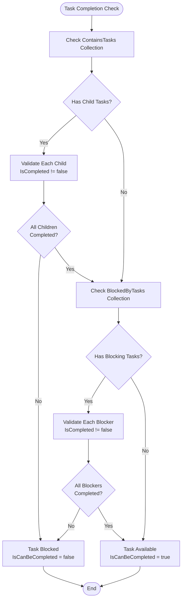
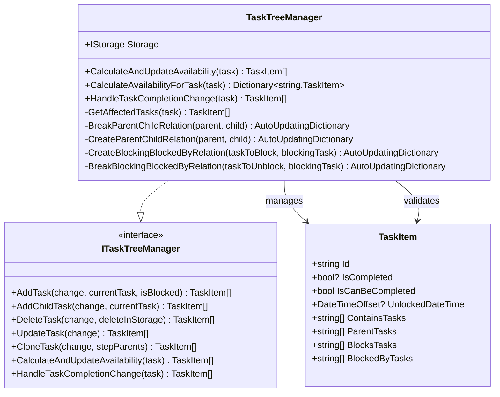
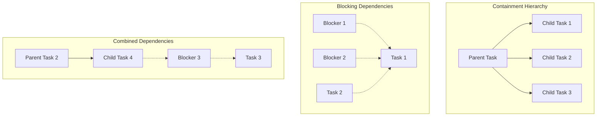
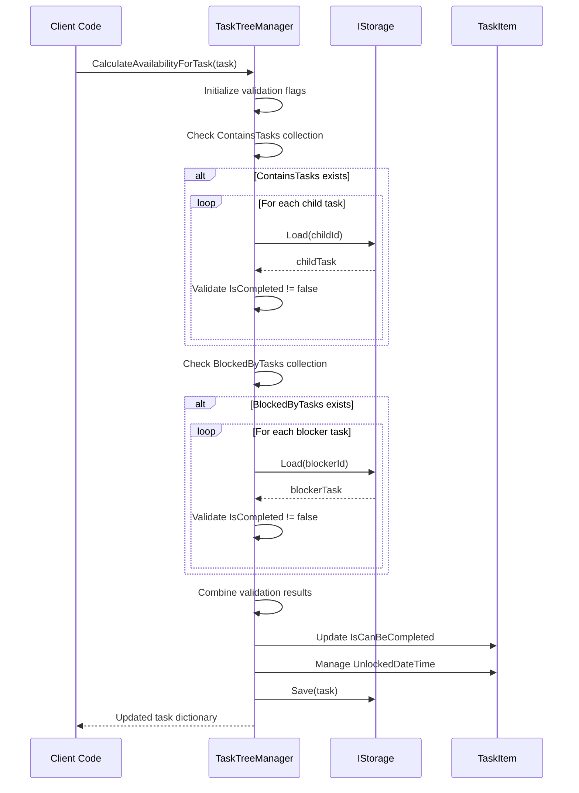
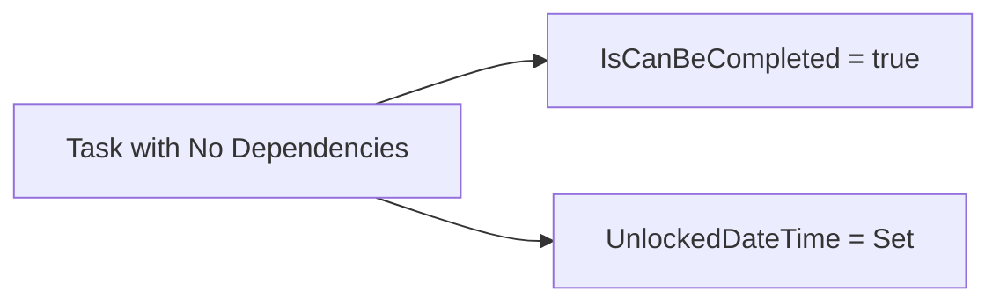
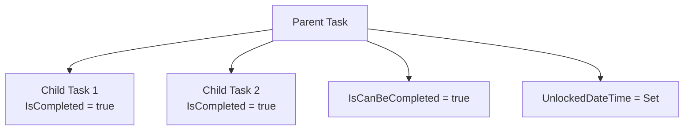
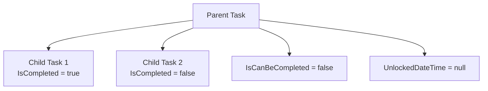
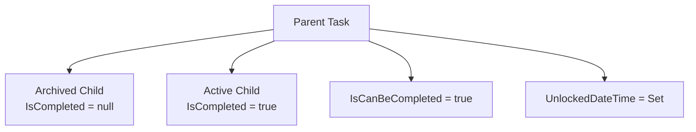
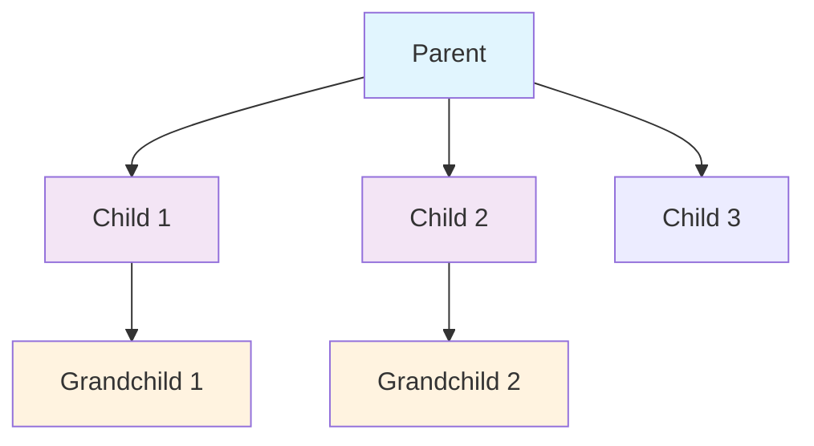

# IsCanBeCompleted Business Rules

<cite>
**Referenced Files in This Document**
- [TaskTreeManager.cs](file://src/Unlimotion.TaskTreeManager/TaskTreeManager.cs)
- [TaskAvailabilityCalculationTests.cs](file://src/Unlimotion.Test/TaskAvailabilityCalculationTests.cs)
- [TaskCompletionChangeTests.cs](file://src/Unlimotion.Test/TaskCompletionChangeTests.cs)
- [TaskItem.cs](file://src/Unlimotion.Domain/TaskItem.cs)
- [ITaskTreeManager.cs](file://src/Unlimotion.TaskTreeManager/ITaskTreeManager.cs)
- [IMPLEMENTATION_SUMMARY.md](file://IMPLEMENTATION_SUMMARY.md)
</cite>

## Table of Contents
1. [Introduction](#introduction)
2. [Core Business Rules](#core-business-rules)
3. [System Architecture](#system-architecture)
4. [Implementation Details](#implementation-details)
5. [Dependency Types](#dependency-types)
6. [Availability Calculation Process](#availability-calculation-process)
7. [State Management](#state-management)
8. [Unit Test Examples](#unit-test-examples)
9. [Edge Cases and Special Scenarios](#edge-cases-and-special-scenarios)
10. [Performance Considerations](#performance-considerations)
11. [Troubleshooting Guide](#troubleshooting-guide)
12. [Conclusion](#conclusion)

## Introduction

The IsCanBeCompleted property represents a fundamental business rule in the Unlimotion task management system that determines whether a task can be marked as completed. This property enforces strict hierarchical containment and dependency blocking constraints, ensuring that tasks are only considered ready for completion when all their constituent parts and blocking dependencies meet specific criteria.

Unlike simple completion status, IsCanBeCompleted evaluates complex relationships between tasks, considering both parent-child hierarchies and blocking dependencies. This sophisticated system prevents premature task completion while maintaining flexibility for various task management scenarios.

## Core Business Rules

The IsCanBeCompleted property operates under two primary business rules that must both be satisfied for a task to become completable:

### Rule 1: Hierarchical Containment Validation
**All contained tasks must be completed (IsCompleted != false)**

This rule ensures that any task containing subtasks cannot be completed until all its child tasks have reached a completed state. The system considers three possible completion states for child tasks:
- **true**: Task is actively completed
- **null**: Task is archived (inactive)
- **false**: Task is actively incomplete

Only actively incomplete tasks (IsCompleted == false) prevent a parent task from becoming available for completion.

### Rule 2: Blocking Dependencies Validation  
**All blocking tasks must be completed (IsCompleted != false)**

This rule ensures that any task blocked by other tasks cannot be completed until all its blocking dependencies are resolved. Similar to containment validation, only actively incomplete blocking tasks prevent completion.

**Diagram sources**
- [TaskTreeManager.cs](file://src/Unlimotion.TaskTreeManager/TaskTreeManager.cs#L651-L712)

**Section sources**
- [TaskTreeManager.cs](file://src/Unlimotion.TaskTreeManager/TaskTreeManager.cs#L651-L712)
- [IMPLEMENTATION_SUMMARY.md](file://IMPLEMENTATION_SUMMARY.md#L84-L93)

## System Architecture

The IsCanBeCompleted business logic is centralized within the TaskTreeManager class, which serves as the single source of truth for task availability calculations. This architecture promotes consistency, maintainability, and reusability across all system components.

**Diagram sources**
- [TaskTreeManager.cs](file://src/Unlimotion.TaskTreeManager/TaskTreeManager.cs#L10-L837)
- [ITaskTreeManager.cs](file://src/Unlimotion.TaskTreeManager/ITaskTreeManager.cs#L6-L42)
- [TaskItem.cs](file://src/Unlimotion.Domain/TaskItem.cs#L5-L32)

**Section sources**
- [TaskTreeManager.cs](file://src/Unlimotion.TaskTreeManager/TaskTreeManager.cs#L10-L20)
- [ITaskTreeManager.cs](file://src/Unlimotion.TaskTreeManager/ITaskTreeManager.cs#L6-L42)

## Implementation Details

The CalculateAvailabilityForTask method serves as the core engine for IsCanBeCompleted evaluation, implementing the business rules through a systematic validation process.

### Method Signature and Parameters
The method accepts a TaskItem parameter and returns a dictionary containing the updated task along with any affected related tasks. This design enables cascading updates throughout the task tree when availability changes occur.

### Validation Logic Flow

The validation process follows a structured approach:

1. **Initialization**: Sets flags for containment and blocking validation
2. **Containment Validation**: Iterates through ContainsTasks collection
3. **Blocking Validation**: Iterates through BlockedByTasks collection  
4. **Final Evaluation**: Combines validation results
5. **State Management**: Updates IsCanBeCompleted and UnlockedDateTime properties

### Key Implementation Patterns

#### Early Termination
The validation process implements early termination for optimal performance. Once an incomplete task is detected in either collection, the loop terminates immediately, preventing unnecessary database reads.

#### Null Safety
The implementation includes comprehensive null safety checks for both ContainsTasks and BlockedByTasks collections, ensuring robust operation even with incomplete task relationships.

#### Atomic Updates
All state changes occur within a single transaction-like operation, maintained through the AutoUpdatingDictionary pattern, ensuring consistency across related tasks.

**Section sources**
- [TaskTreeManager.cs](file://src/Unlimotion.TaskTreeManager/TaskTreeManager.cs#L651-L712)

## Dependency Types

The system recognizes two distinct types of task dependencies that influence IsCanBeCompleted evaluation:

### Containment Dependencies (Hierarchical)
Containment relationships represent parent-child hierarchies where parent tasks depend on their child tasks for completion.

| Property | Purpose | Validation Criteria |
|----------|---------|-------------------|
| ContainsTasks | Lists child task IDs | All must have IsCompleted != false |
| ParentTasks | Lists parent task IDs | Automatically maintained during containment operations |

### Blocking Dependencies (Sequential)
Blocking relationships represent sequential dependencies where tasks depend on other tasks for prerequisite completion.

| Property | Purpose | Validation Criteria |
|----------|---------|-------------------|
| BlockedByTasks | Lists blocking task IDs | All must have IsCompleted != false |
| BlocksTasks | Lists blocked task IDs | Automatically maintained during blocking operations |

**Diagram sources**
- [TaskTreeManager.cs](file://src/Unlimotion.TaskTreeManager/TaskTreeManager.cs#L665-L690)

**Section sources**
- [TaskItem.cs](file://src/Unlimotion.Domain/TaskItem.cs#L18-L22)
- [TaskTreeManager.cs](file://src/Unlimotion.TaskTreeManager/TaskTreeManager.cs#L665-L690)

## Availability Calculation Process

The availability calculation process involves multiple interconnected steps that ensure comprehensive validation of task dependencies.

### Step 1: Initial Validation Setup
The process begins by initializing validation flags and checking for the presence of dependency collections. This step establishes the foundation for subsequent evaluations.

### Step 2: Containment Validation Phase
During this phase, the system iterates through all child tasks listed in the ContainsTasks collection. For each child task, the system performs the following operations:

1. **Load Child Task**: Retrieves the child task from storage
2. **Validate Completion Status**: Checks if IsCompleted is false
3. **Update Validation Flag**: Sets allContainsCompleted to false if any child is incomplete
4. **Early Termination**: Breaks the loop upon detecting the first incomplete child

### Step 3: Blocking Validation Phase
Similar to containment validation, this phase examines all blocking tasks listed in the BlockedByTasks collection:

1. **Load Blocking Task**: Retrieves the blocking task from storage
2. **Validate Completion Status**: Checks if IsCompleted is false
3. **Update Validation Flag**: Sets allBlockersCompleted to false if any blocker is incomplete
4. **Early Termination**: Breaks the loop upon detecting the first incomplete blocker

### Step 4: Final Evaluation and State Management
The final step combines the results of both validation phases and manages the task's availability state:

**Diagram sources**
- [TaskTreeManager.cs](file://src/Unlimotion.TaskTreeManager/TaskTreeManager.cs#L651-L712)

**Section sources**
- [TaskTreeManager.cs](file://src/Unlimotion.TaskTreeManager/TaskTreeManager.cs#L651-L712)

## State Management

The IsCanBeCompleted property works in conjunction with several related properties to maintain comprehensive task state information.

### Related Properties

| Property | Type | Purpose | Relationship |
|----------|------|---------|-------------|
| IsCompleted | bool? | Actual completion status | null = archived, true = completed, false = active |
| IsCanBeCompleted | bool | Availability for completion | Determined by dependency validation |
| UnlockedDateTime | DateTimeOffset? | Timestamp when task became available | Set when IsCanBeCompleted becomes true |
| CompletedDateTime | DateTimeOffset? | Timestamp when task was completed | Set when IsCompleted becomes true |

### State Transition Logic

The system implements sophisticated state transitions that handle various scenarios:

#### From Blocked to Available
When a task transitions from blocked to available state:
- **IsCanBeCompleted**: Changes from false to true
- **UnlockedDateTime**: Set to current timestamp
- **Effect**: Task becomes eligible for completion

#### From Available to Blocked
When a task transitions from available to blocked state:
- **IsCanBeCompleted**: Changes from true to false  
- **UnlockedDateTime**: Cleared (set to null)
- **Effect**: Task becomes ineligible for completion

#### Archival Handling
Archived tasks (IsCompleted = null) are treated differently from incomplete tasks:
- **Containment**: Archived children do not block parent tasks
- **Blocking**: Archived blockers do not prevent completion
- **Special Case**: Only actively incomplete tasks (IsCompleted = false) trigger blocking behavior

**Section sources**
- [TaskTreeManager.cs](file://src/Unlimotion.TaskTreeManager/TaskTreeManager.cs#L685-L705)
- [TaskItem.cs](file://src/Unlimotion.Domain/TaskItem.cs#L10-L12)

## Unit Test Examples

The test suite demonstrates various scenarios that illustrate the IsCanBeCompleted business rules in action.

### Basic Scenarios

#### No Dependencies
Tasks without any containment or blocking dependencies are always available for completion:

**Diagram sources**
- [TaskAvailabilityCalculationTests.cs](file://src\Unlimotion.Test\TaskAvailabilityCalculationTests.cs#L15-L35)

#### Completed Child Task
When all child tasks are completed, parent tasks become available:

**Diagram sources**
- [TaskAvailabilityCalculationTests.cs](file://src\Unlimotion.Test\TaskAvailabilityCalculationTests.cs#L43-L65)

#### Incomplete Child Task
The presence of even one incomplete child prevents parent completion:

**Diagram sources**
- [TaskAvailabilityCalculationTests.cs](file://src\Unlimotion.Test\TaskAvailabilityCalculationTests.cs#L75-L95)

### Advanced Scenarios

#### Mixed Dependencies
Tasks with both containment and blocking dependencies require satisfaction of both conditions:

| Scenario | ContainsTasks | BlockedByTasks | IsCanBeCompleted |
|----------|---------------|----------------|------------------|
| Complete | All true | All true | true |
| Incomplete Child | One false | All true | false |
| Incomplete Blocker | All true | One false | false |
| Mixed Issues | One false | One false | false |

#### Archival Impact
Archived tasks (IsCompleted = null) do not affect availability:

**Diagram sources**
- [TaskAvailabilityCalculationTests.cs](file://src\Unlimotion.Test\TaskAvailabilityCalculationTests.cs#L105-L125)

**Section sources**
- [TaskAvailabilityCalculationTests.cs](file://src\Unlimotion.Test\TaskAvailabilityCalculationTests.cs#L15-L125)

## Edge Cases and Special Scenarios

### Nested Task Hierarchies
The system handles complex nested hierarchies where tasks contain other tasks that themselves have children:

#### Multi-Level Containment

In this scenario, the parent task is only available when all grandchildren are completed, regardless of the intermediate children's states.

### Circular Dependencies
The system prevents infinite loops through careful relationship management and validation.

### Partial Updates
When only specific dependencies change, the system efficiently recalculates affected tasks without unnecessary recomputation.

### Concurrent Modifications
The implementation includes retry mechanisms and atomic operations to handle concurrent modifications safely.

**Section sources**
- [TaskAvailabilityCalculationTests.cs](file://src\Unlimotion.Test\TaskAvailabilityCalculationTests.cs#L593-L717)

## Performance Considerations

### Optimization Strategies

#### Early Termination
The validation process implements early termination, significantly reducing computational overhead when tasks are blocked by the first incomplete dependency encountered.

#### Lazy Loading
Child and blocker tasks are loaded only when necessary, minimizing database round trips for tasks with many dependencies.

#### Cascading Updates
The system efficiently identifies and updates only affected tasks when availability changes occur, preventing unnecessary recalculations.

### Scalability Factors

| Factor | Impact | Mitigation Strategy |
|--------|--------|-------------------|
| Task Depth | Linear impact on validation time | Early termination prevents exponential growth |
| Dependency Count | Quadratic impact on validation | Efficient iteration with early exit |
| Storage Access | Database round trip overhead | Lazy loading and caching where appropriate |
| Memory Usage | Proportional to affected task count | Streaming updates reduce memory footprint |

### Performance Monitoring
Key metrics to monitor include:
- Average validation time per task
- Number of database queries per operation
- Memory usage during bulk operations
- Frequency of cascading updates

## Troubleshooting Guide

### Common Issues and Solutions

#### Task Stuck in Blocked State
**Symptoms**: Task remains unavailable despite completing dependencies
**Causes**: 
- Incorrect IsCompleted values in child/blocker tasks
- Broken task relationships
- Storage inconsistencies

**Solutions**:
1. Verify IsCompleted values match actual task states
2. Check ContainsTasks and BlockedByTasks relationships
3. Run manual availability calculation
4. Review task history for modification errors

#### Performance Degradation
**Symptoms**: Slow availability calculations with large task trees
**Causes**:
- Deep nesting of tasks
- Excessive dependency relationships
- Inefficient storage operations

**Solutions**:
1. Optimize task hierarchy structure
2. Reduce unnecessary dependencies
3. Implement caching for frequently accessed tasks
4. Consider batch processing for bulk operations

#### State Inconsistencies
**Symptoms**: Conflicting availability states across related tasks
**Causes**:
- Concurrent modification conflicts
- Incomplete cascading updates
- Storage synchronization issues

**Solutions**:
1. Implement retry mechanisms for transient failures
2. Use atomic operations for related task updates
3. Add validation checkpoints during state changes
4. Monitor for race conditions in concurrent environments

### Debugging Tools

#### Availability Calculation Tracing
Enable detailed logging to track the validation process:
- Containment validation results
- Blocking validation results  
- Final availability determination
- State change timestamps

#### Relationship Validation
Verify task relationships are correctly established:
- ContainsTasks ↔ ParentTasks consistency
- BlockedByTasks ↔ BlocksTasks symmetry
- Circular dependency detection

**Section sources**
- [TaskTreeManager.cs](file://src\Unlimotion.TaskTreeManager\TaskTreeManager.cs#L651-L712)

## Conclusion

The IsCanBeCompleted business rules represent a sophisticated yet elegant solution to complex task dependency management. By enforcing strict hierarchical containment and blocking dependency validation, the system ensures that tasks are only marked as complete when all prerequisites are truly satisfied.

Key strengths of this implementation include:

- **Comprehensive Coverage**: Handles both containment and blocking dependencies
- **Performance Optimization**: Early termination and lazy loading minimize computational overhead  
- **State Consistency**: Atomic operations maintain data integrity across related tasks
- **Flexibility**: Supports various task management scenarios including archival and repeated tasks
- **Maintainability**: Centralized logic in TaskTreeManager promotes consistency and ease of maintenance

The system successfully balances complexity with usability, providing powerful task management capabilities while maintaining intuitive behavior for end users. Future enhancements could include additional optimization strategies and expanded support for complex workflow scenarios.