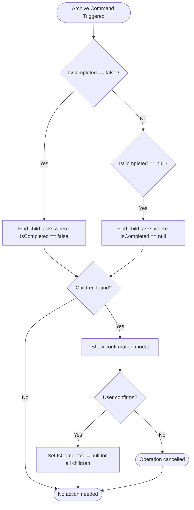
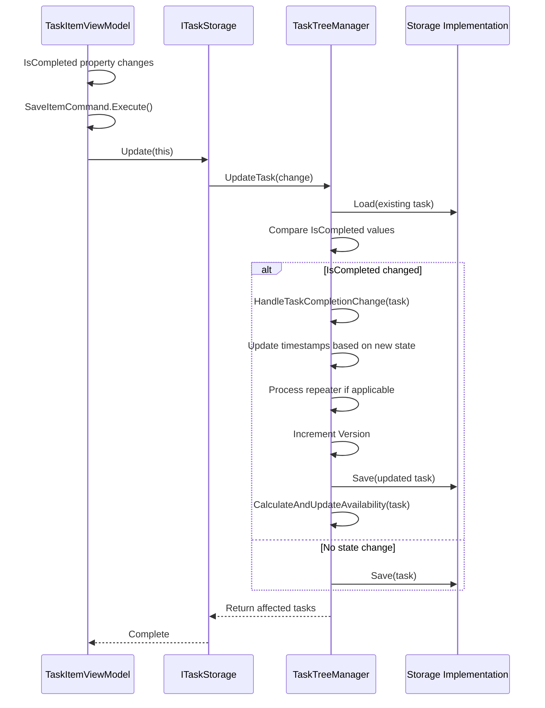
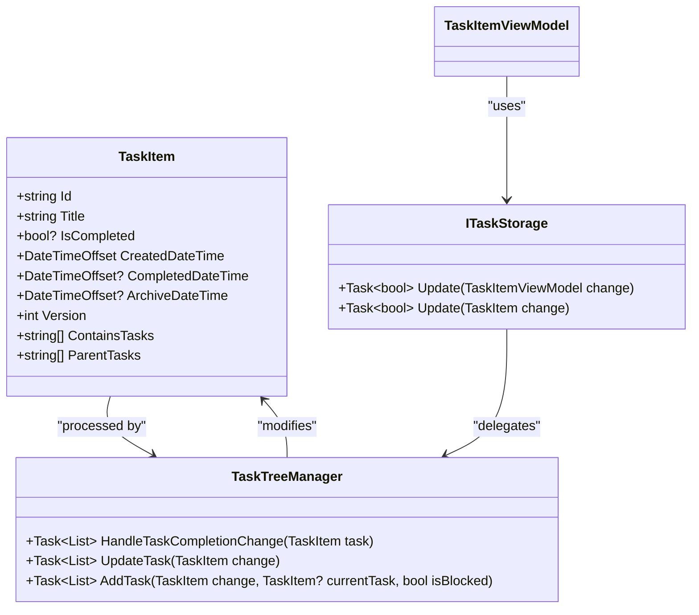

# Lifecycle Events and State Transitions

<cite>
**Referenced Files in This Document**   
- [TaskItemViewModel.cs](file://src/Unlimotion.ViewModel/TaskItemViewModel.cs)
- [TaskTreeManager.cs](file://src/Unlimotion.TaskTreeManager/TaskTreeManager.cs)
- [ITaskTreeManager.cs](file://src/Unlimotion.TaskTreeManager/ITaskTreeManager.cs)
- [TaskItem.cs](file://src/Unlimotion.Domain/TaskItem.cs)
- [FileTaskStorage.cs](file://src/Unlimotion/FileTaskStorage.cs)
- [ServerTaskStorage.cs](file://src/Unlimotion/ServerTaskStorage.cs)
- [TaskStorages.cs](file://src/Unlimotion/TaskStorages.cs)
- [FileDbWatcher.cs](file://src/Unlimotion.ViewModel/FileDbWatcher.cs)
</cite>

## Table of Contents
1. [Introduction](#introduction)
2. [Task Lifecycle Events](#task-lifecycle-events)
3. [Modal Confirmation Behavior](#modal-confirmation-behavior)
4. [Task State Transitions](#task-state-transitions)
5. [Versioning and Conflict Resolution](#versioning-and-conflict-resolution)
6. [Architecture Overview](#architecture-overview)
7. [Integration Points](#integration-points)
8. [Conclusion](#conclusion)

## Introduction
This document details the lifecycle events and state transitions within the Unlimotion task management system. The system implements a comprehensive task management model with support for creation, completion, archival, and restoration operations. The architecture separates concerns between the ViewModel layer (TaskItemViewModel) and the business logic layer (TaskTreeManager), ensuring consistent state management across the application. The system incorporates optimistic concurrency control through a versioning mechanism to handle synchronization conflicts in distributed environments.

## Task Lifecycle Events

The Unlimotion system implements a comprehensive task lifecycle with four primary states: creation, completion, archival, and restoration. Each state transition triggers specific business logic to maintain data consistency and update related entities.

Task creation occurs through the `AddTask` and `AddChildTask` methods in the `TaskTreeManager` class. When a new task is created, the system initializes the `Version` property to 1 and sets the `CreatedDateTime` to the current UTC timestamp. The `SortOrder` is also initialized to the current datetime to maintain chronological ordering.

Task completion is managed through the `IsCompleted` property, which is a nullable boolean with three possible states:
- `true`: Task is completed
- `false`: Task is active
- `null`: Task is archived

When a task transitions to the completed state (`IsCompleted = true`), the system automatically sets the `CompletedDateTime` to the current UTC timestamp and clears the `ArchiveDateTime` if previously set. This transition also triggers the `HandleTaskCompletionChange` method to process any repeater patterns and create subsequent instances if configured.

Task archival occurs when `IsCompleted` is set to `null`. The system records the `ArchiveDateTime` as the current UTC timestamp, preserving the completion history while removing the task from active views. Restoration reverses this process by setting `IsCompleted` to `false` and clearing the `ArchiveDateTime`.

**Section sources**
- [TaskTreeManager.cs](file://src/Unlimotion.TaskTreeManager/TaskTreeManager.cs#L736-L772)
- [TaskItem.cs](file://src/Unlimotion.Domain/TaskItem.cs#L15-L32)

## Modal Confirmation Behavior

The `ArchiveCommand` in `TaskItemViewModel` implements modal confirmation behavior to prevent accidental cascading state changes to child tasks. This command uses a state machine approach based on the current `IsCompleted` value to determine the appropriate action.

When a user attempts to archive a task (transition from `IsCompleted = false` to `IsCompleted = null`), the system identifies all child tasks that are not already archived (where `IsCompleted == false`). Similarly, when unarchiving a task (transition from `IsCompleted = null` to `IsCompleted = false`), the system identifies all archived child tasks (where `IsCompleted == null`).

The confirmation modal is implemented through the `ShowModalAndChangeChildrenStatuses` method, which accepts the following parameters:
- `notificationManager`: Service for displaying user notifications
- `taskName`: Title of the parent task initiating the change
- `childrenTasks`: List of child tasks affected by the cascading change
- `methodType`: Enumeration indicating whether the operation is Archive or Unarchive

The modal displays a confirmation message that includes the count of affected child tasks and the parent task's title. If the user confirms the action, the appropriate lambda function is executed to update the `IsCompleted` status of all child tasks. For archiving, all child tasks have their `IsCompleted` property set to `null`. For unarchiving, child tasks have their `IsCompleted` property set to `false`.

This confirmation mechanism prevents accidental bulk operations while maintaining the hierarchical integrity of the task tree structure.



**Diagram sources**
- [TaskItemViewModel.cs](file://src/Unlimotion.ViewModel/TaskItemViewModel.cs#L136-L171)
- [TaskItemViewModel.cs](file://src/Unlimotion.ViewModel/TaskItemViewModel.cs#L534-L573)

**Section sources**
- [TaskItemViewModel.cs](file://src/Unlimotion.ViewModel/TaskItemViewModel.cs#L136-L171)
- [TaskItemViewModel.cs](file://src/Unlimotion.ViewModel/TaskItemViewModel.cs#L534-L573)

## Task State Transitions

The integration between `TaskItemViewModel` and `TaskTreeManager` during state transitions follows a reactive pattern where changes in the ViewModel trigger corresponding business logic in the TaskTreeManager. The key state transition occurs when the `IsCompleted` property changes, which is monitored using ReactiveUI's `WhenAnyValue` subscription.

When `IsCompleted` changes, the `TaskItemViewModel` automatically executes the `SaveItemCommand`, which calls the `Update` method on the associated `ITaskStorage`. This storage implementation (either `FileTaskStorage` or `ServerTaskStorage`) then delegates to the `TaskTreeManager.UpdateTask` method.

The `UpdateTask` method in `TaskTreeManager` implements the following state transition logic:

1. Load the existing task from storage to compare the previous `IsCompleted` value
2. Determine if `IsCompleted` has changed by comparing with the previous value
3. If changed, delegate to `HandleTaskCompletionChange` for specialized processing
4. If unchanged, perform a standard update

The `HandleTaskCompletionChange` method processes three distinct state transitions:

**Completion (IsCompleted = true):**
- Sets `CompletedDateTime` to current UTC time if not already set
- Clears `ArchiveDateTime`
- Processes repeater patterns by creating a new instance with updated dates
- Increments the `Version` property
- Saves the updated task

**Uncompletion (IsCompleted = false):**
- Clears both `CompletedDateTime` and `ArchiveDateTime`
- Increments the `Version` property
- Saves the updated task

**Archival (IsCompleted = null):**
- Sets `ArchiveDateTime` to current UTC time if not already set
- Clears `CompletedDateTime`
- Increments the `Version` property
- Saves the updated task

After any state change, the system recalculates availability for the affected task and all dependent tasks through the `CalculateAndUpdateAvailability` method, which updates the `IsCanBeCompleted` property based on whether all child tasks and blocking tasks are completed.



**Diagram sources**
- [TaskItemViewModel.cs](file://src/Unlimotion.ViewModel/TaskItemViewModel.cs#L102-L139)
- [TaskTreeManager.cs](file://src/Unlimotion.TaskTreeManager/TaskTreeManager.cs#L248-L284)
- [TaskTreeManager.cs](file://src/Unlimotion.TaskTreeManager/TaskTreeManager.cs#L736-L772)

**Section sources**
- [TaskItemViewModel.cs](file://src/Unlimotion.ViewModel/TaskItemViewModel.cs#L102-L139)
- [TaskTreeManager.cs](file://src/Unlimotion.TaskTreeManager/TaskTreeManager.cs#L248-L284)

## Versioning and Conflict Resolution

The Unlimotion system implements an optimistic concurrency control mechanism through a versioning system to handle synchronization conflicts in distributed environments. The `Version` property in the `TaskItem` class serves as the concurrency token, ensuring data consistency during concurrent modifications.

The versioning system operates as follows:

1. **Initialization**: When a new task is created, the `Version` property is initialized to 1 in the `AddTask`, `AddChildTask`, and `CloneTask` methods of `TaskTreeManager`.

2. **Incrementing**: The version number is incremented by 1 whenever a state change occurs that affects the task's completion status. This includes transitions to completed, uncompleted, or archived states in the `HandleTaskCompletionChange` method.

3. **Storage Integration**: Both `FileTaskStorage` and `ServerTaskStorage` implementations use the version number when persisting task changes. The storage layer does not perform version validation, relying on the business logic layer to manage concurrency.

4. **Synchronization**: The system uses `FileDbWatcher` to monitor file system changes and trigger updates. When multiple clients are connected, the version number helps identify which client has the most recent changes.

The conflict resolution strategy follows an optimistic approach:
- Clients work with their local copy of tasks without locking
- When saving changes, the system doesn't check for conflicts at the storage level
- The version number provides a sequential history of changes
- In case of merge conflicts (particularly with Git-based storage), the version number helps identify the most recent changes

The versioning system is particularly important for the repeater functionality, where completing a recurring task creates a new instance. The new instance starts with `Version = 1`, while the completed instance has its version incremented, maintaining a clear lineage of task instances.



**Diagram sources**
- [TaskItem.cs](file://src/Unlimotion.Domain/TaskItem.cs#L10-L32)
- [TaskTreeManager.cs](file://src/Unlimotion.TaskTreeManager/TaskTreeManager.cs#L0-L48)
- [FileTaskStorage.cs](file://src/Unlimotion/FileTaskStorage.cs#L327-L368)

**Section sources**
- [TaskItem.cs](file://src/Unlimotion.Domain/TaskItem.cs#L32)
- [TaskTreeManager.cs](file://src/Unlimotion.TaskTreeManager/TaskTreeManager.cs#L43-L80)
- [TaskTreeManager.cs](file://src/Unlimotion.TaskTreeManager/TaskTreeManager.cs#L736-L772)

## Architecture Overview

The Unlimotion task management system follows a layered architecture with clear separation of concerns between presentation, business logic, and data access layers. The architecture enables consistent state management while supporting multiple storage backends and synchronization scenarios.

The core components and their interactions are as follows:

1. **TaskItemViewModel**: The presentation layer component that exposes task properties and commands to the UI. It implements reactive patterns to automatically save changes and handle user interactions.

2. **ITaskStorage**: The abstraction layer that defines the contract for task persistence operations. This interface is implemented by both `FileTaskStorage` and `ServerTaskStorage` to support different deployment scenarios.

3. **TaskTreeManager**: The business logic layer that encapsulates all rules for task relationships, state transitions, and availability calculations. This component ensures consistent behavior across all clients.

4. **IStorage**: The data access abstraction that allows the `TaskTreeManager` to work with different storage implementations without coupling to specific technologies.

The system uses a publish-subscribe pattern for change notification. The `FileDbWatcher` monitors file system changes and raises `OnUpdated` events, which are processed by the application to refresh the UI. This enables real-time synchronization when multiple instances are accessing the same task database.

```mermaid
graph TD
subgraph "Presentation Layer"
A[TaskItemViewModel]
B[MainWindowViewModel]
end
subgraph "Storage Abstraction"
C[ITaskStorage]
D[FileTaskStorage]
E[ServerTaskStorage]
end
subgraph "Business Logic"
F[TaskTreeManager]
end
subgraph "Data Access"
G[IStorage]
H[File System]
I[Server API]
end
subgraph "Change Notification"
J[FileDbWatcher]
K[OnUpdated Event]
end
A --> C : "Update, Delete, Add"
B --> C : "Bulk operations"
C --> F : "Delegates business logic"
F --> G : "Persists changes"
D --> H : "Reads/Writes JSON files"
E --> I : "HTTP API calls"
J --> H : "Monitors file changes"
J --> K : "Publishes events"
K --> B : "Triggers refresh"
G --> H : "Concrete implementation"
G --> I : "Concrete implementation"
style A fill:#f9f,stroke:#333
style B fill:#f9f,stroke:#333
style C fill:#bbf,stroke:#333
style D fill:#bbf,stroke:#333
style E fill:#bbf,stroke:#333
style F fill:#f96,stroke:#333
style G fill:#696,stroke:#333
style H fill:#6f9,stroke:#333
style I fill:#6f9,stroke:#333
style J fill:#999,stroke:#333
style K fill:#999,stroke:#333
```

**Diagram sources**
- [TaskItemViewModel.cs](file://src/Unlimotion.ViewModel/TaskItemViewModel.cs)
- [TaskStorages.cs](file://src/Unlimotion/TaskStorages.cs)
- [FileTaskStorage.cs](file://src/Unlimotion/FileTaskStorage.cs)
- [ServerTaskStorage.cs](file://src/Unlimotion/ServerTaskStorage.cs)
- [FileDbWatcher.cs](file://src/Unlimotion.ViewModel/FileDbWatcher.cs)

## Integration Points

The integration between `TaskItemViewModel` and `TaskTreeManager` is orchestrated through the `ITaskStorage` interface, which serves as the primary integration point between the presentation and business logic layers.

When a task's state changes, the following integration sequence occurs:

1. The `TaskItemViewModel` detects a change to the `IsCompleted` property through its reactive subscription
2. The `SaveItemCommand` is automatically executed, calling the `Update` method on the injected `ITaskStorage`
3. The storage implementation (`FileTaskStorage` or `ServerTaskStorage`) calls `TaskTreeManager.UpdateTask` with the modified task
4. `TaskTreeManager` loads the current task state and determines if `IsCompleted` has changed
5. If changed, `TaskTreeManager.HandleTaskCompletionChange` is invoked to process the state transition
6. The updated task is saved, and affected tasks are returned to the storage layer
7. The storage layer updates its internal cache and notifies subscribers of the change

The `HandleTaskCompletionChange` method is the central integration point for state transitions, coordinating multiple aspects of task management:

- **Timestamp Management**: Sets appropriate completion or archival timestamps based on the new state
- **Repeater Processing**: Creates new task instances for recurring tasks when completed
- **Version Increment**: Increases the version number to reflect the state change
- **Availability Recalculation**: Updates the `IsCanBeCompleted` status for the task and all affected parents and blocked tasks

The integration also handles cascading changes to child tasks during archival operations. When a parent task is archived or restored, the `ArchiveCommand` in `TaskItemViewModel` shows a confirmation dialog and then updates the `IsCompleted` status of all relevant child tasks, ensuring hierarchical consistency.

**Section sources**
- [TaskItemViewModel.cs](file://src/Unlimotion.ViewModel/TaskItemViewModel.cs)
- [TaskTreeManager.cs](file://src/Unlimotion.TaskTreeManager/TaskTreeManager.cs)
- [FileTaskStorage.cs](file://src/Unlimotion/FileTaskStorage.cs)

## Conclusion

The Unlimotion task management system implements a robust lifecycle management system with well-defined state transitions for task creation, completion, archival, and restoration. The architecture effectively separates concerns between presentation, business logic, and data access layers, ensuring consistent behavior across different deployment scenarios.

Key features of the system include:
- A three-state completion model (active, completed, archived) that supports complex task workflows
- Modal confirmation for cascading state changes to prevent accidental bulk operations
- Reactive integration between ViewModel and business logic layers that automatically propagates state changes
- Optimistic concurrency control through a versioning system that supports synchronization in distributed environments

The `TaskTreeManager` serves as the central authority for task state transitions, ensuring that all changes follow consistent business rules regardless of the client or storage backend. The versioning system provides a foundation for conflict resolution during synchronization, while the reactive architecture ensures that the UI remains consistent with the underlying data model.

This implementation achieves the design goals of separation of concerns, reusability, testability, consistency, and maintainability, providing a solid foundation for task management in both single-user and collaborative environments.