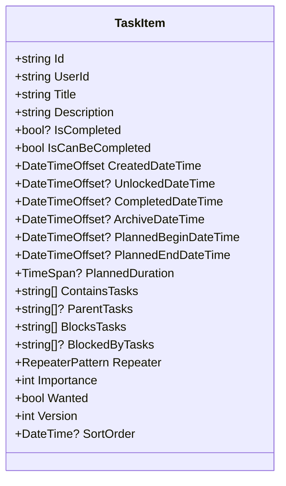
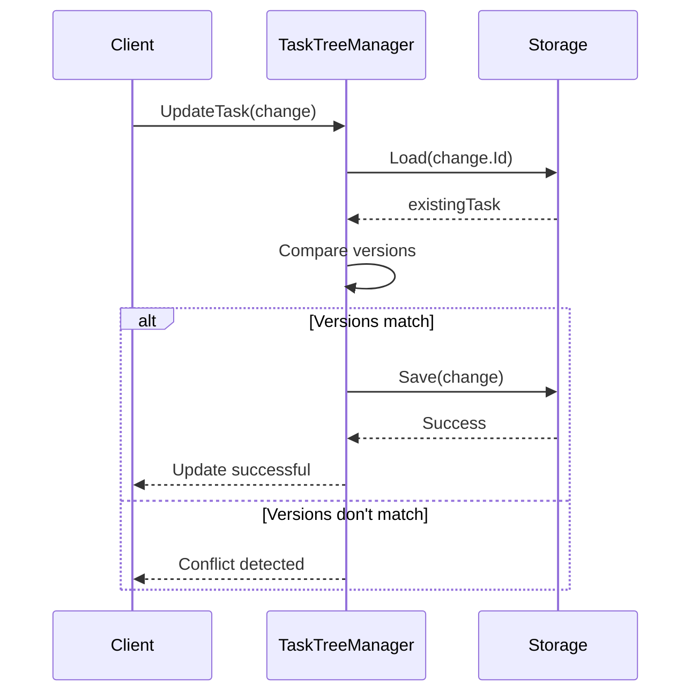
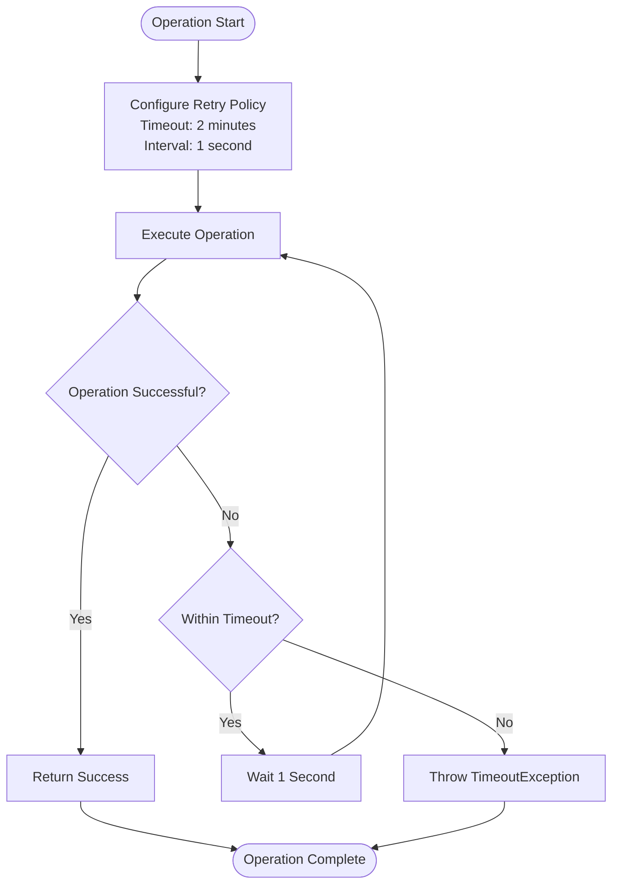
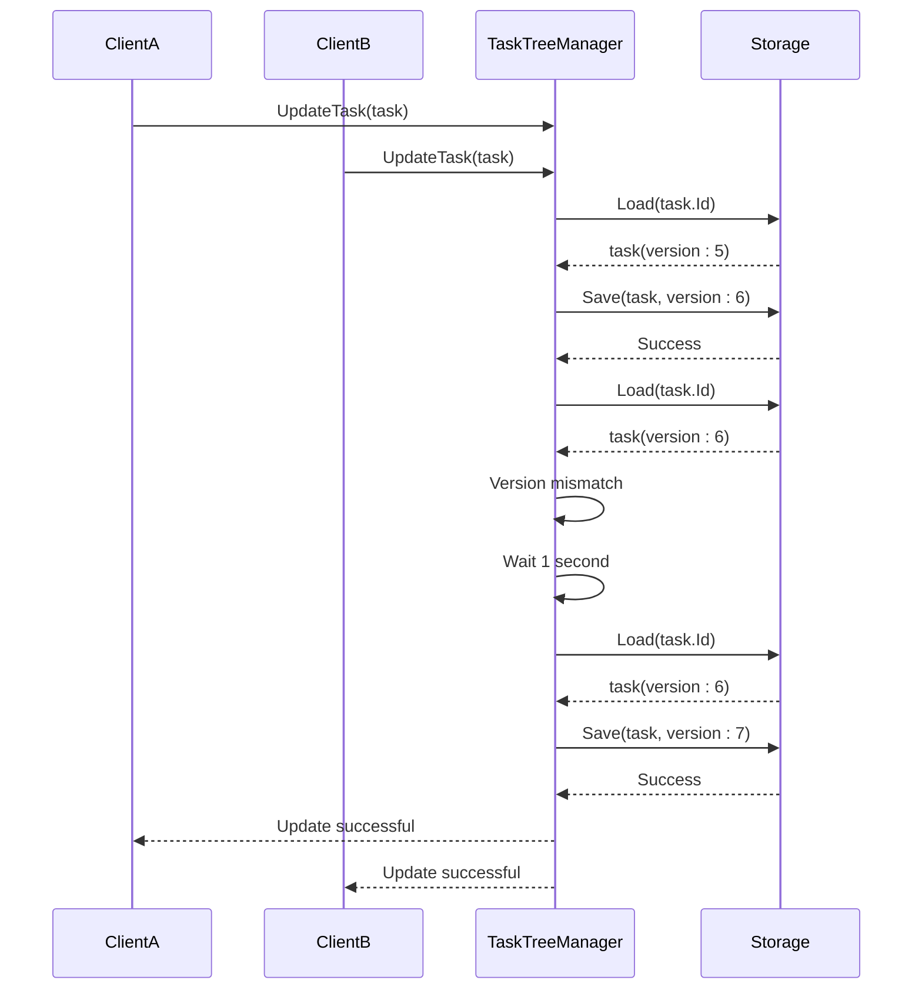
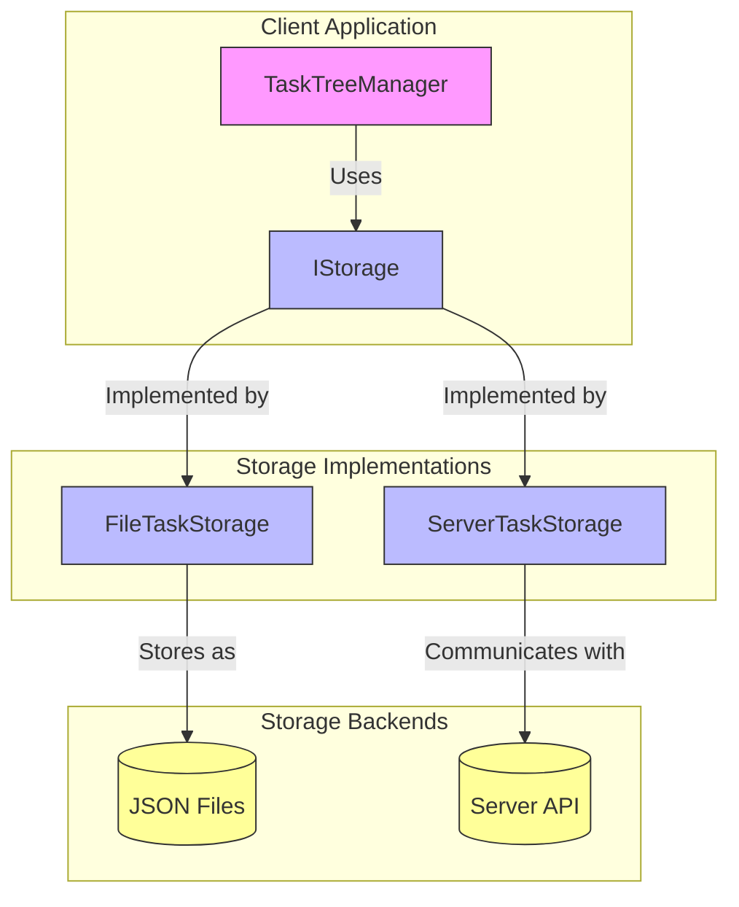
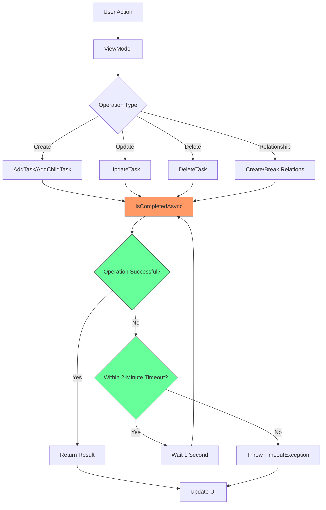

# Optimistic Concurrency and Versioning System

<cite>
**Referenced Files in This Document**   
- [TaskItem.cs](file://src/Unlimotion.Domain/TaskItem.cs)
- [TaskTreeManager.cs](file://src/Unlimotion.TaskTreeManager/TaskTreeManager.cs)
- [FileTaskStorage.cs](file://src/Unlimotion/FileTaskStorage.cs)
- [ServerTaskStorage.cs](file://src/Unlimotion/ServerTaskStorage.cs)
</cite>

## Table of Contents
1. [Introduction](#introduction)
2. [Version Property and State Management](#version-property-and-state-management)
3. [Optimistic Concurrency Control Mechanism](#optimistic-concurrency-control-mechanism)
4. [Retry Mechanism and Conflict Resolution](#retry-mechanism-and-conflict-resolution)
5. [Conflict Resolution Scenarios](#conflict-resolution-scenarios)
6. [Data Consistency Across Storage Backends](#data-consistency-across-storage-backends)
7. [System Architecture and Flow](#system-architecture-and-flow)

## Introduction
The Unlimotion system implements an optimistic concurrency control mechanism using a Version property to manage task state changes and prevent lost updates during synchronization. This documentation details how the system handles concurrent modifications, ensures data consistency across distributed storage backends, and resolves conflicts when multiple clients modify the same task simultaneously. The system uses a retry mechanism with a 2-minute timeout and 1-second retry intervals to handle concurrent modification conflicts.

**Section sources**
- [TaskItem.cs](file://src/Unlimotion.Domain/TaskItem.cs#L5-L30)
- [TaskTreeManager.cs](file://src/Unlimotion.TaskTreeManager/TaskTreeManager.cs#L1-L50)

## Version Property and State Management
The Version property is a critical component of the optimistic concurrency control system, implemented as an integer field in the TaskItem class. This property increments with each state change during UpdateTask operations, serving as a mechanism to detect and prevent lost updates during synchronization.

When a new task is created, the Version property is initialized to 1. For all subsequent updates to existing tasks, the system maintains the current version number and only allows updates if the version in the storage backend matches the version in the update request. This ensures that no concurrent modifications have occurred between the time the task was loaded and when it is being saved.

The Version property is updated in various operations throughout the system:
- When creating a new task (AddTask, AddChildTask)
- When updating an existing task (UpdateTask)
- When cloning a task (CloneTask)
- When handling task completion changes (HandleTaskCompletionChange)

Each of these operations uses the IsCompletedAsync wrapper to ensure atomicity and handle potential concurrency conflicts.

**Diagram sources**
- [TaskItem.cs](file://src/Unlimotion.Domain/TaskItem.cs#L5-L30)

**Section sources**
- [TaskItem.cs](file://src/Unlimotion.Domain/TaskItem.cs#L5-L30)
- [TaskTreeManager.cs](file://src/Unlimotion.TaskTreeManager/TaskTreeManager.cs#L29-L30)

## Optimistic Concurrency Control Mechanism
The optimistic concurrency control system prevents lost updates during synchronization by using the Version property to detect concurrent modifications. When a client attempts to update a task, the system follows a specific pattern to ensure data integrity.

The UpdateTask method in TaskTreeManager implements the core of this mechanism. It first loads the existing task from storage to check if the IsCompleted property has changed. If there's no change to the completion state, it proceeds with a regular update. The system compares the version of the task in storage with the version in the update request. If they match, the update proceeds; if they don't match, a concurrency conflict is detected.

For operations that modify task relationships (parent-child, blocking), the system creates temporary relations and updates the Version property accordingly. When creating parent-child relationships through CreateParentChildRelation, the Version property of both the parent and child tasks is effectively managed through the atomic operation wrapped in IsCompletedAsync.

The system also handles cascading updates to related tasks. When a task's availability changes (IsCanBeCompleted), the system recalculates availability for all affected tasks and updates their Version properties accordingly. This ensures that changes propagate correctly through the task hierarchy while maintaining data consistency.

**Diagram sources**
- [TaskTreeManager.cs](file://src/Unlimotion.TaskTreeManager/TaskTreeManager.cs#L248-L284)
- [TaskTreeManager.cs](file://src/Unlimotion.TaskTreeManager/TaskTreeManager.cs#L217-L251)

**Section sources**
- [TaskTreeManager.cs](file://src/Unlimotion.TaskTreeManager/TaskTreeManager.cs#L248-L284)
- [TaskTreeManager.cs](file://src/Unlimotion.TaskTreeManager/TaskTreeManager.cs#L217-L251)

## Retry Mechanism and Conflict Resolution
The system implements a robust retry mechanism in the IsCompletedAsync method to handle concurrent modification conflicts. This mechanism uses a 2-minute timeout with 1-second retry intervals, providing a balance between responsiveness and system load.

The IsCompletedAsync method uses the Polly library to create an asynchronous retry policy that handles failed operations. The retry policy is configured to:
- Wait and retry up to 120 times (2-minute timeout)
- Use a fixed wait time of 1 second between retries
- Continue retrying as long as the operation returns false

When a conflict occurs during a task update, the system automatically retries the operation. Each retry attempts to reload the current state from storage and apply the changes again. This approach allows the system to resolve temporary conflicts caused by concurrent modifications without requiring user intervention.

The retry mechanism is wrapped around all critical operations in the TaskTreeManager, including:
- AddTask and AddChildTask
- UpdateTask
- DeleteTask
- HandleTaskCompletionChange
- CreateParentChildRelation and BreakParentChildRelation
- CreateBlockingBlockedByRelation and BreakBlockingBlockedByRelation

If the operation fails to complete successfully within the 2-minute timeout period, a TimeoutException is thrown, indicating that the operation could not be completed due to persistent conflicts.

**Diagram sources**
- [TaskTreeManager.cs](file://src/Unlimotion.TaskTreeManager/TaskTreeManager.cs#L597-L631)

**Section sources**
- [TaskTreeManager.cs](file://src/Unlimotion.TaskTreeManager/TaskTreeManager.cs#L597-L631)

## Conflict Resolution Scenarios
The system handles several conflict resolution scenarios when multiple clients modify the same task simultaneously. These scenarios demonstrate how the optimistic concurrency control system maintains data consistency across distributed storage backends.

### Scenario 1: Simultaneous Task Updates
When two clients attempt to update the same task simultaneously, the system detects the conflict through version mismatch. The first client's update succeeds and increments the version number. When the second client attempts to save their changes, the system detects that the version in storage no longer matches the version they loaded, triggering the retry mechanism. During the retry, the second client's operation reloads the task with the updated version and applies their changes on top of the first client's modifications.

### Scenario 2: Task Completion and Parent Updates
When one client completes a task while another client is updating its parent task, the system must resolve the conflict. The task completion changes the IsCompleted property and updates the CompletedDateTime, incrementing the version. The parent task update may include changes to the parent's properties or relationships. The retry mechanism ensures that both sets of changes are eventually applied, with the later operation incorporating the changes from the earlier one.

### Scenario 3: Blocking Relationship Changes
Conflicts can occur when multiple clients modify blocking relationships for the same task. For example, one client may be adding a blocking task while another is removing a different blocking task. The CreateBlockingBlockedByRelation and BreakBlockingBlockedByRelation methods both use the IsCompletedAsync wrapper, ensuring that these operations are atomic and subject to the same retry mechanism. The system recalculates availability for affected tasks after each successful operation, maintaining consistency in the task network.

### Scenario 4: Cascading Availability Changes
When a task's availability changes (IsCanBeCompleted), it can trigger cascading changes to parent tasks and blocked tasks. If multiple clients are modifying tasks in the same hierarchy simultaneously, the system must resolve these cascading updates. The CalculateAndUpdateAvailability method is called within the IsCompletedAsync wrapper, ensuring that availability calculations and updates are atomic and subject to the retry mechanism.

**Diagram sources**
- [TaskTreeManager.cs](file://src/Unlimotion.TaskTreeManager/TaskTreeManager.cs#L248-L284)
- [TaskTreeManager.cs](file://src/Unlimotion.TaskTreeManager/TaskTreeManager.cs#L597-L631)

**Section sources**
- [TaskTreeManager.cs](file://src/Unlimotion.TaskTreeManager/TaskTreeManager.cs#L248-L284)
- [TaskTreeManager.cs](file://src/Unlimotion.TaskTreeManager/TaskTreeManager.cs#L597-L631)

## Data Consistency Across Storage Backends
The system ensures data consistency across distributed storage backends through a unified interface and consistent implementation of the optimistic concurrency control mechanism. Both file-based and server-based storage implementations adhere to the same contract, ensuring that the Version property and retry mechanism work identically regardless of the underlying storage technology.

The IStorage interface defines the contract for all storage operations, including Save, Remove, and Load methods. This abstraction allows the TaskTreeManager to operate independently of the specific storage implementation while maintaining consistent concurrency control behavior.

For file-based storage (FileTaskStorage), the system saves tasks as individual JSON files, with the task ID serving as the filename. The Save operation writes the entire task object, including the Version property, to the file. The atomicity of file operations and the retry mechanism ensure that concurrent modifications are properly handled.

For server-based storage (ServerTaskStorage), the system uses HTTP requests to communicate with a remote server. The Save operation sends the task object, including the Version property, to the server via API calls. The server-side implementation must also respect the Version property for optimistic concurrency control, ensuring end-to-end consistency.

The system also handles migration scenarios, such as when moving from file-based to server-based storage. The versioning system ensures that tasks maintain their version history during migration, preventing conflicts that could arise from version resets.

**Diagram sources**
- [FileTaskStorage.cs](file://src/Unlimotion/FileTaskStorage.cs#L22-L456)
- [ServerTaskStorage.cs](file://src/Unlimotion/ServerTaskStorage.cs#L25-L720)
- [TaskTreeManager.cs](file://src/Unlimotion.TaskTreeManager/TaskTreeManager.cs#L1-L50)

**Section sources**
- [FileTaskStorage.cs](file://src/Unlimotion/FileTaskStorage.cs#L22-L456)
- [ServerTaskStorage.cs](file://src/Unlimotion/ServerTaskStorage.cs#L25-L720)

## System Architecture and Flow
The optimistic concurrency control system is integrated throughout the application architecture, ensuring consistent behavior across all components. The flow of operations follows a well-defined pattern that prioritizes data consistency and handles conflicts gracefully.

When a user initiates a task modification, the operation flows through the following components:
1. The ViewModel layer captures the user's changes and prepares the task update
2. The TaskTreeManager orchestrates the update operation, applying business logic and concurrency control
3. The Storage layer persists the changes, with different implementations for file and server storage
4. The DatabaseWatcher monitors changes and notifies the UI of updates

The TaskTreeManager serves as the central coordinator for all task operations, wrapping each operation in the IsCompletedAsync retry mechanism. This ensures that all modifications, regardless of their origin, are subject to the same concurrency control rules.

The system also handles edge cases such as network interruptions, storage failures, and application crashes. The retry mechanism with its 2-minute timeout provides resilience against temporary failures, while the versioning system ensures that no updates are lost due to these issues.

**Diagram sources**
- [TaskTreeManager.cs](file://src/Unlimotion.TaskTreeManager/TaskTreeManager.cs#L597-L631)
- [TaskTreeManager.cs](file://src/Unlimotion.TaskTreeManager/TaskTreeManager.cs#L248-L284)

**Section sources**
- [TaskTreeManager.cs](file://src/Unlimotion.TaskTreeManager/TaskTreeManager.cs#L597-L631)
- [TaskTreeManager.cs](file://src/Unlimotion.TaskTreeManager/TaskTreeManager.cs#L248-L284)