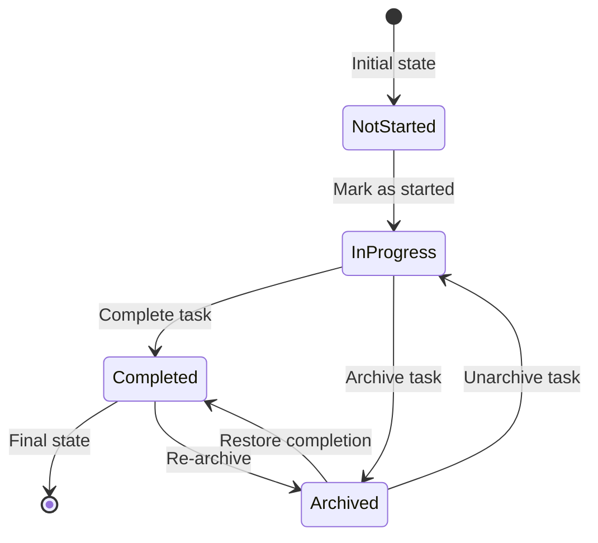
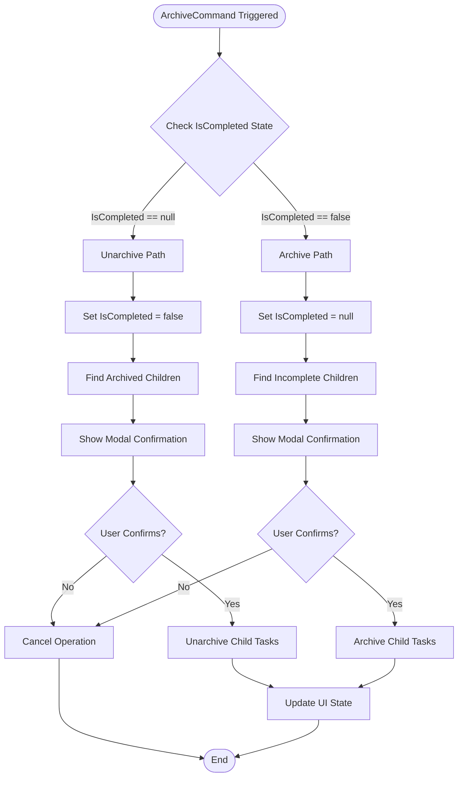
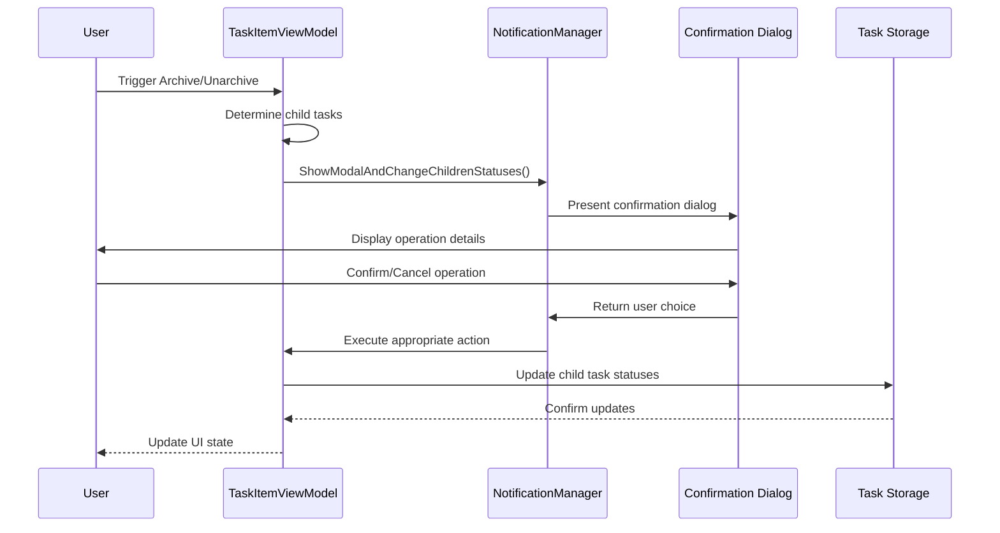
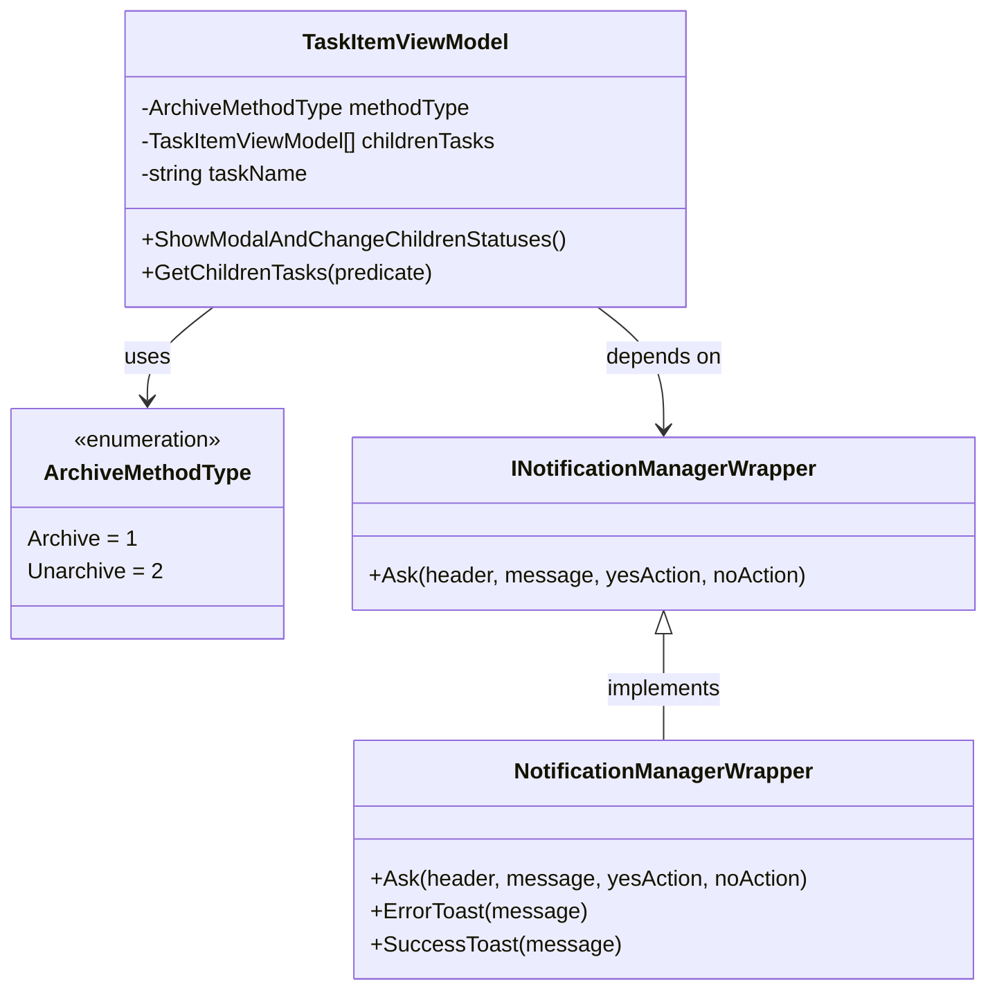
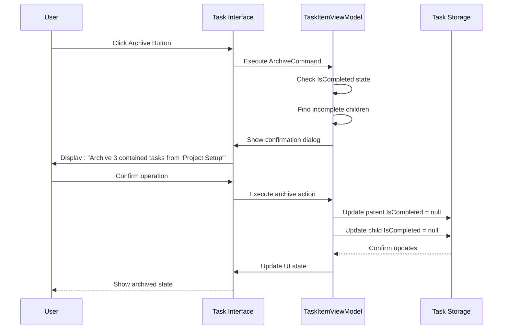
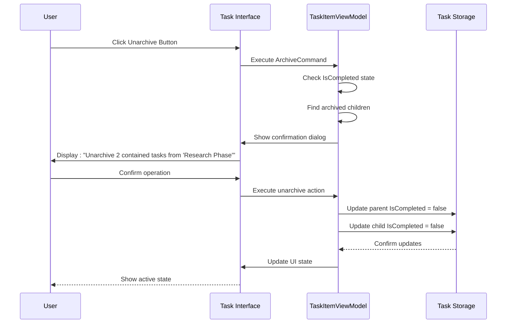
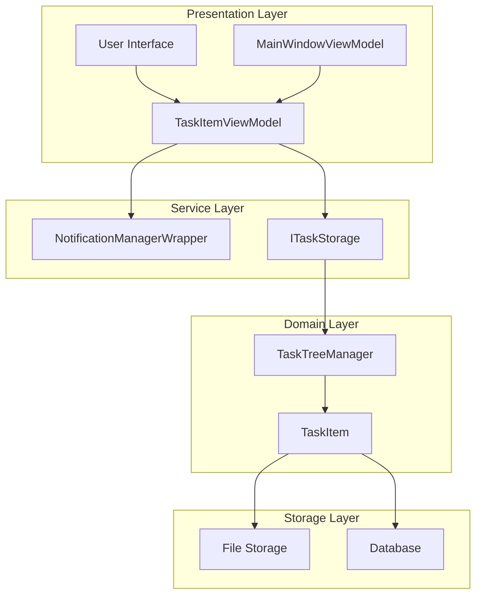

# Task Archival and Unarchival Mechanism

<cite>
**Referenced Files in This Document**
- [TaskItemViewModel.cs](file://src/Unlimotion.ViewModel/TaskItemViewModel.cs)
- [TaskItem.cs](file://src/Unlimotion.Domain/TaskItem.cs)
- [NotificationManagerWrapper.cs](file://src/Unlimotion/NotificationManagerWrapper.cs)
- [INotificationManagerWrapper.cs](file://src/Unlimotion.ViewModel/INotificationManagerWrapper.cs)
- [MainWindowViewModel.cs](file://src/Unlimotion.ViewModel/MainWindowViewModel.cs)
- [TaskCompletionChangeTests.cs](file://src/Unlimotion.Test/TaskCompletionChangeTests.cs)
- [MainWindowViewModelTests.cs](file://src/Unlimotion.Test/MainWindowViewModelTests.cs)
</cite>

## Table of Contents
1. [Introduction](#introduction)
2. [Task Status States](#task-status-states)
3. [ArchiveCommand Implementation](#archivecommand-implementation)
4. [Modal Confirmation System](#modal-confirmation-system)
5. [Bulk Status Change Management](#bulk-status-change-management)
6. [User Interaction Flows](#user-interaction-flows)
7. [Testing and Validation](#testing-and-validation)
8. [Architecture Overview](#architecture-overview)
9. [Error Handling and Edge Cases](#error-handling-and-edge-cases)
10. [Best Practices](#best-practices)

## Introduction

The task archival and unarchival mechanism in Unlimotion provides sophisticated cascade state management for hierarchical task structures. This system enables users to archive completed tasks and restore them when needed, with intelligent handling of child task relationships and modal confirmations for bulk operations.

The mechanism operates through the `ArchiveCommand` in the `TaskItemViewModel`, which manages the complex interplay between parent and child tasks during state transitions. The system employs a three-state model for task completion (null, false, true) and provides seamless bulk operations with user confirmation dialogs.

## Task Status States

The task system utilizes a ternary completion state model that provides flexibility in task management:



**Diagram sources**
- [TaskItem.cs](file://src/Unlimotion.Domain/TaskItem.cs#L8)
- [TaskItemViewModel.cs](file://src/Unlimotion.ViewModel/TaskItemViewModel.cs#L148-L171)

### State Definitions

| State | IsCompleted Value | Description | Use Case |
|-------|------------------|-------------|----------|
| Not Started | `false` | Task exists but not started | Default state for new tasks |
| In Progress | `null` | Task is active and ongoing | Active tasks with progress |
| Completed | `true` | Task has been finished | Completed task history |

**Section sources**
- [TaskItem.cs](file://src/Unlimotion.Domain/TaskItem.cs#L8)
- [TaskItemViewModel.cs](file://src/Unlimotion.ViewModel/TaskItemViewModel.cs#L148-L171)

## ArchiveCommand Implementation

The `ArchiveCommand` serves as the central orchestrator for task state transitions, implementing sophisticated logic to handle both archiving and unarchiving operations with proper cascade effects.



**Diagram sources**
- [TaskItemViewModel.cs](file://src/Unlimotion.ViewModel/TaskItemViewModel.cs#L136-L171)

### Switch Statement Logic

The core state transition logic operates through a switch statement that handles both archiving and unarchiving scenarios:

**Section sources**
- [TaskItemViewModel.cs](file://src/Unlimotion.ViewModel/TaskItemViewModel.cs#L136-L171)

#### Unarchiving Operation (IsCompleted = null → false)
When a user attempts to unarchive a task that is currently archived (IsCompleted = null), the system:
1. Sets the task's IsCompleted state to false
2. Identifies all child tasks that are currently archived (IsCompleted = null)
3. Presents a modal confirmation dialog for bulk unarchiving
4. Executes the unarchiving operation if confirmed

#### Archiving Operation (IsCompleted = false → null)
When a user attempts to archive a task that is currently active (IsCompleted = false), the system:
1. Sets the task's IsCompleted state to null
2. Identifies all child tasks that are currently incomplete (IsCompleted = false)
3. Presents a modal confirmation dialog for bulk archiving
4. Executes the archiving operation if confirmed

## Modal Confirmation System

The modal confirmation system provides user safety and awareness during bulk operations through the `ShowModalAndChangeChildrenStatuses` method.



**Diagram sources**
- [TaskItemViewModel.cs](file://src/Unlimotion.ViewModel/TaskItemViewModel.cs#L520-L573)
- [NotificationManagerWrapper.cs](file://src/Unlimotion/NotificationManagerWrapper.cs#L12-L25)

### Confirmation Dialog Structure

The confirmation system generates dynamic dialog messages based on the operation type:

**Section sources**
- [TaskItemViewModel.cs](file://src/Unlimotion.ViewModel/TaskItemViewModel.cs#L554-L562)
- [NotificationManagerWrapper.cs](file://src/Unlimotion/NotificationManagerWrapper.cs#L12-L25)

#### Dialog Message Format
```
Header: "{OperationType} contained tasks"
Message: "Are you sure you want to {operation} the {count} contained tasks from \"{taskName}\"?"
```

#### Operation Types
- **Archive**: Converts incomplete child tasks to active state
- **Unarchive**: Converts archived child tasks to active state

## Bulk Status Change Management

The `ShowModalAndChangeChildrenStatuses` method manages bulk status changes for child tasks through a carefully orchestrated process.



**Diagram sources**
- [TaskItemViewModel.cs](file://src/Unlimotion.ViewModel/TaskItemViewModel.cs#L520-L573)
- [INotificationManagerWrapper.cs](file://src/Unlimotion.ViewModel/INotificationManagerWrapper.cs#L4-L11)
- [NotificationManagerWrapper.cs](file://src/Unlimotion/NotificationManagerWrapper.cs#L12-L25)

### GetChildrenTasks Method

The `GetChildrenTasks` method implements breadth-first traversal to efficiently discover all descendant tasks that match the specified criteria:

**Section sources**
- [TaskItemViewModel.cs](file://src/Unlimotion.ViewModel/TaskItemViewModel.cs#L294-L308)

#### Traversal Algorithm
1. Initialize queue with immediate child tasks matching predicate
2. Process tasks from queue until empty
3. For each processed task, enqueue its matching children
4. Yield each task as it's processed

#### Performance Characteristics
- **Time Complexity**: O(n) where n is the total number of descendant tasks
- **Space Complexity**: O(w) where w is the maximum width of the task tree
- **Memory Efficient**: Uses lazy enumeration to minimize memory usage

## User Interaction Flows

### Archiving Tasks with Incomplete Children

When a user attempts to archive a task containing incomplete child tasks, the system follows this interaction flow:



**Diagram sources**
- [TaskItemViewModel.cs](file://src/Unlimotion.ViewModel/TaskItemViewModel.cs#L136-L171)
- [MainWindowViewModelTests.cs](file://src/Unlimotion.Test/MainWindowViewModelTests.cs#L422-L454)

### Unarchiving Tasks with Archived Children

When a user attempts to unarchive a task containing archived child tasks, the system follows this interaction flow:



**Diagram sources**
- [TaskItemViewModel.cs](file://src/Unlimotion.ViewModel/TaskItemViewModel.cs#L136-L171)
- [MainWindowViewModelTests.cs](file://src/Unlimotion.Test/MainWindowViewModelTests.cs#L451-L478)

## Testing and Validation

The system includes comprehensive testing to ensure reliable operation across various scenarios.

### Test Coverage Areas

**Section sources**
- [TaskCompletionChangeTests.cs](file://src/Unlimotion.Test/TaskCompletionChangeTests.cs#L0-L86)
- [MainWindowViewModelTests.cs](file://src/Unlimotion.Test/MainWindowViewModelTests.cs#L398-L510)

#### State Transition Tests
- Archive command with and without child tasks
- Unarchive command with and without child tasks  
- Bulk operation confirmations
- Error handling scenarios

#### Integration Tests
- Database persistence after state changes
- UI state synchronization
- Cascade effect propagation

### Validation Scenarios

| Test Scenario | Expected Outcome | Validation Point |
|---------------|------------------|------------------|
| Archive task with incomplete children | Modal confirmation shown | Confirmation dialog appears |
| Archive task with no children | Direct state change | Immediate state update |
| Unarchive task with archived children | Modal confirmation shown | Bulk operation dialog |
| Unarchive task with no children | Direct state change | Immediate state update |
| Cancel confirmation dialog | No state changes | Original state preserved |

## Architecture Overview

The task archival mechanism integrates multiple architectural layers to provide robust functionality.



**Diagram sources**
- [TaskItemViewModel.cs](file://src/Unlimotion.ViewModel/TaskItemViewModel.cs#L136-L171)
- [MainWindowViewModel.cs](file://src/Unlimotion.ViewModel/MainWindowViewModel.cs#L25-L50)
- [NotificationManagerWrapper.cs](file://src/Unlimotion/NotificationManagerWrapper.cs#L12-L25)

### Layer Responsibilities

#### Presentation Layer
- User interaction handling
- UI state management
- Modal dialog orchestration

#### Service Layer  
- Notification management
- Task storage operations
- Cross-cutting concerns

#### Domain Layer
- Business logic enforcement
- State validation
- Cascade effect calculations

#### Storage Layer
- Data persistence
- Transaction management
- Data integrity

## Error Handling and Edge Cases

The system implements comprehensive error handling to manage various edge cases gracefully.

### Common Edge Cases

#### Empty Child Collections
- **Scenario**: Task has no child tasks
- **Handling**: Skip bulk operations, update single task
- **Result**: Direct state change without confirmation

#### Circular Dependencies
- **Scenario**: Task relationships form cycles
- **Handling**: Breadth-first traversal prevents infinite loops
- **Result**: Safe processing of acyclic portions

#### Concurrent Modifications
- **Scenario**: Task state changes during bulk operations
- **Handling**: Optimistic concurrency with retry logic
- **Result**: Consistent final state despite concurrent changes

#### Partial Failures
- **Scenario**: Some child tasks fail to update
- **Handling**: Transaction rollback with partial success reporting
- **Result**: Atomic operation semantics maintained

**Section sources**
- [TaskItemViewModel.cs](file://src/Unlimotion.ViewModel/TaskItemViewModel.cs#L534-L573)

## Best Practices

### Implementation Guidelines

1. **State Validation**: Always validate task states before initiating operations
2. **User Confirmation**: Require explicit confirmation for bulk operations
3. **Transaction Safety**: Use atomic operations for cascade updates
4. **Performance Optimization**: Implement efficient traversal algorithms
5. **Error Recovery**: Provide graceful degradation for failure scenarios

### User Experience Recommendations

1. **Clear Messaging**: Provide specific information about affected tasks
2. **Visual Feedback**: Show loading states during bulk operations
3. **Undo Capability**: Consider implementing undo functionality for critical operations
4. **Progress Indication**: Display progress for large bulk operations
5. **Accessibility**: Ensure modal dialogs are accessible to all users

### Performance Considerations

1. **Lazy Loading**: Use lazy enumeration for large task hierarchies
2. **Batch Operations**: Group related updates to minimize storage calls
3. **Memory Management**: Dispose resources promptly to prevent memory leaks
4. **Caching Strategy**: Cache frequently accessed task relationships
5. **Asynchronous Processing**: Perform heavy operations asynchronously

The task archival and unarchival mechanism provides a robust foundation for hierarchical task management, combining user-friendly interfaces with sophisticated cascade logic to maintain data integrity while enabling flexible workflow management.