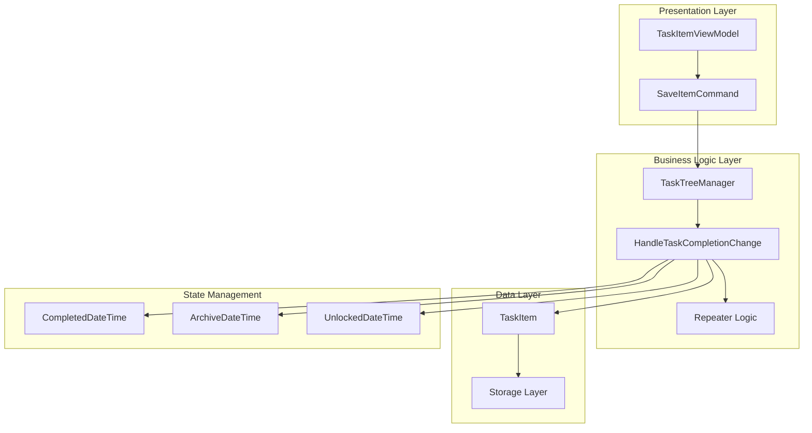
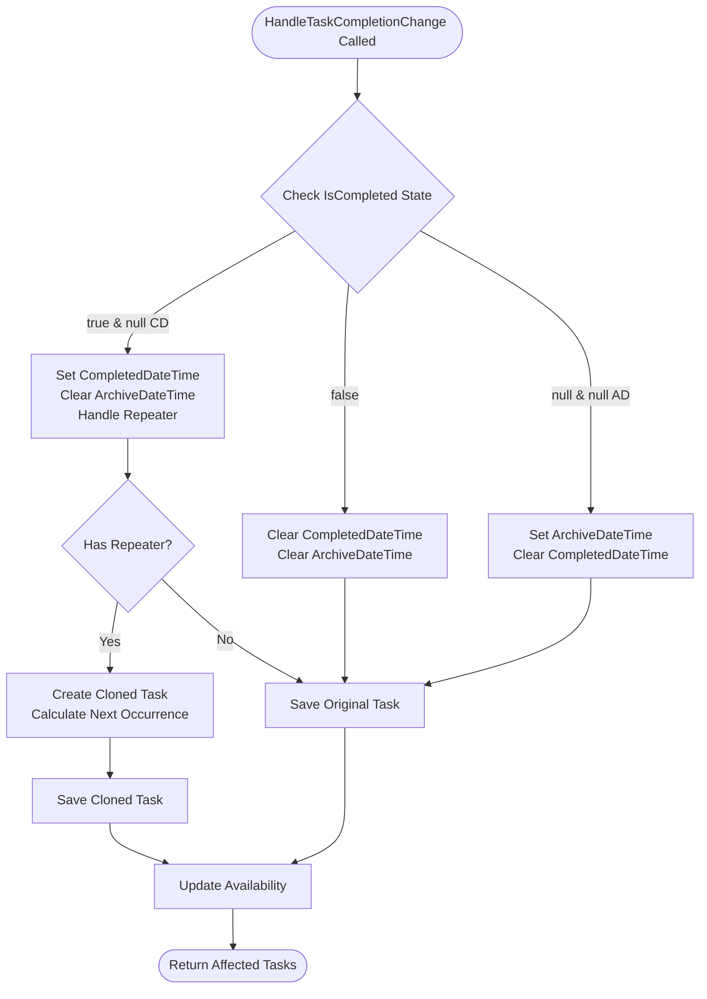
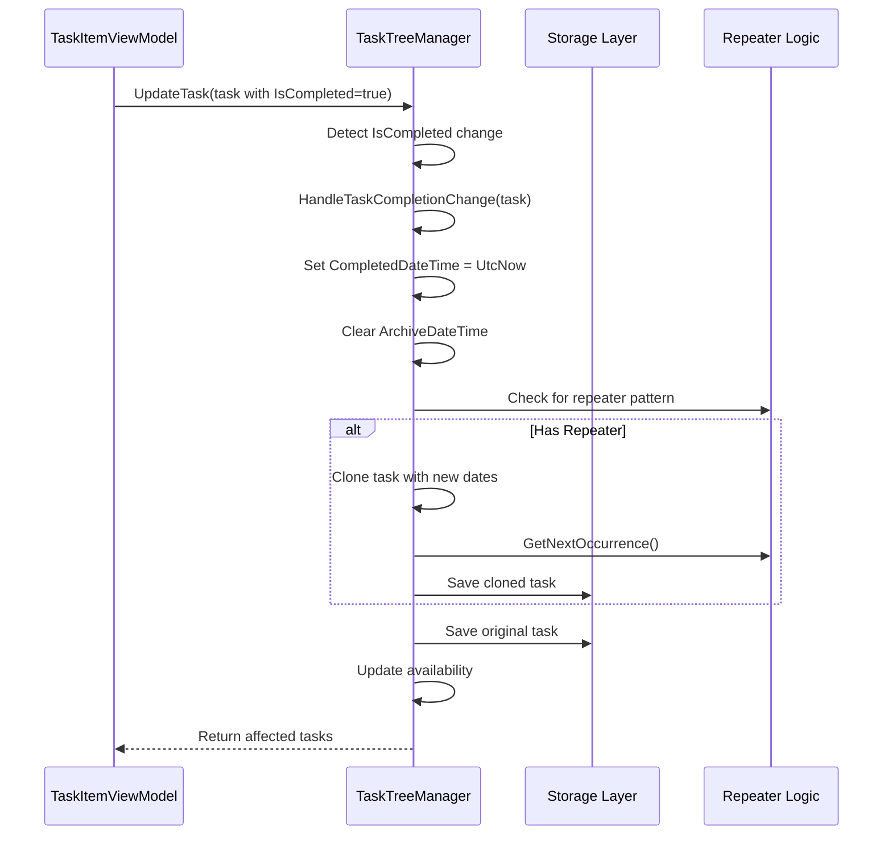
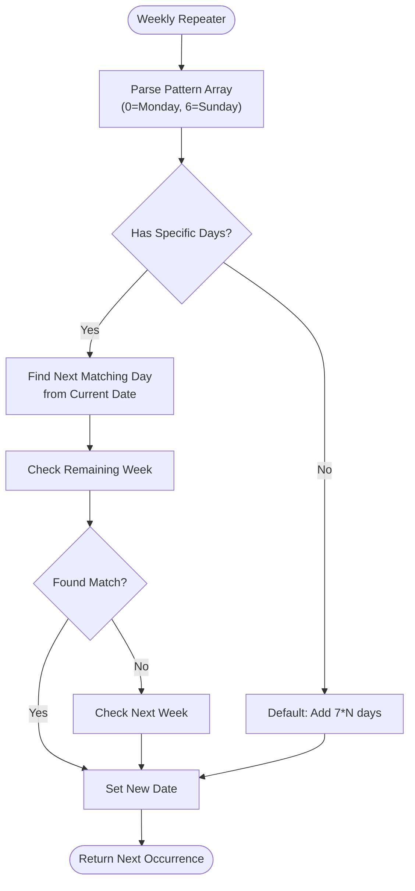
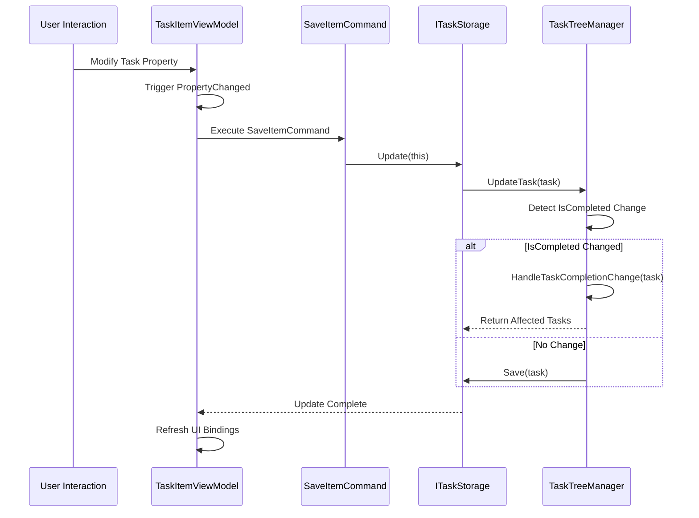
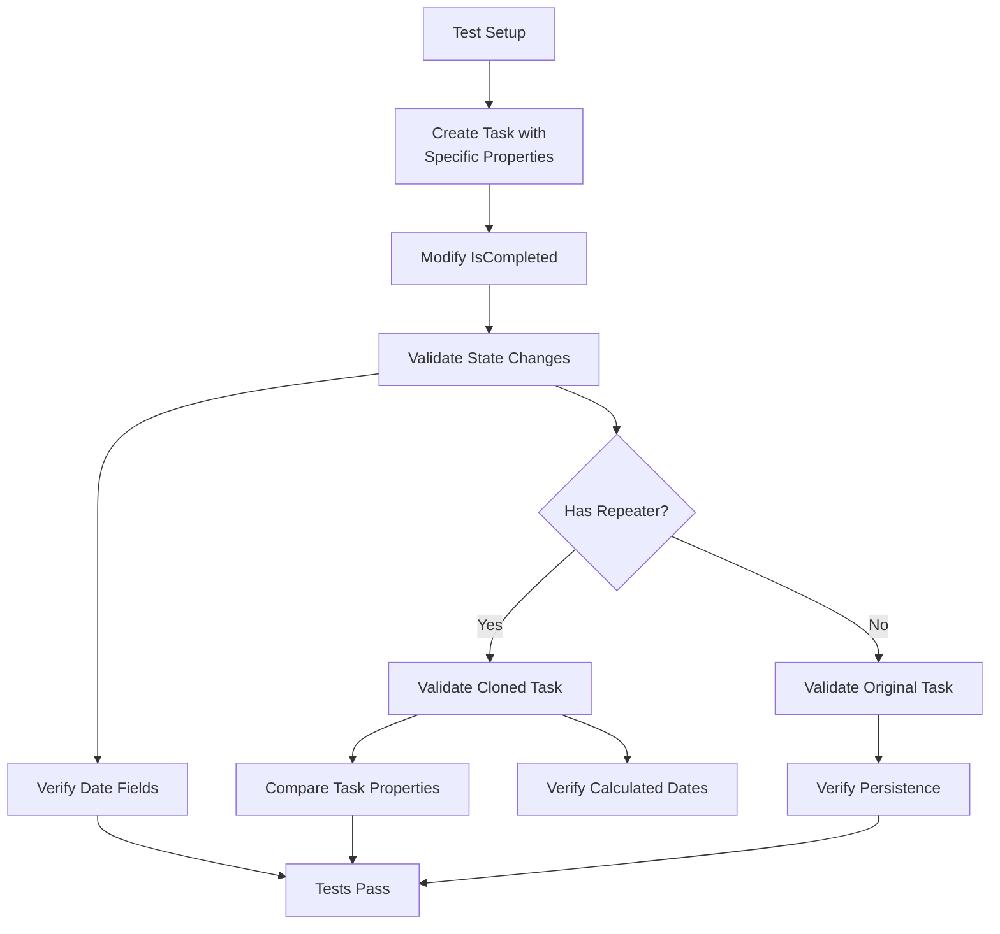

# Task Completion State Transitions

<cite>
**Referenced Files in This Document**
- [TaskTreeManager.cs](file://src/Unlimotion.TaskTreeManager/TaskTreeManager.cs)
- [TaskItemViewModel.cs](file://src/Unlimotion.ViewModel/TaskItemViewModel.cs)
- [TaskItem.cs](file://src/Unlimotion.Domain/TaskItem.cs)
- [ITaskTreeManager.cs](file://src/Unlimotion.TaskTreeManager/ITaskTreeManager.cs)
- [TaskCompletionChangeTests.cs](file://src/Unlimotion.Test/TaskCompletionChangeTests.cs)
- [RepeaterPattern.cs](file://src/Unlimotion.Domain/RepeaterPattern.cs)
- [RepeaterType.cs](file://src/Unlimotion.Domain/RepeaterType.cs)
- [RepeaterPatternExtensions.cs](file://src/Unlimotion.Domain/RepeaterPatternExtensions.cs)
- [ITaskStorage.cs](file://src/Unlimotion.ViewModel/ITaskStorage.cs)
</cite>

## Table of Contents
1. [Introduction](#introduction)
2. [System Architecture Overview](#system-architecture-overview)
3. [Task Completion State Management](#task-completion-state-management)
4. [HandleTaskCompletionChange Method Analysis](#handletaskcompletionchangemethod-analysis)
5. [State Transition Logic](#state-transition-logic)
6. [Repeater Pattern Implementation](#repeater-pattern-implementation)
7. [UI Integration and Command Flow](#ui-integration-and-command-flow)
8. [Testing and Validation](#testing-and-validation)
9. [Performance Considerations](#performance-considerations)
10. [Troubleshooting Guide](#troubleshooting-guide)

## Introduction

The task completion state transition system in Unlimotion manages the lifecycle of tasks through three distinct states: completed (`true`), uncompleted (`false`), and archived (`null`). This sophisticated system handles automatic date stamping, repeater logic for recurring tasks, and maintains data consistency across the application architecture.

The system operates through a centralized `HandleTaskCompletionChange` method in the `TaskTreeManager` class, which coordinates state transitions while maintaining referential integrity and triggering appropriate cascading updates throughout the task hierarchy.

## System Architecture Overview

The task completion system follows a layered architecture with clear separation of concerns:

**Diagram sources**
- [TaskItemViewModel.cs](file://src/Unlimotion.ViewModel/TaskItemViewModel.cs#L425-L425)
- [TaskTreeManager.cs](file://src/Unlimotion.TaskTreeManager/TaskTreeManager.cs#L762-L835)
- [TaskItem.cs](file://src/Unlimotion.Domain/TaskItem.cs#L5-L30)

## Task Completion State Management

The `TaskItem` class defines three primary completion states managed through the `IsCompleted` property:

| State | Value | Description | Date Fields |
|-------|-------|-------------|-------------|
| Completed | `true` | Task has been finished | `CompletedDateTime` set, `ArchiveDateTime` cleared |
| Uncompleted | `false` | Task is active/incomplete | Both `CompletedDateTime` and `ArchiveDateTime` cleared |
| Archived | `null` | Task is hidden/archived | `ArchiveDateTime` set, `CompletedDateTime` cleared |

### Core State Properties

The `TaskItem` class maintains several temporal properties that track task lifecycle events:

- **CompletedDateTime**: Timestamp when task becomes completed
- **ArchiveDateTime**: Timestamp when task becomes archived  
- **UnlockedDateTime**: Timestamp when task becomes available for completion
- **CreatedDateTime**: Task creation timestamp (immutable)

**Section sources**
- [TaskItem.cs](file://src/Unlimotion.Domain/TaskItem.cs#L7-L30)

## HandleTaskCompletionChange Method Analysis

The `HandleTaskCompletionChange` method serves as the central orchestrator for task completion state transitions. It implements a comprehensive state machine that handles all possible completion scenarios.

**Diagram sources**
- [TaskTreeManager.cs](file://src/Unlimotion.TaskTreeManager/TaskTreeManager.cs#L762-L835)

### Method Implementation Details

The method implements a robust state transition system with the following key components:

1. **State Detection**: Identifies the current and target completion states
2. **Date Management**: Automatically sets/clears temporal properties based on state
3. **Repeater Logic**: Handles recurring task creation when applicable
4. **Availability Calculation**: Updates task availability status for dependent tasks
5. **Persistence**: Saves all changes to the storage layer

**Section sources**
- [TaskTreeManager.cs](file://src/Unlimotion.TaskTreeManager/TaskTreeManager.cs#L762-L835)

## State Transition Logic

The system implements three primary state transitions, each with specific behavioral patterns:

### Transition 1: From Uncompleted to Completed

When a task moves from `IsCompleted = false` to `true`:

**Diagram sources**
- [TaskTreeManager.cs](file://src/Unlimotion.TaskTreeManager/TaskTreeManager.cs#L762-L835)
- [TaskItemViewModel.cs](file://src/Unlimotion.ViewModel/TaskItemViewModel.cs#L435-L438)

### Transition 2: From Completed to Uncompleted

When a task moves from `IsCompleted = true` to `false`:

- **CompletedDateTime**: Cleared (no longer completed)
- **ArchiveDateTime**: Cleared (no longer archived)
- **UnlockedDateTime**: May be set if task becomes available
- **Repeater Logic**: No cloning occurs (task remains unchanged)

### Transition 3: From Any State to Archived

When a task moves to `IsCompleted = null`:

- **ArchiveDateTime**: Set to current UTC timestamp
- **CompletedDateTime**: Cleared (no longer completed)
- **UnlockedDateTime**: Cleared (no longer available)
- **Repeater Logic**: No cloning occurs (task marked as archived)

**Section sources**
- [TaskCompletionChangeTests.cs](file://src/Unlimotion.Test/TaskCompletionChangeTests.cs#L13-L125)

## Repeater Pattern Implementation

The repeater system enables recurring tasks by creating new instances when completed tasks reach their completion state. This system supports multiple recurrence patterns:

### Supported Repeater Types

| Type | Description | Next Occurrence Calculation |
|------|-------------|---------------------------|
| `None` | No repetition | Single occurrence only |
| `Daily` | Every N days | `start.AddDays(period)` |
| `Weekly` | Every N weeks | Advanced weekday calculation |
| `Monthly` | Every N months | `start.AddMonths(period)` |
| `Yearly` | Every N years | `start.AddYears(period)` |

### Weekly Pattern Complexity

The weekly repeater implements sophisticated weekday filtering:

**Diagram sources**
- [RepeaterPatternExtensions.cs](file://src/Unlimotion.Domain/RepeaterPatternExtensions.cs#L10-L83)

### Cloning Process

When a repeating task completes, the system creates a new task instance with:

1. **Preserved Properties**: Description, title, importance, wanted flag
2. **Relationship Preservation**: Parent-child and blocking relationships
3. **Date Calculation**: New planned dates based on repeater pattern
4. **Fresh Identity**: New task ID and version counter

**Section sources**
- [RepeaterPattern.cs](file://src/Unlimotion.Domain/RepeaterPattern.cs#L5-L23)
- [RepeaterPatternExtensions.cs](file://src/Unlimotion.Domain/RepeaterPatternExtensions.cs#L10-L83)

## UI Integration and Command Flow

The user interface integrates with the task completion system through reactive command patterns and automatic synchronization mechanisms.

### SaveItemCommand Architecture

**Diagram sources**
- [TaskItemViewModel.cs](file://src/Unlimotion.ViewModel/TaskItemViewModel.cs#L425-L453)
- [TaskTreeManager.cs](file://src/Unlimotion.TaskTreeManager/TaskTreeManager.cs#L244-L279)

### Automatic State Detection

The `TaskItemViewModel` automatically detects completion state changes through property binding:

- **PropertyChanged Throttling**: Debounces rapid state changes
- **Conditional Execution**: Only executes when `MainWindowViewModel._isInited` is true
- **Batch Operations**: Groups multiple property changes into single updates

### Integration Points

The system integrates with multiple UI components:

1. **Task Editing**: Direct property modification triggers state detection
2. **Bulk Operations**: Archive/unarchive commands modify state en masse
3. **Hierarchical Updates**: Parent/child relationships cascade state changes
4. **Availability Tracking**: Real-time availability calculation for UI display

**Section sources**
- [TaskItemViewModel.cs](file://src/Unlimotion.ViewModel/TaskItemViewModel.cs#L435-L438)
- [TaskItemViewModel.cs](file://src/Unlimotion.ViewModel/TaskItemViewModel.cs#L450-L453)

## Testing and Validation

The system includes comprehensive test coverage for all state transition scenarios:

### Test Coverage Areas

| Test Scenario | Expected Behavior | Validation Points |
|---------------|-------------------|-------------------|
| Completed → Uncompleted | Clear timestamps, preserve data | Date fields cleared, task preserved |
| Uncompleted → Completed | Set completion timestamp | `CompletedDateTime` set, `ArchiveDateTime` cleared |
| Any → Archived | Set archive timestamp | `ArchiveDateTime` set, others cleared |
| Repeating Task Completion | Create new instance | New task with calculated dates |

### Test Implementation Patterns

The test suite validates both individual state transitions and complex repeater scenarios:

**Diagram sources**
- [TaskCompletionChangeTests.cs](file://src/Unlimotion.Test/TaskCompletionChangeTests.cs#L13-L125)

**Section sources**
- [TaskCompletionChangeTests.cs](file://src/Unlimotion.Test/TaskCompletionChangeTests.cs#L13-L125)

## Performance Considerations

The task completion system implements several optimization strategies to maintain performance at scale:

### Caching Strategies

- **AutoUpdatingDictionary**: Efficient result caching during state transitions
- **Property Throttling**: Limits frequent property change notifications
- **Batch Operations**: Groups multiple state changes into single persistence operations

### Memory Management

- **Disposable Pattern**: Proper cleanup of reactive subscriptions
- **Weak References**: Prevents memory leaks in long-running operations
- **Lazy Loading**: Defers expensive calculations until needed

### Concurrency Handling

- **Async/Await Pattern**: Non-blocking state transitions
- **Retry Policies**: Handles transient storage failures gracefully
- **Timeout Management**: Prevents hanging operations

## Troubleshooting Guide

Common issues and resolution strategies for task completion state transitions:

### Issue: State Changes Not Persisting

**Symptoms**: Task completion state appears to change but reverts after refresh

**Causes**:
- Storage connectivity issues
- Concurrent modification conflicts
- Property binding problems

**Resolution**:
1. Verify storage connection status
2. Check for concurrent access violations
3. Validate property change propagation

### Issue: Repeater Tasks Not Creating

**Symptoms**: Completed repeating tasks don't generate new instances

**Causes**:
- Invalid repeater configuration
- Missing planned date information
- Storage write permissions

**Resolution**:
1. Validate repeater pattern settings
2. Ensure planned date fields are populated
3. Check storage write capabilities

### Issue: Availability Calculation Errors

**Symptoms**: Task availability status incorrect after state changes

**Causes**:
- Circular dependency loops
- Inconsistent relationship data
- Timing issues in cascade updates

**Resolution**:
1. Audit task relationships for cycles
2. Validate parent-child associations
3. Review update timing sequences

**Section sources**
- [TaskTreeManager.cs](file://src/Unlimotion.TaskTreeManager/TaskTreeManager.cs#L244-L279)