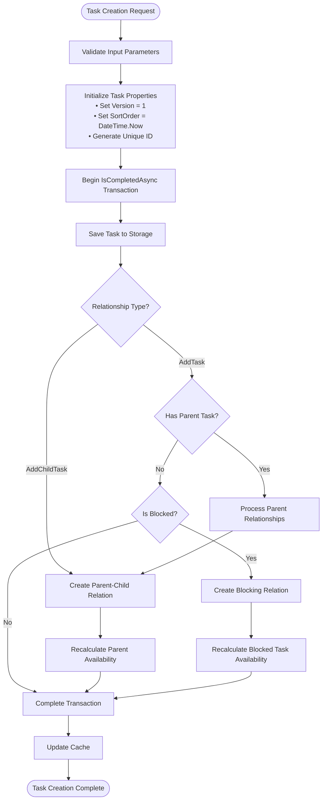
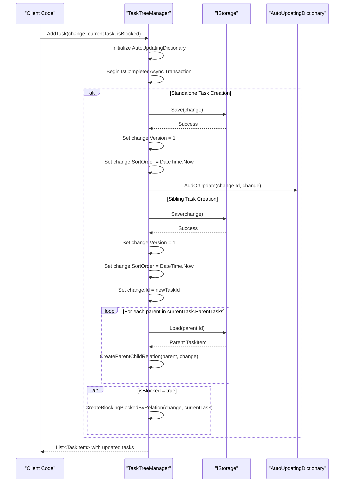
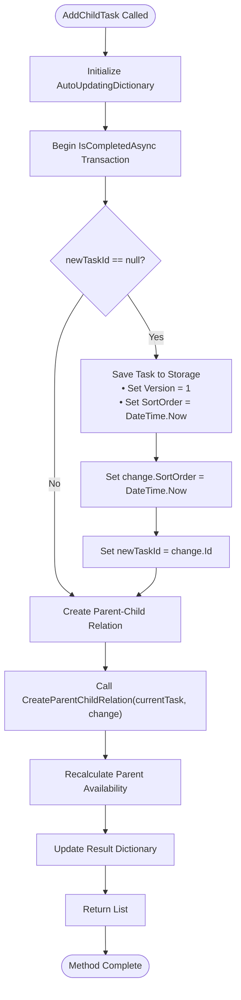
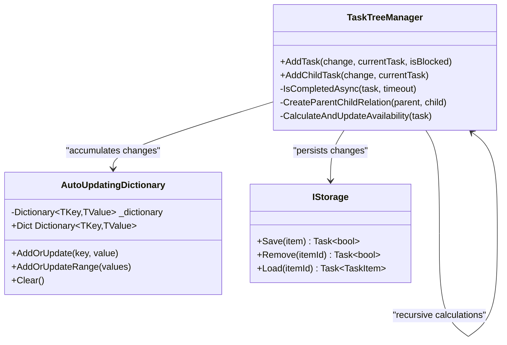
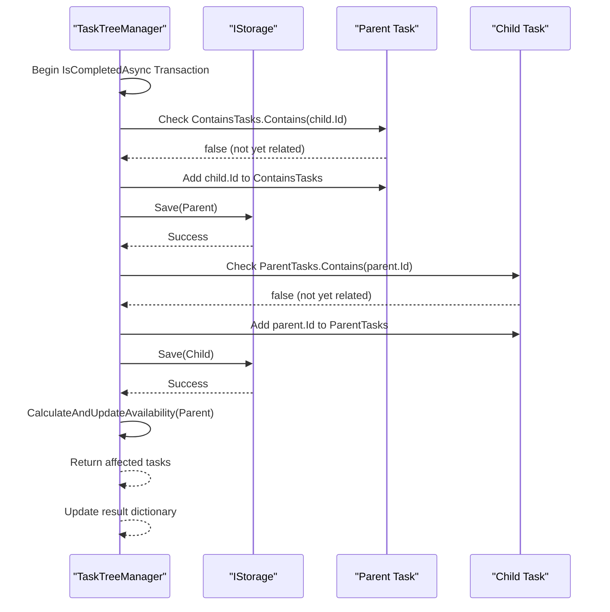
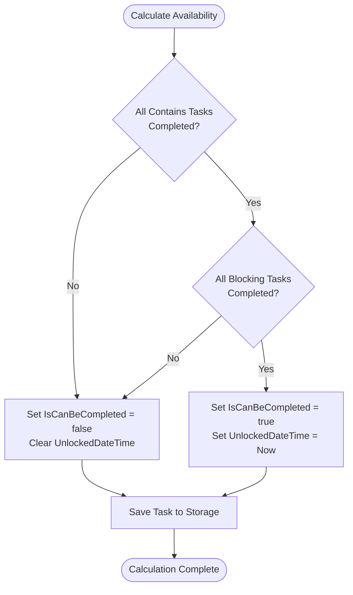

# Task Creation and Initialization Events

<cite>
**Referenced Files in This Document**
- [TaskTreeManager.cs](file://src/Unlimotion.TaskTreeManager/TaskTreeManager.cs)
- [ITaskTreeManager.cs](file://src/Unlimotion.TaskTreeManager/ITaskTreeManager.cs)
- [TaskItem.cs](file://src/Unlimotion.Domain/TaskItem.cs)
- [AutoUpdatingDictionary.cs](file://src/Unlimotion.TaskTreeManager/AutoUpdatingDictionary.cs)
- [IStorage.cs](file://src/Unlimotion.TaskTreeManager/IStorage.cs)
- [TaskAvailabilityCalculationTests.cs](file://src/Unlimotion.Test/TaskAvailabilityCalculationTests.cs)
- [FileTaskStorage.cs](file://src/Unlimotion/FileTaskStorage.cs)
</cite>

## Table of Contents
1. [Introduction](#introduction)
2. [Task Creation Lifecycle Overview](#task-creation-lifecycle-overview)
3. [AddTask Method Implementation](#addtask-method-implementation)
4. [AddChildTask Method Implementation](#addchildtask-method-implementation)
5. [Transaction Management with IsCompletedAsync](#transaction-management-with-iscompletedasync)
6. [Task Initialization Properties](#task-initialization-properties)
7. [Parent-Child Relationship Establishment](#parent-child-relationship-establishment)
8. [Availability Recalculation Process](#availability-recalculation-process)
9. [Storage Operations and Persistence](#storage-operations-and-persistence)
10. [Practical Usage Examples](#practical-usage-examples)
11. [Error Handling and Retry Mechanisms](#error-handling-and-retry-mechanisms)
12. [Performance Considerations](#performance-considerations)

## Introduction

The task creation lifecycle in Unlimotion's TaskTreeManager encompasses a sophisticated system for creating new tasks with proper initialization, relationship establishment, and availability calculation. This system ensures data consistency through transactional operations and maintains complex parent-child relationships while automatically recalculating task availability states.

The task creation process involves two primary methods: `AddTask` for creating standalone tasks or sibling tasks, and `AddChildTask` for creating hierarchical child relationships. Both methods utilize a robust retry mechanism and maintain strict consistency guarantees through the IsCompletedAsync retry policy.

## Task Creation Lifecycle Overview

The task creation lifecycle follows a structured approach that ensures atomic operations and maintains system consistency. The process begins with task initialization, continues through relationship establishment, and concludes with availability recalculation.



**Diagram sources**
- [TaskTreeManager.cs](file://src/Unlimotion.TaskTreeManager/TaskTreeManager.cs#L18-L121)
- [TaskTreeManager.cs](file://src/Unlimotion.TaskTreeManager/TaskTreeManager.cs#L123-L156)

## AddTask Method Implementation

The `AddTask` method serves as the primary entry point for creating new tasks, supporting both standalone task creation and sibling task creation scenarios. This method implements a sophisticated transactional pattern that ensures data consistency across multiple operations.

### Method Signature and Parameters

The `AddTask` method accepts three parameters:
- `change`: The TaskItem to be created
- `currentTask`: Optional parent task for sibling creation (null for standalone tasks)
- `isBlocked`: Boolean flag indicating if the task should be blocked by the current task

### Transactional Execution Pattern

The method utilizes the IsCompletedAsync retry policy to ensure atomic execution of all task creation steps:



**Diagram sources**
- [TaskTreeManager.cs](file://src/Unlimotion.TaskTreeManager/TaskTreeManager.cs#L18-L80)
- [TaskTreeManager.cs](file://src/Unlimotion.TaskTreeManager/TaskTreeManager.cs#L43-L80)

### Relationship Processing Logic

When creating sibling tasks, the method processes parent relationships by loading each parent task and establishing parent-child connections. This ensures that the newly created task inherits all parent relationships from the current task.

**Section sources**
- [TaskTreeManager.cs](file://src/Unlimotion.TaskTreeManager/TaskTreeManager.cs#L18-L80)

## AddChildTask Method Implementation

The `AddChildTask` method specifically handles the creation of hierarchical child relationships, which is fundamental to the task tree structure. This method implements a streamlined transactional pattern optimized for parent-child relationship establishment.

### Core Implementation Flow

The `AddChildTask` method follows a focused approach that prioritizes relationship establishment and immediate availability recalculation:



**Diagram sources**
- [TaskTreeManager.cs](file://src/Unlimotion.TaskTreeManager/TaskTreeManager.cs#L123-L156)

### Parent-Child Relationship Creation

The method delegates relationship establishment to the CreateParentChildRelation internal method, which handles the bidirectional relationship creation between parent and child tasks. This ensures referential integrity in both directions.

**Section sources**
- [TaskTreeManager.cs](file://src/Unlimotion.TaskTreeManager/TaskTreeManager.cs#L123-L156)

## Transaction Management with IsCompletedAsync

The IsCompletedAsync retry policy provides robust transactional guarantees for task creation operations. This mechanism ensures that all operations within a task creation cycle either complete successfully or fail atomically.

### Retry Policy Configuration

The IsCompletedAsync method implements a configurable retry policy with the following characteristics:

- **Timeout**: Default 2 minutes, configurable via timeout parameter
- **Retry Strategy**: Linear backoff with 1-second intervals
- **Failure Handling**: Throws TimeoutException if operation fails to complete within timeout
- **Error Recovery**: Automatic retry of failed operations

### Transaction Scope and Atomicity

Each task creation operation maintains transaction scope through the AutoUpdatingDictionary, which accumulates all changes that should be applied atomically:



**Diagram sources**
- [TaskTreeManager.cs](file://src/Unlimotion.TaskTreeManager/TaskTreeManager.cs#L780-L799)
- [AutoUpdatingDictionary.cs](file://src/Unlimotion.TaskTreeManager/AutoUpdatingDictionary.cs#L5-L27)

### Error Handling and Rollback

The transaction system provides automatic rollback capabilities through the retry mechanism. If any operation within the transaction fails, subsequent retries attempt to restore consistency.

**Section sources**
- [TaskTreeManager.cs](file://src/Unlimotion.TaskTreeManager/TaskTreeManager.cs#L780-L799)

## Task Initialization Properties

During task creation, several critical properties are initialized to establish the foundation for task management and availability calculation.

### Version Property Initialization

The Version property is initialized to 1 for all newly created tasks. This establishes the baseline version for change tracking and ensures proper ordering in the task lifecycle:

- **Initial Value**: 1 (first version)
- **Purpose**: Enables change tracking and conflict resolution
- **Persistence**: Automatically saved to storage with the task
- **Increment Strategy**: Handled externally for updates

### SortOrder Property Assignment

The SortOrder property receives a DateTime.Now value, establishing temporal ordering for task display and processing:

- **Assignment Timing**: Immediately after task creation
- **Precision**: DateTime.Now provides millisecond precision
- **Purpose**: Enables chronological sorting and ordering
- **Usage**: Utilized in task display and dependency resolution

### Additional Initialization Properties

The task creation process also initializes several other critical properties:

| Property | Initial Value | Purpose |
|----------|---------------|---------|
| IsCompleted | false | Marks task as active/incomplete |
| IsCanBeCompleted | true | Enables task completion by default |
| CreatedDateTime | DateTimeOffset.UtcNow | Tracks task creation time |
| UnlockedDateTime | null | Indicates when task became available |

**Section sources**
- [TaskItem.cs](file://src/Unlimotion.Domain/TaskItem.cs#L5-L32)
- [TaskTreeManager.cs](file://src/Unlimotion.TaskTreeManager/TaskTreeManager.cs#L43-L80)

## Parent-Child Relationship Establishment

The parent-child relationship establishment process creates bidirectional references between parent and child tasks, maintaining referential integrity throughout the task tree structure.

### Relationship Creation Process

The CreateParentChildRelation method implements the core relationship establishment logic:



**Diagram sources**
- [TaskTreeManager.cs](file://src/Unlimotion.TaskTreeManager/TaskTreeManager.cs#L457-L500)

### Bidirectional Reference Maintenance

The relationship establishment ensures bidirectional references are maintained:

1. **Parent Side**: ContainsTasks collection includes child ID
2. **Child Side**: ParentTasks collection includes parent ID
3. **Integrity**: Both sides are updated atomically
4. **Validation**: Prevents duplicate relationships

### Relationship Modification Detection

The system detects relationship modifications through collection membership checks, ensuring efficient updates only when changes occur.

**Section sources**
- [TaskTreeManager.cs](file://src/Unlimotion.TaskTreeManager/TaskTreeManager.cs#L457-L500)

## Availability Recalculation Process

The availability recalculation process determines whether tasks can be marked as completed based on business rules and dependency relationships. This process is triggered automatically during task creation and relationship modifications.

### Availability Calculation Rules

The system implements specific business rules for determining task availability:



**Diagram sources**
- [TaskTreeManager.cs](file://src/Unlimotion.TaskTreeManager/TaskTreeManager.cs#L667-L720)

### Dependency Evaluation Logic

The availability calculation evaluates two types of dependencies:

1. **Contained Tasks**: All child tasks must be completed
2. **Blocking Tasks**: All blocking tasks must be completed

### UnlockedDateTime Management

The system manages the UnlockedDateTime property based on availability changes:

| Availability Change | Action | Purpose |
|-------------------|---------|---------|
| Blocked → Available | Set to current UTC time | Tracks when task became available |
| Available → Blocked | Clear to null | Removes availability timestamp |
| No Change | No action | Maintains current state |

### Affected Task Propagation

When a task's availability changes, the system identifies and recalculates affected tasks:

- **Upward Propagation**: Parent tasks are recalculated
- **Forward Propagation**: Blocked tasks are recalculated  
- **Downward Propagation**: Not performed (child availability doesn't affect parent)

**Section sources**
- [TaskTreeManager.cs](file://src/Unlimotion.TaskTreeManager/TaskTreeManager.cs#L667-L720)
- [TaskTreeManager.cs](file://src/Unlimotion.TaskTreeManager/TaskTreeManager.cs#L722-L779)

## Storage Operations and Persistence

The storage operations ensure reliable persistence of task data and maintain consistency across the system. The storage layer abstracts the underlying persistence mechanism while providing transactional guarantees.

### Storage Interface Contract

The IStorage interface defines the contract for task persistence operations:

- **Save**: Persist task data to storage
- **Remove**: Delete task data from storage  
- **Load**: Retrieve task data by ID

### File-Based Storage Implementation

The FileTaskStorage implementation provides file-based persistence with the following characteristics:

- **File Naming**: Uses task ID as filename
- **Serialization**: JSON format with Newtonsoft.Json
- **Atomic Writes**: Ensures complete writes before making available
- **Error Handling**: Graceful handling of file system errors

### Persistence Guarantees

The storage operations provide several consistency guarantees:

1. **Atomic Persistence**: Either complete write succeeds or operation fails
2. **Referential Integrity**: Maintains relationship consistency
3. **Temporal Ordering**: Preserves creation order through SortOrder
4. **Version Tracking**: Supports change tracking through Version property

**Section sources**
- [IStorage.cs](file://src/Unlimotion.TaskTreeManager/IStorage.cs#L4-L9)
- [FileTaskStorage.cs](file://src/Unlimotion/FileTaskStorage.cs#L18-L50)

## Practical Usage Examples

The following examples demonstrate real-world usage patterns for task creation and initialization events.

### Creating a Standalone Task

Creating a new standalone task demonstrates basic task creation without parent relationships:

```csharp
// Example usage pattern from test cases
var newTask = new TaskItem
{
    Title = "New Task",
    Description = "Task description",
    IsCompleted = false,
    ContainsTasks = new List<string>(),
    BlockedByTasks = new List<string>()
};

var result = await taskTreeManager.AddTask(newTask);
```

### Creating a Child Task

Creating a child task establishes hierarchical relationships:

```csharp
// Example usage pattern from test cases
var parentTask = await taskTreeManager.LoadTask("parent-id");
var childTask = new TaskItem
{
    Title = "Child Task",
    IsCompleted = false,
    ContainsTasks = new List<string>(),
    ParentTasks = new List<string>()
};

var result = await taskTreeManager.AddChildTask(childTask, parentTask);
```

### Creating a Blocked Task

Creating a task that blocks another task demonstrates blocking relationships:

```csharp
// Example usage pattern from test cases
var blockerTask = new TaskItem
{
    Title = "Blocker Task",
    IsCompleted = false,
    BlocksTasks = new List<string>()
};

var blockedTask = new TaskItem
{
    Title = "Blocked Task", 
    IsCompleted = false,
    IsCanBeCompleted = true,
    BlockedByTasks = new List<string>()
};

var result = await taskTreeManager.BlockTask(blockedTask, blockerTask);
```

**Section sources**
- [TaskAvailabilityCalculationTests.cs](file://src/Unlimotion.Test/TaskAvailabilityCalculationTests.cs#L290-L350)
- [TaskAvailabilityCalculationTests.cs](file://src/Unlimotion.Test/TaskAvailabilityCalculationTests.cs#L320-L350)

## Error Handling and Retry Mechanisms

The task creation system implements comprehensive error handling and retry mechanisms to ensure reliability and data consistency.

### Exception Types and Handling

The system handles various exception scenarios:

1. **Storage Exceptions**: File system errors, network issues
2. **Concurrency Conflicts**: Simultaneous modifications
3. **Validation Errors**: Invalid task data
4. **Relationship Conflicts**: Circular dependencies

### Retry Strategy Implementation

The IsCompletedAsync method implements a linear backoff retry strategy:

- **Initial Delay**: 1 second
- **Backoff**: Constant delay between retries
- **Maximum Duration**: Configurable timeout (default 2 minutes)
- **Failure Threshold**: Operation considered failed after timeout

### Transaction Rollback

When operations fail within a transaction, the system attempts automatic rollback:

1. **Partial State Cleanup**: Removes partially created relationships
2. **Resource Release**: Frees allocated resources
3. **State Restoration**: Restores previous consistent state
4. **Error Propagation**: Communicates failure to caller

**Section sources**
- [TaskTreeManager.cs](file://src/Unlimotion.TaskTreeManager/TaskTreeManager.cs#L780-L799)

## Performance Considerations

The task creation system is designed with performance optimization in mind, balancing consistency guarantees with operational efficiency.

### Optimization Strategies

1. **Batch Operations**: Groups related operations into single transactions
2. **Lazy Loading**: Loads task data only when needed
3. **Caching**: Maintains in-memory cache of frequently accessed tasks
4. **Indexing**: Uses efficient data structures for relationship lookups

### Scalability Factors

The system scales effectively with:

- **Concurrent Operations**: Thread-safe transaction management
- **Large Task Trees**: Efficient propagation algorithms
- **High Update Frequency**: Optimized storage operations
- **Memory Usage**: Controlled caching and cleanup

### Performance Monitoring

Key metrics to monitor for performance optimization:

- **Transaction Latency**: Time taken for task creation operations
- **Storage Throughput**: Rate of successful storage operations
- **Cache Hit Rate**: Efficiency of in-memory caching
- **Propagation Overhead**: Cost of availability recalculation

The task creation system provides a robust foundation for managing complex task hierarchies while maintaining data consistency and system reliability through sophisticated transaction management and availability calculation mechanisms.