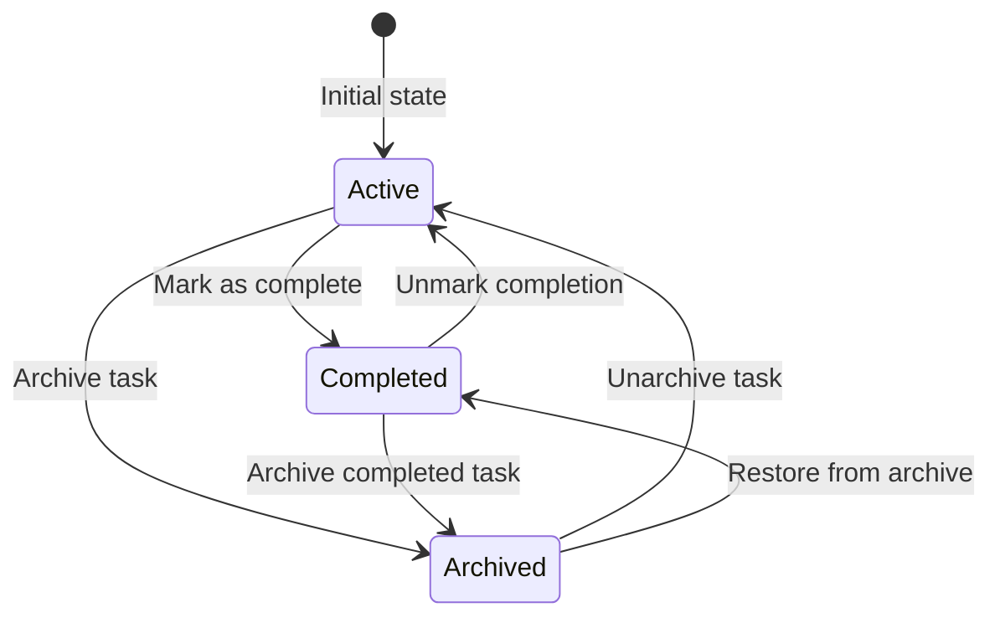
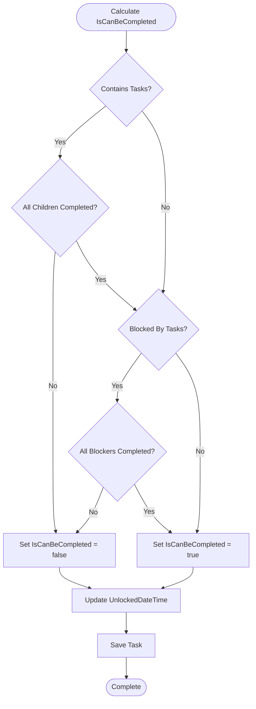
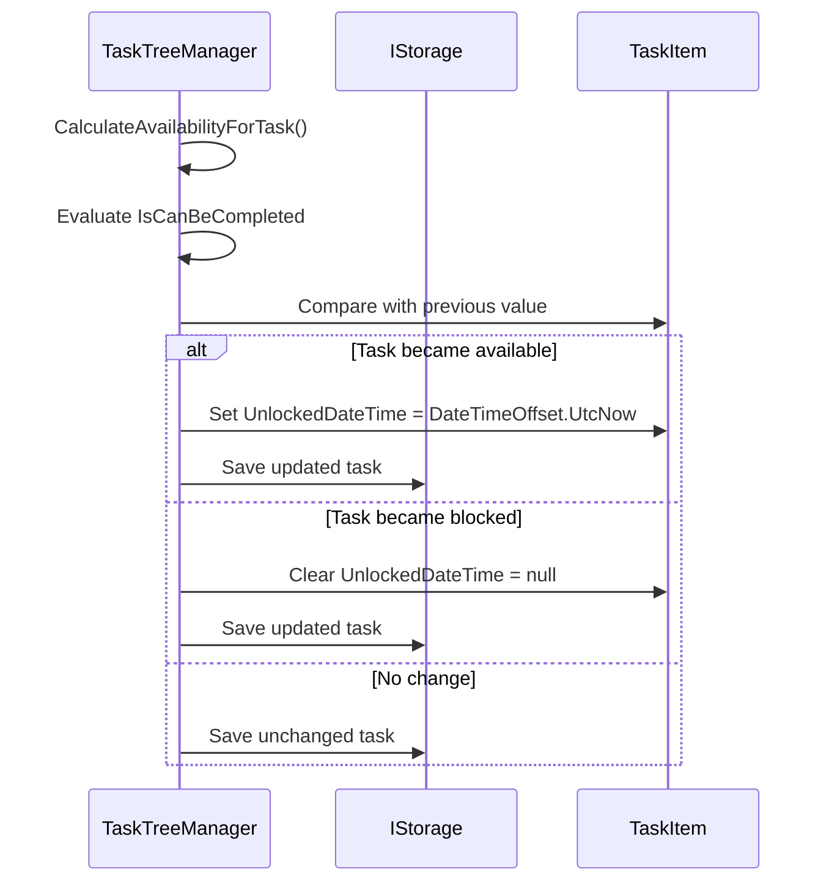
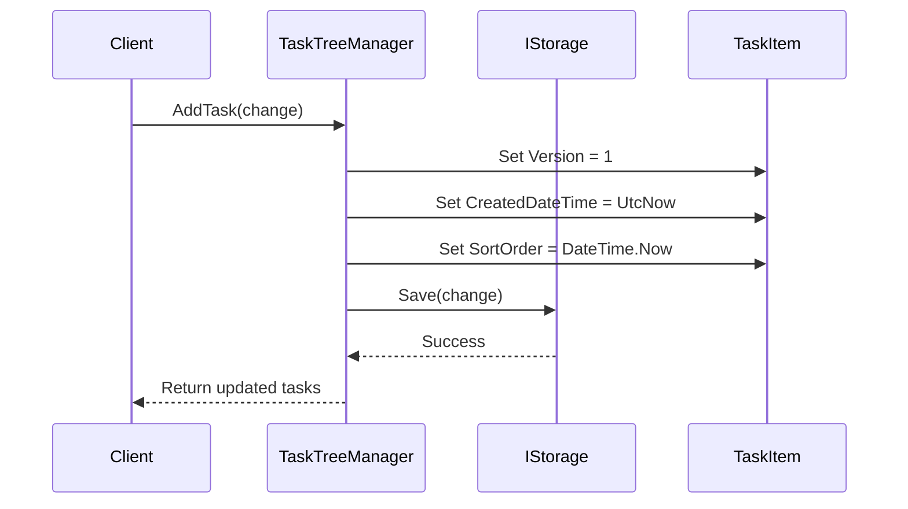
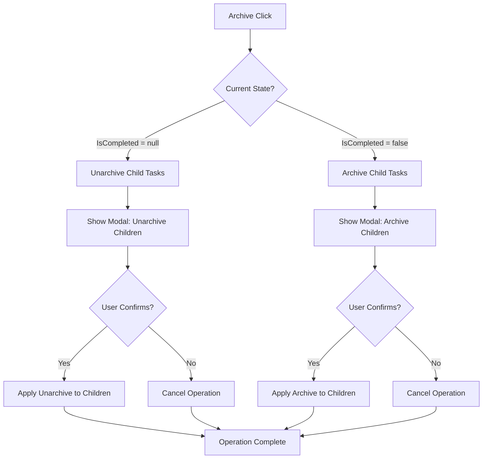
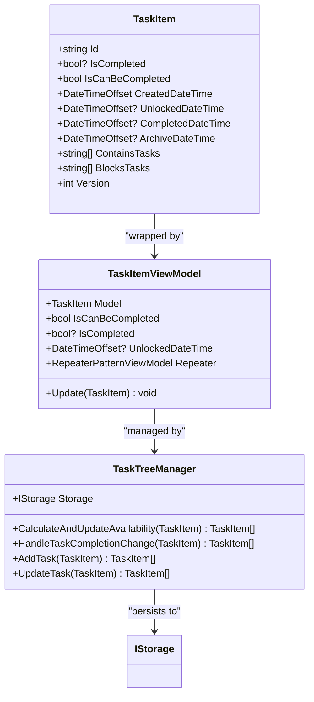
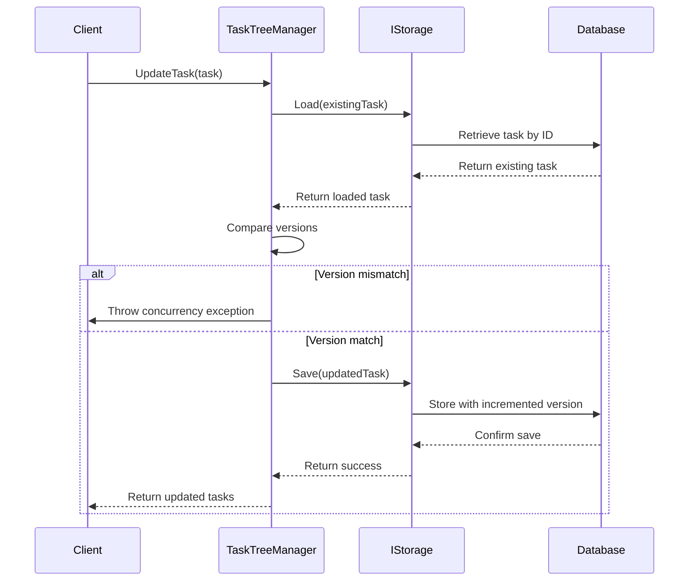
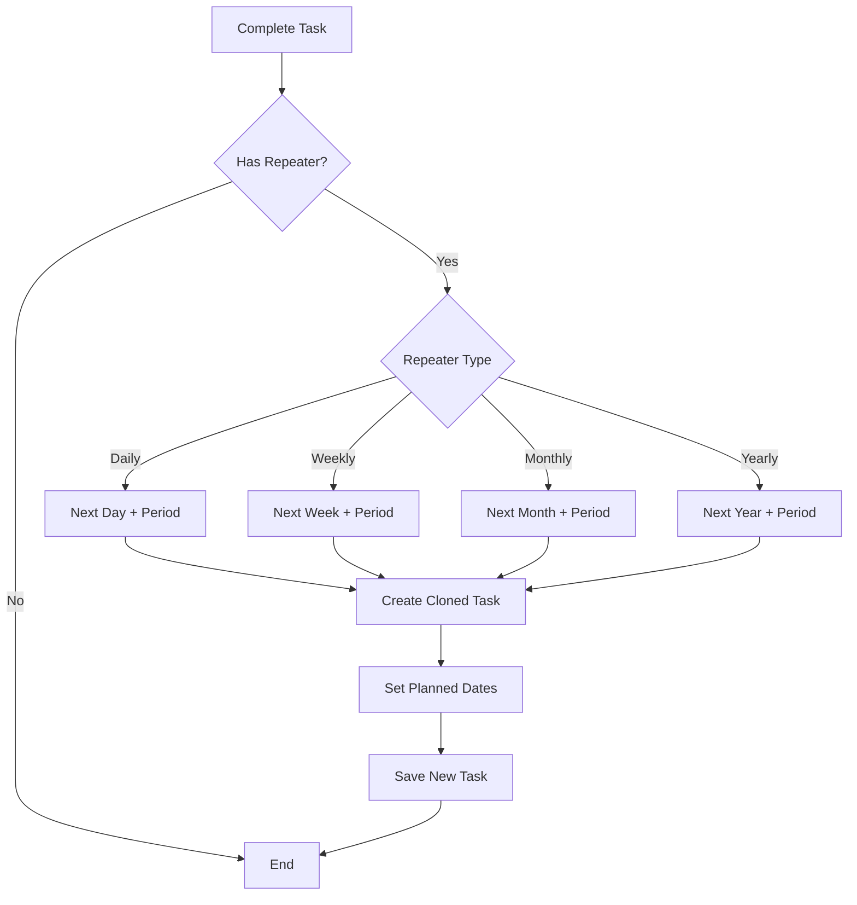

# State Management and Lifecycle

<cite>
**Referenced Files in This Document**
- [TaskItem.cs](file://src/Unlimotion.Domain/TaskItem.cs)
- [TaskItemViewModel.cs](file://src/Unlimotion.ViewModel/TaskItemViewModel.cs)
- [TaskTreeManager.cs](file://src/Unlimotion.TaskTreeManager/TaskTreeManager.cs)
- [ITaskTreeManager.cs](file://src/Unlimotion.TaskTreeManager/ITaskTreeManager.cs)
- [AutoUpdatingDictionary.cs](file://src/Unlimotion.TaskTreeManager/AutoUpdatingDictionary.cs)
- [IStorage.cs](file://src/Unlimotion.TaskTreeManager/IStorage.cs)
- [RepeaterPattern.cs](file://src/Unlimotion.Domain/RepeaterPattern.cs)
- [RepeaterPatternExtensions.cs](file://src/Unlimotion.Domain/RepeaterPatternExtensions.cs)
- [TaskAvailabilityCalculationTests.cs](file://src/Unlimotion.Test/TaskAvailabilityCalculationTests.cs)
</cite>

## Table of Contents
1. [Introduction](#introduction)
2. [Three-State Completion System](#three-state-completion-system)
3. [Archived Tasks Semantics](#archived-tasks-semantics)
4. [IsCanBeCompleted Property Calculation](#iscanbecompleted-property-calculation)
5. [Automatic UnlockedDateTime Management](#automatic-unlockeddatetime-management)
6. [Lifecycle Events](#lifecycle-events)
7. [Modal Confirmation Behavior](#modal-confirmation-behavior)
8. [Integration Architecture](#integration-architecture)
9. [Versioning and Concurrency Control](#versioning-and-concurrency-control)
10. [Business Rules Implementation](#business-rules-implementation)
11. [Testing and Validation](#testing-and-validation)

## Introduction

The TaskItem state management system in Unlimotion implements a sophisticated three-state completion model that manages task availability, completion tracking, and archival semantics. This system ensures consistent state across the application through a layered architecture involving TaskItem domain models, TaskItemViewModel presentation models, and TaskTreeManager business logic coordination.

The state management system handles complex scenarios including dependency resolution, cascading state changes, modal confirmations for bulk operations, and optimistic concurrency control through versioning mechanisms.

## Three-State Completion System

The TaskItem implements a three-state completion system using the nullable boolean `IsCompleted` property:

### State Definitions

| State | Value | Meaning |
|-------|-------|---------|
| Active | `false` | Task is currently being worked on or is pending |
| Completed | `true` | Task has been finished and is considered complete |
| Archived | `null` | Task is archived but treated as completed for dependencies |

### State Transitions

**Diagram sources**
- [TaskItem.cs](file://src/Unlimotion.Domain/TaskItem.cs#L8-L9)
- [TaskTreeManager.cs](file://src/Unlimotion.TaskTreeManager/TaskTreeManager.cs#L720-L780)

**Section sources**
- [TaskItem.cs](file://src/Unlimotion.Domain/TaskItem.cs#L8-L9)
- [TaskTreeManager.cs](file://src/Unlimotion.TaskTreeManager/TaskTreeManager.cs#L720-L780)

## Archived Tasks Semantics

Archived tasks maintain distinct semantic treatment while being treated as completed for dependency purposes:

### Dependency Treatment

- **As Completed**: Archived tasks (`IsCompleted = null`) are considered completed when evaluating task dependencies
- **Dependency Blocking**: Tasks with archived dependencies remain blocked until all dependencies are resolved
- **Availability Calculation**: Archived tasks contribute to the `IsCanBeCompleted` calculation as completed tasks

### Archival Metadata

The system tracks archival state through several properties:

| Property | Purpose | Nullability |
|----------|---------|-------------|
| `ArchiveDateTime` | Timestamp when task was archived | Nullable |
| `IsCompleted` | Three-state completion indicator | Nullable boolean |
| `CompletedDateTime` | Timestamp when task was completed | Nullable |

**Section sources**
- [TaskItem.cs](file://src/Unlimotion.Domain/TaskItem.cs#L10-L12)
- [TaskTreeManager.cs](file://src/Unlimotion.TaskTreeManager/TaskTreeManager.cs#L740-L750)

## IsCanBeCompleted Property Calculation

The `IsCanBeCompleted` property determines whether a task can be marked as completed based on business rules:

### Calculation Logic

**Diagram sources**
- [TaskTreeManager.cs](file://src/Unlimotion.TaskTreeManager/TaskTreeManager.cs#L645-L699)

### Business Rules

1. **Contained Tasks Requirement**: All tasks in `ContainsTasks` must be completed (not `false`)
2. **Blocking Tasks Requirement**: All tasks in `BlockedByTasks` must be completed (not `false`)
3. **Combined Logic**: Both conditions must be satisfied for `IsCanBeCompleted = true`

### Implementation Details

The calculation process involves:

- Loading each child task from storage to verify completion status
- Checking each blocking task to ensure completion
- Updating the `IsCanBeCompleted` property accordingly
- Managing `UnlockedDateTime` based on availability changes

**Section sources**
- [TaskTreeManager.cs](file://src/Unlimotion.TaskTreeManager/TaskTreeManager.cs#L645-L699)
- [TaskAvailabilityCalculationTests.cs](file://src/Unlimotion.Test/TaskAvailabilityCalculationTests.cs#L15-L87)

## Automatic UnlockedDateTime Management

The system automatically manages the `UnlockedDateTime` property to track when tasks become available for completion:

### Management Rules

| Scenario | Action | Condition |
|----------|--------|-----------|
| Task becomes available | Set to current UTC time | `IsCanBeCompleted` changes from `false` to `true` |
| Task becomes blocked | Clear to `null` | `IsCanBeCompleted` changes from `true` to `false` |
| No change in availability | No action | `IsCanBeCompleted` remains unchanged |

### Implementation Logic

**Diagram sources**
- [TaskTreeManager.cs](file://src/Unlimotion.TaskTreeManager/TaskTreeManager.cs#L680-L699)

**Section sources**
- [TaskTreeManager.cs](file://src/Unlimotion.TaskTreeManager/TaskTreeManager.cs#L680-L699)

## Lifecycle Events

The TaskItem lifecycle encompasses several key events managed by the TaskTreeManager:

### Creation Event

**Diagram sources**
- [TaskTreeManager.cs](file://src/Unlimotion.TaskTreeManager/TaskTreeManager.cs#L15-L48)

### Completion Event

When a task is marked as completed:

1. **Timestamp Assignment**: `CompletedDateTime` set to current UTC time
2. **Archival Reset**: `ArchiveDateTime` cleared
3. **Repeater Logic**: If task has repeater pattern, schedule next occurrence
4. **Dependency Recalculation**: Update availability for affected tasks

### Archival Event

When a task is archived:

1. **Timestamp Assignment**: `ArchiveDateTime` set to current UTC time
2. **Completion Reset**: `CompletedDateTime` cleared
3. **State Transition**: `IsCompleted` set to `null`
4. **Cascade Handling**: Modal confirmation for child tasks

### Restoration Event

When an archived task is restored:

1. **Archival Reset**: `ArchiveDateTime` cleared
2. **State Transition**: `IsCompleted` set to `false`
3. **Dependency Recalculation**: Update availability for affected tasks

**Section sources**
- [TaskTreeManager.cs](file://src/Unlimotion.TaskTreeManager/TaskTreeManager.cs#L720-L780)

## Modal Confirmation Behavior

The system implements modal confirmation dialogs for cascading state changes to child tasks:

### Archive Operations

**Diagram sources**
- [TaskItemViewModel.cs](file://src/Unlimotion.ViewModel/TaskItemViewModel.cs#L136-L171)

### Confirmation Implementation

The modal confirmation system uses the `ShowModalAndChangeChildrenStatuses` method:

- **Child Discovery**: Recursively finds all child tasks meeting criteria
- **User Interaction**: Displays confirmation dialog with child count
- **Bulk Operations**: Applies state changes to all identified children
- **Error Handling**: Provides feedback for failed operations

**Section sources**
- [TaskItemViewModel.cs](file://src/Unlimotion.ViewModel/TaskItemViewModel.cs#L534-L573)

## Integration Architecture

The state management system integrates three key components:

### Component Responsibilities

**Diagram sources**
- [TaskItem.cs](file://src/Unlimotion.Domain/TaskItem.cs#L6-L32)
- [TaskItemViewModel.cs](file://src/Unlimotion.ViewModel/TaskItemViewModel.cs#L18-L665)
- [TaskTreeManager.cs](file://src/Unlimotion.TaskTreeManager/TaskTreeManager.cs#L11-L837)

### State Consistency Mechanisms

1. **Domain Model**: Centralized business logic in TaskItem
2. **Presentation Model**: ViewModel exposes computed properties and commands
3. **Business Logic**: TaskTreeManager coordinates state changes
4. **Persistence Layer**: IStorage handles data persistence

**Section sources**
- [TaskItem.cs](file://src/Unlimotion.Domain/TaskItem.cs#L6-L32)
- [TaskItemViewModel.cs](file://src/Unlimotion.ViewModel/TaskItemViewModel.cs#L18-L665)
- [TaskTreeManager.cs](file://src/Unlimotion.TaskTreeManager/TaskTreeManager.cs#L11-L837)

## Versioning and Concurrency Control

The system implements optimistic concurrency control through versioning:

### Version Management

| Property | Purpose | Increment Strategy |
|----------|---------|-------------------|
| `Version` | Optimistic concurrency control | Increment on each update |
| `IsCompleted` | Three-state completion tracking | Boolean/null transitions |
| `CreatedDateTime` | Task creation timestamp | Single assignment |
| `CompletedDateTime` | Completion timestamp | Conditional assignment |
| `ArchiveDateTime` | Archival timestamp | Conditional assignment |

### Conflict Resolution

**Diagram sources**
- [TaskTreeManager.cs](file://src/Unlimotion.TaskTreeManager/TaskTreeManager.cs#L43-L80)

**Section sources**
- [TaskItem.cs](file://src/Unlimotion.Domain/TaskItem.cs#L25-L26)
- [TaskTreeManager.cs](file://src/Unlimotion.TaskTreeManager/TaskTreeManager.cs#L43-L80)

## Business Rules Implementation

The system implements comprehensive business rules for task availability and completion:

### Availability Calculation Rules

1. **Contained Task Dependency**: All contained tasks must be completed (not `false`)
2. **Blocking Task Dependency**: All blocking tasks must be completed (not `false`)
3. **Combined Evaluation**: Both conditions must be satisfied for availability
4. **Recursive Propagation**: Changes propagate to parent and blocked tasks

### Repeater Pattern Integration

The system supports automated task repetition through the RepeaterPattern:

**Diagram sources**
- [TaskTreeManager.cs](file://src/Unlimotion.TaskTreeManager/TaskTreeManager.cs#L750-L780)
- [RepeaterPatternExtensions.cs](file://src/Unlimotion.Domain/RepeaterPatternExtensions.cs#L6-L83)

**Section sources**
- [TaskTreeManager.cs](file://src/Unlimotion.TaskTreeManager/TaskTreeManager.cs#L645-L699)
- [TaskTreeManager.cs](file://src/Unlimotion.TaskTreeManager/TaskTreeManager.cs#L750-L780)

## Testing and Validation

The system includes comprehensive testing for state management logic:

### Test Coverage Areas

1. **Availability Calculations**: Verify correct computation of `IsCanBeCompleted`
2. **State Transitions**: Test all completion state changes
3. **Dependency Resolution**: Validate cascading updates
4. **Archival Behavior**: Test archival semantics and restoration
5. **Repeater Logic**: Verify automated task scheduling

### Test Implementation Patterns

The testing framework uses in-memory storage for isolated unit tests:

- **Setup**: Create test task hierarchies
- **Execution**: Perform state changes
- **Validation**: Verify expected outcomes
- **Cleanup**: Reset test state

**Section sources**
- [TaskAvailabilityCalculationTests.cs](file://src/Unlimotion.Test/TaskAvailabilityCalculationTests.cs#L15-L87)