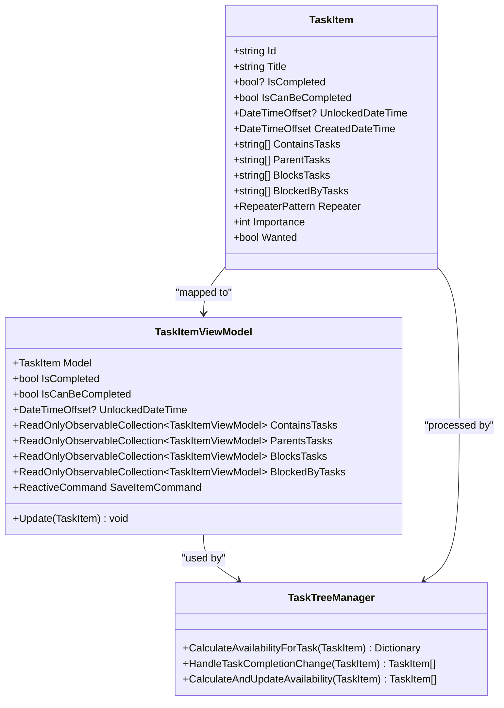
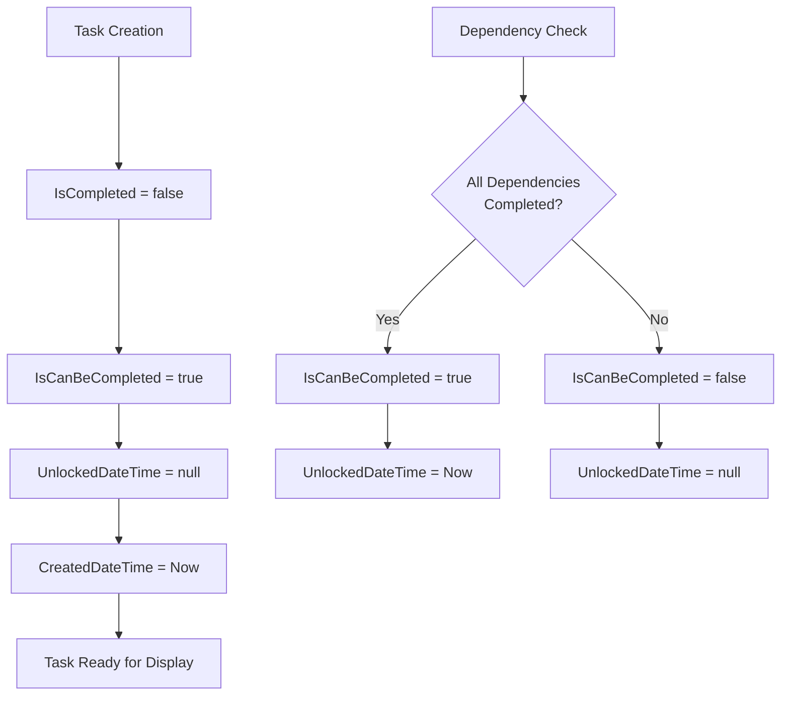
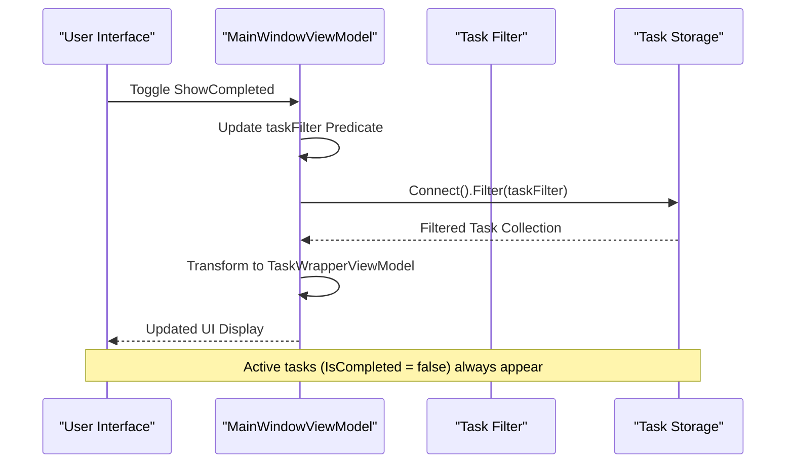
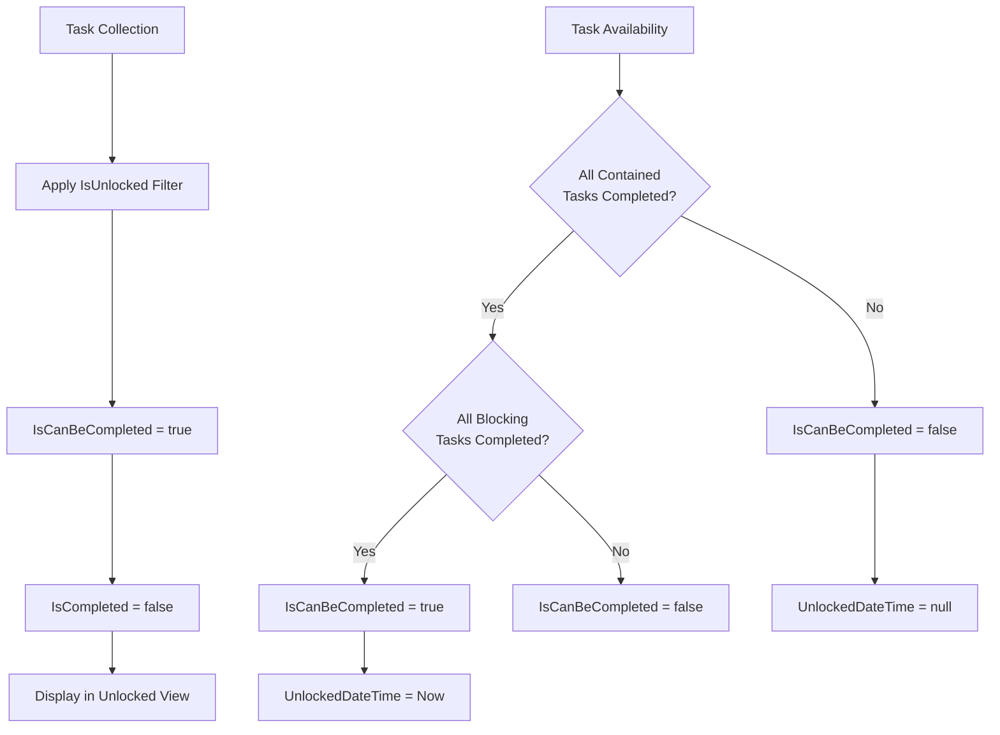
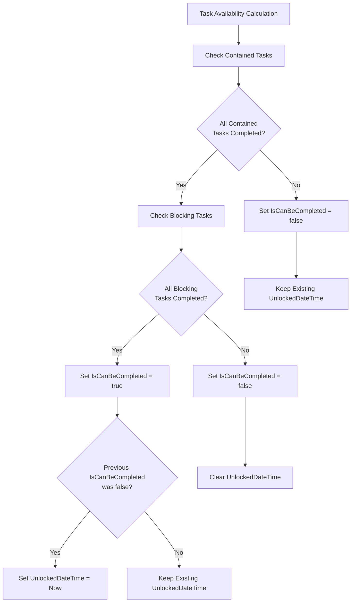
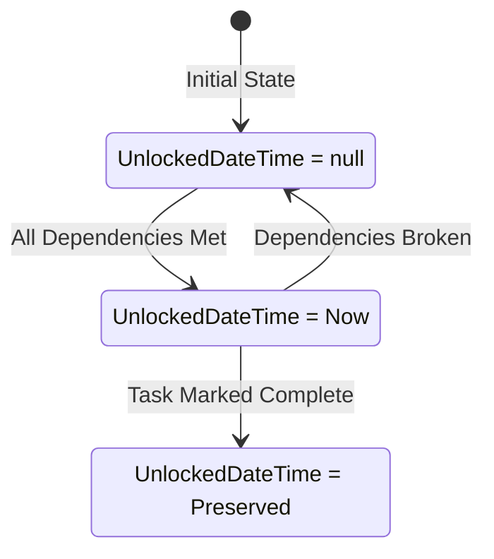
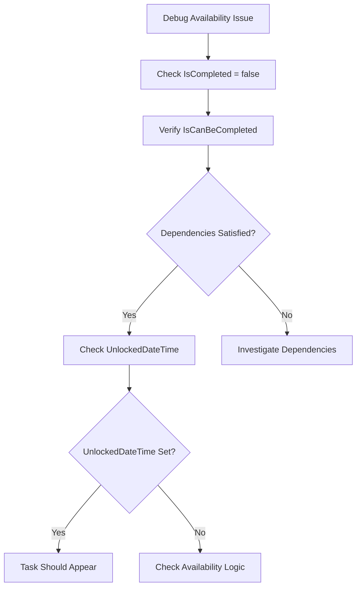

# Active Task State

<cite>
**Referenced Files in This Document**
- [TaskItem.cs](file://src/Unlimotion.Domain/TaskItem.cs)
- [TaskItemViewModel.cs](file://src/Unlimotion.ViewModel/TaskItemViewModel.cs)
- [UnlockedTimeFilter.cs](file://src/Unlimotion.ViewModel/UnlockedTimeFilter.cs)
- [MainWindowViewModel.cs](file://src/Unlimotion.ViewModel/MainWindowViewModel.cs)
- [TaskTreeManager.cs](file://src/Unlimotion.TaskTreeManager/TaskTreeManager.cs)
- [TaskAvailabilityCalculationTests.cs](file://src/Unlimotion.Test/TaskAvailabilityCalculationTests.cs)
</cite>

## Table of Contents
1. [Introduction](#introduction)
2. [Task State Architecture](#task-state-architecture)
3. [Active Task Properties](#active-task-properties)
4. [UI Display and Filtering](#ui-display-and-filtering)
5. [Task Availability Logic](#task-availability-logic)
6. [UnlockedDateTime Behavior](#unlockeddatetime-behavior)
7. [Common Issues and Troubleshooting](#common-issues-and-troubleshooting)
8. [Implementation Examples](#implementation-examples)
9. [Best Practices](#best-practices)

## Introduction

In Unlimotion, active tasks represent work items that are currently available for completion. These tasks are characterized by having `IsCompleted = false`, indicating they are neither finished nor archived. The active task state plays a crucial role in the task management system, particularly in dependency chains, availability calculations, and UI filtering mechanisms.

Active tasks form the backbone of the task hierarchy, serving as candidates for completion while maintaining relationships with other tasks through containment, blocking, and parent-child connections. Understanding how these tasks behave and are displayed is essential for effective task management within the application.

## Task State Architecture

The task state system in Unlimotion follows a hierarchical structure where active tasks serve as the foundation for task availability calculations and UI presentation.



**Diagram sources**
- [TaskItem.cs](file://src/Unlimotion.Domain/TaskItem.cs#L6-L32)
- [TaskItemViewModel.cs](file://src/Unlimotion.ViewModel/TaskItemViewModel.cs#L18-L665)
- [TaskTreeManager.cs](file://src/Unlimotion.TaskTreeManager/TaskTreeManager.cs#L629-L720)

**Section sources**
- [TaskItem.cs](file://src/Unlimotion.Domain/TaskItem.cs#L6-L32)
- [TaskItemViewModel.cs](file://src/Unlimotion.ViewModel/TaskItemViewModel.cs#L18-L665)

## Active Task Properties

### Core Properties for Active Tasks

Active tasks in Unlimotion are identified by specific property combinations that define their state and behavior within the system.

| Property | Type | Default Value | Description |
|----------|------|---------------|-------------|
| `IsCompleted` | `bool?` | `false` | Indicates task completion status (false = active, true = completed, null = archived) |
| `IsCanBeCompleted` | `bool` | `true` | Calculated availability indicator based on dependencies |
| `UnlockedDateTime` | `DateTimeOffset?` | `null` | Timestamp when task became available for completion |
| `CreatedDateTime` | `DateTimeOffset` | `DateTimeOffset.UtcNow` | Task creation timestamp |

### State Initialization

Active tasks are initialized with specific default values that establish their baseline state:



**Diagram sources**
- [TaskItem.cs](file://src/Unlimotion.Domain/TaskItem.cs#L10-L11)
- [TaskTreeManager.cs](file://src/Unlimotion.TaskTreeManager/TaskTreeManager.cs#L629-L720)

**Section sources**
- [TaskItem.cs](file://src/Unlimotion.Domain/TaskItem.cs#L10-L11)
- [TaskTreeManager.cs](file://src/Unlimotion.TaskTreeManager/TaskTreeManager.cs#L629-L720)

## UI Display and Filtering

### All Tasks View

The All Tasks view displays all tasks regardless of completion status, with filtering controls that allow users to show or hide completed and archived tasks.



**Diagram sources**
- [MainWindowViewModel.cs](file://src/Unlimotion.ViewModel/MainWindowViewModel.cs#L215-L247)
- [MainWindowViewModel.cs](file://src/Unlimotion.ViewModel/MainWindowViewModel.cs#L473-L503)

### Unlocked View

The Unlocked view specifically targets tasks that are available for immediate completion, determined by the `IsUnlocked` predicate.



**Diagram sources**
- [UnlockedTimeFilter.cs](file://src/Unlimotion.ViewModel/UnlockedTimeFilter.cs#L54)
- [MainWindowViewModel.cs](file://src/Unlimotion.ViewModel/MainWindowViewModel.cs#L473-L503)

**Section sources**
- [MainWindowViewModel.cs](file://src/Unlimotion.ViewModel/MainWindowViewModel.cs#L215-L247)
- [UnlockedTimeFilter.cs](file://src/Unlimotion.ViewModel/UnlockedTimeFilter.cs#L54)

## Task Availability Logic

### Dependency Chain Evaluation

Active tasks participate in complex dependency chains that determine their availability for completion. The system evaluates multiple factors to calculate whether a task can be marked as available.



**Diagram sources**
- [TaskTreeManager.cs](file://src/Unlimotion.TaskTreeManager/TaskTreeManager.cs#L629-L720)

### Business Rules Implementation

The availability calculation follows strict business rules that ensure logical task progression:

1. **Contained Tasks Requirement**: All tasks contained within must be completed (IsCompleted != false)
2. **Blocking Tasks Requirement**: All tasks blocking this task must be completed (IsCompleted != false)
3. **Archived Tasks Consideration**: Archived tasks (IsCompleted = null) are treated as completed for availability purposes

**Section sources**
- [TaskTreeManager.cs](file://src/Unlimotion.TaskTreeManager/TaskTreeManager.cs#L629-L720)
- [TaskAvailabilityCalculationTests.cs](file://src/Unlimotion.Test/TaskAvailabilityCalculationTests.cs#L15-L47)

## UnlockedDateTime Behavior

### Automatic Timestamp Management

The `UnlockedDateTime` property serves as a marker for when a task becomes available for completion. The system automatically manages this timestamp based on availability changes.



### Timestamp Scenarios

| Scenario | Condition | UnlockedDateTime Action |
|----------|-----------|------------------------|
| **New Task** | Task created with no dependencies | `null` (not yet available) |
| **Task Becomes Available** | All dependencies satisfied | Set to `DateTimeOffset.UtcNow` |
| **Task Becomes Blocked** | Dependencies broken | Cleared to `null` |
| **Task Completion** | Marked as completed | Preserved for historical reference |
| **Task Archival** | Moved to archived state | Preserved for historical reference |

**Section sources**
- [TaskTreeManager.cs](file://src/Unlimotion.TaskTreeManager/TaskTreeManager.cs#L685-L705)
- [TaskAvailabilityCalculationTests.cs](file://src/Unlimotion.Test/TaskAvailabilityCalculationTests.cs#L231-L272)

## Common Issues and Troubleshooting

### Tasks Not Appearing When Expected

Several common scenarios can cause active tasks to not appear in expected views:

#### Issue 1: Incorrect Unlocking Logic
**Symptom**: Task appears in All Tasks but not in Unlocked view despite having no blocking dependencies.

**Cause**: The task's availability calculation may be incorrect due to:
- Circular dependencies
- Incorrect dependency relationships
- Stale availability cache

**Solution**: Verify dependency relationships and trigger availability recalculation:
```csharp
// Force recalculation of task availability
await taskTreeManager.CalculateAndUpdateAvailability(task);
```

#### Issue 2: Dependency Chain Problems
**Symptom**: Task is blocked by another task that appears to be completed.

**Cause**: The blocking task may have:
- `IsCompleted = false` (still active)
- Circular dependencies
- Incorrect parent-child relationships

**Solution**: Check dependency relationships and resolve conflicts:
```csharp
// Verify blocking task status
var blockingTask = await storage.Load(blockingTaskId);
Console.WriteLine($"Blocking task {blockingTaskId}: IsCompleted = {blockingTask.IsCompleted}");
```

#### Issue 3: UI Refresh Delays
**Symptom**: Changes to task dependencies don't immediately reflect in UI.

**Cause**: The reactive UI bindings may have throttled updates or caching issues.

**Solution**: Force UI refresh or adjust throttle timing:
```csharp
// Adjust property changed throttle
taskItemViewModel.PropertyChangedThrottleTimeSpanDefault = TimeSpan.Zero;
```

### Debugging Availability Issues

To diagnose availability problems, examine these key properties:



**Section sources**
- [TaskTreeManager.cs](file://src/Unlimotion.TaskTreeManager/TaskTreeManager.cs#L629-L720)
- [TaskAvailabilityCalculationTests.cs](file://src/Unlimotion.Test/TaskAvailabilityCalculationTests.cs#L158-L235)

## Implementation Examples

### Basic Task Creation and Display

```csharp
// Create a new active task
var newTask = new TaskItemViewModel(new TaskItem(), taskStorage);
newTask.Title = "My Active Task";
newTask.IsCompleted = false; // Explicitly set as active

// UI binding automatically handles display
// Task will appear in All Tasks view immediately
// Will appear in Unlocked view if IsCanBeCompleted = true
```

### Dependency-Based Availability

```csharp
// Create parent task with dependencies
var parentTask = new TaskItemViewModel(new TaskItem(), taskStorage);
parentTask.Title = "Parent Task";

// Create child task that must be completed first
var childTask = new TaskItemViewModel(new TaskItem(), taskStorage);
childTask.Title = "Child Task";
childTask.IsCompleted = false;

// Establish dependency relationship
parentTask.Contains.Add(childTask.Id);
childTask.Parents.Add(parentTask.Id);

// Initially blocked - child not completed
Assert.False(parentTask.IsCanBeCompleted);
Assert.Null(parentTask.UnlockedDateTime);

// Complete child task
childTask.IsCompleted = true;

// Parent becomes available automatically
Assert.True(parentTask.IsCanBeCompleted);
Assert.NotNull(parentTask.UnlockedDateTime);
```

### Manual Availability Recalculation

```csharp
// Force recalculation of task availability
var affectedTasks = await taskTreeManager.CalculateAndUpdateAvailability(task);

// Process all affected tasks
foreach (var affectedTask in affectedTasks)
{
    Console.WriteLine($"Task {affectedTask.Id}: IsCanBeCompleted = {affectedTask.IsCanBeCompleted}");
    Console.WriteLine($"Unlocked at: {affectedTask.UnlockedDateTime}");
}
```

**Section sources**
- [TaskItemViewModel.cs](file://src/Unlimotion.ViewModel/TaskItemViewModel.cs#L18-L665)
- [TaskTreeManager.cs](file://src/Unlimotion.TaskTreeManager/TaskTreeManager.cs#L629-L720)

## Best Practices

### Task State Management

1. **Explicit State Setting**: Always explicitly set `IsCompleted = false` for active tasks
2. **Dependency Validation**: Regularly validate dependency relationships to prevent stale availability states
3. **Availability Monitoring**: Monitor `IsCanBeCompleted` changes to detect availability issues early

### UI Performance Optimization

1. **Throttled Updates**: Use appropriate throttle timing for property changes to balance responsiveness and performance
2. **Selective Filtering**: Apply filters efficiently to minimize UI update overhead
3. **Batch Operations**: Group related task modifications to reduce availability recalculation cycles

### Error Prevention

1. **Circular Dependency Detection**: Implement checks to prevent circular dependency chains
2. **Stale Cache Handling**: Clear availability caches when significant dependency changes occur
3. **Validation Rules**: Enforce business rules consistently across all task modification paths

### Development Guidelines

1. **Consistent Property Usage**: Use `IsCompleted = false` consistently for active tasks
2. **Availability Calculation**: Trigger availability recalculation after significant dependency changes
3. **Testing Coverage**: Include tests for various dependency scenarios and edge cases