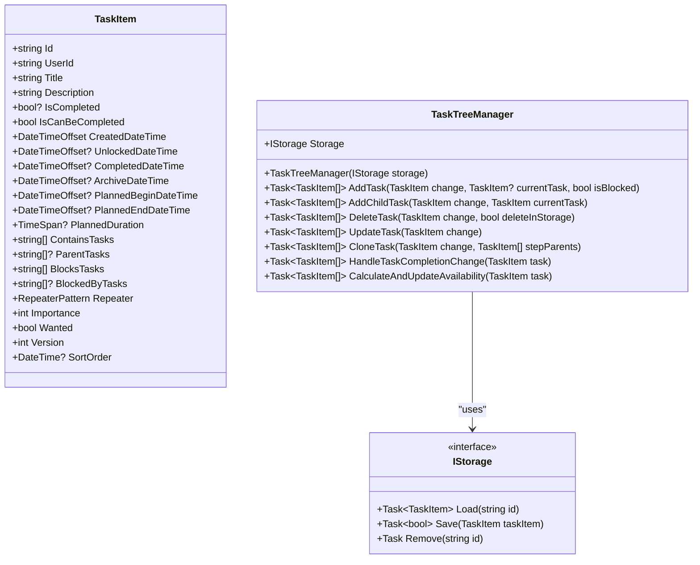
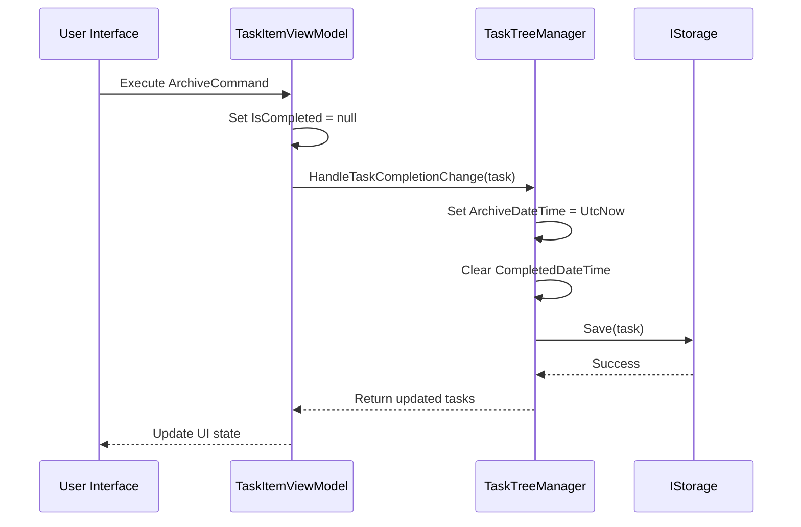
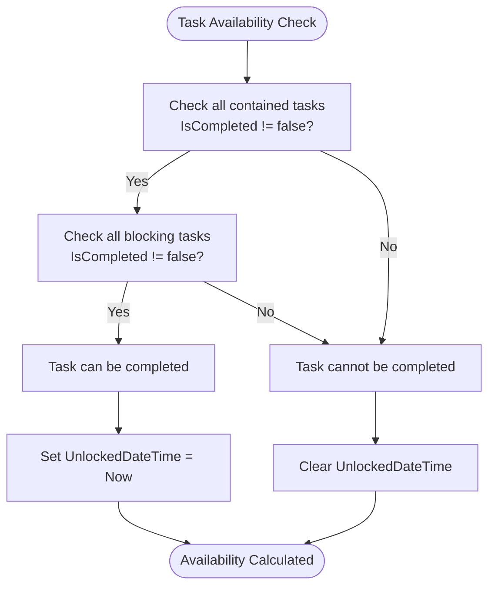
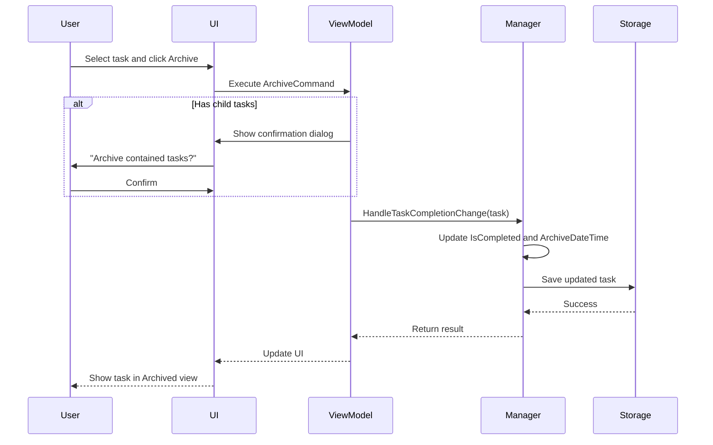
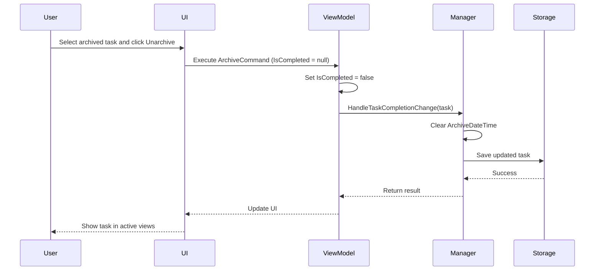

# Archived Task State

<cite>
**Referenced Files in This Document**   
- [TaskItem.cs](file://src/Unlimotion.Domain/TaskItem.cs)
- [TaskTreeManager.cs](file://src/Unlimotion.TaskTreeManager/TaskTreeManager.cs)
- [TaskItemViewModel.cs](file://src/Unlimotion.ViewModel/TaskItemViewModel.cs)
- [MainWindowViewModel.cs](file://src/Unlimotion.ViewModel/MainWindowViewModel.cs)
- [TaskCompletionChangeTests.cs](file://src/Unlimotion.Test/TaskCompletionChangeTests.cs)
- [MainWindowViewModelTests.cs](file://src/Unlimotion.Test/MainWindowViewModelTests.cs)
- [SettingsViewModel.cs](file://src/Unlimotion.ViewModel/SettingsViewModel.cs)
- [README.md](file://README.md)
</cite>

## Table of Contents
1. [Introduction](#introduction)
2. [Core Architecture](#core-architecture)
3. [Archived State Implementation](#archived-state-implementation)
4. [Dependency Resolution Logic](#dependency-resolution-logic)
5. [UI Presentation and Filtering](#ui-presentation-and-filtering)
6. [Use Cases and Workflow](#use-cases-and-workflow)
7. [Recovery Procedures](#recovery-procedures)
8. [Common Issues](#common-issues)
9. [Conclusion](#conclusion)

## Introduction
The archived task state in Unlimotion represents a distinct lifecycle phase for tasks that are no longer active but need to be preserved for historical purposes. This state is implemented through the `IsCompleted = null` value in the `TaskItem` class, differentiating it from both completed (`IsCompleted = true`) and active (`IsCompleted = false`) tasks. The archiving mechanism allows users to remove clutter from active views while maintaining task history and relationships. This documentation explains the implementation details, business logic, and user interface aspects of the archived task state.

**Section sources**
- [TaskItem.cs](file://src/Unlimotion.Domain/TaskItem.cs#L16)
- [README.md](file://README.md#L82-L114)

## Core Architecture
The archived task state is implemented through a combination of data model properties and business logic in the TaskTreeManager. The core components include:

- **IsCompleted**: Nullable boolean property that determines task state
- **ArchiveDateTime**: Timestamp recording when a task was archived
- **TaskTreeManager**: Central service handling state transitions and dependency calculations

The architecture follows a clean separation between data storage, business logic, and presentation layers. The `TaskItem` class in the Domain layer defines the data structure, while the `TaskTreeManager` in the TaskTree layer implements the business rules for state transitions.



**Diagram sources**
- [TaskItem.cs](file://src/Unlimotion.Domain/TaskItem.cs#L10-L32)
- [TaskTreeManager.cs](file://src/Unlimotion.TaskTreeManager/TaskTreeManager.cs#L10-L837)

**Section sources**
- [TaskItem.cs](file://src/Unlimotion.Domain/TaskItem.cs#L10-L32)
- [TaskTreeManager.cs](file://src/Unlimotion.TaskTreeManager/TaskTreeManager.cs#L10-L837)

## Archived State Implementation
The archived state is implemented through the `IsCompleted = null` value in the `TaskItem` class, which serves as a distinct state from both completed and active tasks. When a task is archived, the `ArchiveDateTime` property is set to the current timestamp, providing an audit trail of when the archiving occurred.

The archiving process is handled by the `HandleTaskCompletionChange` method in `TaskTreeManager`, which implements the following logic:

1. When `IsCompleted` is set to `null`, the `ArchiveDateTime` is set to `DateTimeOffset.UtcNow`
2. The `CompletedDateTime` is cleared if previously set
3. The task is saved to storage with the updated state

The implementation ensures that archiving is atomic and consistent through the use of retry policies and transactional operations. The `IsCompletedAsync` method wraps operations in a retry policy that ensures completion within a specified timeout period.



**Diagram sources**
- [TaskTreeManager.cs](file://src/Unlimotion.TaskTreeManager/TaskTreeManager.cs#L770-L836)
- [TaskItemViewModel.cs](file://src/Unlimotion.ViewModel/TaskItemViewModel.cs#L136-L171)

**Section sources**
- [TaskTreeManager.cs](file://src/Unlimotion.TaskTreeManager/TaskTreeManager.cs#L770-L836)
- [TaskItemViewModel.cs](file://src/Unlimotion.ViewModel/TaskItemViewModel.cs#L136-L171)

## Dependency Resolution Logic
Archived tasks are treated as completed for dependency resolution purposes, which means they do not block the completion of parent or dependent tasks. This behavior is implemented in the `CalculateAvailabilityForTask` method of `TaskTreeManager`, which evaluates task availability based on the condition `IsCompleted != false`.

The dependency resolution logic follows these rules:
1. A task can be completed if all contained tasks have `IsCompleted != false`
2. A task can be completed if all blocking tasks have `IsCompleted != false`
3. Tasks with `IsCompleted = null` (archived) satisfy these conditions

This implementation allows archived tasks to be effectively "removed" from dependency calculations while preserving their historical state. The logic is validated in unit tests that specifically check the behavior of archived tasks in dependency chains.



**Diagram sources**
- [TaskTreeManager.cs](file://src/Unlimotion.TaskTreeManager/TaskTreeManager.cs#L650-L750)
- [TaskAvailabilityCalculationTests.cs](file://src/Unlimotion.Test/TaskAvailabilityCalculationTests.cs#L0-L47)

**Section sources**
- [TaskTreeManager.cs](file://src/Unlimotion.TaskTreeManager/TaskTreeManager.cs#L650-L750)
- [TaskAvailabilityCalculationTests.cs](file://src/Unlimotion.Test/TaskAvailabilityCalculationTests.cs#L0-L47)

## UI Presentation and Filtering
The user interface presents archived tasks in a dedicated "Archived" tab, separate from active, completed, and other task views. The filtering and presentation logic is implemented in `MainWindowViewModel`, which binds to the task repository and applies specific filters for archived tasks.

Key UI components and behaviors:
- **Archived Tab**: Dedicated view showing only archived tasks
- **Sorting**: Tasks sorted by `ArchiveDateTime` in descending order
- **Filtering**: Date-based filtering using `ArchivedDateFilter`
- **Settings**: User preferences for showing archived tasks

The UI implementation uses reactive programming patterns to automatically update when task states change. The `Connect()` method establishes a reactive connection to the task repository, and filters are applied to show only tasks where `IsCompleted == null`.

```mermaid
graph TB
subgraph "UI Components"
A[MainWindowViewModel]
B[TaskItemViewModel]
C[Archived Tab]
D[ArchivedDateFilter]
end
A --> C: Binds ArchivedItems
A --> D: Manages filter state
B --> A: Provides task data
C --> A: Displays filtered tasks
D --> A: Provides date filtering
A --> |Filter| B: IsCompleted == null
A --> |Sort| B: By ArchiveDateTime Descending
```

**Diagram sources**
- [MainWindowViewModel.cs](file://src/Unlimotion.ViewModel/MainWindowViewModel.cs#L620-L655)
- [TaskItemViewModel.cs](file://src/Unlimotion.ViewModel/TaskItemViewModel.cs#L136-L171)

**Section sources**
- [MainWindowViewModel.cs](file://src/Unlimotion.ViewModel/MainWindowViewModel.cs#L620-L655)
- [TaskItemViewModel.cs](file://src/Unlimotion.ViewModel/TaskItemViewModel.cs#L136-L171)

## Use Cases and Workflow
The primary use case for archiving tasks is to remove clutter from active views while preserving task history and relationships. This is particularly useful for:

- **Completed Projects**: Tasks from finished projects that may be referenced later
- **Deferred Tasks**: Tasks that are no longer relevant but might be reconsidered
- **Historical Reference**: Tasks that provide context for current work

The archiving workflow follows these steps:
1. User selects a task and clicks the Archive button
2. System prompts for confirmation, including child tasks
3. Task state is updated to `IsCompleted = null`
4. `ArchiveDateTime` is set to current timestamp
5. Task is removed from active views and moved to archived view

The system also supports bulk archiving of task hierarchies, where archiving a parent task automatically archives all child tasks. This ensures consistency in the task hierarchy and prevents orphaned tasks.



**Diagram sources**
- [TaskItemViewModel.cs](file://src/Unlimotion.ViewModel/TaskItemViewModel.cs#L534-L573)
- [MainWindowViewModelTests.cs](file://src/Unlimotion.Test/MainWindowViewModelTests.cs#L422-L454)

**Section sources**
- [TaskItemViewModel.cs](file://src/Unlimotion.ViewModel/TaskItemViewModel.cs#L534-L573)
- [MainWindowViewModelTests.cs](file://src/Unlimotion.Test/MainWindowViewModelTests.cs#L422-L454)

## Recovery Procedures
Recovering archived tasks (unarchiving) follows a reverse process to archiving. When a user unarchives a task, the system sets `IsCompleted = false` and clears the `ArchiveDateTime`. This restores the task to an active state where it can be worked on again.

The recovery process includes:
1. User selects an archived task and clicks the Unarchive button
2. System updates the task state to `IsCompleted = false`
3. `ArchiveDateTime` is set to null
4. Task is moved from archived view to active views

The implementation ensures that unarchiving maintains the task's original relationships and properties. Child tasks are also unarchived if they were archived with the parent task, preserving the hierarchy structure.



**Diagram sources**
- [TaskItemViewModel.cs](file://src/Unlimotion.ViewModel/TaskItemViewModel.cs#L136-L171)
- [MainWindowViewModelTests.cs](file://src/Unlimotion.Test/MainWindowViewModelTests.cs#L451-L478)

**Section sources**
- [TaskItemViewModel.cs](file://src/Unlimotion.ViewModel/TaskItemViewModel.cs#L136-L171)
- [MainWindowViewModelTests.cs](file://src/Unlimotion.Test/MainWindowViewModelTests.cs#L451-L478)

## Common Issues
Several common issues may arise with the archived task state:

**Accidental Archiving**: Users may accidentally archive tasks. The system mitigates this through confirmation dialogs that prompt users before archiving, especially when child tasks are involved.

**State Confusion**: Users may confuse archived tasks with completed tasks. The UI addresses this by providing separate views for completed and archived tasks, with clear visual distinction.

**Bulk Operations**: Archiving/unarchiving task hierarchies can lead to unintended consequences. The system handles this by prompting users about child tasks and requiring explicit confirmation.

**Data Integrity**: Ensuring that archived tasks maintain their relationships and properties during state transitions. The implementation uses transactional operations and validation to maintain data integrity.

These issues are addressed through a combination of UI design, confirmation workflows, and robust backend validation.

**Section sources**
- [TaskItemViewModel.cs](file://src/Unlimotion.ViewModel/TaskItemViewModel.cs#L534-L573)
- [MainWindowViewModelTests.cs](file://src/Unlimotion.Test/MainWindowViewModelTests.cs#L422-L478)

## Conclusion
The archived task state in Unlimotion provides a sophisticated mechanism for managing task lifecycle beyond simple completion. By using `IsCompleted = null` as a distinct state, the system enables users to remove clutter from active views while preserving historical data and maintaining dependency relationships. The implementation is robust, with proper handling of edge cases, bulk operations, and data integrity. The separation between archiving and completion allows for nuanced task management that supports complex workflows while maintaining simplicity in the user interface.

**Section sources**
- [TaskItem.cs](file://src/Unlimotion.Domain/TaskItem.cs#L16)
- [TaskTreeManager.cs](file://src/Unlimotion.TaskTreeManager/TaskTreeManager.cs#L770-L836)
- [README.md](file://README.md#L82-L114)