# Completed Task State

<cite>
**Referenced Files in This Document**
- [TaskItem.cs](file://src/Unlimotion.Domain/TaskItem.cs)
- [TaskItemViewModel.cs](file://src/Unlimotion.ViewModel/TaskItemViewModel.cs)
- [TaskTreeManager.cs](file://src/Unlimotion.TaskTreeManager/TaskTreeManager.cs)
- [MainWindowViewModel.cs](file://src/Unlimotion.ViewModel/MainWindowViewModel.cs)
- [TaskCompletionChangeTests.cs](file://src/Unlimotion.Test/TaskCompletionChangeTests.cs)
- [TaskAvailabilityCalculationTests.cs](file://src/Unlimotion.Test/TaskAvailabilityCalculationTests.cs)
- [MainWindowViewModelTests.cs](file://src/Unlimotion.Test/MainWindowViewModelTests.cs)
</cite>

## Table of Contents
1. [Introduction](#introduction)
2. [Task Completion State Architecture](#task-completion-state-architecture)
3. [Completed Task State Properties](#completed-task-state-properties)
4. [Task Completion Transition Process](#task-completion-transition-process)
5. [Timestamp Management](#timestamp-management)
6. [Parent Task Automatic Completion](#parent-task-automatic-completion)
7. [Blocked Task Unlocking](#blocked-task-unlocking)
8. [TaskItemViewModel Command Handling](#taskitemviewmodel-command-handling)
9. [Edge Cases and Bypass Scenarios](#edge-cases-and-bypass-scenarios)
10. [View-Specific Behavior](#view-specific-behavior)
11. [Testing and Validation](#testing-and-validation)
12. [Troubleshooting Guide](#troubleshooting-guide)

## Introduction

The completed task state in Unlimotion represents tasks that have been successfully finished, marked by setting `IsCompleted = true`. This state transition involves complex business logic that manages timestamps, parent-child relationships, and blocked task dependencies. The system ensures that completion affects related tasks appropriately while maintaining data consistency across all views.

## Task Completion State Architecture

The task completion system operates through a layered architecture that separates business logic from presentation concerns:

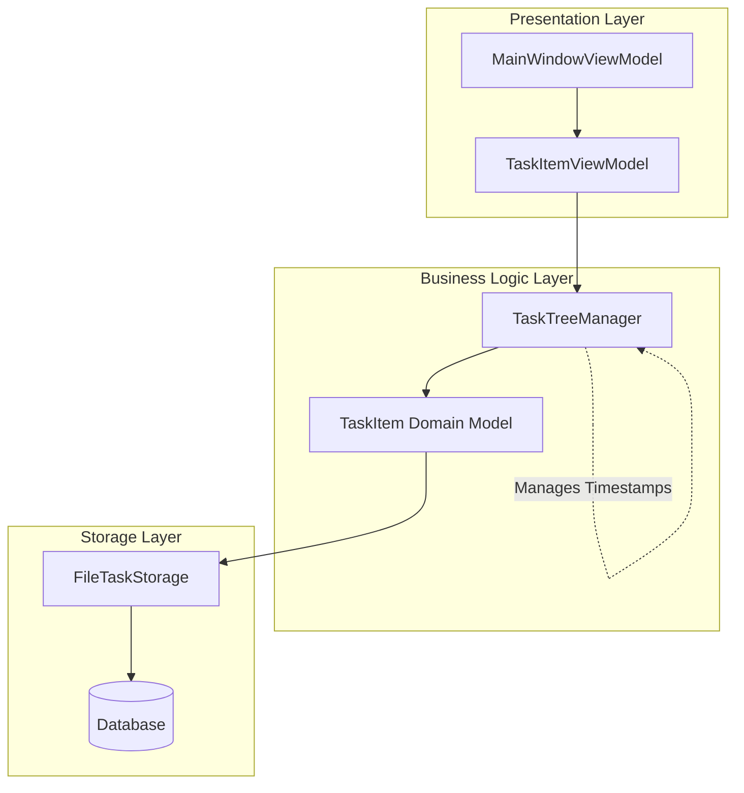

**Diagram sources**
- [TaskItemViewModel.cs](file://src/Unlimotion.ViewModel/TaskItemViewModel.cs#L15-L50)
- [TaskTreeManager.cs](file://src/Unlimotion.TaskTreeManager/TaskTreeManager.cs#L15-L50)

**Section sources**
- [TaskItemViewModel.cs](file://src/Unlimotion.ViewModel/TaskItemViewModel.cs#L15-L100)
- [TaskTreeManager.cs](file://src/Unlimotion.TaskTreeManager/TaskTreeManager.cs#L15-L100)

## Completed Task State Properties

The completed task state is managed through several key properties in the TaskItem domain model:

| Property | Type | Purpose | Default Value |
|----------|------|---------|---------------|
| `IsCompleted` | `bool?` | Primary completion indicator | `false` |
| `CompletedDateTime` | `DateTimeOffset?` | Timestamp of completion | `null` |
| `ArchiveDateTime` | `DateTimeOffset?` | Timestamp of archiving | `null` |
| `IsCanBeCompleted` | `bool` | Availability for completion | `true` |
| `UnlockedDateTime` | `DateTimeOffset?` | Timestamp of availability | `null` |

### Property Interactions

The properties work together to manage task lifecycle states:

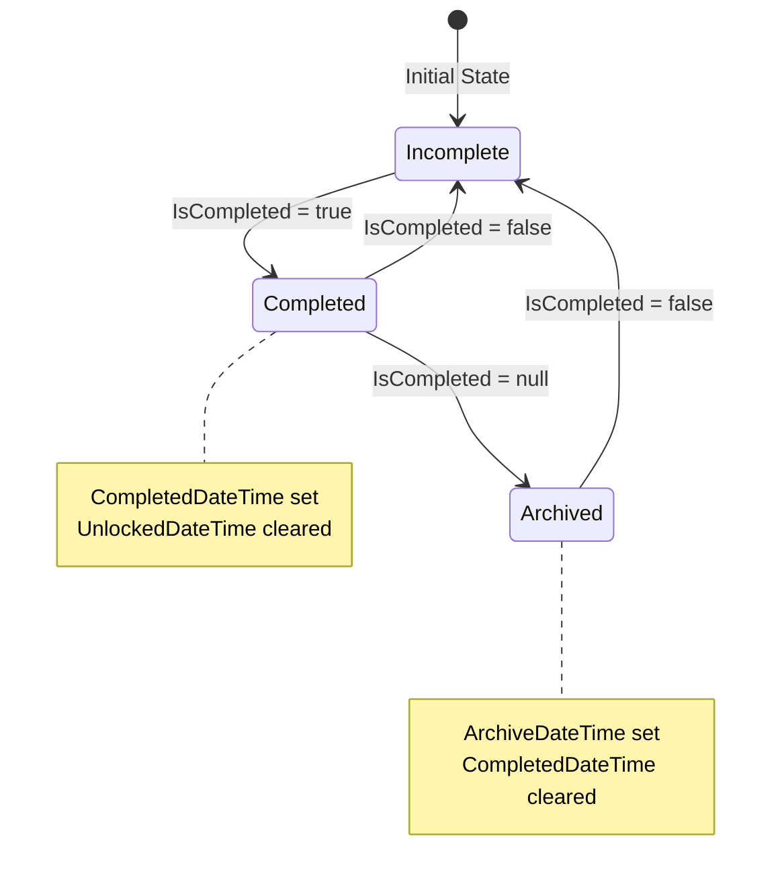

**Diagram sources**
- [TaskItem.cs](file://src/Unlimotion.Domain/TaskItem.cs#L8-L15)
- [TaskTreeManager.cs](file://src/Unlimotion.TaskTreeManager/TaskTreeManager.cs#L770-L820)

**Section sources**
- [TaskItem.cs](file://src/Unlimotion.Domain/TaskItem.cs#L8-L15)

## Task Completion Transition Process

The completion transition process follows a specific sequence that ensures data consistency and proper state management:

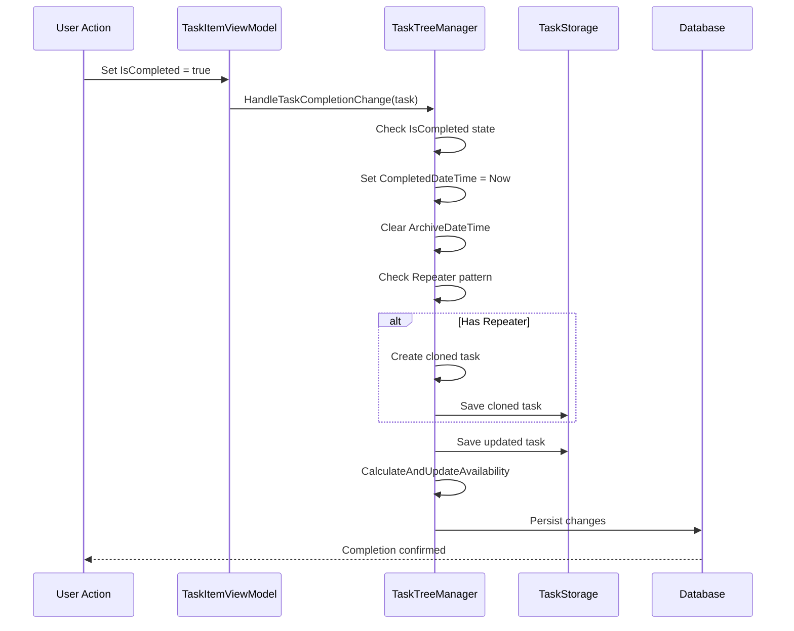

**Diagram sources**
- [TaskTreeManager.cs](file://src/Unlimotion.TaskTreeManager/TaskTreeManager.cs#L770-L820)
- [TaskItemViewModel.cs](file://src/Unlimotion.ViewModel/TaskItemViewModel.cs#L80-L90)

### Completion State Transitions

The system handles three primary completion states:

1. **Marking as Completed** (`IsCompleted = true`)
   - Sets `CompletedDateTime` to current timestamp
   - Clears `ArchiveDateTime`
   - Triggers repeater logic if applicable
   - Recalculates availability for affected tasks

2. **Marking as Incomplete** (`IsCompleted = false`)
   - Clears both timestamps
   - Restores availability for the task
   - Propagates availability changes upward

3. **Archiving** (`IsCompleted = null`)
   - Sets `ArchiveDateTime` to current timestamp
   - Clears `CompletedDateTime`
   - Marks task as archived

**Section sources**
- [TaskTreeManager.cs](file://src/Unlimotion.TaskTreeManager/TaskTreeManager.cs#L770-L820)
- [TaskCompletionChangeTests.cs](file://src/Unlimotion.Test/TaskCompletionChangeTests.cs#L10-L85)

## Timestamp Management

Timestamp management is crucial for tracking task progress and enabling time-based filtering:

### CompletedDateTime Management

The `CompletedDateTime` property is automatically set when a task transitions to completed:

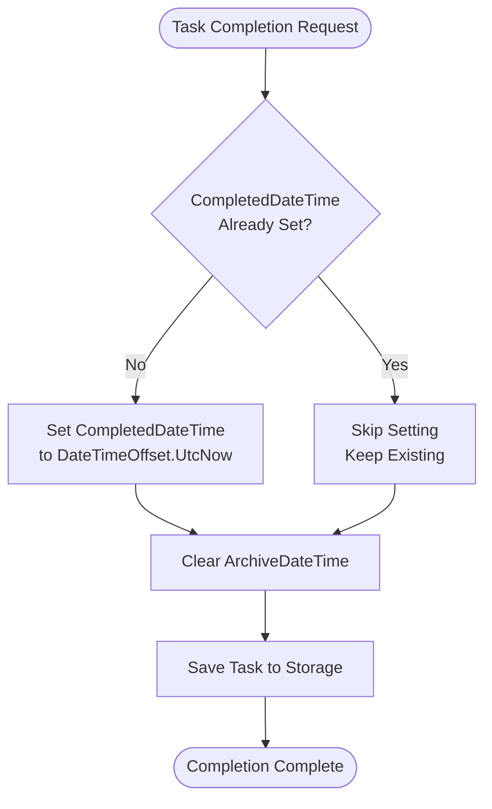

**Diagram sources**
- [TaskTreeManager.cs](file://src/Unlimotion.TaskTreeManager/TaskTreeManager.cs#L775-L780)

### ArchiveDateTime Management

The `ArchiveDateTime` property tracks when tasks are moved to the archived state:

| Scenario | ArchiveDateTime Action | Reason |
|----------|----------------------|---------|
| Complete Task | Cleared | Task is actively completed |
| Incomplete Task | Cleared | Task remains available |
| Archive Task | Set to Now | Task moved to archive |
| Unarchive Task | Cleared | Task restored to active |

**Section sources**
- [TaskTreeManager.cs](file://src/Unlimotion.TaskTreeManager/TaskTreeManager.cs#L785-L795)

## Parent Task Automatic Completion

Parent tasks automatically complete when all their contained tasks are completed:

### Availability Calculation Rules

A task can be completed when:
1. **All contained tasks are completed** (`IsCompleted != false`)
2. **All blocking tasks are completed** (`IsCompleted != false`)

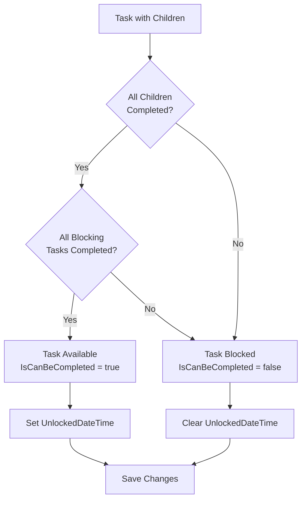

**Diagram sources**
- [TaskTreeManager.cs](file://src/Unlimotion.TaskTreeManager/TaskTreeManager.cs#L629-L699)

### Parent Completion Propagation

When a child task completes, the parent task's availability is recalculated:

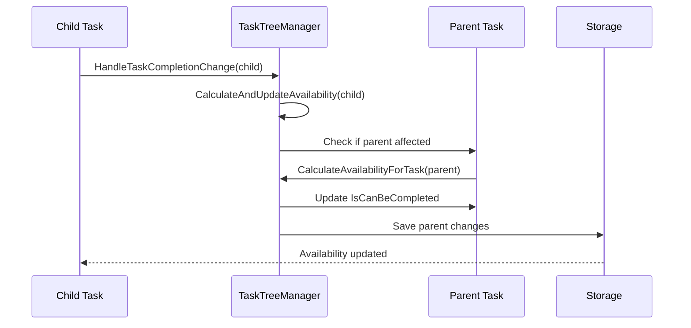

**Diagram sources**
- [TaskTreeManager.cs](file://src/Unlimotion.TaskTreeManager/TaskTreeManager.cs#L697-L737)

**Section sources**
- [TaskTreeManager.cs](file://src/Unlimotion.TaskTreeManager/TaskTreeManager.cs#L629-L699)
- [TaskAvailabilityCalculationTests.cs](file://src/Unlimotion.Test/TaskAvailabilityCalculationTests.cs#L43-L87)

## Blocked Task Unlocking

Blocked tasks become available when their blocking dependencies are resolved:

### Blocking Relationship Management

Tasks can block other tasks through the `BlocksTasks` and `BlockedByTasks` relationships:

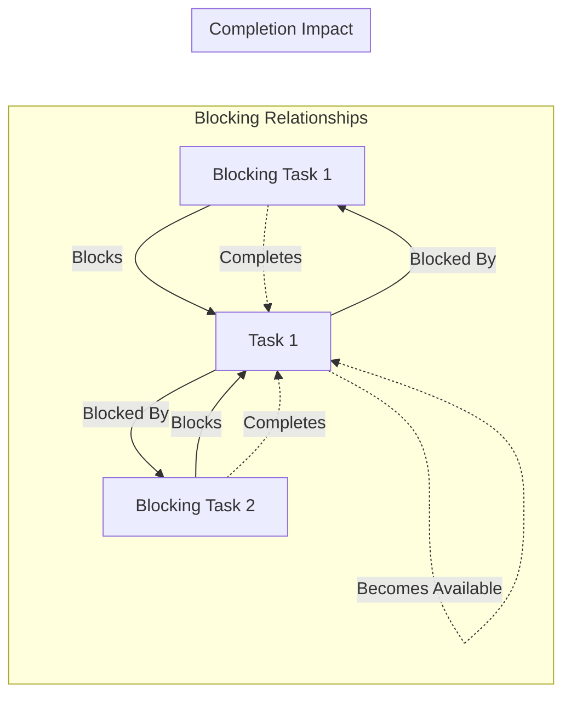

**Diagram sources**
- [TaskTreeManager.cs](file://src/Unlimotion.TaskTreeManager/TaskTreeManager.cs#L486-L527)

### Unlocking Process

When a blocking task completes, the blocked task's availability is recalculated:

1. **Detection**: TaskTreeManager detects completion change
2. **Propagation**: Identifies all tasks blocked by the completed task
3. **Recalculation**: Recalculates availability for each blocked task
4. **Persistence**: Saves updated availability states

**Section sources**
- [TaskTreeManager.cs](file://src/Unlimotion.TaskTreeManager/TaskTreeManager.cs#L486-L527)
- [TaskAvailabilityCalculationTests.cs](file://src/Unlimotion.Test/TaskAvailabilityCalculationTests.cs#L121-L162)

## TaskItemViewModel Command Handling

The TaskItemViewModel manages user interactions and coordinates with the business logic layer:

### Completion Command Flow

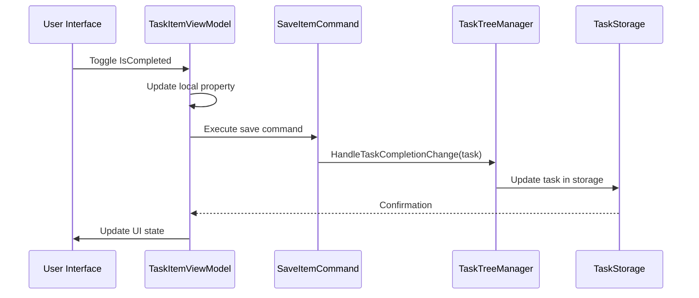

**Diagram sources**
- [TaskItemViewModel.cs](file://src/Unlimotion.ViewModel/TaskItemViewModel.cs#L80-L90)

### Property Change Subscription

The ViewModel subscribes to property changes to trigger saves:

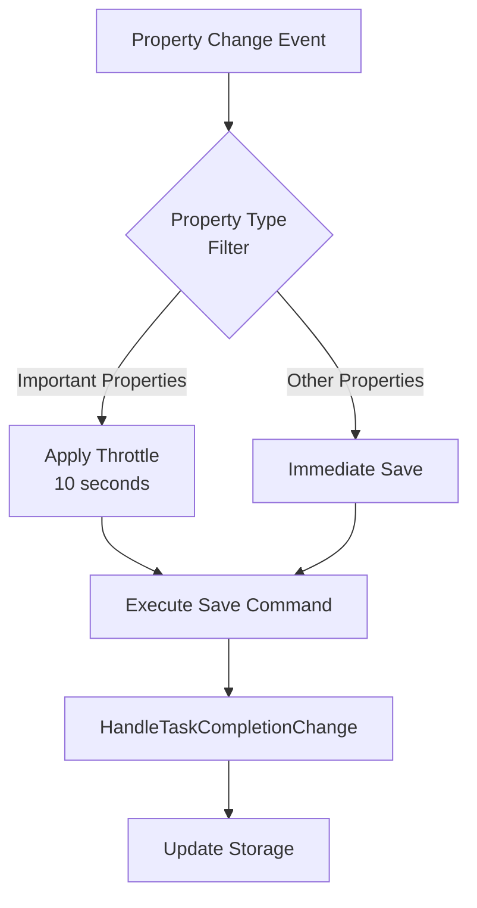

**Diagram sources**
- [TaskItemViewModel.cs](file://src/Unlimotion.ViewModel/TaskItemViewModel.cs#L180-L220)

### Archive Command Implementation

The archive command handles the tri-state completion logic:

| Current State | Action | Result |
|---------------|--------|---------|
| `null` (Archived) | Unarchive | `IsCompleted = false` |
| `false` (Incomplete) | Archive | `IsCompleted = null` |
| `true` (Completed) | No action | Disabled button |

**Section sources**
- [TaskItemViewModel.cs](file://src/Unlimotion.ViewModel/TaskItemViewModel.cs#L136-L171)
- [TaskItemViewModel.cs](file://src/Unlimotion.ViewModel/TaskItemViewModel.cs#L180-L220)

## Edge Cases and Bypass Scenarios

### Completing Tasks with Incomplete Children

The system allows bypassing the "all children must be completed" rule under specific conditions:

#### Normal Completion Rules
- **Standard**: All contained tasks must be completed
- **Exception**: Tasks with `IsCompleted = null` (archived) are ignored

#### Bypass Scenarios

1. **Archived Children**: Tasks marked as archived (`IsCompleted = null`) don't prevent completion
2. **Manual Override**: System allows completion even with incomplete children
3. **Repeater Tasks**: Completed repeater tasks create new instances regardless of children

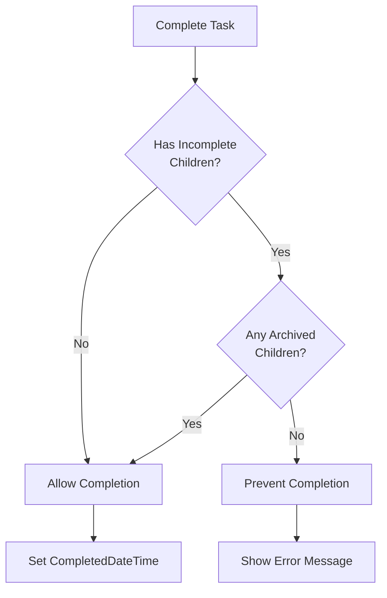

**Diagram sources**
- [TaskTreeManager.cs](file://src/Unlimotion.TaskTreeManager/TaskTreeManager.cs#L662-L675)

### Repeater Task Cloning

Completed tasks with repeater patterns create new instances:

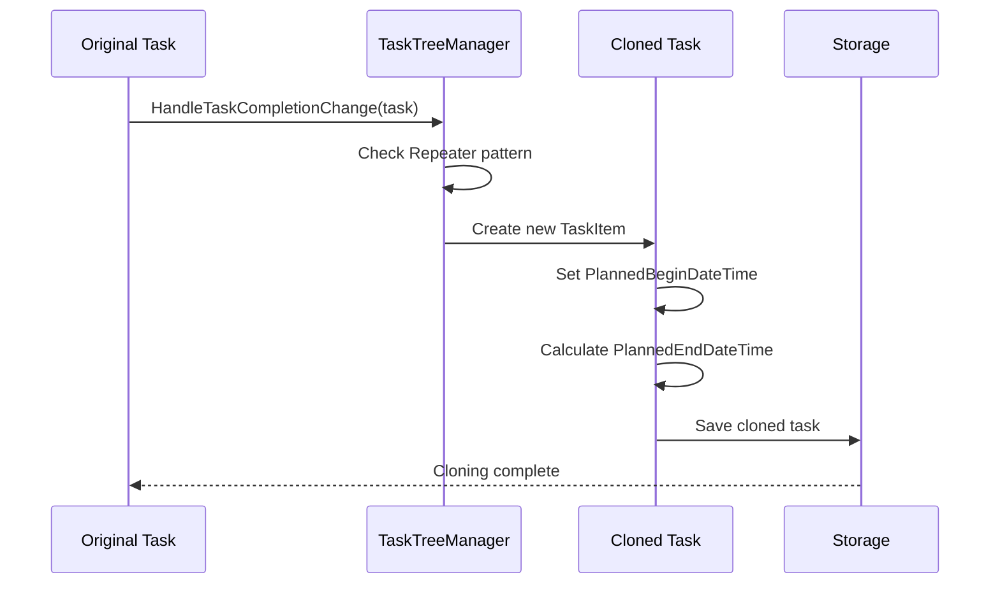

**Diagram sources**
- [TaskTreeManager.cs](file://src/Unlimotion.TaskTreeManager/TaskTreeManager.cs#L780-L810)

**Section sources**
- [TaskTreeManager.cs](file://src/Unlimotion.TaskTreeManager/TaskTreeManager.cs#L780-L810)
- [TaskCompletionChangeTests.cs](file://src/Unlimotion.Test/TaskCompletionChangeTests.cs#L83-L118)

## View-Specific Behavior

### Completed View Filtering

The Completed view displays tasks based on specific criteria:

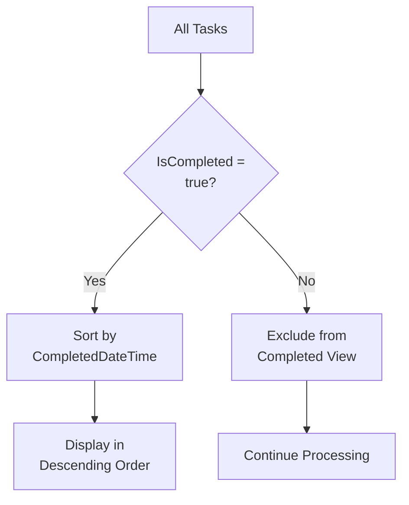

**Diagram sources**
- [MainWindowViewModel.cs](file://src/Unlimotion.ViewModel/MainWindowViewModel.cs#L597-L620)

### Roadmap View Integration

The Roadmap view visualizes task dependencies and completion status:

| Task State | Visual Representation | Color Coding |
|------------|----------------------|--------------|
| Incomplete | Standard task display | Gray/Default |
| Completed | Highlighted with completion icon | Green/Green arrow |
| Archived | Dimmed appearance | Light gray |
| Blocked | Warning indicators | Red/orange |

### Date Filtering Support

Completed tasks support date-based filtering:

- **Creation Date Filter**: Filter by task creation date
- **Completion Date Filter**: Filter by completion timestamp
- **Archive Date Filter**: Filter by archival timestamp

**Section sources**
- [MainWindowViewModel.cs](file://src/Unlimotion.ViewModel/MainWindowViewModel.cs#L597-L620)
- [MainWindowViewModel.cs](file://src/Unlimotion.ViewModel/MainWindowViewModel.cs#L563-L597)

## Testing and Validation

### Unit Test Coverage

The system includes comprehensive testing for completion scenarios:

#### Task Completion Tests
- **Basic Completion**: Verify timestamp setting
- **Repeater Logic**: Test cloning behavior
- **State Transitions**: Validate tri-state logic
- **Edge Cases**: Test with incomplete children

#### Availability Calculation Tests
- **Parent-Child Relationships**: Test automatic completion
- **Blocking Dependencies**: Verify unlock behavior
- **Mixed States**: Test combinations of completion states

### Validation Patterns

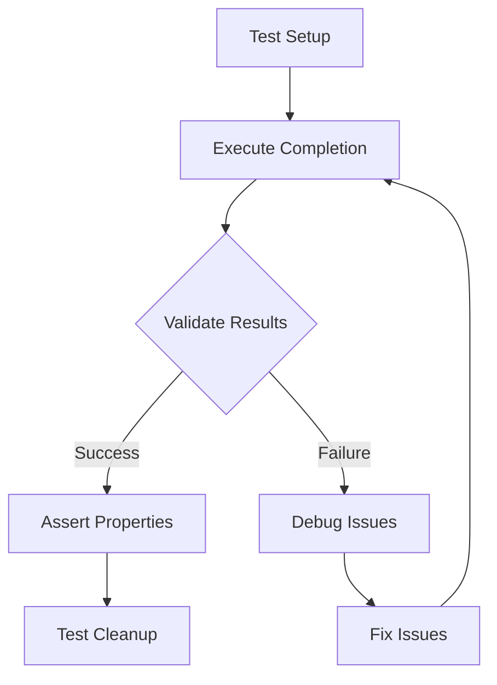

**Diagram sources**
- [TaskCompletionChangeTests.cs](file://src/Unlimotion.Test/TaskCompletionChangeTests.cs#L10-L46)

**Section sources**
- [TaskCompletionChangeTests.cs](file://src/Unlimotion.Test/TaskCompletionChangeTests.cs#L10-L118)
- [TaskAvailabilityCalculationTests.cs](file://src/Unlimotion.Test/TaskAvailabilityCalculationTests.cs#L10-L272)

## Troubleshooting Guide

### Common Completion Issues

#### Issue: Task Won't Complete
**Symptoms**: Button disabled, unable to mark as completed
**Causes**:
- Incomplete child tasks
- Blocking dependencies
- System-level restrictions

**Solutions**:
1. Check child task completion status
2. Verify blocking task dependencies
3. Review task availability calculations

#### Issue: Incorrect Timestamps
**Symptoms**: Wrong completion dates, missing timestamps
**Causes**:
- Timezone differences
- System clock issues
- Storage synchronization problems

**Solutions**:
1. Verify system timezone settings
2. Check database timestamp consistency
3. Review storage synchronization logs

#### Issue: Parent Task Not Completing
**Symptoms**: Parent remains incomplete despite child completion
**Causes**:
- Circular dependencies
- Incorrect relationship mapping
- Availability calculation errors

**Solutions**:
1. Validate parent-child relationships
2. Check for circular dependencies
3. Review availability calculation logic

### Debugging Tools

#### Logging and Monitoring
- Task completion events
- Availability calculation logs
- Timestamp validation reports

#### Diagnostic Queries
- Task relationship verification
- Availability state checking
- Timestamp consistency validation

**Section sources**
- [TaskAvailabilityCalculationTests.cs](file://src/Unlimotion.Test/TaskAvailabilityCalculationTests.cs#L231-L272)
- [MainWindowViewModelTests.cs](file://src/Unlimotion.Test/MainWindowViewModelTests.cs#L477-L510)