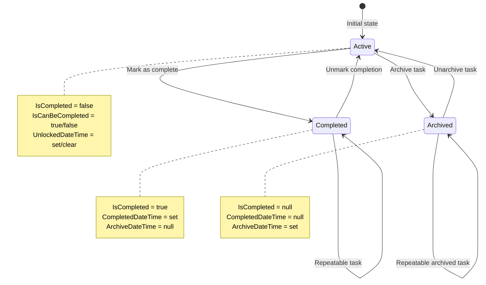
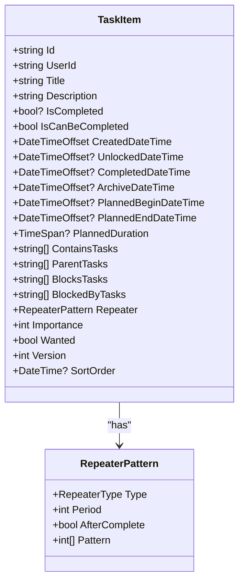
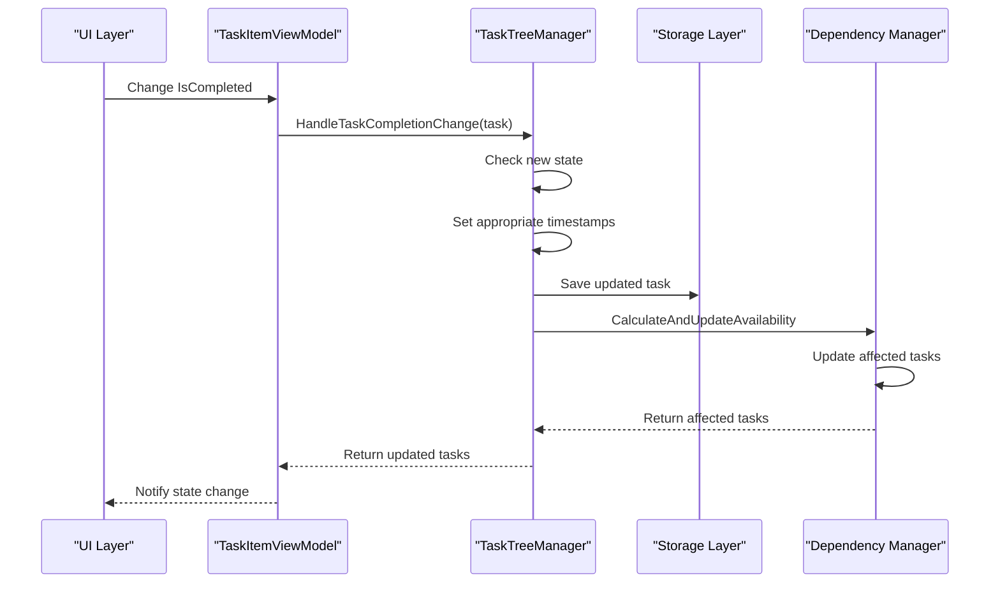
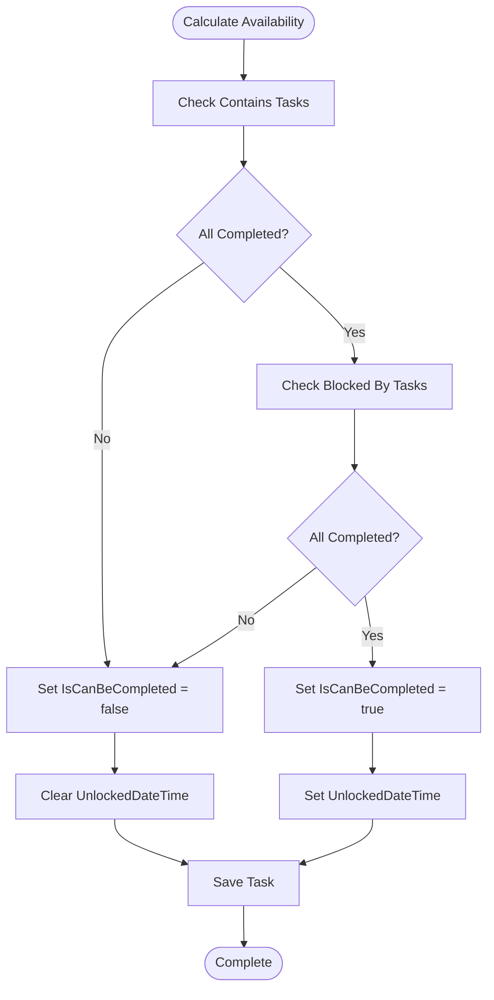
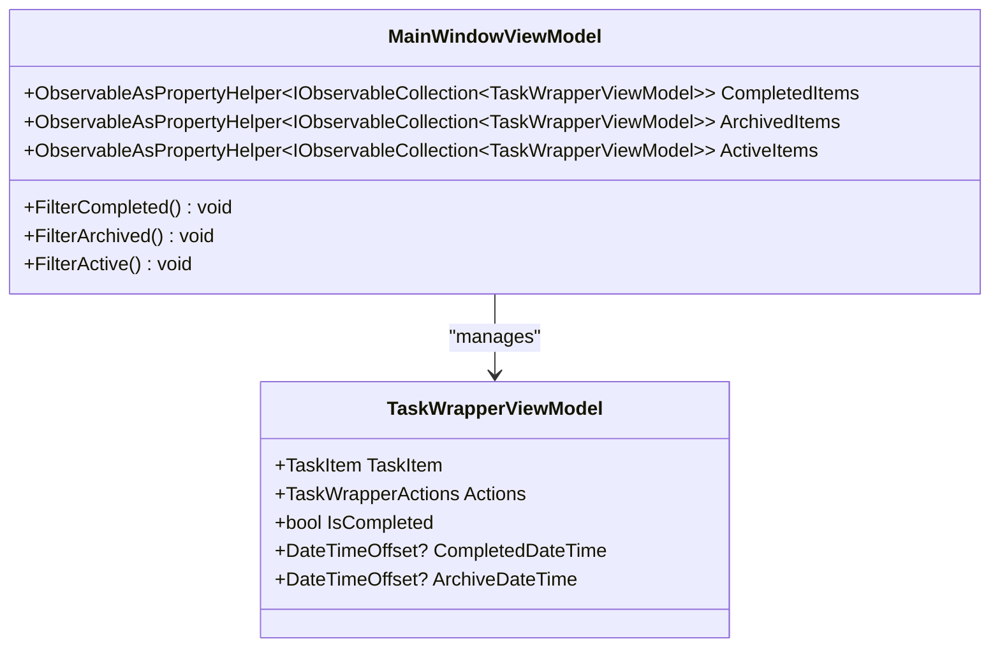
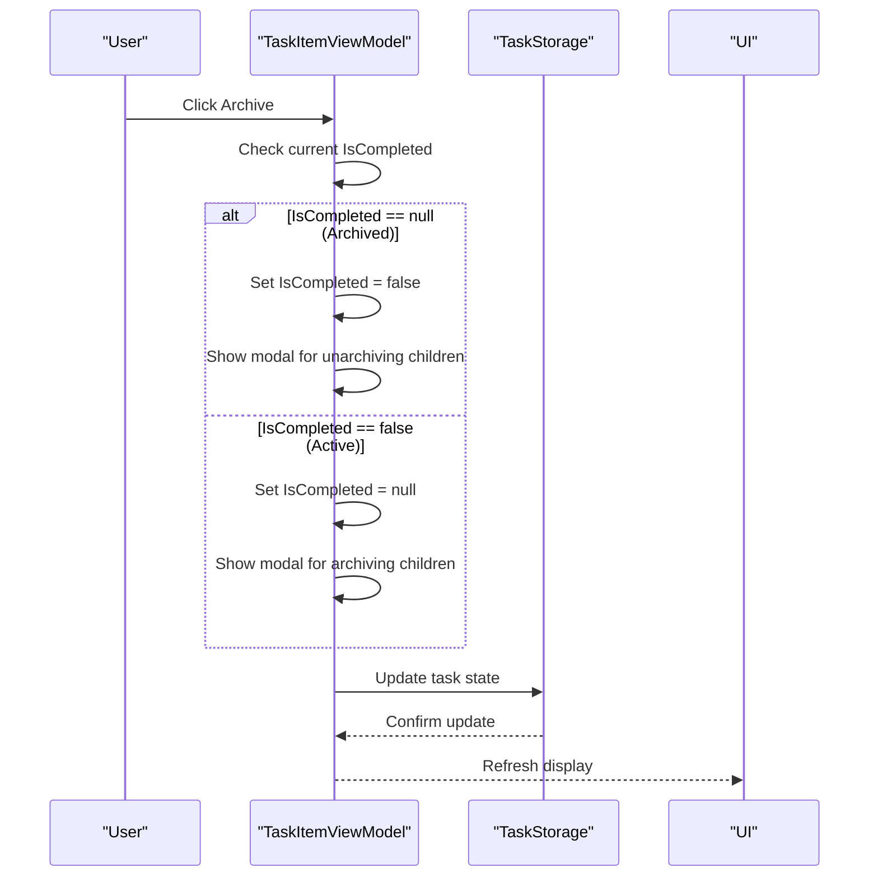
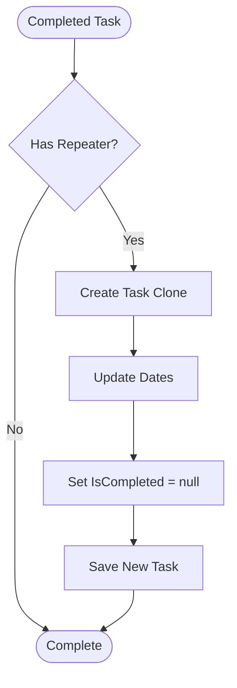

# Task Completion States

<cite>
**Referenced Files in This Document**
- [TaskItem.cs](file://src/Unlimotion.Domain/TaskItem.cs)
- [TaskTreeManager.cs](file://src/Unlimotion.TaskTreeManager/TaskTreeManager.cs)
- [TaskCompletionChangeTests.cs](file://src/Unlimotion.Test/TaskCompletionChangeTests.cs)
- [TaskItemViewModel.cs](file://src/Unlimotion.ViewModel/TaskItemViewModel.cs)
- [MainWindowViewModel.cs](file://src/Unlimotion.ViewModel/MainWindowViewModel.cs)
- [TaskAvailabilityCalculationTests.cs](file://src/Unlimotion.Test/TaskAvailabilityCalculationTests.cs)
- [RepeaterPattern.cs](file://src/Unlimotion.Domain/RepeaterPattern.cs)
- [RepeaterType.cs](file://src/Unlimotion.Domain/RepeaterType.cs)
- [RepeaterPatternExtensions.cs](file://src/Unlimotion.Domain/RepeaterPatternExtensions.cs)
</cite>

## Table of Contents
1. [Introduction](#introduction)
2. [Three-State Completion System](#three-state-completion-system)
3. [Boolean? IsCompleted Property](#boolean-iscompleted-property)
4. [Timestamp Management](#timestamp-management)
5. [State Transition Logic](#state-transition-logic)
6. [Dependency Resolution](#dependency-resolution)
7. [UI Presentation](#ui-presentation)
8. [Repeater Patterns and Archived Tasks](#repeater-patterns-and-archived-tasks)
9. [Testing and Validation](#testing-and-validation)
10. [Best Practices](#best-practices)

## Introduction

The Unlimotion task management system implements a sophisticated three-state completion system that goes beyond traditional binary completion states. This system introduces a nuanced approach to task lifecycle management through three distinct states: Active/Incomplete, Completed, and Archived. The implementation leverages a nullable boolean (`bool?`) property named `IsCompleted` to represent these states, providing both semantic clarity and practical benefits for task relationships and UI presentation.

## Three-State Completion System

The three-state completion system provides a comprehensive approach to task lifecycle management:



**Diagram sources**
- [TaskItem.cs](file://src/Unlimotion.Domain/TaskItem.cs#L8-L10)
- [TaskTreeManager.cs](file://src/Unlimotion.TaskTreeManager/TaskTreeManager.cs#L750-L837)

Each state serves specific purposes in the task management workflow:

- **Active/Incomplete (false)**: Tasks that are currently being worked on or are pending completion
- **Completed (true)**: Tasks that have been finished and are ready for review or archiving
- **Archived (null)**: Tasks that are no longer actively managed but may be revisited later

**Section sources**
- [TaskItem.cs](file://src/Unlimotion.Domain/TaskItem.cs#L8-L10)
- [TaskTreeManager.cs](file://src/Unlimotion.TaskTreeManager/TaskTreeManager.cs#L750-L837)

## Boolean? IsCompleted Property

The `IsCompleted` property serves as the cornerstone of the three-state system, utilizing a nullable boolean type to represent the three distinct states:

### State Representation

| Value | State | Semantic Meaning | Use Case |
|-------|-------|------------------|----------|
| `false` | Active/Incomplete | Task is pending completion | Ongoing work, blocked tasks |
| `true` | Completed | Task has been finished | Finished tasks ready for review |
| `null` | Archived | Task is archived | Long-term storage, historical reference |

### Implementation Details

The property is initialized to `false` by default, representing newly created tasks in their active state. This initialization ensures that all tasks start in a workable state unless explicitly marked otherwise.



**Diagram sources**
- [TaskItem.cs](file://src/Unlimotion.Domain/TaskItem.cs#L6-L32)
- [RepeaterPattern.cs](file://src/Unlimotion.Domain/RepeaterPattern.cs#L6-L11)

**Section sources**
- [TaskItem.cs](file://src/Unlimotion.Domain/TaskItem.cs#L8-L10)
- [TaskTreeManager.cs](file://src/Unlimotion.TaskTreeManager/TaskTreeManager.cs#L750-L837)

## Timestamp Management

The system maintains precise temporal information through four specialized timestamp properties, each serving specific purposes in the task lifecycle:

### Timestamp Properties

| Property | Purpose | Null State | Usage Context |
|----------|---------|------------|---------------|
| `CreatedDateTime` | Task creation time | Never null | Sorting, filtering, analytics |
| `CompletedDateTime` | Completion timestamp | Null when not completed | Completion history, reports |
| `ArchiveDateTime` | Archival timestamp | Null when not archived | Archive management, cleanup |
| `UnlockedDateTime` | Availability timestamp | Null when blocked | Unlock notifications, scheduling |

### State-Specific Timestamp Behavior

The timestamp management follows specific rules based on the task's completion state:

```mermaid
flowchart TD
Start([Task State Change]) --> CheckState{New State?}
CheckState --> |true (Completed)| SetCompleted["Set CompletedDateTime<br/>Clear ArchiveDateTime"]
CheckState --> |false (Active)| ClearAll["Clear CompletedDateTime<br/>Clear ArchiveDateTime"]
CheckState --> |null (Archived)| SetArchived["Clear CompletedDateTime<br/>Set ArchiveDateTime"]
SetCompleted --> UpdateStorage["Update Storage"]
ClearAll --> UpdateStorage
SetArchived --> UpdateStorage
UpdateStorage --> Recalculate["Recalculate Dependencies"]
Recalculate --> End([Complete])
```

**Diagram sources**
- [TaskTreeManager.cs](file://src/Unlimotion.TaskTreeManager/TaskTreeManager.cs#L750-L837)

### Timestamp Transition Examples

1. **Marking as Complete**: When transitioning from Active to Completed, `CompletedDateTime` is set to the current UTC timestamp, while `ArchiveDateTime` remains null.
2. **Unmarking Completion**: When reverting from Completed to Active, both timestamps are cleared.
3. **Archiving**: When moving from Active to Archived, `ArchiveDateTime` is set, while `CompletedDateTime` remains null.

**Section sources**
- [TaskTreeManager.cs](file://src/Unlimotion.TaskTreeManager/TaskTreeManager.cs#L750-L837)
- [TaskCompletionChangeTests.cs](file://src/Unlimotion.Test/TaskCompletionChangeTests.cs#L15-L46)

## State Transition Logic

The state transition logic is centralized in the `HandleTaskCompletionChange` method of the `TaskTreeManager`, which manages all state changes and their cascading effects:

### Core Transition Method

The `HandleTaskCompletionChange` method implements sophisticated logic for managing state transitions:



**Diagram sources**
- [TaskTreeManager.cs](file://src/Unlimotion.TaskTreeManager/TaskTreeManager.cs#L750-L837)
- [TaskItemViewModel.cs](file://src/Unlimotion.ViewModel/TaskItemViewModel.cs#L120-L140)

### Transition Scenarios

The system handles several complex transition scenarios:

1. **Simple State Changes**: Basic transitions between Active, Completed, and Archived states
2. **Repeater Patterns**: Automatic task cloning for repeatable tasks
3. **Dependency Propagation**: Updating affected parent and blocked tasks
4. **Batch Operations**: Handling multiple state changes efficiently

**Section sources**
- [TaskTreeManager.cs](file://src/Unlimotion.TaskTreeManager/TaskTreeManager.cs#L750-L837)
- [TaskCompletionChangeTests.cs](file://src/Unlimotion.Test/TaskCompletionChangeTests.cs#L15-L127)

## Dependency Resolution

The dependency resolution system treats archived tasks (null IsCompleted) as completed for dependency checking purposes, maintaining logical consistency while preserving archival semantics:

### Dependency Checking Logic

The `CalculateAvailabilityForTask` method implements the core dependency resolution logic:



**Diagram sources**
- [TaskTreeManager.cs](file://src/Unlimotion.TaskTreeManager/TaskTreeManager.cs#L640-L720)

### Archived Task Treatment

Archived tasks are treated as completed for dependency resolution because:

1. **Logical Consistency**: Archived tasks are considered finished and shouldn't block other tasks
2. **Practical Benefits**: Allows proper task unlocking and availability calculations
3. **Preserved Semantics**: Maintains the distinction between active/archived states

### Dependency Rules

The system follows these dependency resolution rules:

| Condition | Result | Explanation |
|-----------|--------|-------------|
| All contained tasks completed | Task can be completed | Meets completion criteria |
| Any contained task incomplete | Task cannot be completed | Blocking condition |
| All blocking tasks completed | Task can be completed | No blocking conditions |
| Any blocking task incomplete | Task cannot be completed | Blocked by other tasks |

**Section sources**
- [TaskTreeManager.cs](file://src/Unlimotion.TaskTreeManager/TaskTreeManager.cs#L640-L720)
- [TaskAvailabilityCalculationTests.cs](file://src/Unlimotion.Test\TaskAvailabilityCalculationTests.cs#L43-L235)

## UI Presentation

The UI layer presents the three-state system through specialized views and filters, with each state having distinct visual treatment:

### State-Based Filtering

The main window view model implements state-based filtering for efficient task organization:



**Diagram sources**
- [MainWindowViewModel.cs](file://src/Unlimotion.ViewModel\MainWindowViewModel.cs#L591-L655)

### UI State Indicators

Different states receive distinct visual treatments:

1. **Active Tasks**: Standard presentation with unlock indicators
2. **Completed Tasks**: Dimmed appearance with completion timestamps
3. **Archived Tasks**: Special archive indicators with archival timestamps

### Archive Command Implementation

The archive command provides intuitive state switching:



**Diagram sources**
- [TaskItemViewModel.cs](file://src\Unlimotion.ViewModel\TaskItemViewModel.cs#L136-L171)

**Section sources**
- [MainWindowViewModel.cs](file://src\Unlimotion.ViewModel\MainWindowViewModel.cs#L591-L655)
- [TaskItemViewModel.cs](file://src\Unlimotion.ViewModel\TaskItemViewModel.cs#L136-L171)

## Repeater Patterns and Archived Tasks

The system integrates repeater patterns with the three-state completion system, allowing archived tasks to participate in repetition cycles:

### Repeater Integration

When a completed task has a repeater pattern, the system creates a new task instance for the next occurrence:



**Diagram sources**
- [TaskTreeManager.cs](file://src\Unlimotion.TaskTreeManager\TaskTreeManager.cs#L750-L837)

### Archived Repeater Behavior

Archived tasks with repeaters follow special rules:

1. **Cloning Logic**: Archived tasks trigger the same cloning mechanism as completed tasks
2. **State Preservation**: The new task inherits the archived state
3. **Dependency Maintenance**: Repetition respects all task dependencies

### Repeater Types

The system supports various repetition patterns:

| Type | Description | Use Case |
|------|-------------|----------|
| None | No repetition | One-time tasks |
| Daily | Repeat daily | Daily routines |
| Weekly | Repeat weekly | Weekly meetings |
| Monthly | Repeat monthly | Monthly reviews |
| Yearly | Repeat yearly | Annual events |

**Section sources**
- [TaskTreeManager.cs](file://src\Unlimotion.TaskTreeManager\TaskTreeManager.cs#L750-L837)
- [RepeaterPattern.cs](file://src\Unlimotion.Domain\RepeaterPattern.cs#L6-L11)
- [RepeaterType.cs](file://src\Unlimotion.Domain\RepeaterType.cs#L3-L9)

## Testing and Validation

The system includes comprehensive testing to ensure reliable state management:

### Test Coverage Areas

The test suite validates multiple aspects of the completion system:

1. **Basic State Transitions**: Verification of simple state changes
2. **Timestamp Management**: Ensuring proper timestamp handling
3. **Dependency Resolution**: Validating dependency checking logic
4. **Repeater Integration**: Testing repetition mechanisms
5. **UI Integration**: Verifying UI state synchronization

### Key Test Scenarios

The test suite covers essential scenarios:

- **Completed Task Creation**: Setting completion timestamps correctly
- **Uncompleted Task Reset**: Clearing timestamps appropriately
- **Archived Task Handling**: Managing archival state transitions
- **Repeater Task Cloning**: Creating new instances for repeated tasks

**Section sources**
- [TaskCompletionChangeTests.cs](file://src\Unlimotion.Test\TaskCompletionChangeTests.cs#L15-L127)
- [TaskAvailabilityCalculationTests.cs](file://src\Unlimotion.Test\TaskAvailabilityCalculationTests.cs#L15-L683)

## Best Practices

### State Management Guidelines

1. **Consistent State Changes**: Always use the `HandleTaskCompletionChange` method for state transitions
2. **Timestamp Accuracy**: Rely on automatic timestamp management rather than manual setting
3. **Dependency Awareness**: Understand how state changes propagate through task relationships
4. **Repeater Considerations**: Account for repetition when designing task workflows

### Performance Considerations

1. **Batch Operations**: Group related state changes to minimize dependency recalculations
2. **Efficient Queries**: Use appropriate filters for different task states
3. **Storage Optimization**: Leverage the storage layer's capabilities for bulk operations

### UI Design Principles

1. **Clear State Indicators**: Provide visual feedback for all three states
2. **Intuitive Commands**: Make state transitions easy to understand and predict
3. **Consistent Behavior**: Maintain uniform behavior across different UI contexts

The three-state completion system provides a robust foundation for sophisticated task management, balancing flexibility with simplicity while maintaining logical consistency throughout the application.