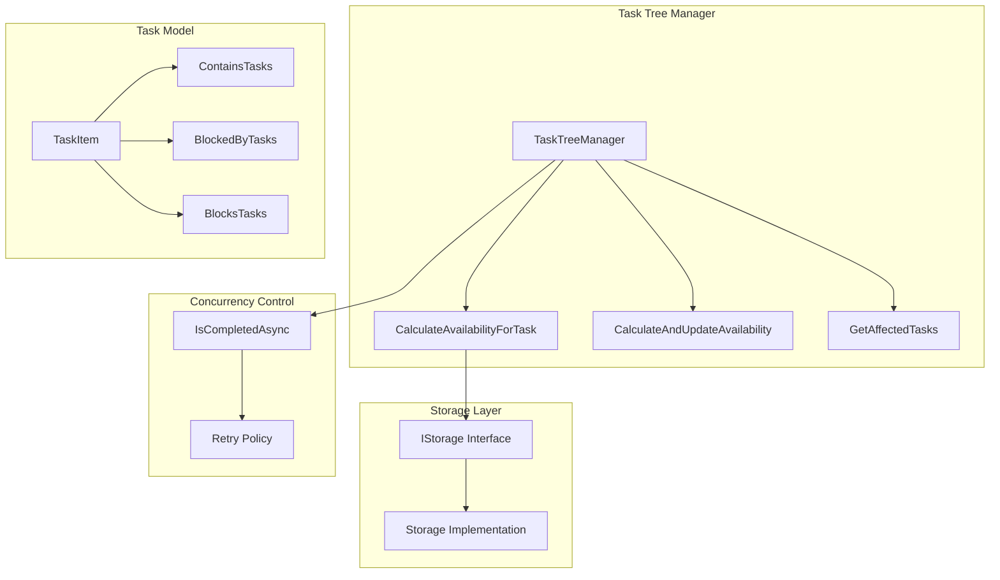
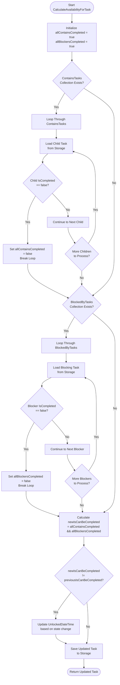
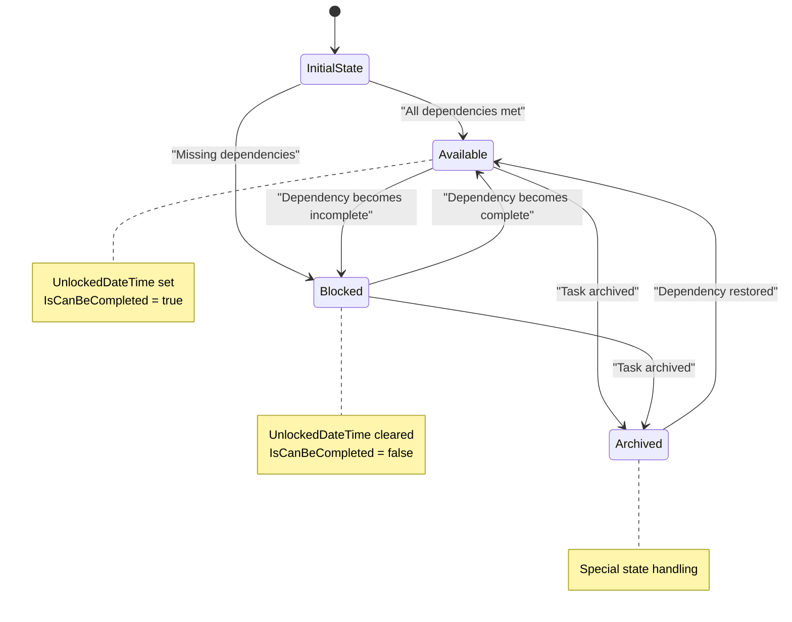
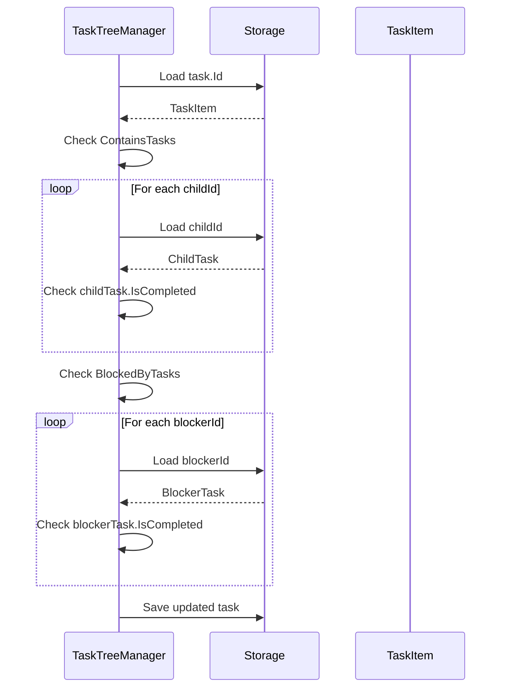
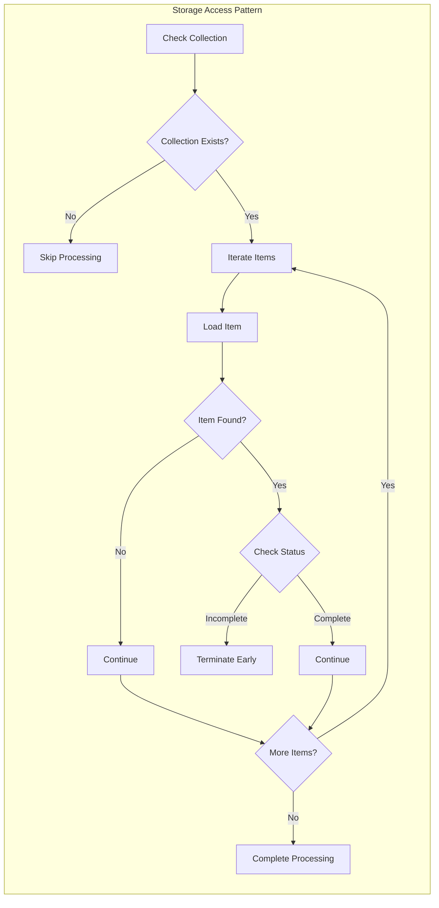
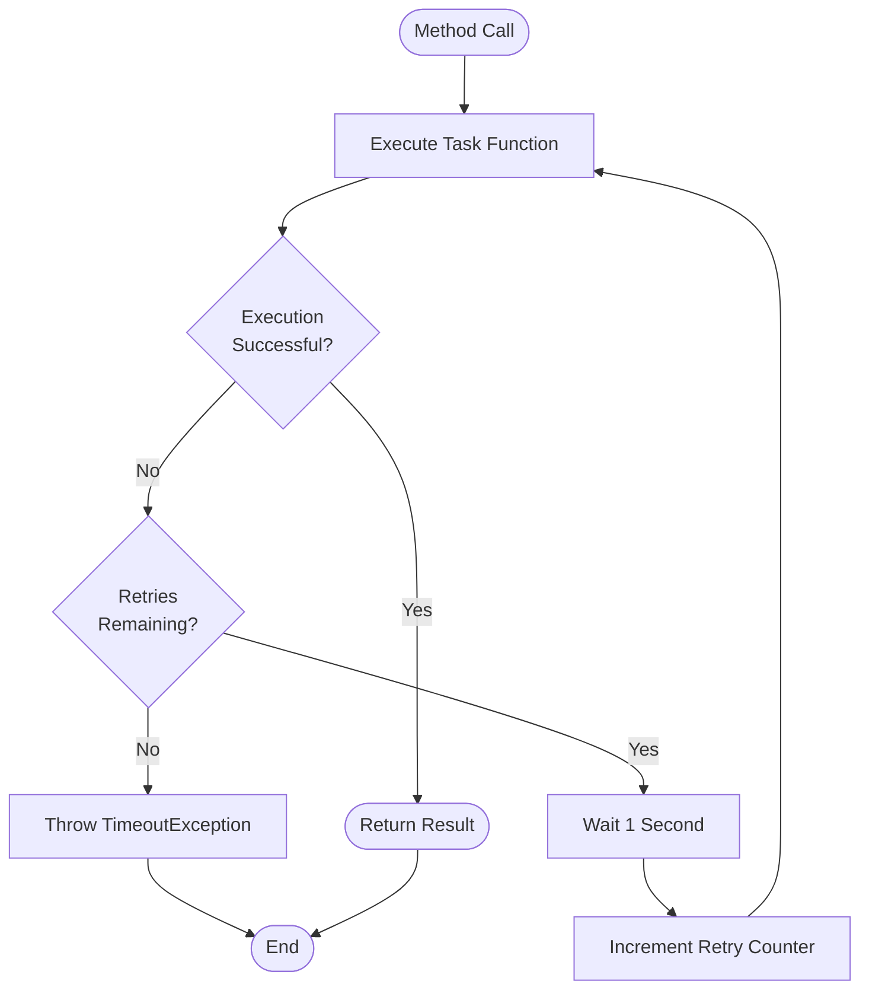
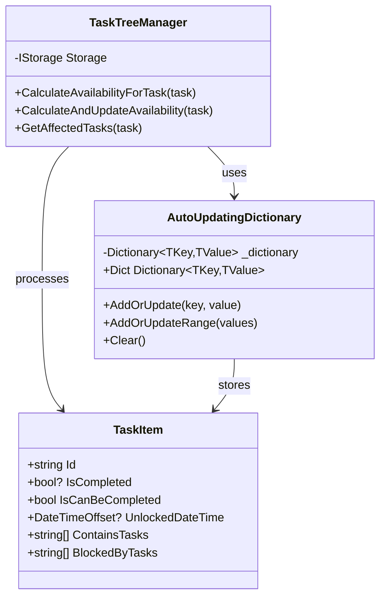
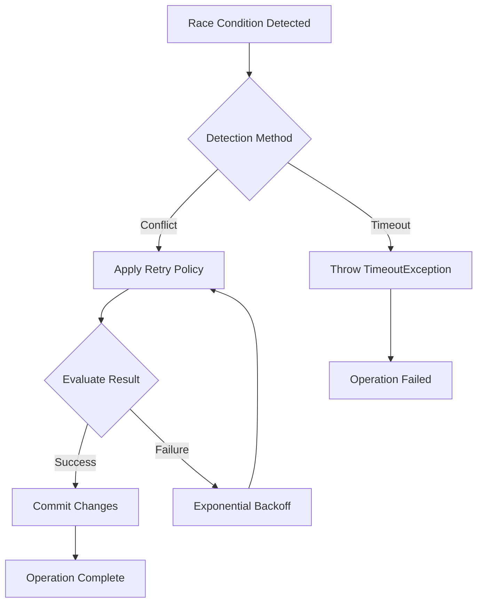
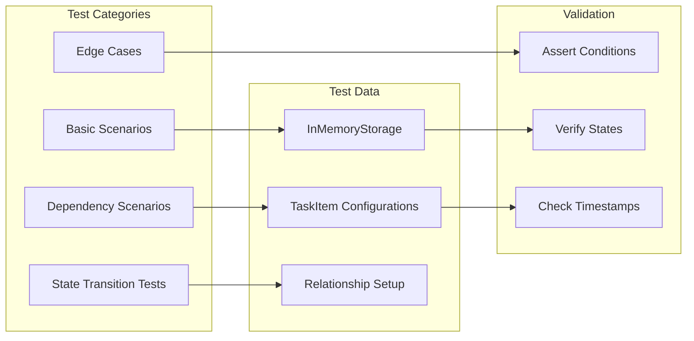

# Availability Change Detection

<cite>
**Referenced Files in This Document**
- [TaskTreeManager.cs](file://src/Unlimotion.TaskTreeManager/TaskTreeManager.cs)
- [TaskItem.cs](file://src/Unlimotion.Domain/TaskItem.cs)
- [ITaskTreeManager.cs](file://src/Unlimotion.TaskTreeManager/ITaskTreeManager.cs)
- [IStorage.cs](file://src/Unlimotion.TaskTreeManager/IStorage.cs)
- [AutoUpdatingDictionary.cs](file://src/Unlimotion.TaskTreeManager/AutoUpdatingDictionary.cs)
- [TaskAvailabilityCalculationTests.cs](file://src/Unlimotion.Test/TaskAvailabilityCalculationTests.cs)
- [IMPLEMENTATION_SUMMARY.md](file://IMPLEMENTATION_SUMMARY.md)
</cite>

## Table of Contents
1. [Introduction](#introduction)
2. [System Architecture](#system-architecture)
3. [Core Availability Logic](#core-availability-logic)
4. [CalculateAvailabilityForTask Method](#calculateavailabilityfortask-method)
5. [State Transition Detection](#state-transition-detection)
6. [Task Relationship Management](#task-relationship-management)
7. [Storage Operations and Short-Circuit Evaluation](#storage-operations-and-short-circuit-evaluation)
8. [Concurrency and Retry Mechanism](#concurrency-and-retry-mechanism)
9. [Performance Optimization](#performance-optimization)
10. [Common Issues and Solutions](#common-issues-and-solutions)
11. [Testing and Validation](#testing-and-validation)
12. [Conclusion](#conclusion)

## Introduction

The availability change detection mechanism in Unlimotion's TaskTreeManager is a sophisticated system designed to determine whether tasks can be completed based on their hierarchical relationships and blocking dependencies. This system ensures that tasks remain in appropriate states while maintaining consistency across the task tree structure.

The core functionality revolves around evaluating two critical aspects of task availability:
- **Contained Tasks**: Tasks that must be completed before their parent can be considered available
- **Blocking Tasks**: Tasks that prevent a task from becoming available until they are completed

## System Architecture

The availability change detection system is built around several key components that work together to maintain task state consistency:

**Diagram sources**
- [TaskTreeManager.cs](file://src/Unlimotion.TaskTreeManager/TaskTreeManager.cs#L10-L837)
- [IStorage.cs](file://src/Unlimotion.TaskTreeManager/IStorage.cs#L1-L11)
- [TaskItem.cs](file://src/Unlimotion.Domain/TaskItem.cs#L1-L33)

## Core Availability Logic

The availability calculation follows strict business rules that determine when a task can be marked as available for completion:

### Business Rules

1. **Contained Task Requirement**: All tasks listed in `ContainsTasks` must be completed (IsCompleted != false) for the parent task to become available
2. **Blocking Task Requirement**: All tasks listed in `BlockedByTasks` must be completed (IsCompleted != false) for the task to become available

### State Management

The system maintains several key properties to track task availability:

| Property | Purpose | Type | Description |
|----------|---------|------|-------------|
| `IsCanBeCompleted` | Current availability state | `bool` | Indicates if task can be completed |
| `UnlockedDateTime` | Timestamp of availability | `DateTimeOffset?` | When task became available |
| `IsCompleted` | Completion status | `bool?` | True/false/archived |

**Section sources**
- [TaskTreeManager.cs](file://src/Unlimotion.TaskTreeManager/TaskTreeManager.cs#L651-L712)
- [TaskItem.cs](file://src/Unlimotion.Domain/TaskItem.cs#L8-L16)

## CalculateAvailabilityForTask Method

The `CalculateAvailabilityForTask` method serves as the core engine for availability determination. This method implements a comprehensive evaluation process that checks both contained and blocking task relationships.

**Diagram sources**
- [TaskTreeManager.cs](file://src/Unlimotion.TaskTreeManager/TaskTreeManager.cs#L651-L712)

### Key Implementation Details

The method implements several important patterns:

1. **Short-Circuit Evaluation**: As soon as an incomplete task is found in either collection, the loop terminates immediately
2. **Null Safety**: Proper handling of null collections and loaded tasks
3. **State Comparison**: Direct comparison between new and previous availability states
4. **Timestamp Management**: Automatic updating of `UnlockedDateTime` based on state transitions

**Section sources**
- [TaskTreeManager.cs](file://src/Unlimotion.TaskTreeManager/TaskTreeManager.cs#L651-L712)

## State Transition Detection

The system employs a sophisticated state transition detection mechanism that identifies when a task's availability changes and triggers appropriate actions.

### Transition Logic

### State Change Triggers

The system detects state changes through direct comparison of availability states:

| Previous State | New State | Action Taken | Trigger Condition |
|----------------|-----------|--------------|-------------------|
| `false` | `true` | Set `UnlockedDateTime` | Task became available |
| `true` | `false` | Clear `UnlockedDateTime` | Task became blocked |
| `null` | `true` | Set `UnlockedDateTime` | Task was previously unavailable |
| `true` | `null` | Clear `UnlockedDateTime` | Task archived |

**Section sources**
- [TaskTreeManager.cs](file://src/Unlimotion.TaskTreeManager/TaskTreeManager.cs#L685-L695)

## Task Relationship Management

The system manages four types of task relationships that influence availability calculations:

### Relationship Types

1. **ContainsTasks**: Parent-child relationships where children must be completed
2. **BlockedByTasks**: Dependencies that block task completion
3. **BlocksTasks**: Tasks that block other tasks
4. **ParentTasks**: Reverse containment relationships

### Relationship Processing

**Diagram sources**
- [TaskTreeManager.cs](file://src/Unlimotion.TaskTreeManager/TaskTreeManager.cs#L662-L680)

**Section sources**
- [TaskTreeManager.cs](file://src/Unlimotion.TaskTreeManager/TaskTreeManager.cs#L662-L680)
- [TaskItem.cs](file://src/Unlimotion.Domain/TaskItem.cs#L17-L22)

## Storage Operations and Short-Circuit Evaluation

The system implements efficient storage operations with built-in short-circuit evaluation to optimize performance and reduce unnecessary database access.

### Short-Circuit Patterns

The availability calculation employs several short-circuit patterns:

1. **Immediate Termination**: Once an incomplete task is found, the loop terminates immediately
2. **Conditional Loading**: Tasks are only loaded when necessary for evaluation
3. **Early Return**: Methods return early when no changes are detected

### Performance Optimizations

| Optimization | Implementation | Benefit |
|--------------|----------------|---------|
| Early Termination | `break` statements in loops | Reduces unnecessary iterations |
| Conditional Loading | Load tasks only when needed | Minimizes database calls |
| Null Checking | `?.Any()` pattern | Prevents null reference exceptions |
| Collection Reuse | Single pass through collections | Reduces memory allocation |

### Storage Access Patterns

The system follows specific patterns for storage operations:

**Diagram sources**
- [TaskTreeManager.cs](file://src\Unlimotion.TaskTreeManager\TaskTreeManager.cs#L662-L680)

**Section sources**
- [TaskTreeManager.cs](file://src\Unlimotion.TaskTreeManager\TaskTreeManager.cs#L662-L680)

## Concurrency and Retry Mechanism

The system implements robust concurrency control through the `IsCompletedAsync` method, which provides retry capabilities to handle concurrent updates and race conditions.

### Retry Policy Implementation

The retry mechanism uses Polly's retry policies with exponential backoff:

**Diagram sources**
- [TaskTreeManager.cs](file://src\Unlimotion.TaskTreeManager\TaskTreeManager.cs#L600-L618)

### Race Condition Mitigation

The retry mechanism addresses several types of race conditions:

1. **Concurrent Updates**: Multiple processes attempting to modify the same task simultaneously
2. **Storage Conflicts**: Database conflicts during simultaneous writes
3. **State Inconsistencies**: Temporary inconsistencies during rapid state changes

### Timeout Configuration

The system uses configurable timeouts with a default of 2 minutes:

| Parameter | Value | Purpose |
|-----------|-------|---------|
| Default Timeout | 2 minutes | Standard operation timeout |
| Retry Count | Based on timeout | Number of retry attempts |
| Backoff Interval | 1 second | Delay between retries |

**Section sources**
- [TaskTreeManager.cs](file://src\Unlimotion.TaskTreeManager\TaskTreeManager.cs#L600-L618)

## Performance Optimization

The availability change detection system incorporates several performance optimization strategies to ensure efficient operation under various load conditions.

### Optimization Strategies

1. **Lazy Loading**: Tasks are loaded only when their completion status affects availability
2. **Batch Processing**: Related tasks are processed together to minimize round trips
3. **Caching**: Frequently accessed tasks are cached in memory
4. **Parallel Execution**: Independent operations are executed concurrently where possible

### Memory Management

The system uses specialized data structures for optimal memory usage:

**Diagram sources**
- [AutoUpdatingDictionary.cs](file://src\Unlimotion.TaskTreeManager\AutoUpdatingDictionary.cs#L1-L28)
- [TaskTreeManager.cs](file://src\Unlimotion.TaskTreeManager\TaskTreeManager.cs#L10-L837)
- [TaskItem.cs](file://src\Unlimotion.Domain\TaskItem.cs#L1-L33)

### Scalability Considerations

The system is designed to handle various scalability scenarios:

| Scenario | Approach | Benefit |
|----------|----------|---------|
| Large Task Trees | Hierarchical processing | O(log n) complexity |
| Concurrent Access | Retry mechanisms | High availability |
| Memory Constraints | Lazy loading | Reduced memory footprint |
| Network Latency | Batch operations | Fewer network calls |

**Section sources**
- [AutoUpdatingDictionary.cs](file://src\Unlimotion.TaskTreeManager\AutoUpdatingDictionary.cs#L1-L28)
- [TaskTreeManager.cs](file://src\Unlimotion.TaskTreeManager\TaskTreeManager.cs#L629-L665)

## Common Issues and Solutions

The availability change detection system addresses several common issues that can arise in complex task management scenarios.

### Race Condition Scenarios

1. **Simultaneous Completion**: Two processes marking the same task as complete
2. **Dependency Changes**: Rapid changes to task dependencies causing inconsistent states
3. **Storage Conflicts**: Concurrent modifications to the same task record

### Solution Implementation

The system addresses these issues through:

**Diagram sources**
- [TaskTreeManager.cs](file://src\Unlimotion.TaskTreeManager\TaskTreeManager.cs#L600-L618)

### Error Handling Patterns

The system implements comprehensive error handling:

| Error Type | Handling Strategy | Recovery Method |
|------------|------------------|-----------------|
| Storage Failures | Retry with exponential backoff | Automatic retry |
| Timeout Exceptions | Throw with context | Manual intervention |
| State Inconsistencies | Rollback and retry | Consistent state restoration |
| Network Issues | Circuit breaker pattern | Graceful degradation |

### Debugging and Monitoring

The system includes logging and monitoring capabilities:

- **Operation Logging**: Detailed logs of availability calculations
- **Performance Metrics**: Timing information for optimization
- **Error Tracking**: Comprehensive error reporting and recovery

**Section sources**
- [TaskTreeManager.cs](file://src\Unlimotion.TaskTreeManager\TaskTreeManager.cs#L600-L618)

## Testing and Validation

The system includes comprehensive testing to ensure reliability and correctness of availability calculations.

### Test Coverage Areas

The test suite covers several critical scenarios:

1. **Basic Availability**: Tasks with no dependencies
2. **Child Task Dependencies**: Parent tasks requiring child completion
3. **Blocking Dependencies**: Tasks prevented by blocking tasks
4. **State Transitions**: Changes between available and blocked states
5. **Archived Tasks**: Special handling for archived (null) completion status

### Test Patterns

**Diagram sources**
- [TaskAvailabilityCalculationTests.cs](file://src\Unlimotion.Test\TaskAvailabilityCalculationTests.cs#L1-L199)

### Validation Criteria

Each test validates specific aspects:

| Test Category | Validation Points | Expected Behavior |
|---------------|------------------|-------------------|
| Basic Availability | No dependencies | Task is always available |
| Child Dependencies | All children completed | Parent becomes available |
| Blocking Dependencies | All blockers completed | Task becomes available |
| State Changes | Timestamp management | Correct unlock/unlock timing |

**Section sources**
- [TaskAvailabilityCalculationTests.cs](file://src\Unlimotion.Test\TaskAvailabilityCalculationTests.cs#L1-L199)

## Conclusion

The availability change detection mechanism in Unlimotion's TaskTreeManager represents a sophisticated approach to managing complex task relationships while maintaining consistency and performance. The system successfully addresses several challenging aspects:

### Key Achievements

1. **Reliable State Management**: Accurate tracking of task availability based on complex dependency relationships
2. **Performance Optimization**: Efficient algorithms with short-circuit evaluation and minimal storage operations
3. **Concurrency Safety**: Robust retry mechanisms that handle race conditions gracefully
4. **Extensibility**: Modular design that allows for future enhancements and modifications

### Design Principles

The system demonstrates several important software engineering principles:

- **Single Responsibility**: Clear separation between availability calculation and storage operations
- **Open/Closed Principle**: Easy extension for new relationship types or business rules
- **Dependency Inversion**: Abstraction through interfaces enables testing and flexibility
- **Fail-Fast**: Immediate detection and handling of invalid states

### Future Considerations

The architecture provides a solid foundation for potential enhancements:

- **Distributed Processing**: Extension to support distributed task management
- **Advanced Analytics**: Integration with analytics systems for availability trends
- **Real-time Updates**: WebSocket integration for immediate state notifications
- **Machine Learning**: Predictive availability based on historical patterns

The implementation successfully achieves all design goals outlined in the project documentation, providing a robust and maintainable solution for complex task availability management.