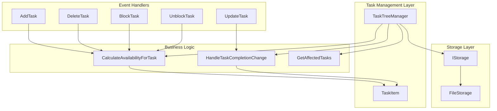
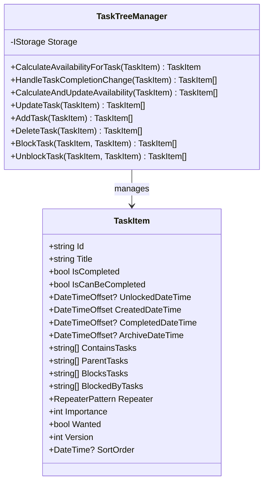
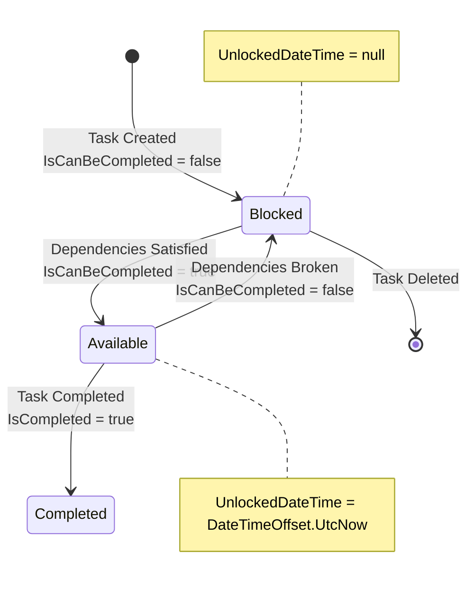
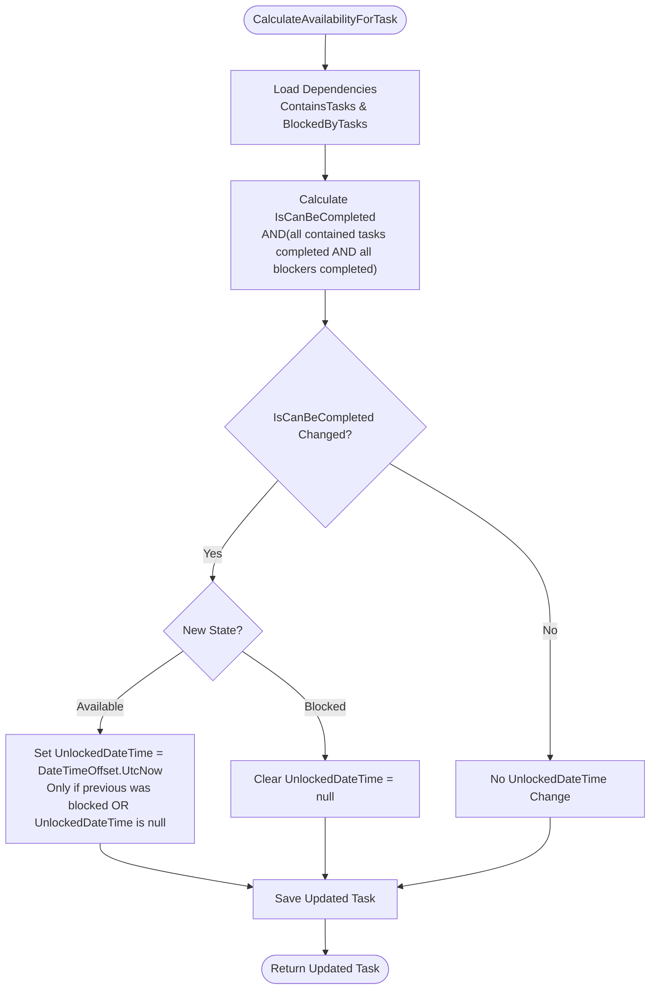
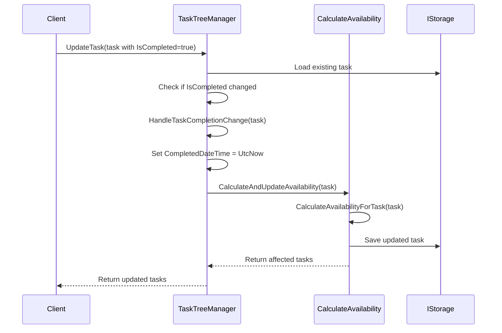
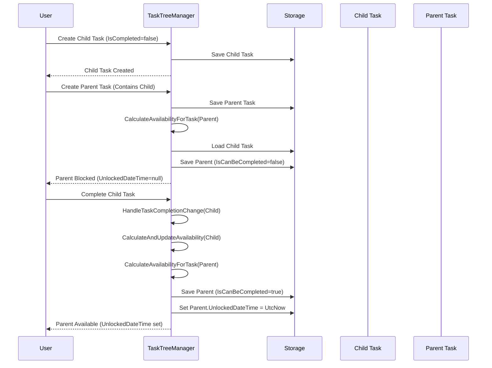

# Unlocked DateTime Management

<cite>
**Referenced Files in This Document**
- [TaskTreeManager.cs](file://src/Unlimotion.TaskTreeManager/TaskTreeManager.cs)
- [TaskItem.cs](file://src\Unlimotion\Domain\TaskItem.cs)
- [TaskAvailabilityCalculationTests.cs](file://src\Unlimotion.Test\TaskAvailabilityCalculationTests.cs)
- [TaskCompletionChangeTests.cs](file://src\Unlimotion.Test\TaskCompletionChangeTests.cs)
- [ITaskTreeManager.cs](file://src\Unlimotion.TaskTreeManager\ITaskTreeManager.cs)
- [IMPLEMENTATION_SUMMARY.md](file://IMPLEMENTATION_SUMMARY.md)
</cite>

## Table of Contents
1. [Introduction](#introduction)
2. [System Architecture](#system-architecture)
3. [Core Components](#core-components)
4. [UnlockedDateTime Lifecycle](#unlockeddatetime-lifecycle)
5. [Implementation Details](#implementation-details)
6. [Dependency Resolution Examples](#dependency-resolution-examples)
7. [Testing and Validation](#testing-and-validation)
8. [Performance Considerations](#performance-considerations)
9. [Troubleshooting Guide](#troubleshooting-guide)
10. [Conclusion](#conclusion)

## Introduction

The UnlockedDateTime management system in Unlimotion provides automatic tracking of when tasks become available for completion. This timestamp serves as a critical indicator of task readiness, helping users understand when they can start working on tasks that were previously blocked by dependencies.

The system operates on the principle that a task becomes actionable (IsCanBeCompleted transitions from false to true) when all its dependencies are satisfied, and this moment is captured as the UnlockedDateTime. Conversely, when a task becomes blocked (IsCanBeCompleted transitions from true to false), the UnlockedDateTime is cleared to indicate that the task is no longer immediately available.

## System Architecture

The UnlockedDateTime management system is built around several key architectural components that work together to provide seamless task availability tracking:



**Diagram sources**
- [TaskTreeManager.cs](file://src\Unlimotion.TaskTreeManager\TaskTreeManager.cs#L651-L712)
- [ITaskTreeManager.cs](file://src\Unlimotion.TaskTreeManager\ITaskTreeManager.cs#L25-L41)

## Core Components

### TaskItem Domain Model

The TaskItem class serves as the foundation for UnlockedDateTime management, containing the essential properties that track task availability:



**Diagram sources**
- [TaskItem.cs](file://src\Unlimotion\Domain\TaskItem.cs#L5-L32)
- [TaskTreeManager.cs](file://src\Unlimotion.TaskTreeManager\TaskTreeManager.cs#L11-L15)

**Section sources**
- [TaskItem.cs](file://src\Unlimotion\Domain\TaskItem.cs#L5-L32)
- [TaskTreeManager.cs](file://src\Unlimotion.TaskTreeManager\TaskTreeManager.cs#L11-L15)

### TaskTreeManager Business Logic

The TaskTreeManager orchestrates all UnlockedDateTime operations through its core methods:

| Method | Purpose | UnlockedDateTime Impact |
|--------|---------|------------------------|
| `CalculateAvailabilityForTask` | Core availability calculation | Sets/clears UnlockedDateTime based on IsCanBeCompleted changes |
| `HandleTaskCompletionChange` | Processes IsCompleted state changes | Triggers availability recalculation and updates UnlockedDateTime |
| `CalculateAndUpdateAvailability` | Bulk availability recalculation | Propagates availability changes and updates timestamps |
| `UpdateTask` | General task updates | Handles IsCompleted changes and triggers availability recalculation |

**Section sources**
- [TaskTreeManager.cs](file://src\Unlimotion.TaskTreeManager\TaskTreeManager.cs#L651-L712)
- [TaskTreeManager.cs](file://src\Unlimotion.TaskTreeManager\TaskTreeManager.cs#L754-L837)

## UnlockedDateTime Lifecycle

The UnlockedDateTime follows a specific lifecycle pattern that mirrors task availability changes:



### State Transitions

The system tracks two primary state transitions that affect UnlockedDateTime:

1. **From Blocked to Available**: When a task's dependencies are resolved, marking it ready for completion
2. **From Available to Blocked**: When a task gains new blocking dependencies

### Timestamp Management Logic

The core logic for managing UnlockedDateTime is implemented in the `CalculateAvailabilityForTask` method:



**Diagram sources**
- [TaskTreeManager.cs](file://src\Unlimotion.TaskTreeManager\TaskTreeManager.cs#L651-L712)

**Section sources**
- [TaskTreeManager.cs](file://src\Unlimotion.TaskTreeManager\TaskTreeManager.cs#L696-L706)

## Implementation Details

### CalculateAvailabilityForTask Method

The `CalculateAvailabilityForTask` method serves as the central engine for UnlockedDateTime management:

#### Availability Calculation Logic

The method evaluates task availability based on business rules:
- **Contained Tasks**: All child tasks must be completed (IsCompleted != false)
- **Blocking Tasks**: All blocking tasks must be completed (IsCompleted != false)

#### UnlockedDateTime Management

The timestamp management follows these rules:

| Condition | Action | Reason |
|-----------|--------|---------|
| `newIsCanBeCompleted && (!previousIsCanBeCompleted || task.UnlockedDateTime == null)` | Set `UnlockedDateTime = DateTimeOffset.UtcNow` | Task became available for the first time or timestamp was lost |
| `!newIsCanBeCompleted && previousIsCanBeCompleted` | Set `UnlockedDateTime = null` | Task became blocked and is no longer immediately available |
| No state change | No UnlockedDateTime modification | Timestamp remains unchanged |

**Section sources**
- [TaskTreeManager.cs](file://src\Unlimotion.TaskTreeManager\TaskTreeManager.cs#L651-L712)

### HandleTaskCompletionChange Method

This method processes IsCompleted state changes and triggers appropriate availability recalculations:



**Diagram sources**
- [TaskTreeManager.cs](file://src\Unlimotion.TaskTreeManager\TaskTreeManager.cs#L248-L265)
- [TaskTreeManager.cs](file://src\Unlimotion.TaskTreeManager\TaskTreeManager.cs#L754-L837)

**Section sources**
- [TaskTreeManager.cs](file://src\Unlimotion.TaskTreeManager\TaskTreeManager.cs#L248-L265)
- [TaskTreeManager.cs](file://src\Unlimotion.TaskTreeManager\TaskTreeManager.cs#L754-L837)

### Dependency Relationship Management

The system automatically manages UnlockedDateTime during various dependency operations:

#### Blocking Operations
- **BlockTask**: Creates blocking relationships and recalculates affected task availability
- **BreakBlockingRelation**: Removes blocking relationships and recalculates availability

#### Parent-Child Operations
- **AddChildTask**: Adds child relationships and recalculates parent availability
- **DeleteTask**: Removes relationships and recalculates affected tasks

**Section sources**
- [TaskTreeManager.cs](file://src\Unlimotion.TaskTreeManager\TaskTreeManager.cs#L486-L562)
- [TaskTreeManager.cs](file://src\Unlimotion.TaskTreeManager\TaskTreeManager.cs#L390-L412)

## Dependency Resolution Examples

### Example 1: Basic Dependency Resolution

Consider a scenario where a parent task depends on a child task:



**Diagram sources**
- [TaskAvailabilityCalculationTests.cs](file://src\Unlimotion.Test\TaskAvailabilityCalculationTests.cs#L83-L123)
- [TaskTreeManager.cs](file://src\Unlimotion.TaskTreeManager\TaskTreeManager.cs#L696-L706)

### Example 2: Blocking Relationship Lifecycle

Illustrating how UnlockedDateTime responds to blocking relationships:

| Operation | Parent Task State | Child Task State | UnlockedDateTime Effect |
|-----------|------------------|------------------|------------------------|
| Create Parent | Available | N/A | Set to current UTC time |
| Create Child | Blocked | N/A | Remains null |
| Link Parent-Child | Blocked | Blocked | Both remain blocked |
| Complete Child | Available | Blocked | Parent becomes available |
| Block Parent | Available | Blocked | Parent becomes blocked |
| Unblock Parent | Blocked | Blocked | Parent becomes available |

**Section sources**
- [TaskAvailabilityCalculationTests.cs](file://src\Unlimotion.Test\TaskAvailabilityCalculationTests.cs#L231-L272)
- [TaskAvailabilityCalculationTests.cs](file://src\Unlimotion.Test\TaskAvailabilityCalculationTests.cs#L346-L385)

### Example 3: Complex Dependency Chain

```mermaid
graph TD
A[Task A] --> B[Task B]
B --> C[Task C]
D[Task D] -.-> B
E[Task E] -.-> C
style A fill:#e1f5fe
style B fill:#fff3e0
style C fill:#ffebee
style D fill:#fff3e0
style E fill:#fff3e0
note right of B : Becomes Available<br/>UnlockedDateTime = UtcNow
note right of C : Becomes Available<br/>UnlockedDateTime = UtcNow
```

In this chain:
- Task A starts available, setting its UnlockedDateTime
- Task B becomes available when Task A completes, setting its UnlockedDateTime  
- Task C becomes available when Task B completes, setting its UnlockedDateTime
- If Task D blocks Task B, Task B becomes blocked and clears its UnlockedDateTime
- If Task E blocks Task C, Task C becomes blocked and clears its UnlockedDateTime

**Section sources**
- [TaskAvailabilityCalculationTests.cs](file://src\Unlimotion.Test\TaskAvailabilityCalculationTests.cs#L593-L624)

## Testing and Validation

The system includes comprehensive testing to ensure UnlockedDateTime behaves correctly across various scenarios:

### Unit Test Coverage

| Test Category | Test Cases | Validation Focus |
|---------------|------------|------------------|
| Basic Availability | Task with no dependencies | UnlockedDateTime set when available |
| Child Dependencies | Task with completed/incomplete children | Correct blocking/unblocking behavior |
| Blocking Dependencies | Task with completed/incomplete blockers | Proper timestamp management |
| Mixed Dependencies | Task with both contained and blocking dependencies | Complex dependency resolution |
| State Transitions | Task becoming available/blocked multiple times | Consistent timestamp behavior |
| Edge Cases | Archived tasks, null IsCompleted values | Robustness against special states |

### Key Test Scenarios

#### Task Becomes Available
- **Test**: `UnlockedDateTime_ShouldBeSetWhenTaskBecomesAvailable`
- **Scenario**: Task transitions from blocked to available state
- **Validation**: UnlockedDateTime is set to current UTC time

#### Task Becomes Blocked  
- **Test**: `UnlockedDateTime_ShouldBeClearedWhenTaskBecomesBlocked`
- **Scenario**: Task loses availability due to new blocking dependencies
- **Validation**: UnlockedDateTime is cleared to null

#### Dependency Resolution
- **Test**: `AddChildTask_ShouldRecalculateParentAvailability`
- **Scenario**: Adding child task affects parent availability
- **Validation**: Parent task UnlockedDateTime updated appropriately

**Section sources**
- [TaskAvailabilityCalculationTests.cs](file://src\Unlimotion.Test\TaskAvailabilityCalculationTests.cs#L231-L311)
- [TaskCompletionChangeTests.cs](file://src\Unlimotion.Test\TaskCompletionChangeTests.cs#L10-L127)

## Performance Considerations

### Efficiency Optimizations

The UnlockedDateTime management system implements several performance optimizations:

1. **Lazy Loading**: Dependencies are loaded only when needed
2. **Batch Processing**: Multiple task updates are handled efficiently
3. **Selective Recalculation**: Only affected tasks are recalculated
4. **Timestamp Validation**: UnlockedDateTime is only set when necessary

### Memory Management

- **Garbage Collection**: UnlockedDateTime values are stored as nullable DateTimeOffset
- **Storage Efficiency**: Minimal memory overhead for timestamp storage
- **Cleanup**: Automatic clearing prevents memory leaks

### Scalability Factors

| Factor | Impact | Mitigation |
|--------|--------|------------|
| Task Count | Linear impact on availability calculations | Efficient dependency checking |
| Dependency Depth | Exponential impact on propagation | Hierarchical recalculation |
| Concurrent Updates | Potential race conditions | Atomic operations |
| Storage Access | I/O bottleneck | Asynchronous operations |

## Troubleshooting Guide

### Common Issues and Solutions

#### Issue: UnlockedDateTime Not Set
**Symptoms**: Task becomes available but UnlockedDateTime remains null
**Causes**: 
- Previous IsCanBeCompleted was true (timestamp preserved)
- UnlockedDateTime was manually cleared
- Storage failure during save operation

**Solution**: Verify task dependencies are correctly resolved and storage operations succeed.

#### Issue: UnlockedDateTime Not Cleared
**Symptoms**: Task becomes blocked but UnlockedDateTime remains set
**Causes**:
- IsCanBeCompleted not updating correctly
- Storage inconsistency
- Exception during availability recalculation

**Solution**: Check dependency resolution logic and ensure atomic updates.

#### Issue: Timestamp Accuracy Problems
**Symptoms**: UnlockedDateTime shows incorrect time
**Causes**:
- System clock changes
- Timezone differences
- Race conditions in concurrent updates

**Solution**: Use UTC consistently and implement proper synchronization.

### Debugging Strategies

1. **Enable Logging**: Add logging to availability calculation methods
2. **State Inspection**: Monitor IsCanBeCompleted and UnlockedDateTime changes
3. **Dependency Validation**: Verify task relationship integrity
4. **Storage Verification**: Ensure consistent state across storage operations

**Section sources**
- [TaskTreeManager.cs](file://src\Unlimotion.TaskTreeManager\TaskTreeManager.cs#L696-L706)

## Conclusion

The UnlockedDateTime management system provides a robust and efficient mechanism for tracking task availability in the Unlimotion application. Through careful implementation of the `CalculateAvailabilityForTask` method and comprehensive dependency relationship management, the system ensures that UnlockedDateTime accurately reflects when tasks become actionable.

Key strengths of the implementation include:

- **Automatic Management**: Timestamps are set and cleared automatically based on availability changes
- **Consistent Behavior**: Predictable timestamp management across all dependency scenarios  
- **Performance Optimization**: Efficient recalculation algorithms minimize computational overhead
- **Comprehensive Testing**: Extensive test coverage ensures reliability across edge cases
- **Clean Architecture**: Proper separation of concerns enables maintainable code

The system successfully fulfills its design objectives by providing transparent, reliable tracking of task availability while maintaining excellent performance characteristics. Future enhancements could include additional metrics for availability trends and more sophisticated dependency analysis capabilities.