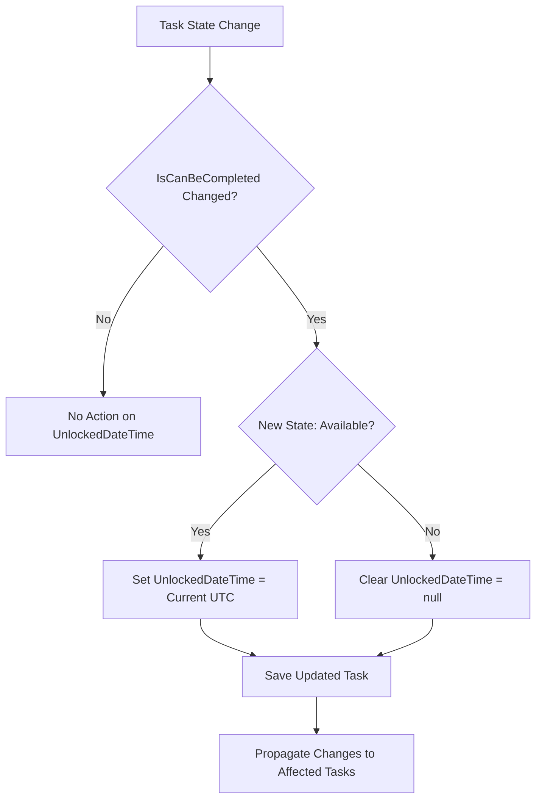
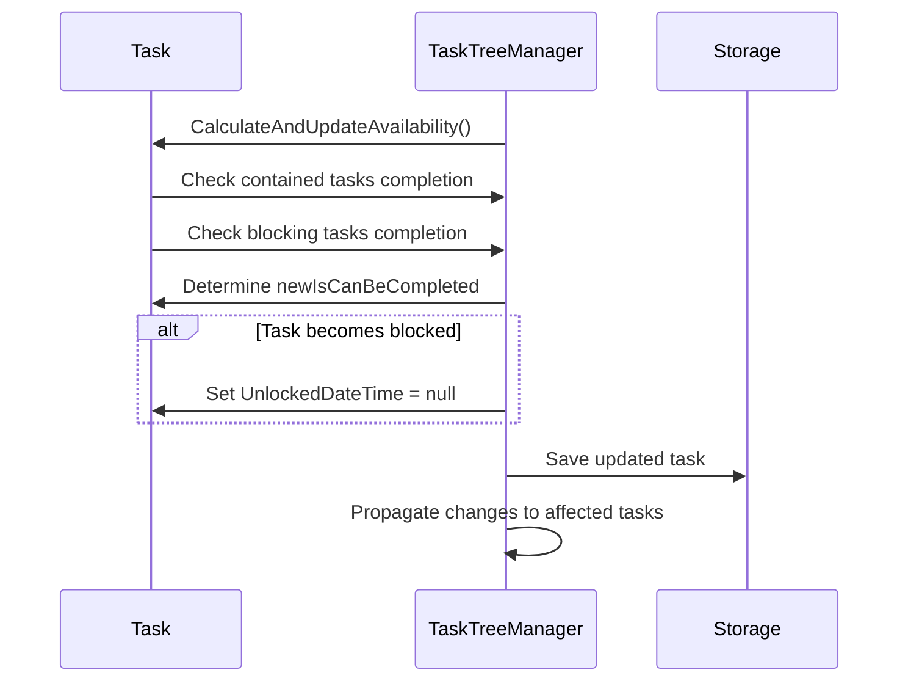
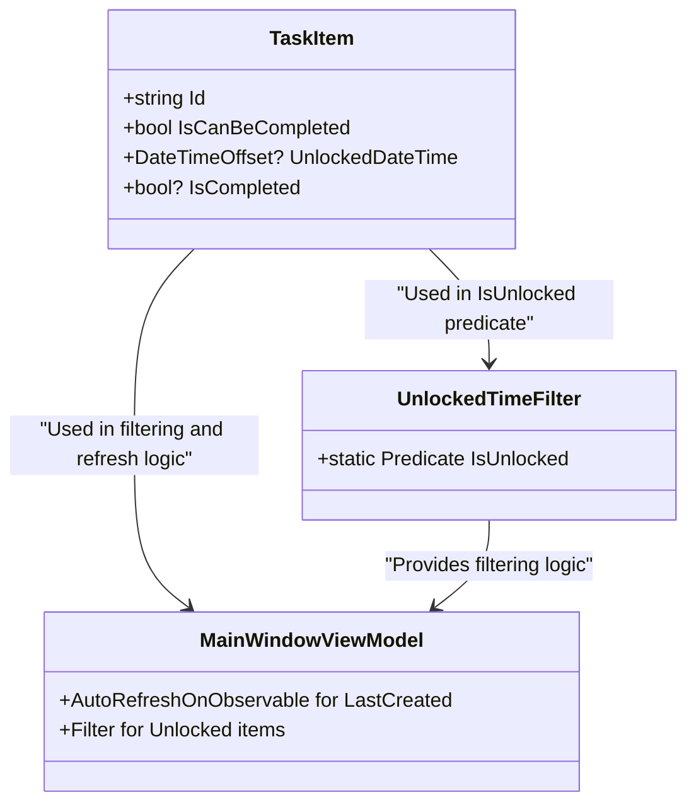
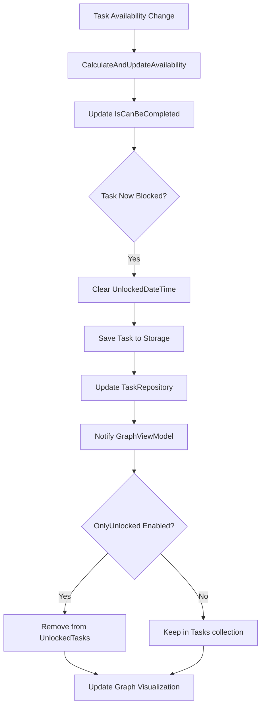

# UnlockedDateTime Clearing Rules

<cite>
**Referenced Files in This Document**   
- [TaskItem.cs](file://src/Unlimotion.Domain/TaskItem.cs)
- [TaskTreeManager.cs](file://src/Unlimotion.TaskTreeManager/TaskTreeManager.cs)
- [TaskAvailabilityCalculationTests.cs](file://src/Unlimotion.Test/TaskAvailabilityCalculationTests.cs)
- [UnlockedTimeFilter.cs](file://src/Unlimotion.ViewModel/UnlockedTimeFilter.cs)
- [MainWindowViewModel.cs](file://src/Unlimotion.ViewModel/MainWindowViewModel.cs)
- [GraphViewModel.cs](file://src/Unlimotion.ViewModel/GraphViewModel.cs)
- [GraphControl.axaml.cs](file://src/Unlimotion/Views/GraphControl.axaml.cs)
- [IMPLEMENTATION_SUMMARY.md](file://IMPLEMENTATION_SUMMARY.md)
</cite>

## Table of Contents
1. [Introduction](#introduction)
2. [UnlockedDateTime Management Rules](#unlockeddatetime-management-rules)
3. [Transition from Available to Blocked](#transition-from-available-to-blocked)
4. [Impact on Downstream Functionality](#impact-on-downstream-functionality)
5. [Roadmap View and Task Analytics](#roadmap-view-and-task-analytics)
6. [Data Integrity and Historical Information](#data-integrity-and-historical-information)
7. [Audit Trail Considerations](#audit-trail-considerations)
8. [Conclusion](#conclusion)

## Introduction
The UnlockedDateTime property in the Unlimotion task management system serves as a critical timestamp that indicates when a task becomes actionable. This document details the conditions under which UnlockedDateTime is cleared, specifically when a task transitions from being available (IsCanBeCompleted true) to blocked (IsCanBeCompleted false). The system maintains data integrity by ensuring UnlockedDateTime only exists for currently actionable tasks, providing accurate information for reporting, filtering, and UI state management across various views including the Roadmap and analytics components.

**Section sources**
- [TaskItem.cs](file://src/Unlimotion.Domain/TaskItem.cs#L14)
- [IMPLEMENTATION_SUMMARY.md](file://IMPLEMENTATION_SUMMARY.md#L99-L105)

## UnlockedDateTime Management Rules
The UnlockedDateTime property is managed according to specific business rules that maintain the integrity of task availability tracking. These rules are implemented in the TaskTreeManager's CalculateAndUpdateAvailability method, which evaluates task dependencies and updates the IsCanBeCompleted status accordingly.

The management rules for UnlockedDateTime are as follows:
- When a task becomes available (IsCanBeCompleted transitions from false to true), UnlockedDateTime is set to the current UTC time
- When a task becomes blocked (IsCanBeCompleted transitions from true to false), UnlockedDateTime is cleared (set to null)
- If there is no change in availability status, UnlockedDateTime remains unchanged

These rules ensure that UnlockedDateTime accurately reflects the current actionable state of a task, serving as a reliable indicator for downstream systems that depend on task availability information.

**Diagram sources**
- [TaskTreeManager.cs](file://src/Unlimotion.TaskTreeManager/TaskTreeManager.cs#L662-L737)

**Section sources**
- [TaskTreeManager.cs](file://src/Unlimotion.TaskTreeManager/TaskTreeManager.cs#L662-L737)
- [IMPLEMENTATION_SUMMARY.md](file://IMPLEMENTATION_SUMMARY.md#L99-L105)

## Transition from Available to Blocked
The transition from available to blocked occurs when a task's dependencies change in a way that prevents it from being completed. According to the business logic implemented in TaskTreeManager, a task can be completed only when all contained tasks are completed and all blocking tasks are completed.

When a task transitions from available (IsCanBeCompleted true) to blocked (IsCanBeCompleted false), the system clears the UnlockedDateTime property. This occurs in the CalculateAndUpdateAvailability method when the condition `!newIsCanBeCompleted && previousIsCanBeCompleted` evaluates to true, triggering the assignment `task.UnlockedDateTime = null`.

This transition can happen in several scenarios:
- A blocking task is added to the task
- A contained task is added that is not completed
- An existing blocking task changes from completed to incomplete
- A parent task becomes blocked due to changes in its dependencies

The system ensures that this transition is properly propagated to all affected tasks through the GetAffectedTasks method, which identifies parent tasks and tasks blocked by this task for recalculation.

**Diagram sources**
- [TaskTreeManager.cs](file://src/Unlimotion.TaskTreeManager/TaskTreeManager.cs#L662-L737)
- [TaskAvailabilityCalculationTests.cs](file://src/Unlimotion.Test/TaskAvailabilityCalculationTests.cs#L269-L311)

**Section sources**
- [TaskTreeManager.cs](file://src/Unlimotion.TaskTreeManager/TaskTreeManager.cs#L662-L737)
- [TaskAvailabilityCalculationTests.cs](file://src/Unlimotion.Test/TaskAvailabilityCalculationTests.cs#L269-L311)

## Impact on Downstream Functionality
The clearing of UnlockedDateTime has significant implications for downstream functionality including reporting, filtering, and UI state management. The system leverages this property to provide accurate representations of task availability across different views and components.

In the filtering system, the UnlockedTimeFilter uses the IsCanBeCompleted property in conjunction with IsCompleted to determine which tasks should be considered unlocked. The static predicate `IsUnlocked` defined in UnlockedTimeFilter explicitly checks both conditions: `e.IsCanBeCompleted && e.IsCompleted == false`. This ensures that only tasks that are both available and not completed appear in the "Unlocked" view.

For reporting purposes, the LastCreated view in MainWindowViewModel monitors changes to IsCanBeCompleted, IsCompleted, and UnlockedDateTime properties to determine when to refresh its display. The AutoRefreshOnObservable method is configured to respond to changes in these properties, ensuring that the UI accurately reflects the current state of tasks.

**Diagram sources**
- [UnlockedTimeFilter.cs](file://src/Unlimotion.ViewModel/UnlockedTimeFilter.cs#L56)
- [MainWindowViewModel.cs](file://src/Unlimotion.ViewModel/MainWindowViewModel.cs#L653-L687)

**Section sources**
- [UnlockedTimeFilter.cs](file://src/Unlimotion.ViewModel/UnlockedTimeFilter.cs#L56)
- [MainWindowViewModel.cs](file://src/Unlimotion.ViewModel/MainWindowViewModel.cs#L653-L687)

## Roadmap View and Task Analytics
The Roadmap view in Unlimotion provides a visual representation of task dependencies as a directed graph, where tasks are displayed as nodes and relationships as edges. The clearing of UnlockedDateTime directly impacts how tasks are presented in this view, particularly when the "Only Unlocked" filter is applied.

The GraphViewModel class maintains two collections: Tasks and UnlockedTasks. When the OnlyUnlocked property is set to true, the GraphControl uses the UnlockedTasks collection to build the graph, which contains only tasks that are currently available for completion. This means that when a task's UnlockedDateTime is cleared due to becoming blocked, it will be excluded from the roadmap visualization when the "Only Unlocked" filter is active.

The system ensures that changes to task availability are properly propagated to the roadmap view through the reactive data binding established in MainWindowViewModel. When a task's IsCanBeCompleted status changes and UnlockedDateTime is cleared, the affected tasks are recalculated, and the graph is updated to reflect the current state of the task network.

**Diagram sources**
- [GraphViewModel.cs](file://src/Unlimotion.ViewModel/GraphViewModel.cs#L15-L16)
- [GraphControl.axaml.cs](file://src/Unlimotion/Views/GraphControl.axaml.cs#L75-L104)
- [MainWindowViewModel.cs](file://src/Unlimotion.ViewModel/MainWindowViewModel.cs#L533-L566)

**Section sources**
- [GraphViewModel.cs](file://src/Unlimotion.ViewModel/GraphViewModel.cs#L15-L16)
- [GraphControl.axaml.cs](file://src/Unlimotion/Views/GraphControl.axaml.cs#L75-L104)

## Data Integrity and Historical Information
Maintaining data integrity is a core principle in the UnlockedDateTime implementation. The system ensures that UnlockedDateTime only exists for tasks that are currently actionable by clearing the timestamp when a task becomes blocked. This approach prevents misleading information in reporting and analytics, where the presence of a non-null UnlockedDateTime would incorrectly suggest that a task is available for completion.

The implementation preserves the historical context of task availability through the combination of multiple timestamp properties: CreatedDateTime, UnlockedDateTime, CompletedDateTime, and ArchiveDateTime. While UnlockedDateTime is cleared when a task becomes blocked, the other timestamps maintain the complete history of the task's lifecycle. This design allows the system to reconstruct the availability history of a task by analyzing the sequence of state changes.

By ensuring UnlockedDateTime only exists for currently actionable tasks, the system provides accurate data for metrics such as:
- Average time to unlock (from creation to availability)
- Duration of availability windows
- Frequency of availability changes
- Patterns in task blocking and unblocking

This approach supports reliable analytics while maintaining a clean and unambiguous representation of current task states.

**Section sources**
- [TaskItem.cs](file://src/Unlimotion.Domain/TaskItem.cs#L14)
- [TaskTreeManager.cs](file://src/Unlimotion.TaskTreeManager/TaskTreeManager.cs#L697-L737)

## Audit Trail Considerations
While the system clears UnlockedDateTime when a task becomes blocked, it preserves historical availability information through alternative means. The audit trail is maintained through the combination of multiple mechanisms that capture the complete lifecycle of task state changes.

The TaskTreeManager's HandleTaskCompletionChange method is responsible for processing changes to task completion status and triggering recalculation of affected tasks. This method ensures that any change affecting task availability is properly propagated through the system. When a task's availability changes, the CalculateAndUpdateAvailability method is called, which updates the IsCanBeCompleted status and manages the UnlockedDateTime accordingly.

The system's reactive architecture, implemented through DynamicData and ReactiveUI components, ensures that changes to task properties are observable throughout the application. The AutoRefreshOnObservable method in MainWindowViewModel monitors changes to key properties including IsCanBeCompleted and UnlockedDateTime, allowing UI components to respond appropriately to state changes.

Although the current implementation clears UnlockedDateTime without preserving the previous value, the system maintains sufficient information to reconstruct availability history through:
- The sequence of state changes captured in the task's property updates
- The timestamps of other lifecycle events (CreatedDateTime, CompletedDateTime, ArchiveDateTime)
- The audit trail of dependency changes that affect availability

This approach balances data integrity with performance considerations, ensuring that the most relevant information (current availability) is immediately accessible while preserving enough context to understand historical patterns.

**Section sources**
- [TaskTreeManager.cs](file://src/Unlimotion.TaskTreeManager/TaskTreeManager.cs#L740-L836)
- [MainWindowViewModel.cs](file://src/Unlimotion.ViewModel/MainWindowViewModel.cs#L653-L687)

## Conclusion
The UnlockedDateTime clearing rules in Unlimotion ensure data integrity by maintaining an accurate representation of task availability. When a task transitions from available to blocked, the system clears the UnlockedDateTime property to prevent misleading information in downstream components. This behavior supports reliable reporting, filtering, and UI state management across the application, particularly in the Roadmap view and analytics features.

The implementation demonstrates a thoughtful balance between maintaining current state accuracy and preserving historical context. By clearing UnlockedDateTime when a task becomes blocked while retaining other lifecycle timestamps, the system provides both immediate clarity about current task availability and sufficient information to analyze historical patterns. This approach ensures that users and automated systems can trust the availability status of tasks, supporting effective task management and planning.