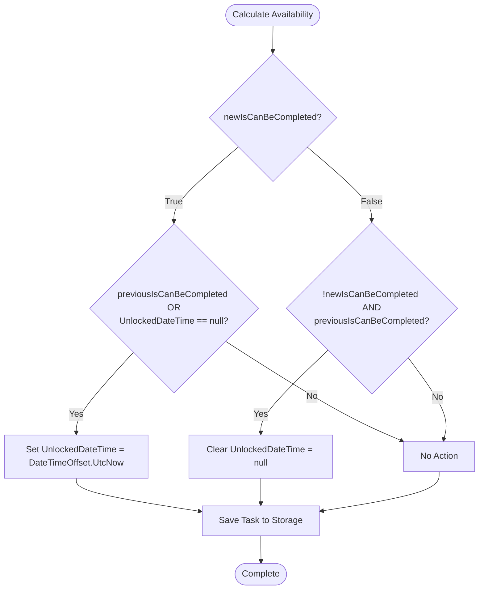
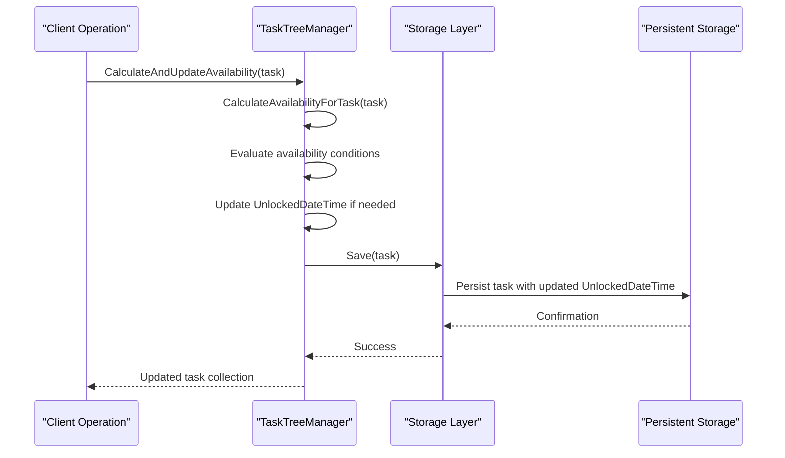
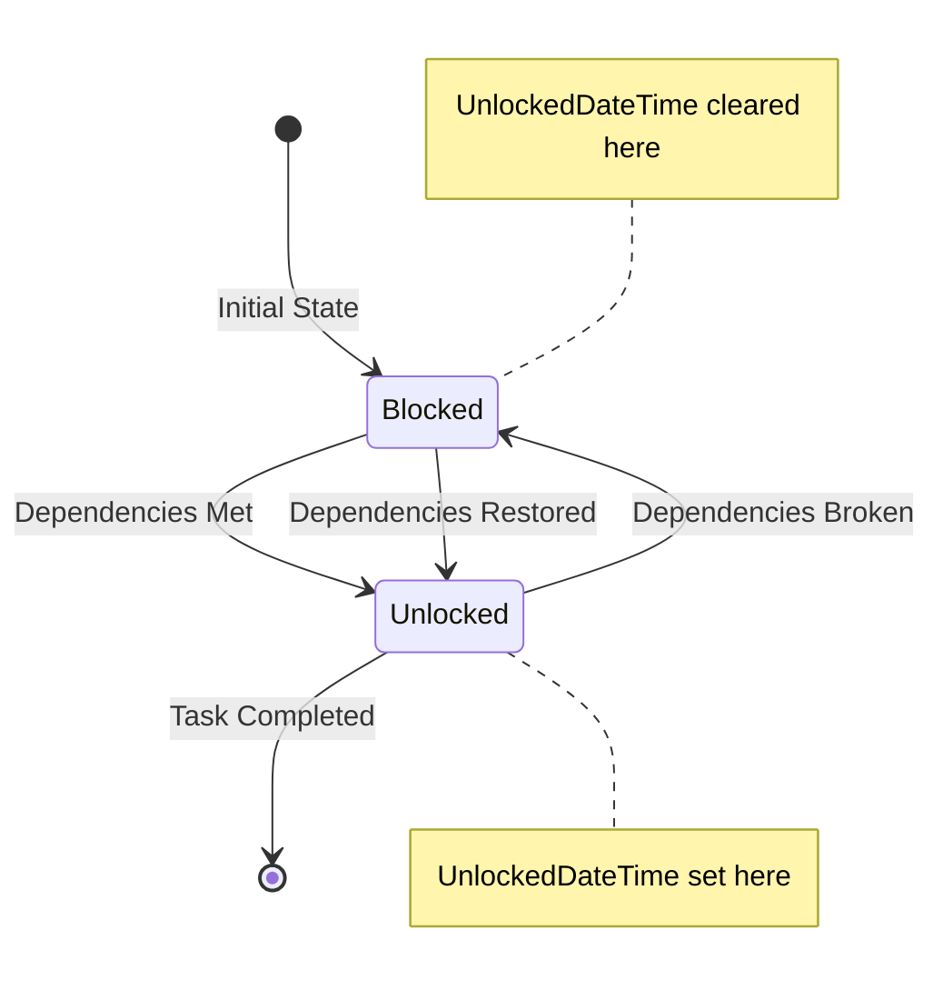
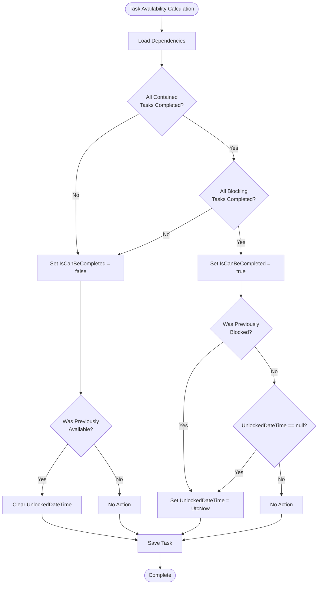

# UnlockedDateTime Setting Rules

<cite>
**Referenced Files in This Document**
- [TaskItem.cs](file://src/Unlimotion.Domain/TaskItem.cs)
- [TaskTreeManager.cs](file://src/Unlimotion.TaskTreeManager/TaskTreeManager.cs)
- [TaskAvailabilityCalculationTests.cs](file://src/Unlimotion.Test\TaskAvailabilityCalculationTests.cs)
- [UnlockedTimeFilter.cs](file://src\Unlimotion.ViewModel\UnlockedTimeFilter.cs)
- [MainWindowViewModel.cs](file://src\Unlimotion.ViewModel\MainWindowViewModel.cs)
- [TaskItemViewModel.cs](file://src\Unlimotion.ViewModel\TaskItemViewModel.cs)
- [InMemoryStorage.cs](file://src\Unlimotion.Test\InMemoryStorage.cs)
</cite>

## Table of Contents
1. [Introduction](#introduction)
2. [Core Concepts](#core-concepts)
3. [UnlockedDateTime Assignment Logic](#unlockeddatetime-assignment-logic)
4. [UTC Timestamping and Timezone Consistency](#utc-timestamping-and-timezone-consistency)
5. [Storage Integration](#storage-integration)
6. [User Experience Implications](#user-experience-implications)
7. [Edge Cases and Special Scenarios](#edge-cases-and-special-scenarios)
8. [Testing and Validation](#testing-and-validation)
9. [Implementation Details](#implementation-details)
10. [Best Practices](#best-practices)

## Introduction

The UnlockedDateTime property serves as a critical timestamp marker in the Unlimotion task management system, indicating when a task transitions from an unavailable (blocked) state to an available (unlocked) state. This documentation provides comprehensive coverage of the rules governing when UnlockedDateTime is set, the conditions under which it activates, and its integration with the broader task availability system.

The UnlockedDateTime mechanism ensures precise tracking of task readiness for completion, enabling sophisticated filtering capabilities and accurate time-to-completion metrics calculation. Understanding these rules is essential for developers working with task availability logic and for users seeking to leverage the system's advanced filtering features.

## Core Concepts

### Task Availability States

The task availability system operates on two primary states that determine when UnlockedDateTime is activated:

1. **Blocked State**: When a task cannot be completed due to unmet dependencies
2. **Unlocked State**: When a task becomes available for completion

### Availability Calculation Rules

A task can be completed when:
- **All contained tasks are completed** (IsCompleted ≠ false)
- **All blocking tasks are completed** (IsCompleted ≠ false)

### State Transition Conditions

The UnlockedDateTime is set based on specific state transitions:
- **From Blocked to Unlocked**: When newIsCanBeCompleted becomes true
- **From Unlocked to Blocked**: When newIsCanBeCompleted becomes false

## UnlockedDateTime Assignment Logic

### Primary Assignment Condition

The core logic for setting UnlockedDateTime follows this conditional pattern:



**Diagram sources**
- [TaskTreeManager.cs](file://src\Unlimotion.TaskTreeManager\TaskTreeManager.cs#L685-L700)

### Detailed Assignment Rules

The assignment logic is implemented in the `CalculateAvailabilityForTask` method with the following conditions:

#### When Task Becomes Available (Blocked → Unlocked)
**Condition**: `newIsCanBeCompleted && (!previousIsCanBeCompleted || task.UnlockedDateTime == null)`
**Action**: Set `task.UnlockedDateTime = DateTimeOffset.UtcNow`

#### When Task Becomes Blocked (Unlocked → Blocked)
**Condition**: `!newIsCanBeCompleted && previousIsCanBeCompleted`
**Action**: Set `task.UnlockedDateTime = null`

#### When No State Change Occurs
**Condition**: `newIsCanBeCompleted == previousIsCanBeCompleted`
**Action**: No modification to UnlockedDateTime

**Section sources**
- [TaskTreeManager.cs](file://src\Unlimotion.TaskTreeManager\TaskTreeManager.cs#L685-L700)

## UTC Timestamping and Timezone Consistency

### Importance of DateTimeOffset.UtcNow

The system exclusively uses `DateTimeOffset.UtcNow` for timestamping to ensure cross-timezone consistency:

#### Benefits of UTC Timestamping
- **Global Consistency**: All timestamps represent the same moment worldwide
- **Avoid Timezone Ambiguity**: Eliminates issues with daylight saving time transitions
- **Storage Efficiency**: Single standardized format for all clients
- **Analytics Accuracy**: Enables precise time-based calculations across regions

#### Implementation Pattern
```csharp
// Correct - UTC timestamping
task.UnlockedDateTime = DateTimeOffset.UtcNow;

// Incorrect - Local time (would cause inconsistencies)
task.UnlockedDateTime = DateTimeOffset.Now;
```

### Cross-Timezone Considerations

The UTC timestamp approach ensures that:
- Users in different timezones see consistent availability indicators
- Time-based filtering works predictably regardless of client location
- Historical data maintains temporal accuracy across global deployments

**Section sources**
- [TaskTreeManager.cs](file://src\Unlimotion.TaskTreeManager\TaskTreeManager.cs#L695-L697)

## Storage Integration

### Persistence Mechanism

The UnlockedDateTime property is automatically persisted through the storage system during availability calculations:



**Diagram sources**
- [TaskTreeManager.cs](file://src\Unlimotion.TaskTreeManager\TaskTreeManager.cs#L699-L700)
- [InMemoryStorage.cs](file://src\Unlimotion.Test\InMemoryStorage.cs#L20-L35)

### Storage Operations Integration

The UnlockedDateTime updates are integrated with the following storage operations:

#### Automatic Persistence
- **Immediate Save**: UnlockedDateTime changes trigger immediate storage persistence
- **Atomic Updates**: Availability calculation and timestamp updates occur atomically
- **Conflict Resolution**: Storage layer handles concurrent modifications appropriately

#### Data Integrity
- **Null Handling**: Proper serialization of null UnlockedDateTime values
- **Type Safety**: Strong typing ensures consistent data representation
- **Version Tracking**: Integration with task versioning for change tracking

**Section sources**
- [TaskTreeManager.cs](file://src\Unlimotion.TaskTreeManager\TaskTreeManager.cs#L699-L700)
- [InMemoryStorage.cs](file://src\Unlimotion.Test\InMemoryStorage.cs#L20-L35)

## User Experience Implications

### Filtering in the 'Unlocked' View

The UnlockedTimeFilter provides sophisticated filtering capabilities based on task availability states:

#### Filter Definition Structure
```csharp
public static readonly Predicate<TaskItemViewModel> IsUnlocked = 
    e => e.IsCanBeCompleted && e.IsCompleted == false;
```

#### Filter Categories
The system provides multiple filter categories for task organization:

| Filter Category | Predicate Condition | Purpose |
|----------------|-------------------|---------|
| Unplanned | `PlannedBeginDateTime == null && PlannedEndDateTime == null` | Tasks without scheduling |
| Overdue | `PlannedEndDateTime != null && DateTime.Now.Date > PlannedEndDateTime?.Date` | Missed deadlines |
| Urgent | `PlannedEndDateTime != null && DateTime.Now.Date == PlannedEndDateTime?.Date` | Today's deadlines |
| Today | `PlannedBeginDateTime != null && DateTime.Now.Date == PlannedBeginDateTime?.Date` | Scheduled today |
| Maybe | Mixed scheduling criteria | Flexible timeline tasks |
| Future | `PlannedBeginDateTime != null && PlannedBeginDateTime?.Date > DateTime.Now.Date` | Upcoming tasks |

### Time-to-Completion Metrics

The UnlockedDateTime enables accurate time-to-completion calculations:

#### Completion Timing Analysis
- **Available Duration**: `DateTimeOffset.UtcNow - UnlockedDateTime` (when applicable)
- **Completion Rate**: Ratio of completed tasks to unlocked tasks
- **Average Unlock Time**: Statistical analysis of task readiness timing

#### User Interface Impact
- **Progress Indicators**: Visual representation of task readiness
- **Priority Sorting**: Automatic prioritization based on unlock timing
- **Deadline Tracking**: Enhanced deadline management capabilities

**Section sources**
- [UnlockedTimeFilter.cs](file://src\Unlimotion.ViewModel\UnlockedTimeFilter.cs#L50-L57)
- [MainWindowViewModel.cs](file://src\Unlimotion.ViewModel\MainWindowViewModel.cs#L390-L410)

## Edge Cases and Special Scenarios

### Tasks Created Already Unlocked

#### Initial State Scenarios
When tasks are created in an unlocked state, the system handles several scenarios:

**Scenario 1: Pre-existing Dependencies**
- **Condition**: Task has completed dependencies at creation
- **Behavior**: UnlockedDateTime remains null (already unlocked)
- **Rationale**: Prevents artificial unlocking timestamps

**Scenario 2: Empty Dependency Lists**
- **Condition**: Task has no contained or blocking dependencies
- **Behavior**: UnlockedDateTime set immediately upon creation
- **Benefit**: Immediate availability indication

### Multiple Availability Transitions

#### Transition History Tracking
The system handles tasks that transition availability multiple times:



**Diagram sources**
- [TaskTreeManager.cs](file://src\Unlimotion.TaskTreeManager\TaskTreeManager.cs#L695-L700)

#### Transition Count Considerations
- **Multiple Unlock Events**: Each unlock creates a new timestamp
- **Blocked Recovery**: Subsequent unlocks reset the availability clock
- **Historical Analysis**: Complete transition history preserved for analytics

### Task Archival and Restoration

#### Archived Tasks Behavior
When tasks are archived (IsCompleted = null), their availability state is preserved:

**Archival Impact**:
- **UnlockedDateTime Preservation**: Timestamps remain intact during archival
- **Availability Recalculation**: Archival status affects availability calculation
- **Restoration Effects**: Archived tasks regain availability upon restoration

**Section sources**
- [TaskAvailabilityCalculationTests.cs](file://src\Unlimotion.Test\TaskAvailabilityCalculationTests.cs#L231-L272)

## Testing and Validation

### Comprehensive Test Coverage

The system includes extensive unit tests validating UnlockedDateTime behavior:

#### Test Scenarios
1. **Basic Availability**: Task with no dependencies becomes available
2. **Dependency Changes**: Adding/removing dependencies affects availability
3. **Blocking Relations**: Creating blocking relationships clears timestamps
4. **Completion Changes**: Task completion triggers appropriate updates
5. **Edge Cases**: Multiple transitions and special scenarios

#### Validation Patterns
```csharp
[Fact]
public async Task UnlockedDateTime_ShouldBeSetWhenTaskBecomesAvailable()
{
    // Arrange
    var task = new TaskItem
    {
        IsCompleted = false,
        IsCanBeCompleted = false,
        UnlockedDateTime = null
    };
    var beforeCalculation = DateTimeOffset.UtcNow;
    
    // Act
    await manager.CalculateAndUpdateAvailability(task);
    
    // Assert
    Assert.True(task.IsCanBeCompleted);
    Assert.NotNull(task.UnlockedDateTime);
    Assert.True(task.UnlockedDateTime >= beforeCalculation);
}
```

### Quality Assurance Measures

#### Automated Testing Framework
- **Unit Tests**: Individual component validation
- **Integration Tests**: End-to-end workflow verification
- **Performance Tests**: Scalability and responsiveness validation
- **Regression Tests**: Prevent functionality degradation

#### Manual Testing Considerations
- **Cross-Platform Validation**: Verify behavior across different environments
- **Timezone Testing**: Confirm UTC timestamp consistency
- **Concurrent Access**: Test simultaneous modifications
- **Error Scenarios**: Validate graceful failure handling

**Section sources**
- [TaskAvailabilityCalculationTests.cs](file://src\Unlimotion.Test\TaskAvailabilityCalculationTests.cs#L231-L272)

## Implementation Details

### Core Algorithm Structure

The availability calculation follows a systematic approach:



**Diagram sources**
- [TaskTreeManager.cs](file://src\Unlimotion.TaskTreeManager\TaskTreeManager.cs#L640-L700)

### Propagation Logic

The system implements comprehensive propagation to affected tasks:

#### Upward Propagation
- **Parent Tasks**: Recalculated when child dependencies change
- **Dependency Chains**: Cascading updates through task hierarchies
- **Recursive Evaluation**: Ensures complete state consistency

#### Downward Propagation
- **Blocked Tasks**: Affected when blocking dependencies resolve
- **Indirect Dependencies**: Tasks affected by upstream changes
- **Batch Processing**: Efficient handling of multiple affected tasks

**Section sources**
- [TaskTreeManager.cs](file://src\Unlimotion.TaskTreeManager\TaskTreeManager.cs#L702-L737)

## Best Practices

### Development Guidelines

#### Code Implementation Standards
1. **UTC Timestamp Usage**: Always use `DateTimeOffset.UtcNow` for new timestamps
2. **Null Safety**: Properly handle null UnlockedDateTime values
3. **Atomic Operations**: Ensure availability calculation and persistence are atomic
4. **Error Handling**: Implement robust error handling for storage operations

#### Performance Optimization
1. **Lazy Loading**: Load dependencies only when needed
2. **Caching Strategies**: Cache frequently accessed task states
3. **Batch Operations**: Group related updates for efficiency
4. **Indexing**: Optimize storage queries for availability calculations

### User Experience Recommendations

#### Interface Design Principles
1. **Clear Indicators**: Provide visual feedback for task availability
2. **Intuitive Filtering**: Design filters that match user mental models
3. **Responsive Updates**: Ensure real-time availability updates
4. **Accessibility**: Support diverse user needs and preferences

#### Analytics and Reporting
1. **Trend Analysis**: Track availability patterns over time
2. **Performance Metrics**: Monitor completion rates and unlock times
3. **User Behavior**: Analyze how availability impacts task completion
4. **Optimization Insights**: Identify bottlenecks in task readiness

### Maintenance and Monitoring

#### System Health Checks
1. **Timestamp Validation**: Verify UnlockedDateTime consistency
2. **Dependency Verification**: Ensure accurate dependency tracking
3. **Performance Monitoring**: Track calculation response times
4. **Data Integrity**: Validate storage consistency

#### Troubleshooting Procedures
1. **Availability Debugging**: Tools for diagnosing stuck tasks
2. **Timestamp Analysis**: Methods for investigating timestamp issues
3. **Performance Profiling**: Techniques for identifying bottlenecks
4. **User Impact Assessment**: Methods for evaluating system effects