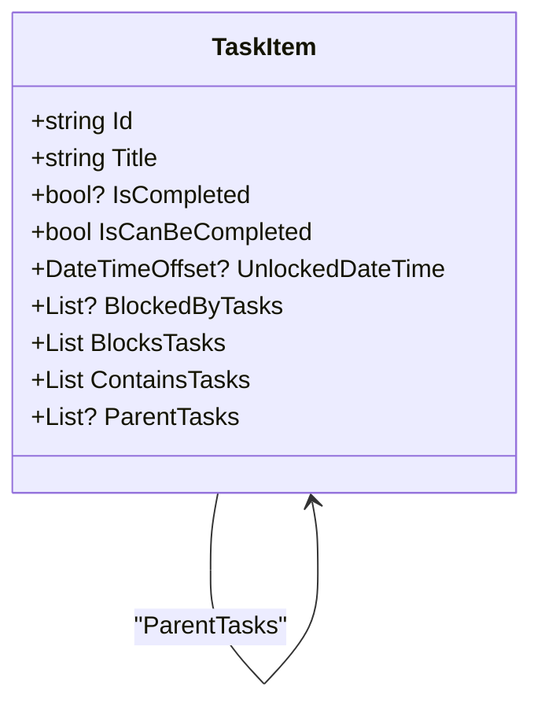
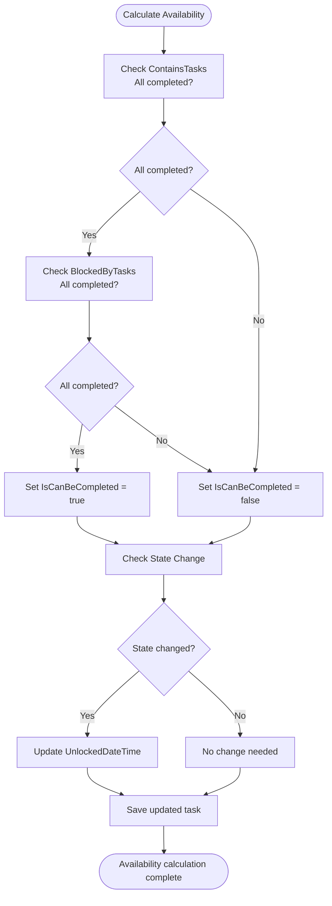
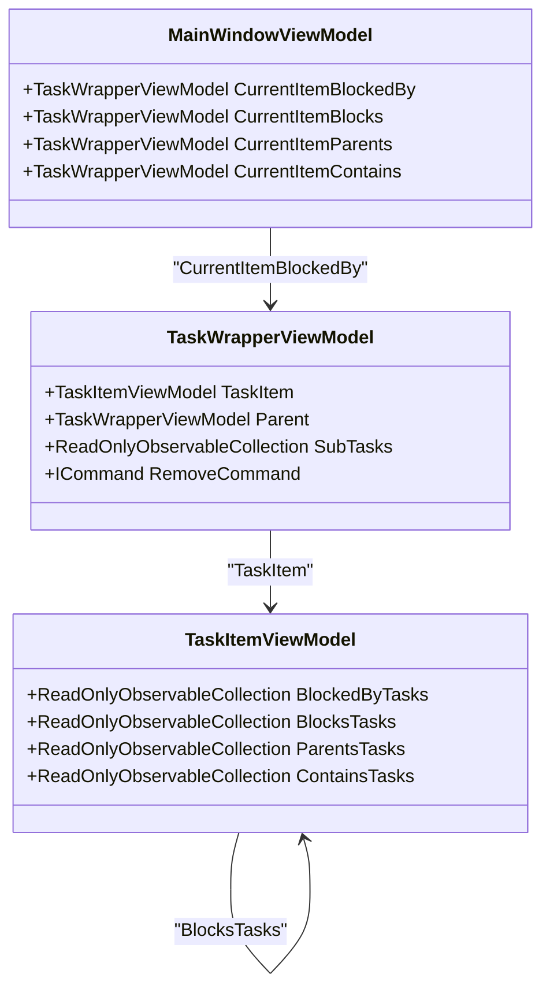
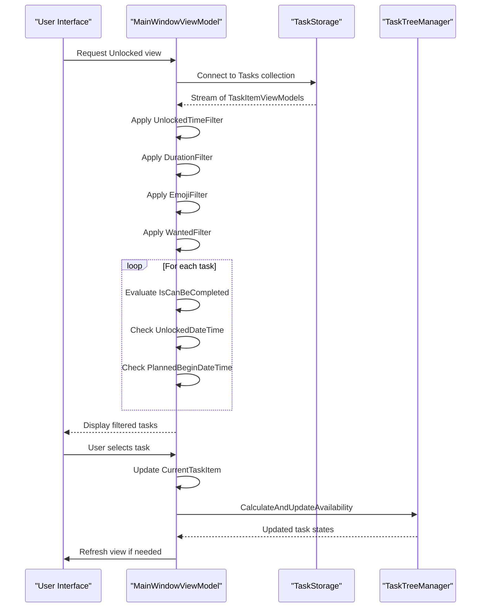
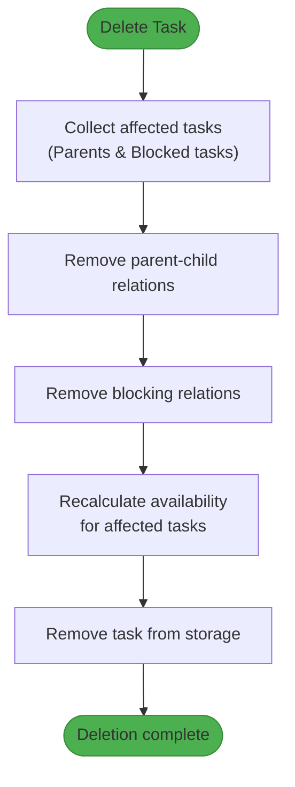
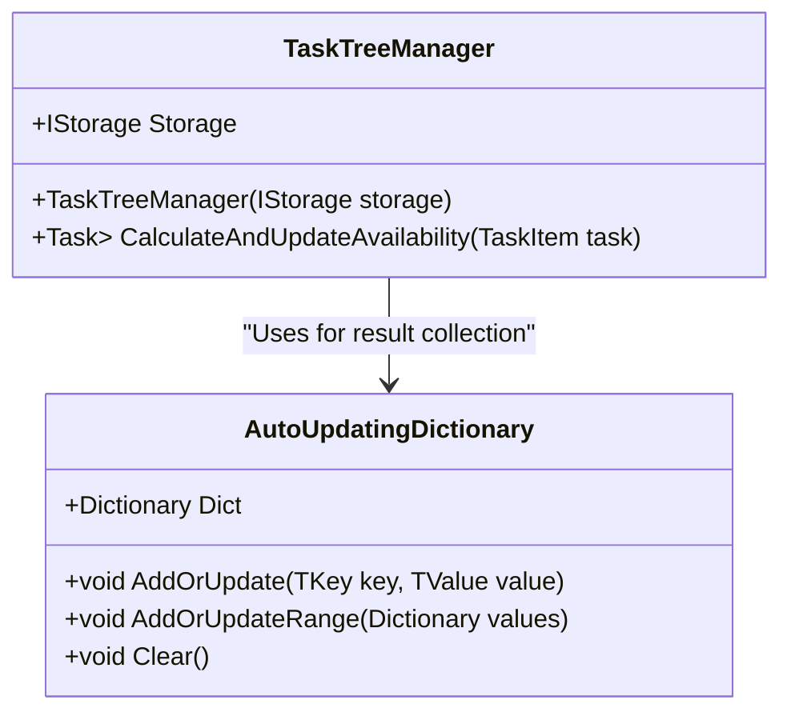
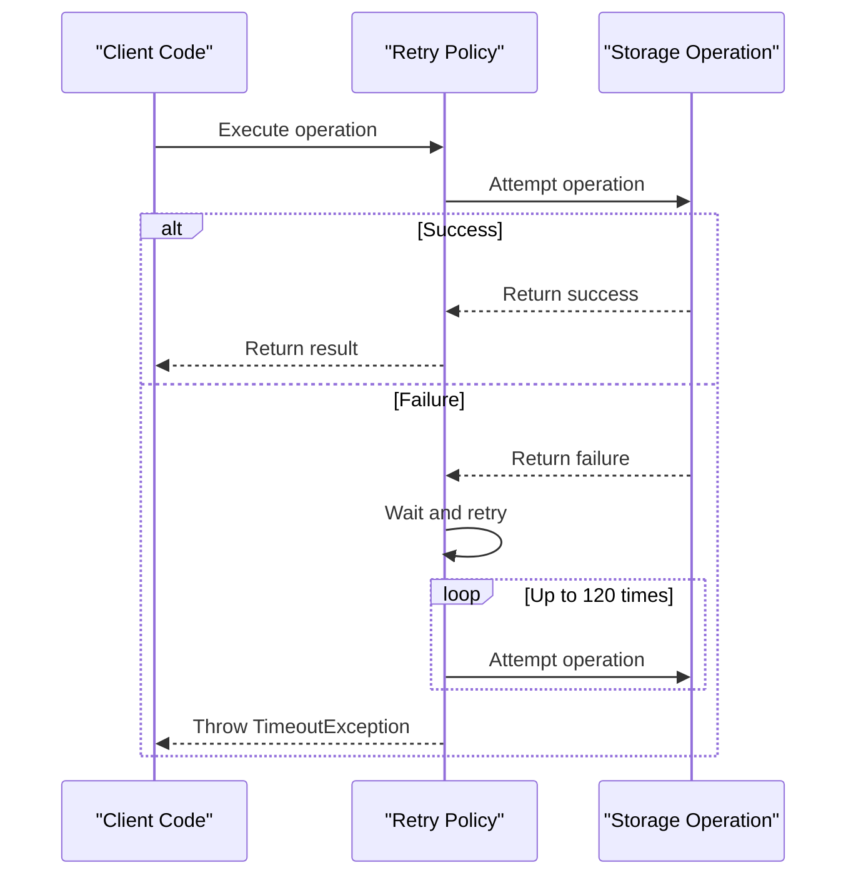

# Blocked By Tasks (Availability) Relationship

<cite>
**Referenced Files in This Document**   
- [TaskItem.cs](file://src/Unlimotion.Domain/TaskItem.cs)
- [TaskItemViewModel.cs](file://src/Unlimotion.ViewModel/TaskItemViewModel.cs)
- [TaskTreeManager.cs](file://src/Unlimotion.TaskTreeManager/TaskTreeManager.cs)
- [MainWindowViewModel.cs](file://src/Unlimotion.ViewModel/MainWindowViewModel.cs)
- [TaskAvailabilityCalculationTests.cs](file://src/Unlimotion.Test/TaskAvailabilityCalculationTests.cs)
</cite>

## Table of Contents
1. [Introduction](#introduction)
2. [BlockedByTasks Collection and Task Availability](#blockedbytasks-collection-and-task-availability)
3. [Reactive Logic in TaskItemViewModel](#reactive-logic-in-taskitemviewmodel)
4. [UI Representation in CurrentItemBlockedBy View](#ui-representation-in-currentitemblockedby-view)
5. [Unlocked View Filtering Logic](#unlocked-view-filtering-logic)
6. [Edge Cases and Error Handling](#edge-cases-and-error-handling)
7. [Performance Optimization](#performance-optimization)
8. [Conclusion](#conclusion)

## Introduction
The BlockedByTasks relationship in Unlimotion implements a sophisticated task dependency system that determines task availability based on prerequisite completion. This document details how the BlockedByTasks collection controls task completion availability, the reactive logic that updates task state, UI representations, and handling of edge cases. The system ensures that tasks cannot be completed until all blocking tasks are finished, providing a robust workflow management mechanism.

**Section sources**
- [TaskItem.cs](file://src/Unlimotion.Domain/TaskItem.cs)
- [TaskTreeManager.cs](file://src/Unlimotion.TaskTreeManager/TaskTreeManager.cs)

## BlockedByTasks Collection and Task Availability

The BlockedByTasks relationship is a fundamental component of Unlimotion's task management system, determining whether a task can be completed based on the completion status of prerequisite tasks. This relationship is implemented through a collection of task IDs that represent tasks which must be completed before the current task becomes available.

In the domain model, BlockedByTasks is defined as a collection of strings representing the IDs of tasks that block the current task:

**Diagram sources**
- [TaskItem.cs](file://src/Unlimotion.Domain/TaskItem.cs#L23)

The availability calculation follows two primary business rules:
1. All contained tasks must be completed (IsCompleted != false)
2. All blocking tasks must be completed (IsCompleted != false)

When a task has blocking tasks, it cannot be completed until all tasks in its BlockedByTasks collection are completed. The TaskTreeManager handles this logic by checking the completion status of each task in the BlockedByTasks collection. If any blocking task has IsCompleted set to false, the dependent task's IsCanBeCompleted property is set to false, preventing completion.

The system also maintains a reciprocal BlocksTasks collection, which contains the IDs of tasks that are blocked by the current task. This bidirectional relationship ensures that when a blocking task is completed, all tasks that depend on it can be properly evaluated for availability.

**Section sources**
- [TaskItem.cs](file://src/Unlimotion.Domain/TaskItem.cs#L23)
- [TaskTreeManager.cs](file://src/Unlimotion.TaskTreeManager/TaskTreeManager.cs#L662-L699)

## Reactive Logic in TaskItemViewModel

The TaskItemViewModel implements reactive logic that automatically updates the IsCanBeCompleted and UnlockedDateTime properties based on changes to the BlockedByTasks collection. This reactive system ensures that task availability is always up-to-date without requiring manual refresh operations.

The core availability calculation occurs in the TaskTreeManager's CalculateAvailabilityForTask method, which evaluates both containment and blocking dependencies:

**Diagram sources**
- [TaskTreeManager.cs](file://src/Unlimotion.TaskTreeManager/TaskTreeManager.cs#L662-L737)

When a task becomes available (IsCanBeCompleted transitions from false to true), the UnlockedDateTime is set to the current UTC time. Conversely, when a task becomes blocked (IsCanBeCompleted transitions from true to false), the UnlockedDateTime is cleared. This timestamp provides valuable information about when tasks became available for completion.

The reactive system is triggered by various operations:
- Completion of a blocking task
- Addition or removal of blocking relationships
- Creation of new tasks that affect dependencies
- Deletion of tasks that were part of dependency chains

The TaskTreeManager ensures that when any task's state changes, all affected tasks are properly recalculated. For example, when a blocking task is completed, the system automatically recalculates the availability of all tasks in its BlocksTasks collection.

**Section sources**
- [TaskTreeManager.cs](file://src/Unlimotion.TaskTreeManager/TaskTreeManager.cs#L662-L737)
- [TaskItemViewModel.cs](file://src/Unlimotion.ViewModel/TaskItemViewModel.cs#L394-L398)

## UI Representation in CurrentItemBlockedBy View

The UI representation of blocking relationships is implemented through the CurrentItemBlockedBy view in the MainWindowViewModel. This view provides a user-friendly interface for managing and visualizing task dependencies.

The CurrentItemBlockedBy property is bound to the BlockedByTasks collection of the currently selected task, creating a real-time view of all tasks that must be completed before the current task becomes available:

**Diagram sources**
- [MainWindowViewModel.cs](file://src/Unlimotion.ViewModel/MainWindowViewModel.cs#L810-L841)
- [TaskItemViewModel.cs](file://src/Unlimotion.ViewModel/TaskItemViewModel.cs#L423)

The UI implementation uses ReactiveUI's observable collections and bindings to create a responsive interface. When a task is selected, the CurrentItemBlockedBy view automatically updates to show all tasks in the BlockedByTasks collection. Users can remove blocking relationships through the UnblockCommand, which triggers the appropriate backend operations.

The view also supports sorting and filtering, allowing users to easily navigate complex dependency graphs. Each blocking task is displayed with relevant information such as title, completion status, and other metadata, providing context for the dependency relationship.

When a blocking task is completed, the UI automatically updates to reflect the changed availability status of dependent tasks. This real-time feedback helps users understand the impact of their actions on the overall task workflow.

**Section sources**
- [MainWindowViewModel.cs](file://src/Unlimotion.ViewModel/MainWindowViewModel.cs#L810-L841)
- [TaskItemViewModel.cs](file://src/Unlimotion.ViewModel/TaskItemViewModel.cs#L423)

## Unlocked View Filtering Logic

The Unlocked view in MainWindowViewModel implements filtering logic that displays only tasks that are available for completion. This view is crucial for helping users focus on tasks they can immediately work on, without being distracted by blocked or unavailable tasks.

The filtering logic is implemented through a combination of observable collections and predicate functions that evaluate the IsCanBeCompleted property:

**Diagram sources**
- [MainWindowViewModel.cs](file://src/Unlimotion.ViewModel/MainWindowViewModel.cs#L780-L876)

The Unlocked view filtering considers multiple criteria:
- IsCanBeCompleted must be true
- IsCompleted must be false (not already completed)
- UnlockedDateTime must be set (indicating the task has become available)
- Optional filters for time, duration, emoji, and wanted status

The view uses DynamicData's observable change sets to efficiently handle updates. When tasks are added, removed, or modified, the filtering is automatically reapplied without requiring a complete refresh of the view. This approach provides smooth performance even with large numbers of tasks.

The sorting mechanism allows users to organize unlocked tasks according to different criteria, such as creation date or custom sort orders. This flexibility helps users prioritize their work based on their preferred workflow.

**Section sources**
- [MainWindowViewModel.cs](file://src/Unlimotion.ViewModel/MainWindowViewModel.cs#L780-L876)
- [TaskAvailabilityCalculationTests.cs](file://src/Unlimotion.Test/TaskAvailabilityCalculationTests.cs#L231-L272)

## Edge Cases and Error Handling

The BlockedByTasks system includes comprehensive handling of edge cases to ensure robust operation in complex scenarios. These edge cases include circular blocking, handling of deleted blocking tasks, and other potential issues that could arise in real-world usage.

### Circular Blocking Detection
The system prevents circular blocking relationships through careful validation during relationship creation. When attempting to create a blocking relationship, the system checks for potential cycles by traversing the dependency graph. If a cycle is detected, the operation is rejected to maintain data integrity.

### Handling of Deleted Blocking Tasks
When a task that is referenced in BlockedByTasks is deleted, the system automatically removes the reference from the BlockedByTasks collection of all dependent tasks. This cleanup prevents orphaned references and ensures that tasks are not permanently blocked by non-existent prerequisites.

The deletion process follows a specific sequence:
1. Collect all tasks affected by the deletion
2. Remove the blocking relationship from dependent tasks
3. Recalculate availability for affected tasks
4. Remove the task from storage

**Diagram sources**
- [TaskTreeManager.cs](file://src/Unlimotion.TaskTreeManager/TaskTreeManager.cs#L185-L217)

### Other Edge Cases
The system also handles several other edge cases:
- **Archived tasks**: Tasks with IsCompleted set to null (archived) do not block dependent tasks
- **Simultaneous updates**: The system uses transactional operations to handle concurrent updates safely
- **Network failures**: Retry policies ensure operations complete even with temporary connectivity issues
- **Data corruption**: Validation checks prevent invalid state transitions

The implementation includes comprehensive unit tests that verify the correct handling of these edge cases, ensuring reliability in production environments.

**Section sources**
- [TaskTreeManager.cs](file://src/Unlimotion.TaskTreeManager/TaskTreeManager.cs#L185-L217)
- [TaskAvailabilityCalculationTests.cs](file://src/Unlimotion.Test/TaskAvailabilityCalculationTests.cs#L83-L123)

## Performance Optimization

The BlockedByTasks system implements several performance optimizations to handle large dependency graphs efficiently. These optimizations ensure responsive operation even with thousands of interconnected tasks.

### Caching and Batch Processing
The system uses AutoUpdatingDictionary to efficiently manage collections of tasks that are being updated. This custom dictionary implementation provides optimized add and update operations, reducing memory allocations and improving performance.

**Diagram sources**
- [AutoUpdatingDictionary.cs](file://src/Unlimotion.TaskTreeManager/AutoUpdatingDictionary.cs#L1-L27)

### Efficient Dependency Traversal
The system uses HashSet collections to track processed task IDs during dependency traversal, preventing infinite loops and redundant processing. This optimization is particularly important for large graphs where the same task might be reached through multiple paths.

### Reactive Programming Patterns
The implementation leverages ReactiveUI's observable collections and change sets to minimize unnecessary computations. Changes are propagated only to subscribers that need them, and filtering operations are applied incrementally rather than reprocessing entire collections.

### Retry Policies and Error Handling
The system implements Polly-based retry policies for storage operations, ensuring reliability while maintaining performance. The IsCompletedAsync method wraps operations in a retry policy that handles transient failures:

**Diagram sources**
- [TaskTreeManager.cs](file://src/Unlimotion.TaskTreeManager/TaskTreeManager.cs#L597-L631)

These optimizations work together to provide a responsive user experience while maintaining data integrity and reliability.

**Section sources**
- [AutoUpdatingDictionary.cs](file://src/Unlimotion.TaskTreeManager/AutoUpdatingDictionary.cs#L1-L27)
- [TaskTreeManager.cs](file://src/Unlimotion.TaskTreeManager/TaskTreeManager.cs#L597-L631)
- [TaskItemViewModel.cs](file://src/Unlimotion.ViewModel/TaskItemViewModel.cs#L642-L655)

## Conclusion
The BlockedByTasks relationship in Unlimotion provides a robust and efficient system for managing task dependencies and availability. By implementing a bidirectional relationship between blocking and blocked tasks, the system ensures that tasks can only be completed when all prerequisites are finished.

The architecture separates concerns effectively, with business logic centralized in the TaskTreeManager and reactive UI updates handled by the ViewModel layer. This separation enables consistent behavior across different components while providing a responsive user interface.

Key strengths of the implementation include:
- Comprehensive handling of edge cases like circular dependencies and deleted tasks
- Efficient performance optimizations for large dependency graphs
- Real-time updates through reactive programming patterns
- Clear separation between domain model, business logic, and UI presentation

The system demonstrates a well-designed approach to task dependency management, balancing complexity with usability and performance. The extensive unit testing ensures reliability, while the thoughtful UI design helps users understand and manage their task workflows effectively.

**Section sources**
- [TaskItem.cs](file://src/Unlimotion.Domain/TaskItem.cs)
- [TaskTreeManager.cs](file://src/Unlimotion.TaskTreeManager/TaskTreeManager.cs)
- [TaskItemViewModel.cs](file://src/Unlimotion.ViewModel/TaskItemViewModel.cs)
- [MainWindowViewModel.cs](file://src/Unlimotion.ViewModel/MainWindowViewModel.cs)
- [TaskAvailabilityCalculationTests.cs](file://src/Unlimotion.Test/TaskAvailabilityCalculationTests.cs)