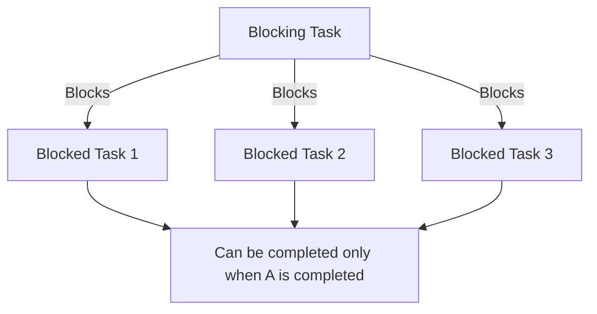
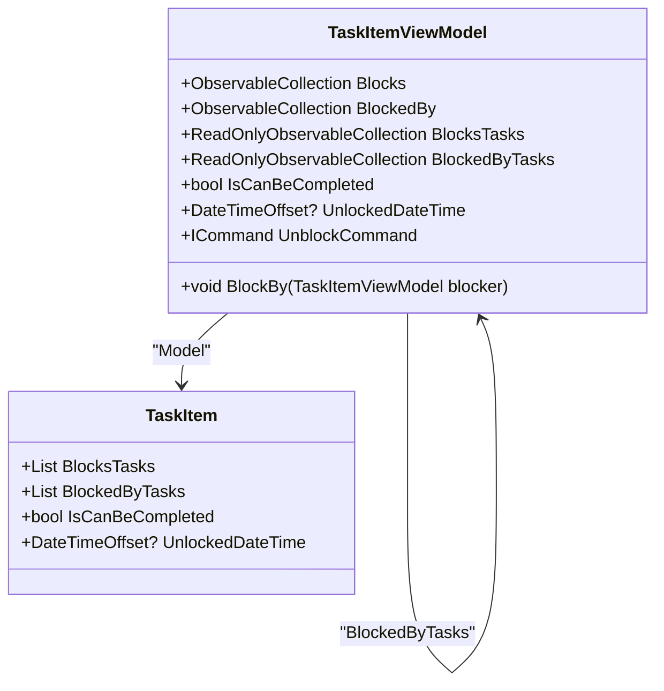
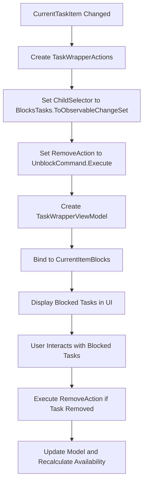
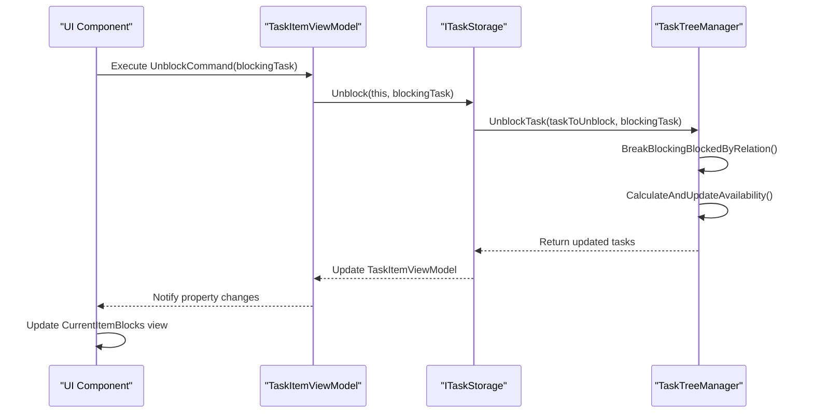
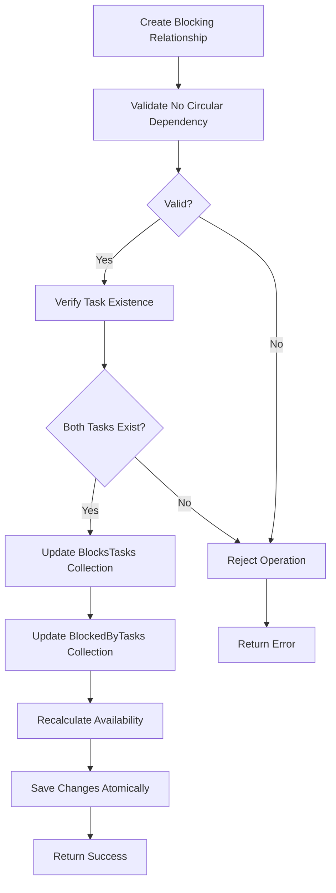

# Blocks Tasks (Dependency) Relationship

<cite>
**Referenced Files in This Document**   
- [TaskItem.cs](file://src/Unlimotion.Domain/TaskItem.cs)
- [TaskItemViewModel.cs](file://src/Unlimotion.ViewModel/TaskItemViewModel.cs)
- [MainWindowViewModel.cs](file://src/Unlimotion.ViewModel/MainWindowViewModel.cs)
- [TaskTreeManager.cs](file://src/Unlimotion.TaskTreeManager/TaskTreeManager.cs)
- [ITaskStorage.cs](file://src/Unlimotion.ViewModel/ITaskStorage.cs)
- [BlockEdge.cs](file://src/Unlimotion/Views/Graph/BlockEdge.cs)
- [TaskWrapperViewModel.cs](file://src/Unlimotion.ViewModel/TaskWrapperViewModel.cs)
</cite>

## Table of Contents
1. [Introduction](#introduction)
2. [Forward Dependency Chains and Workflow Sequencing](#forward-dependency-chains-and-workflow-sequencing)
3. [Implementation in TaskItemViewModel](#implementation-in-taskitemviewmodel)
4. [UI Representation in CurrentItemBlocks View](#ui-representation-in-currentitemblocks-view)
5. [Reactive Updates and UnblockCommand Execution](#reactive-updates-and-unblockcommand-execution)
6. [Data Integrity and Validation Rules](#data-integrity-and-validation-rules)
7. [Interaction with BlockedByTasks Collection](#interaction-with-blockedbytasks-collection)
8. [Conclusion](#conclusion)

## Introduction
The Blocks Tasks (Dependency) relationship in Unlimotion establishes a forward dependency chain between tasks, enabling workflow sequencing and proper task management. This relationship allows one task to block the completion of another task, creating a dependency structure that ensures tasks are completed in the correct order. The implementation spans multiple components including the domain model, view models, and storage layers, providing a comprehensive system for managing task dependencies.

**Section sources**
- [TaskItem.cs](file://src/Unlimotion.Domain/TaskItem.cs#L1-L33)
- [TaskItemViewModel.cs](file://src/Unlimotion.ViewModel/TaskItemViewModel.cs#L1-L666)

## Forward Dependency Chains and Workflow Sequencing
The Blocks Tasks relationship creates forward dependency chains by allowing a task to block the completion of other tasks. This mechanism enables workflow sequencing by ensuring that certain tasks cannot be completed until their blocking tasks are finished. The relationship is implemented through the `BlocksTasks` collection in the `TaskItem` domain model, which contains the IDs of tasks that are blocked by the current task.

When a task blocks another task, it creates a unidirectional dependency where the blocked task cannot be marked as completed until the blocking task is completed. This creates a workflow sequence where tasks must be completed in a specific order, preventing premature completion of dependent tasks. The system automatically manages these dependencies, updating the availability status of blocked tasks when blocking tasks are completed.

The forward dependency chain is particularly useful for complex workflows where multiple tasks depend on the completion of prerequisite tasks. For example, a project management scenario might have a "Design" task that blocks multiple implementation tasks, ensuring that development cannot begin until the design is finalized.



**Diagram sources**
- [TaskItem.cs](file://src/Unlimotion.Domain/TaskItem.cs#L1-L33)
- [TaskTreeManager.cs](file://src/Unlimotion.TaskTreeManager/TaskTreeManager.cs#L1-L837)

## Implementation in TaskItemViewModel
The `TaskItemViewModel` class implements the Blocks Tasks relationship through several key properties and methods that affect the `IsCanBeCompleted` state and `UnlockedDateTime` calculation. The implementation uses reactive programming patterns to ensure that changes to blocking relationships are automatically reflected in the task's availability status.

The `IsCanBeCompleted` property is a critical component of the implementation, determining whether a task can be marked as completed. This property is automatically updated based on two conditions: all contained tasks must be completed, and all blocking tasks must be completed. The calculation occurs in the `CalculateAvailabilityForTask` method of the `TaskTreeManager`, which evaluates these conditions and updates the `IsCanBeCompleted` flag accordingly.

The `UnlockedDateTime` property is calculated based on the availability status of the task. When a task becomes available (i.e., `IsCanBeCompleted` transitions from false to true), the `UnlockedDateTime` is set to the current timestamp. Conversely, when a task becomes blocked, the `UnlockedDateTime` is cleared. This provides a historical record of when tasks became available for completion.

The implementation also includes observable collections for managing the blocking relationships. The `Blocks` collection contains the IDs of tasks that are blocked by the current task, while the `BlockedBy` collection contains the IDs of tasks that block the current task. These collections are synchronized with the underlying model and provide reactive updates when changes occur.



**Diagram sources**
- [TaskItemViewModel.cs](file://src/Unlimotion.ViewModel/TaskItemViewModel.cs#L1-L666)
- [TaskItem.cs](file://src/Unlimotion.Domain/TaskItem.cs#L1-L33)

**Section sources**
- [TaskItemViewModel.cs](file://src/Unlimotion.ViewModel/TaskItemViewModel.cs#L1-L666)
- [TaskTreeManager.cs](file://src/Unlimotion.TaskTreeManager/TaskTreeManager.cs#L1-L837)

## UI Representation in CurrentItemBlocks View
The UI representation of the Blocks Tasks relationship is managed through the `CurrentItemBlocks` view in the `MainWindowViewModel`. This view displays the tasks that are blocked by the currently selected task, providing a visual representation of the forward dependencies.

The implementation uses the `TaskWrapperViewModel` to create a hierarchical representation of the blocked tasks. When the current task is updated, the `CurrentItemBlocks` property is bound to a new `TaskWrapperViewModel` instance that contains the blocked tasks. The binding is established through a reactive subscription that listens for changes to the `CurrentTaskItem` property.

The view uses a consistent pattern for displaying related tasks, with the `ChildSelector` function configured to use the `BlocksTasks` observable collection. This ensures that the view automatically updates when blocking relationships are added or removed. The `RemoveAction` is configured to execute the `UnblockCommand` when a blocked task is removed from the view, maintaining consistency between the UI and the underlying model.

The UI also provides sorting capabilities for the blocked tasks, using the `SortComparer` property to determine the display order. By default, tasks are sorted by their creation date, but this can be customized based on user preferences. The view supports expansion and collapse of task hierarchies, allowing users to navigate complex dependency structures.



**Diagram sources**
- [MainWindowViewModel.cs](file://src/Unlimotion.ViewModel/MainWindowViewModel.cs#L1-L1076)
- [TaskWrapperViewModel.cs](file://src/Unlimotion.ViewModel/TaskWrapperViewModel.cs#L1-L125)

**Section sources**
- [MainWindowViewModel.cs](file://src/Unlimotion.ViewModel/MainWindowViewModel.cs#L780-L841)
- [TaskWrapperViewModel.cs](file://src/Unlimotion.ViewModel/TaskWrapperViewModel.cs#L1-L125)

## Reactive Updates and UnblockCommand Execution
The reactive update system in Unlimotion ensures that changes to blocking relationships are immediately reflected throughout the application. This is achieved through the use of reactive programming patterns, particularly with the ReactiveUI framework, which provides a robust system for managing observable properties and commands.

The `UnblockCommand` is a key component of the reactive update system, allowing users to remove blocking relationships between tasks. When executed, the command calls the `Unblock` method on the `ITaskStorage` interface, which initiates the process of removing the blocking relationship. The command is implemented as a `ReactiveCommand` that takes a `TaskItemViewModel` parameter representing the blocking task.

The execution of the `UnblockCommand` triggers a cascade of updates that maintain data consistency across the application. First, the `BreakBlockingBlockedByRelation` method in the `TaskTreeManager` removes the relationship from both the blocking and blocked tasks. Then, the `CalculateAndUpdateAvailability` method is called to recalculate the availability status of the affected tasks. This ensures that the `IsCanBeCompleted` and `UnlockedDateTime` properties are updated correctly.

The reactive system also handles UI updates automatically. When the blocking relationship is removed, the observable collections in the `TaskItemViewModel` are updated, which triggers updates in all bound views. For example, the `CurrentItemBlocks` view will automatically remove the unblocked task from its display, and the `CurrentItemBlockedBy` view on the previously blocked task will also be updated.



**Diagram sources**
- [TaskItemViewModel.cs](file://src/Unlimotion.ViewModel/TaskItemViewModel.cs#L1-L666)
- [ITaskStorage.cs](file://src/Unlimotion.ViewModel/ITaskStorage.cs#L1-L33)
- [TaskTreeManager.cs](file://src/Unlimotion.TaskTreeManager/TaskTreeManager.cs#L1-L837)

**Section sources**
- [TaskItemViewModel.cs](file://src/Unlimotion.ViewModel/TaskItemViewModel.cs#L200-L210)
- [ITaskStorage.cs](file://src/Unlimotion.ViewModel/ITaskStorage.cs#L25-L26)
- [TaskTreeManager.cs](file://src/Unlimotion.TaskTreeManager/TaskTreeManager.cs#L600-L650)

## Data Integrity and Validation Rules
The Blocks Tasks relationship implementation includes comprehensive data integrity checks and validation rules to ensure the consistency and reliability of task dependencies. These rules are enforced at multiple levels of the application, from the domain model to the storage layer.

One of the primary validation rules prevents circular dependencies, where a task indirectly blocks itself through a chain of blocking relationships. This is enforced in the `CreateBlockingBlockedByRelation` method of the `TaskTreeManager`, which checks for circular references before establishing a new blocking relationship. If a circular dependency is detected, the operation is rejected to maintain data integrity.

Another important validation rule ensures referential integrity by verifying that both the blocking and blocked tasks exist in the system before establishing a relationship. This prevents orphaned references and maintains the consistency of the task graph. The validation occurs in the `BlockTask` method, which loads both tasks from storage before creating the relationship.

The system also includes validation for data consistency during concurrent operations. The `IsCompletedAsync` method in the `TaskTreeManager` implements a retry policy with a timeout mechanism to handle potential race conditions. This ensures that operations on task dependencies are completed successfully even in high-concurrency scenarios.

Data integrity is further maintained through the use of atomic operations. When a blocking relationship is created or removed, both sides of the relationship are updated in a single transaction. This prevents partial updates that could leave the system in an inconsistent state. The atomic operations are implemented using the `AutoUpdatingDictionary` class, which collects all changes and applies them together.



**Diagram sources**
- [TaskTreeManager.cs](file://src/Unlimotion.TaskTreeManager/TaskTreeManager.cs#L1-L837)
- [ITaskStorage.cs](file://src/Unlimotion.ViewModel/ITaskStorage.cs#L1-L33)

**Section sources**
- [TaskTreeManager.cs](file://src/Unlimotion.TaskTreeManager/TaskTreeManager.cs#L400-L650)
- [ITaskStorage.cs](file://src/Unlimotion.ViewModel/ITaskStorage.cs#L25-L26)

## Interaction with BlockedByTasks Collection
The Blocks Tasks relationship interacts closely with the `BlockedByTasks` collection to determine task availability and create a bidirectional dependency system. While `BlocksTasks` represents the forward direction of the relationship (what this task blocks), `BlockedByTasks` represents the reverse direction (what blocks this task). Together, these collections form a complete picture of a task's dependency status.

The interaction between these collections is managed through the `CalculateAvailabilityForTask` method in the `TaskTreeManager`. This method evaluates both collections to determine if a task can be completed. A task can only be completed if all tasks in its `BlockedByTasks` collection are completed (i.e., it is not blocked by any tasks) and all tasks in its `ContainsTasks` collection are completed (i.e., all subtasks are finished).

When a task is added to another task's `BlocksTasks` collection, it is automatically added to the corresponding task's `BlockedByTasks` collection. This bidirectional update ensures consistency across the system and is handled by the `CreateBlockingBlockedByRelation` method. Similarly, when a blocking relationship is removed, both collections are updated simultaneously through the `BreakBlockingBlockedByRelation` method.

The UI also reflects this bidirectional relationship through separate views for blocked and blocking tasks. The `CurrentItemBlocks` view displays tasks in the `BlocksTasks` collection, while the `CurrentItemBlockedBy` view displays tasks in the `BlockedByTasks` collection. This allows users to easily navigate both directions of the dependency graph.

```mermaid
classDiagram
class TaskItem {
+List<string> BlocksTasks
+List<string> BlockedByTasks
}
TaskItem "1" --> "0..*" TaskItem : "BlocksTasks"
TaskItem "1" --> "0..*" TaskItem : "BlockedByTasks"
note right of TaskItem
BlocksTasks : Tasks that this task blocks
BlockedByTasks : Tasks that block this task
end
```

**Diagram sources**
- [TaskItem.cs](file://src/Unlimotion.Domain/TaskItem.cs#L1-L33)
- [TaskTreeManager.cs](file://src/Unlimotion.TaskTreeManager/TaskTreeManager.cs#L1-L837)

**Section sources**
- [TaskItem.cs](file://src/Unlimotion.Domain/TaskItem.cs#L1-L33)
- [TaskTreeManager.cs](file://src/Unlimotion.TaskTreeManager/TaskTreeManager.cs#L450-L500)

## Conclusion
The Blocks Tasks (Dependency) relationship in Unlimotion provides a robust system for managing task dependencies and workflow sequencing. By implementing forward dependency chains through the `BlocksTasks` collection, the system ensures that tasks are completed in the correct order, preventing premature completion of dependent tasks.

The implementation spans multiple layers of the application, from the domain model to the UI, providing a comprehensive solution for task dependency management. Key features include automatic calculation of task availability through the `IsCanBeCompleted` property, historical tracking of task availability through the `UnlockedDateTime` property, and reactive updates that maintain consistency across the application.

The UI representation through the `CurrentItemBlocks` view provides an intuitive interface for managing blocking relationships, while the `UnblockCommand` enables users to modify dependencies as needed. Data integrity is maintained through comprehensive validation rules and atomic operations, ensuring the reliability of the dependency system.

The bidirectional interaction between `BlocksTasks` and `BlockedByTasks` collections creates a complete dependency graph that accurately represents the relationships between tasks. This enables complex workflow scenarios while maintaining data consistency and providing a clear visualization of task dependencies.

Overall, the Blocks Tasks relationship implementation demonstrates a well-architected approach to task dependency management, combining reactive programming patterns with robust data integrity checks to create a reliable and user-friendly system.

**Section sources**
- [TaskItem.cs](file://src/Unlimotion.Domain/TaskItem.cs#L1-L33)
- [TaskItemViewModel.cs](file://src/Unlimotion.ViewModel/TaskItemViewModel.cs#L1-L666)
- [TaskTreeManager.cs](file://src/Unlimotion.TaskTreeManager/TaskTreeManager.cs#L1-L837)
- [MainWindowViewModel.cs](file://src/Unlimotion.ViewModel/MainWindowViewModel.cs#L1-L1076)