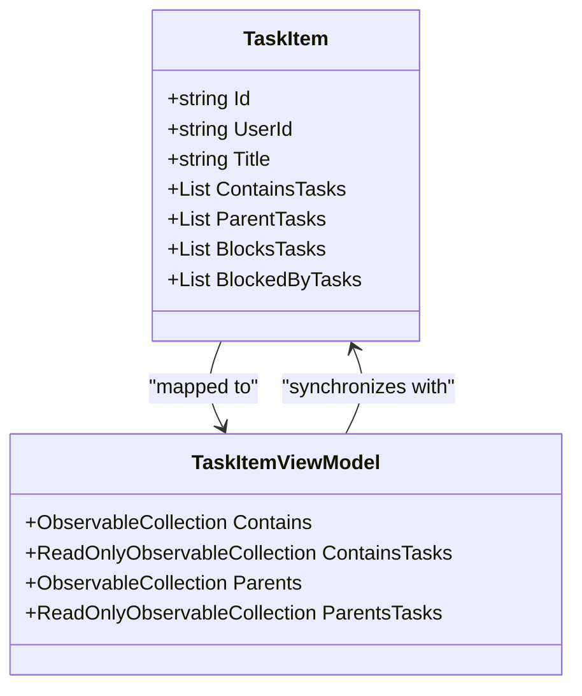
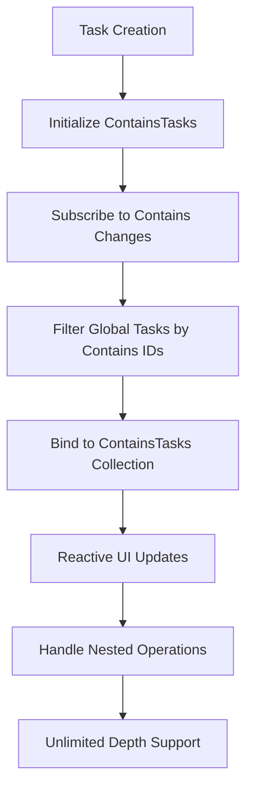
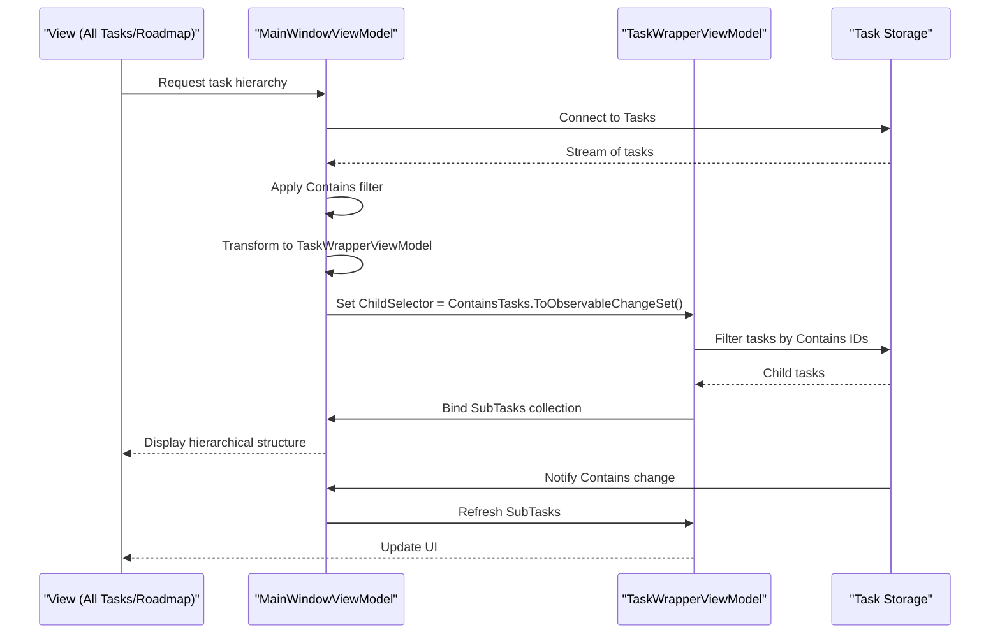
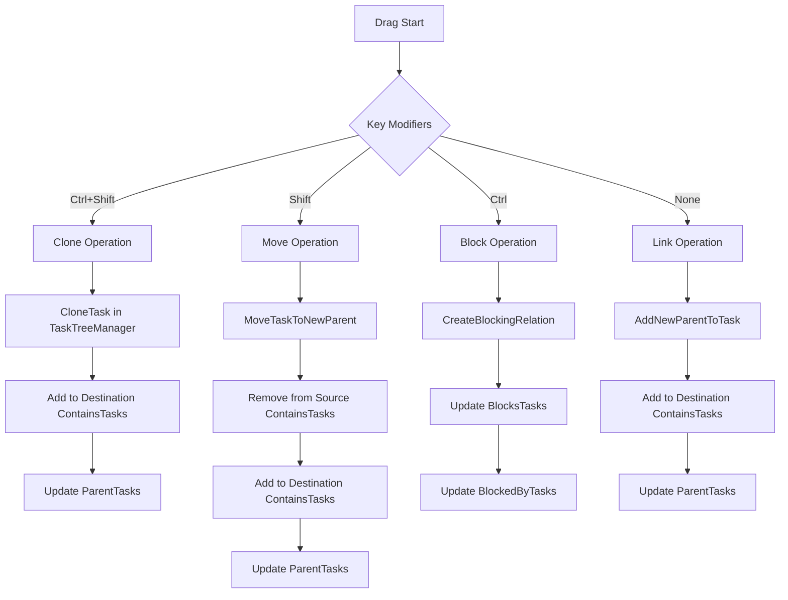
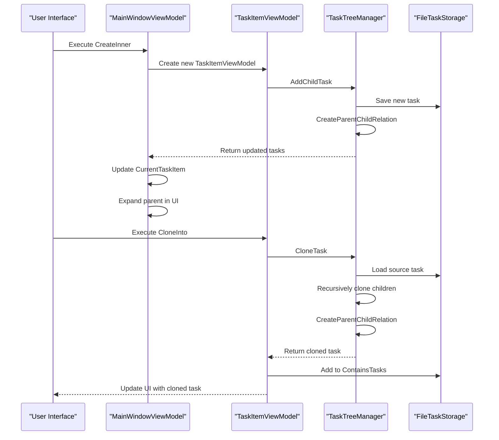
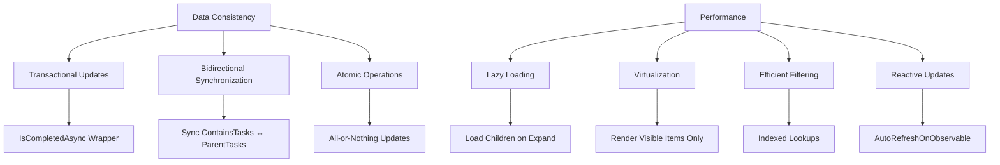

# Contains Tasks (Children) Relationship

<cite>
**Referenced Files in This Document**   
- [TaskItem.cs](file://src/Unlimotion.Domain/TaskItem.cs)
- [MainWindowViewModel.cs](file://src/Unlimotion.ViewModel/MainWindowViewModel.cs)
- [TaskWrapperViewModel.cs](file://src/Unlimotion.ViewModel/TaskWrapperViewModel.cs)
- [TaskItemViewModel.cs](file://src/Unlimotion.ViewModel/TaskItemViewModel.cs)
- [TaskTreeManager.cs](file://src/Unlimotion.TaskTreeManager/TaskTreeManager.cs)
- [TaskStorageExtensions.cs](file://src/Unlimotion/TaskStorageExtensions.cs)
</cite>

## Table of Contents
1. [Introduction](#introduction)
2. [Core Implementation](#core-implementation)
3. [Hierarchical Nesting Mechanism](#hierarchical-nesting-mechanism)
4. [View Integration in MainWindowViewModel](#view-integration-in-mainwindowviewmodel)
5. [Drag-and-Drop Operations](#drag-and-drop-operations)
6. [Cloning and Task Creation](#cloning-and-task-creation)
7. [Data Consistency and Performance](#data-consistency-and-performance)
8. [Conclusion](#conclusion)

## Introduction
The ContainsTasks relationship in the Unlimotion application establishes a parent-child hierarchy between tasks, enabling the creation of deeply nested task structures. This relationship is fundamental to the application's ability to organize tasks in tree-like structures across various views such as All Tasks and Roadmap. The implementation leverages reactive programming patterns through DynamicData and ReactiveUI to maintain real-time synchronization between the data model and UI components. This document details how the ContainsTasks collection maintains child task references, enables hierarchical nesting of unlimited depth, and integrates with the application's view models and user interaction patterns.

**Section sources**
- [TaskItem.cs](file://src/Unlimotion.Domain/TaskItem.cs#L1-L33)

## Core Implementation
The ContainsTasks relationship is implemented as a string collection within the TaskItem class, storing the IDs of child tasks. This design choice enables efficient storage and retrieval while maintaining referential integrity across the task hierarchy. The relationship is bidirectional, with child tasks maintaining references to their parents through the ParentTasks collection, ensuring data consistency throughout the hierarchy.

**Diagram sources**
- [TaskItem.cs](file://src/Unlimotion.Domain/TaskItem.cs#L1-L33)
- [TaskItemViewModel.cs](file://src/Unlimotion.ViewModel/TaskItemViewModel.cs#L39-L71)

**Section sources**
- [TaskItem.cs](file://src/Unlimotion.Domain/TaskItem.cs#L1-L33)
- [TaskItemViewModel.cs](file://src/Unlimotion.ViewModel/TaskItemViewModel.cs#L39-L71)

## Hierarchical Nesting Mechanism
The hierarchical nesting mechanism allows for unlimited depth in task organization through a combination of data structures and reactive programming patterns. The TaskItemViewModel class maintains an ObservableCollection<string> for Contains, which is automatically synchronized with the underlying TaskItem's ContainsTasks list. This synchronization is achieved through the SynchronizeCollections method, which ensures that changes in either collection are reflected in the other.

The system uses DynamicData's observable change sets to monitor modifications to the Contains collection, enabling real-time updates to the UI. When a task's Contains collection changes, the system automatically filters and binds the relevant child tasks from the global task repository, creating a live connection between parent and child tasks regardless of nesting depth.

**Diagram sources**
- [TaskItemViewModel.cs](file://src/Unlimotion.ViewModel/TaskItemViewModel.cs#L39-L71)
- [TaskItemViewModel.cs](file://src/Unlimotion.ViewModel/TaskItemViewModel.cs#L588-L625)

**Section sources**
- [TaskItemViewModel.cs](file://src/Unlimotion.ViewModel/TaskItemViewModel.cs#L39-L71)
- [TaskItemViewModel.cs](file://src/Unlimotion.ViewModel/TaskItemViewModel.cs#L588-L625)

## View Integration in MainWindowViewModel
The MainWindowViewModel integrates the ContainsTasks relationship into various views through the use of TaskWrapperViewModel and reactive data binding. The ChildSelector property in TaskWrapperActions is configured to use ContainsTasks.ToObservableChangeSet(), establishing a reactive connection between the parent task and its children. This approach enables automatic updates when child tasks are added, removed, or modified.

In the All Tasks and Roadmap views, the system builds tree structures by transforming the global task collection and applying filters based on the ContainsTasks relationship. The AutoRefreshOnObservable pattern ensures that the UI updates whenever the Contains collection changes, providing a seamless user experience. The implementation also includes sorting and filtering capabilities, allowing users to organize tasks according to various criteria while maintaining the hierarchical structure.

**Diagram sources**
- [MainWindowViewModel.cs](file://src/Unlimotion.ViewModel/MainWindowViewModel.cs#L473-L503)
- [TaskWrapperViewModel.cs](file://src/Unlimotion.ViewModel/TaskWrapperViewModel.cs#L41-L81)

**Section sources**
- [MainWindowViewModel.cs](file://src/Unlimotion.ViewModel/MainWindowViewModel.cs#L473-L503)
- [TaskWrapperViewModel.cs](file://src/Unlimotion.ViewModel/TaskWrapperViewModel.cs#L41-L81)

## Drag-and-Drop Operations
Drag-and-drop operations modify the ContainsTasks relationship through a combination of UI event handling and backend processing. The MainControl.axaml.cs file implements drag-and-drop functionality, where different keyboard modifiers trigger different operations: Ctrl+Shift for cloning, Shift for moving, and Ctrl for blocking relationships. When a drag operation occurs, the system determines the source and target tasks and invokes the appropriate method on the TaskItemViewModel.

The MoveInto method handles task relocation by updating the ContainsTasks collection of both the source and destination parent tasks. The operation first removes the task from its current parent's ContainsTasks list and then adds it to the new parent's list. This process maintains data consistency by ensuring that the ParentTasks collection of the moved task is also updated accordingly.

**Diagram sources**
- [MainControl.axaml.cs](file://src/Unlimotion/Views/MainControl.axaml.cs#L69-L203)
- [TaskTreeManager.cs](file://src/Unlimotion.TaskTreeManager/TaskTreeManager.cs#L379-L412)

**Section sources**
- [MainControl.axaml.cs](file://src/Unlimotion/Views/MainControl.axaml.cs#L69-L203)
- [TaskTreeManager.cs](file://src/Unlimotion.TaskTreeManager/TaskTreeManager.cs#L379-L412)

## Cloning and Task Creation
The CreateInner command and cloning operations modify the ContainsTasks relationship by adding new tasks as children of existing tasks. The CreateInner command, implemented in MainWindowViewModel, creates a new task and adds it to the ContainsTasks collection of the current task. This operation also expands the parent task in the UI to reveal the newly created child.

Cloning is implemented through the CloneInto method in TaskItemViewModel, which creates a copy of the source task and adds it to the ContainsTasks collection of the destination task. The cloning process preserves the hierarchical structure by recursively cloning child tasks and maintaining parent-child relationships. The TaskTreeManager handles the actual cloning operation, ensuring that all related data is properly duplicated and linked.

**Diagram sources**
- [MainWindowViewModel.cs](file://src/Unlimotion.ViewModel/MainWindowViewModel.cs#L150-L180)
- [TaskItemViewModel.cs](file://src/Unlimotion.ViewModel/TaskItemViewModel.cs#L366-L403)
- [TaskTreeManager.cs](file://src/Unlimotion.TaskTreeManager/TaskTreeManager.cs#L343-L380)

**Section sources**
- [MainWindowViewModel.cs](file://src/Unlimotion.ViewModel/MainWindowViewModel.cs#L150-L180)
- [TaskItemViewModel.cs](file://src/Unlimotion.ViewModel/TaskItemViewModel.cs#L366-L403)
- [TaskTreeManager.cs](file://src/Unlimotion.TaskTreeManager/TaskTreeManager.cs#L343-L380)

## Data Consistency and Performance
Data consistency during parent-child operations is maintained through transactional updates in the TaskTreeManager. Each operation that modifies the ContainsTasks relationship is wrapped in an IsCompletedAsync block, ensuring that all related changes are applied atomically. When a task is moved or cloned, the system updates both the ContainsTasks collection of the parent and the ParentTasks collection of the child, maintaining bidirectional integrity.

Performance considerations for rendering deeply nested graphs include the use of lazy loading and virtualization. The TaskWrapperViewModel implements lazy expansion of child tasks, only loading and rendering subtasks when a parent is expanded in the UI. The AutoRefreshOnObservable pattern minimizes unnecessary updates by only triggering UI refreshes when relevant data changes. Additionally, the system uses efficient filtering and sorting algorithms to handle large task hierarchies without significant performance degradation.

**Diagram sources**
- [TaskTreeManager.cs](file://src/Unlimotion.TaskTreeManager/TaskTreeManager.cs#L43-L80)
- [TaskItemViewModel.cs](file://src/Unlimotion.ViewModel/TaskItemViewModel.cs#L39-L71)
- [TaskStorageExtensions.cs](file://src/Unlimotion/TaskStorageExtensions.cs#L14-L34)

**Section sources**
- [TaskTreeManager.cs](file://src/Unlimotion.TaskTreeManager/TaskTreeManager.cs#L43-L80)
- [TaskItemViewModel.cs](file://src/Unlimotion.ViewModel/TaskItemViewModel.cs#L39-L71)
- [TaskStorageExtensions.cs](file://src/Unlimotion/TaskStorageExtensions.cs#L14-L34)

## Conclusion
The ContainsTasks relationship in Unlimotion provides a robust foundation for hierarchical task organization, enabling users to create complex nested structures of unlimited depth. The implementation combines efficient data storage with reactive programming patterns to ensure real-time synchronization between the model and UI. Through the integration of drag-and-drop operations, cloning, and task creation commands, users can easily manipulate the task hierarchy while maintaining data consistency. The system's performance optimizations, including lazy loading and efficient filtering, ensure smooth operation even with deeply nested task graphs. This comprehensive approach to hierarchical task management makes Unlimotion a powerful tool for organizing complex workflows and projects.