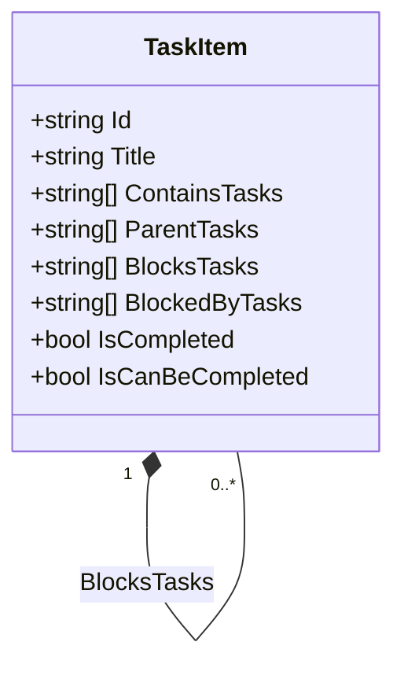
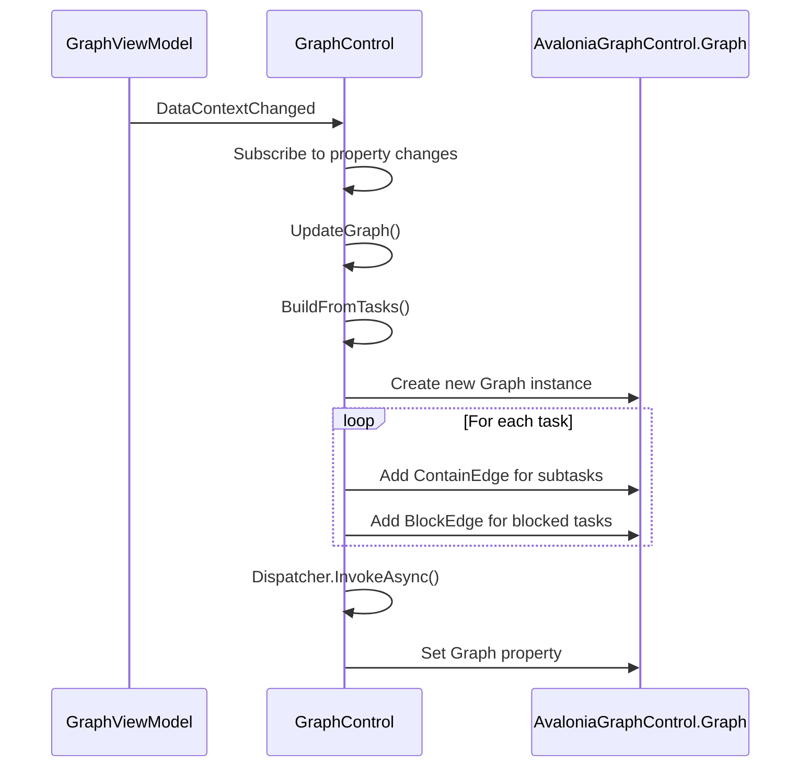
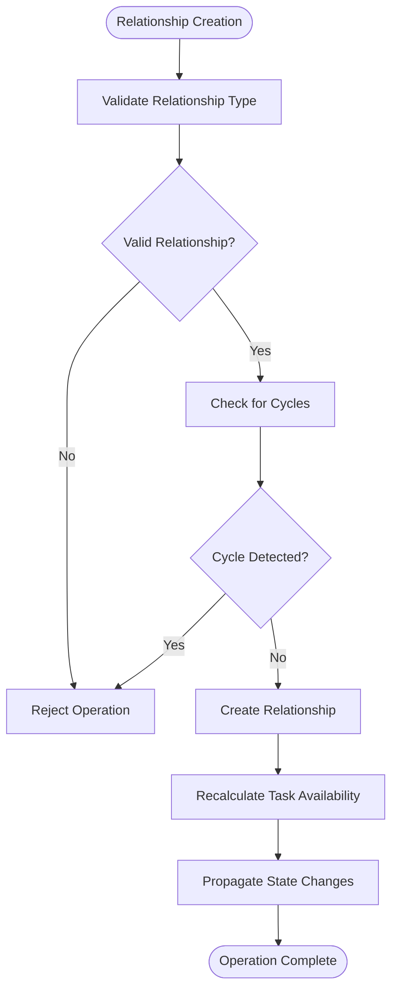
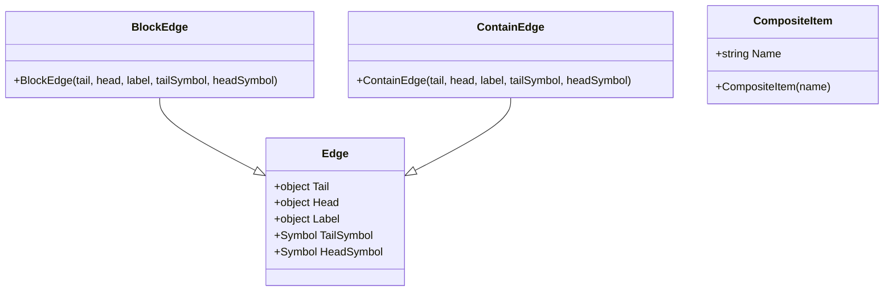
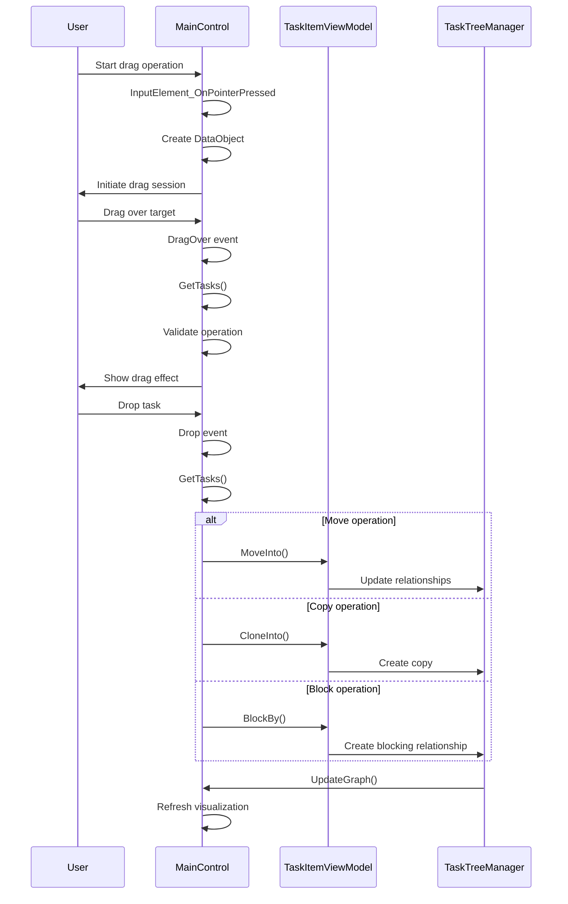

# Directed Acyclic Graph (DAG) Structure

<cite>
**Referenced Files in This Document**   
- [TaskItem.cs](file://src/Unlimotion.Domain/TaskItem.cs)
- [GraphViewModel.cs](file://src/Unlimotion.ViewModel/GraphViewModel.cs)
- [GraphControl.axaml.cs](file://src/Unlimotion/Views/GraphControl.axaml.cs)
- [BlockEdge.cs](file://src/Unlimotion/Views/Graph/BlockEdge.cs)
- [ContainEdge.cs](file://src/Unlimotion/Views/Graph/ContainEdge.cs)
- [CompositeItem.cs](file://src/Unlimotion/Views/Graph/CompositeItem.cs)
- [TaskWrapperViewModel.cs](file://src/Unlimotion.ViewModel/TaskWrapperViewModel.cs)
- [MainWindowViewModel.cs](file://src/Unlimotion.ViewModel/MainWindowViewModel.cs)
- [MainControl.axaml.cs](file://src/Unlimotion/Views/MainControl.axaml.cs)
- [TaskTreeManager.cs](file://src/Unlimotion.TaskTreeManager/TaskTreeManager.cs)
</cite>

## Table of Contents
1. [Introduction](#introduction)
2. [Task Relationship Model](#task-relationship-model)
3. [Graph Structure Implementation](#graph-structure-implementation)
4. [Cycle Prevention and Graph Integrity](#cycle-prevention-and-graph-integrity)
5. [Graph Visualization Components](#graph-visualization-components)
6. [User Interaction Handling](#user-interaction-handling)
7. [Graph Synchronization Across Views](#graph-synchronization-across-views)
8. [Performance Considerations](#performance-considerations)
9. [Conclusion](#conclusion)

## Introduction
The Unlimotion application implements a sophisticated Directed Acyclic Graph (DAG) structure to manage complex task relationships. This documentation details how the system combines containment, blocking, and dependency relationships to create a flexible task organization framework. The graph structure enables users to visualize task hierarchies and dependencies while maintaining data integrity through cycle prevention mechanisms. The implementation leverages the AvaloniaGraphControl library for visualization and ReactiveUI for responsive updates across multiple views.

**Section sources**
- [TaskItem.cs](file://src/Unlimotion.Domain/TaskItem.cs#L1-L32)
- [GraphViewModel.cs](file://src/Unlimotion.ViewModel/GraphViewModel.cs#L1-L30)

## Task Relationship Model
The task relationship model is built around four primary relationship types defined in the TaskItem class: ContainsTasks, ParentTasks, BlocksTasks, and BlockedByTasks. These relationships form a directed graph where tasks serve as nodes and relationships as edges. The ContainsTasks and ParentTasks properties establish hierarchical containment relationships, creating parent-child task structures. Meanwhile, BlocksTasks and BlockedByTasks define dependency relationships where one task must be completed before another can proceed.

The bidirectional nature of these relationships ensures data consistency - when task A contains task B, task B automatically references task A in its ParentTasks collection. Similarly, when task A blocks task B, task B appears in task A's BlocksTasks list while task A appears in task B's BlockedByTasks list. This model enables complex organizational patterns while maintaining referential integrity across the task network.



**Diagram sources**
- [TaskItem.cs](file://src/Unlimotion.Domain/TaskItem.cs#L1-L32)

**Section sources**
- [TaskItem.cs](file://src/Unlimotion.Domain/TaskItem.cs#L1-L32)
- [TaskTreeManager.cs](file://src/Unlimotion.TaskTreeManager/TaskTreeManager.cs#L486-L527)

## Graph Structure Implementation
The graph structure is implemented through the GraphViewModel and GraphControl components, which work together to visualize task relationships. The GraphViewModel serves as the data context for the GraphControl, providing access to task collections and filtering options. It maintains references to both all tasks and unlocked tasks, allowing users to toggle between comprehensive and filtered views.

The GraphControl.axaml.cs implementation builds the visual graph by processing task relationships and creating appropriate edge types. For containment relationships, it creates ContainEdge instances, while blocking relationships are represented by BlockEdge instances. The BuildFromTasks method systematically processes the task collection, using a queue-based approach to traverse relationships and construct the graph. Tasks without explicit relationships are represented as self-referential edges to ensure they appear in the visualization.

The graph orientation is set to horizontal, facilitating left-to-right reading of task dependencies. The implementation uses ReactiveUI's observable patterns to automatically update the graph when underlying task data changes, with throttling applied to prevent excessive updates during rapid modifications.



**Diagram sources**
- [GraphViewModel.cs](file://src/Unlimotion.ViewModel/GraphViewModel.cs#L1-L30)
- [GraphControl.axaml.cs](file://src/Unlimotion/Views/GraphControl.axaml.cs#L75-L166)

**Section sources**
- [GraphViewModel.cs](file://src/Unlimotion.ViewModel/GraphViewModel.cs#L1-L30)
- [GraphControl.axaml.cs](file://src/Unlimotion/Views/GraphControl.axaml.cs#L75-L166)

## Cycle Prevention and Graph Integrity
The system maintains graph integrity through multiple mechanisms that prevent cycles and ensure consistent task states. The TaskTreeManager handles relationship creation with careful validation to avoid circular dependencies. When establishing parent-child relationships, the system checks existing connections to prevent loops in the containment hierarchy. Similarly, when creating blocking relationships, the implementation verifies that the reverse dependency doesn't already exist, preventing mutual blocking scenarios.

The availability calculation system enforces business rules that maintain logical consistency. A task can only be completed when all its contained tasks are completed and all blocking tasks are completed. This dependency propagation ensures that users cannot complete tasks prematurely, preserving the intended workflow sequence. When relationships are modified, the system recalculates availability for affected tasks, cascading state changes through the graph as needed.

The drag-and-drop interface in MainControl.axaml.cs includes validation to prevent invalid operations. When moving tasks, the system checks whether the operation would create circular references or violate other constraints. The CanMoveInto method on TaskItemViewModel determines whether a proposed parent-child relationship is valid before allowing the operation to proceed.



**Diagram sources**
- [TaskTreeManager.cs](file://src/Unlimotion.TaskTreeManager/TaskTreeManager.cs#L486-L527)
- [MainControl.axaml.cs](file://src/Unlimotion/Views/MainControl.axaml.cs#L137-L203)

**Section sources**
- [TaskTreeManager.cs](file://src/Unlimotion.TaskTreeManager/TaskTreeManager.cs#L486-L527)
- [MainControl.axaml.cs](file://src/Unlimotion/Views/MainControl.axaml.cs#L137-L203)
- [IMPLEMENTATION_SUMMARY.md](file://IMPLEMENTATION_SUMMARY.md#L84-L93)

## Graph Visualization Components
The graph visualization is built using specialized components that extend the AvaloniaGraphControl library. The BlockEdge and ContainEdge classes inherit from the base Edge class, providing type-specific styling and behavior for different relationship types. These custom edge classes allow the visualization to distinguish between containment and blocking relationships through visual cues.

The CompositeItem class serves as a container for grouped tasks, enabling hierarchical visualization of task collections. While minimally implemented in the current codebase, this component provides the foundation for future expansion of composite task visualization. The GraphControl integrates these components with the AvaloniaGraphControl to render the complete task network.

The visualization system handles various user interface concerns, including proper rendering of task nodes and relationship edges. The implementation includes keyboard shortcuts for graph navigation and manipulation, such as 'F' for fill view, 'U' for uniform scaling, 'R' for reset, and 'T' for toggle stretch mode. These features enhance usability when working with complex task networks containing many interconnected elements.



**Diagram sources**
- [BlockEdge.cs](file://src/Unlimotion/Views/Graph/BlockEdge.cs#L1-L9)
- [ContainEdge.cs](file://src/Unlimotion/Views/Graph/ContainEdge.cs#L1-L10)
- [CompositeItem.cs](file://src/Unlimotion/Views/Graph/CompositeItem.cs#L1-L7)

**Section sources**
- [BlockEdge.cs](file://src/Unlimotion/Views/Graph/BlockEdge.cs#L1-L9)
- [ContainEdge.cs](file://src/Unlimotion/Views/Graph/ContainEdge.cs#L1-L10)
- [CompositeItem.cs](file://src/Unlimotion/Views/Graph/CompositeItem.cs#L1-L7)

## User Interaction Handling
User interactions with the graph are managed through a comprehensive drag-and-drop system implemented in MainControl.axaml.cs. The system supports multiple operations through keyboard modifier combinations: Shift for moving tasks, Ctrl for copying, Ctrl+Shift for cloning, and Alt for creating blocking relationships. This intuitive interface allows users to manipulate task relationships directly in the visual graph.

The drag-and-drop implementation includes extensive validation to prevent invalid operations. Before allowing a drop operation, the system verifies that the proposed relationship is valid and won't create cycles or violate other constraints. The GetTasks method extracts relevant task information from drag events, while the DragOver method provides visual feedback by setting appropriate drag effects based on the operation type and validity.

When a drop operation occurs, the system executes the corresponding task manipulation method and updates the graph view. The UpdateGraph method call ensures that visual changes are reflected immediately, maintaining consistency between the user interface and underlying data model. This responsive feedback loop enhances the user experience when organizing complex task networks.



**Diagram sources**
- [MainControl.axaml.cs](file://src/Unlimotion/Views/MainControl.axaml.cs#L69-L203)
- [TaskWrapperViewModel.cs](file://src/Unlimotion.ViewModel/TaskWrapperViewModel.cs#L1-L124)

**Section sources**
- [MainControl.axaml.cs](file://src/Unlimotion/Views/MainControl.axaml.cs#L69-L203)
- [TaskWrapperViewModel.cs](file://src/Unlimotion.ViewModel/TaskWrapperViewModel.cs#L1-L124)

## Graph Synchronization Across Views
The graph view maintains synchronization with other application views through the MainWindowViewModel, which serves as the central coordination point. The GraphViewModel is instantiated within MainWindowViewModel and shares the same task data sources as other views like All Tasks and Unlocked. This shared data model ensures that changes made in any view are immediately reflected across all views.

Property bindings and reactive subscriptions enable automatic updates when users toggle filters such as ShowCompleted, ShowArchived, or ShowWanted. These filter changes propagate from MainWindowViewModel to GraphViewModel, triggering graph regeneration through the UpdateGraph method. Similarly, changes to the OnlyUnlocked property switch between displaying all tasks and only unlocked tasks in the graph visualization.

The CurrentTaskItem property provides selection synchronization across views. When a user selects a task in the graph, the same task becomes the current item in other views, and vice versa. This unified selection model creates a cohesive user experience when navigating between different task organization perspectives. The implementation uses ReactiveUI's WhenAnyValue to monitor property changes and coordinate updates across the application.

```mermaid
erDiagram
MainWindowViewModel ||--o{ GraphViewModel : contains
MainWindowViewModel ||--o{ TaskItemViewModel : manages
GraphViewModel ||--o{ TaskItemViewModel : displays
MainWindowViewModel }|--o{ AllTasksView : coordinates
MainWindowViewModel }|--o{ UnlockedView : coordinates
MainWindowViewModel }|--o{ GraphView : coordinates
class MainWindowViewModel {
+bool ShowCompleted
+bool ShowArchived
+bool ShowWanted
+bool OnlyUnlocked
+TaskItemViewModel CurrentTaskItem
}
class GraphViewModel {
+ReadOnlyObservableCollection Tasks
+ReadOnlyObservableCollection UnlockedTasks
+bool OnlyUnlocked
}
class TaskItemViewModel {
+string Id
+string Title
+bool IsCompleted
}
```

**Diagram sources**
- [MainWindowViewModel.cs](file://src/Unlimotion.ViewModel/MainWindowViewModel.cs#L1-L199)
- [GraphViewModel.cs](file://src/Unlimotion.ViewModel/GraphViewModel.cs#L1-L30)

**Section sources**
- [MainWindowViewModel.cs](file://src/Unlimotion.ViewModel/MainWindowViewModel.cs#L1-L199)
- [GraphViewModel.cs](file://src/Unlimotion.ViewModel/GraphViewModel.cs#L1-L30)

## Performance Considerations
The graph implementation incorporates several performance optimizations to handle large task networks efficiently. The BuildFromTasks method uses a queue-based traversal algorithm with a HashSet for tracking processed tasks, ensuring O(n) time complexity for graph construction. Throttling is applied to task collection change notifications, preventing excessive graph rebuilds during rapid modifications.

The visualization system leverages Avalonia's rendering capabilities and virtualization features to maintain responsiveness with large datasets. The use of Dispatcher.InvokeAsync ensures that graph updates occur on the UI thread without blocking user interactions. For very large graphs, the keyboard shortcuts for zoom and pan operations (F, U, R, T) provide efficient navigation without requiring complex mouse interactions.

Memory management is addressed through the DisposableList pattern, which ensures proper cleanup of event subscriptions and other disposable resources when the GraphControl is destroyed. This prevents memory leaks that could occur from stale event handlers in long-running applications. The implementation also minimizes object creation during graph updates by reusing existing data structures where possible.

While the current implementation focuses on horizontal layout, future enhancements could include additional layout algorithms optimized for different use cases, such as hierarchical tree layouts for deep containment hierarchies or force-directed layouts for complex dependency networks. These algorithms could be dynamically selected based on graph characteristics to optimize readability and performance.

**Section sources**
- [GraphControl.axaml.cs](file://src/Unlimotion/Views/GraphControl.axaml.cs#L41-L79)
- [MainWindowViewModel.cs](file://src/Unlimotion.ViewModel/MainWindowViewModel.cs#L1-L199)

## Conclusion
The Directed Acyclic Graph structure in Unlimotion provides a robust framework for organizing complex task relationships through a combination of containment and dependency links. The implementation effectively leverages the AvaloniaGraphControl library to create an intuitive visual representation of task networks while maintaining data integrity through comprehensive cycle prevention mechanisms.

The system's architecture separates concerns appropriately, with the TaskItem model defining relationships, TaskTreeManager enforcing business rules, GraphViewModel providing data context, and GraphControl handling visualization. This modular design enables independent evolution of each component while maintaining overall system coherence.

Future enhancements could include additional layout algorithms, improved performance optimizations for very large graphs, and enhanced visual cues for different relationship types. The foundation is well-established for extending the graph functionality to support more advanced features while maintaining the core principles of data integrity and user experience.