# Parent Tasks (Multiple Inheritance) Relationship

<cite>
**Referenced Files in This Document**
- [TaskItem.cs](file://src/Unlimotion.Domain/TaskItem.cs)
- [TaskTreeManager.cs](file://src/Unlimotion.TaskTreeManager/TaskTreeManager.cs)
- [ITaskTreeManager.cs](file://src/Unlimotion.TaskTreeManager/ITaskTreeManager.cs)
- [TaskItemViewModel.cs](file://src/Unlimotion.ViewModel/TaskItemViewModel.cs)
- [TaskWrapperViewModel.cs](file://src/Unlimotion.ViewModel/TaskWrapperViewModel.cs)
- [MainWindowViewModel.cs](file://src/Unlimotion.ViewModel/MainWindowViewModel.cs)
- [TaskAvailabilityCalculationTests.cs](file://src/Unlimotion.Test/TaskAvailabilityCalculationTests.cs)
</cite>

## Table of Contents
1. [Introduction](#introduction)
2. [System Architecture](#system-architecture)
3. [Core Data Model](#core-data-model)
4. [Relationship Management](#relationship-management)
5. [Synchronization Mechanisms](#synchronization-mechanisms)
6. [UI Representation](#ui-representation)
7. [Availability Calculation](#availability-calculation)
8. [Challenges and Solutions](#challenges-and-solutions)
9. [Implementation Examples](#implementation-examples)
10. [Best Practices](#best-practices)

## Introduction

The ParentTasks relationship in Unlimotion enables sophisticated task organization through multiple inheritance capabilities. This system allows tasks to belong to multiple parent containers simultaneously, creating complex dependency networks that facilitate cross-project task management and hierarchical organization.

Unlike traditional single-parent relationships, the ParentTasks system supports scenarios where a task can be part of multiple projects, categories, or organizational structures. This flexibility enables users to organize tasks from multiple perspectives while maintaining consistency across all parent-child relationships.

## System Architecture

The ParentTasks system follows a layered architecture that separates concerns between data persistence, business logic, and presentation:

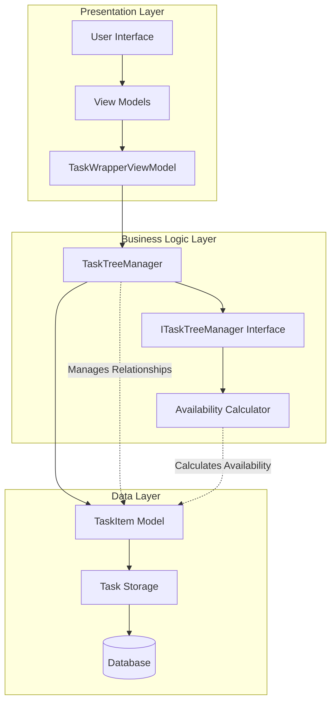

**Diagram sources**
- [TaskTreeManager.cs](file://src/Unlimotion.TaskTreeManager/TaskTreeManager.cs#L1-L50)
- [TaskItem.cs](file://src/Unlimotion.Domain/TaskItem.cs#L1-L33)
- [MainWindowViewModel.cs](file://src/Unlimotion.ViewModel/MainWindowViewModel.cs#L700-L850)

## Core Data Model

The TaskItem model defines the fundamental structure for ParentTasks relationships:

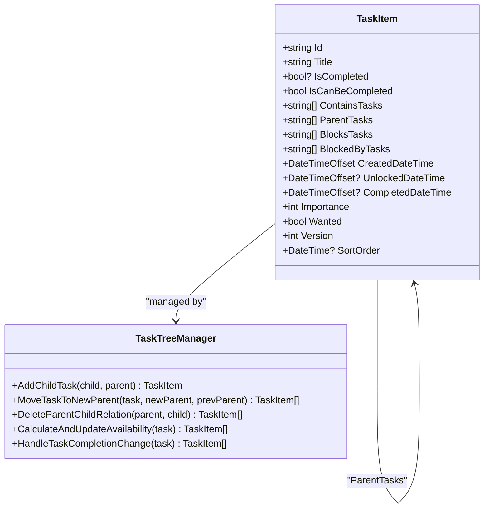

**Diagram sources**
- [TaskItem.cs](file://src/Unlimotion.Domain/TaskItem.cs#L5-L32)
- [TaskTreeManager.cs](file://src/Unlimotion.TaskTreeManager/TaskTreeManager.cs#L1-L100)

**Section sources**
- [TaskItem.cs](file://src/Unlimotion.Domain/TaskItem.cs#L5-L32)

## Relationship Management

### Adding Parent-Child Relationships

The system manages ParentTasks through several key operations that ensure consistency across both ContainsTasks and ParentTasks collections:

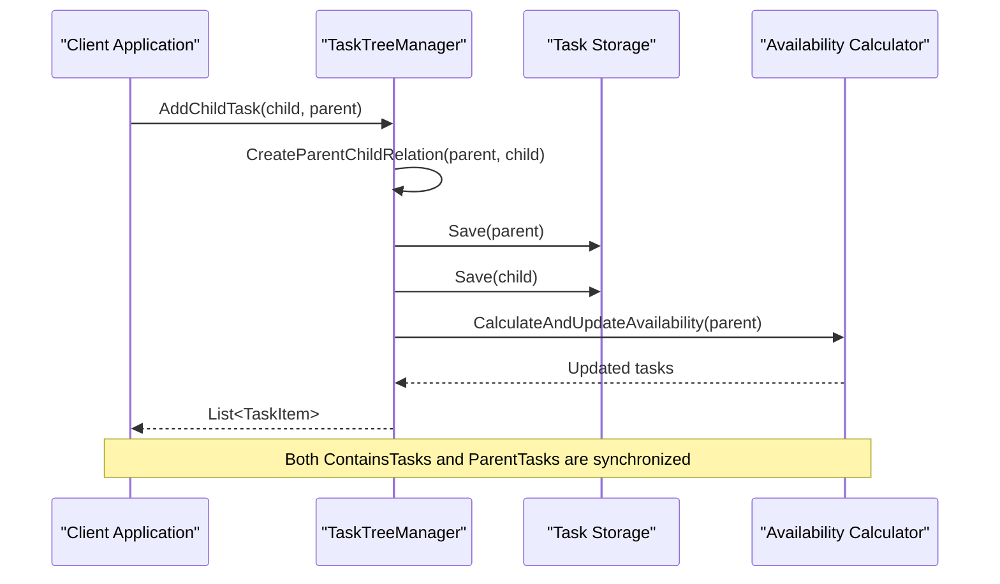

**Diagram sources**
- [TaskTreeManager.cs](file://src/Unlimotion.TaskTreeManager/TaskTreeManager.cs#L486-L527)

### Moving Tasks Between Parents

The MoveTaskToNewParent operation handles complex scenarios involving multiple parents:

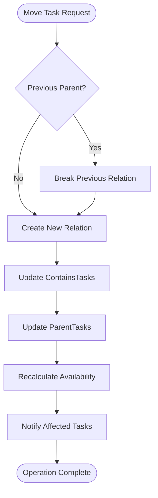

**Diagram sources**
- [TaskTreeManager.cs](file://src/Unlimotion.TaskTreeManager/TaskTreeManager.cs#L379-L412)

**Section sources**
- [TaskTreeManager.cs](file://src/Unlimotion.TaskTreeManager/TaskTreeManager.cs#L379-L412)
- [TaskTreeManager.cs](file://src/Unlimotion.TaskTreeManager/TaskTreeManager.cs#L486-L527)

## Synchronization Mechanisms

### Bidirectional Synchronization

The system maintains bidirectional consistency between ContainsTasks and ParentTasks collections:

| Operation | ContainsTasks | ParentTasks | Purpose |
|-----------|---------------|-------------|---------|
| Add Child | Add child ID | Add parent ID | Establish parent-child relationship |
| Remove Child | Remove child ID | Remove parent ID | Break parent-child relationship |
| Move Task | Remove from old parent | Add to new parent | Transfer ownership |
| Delete Task | Remove from all parents | Clear parent references | Cleanup relationships |

### Consistency Validation

The system implements several mechanisms to ensure data consistency:

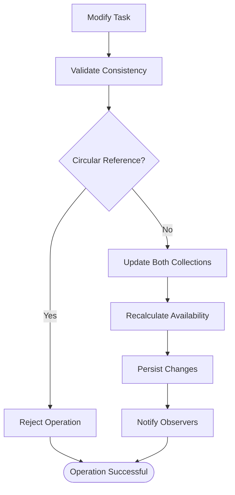

**Diagram sources**
- [TaskTreeManager.cs](file://src/Unlimotion.TaskTreeManager/TaskTreeManager.cs#L447-L488)

**Section sources**
- [TaskTreeManager.cs](file://src/Unlimotion.TaskTreeManager/TaskTreeManager.cs#L447-L488)
- [TaskTreeManager.cs](file://src/Unlimotion.TaskTreeManager/TaskTreeManager.cs#L486-L527)

## UI Representation

### CurrentItemParents View

The UI representation of ParentTasks is handled through the CurrentItemParents view, which displays the hierarchical structure:

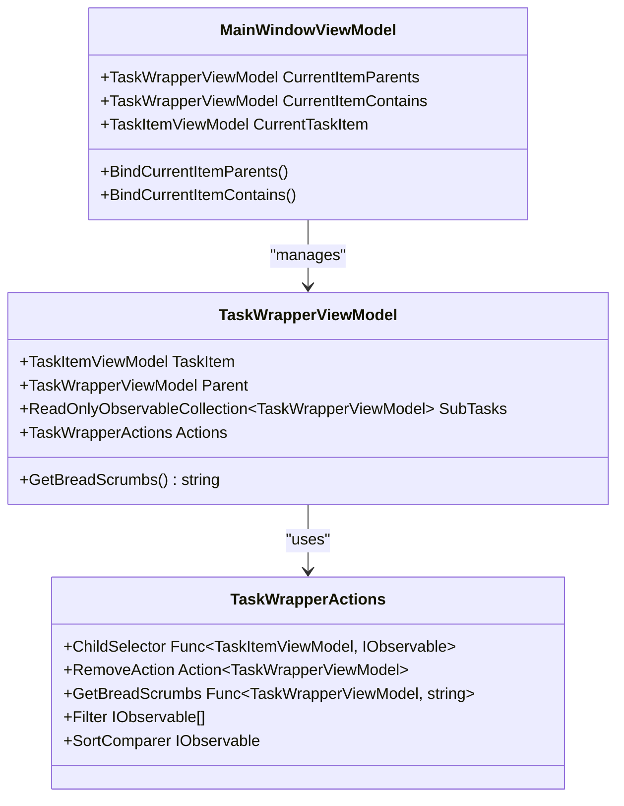

**Diagram sources**
- [MainWindowViewModel.cs](file://src/Unlimotion.ViewModel/MainWindowViewModel.cs#L748-L811)
- [TaskWrapperViewModel.cs](file://src/Unlimotion.ViewModel/TaskWrapperViewModel.cs#L41-L81)

### TaskWrapperViewModel Breadcrumbs

The TaskWrapperViewModel handles multi-parent breadcrumbs through specialized algorithms:

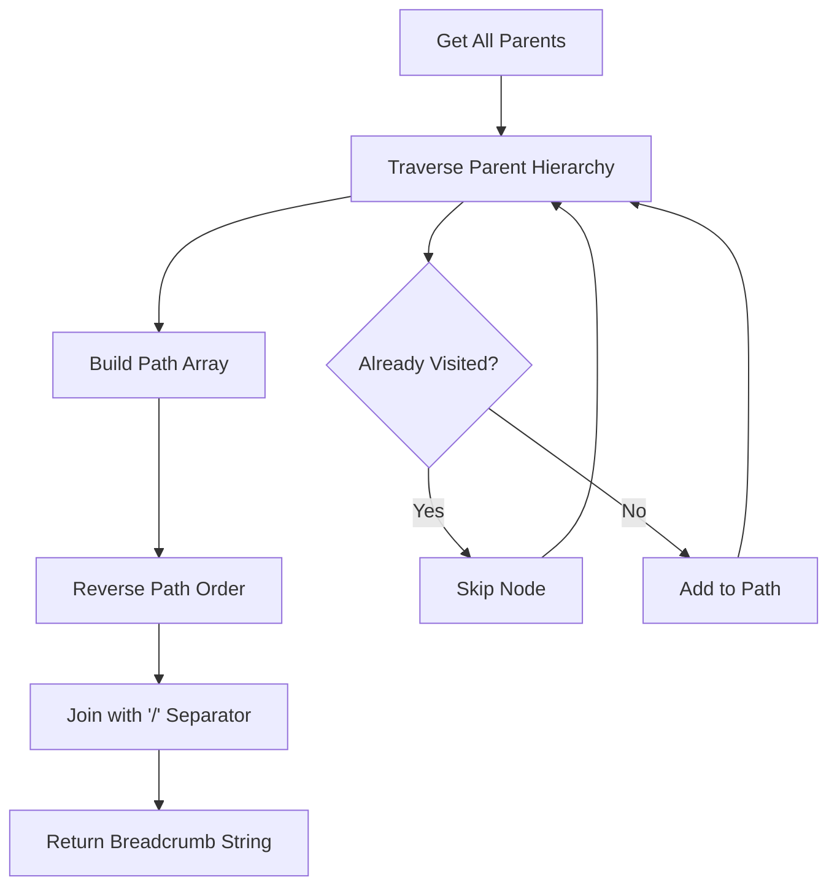

**Diagram sources**
- [TaskWrapperViewModel.cs](file://src/Unlimotion.ViewModel/TaskWrapperViewModel.cs#L15-L44)

**Section sources**
- [MainWindowViewModel.cs](file://src/Unlimotion.ViewModel/MainWindowViewModel.cs#L748-L811)
- [TaskWrapperViewModel.cs](file://src/Unlimotion.ViewModel/TaskWrapperViewModel.cs#L15-L44)

## Availability Calculation

### Business Rules

The system implements sophisticated availability calculation based on multiple factors:

| Rule | Condition | Impact |
|------|-----------|--------|
| Contained Tasks | All contained tasks must be completed | Blocks parent availability |
| Blocking Tasks | All blocking tasks must be completed | Blocks task availability |
| Parent Dependencies | All parent tasks must be available | Affects child availability |
| Circular References | Prevented automatically | Maintains system stability |

### Availability Calculation Algorithm

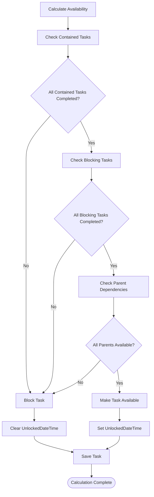

**Diagram sources**
- [TaskTreeManager.cs](file://src/Unlimotion.TaskTreeManager/TaskTreeManager.cs#L640-L700)

**Section sources**
- [TaskTreeManager.cs](file://src/Unlimotion.TaskTreeManager/TaskTreeManager.cs#L640-L700)

## Challenges and Solutions

### Circular Reference Prevention

The system prevents circular references through careful validation and ordering:

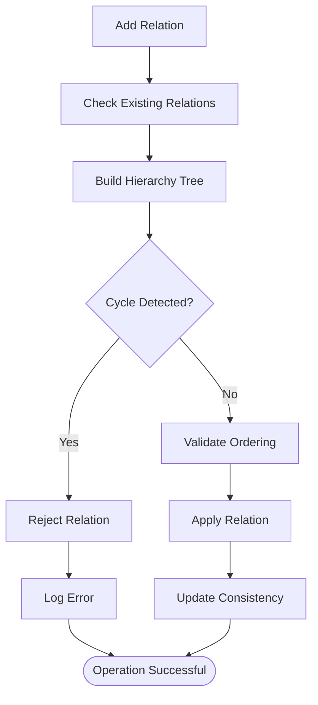

### Consistency During Move Operations

Move operations require careful handling to maintain consistency:

| Challenge | Solution | Implementation |
|-----------|----------|----------------|
| Atomic Updates | Transaction-like operations | Single atomic update |
| Availability Recalculation | Cascade updates | Recursive availability recalculation |
| Observer Notifications | Event-driven updates | Reactive notifications |
| Error Recovery | Rollback mechanisms | Automatic rollback on failure |

### Task Completion Logic Implications

When a task has multiple parents, completion affects all parent relationships:

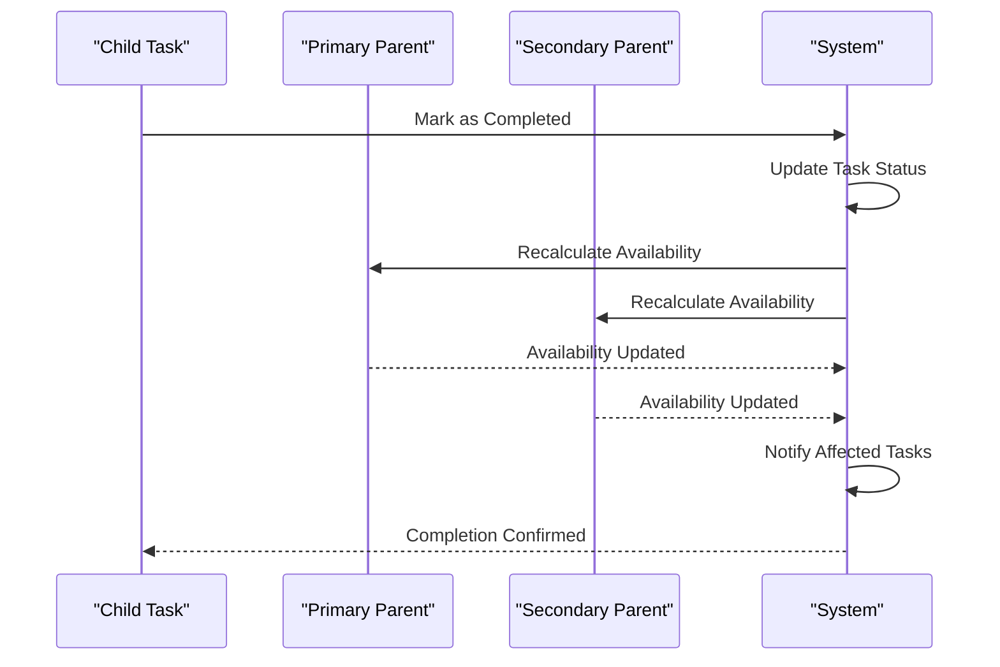

**Diagram sources**
- [TaskTreeManager.cs](file://src/Unlimotion.TaskTreeManager/TaskTreeManager.cs#L750-L837)

**Section sources**
- [TaskTreeManager.cs](file://src/Unlimotion.TaskTreeManager/TaskTreeManager.cs#L750-L837)

## Implementation Examples

### Basic Parent-Child Relationship

Creating a basic parent-child relationship demonstrates the fundamental pattern:

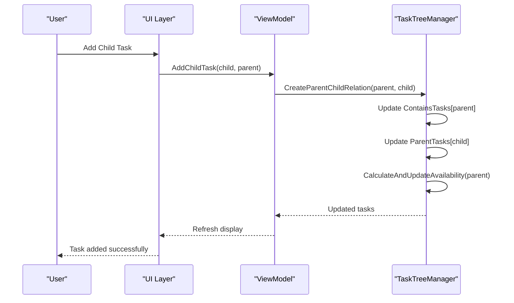

### Multi-Parent Scenario

Handling tasks with multiple parents showcases advanced functionality:

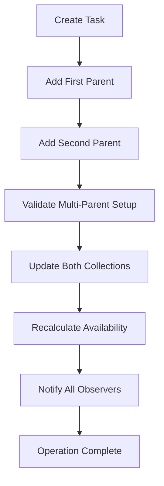

**Section sources**
- [TaskAvailabilityCalculationTests.cs](file://src/Unlimotion.Test\TaskAvailabilityCalculationTests.cs#L307-L350)
- [TaskAvailabilityCalculationTests.cs](file://src\Unlimotion.Test\TaskAvailabilityCalculationTests.cs#L418-L455)

## Best Practices

### Design Guidelines

1. **Hierarchical Organization**: Use ParentTasks for logical grouping rather than functional separation
2. **Avoid Over-Engineering**: Limit the depth of parent-child relationships to prevent complexity
3. **Consistent Naming**: Use clear, descriptive names for parent tasks to improve usability
4. **Regular Maintenance**: Periodically review and clean up orphaned relationships

### Performance Considerations

| Aspect | Recommendation | Rationale |
|--------|---------------|-----------|
| Relationship Depth | Limit to 3-5 levels | Prevents exponential complexity |
| Batch Operations | Group related changes | Reduces database round-trips |
| Caching | Cache frequently accessed relationships | Improves UI responsiveness |
| Lazy Loading | Load parent hierarchies on demand | Reduces initial load time |

### Error Handling

Implement robust error handling for edge cases:

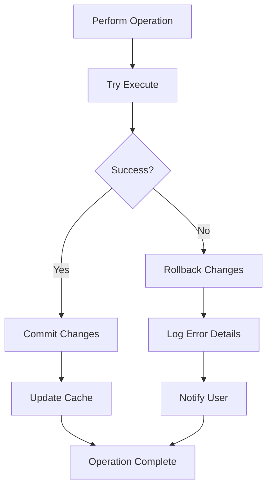

The ParentTasks relationship system in Unlimotion provides a powerful foundation for complex task organization while maintaining data integrity and system performance. Through careful implementation of synchronization mechanisms, availability calculations, and UI representations, it enables users to manage sophisticated task hierarchies effectively.