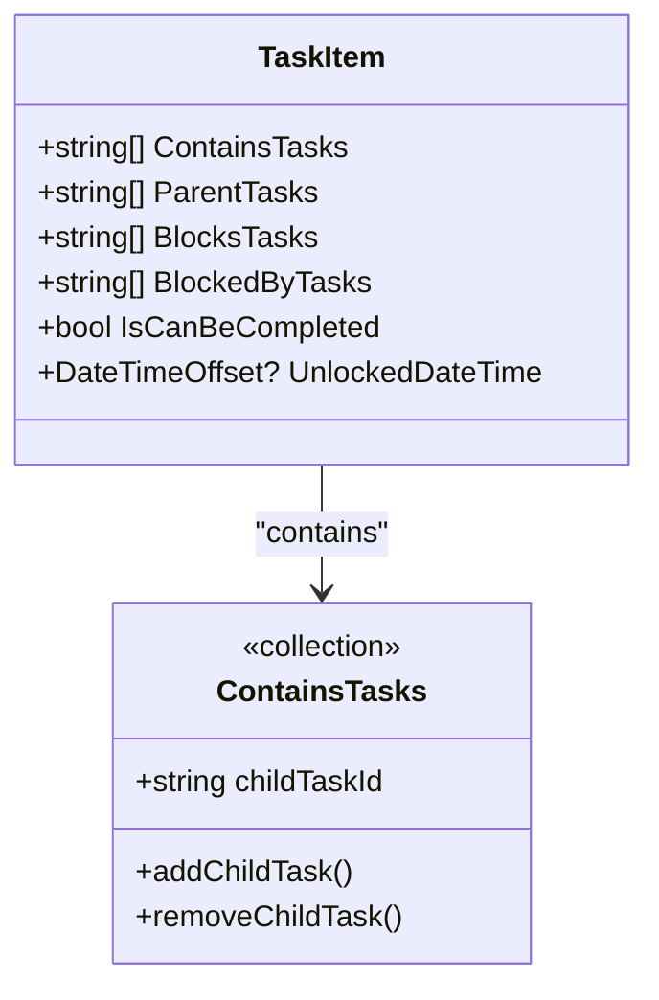
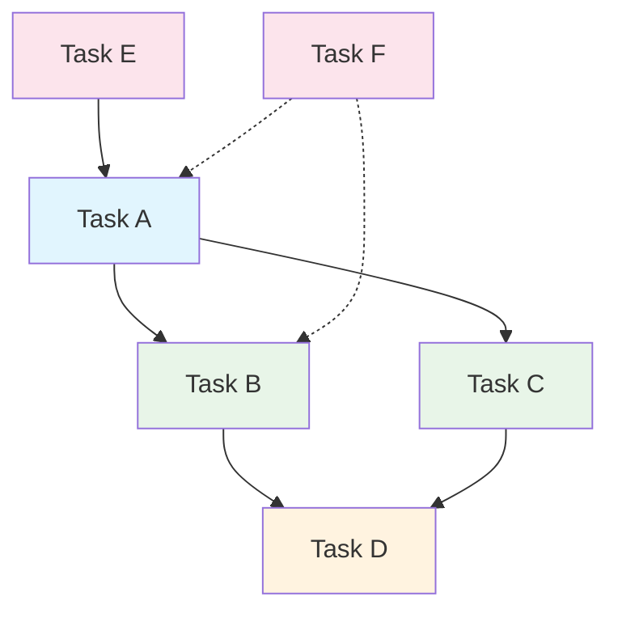
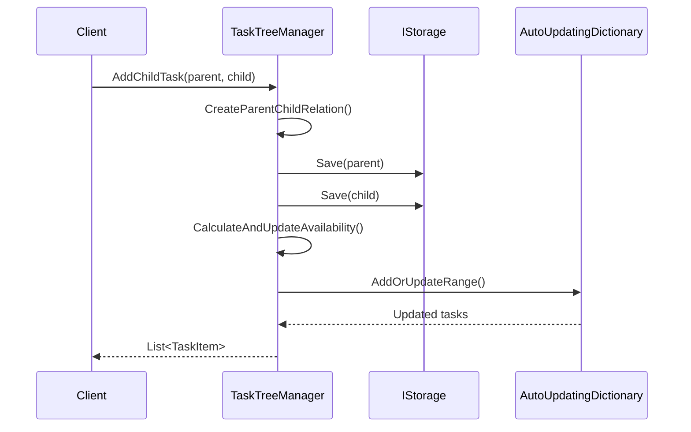
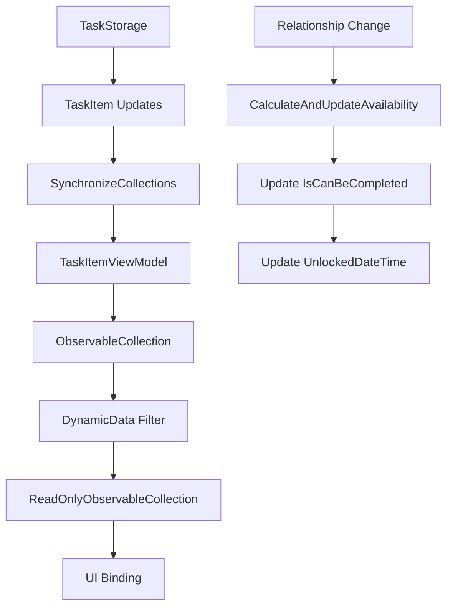
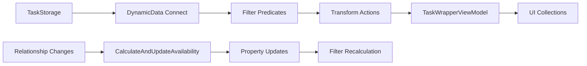
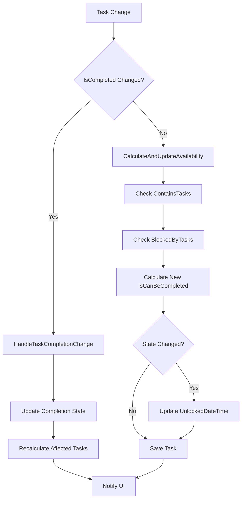
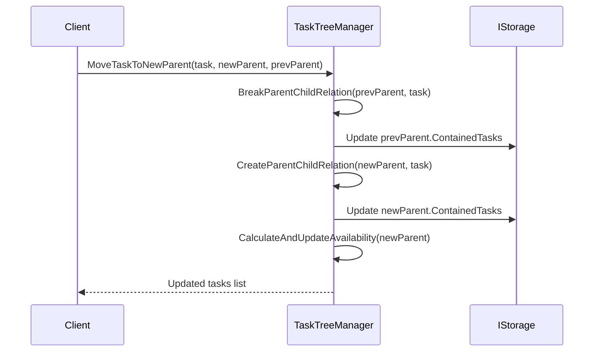
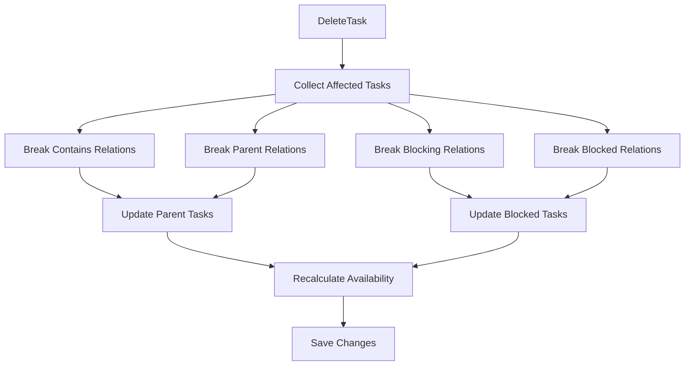
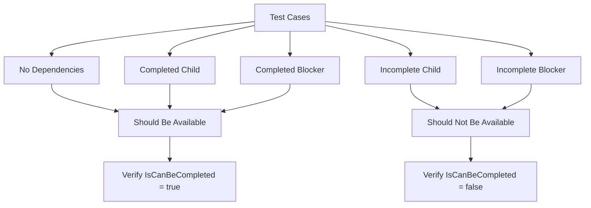

# Task Relationships and Graph Structure

<cite>
**Referenced Files in This Document**
- [TaskItem.cs](file://src/Unlimotion.Domain/TaskItem.cs)
- [TaskTreeManager.cs](file://src/Unlimotion.TaskTreeManager/TaskTreeManager.cs)
- [ITaskTreeManager.cs](file://src/Unlimotion.TaskTreeManager/ITaskTreeManager.cs)
- [TaskItemViewModel.cs](file://src/Unlimotion.ViewModel/TaskItemViewModel.cs)
- [MainWindowViewModel.cs](file://src/Unlimotion.ViewModel/MainWindowViewModel.cs)
- [AutoUpdatingDictionary.cs](file://src/Unlimotion.TaskTreeManager/AutoUpdatingDictionary.cs)
- [TaskAvailabilityCalculationTests.cs](file://src/Unlimotion.Test/TaskAvailabilityCalculationTests.cs)
- [BlockEdge.cs](file://src/Unlimotion/Views/Graph/BlockEdge.cs)
- [ContainEdge.cs](file://src/Unlimotion/Views/Graph/ContainEdge.cs)
</cite>

## Table of Contents
1. [Introduction](#introduction)
2. [Relationship Collections Overview](#relationship-collections-overview)
3. [Directed Acyclic Graph Architecture](#directed-acyclic-graph-architecture)
4. [Implementation Details](#implementation-details)
5. [ObservableCollection Synchronization](#observablecollection-synchronization)
6. [Reactive Filtering in MainWindowViewModel](#reactive-filtering-in-mainwindowviewmodel)
7. [Automatic State Management](#automatic-state-management)
8. [Task Operations and Relationship Maintenance](#task-operations-and-relationship-maintenance)
9. [Performance Considerations](#performance-considerations)
10. [Common Issues and Solutions](#common-issues-and-solutions)
11. [Testing and Validation](#testing-and-validation)
12. [Conclusion](#conclusion)

## Introduction

The Unlimotion task management system implements a sophisticated relationship management framework that enables complex task organization through four distinct relationship collections. This system forms a directed acyclic graph (DAG) structure that supports unlimited nesting, cross-project dependencies, and dynamic availability calculations based on task completion states.

The relationship management system is built around the concept of four interconnected collections within the TaskItem domain model, each serving specific organizational and dependency purposes. These relationships enable powerful task hierarchies while maintaining data consistency and preventing circular dependencies through careful architectural design.

## Relationship Collections Overview

The TaskItem class defines four primary relationship collections that establish different types of connections between tasks:

### ContainsTasks Collection
The `ContainsTasks` collection represents the hierarchical parent-child relationship where tasks contain other tasks. This creates a tree-like structure where parent tasks can have multiple child tasks, forming nested task hierarchies.

**Diagram sources**
- [TaskItem.cs](file://src/Unlimotion.Domain/TaskItem.cs#L18-L21)

### ParentTasks Collection
The `ParentTasks` collection enables multiple inheritance by allowing a single task to belong to multiple parent tasks. This creates a network structure where tasks can participate in multiple hierarchical contexts simultaneously.

### BlocksTasks Collection  
The `BlocksTasks` collection establishes forward dependencies where the current task prevents other tasks from becoming available. This creates dependency chains that enforce completion order.

### BlockedByTasks Collection
The `BlockedByTasks` collection represents backward dependencies where the current task requires other tasks to be completed before it can become available. This creates the inverse dependency relationship.

**Section sources**
- [TaskItem.cs](file://src/Unlimotion.Domain/TaskItem.cs#L18-L24)

## Directed Acyclic Graph Architecture

The relationship system forms a directed acyclic graph where edges represent various types of dependencies and containment relationships. This DAG structure ensures that:

### Graph Properties
- **Acyclicity**: No circular dependencies are allowed
- **Directionality**: Dependencies flow from blockers to blocked tasks
- **Hierarchical Structure**: ContainsTasks creates tree-like hierarchies
- **Network Structure**: ParentTasks create interconnected networks

**Diagram sources**
- [TaskTreeManager.cs](file://src/Unlimotion.TaskTreeManager/TaskTreeManager.cs#L486-L527)
- [TaskTreeManager.cs](file://src/Unlimotion.TaskTreeManager/TaskTreeManager.cs#L523-L562)

### Availability Calculation Rules
The system implements strict availability rules where a task can only be marked as `IsCanBeCompleted` when:

1. **All contained tasks are completed** (`IsCompleted != false`)
2. **All blocking tasks are completed** (`IsCompleted != false`)

This dual-condition requirement ensures that tasks are only available when their dependencies are satisfied and their subtasks are completed.

**Section sources**
- [TaskTreeManager.cs](file://src/Unlimotion.TaskTreeManager/TaskTreeManager.cs#L662-L699)

## Implementation Details

### TaskTreeManager Core Operations

The TaskTreeManager serves as the central orchestrator for all relationship operations, providing atomic transactions and consistency guarantees:

**Diagram sources**
- [TaskTreeManager.cs](file://src/Unlimotion.TaskTreeManager/TaskTreeManager.cs#L486-L527)
- [TaskTreeManager.cs](file://src/Unlimotion.TaskTreeManager/TaskTreeManager.cs#L447-L488)

### Relationship Creation Methods

The system provides several methods for establishing relationships:

#### Parent-Child Relationships
- `CreateParentChildRelation()`: Establishes hierarchical containment
- `AddChildTask()`: Creates child tasks with automatic parent assignment
- `MoveTaskToNewParent()`: Relocates tasks between parent containers

#### Blocking Relationships  
- `CreateBlockingBlockedByRelation()`: Establishes dependency chains
- `BlockTask()`: Creates forward-blocking relationships
- `UnblockTask()`: Removes blocking relationships

**Section sources**
- [TaskTreeManager.cs](file://src/Unlimotion.TaskTreeManager/TaskTreeManager.cs#L447-L488)
- [TaskTreeManager.cs](file://src/Unlimotion.TaskTreeManager/TaskTreeManager.cs#L523-L562)

## ObservableCollection Synchronization

The TaskItemViewModel implements sophisticated ObservableCollection synchronization to maintain UI consistency with the underlying task relationships:

### Synchronization Mechanism

**Diagram sources**
- [TaskItemViewModel.cs](file://src/Unlimotion.ViewModel/TaskItemViewModel.cs#L399-L429)
- [TaskItemViewModel.cs](file://src/Unlimotion.ViewModel/TaskItemViewModel.cs#L623-L665)

### Synchronization Algorithm

The `SynchronizeCollections` method implements an efficient algorithm for maintaining ObservableCollection consistency:

1. **Clear Removals**: Removes items not present in the source list
2. **Add Additions**: Adds items from the source list not present in the collection
3. **HashSet Optimization**: Uses hash sets for O(1) lookups during synchronization

**Section sources**
- [TaskItemViewModel.cs](file://src/Unlimotion.ViewModel/TaskItemViewModel.cs#L623-L665)

## Reactive Filtering in MainWindowViewModel

The MainWindowViewModel implements comprehensive reactive filtering that responds to relationship changes and maintains real-time UI consistency:

### Filtering Architecture

**Diagram sources**
- [MainWindowViewModel.cs](file://src/Unlimotion.ViewModel/MainWindowViewModel.cs#L437-L475)
- [MainWindowViewModel.cs](file://src/Unlimotion.ViewModel/MainWindowViewModel.cs#L780-L841)

### Relationship-Specific Filters

The system implements specialized filters for each relationship type:

- **ContainsTasks Filter**: Shows child tasks of the current task
- **ParentTasks Filter**: Shows parent tasks of the current task  
- **BlocksTasks Filter**: Shows tasks blocked by the current task
- **BlockedByTasks Filter**: Shows tasks that block the current task

**Section sources**
- [MainWindowViewModel.cs](file://src/Unlimotion.ViewModel/MainWindowViewModel.cs#L780-L841)

## Automatic State Management

The relationship system automatically manages task availability through the `IsCanBeCompleted` and `UnlockedDateTime` properties:

### Availability Calculation Process

**Diagram sources**
- [TaskTreeManager.cs](file://src/Unlimotion.TaskTreeManager/TaskTreeManager.cs#L662-L699)
- [TaskTreeManager.cs](file://src/Unlimotion.TaskTreeManager/TaskTreeManager.cs#L780-L837)

### State Transition Rules

The system implements specific rules for state transitions:

- **Available → Blocked**: `UnlockedDateTime` cleared
- **Blocked → Available**: `UnlockedDateTime` set to current time
- **Archived Tasks**: Always considered available regardless of dependencies

**Section sources**
- [TaskTreeManager.cs](file://src/Unlimotion.TaskTreeManager/TaskTreeManager.cs#L662-L699)

## Task Operations and Relationship Maintenance

### Moving Tasks Between Parents

The `MoveTaskToNewParent` operation handles complex relationship reorganization:

**Diagram sources**
- [TaskTreeManager.cs](file://src/Unlimotion.TaskTreeManager/TaskTreeManager.cs#L379-L412)

### Cloning Tasks with Relationships

The `CloneTask` operation preserves all relationship information:

1. **Preserve ContainsTasks**: Copies child relationships
2. **Preserve ParentTasks**: Maintains parent relationships  
3. **Preserve BlocksTasks**: Copies forward-blocking relationships
4. **Preserve BlockedByTasks**: Copies backward-blocking relationships

**Section sources**
- [TaskTreeManager.cs](file://src/Unlimotion.TaskTreeManager/TaskTreeManager.cs#L231-L380)

### Deletion Operations

The `DeleteTask` operation ensures complete relationship cleanup:

**Diagram sources**
- [TaskTreeManager.cs](file://src/Unlimotion.TaskTreeManager/TaskTreeManager.cs#L140-L217)

**Section sources**
- [TaskTreeManager.cs](file://src/Unlimotion.TaskTreeManager/TaskTreeManager.cs#L140-L217)

## Performance Considerations

### Large Task Graph Optimization

The system implements several performance optimizations for handling large task graphs:

#### AutoUpdatingDictionary Pattern
The `AutoUpdatingDictionary` provides efficient batch updates while maintaining consistency:

- **Batch Operations**: Groups multiple updates into single dictionary operations
- **Memory Efficiency**: Minimizes memory allocations during bulk updates
- **Consistency Guarantees**: Ensures all updates are applied atomically

#### Lazy Evaluation
Relationship calculations are performed on-demand to minimize computational overhead:

- **Incremental Updates**: Only affected tasks are recalculated
- **Cached Results**: Intermediate results are cached to avoid redundant calculations
- **Selective Recalculation**: Only tasks impacted by changes are processed

**Section sources**
- [AutoUpdatingDictionary.cs](file://src/Unlimotion.TaskTreeManager/AutoUpdatingDictionary.cs#L0-L27)

### Memory Management

The system implements careful memory management strategies:

- **Weak References**: Prevents memory leaks in long-running applications
- **Disposal Patterns**: Proper cleanup of reactive subscriptions
- **Collection Optimization**: Efficient collection operations for large datasets

## Common Issues and Solutions

### Circular Dependency Prevention

While the system doesn't explicitly prevent circular dependencies, it relies on careful operational patterns to avoid them:

#### Prevention Strategies
1. **Hierarchical Validation**: Parent-child relationships are validated during creation
2. **Dependency Chain Analysis**: Forward and backward dependencies are checked
3. **State Consistency**: Availability calculations prevent circular dependencies

#### Detection Mechanisms
The system detects potential circular dependencies through:
- **Recursive Traversal**: Analyzes relationship chains
- **Cycle Detection Algorithms**: Identifies circular patterns
- **Availability Validation**: Ensures logical consistency

### Performance Bottlenecks

Common performance issues and solutions:

#### Large Graph Traversal
**Problem**: Deep task hierarchies cause slow relationship calculations
**Solution**: Implement breadth-first traversal with early termination

#### Memory Usage
**Problem**: Large numbers of tasks consume excessive memory
**Solution**: Use lazy loading and pagination for task lists

#### UI Responsiveness
**Problem**: Relationship changes cause UI freezing
**Solution**: Implement asynchronous processing with progress indicators

### Data Consistency Issues

#### Race Conditions
**Problem**: Concurrent modifications cause data inconsistencies
**Solution**: Implement optimistic concurrency control with retry mechanisms

#### Partial Updates
**Problem**: Network interruptions leave tasks in inconsistent states
**Solution**: Use transactional updates with rollback capabilities

## Testing and Validation

### Availability Calculation Tests

The system includes comprehensive tests for availability calculations:

**Diagram sources**
- [TaskAvailabilityCalculationTests.cs](file://src/Unlimotion.Test/TaskAvailabilityCalculationTests.cs#L15-L199)

### Relationship Operation Tests

The test suite validates all relationship operations:

- **Creation Operations**: Verify successful relationship establishment
- **Modification Operations**: Test relationship updates and changes
- **Deletion Operations**: Ensure complete cleanup of relationships
- **Edge Cases**: Handle boundary conditions and error scenarios

**Section sources**
- [TaskAvailabilityCalculationTests.cs](file://src/Unlimotion.Test/TaskAvailabilityCalculationTests.cs#L15-L199)

## Conclusion

The TaskItem's relationship management system represents a sophisticated implementation of directed acyclic graph principles within a task management context. Through the four relationship collections (ContainsTasks, ParentTasks, BlocksTasks, BlockedByTasks), the system enables complex task organization while maintaining data consistency and preventing circular dependencies.

The implementation demonstrates several key architectural strengths:

- **Separation of Concerns**: Business logic centralized in TaskTreeManager
- **Reactive Programming**: Real-time UI updates through DynamicData
- **Performance Optimization**: Efficient algorithms for large task graphs
- **Testability**: Comprehensive test coverage for all relationship operations
- **Extensibility**: Modular design allows for future enhancements

The system successfully balances complexity with usability, providing powerful task organization capabilities while maintaining intuitive operation. The automatic state management through `IsCanBeCompleted` and `UnlockedDateTime` properties eliminates manual intervention while ensuring logical consistency.

Future enhancements could include visual dependency graph representation, automated dependency conflict resolution, and enhanced performance optimizations for extremely large task graphs. The current implementation provides a solid foundation for these advanced features while maintaining the core functionality that makes the system valuable for complex task management scenarios.