# TaskItem Model Documentation

<cite>
**Referenced Files in This Document**
- [TaskItem.cs](file://src/Unlimotion.Domain/TaskItem.cs)
- [TaskItemViewModel.cs](file://src/Unlimotion.ViewModel/TaskItemViewModel.cs)
- [TaskItemHubMold.cs](file://src/Unlimotion.Interface/TaskItemHubMold.cs)
- [RepeaterPattern.cs](file://src/Unlimotion.Domain/RepeaterPattern.cs)
- [RepeaterPatternHubMold.cs](file://src/Unlimotion.Interface/RepeaterPatternHubMold.cs)
- [RepeaterType.cs](file://src/Unlimotion.Domain/RepeaterType.cs)
- [RepeaterTypeHubMold.cs](file://src/Unlimotion.Interface/RepeaterTypeHubMold.cs)
- [TaskTreeManager.cs](file://src/Unlimotion.TaskTreeManager/TaskTreeManager.cs)
- [TaskCompletionChangeTests.cs](file://src/Unlimotion.Test/TaskCompletionChangeTests.cs)
- [TaskAvailabilityCalculationTests.cs](file://src/Unlimotion.Test/TaskAvailabilityCalculationTests.cs)
</cite>

## Table of Contents
1. [Introduction](#introduction)
2. [Core Data Model](#core-data-model)
3. [Property Significance](#property-significance)
4. [Task Relationships](#task-relationships)
5. [Three-State Completion Logic](#three-state-completion-logic)
6. [Availability Calculation](#availability-calculation)
7. [Cross-Layer Communication](#cross-layer-communication)
8. [Repeater System](#repeater-system)
9. [Implementation Details](#implementation-details)
10. [Best Practices](#best-practices)

## Introduction

The TaskItem model represents the fundamental entity in the Unlimotion task management system, implementing a sophisticated hierarchical task structure with complex relationships and three-state completion logic. This model serves as the backbone for task organization, dependency management, and workflow automation.

The TaskItem follows a layered architecture pattern with distinct domain, view model, and interface layers, enabling seamless cross-layer communication while maintaining separation of concerns. The model supports advanced features including recursive task containment, blocking relationships, automated scheduling, and intelligent availability calculations.

## Core Data Model

The TaskItem entity consists of essential properties that define task identity, metadata, temporal information, and behavioral characteristics:

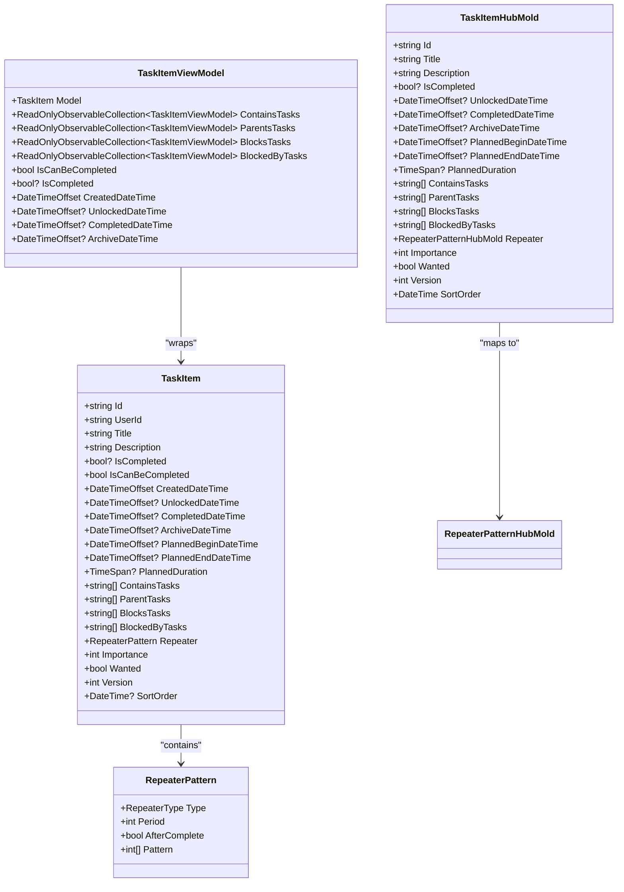

**Diagram sources**
- [TaskItem.cs](file://src/Unlimotion.Domain/TaskItem.cs#L6-L32)
- [TaskItemViewModel.cs](file://src/Unlimotion.ViewModel/TaskItemViewModel.cs#L18-L665)
- [TaskItemHubMold.cs](file://src/Unlimotion.Interface/TaskItemHubMold.cs#L7-L29)
- [RepeaterPattern.cs](file://src/Unlimotion.Domain/RepeaterPattern.cs#L6-L23)

**Section sources**
- [TaskItem.cs](file://src/Unlimotion.Domain/TaskItem.cs#L6-L32)
- [TaskItemViewModel.cs](file://src/Unlimotion.ViewModel/TaskItemViewModel.cs#L18-L665)
- [TaskItemHubMold.cs](file://src/Unlimotion.Interface/TaskItemHubMold.cs#L7-L29)

## Property Significance

### Identity and Metadata Properties

| Property | Type | Default | Purpose |
|----------|------|---------|---------|
| **Id** | string | Required | Unique identifier for task persistence and relationship mapping |
| **UserId** | string | Required | User ownership for multi-user support and data isolation |
| **Title** | string | Required | Primary task identifier and display name |
| **Description** | string | null | Detailed task information and contextual notes |

### Temporal Properties

| Property | Type | Default | Purpose |
|----------|------|---------|---------|
| **CreatedDateTime** | DateTimeOffset | UtcNow | Task creation timestamp for audit and sorting |
| **PlannedBeginDateTime** | DateTimeOffset? | null | Scheduled start time for timeline management |
| **PlannedEndDateTime** | DateTimeOffset? | null | Scheduled completion time for duration calculations |
| **PlannedDuration** | TimeSpan? | null | Expected time investment for resource planning |
| **CompletedDateTime** | DateTimeOffset? | null | Actual completion timestamp for reporting |
| **ArchiveDateTime** | DateTimeOffset? | null | Archival timestamp for historical tracking |

### Status and Behavioral Properties

| Property | Type | Default | Purpose |
|----------|------|---------|---------|
| **IsCompleted** | bool? | false | Three-state completion indicator (false=active, true=completed, null=archived) |
| **IsCanBeCompleted** | bool | true | Calculated availability flag for workflow automation |
| **UnlockedDateTime** | DateTimeOffset? | null | Timestamp when task became available for completion |
| **Importance** | int | 0 | Priority level for task ranking and filtering |
| **Wanted** | bool | false | User preference flag for task visibility |
| **Version** | int | 0 | Change tracking for concurrent modification detection |
| **SortOrder** | DateTime? | null | Custom ordering mechanism for task presentation |

**Section sources**
- [TaskItem.cs](file://src/Unlimotion.Domain/TaskItem.cs#L6-L32)

## Task Relationships

The TaskItem establishes four primary relationship types that form a directed acyclic graph (DAG):

### Hierarchical Relationships

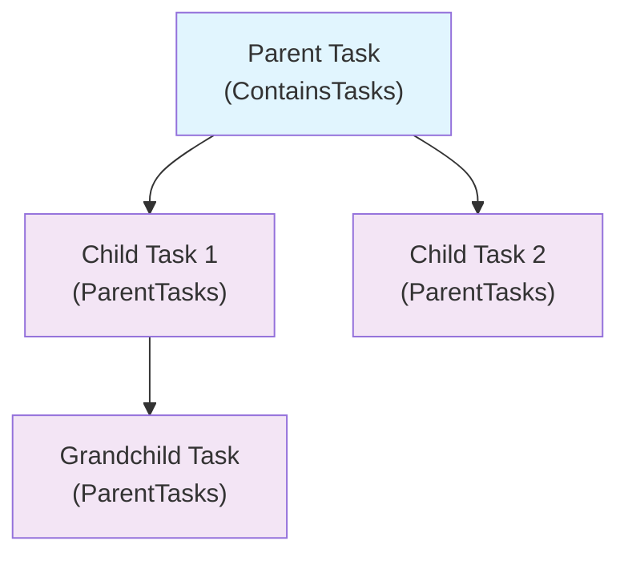

**Diagram sources**
- [TaskItem.cs](file://src/Unlimotion.Domain/TaskItem.cs#L19-L20)

### Blocking Relationships

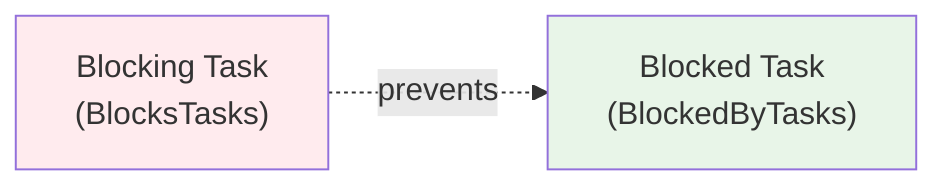

**Diagram sources**
- [TaskItem.cs](file://src/Unlimotion.Domain/TaskItem.cs#L21-L22)

### Relationship Collections

| Collection | Direction | Purpose | Constraints |
|------------|-----------|---------|-------------|
| **ContainsTasks** | Parent → Children | Defines hierarchical containment | Must form DAG, no cycles |
| **ParentTasks** | Child → Parents | Establishes reverse containment | Supports multiple inheritance |
| **BlocksTasks** | Active → Future | Prevents future completion | Must be completed first |
| **BlockedByTasks** | Future → Active | Receives blocking notifications | Enables dependency tracking |

**Section sources**
- [TaskItem.cs](file://src/Unlimotion.Domain/TaskItem.cs#L19-L22)

## Three-State Completion Logic

The TaskItem implements a sophisticated three-state completion system that provides flexibility in task lifecycle management:

### Completion States

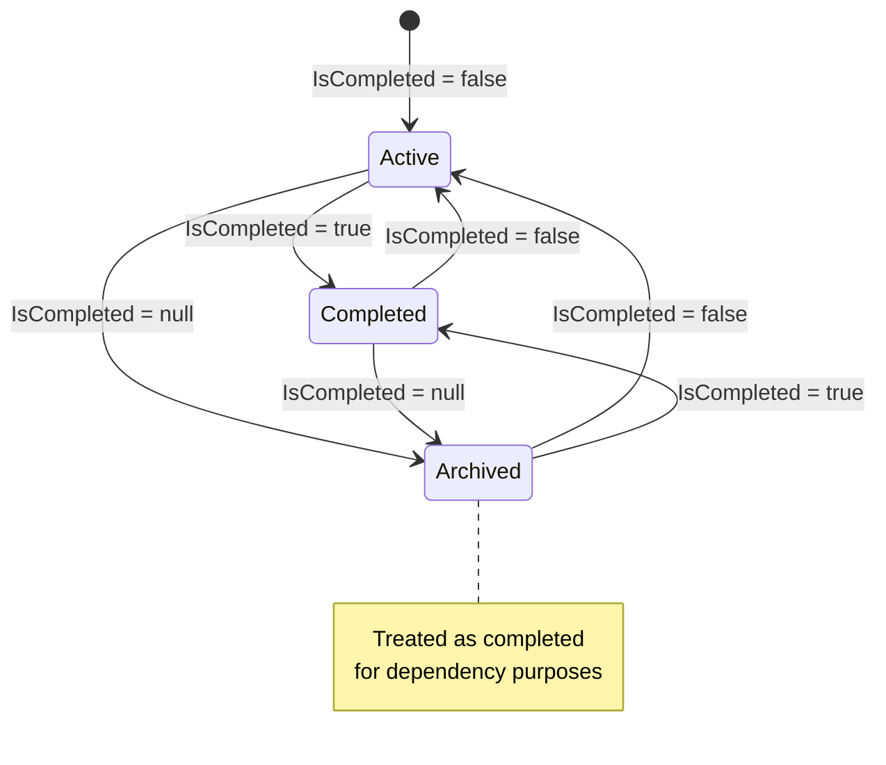

**Diagram sources**
- [TaskItem.cs](file://src/Unlimotion.Domain/TaskItem.cs#L11-L12)
- [TaskCompletionChangeTests.cs](file://src/Unlimotion.Test/TaskCompletionChangeTests.cs#L42-L86)

### State Transitions and Implications

| From State | To State | Action | Side Effects |
|------------|----------|--------|--------------|
| **Active** | **Completed** | Set IsCompleted=true | Sets CompletedDateTime, clears ArchiveDateTime |
| **Active** | **Archived** | Set IsCompleted=null | Sets ArchiveDateTime, clears CompletedDateTime |
| **Completed** | **Active** | Set IsCompleted=false | Clears both timestamps |
| **Completed** | **Archived** | Set IsCompleted=null | Sets ArchiveDateTime |
| **Archived** | **Active** | Set IsCompleted=false | Clears ArchiveDateTime |
| **Archived** | **Completed** | Set IsCompleted=true | Sets CompletedDateTime |

### Archived Task Treatment

Archived tasks (IsCompleted=null) are treated as completed for dependency resolution purposes, ensuring that:
- Parent tasks remain blocked until all dependencies are resolved
- Child tasks inherit completion status for availability calculations
- Historical tracking maintains integrity of task relationships

**Section sources**
- [TaskCompletionChangeTests.cs](file://src/Unlimotion.Test/TaskCompletionChangeTests.cs#L42-L86)
- [TaskItemViewModel.cs](file://src/Unlimotion.ViewModel/TaskItemViewModel.cs#L534-L573)

## Availability Calculation

The IsCanBeCompleted property determines whether a task can be marked as completed based on complex dependency rules:

### Availability Rules

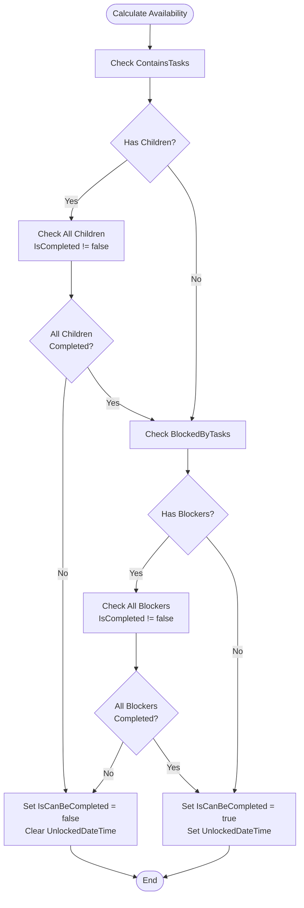

**Diagram sources**
- [TaskTreeManager.cs](file://src/Unlimotion.TaskTreeManager/TaskTreeManager.cs#L629-L699)

### Availability Calculation Logic

The TaskTreeManager performs comprehensive availability calculations:

| Condition | Result | Action |
|-----------|--------|--------|
| **All contained tasks completed** | Continue evaluation | Check blocking tasks |
| **Any contained task incomplete** | Blocked | Set IsCanBeCompleted=false, clear UnlockedDateTime |
| **All blocking tasks completed** | Available | Set IsCanBeCompleted=true, set UnlockedDateTime |
| **Any blocking task incomplete** | Blocked | Set IsCanBeCompleted=false, clear UnlockedDateTime |

### Automatic UnlockedDateTime Management

The system automatically manages the UnlockedDateTime property:
- **Set when available**: When a task becomes available for completion (IsCanBeCompleted=true)
- **Cleared when blocked**: When dependencies prevent completion (IsCanBeCompleted=false)
- **Preserved when unchanged**: Maintains original unlock timestamp during state transitions

**Section sources**
- [TaskTreeManager.cs](file://src/Unlimotion.TaskTreeManager/TaskTreeManager.cs#L629-L699)
- [TaskAvailabilityCalculationTests.cs](file://src/Unlimotion.Test/TaskAvailabilityCalculationTests.cs#L0-L47)

## Cross-Layer Communication

The TaskItem model implements a clean separation of concerns through three distinct layers:

### Domain Layer (TaskItem)

The domain model represents the core business logic and data structure:

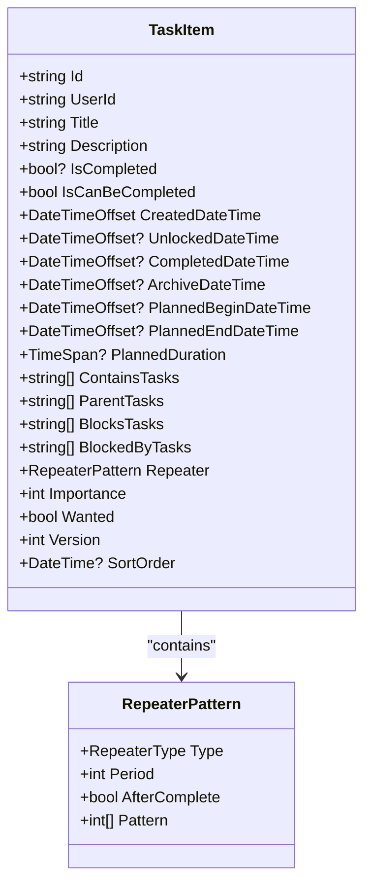

**Diagram sources**
- [TaskItem.cs](file://src/Unlimotion.Domain/TaskItem.cs#L6-L32)
- [RepeaterPattern.cs](file://src/Unlimotion.Domain/RepeaterPattern.cs#L6-L23)

### View Model Layer (TaskItemViewModel)

The view model provides reactive UI binding and presentation logic:

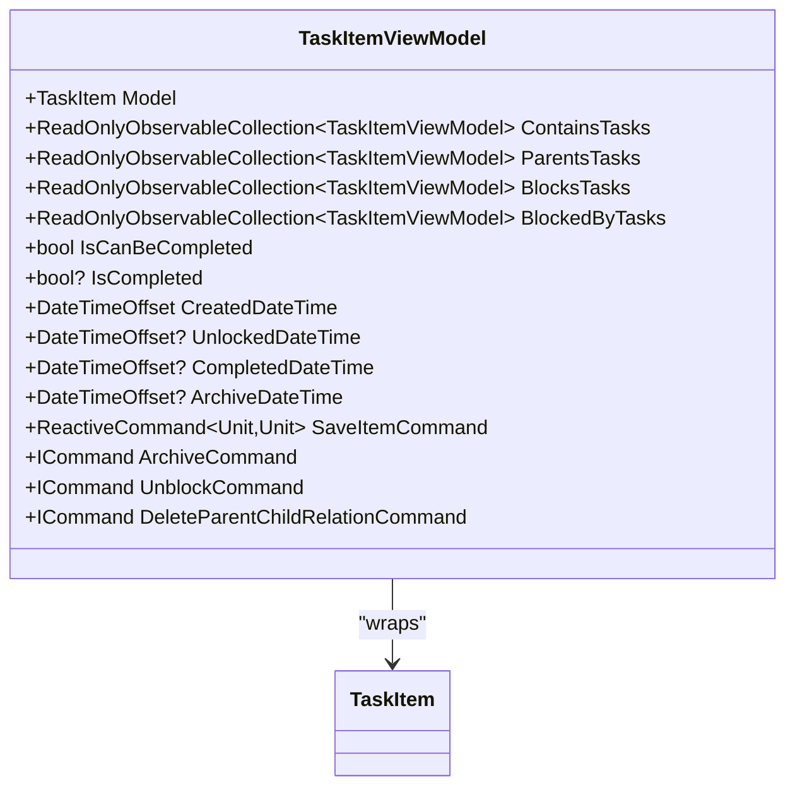

**Diagram sources**
- [TaskItemViewModel.cs](file://src/Unlimotion.ViewModel/TaskItemViewModel.cs#L18-L665)

### Interface Layer (TaskItemHubMold)

The interface mold facilitates communication with external systems:

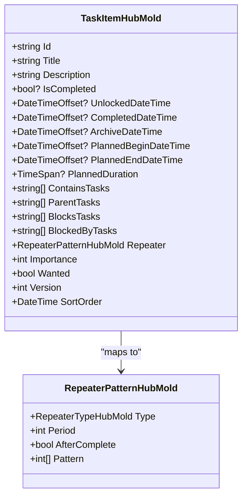

**Diagram sources**
- [TaskItemHubMold.cs](file://src/Unlimotion.Interface/TaskItemHubMold.cs#L7-L29)
- [RepeaterPatternHubMold.cs](file://src/Unlimotion.Interface/RepeaterPatternHubMold.cs#L5-L10)

### Layer Communication Patterns

| Pattern | Domain ↔ ViewModel | Domain ↔ Interface | ViewModel ↔ Interface |
|---------|-------------------|-------------------|---------------------|
| **Data Transfer** | Full model copying | Selective property mapping | Property synchronization |
| **Event Propagation** | Reactive subscriptions | Hub notifications | Command bindings |
| **State Synchronization** | Manual updates | Automatic serialization | Observable collections |
| **Validation** | Business rules enforcement | Schema validation | UI validation |

**Section sources**
- [TaskItem.cs](file://src/Unlimotion.Domain/TaskItem.cs#L6-L32)
- [TaskItemViewModel.cs](file://src/Unlimotion.ViewModel/TaskItemViewModel.cs#L18-L665)
- [TaskItemHubMold.cs](file://src/Unlimotion.Interface/TaskItemHubMold.cs#L7-L29)

## Repeater System

The RepeaterPattern enables automated task recurrence with sophisticated scheduling capabilities:

### Repeater Types

| Type | Description | Use Case |
|------|-------------|----------|
| **None** | No repetition | Single-use tasks |
| **Daily** | Every day | Routine maintenance |
| **Weekly** | Every week | Weekly meetings |
| **Monthly** | Every month | Monthly reviews |
| **Yearly** | Every year | Annual reports |

### Repeater Configuration

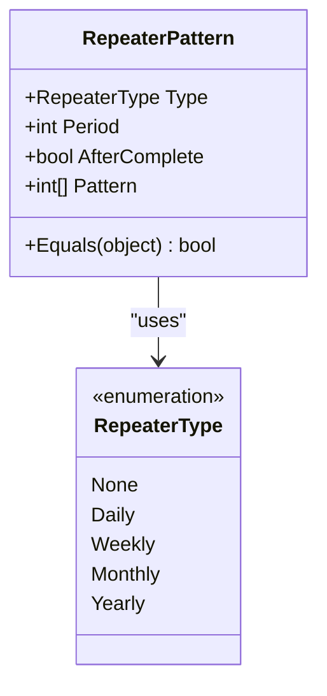

**Diagram sources**
- [RepeaterPattern.cs](file://src/Unlimotion.Domain/RepeaterPattern.cs#L6-L23)
- [RepeaterType.cs](file://src/Unlimotion.Domain/RepeaterType.cs#L3-L9)

### Repeater Behavior

| Property | Effect | Example |
|----------|--------|---------|
| **Type** | Determines recurrence pattern | Weekly → every 7 days |
| **Period** | Multiplier for frequency | Period=2 → every 2 weeks |
| **AfterComplete** | Trigger timing | true → after completion |
| **Pattern** | Specific recurrence days | Monday=1, Wednesday=3 |

**Section sources**
- [RepeaterPattern.cs](file://src/Unlimotion.Domain/RepeaterPattern.cs#L6-L23)
- [RepeaterType.cs](file://src/Unlimotion.Domain/RepeaterType.cs#L3-L9)

## Implementation Details

### Task Creation and Initialization

New TaskItem instances receive sensible defaults for immediate usability:

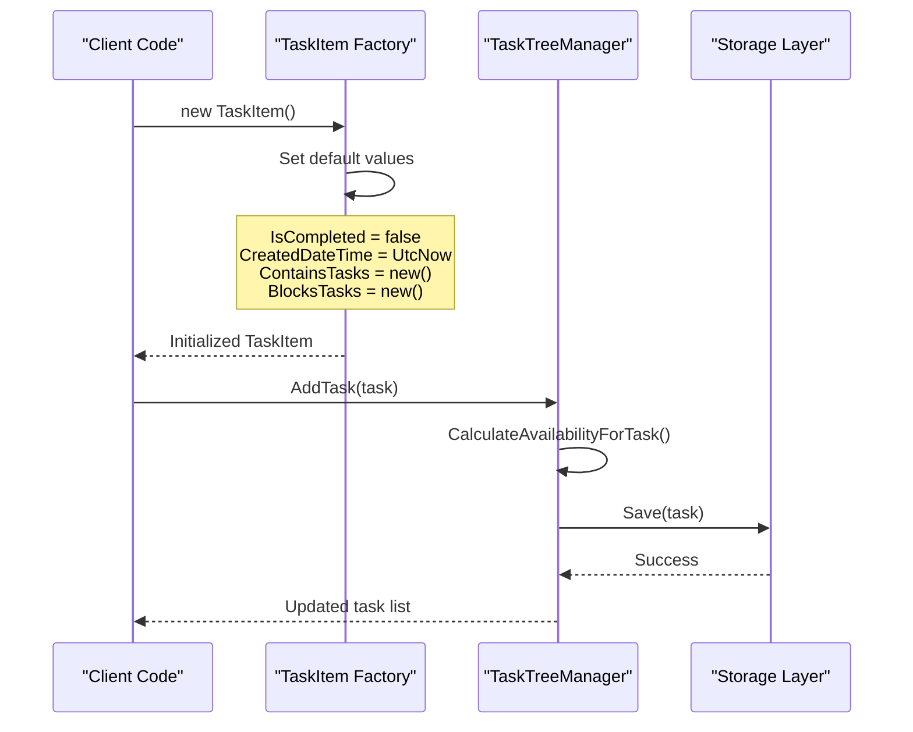

**Diagram sources**
- [TaskItem.cs](file://src/Unlimotion.Domain/TaskItem.cs#L6-L32)
- [TaskTreeManager.cs](file://src/Unlimotion.TaskTreeManager/TaskTreeManager.cs#L629-L699)

### Relationship Management

Task relationships are managed through specialized operations that maintain graph integrity:

| Operation | Purpose | Validation | Side Effects |
|-----------|---------|------------|--------------|
| **AddChildTask** | Establish parent-child relationship | Cycle detection | Availability recalculation |
| **CreateBlockingRelation** | Establish blocking relationship | Dependency validation | Blocked task updates |
| **BreakParentChildRelation** | Remove parent-child relationship | Integrity verification | Affected task updates |
| **BreakBlockingRelation** | Remove blocking relationship | Dependency cleanup | Unblocked task updates |

### Persistence and Synchronization

The TaskItem model supports various persistence scenarios:

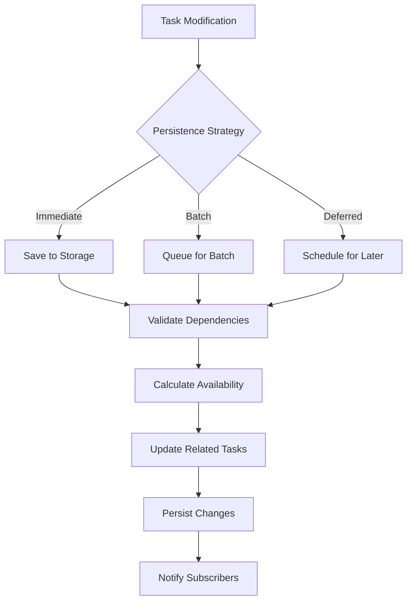

**Section sources**
- [TaskTreeManager.cs](file://src/Unlimotion.TaskTreeManager/TaskTreeManager.cs#L629-L699)

## Best Practices

### Task Design Guidelines

1. **Hierarchical Organization**: Use ContainsTasks for logical grouping, avoiding excessive nesting depth
2. **Dependency Management**: Establish clear blocking relationships to prevent circular dependencies
3. **Repeater Configuration**: Choose appropriate recurrence patterns based on task nature
4. **Importance Scoring**: Use consistent importance levels for reliable prioritization

### Performance Considerations

1. **Relationship Depth**: Limit containment hierarchy depth to prevent exponential complexity
2. **Batch Operations**: Group related task modifications to minimize availability recalculations
3. **Lazy Loading**: Load task relationships on-demand to reduce memory footprint
4. **Indexing**: Maintain efficient indexing for relationship queries

### Data Integrity

1. **Validation**: Implement comprehensive validation for relationship constraints
2. **Concurrency**: Handle concurrent modifications through version-based conflict resolution
3. **Audit Trail**: Maintain comprehensive logging for task lifecycle events
4. **Backup Strategy**: Implement robust backup mechanisms for critical task data

### User Experience

1. **Progress Indication**: Provide clear feedback for complex relationship operations
2. **Undo Capability**: Support undo operations for accidental relationship changes
3. **Visual Feedback**: Use color coding and icons to represent task states
4. **Performance Optimization**: Implement client-side caching for frequently accessed tasks