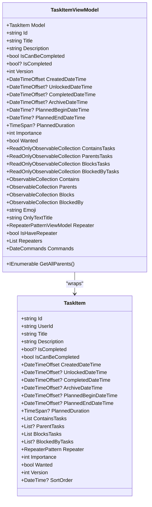
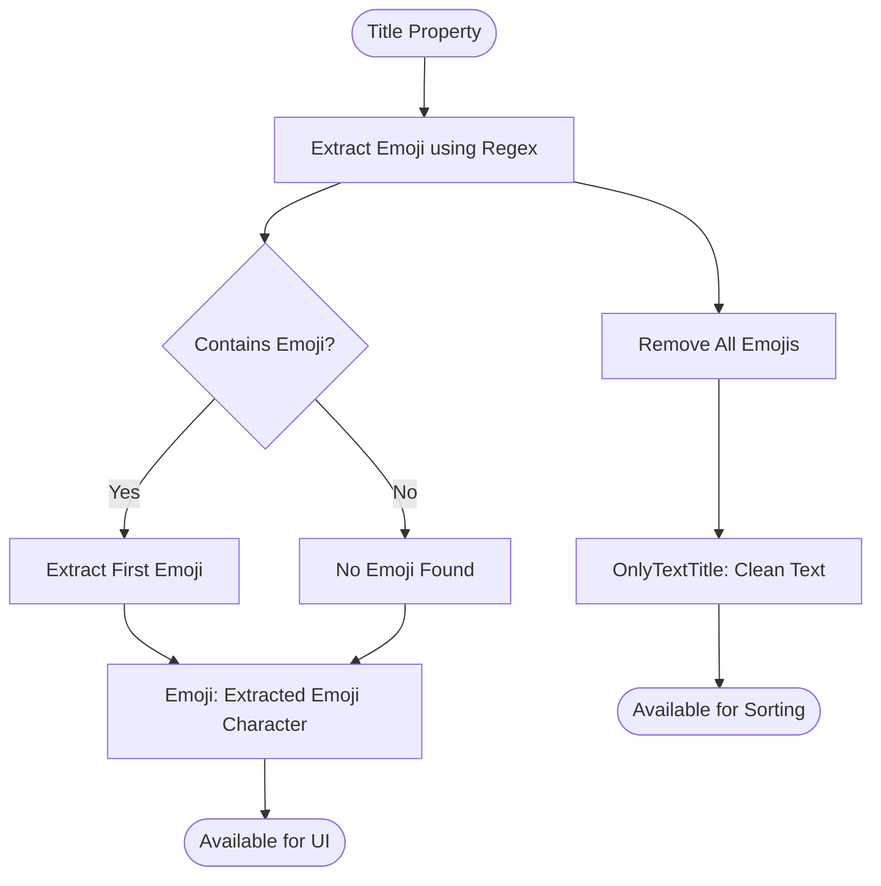
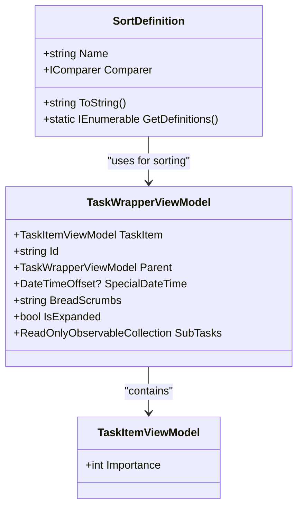
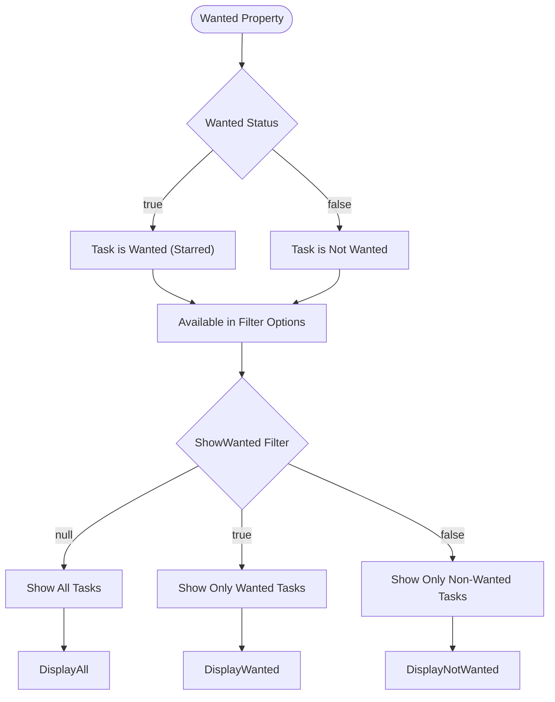
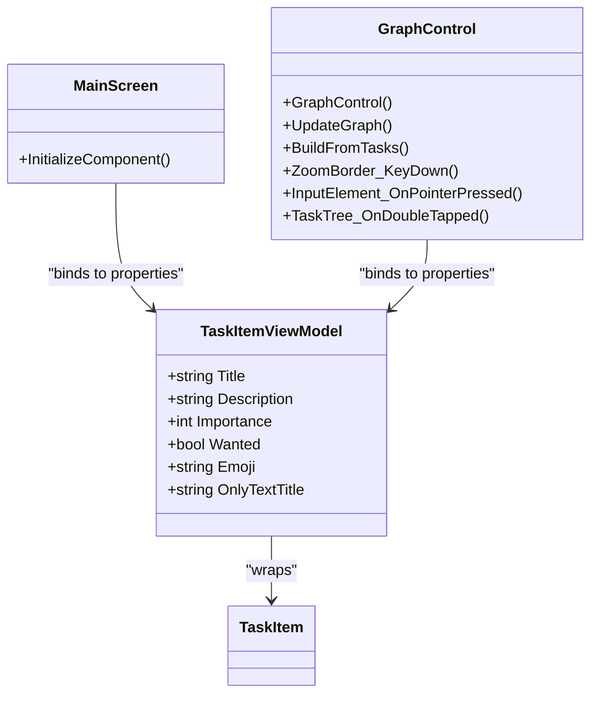
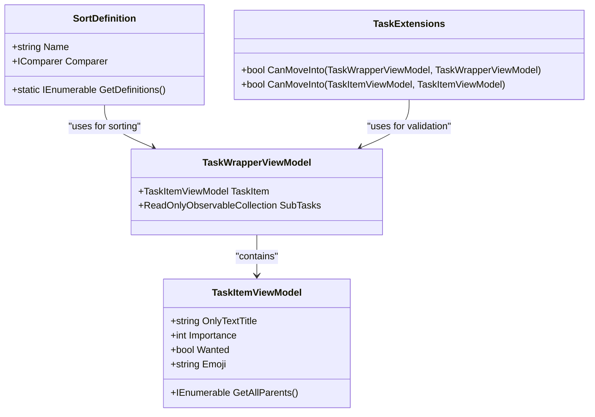
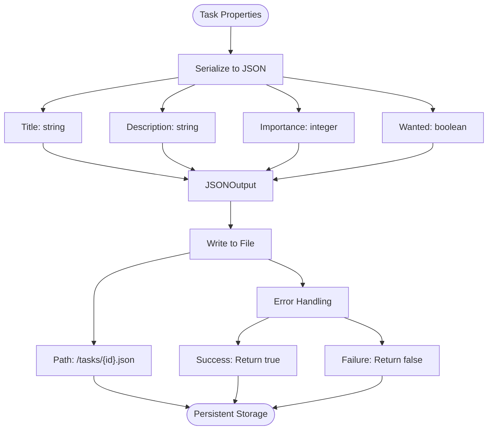

# Content and Display Properties

<cite>
**Referenced Files in This Document**   
- [TaskItem.cs](file://src/Unlimotion.Domain/TaskItem.cs)
- [TaskItemViewModel.cs](file://src/Unlimotion.ViewModel/TaskItemViewModel.cs)
- [TaskExtensions.cs](file://src/Unlimotion.ViewModel/TaskExtensions.cs)
- [SortDefinition.cs](file://src/Unlimotion.ViewModel/SortDefinition.cs)
- [MainScreen.axaml.cs](file://src/Unlimotion/Views/MainScreen.axaml.cs)
- [GraphControl.axaml.cs](file://src/Unlimotion/Views/GraphControl.axaml.cs)
- [FileTaskStorage.cs](file://src/Unlimotion/FileTaskStorage.cs)
- [AppNameGenerator.cs](file://src/Unlimotion.AppNameGenerator/AppNameGenerator.cs)
- [TaskWrapperViewModel.cs](file://src/Unlimotion.ViewModel/TaskWrapperViewModel.cs)
</cite>

## Table of Contents
1. [Introduction](#introduction)
2. [Core Properties Overview](#core-properties-overview)
3. [Title Property](#title-property)
4. [Description Property](#description-property)
5. [Importance Property](#importance-property)
6. [Wanted Property](#wanted-property)
7. [UI Binding and Display](#ui-binding-and-display)
8. [Sorting and Filtering](#sorting-and-filtering)
9. [Serialization and Storage](#serialization-and-storage)
10. [Integration with AppNameGenerator](#integration-with-appnamegenerator)

## Introduction
This document provides comprehensive documentation for the core content properties of TaskItem in the Unlimotion application. The properties covered include Title, Description, Importance, and Wanted, which are fundamental to the user experience and functionality of the task management system. These properties are integral to the application's UI components, filtering and sorting mechanisms, and JSON storage format. The document explains how these properties are bound to UI components such as MainScreen.axaml and GraphControl.axaml, their role in sorting and filtering through SortDefinition and TaskExtensions, and their behavior during JSON serialization. Special attention is given to the Title property's significance in auto-generated app names via AppNameGenerator and how the Importance property affects visual styling in TaskItemViewModel.

**Section sources**
- [TaskItem.cs](file://src/Unlimotion.Domain/TaskItem.cs#L1-L33)
- [TaskItemViewModel.cs](file://src/Unlimotion.ViewModel/TaskItemViewModel.cs#L1-L666)

## Core Properties Overview
The TaskItem class contains several key properties that define the content and display characteristics of tasks in the Unlimotion application. These properties are designed to support rich task management functionality, including emoji support in titles, rich text descriptions, priority-based importance levels, and favorite/starred status for quick access.

The core properties are:
- **Title**: The primary display name of the task, supporting emoji characters
- **Description**: Rich text details providing additional information about the task
- **Importance**: A priority level from 0-5 that influences sorting and UI emphasis
- **Wanted**: A boolean flag indicating favorite/starred status for quick access

These properties are defined in the TaskItem class and exposed through the TaskItemViewModel for UI binding and manipulation. The properties are automatically saved when modified, with a throttle mechanism to prevent excessive saves during rapid property changes.

**Diagram sources**
- [TaskItem.cs](file://src/Unlimotion.Domain/TaskItem.cs#L1-L33)
- [TaskItemViewModel.cs](file://src/Unlimotion.ViewModel/TaskItemViewModel.cs#L1-L666)

**Section sources**
- [TaskItem.cs](file://src/Unlimotion.Domain/TaskItem.cs#L1-L33)
- [TaskItemViewModel.cs](file://src/Unlimotion.ViewModel/TaskItemViewModel.cs#L1-L666)

## Title Property
The Title property serves as the primary display name for tasks and supports emoji characters, allowing users to enhance visual recognition and organization. The Title is a string property that can contain any text, including emoji characters, which are automatically extracted and used for various UI features.

The TaskItemViewModel provides two derived properties based on the Title:
- **Emoji**: Extracts the first emoji character from the title using a regular expression pattern
- **OnlyTextTitle**: Returns the title with all emoji characters removed

These derived properties enable the application to use emojis for visual grouping and filtering while maintaining clean text for sorting and display purposes. The emoji extraction uses a comprehensive regular expression pattern that matches a wide range of emoji characters and sequences.

The Title property is bound to UI components and participates in sorting operations. When the title is modified, the change triggers an automatic save operation after a throttle period, ensuring that frequent edits don't result in excessive disk writes.

**Diagram sources**
- [TaskItemViewModel.cs](file://src/Unlimotion.ViewModel/TaskItemViewModel.cs#L230-L235)

**Section sources**
- [TaskItemViewModel.cs](file://src/Unlimotion.ViewModel/TaskItemViewModel.cs#L230-L235)

## Description Property
The Description property provides rich text details for tasks, allowing users to include comprehensive information about the task's purpose, requirements, and context. This property is implemented as a string field in the TaskItem class and exposed through the TaskItemViewModel.

The Description supports both plain text and potentially markdown formatting, though the current implementation treats it as plain text for display purposes. The property is bound to UI components that provide text editing capabilities, allowing users to enter and modify detailed task information.

When the Description is modified, the change triggers the same auto-save mechanism as other properties, with changes being persisted after a throttle period to prevent excessive disk writes during active editing sessions. The Description is included in the JSON serialization of task data, ensuring that all rich text details are preserved across application sessions.

The property is designed to support various rendering scenarios, from simple text display in list views to rich text rendering in detailed task views. While the current implementation focuses on plain text, the architecture supports potential future enhancements for markdown or other rich text formatting.

**Section sources**
- [TaskItem.cs](file://src/Unlimotion.Domain/TaskItem.cs#L1-L33)
- [TaskItemViewModel.cs](file://src/Unlimotion.ViewModel/TaskItemViewModel.cs#L1-L666)

## Importance Property
The Importance property represents the priority level of a task, with values ranging from 0 to 5. This property plays a crucial role in both UI presentation and sorting behavior, allowing users to quickly identify and organize high-priority tasks.

The Importance value directly influences visual styling in the TaskItemViewModel, with higher importance levels typically receiving more prominent visual treatment in the UI. This may include bolder text, different colors, or special icons to draw attention to critical tasks.

In terms of sorting, the Importance property is used in multiple SortDefinition configurations:
- **Importance Ascending**: Sorts tasks from lowest to highest importance
- **Importance Descending**: Sorts tasks from highest to lowest importance

These sorting options allow users to organize their task lists based on priority, making it easier to focus on the most critical items. The Importance property is also considered in various filtering operations and can influence the overall layout and presentation of tasks in different views.

When the Importance value is modified, the change triggers the auto-save mechanism, ensuring that priority updates are persisted to storage. The property's impact on both visual presentation and sorting makes it a key factor in the user's ability to manage their task workload effectively.

**Diagram sources**
- [SortDefinition.cs](file://src/Unlimotion.ViewModel/SortDefinition.cs#L1-L239)
- [TaskWrapperViewModel.cs](file://src/Unlimotion.ViewModel/TaskWrapperViewModel.cs#L1-L124)

**Section sources**
- [TaskItem.cs](file://src/Unlimotion.Domain/TaskItem.cs#L1-L33)
- [SortDefinition.cs](file://src/Unlimotion.ViewModel/SortDefinition.cs#L1-L239)

## Wanted Property
The Wanted property is a boolean flag that indicates whether a task has been marked as a favorite or starred for quick access. This property enables users to highlight important tasks that require regular attention or have special significance.

The Wanted status integrates with user preferences and filtering systems, allowing users to:
- Filter views to show only wanted (starred) tasks
- Filter views to show only non-wanted tasks
- Toggle the display of wanted status in various views

In the GraphViewModel, the ShowWanted property (which can be null, true, or false) controls the filtering of tasks based on their Wanted status:
- **null**: No filtering based on wanted status
- **true**: Show only wanted tasks
- **false**: Show only non-wanted tasks

This flexible filtering approach allows users to focus on their most important tasks while still having the option to view all tasks when needed. The Wanted property is also included in the JSON serialization of task data, ensuring that user preferences for task favorites are preserved across sessions.

When the Wanted status is modified, the change triggers the auto-save mechanism, ensuring that the updated favorite status is promptly persisted to storage. This immediate persistence is important for user experience, as it ensures that favorite markings are not lost if the application is closed unexpectedly.

**Diagram sources**
- [GraphViewModel.cs](file://src/Unlimotion.ViewModel/GraphViewModel.cs#L1-L30)
- [MainWindowViewModel.cs](file://src/Unlimotion.ViewModel/MainWindowViewModel.cs#L1-L1047)

**Section sources**
- [TaskItem.cs](file://src/Unlimotion.Domain/TaskItem.cs#L1-L33)
- [GraphViewModel.cs](file://src/Unlimotion.ViewModel/GraphViewModel.cs#L1-L30)

## UI Binding and Display
The TaskItem properties are bound to UI components through the TaskItemViewModel, which serves as the bridge between the domain model and the user interface. The primary UI components that display and interact with these properties are MainScreen.axaml and GraphControl.axaml.

The MainScreen.axaml component provides the primary interface for viewing and editing task properties, with controls for:
- Displaying and editing the Title (with emoji support)
- Displaying and editing the Description
- Setting the Importance level
- Toggling the Wanted (favorite) status

The GraphControl.axaml component visualizes tasks in a graph structure, where the Title (including emoji) is prominently displayed, and the Importance level may influence the visual prominence of task nodes. The GraphControl uses the TaskItemViewModel to access all task properties and update the display when properties change.

Both components leverage the reactive programming model provided by ReactiveUI, with property changes automatically propagating to the UI through data binding. When a user modifies a task property, the change is immediately reflected in the UI, and the auto-save mechanism ensures the change is persisted to storage after a brief throttle period.

The UI components also support various display modes and filtering options that leverage the core properties, allowing users to customize their view of tasks based on importance, wanted status, and other criteria.

**Diagram sources**
- [MainScreen.axaml.cs](file://src/Unlimotion/Views/MainScreen.axaml.cs#L1-L13)
- [GraphControl.axaml.cs](file://src/Unlimotion/Views/GraphControl.axaml.cs#L1-L229)

**Section sources**
- [MainScreen.axaml.cs](file://src/Unlimotion/Views/MainScreen.axaml.cs#L1-L13)
- [GraphControl.axaml.cs](file://src/Unlimotion/Views/GraphControl.axaml.cs#L1-L229)

## Sorting and Filtering
The TaskItem properties play a central role in the application's sorting and filtering capabilities, with dedicated SortDefinition configurations for key properties. The sorting system is implemented through the SortDefinition class, which defines various sorting criteria and their corresponding comparers.

For the Title property, there are two sorting options:
- **Title Ascending**: Sorts tasks alphabetically by title (excluding emojis)
- **Title Descending**: Sorts tasks in reverse alphabetical order by title

For the Importance property, there are two sorting options:
- **Importance Ascending**: Sorts tasks from lowest to highest importance
- **Importance Descending**: Sorts tasks from highest to lowest importance

The filtering system leverages both the Title and Wanted properties extensively. The emoji extraction from titles enables visual grouping and filtering, with the application creating EmojiFilter instances for each unique emoji found in task titles. Users can then filter tasks based on these emoji categories.

The Wanted property is integrated into the filtering system through the ShowWanted property in MainWindowViewModel, which allows users to filter tasks based on their favorite/starred status. This creates a powerful combination of visual (emoji-based) and functional (importance, wanted status) filtering options that help users manage their task workload effectively.

**Diagram sources**
- [SortDefinition.cs](file://src/Unlimotion.ViewModel/SortDefinition.cs#L1-L239)
- [TaskExtensions.cs](file://src/Unlimotion.ViewModel/TaskExtensions.cs#L1-L19)
- [TaskWrapperViewModel.cs](file://src/Unlimotion.ViewModel/TaskWrapperViewModel.cs#L1-L124)

**Section sources**
- [SortDefinition.cs](file://src/Unlimotion.ViewModel/SortDefinition.cs#L1-L239)
- [TaskExtensions.cs](file://src/Unlimotion.ViewModel/TaskExtensions.cs#L1-L19)

## Serialization and Storage
The TaskItem properties are serialized to JSON format for persistent storage, with the FileTaskStorage class handling the reading and writing of task data to disk. The serialization process uses Newtonsoft.Json to convert TaskItem objects to JSON strings and vice versa.

Each property is included in the JSON representation:
- **Title**: Stored as a string field
- **Description**: Stored as a string field
- **Importance**: Stored as an integer field
- **Wanted**: Stored as a boolean field

The JSON serialization includes all properties defined in the TaskItem class, ensuring that no data is lost during storage and retrieval. The FileTaskStorage class implements methods for saving, loading, and removing task files, with appropriate error handling and data integrity checks.

When a task is saved, the system first checks if the task has an ID; if not, a new GUID is generated. The task data is then serialized to JSON with indentation for readability and written to a file named with the task's ID. This file-based storage approach allows for easy backup and synchronization through standard file system operations.

The storage system also includes mechanisms for handling data migration and repair, ensuring that changes to the data model can be applied to existing task files without data loss.

**Diagram sources**
- [FileTaskStorage.cs](file://src/Unlimotion/FileTaskStorage.cs#L1-L458)

**Section sources**
- [FileTaskStorage.cs](file://src/Unlimotion/FileTaskStorage.cs#L1-L458)

## Integration with AppNameGenerator
While the Title property of TaskItem is not directly used by the AppNameGenerator, the pattern of using property values for dynamic content generation is consistent across the application. The AppNameGenerator demonstrates how string properties can be used to create dynamic application names based on build context.

The AppNameGenerator is a source generator that creates a partial class with an application name based on the current git branch and commit hash. This demonstrates the principle of using dynamic data to generate user-facing content, similar to how the TaskItem Title is used throughout the application.

The connection between these systems is conceptual rather than direct - both show how string properties can be leveraged to create meaningful user experiences. The Title property's role in creating recognizable and organized task lists parallels the AppNameGenerator's role in creating informative application names that reflect the current build state.

This integration pattern highlights the application's overall design philosophy of using data-driven approaches to enhance user experience, whether through task organization or application identification.

**Section sources**
- [AppNameGenerator.cs](file://src/Unlimotion.AppNameGenerator/AppNameGenerator.cs#L1-L107)