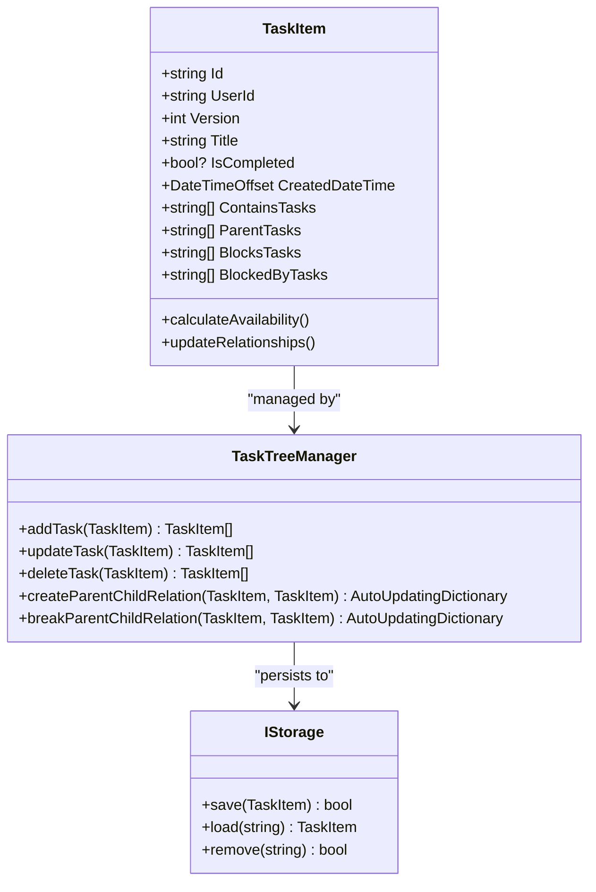
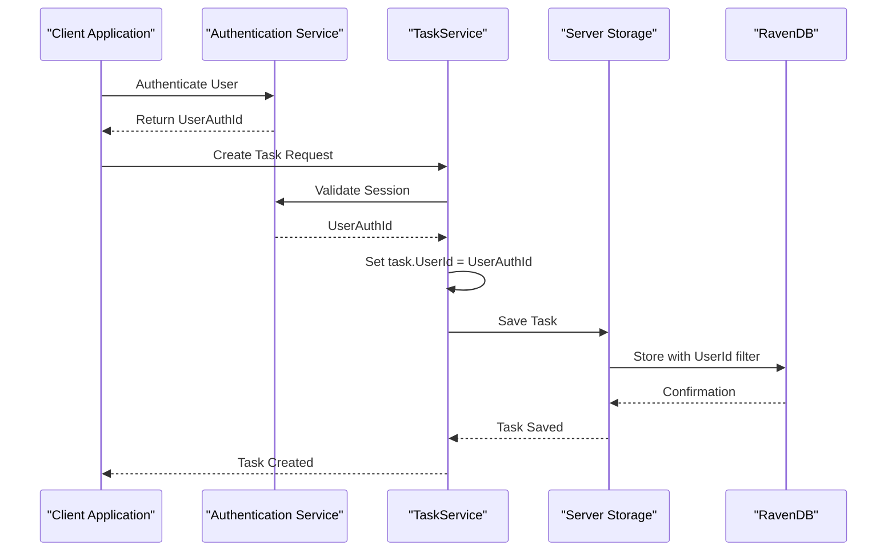
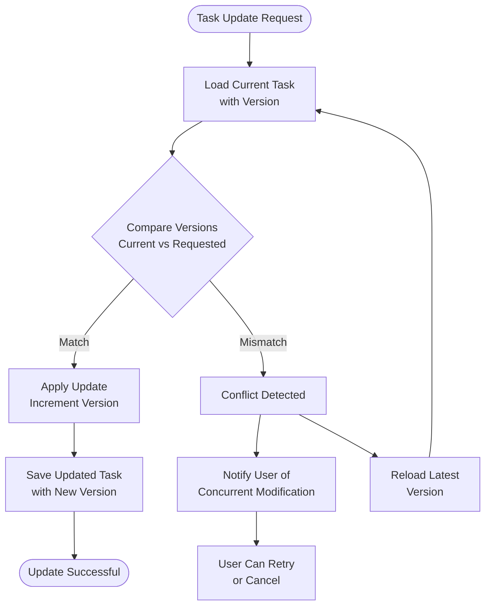
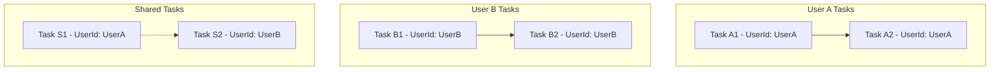
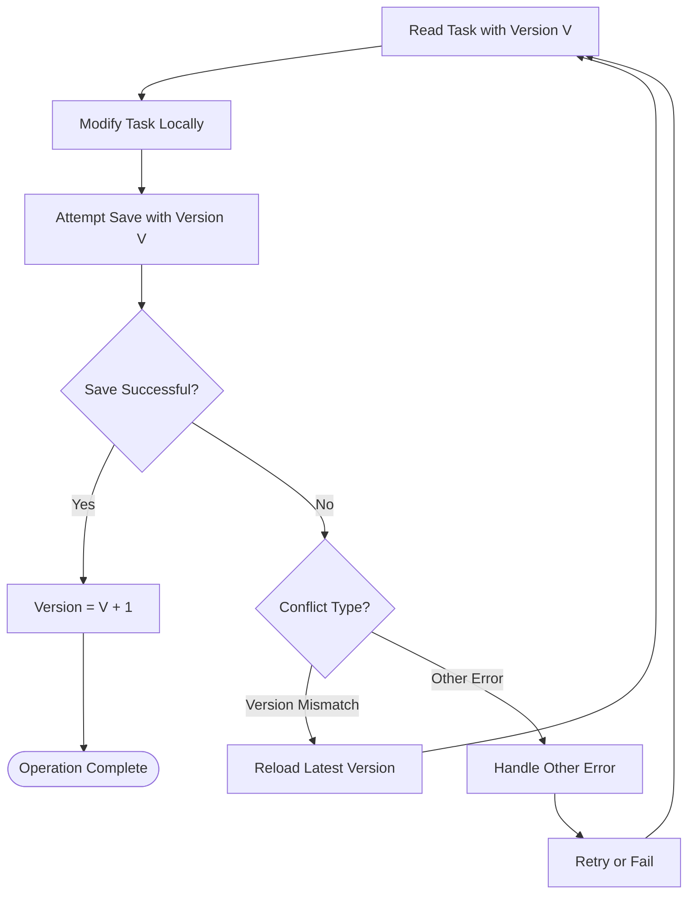
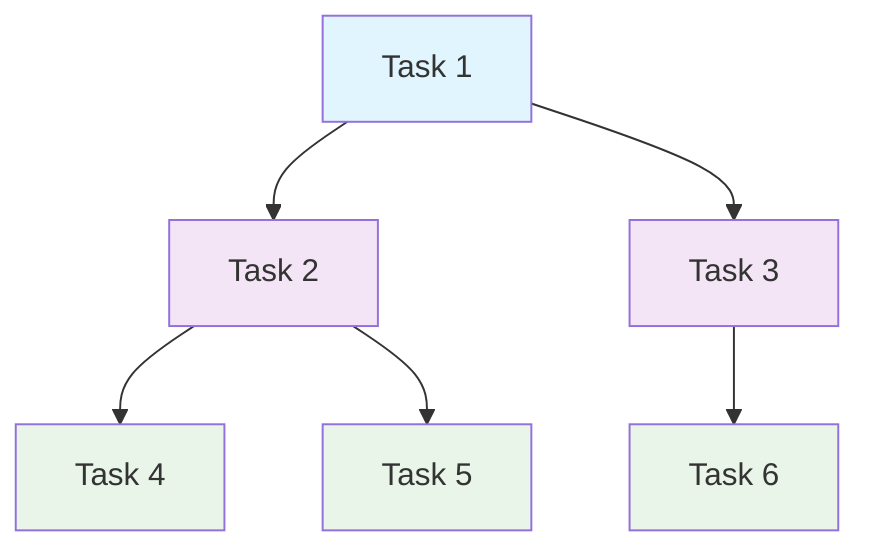
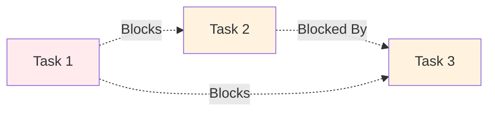
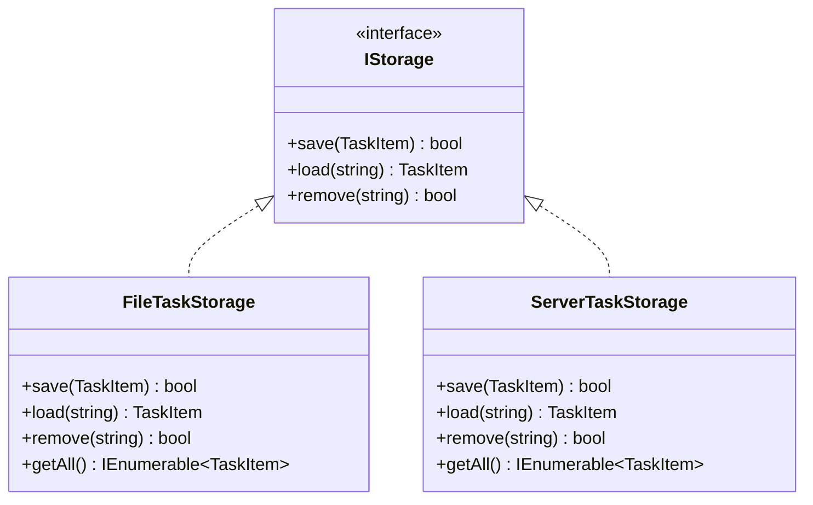
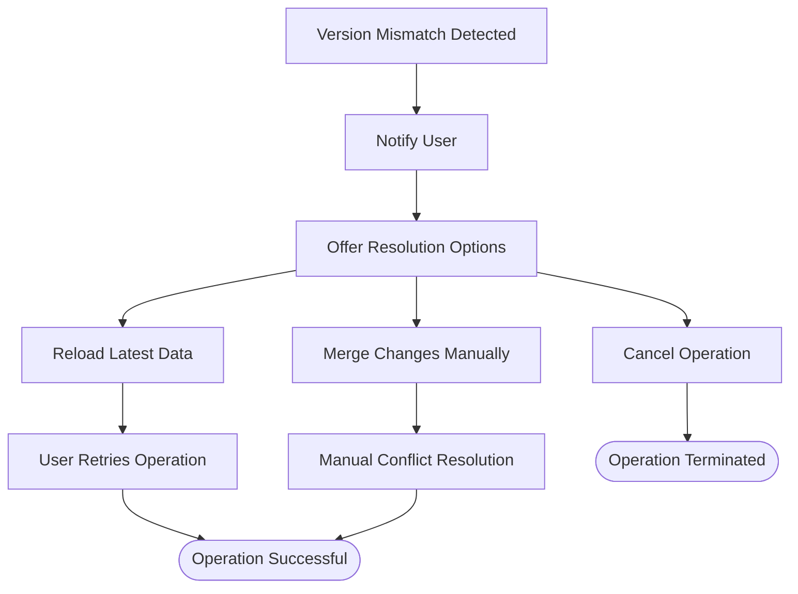
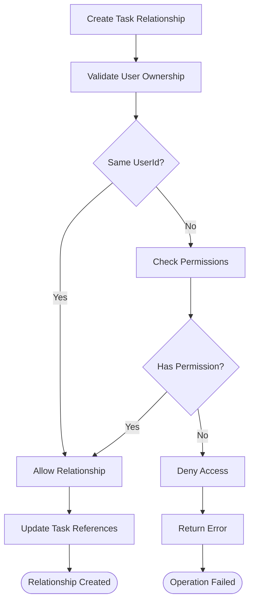

# Identity and Ownership Properties

<cite>
**Referenced Files in This Document**
- [TaskItem.cs](file://src/Unlimotion.Domain/TaskItem.cs)
- [TaskService.cs](file://src/Unlimotion.Server.ServiceInterface/TaskService.cs)
- [TaskTreeManager.cs](file://src/Unlimotion.TaskTreeManager/TaskTreeManager.cs)
- [ServerTaskStorage.cs](file://src/Unlimotion/ServerTaskStorage.cs)
- [FileTaskStorage.cs](file://src/Unlimotion/FileTaskStorage.cs)
- [TaskItemViewModel.cs](file://src/Unlimotion.ViewModel/TaskItemViewModel.cs)
- [TaskStorages.cs](file://src/Unlimotion/TaskStorages.cs)
- [TaskItemHubMold.cs](file://src/Unlimotion.Interface/TaskItemHubMold.cs)
</cite>

## Table of Contents
1. [Introduction](#introduction)
2. [Core Identity Properties](#core-identity-properties)
3. [Ownership Management](#ownership-management)
4. [Optimistic Concurrency Control](#optimistic-concurrency-control)
5. [Task Relationship Architecture](#task-relationship-architecture)
6. [Storage Implementation Details](#storage-implementation-details)
7. [Synchronization Across Environments](#synchronization-across-environments)
8. [Common Issues and Solutions](#common-issues-and-solutions)
9. [Best Practices](#best-practices)
10. [Troubleshooting Guide](#troubleshooting-guide)

## Introduction

The Unlimotion task management system employs a sophisticated identity and ownership model that ensures data integrity across multiple storage environments and synchronization points. The system manages three critical properties: `Id` for unique identification, `UserId` for multi-user ownership, and `Version` for optimistic concurrency control. These properties work together to maintain consistency in distributed scenarios involving local storage, server synchronization, and Git-based backup systems.

This documentation explores how these properties are implemented, managed, and protected against common issues like ID collisions, version mismatches, and orphaned tasks across the entire application architecture.

## Core Identity Properties

### Id Property - Unique Task Identification

The `Id` property serves as the primary unique identifier for each TaskItem, implemented as a string-based GUID. This design choice provides several advantages:

**Diagram sources**
- [TaskItem.cs](file://src/Unlimotion.Domain/TaskItem.cs#L6-L32)
- [TaskTreeManager.cs](file://src/Unlimotion.TaskTreeManager/TaskTreeManager.cs#L15-L25)

#### Key Characteristics of Id Implementation

| Property | Value | Purpose |
|----------|-------|---------|
| Type | string | Enables flexible serialization and URL encoding |
| Format | GUID-based | Ensures global uniqueness across all environments |
| Generation | Auto-generated on creation | Prevents conflicts in distributed scenarios |
| Validation | Non-null requirement | Maintains referential integrity |

The Id property is crucial for maintaining task relationships within the system. Each task maintains four types of relationships that reference other tasks by their Id values:

- **ContainsTasks**: Child tasks that are part of this task's decomposition
- **ParentTasks**: Parent tasks that contain this task as a subtask
- **BlocksTasks**: Tasks that must be completed before this task can proceed
- **BlockedByTasks**: Tasks that prevent this task from becoming available

**Section sources**
- [TaskItem.cs](file://src/Unlimotion.Domain/TaskItem.cs#L18-L25)

### UserId Property - Multi-User Ownership

The `UserId` property establishes ownership relationships in multi-user environments, particularly when using the server mode. This property ensures that tasks are properly isolated between users while maintaining the ability to share tasks when needed.

#### Server Mode Implementation

In server mode, the UserId property is automatically populated during task creation and enforced through authentication mechanisms:

**Diagram sources**
- [TaskService.cs](file://src/Unlimotion.Server.ServiceInterface/TaskService.cs#L20-L35)
- [ServerTaskStorage.cs](file://src/Unlimotion/ServerTaskStorage.cs#L100-L120)

#### Access Control Mechanisms

The UserId property enforces strict access control through multiple layers:

| Layer | Responsibility | Implementation |
|-------|---------------|----------------|
| Authentication | User verification | JWT token validation |
| Authorization | Permission checking | UserAuthId comparison |
| Filtering | Data isolation | UserId-based queries |
| Persistence | Ownership enforcement | Automatic UserId assignment |

**Section sources**
- [TaskService.cs](file://src/Unlimotion.Server.ServiceInterface/TaskService.cs#L20-L35)

### Version Property - Optimistic Concurrency Control

The `Version` property implements optimistic concurrency control to prevent race conditions during concurrent edits across distributed systems. This mechanism ensures that updates are applied only when the task hasn't been modified since it was last read.

#### Version Management Strategy

**Diagram sources**
- [TaskTreeManager.cs](file://src/Unlimotion.TaskTreeManager/TaskTreeManager.cs#L248-L284)

#### Version Increment Patterns

The system follows specific patterns for version management during different operations:

| Operation | Version Behavior | Rationale |
|-----------|------------------|-----------|
| Create | Initialize to 1 | Establish baseline version |
| Update | Increment by 1 | Track modification history |
| Delete | Not applicable | Task removal bypasses versioning |
| Clone | Initialize to 1 | New task starts fresh versioning |
| Bulk Operations | Individual versioning | Prevents cascade failures |

**Section sources**
- [TaskTreeManager.cs](file://src/Unlimotion.TaskTreeManager/TaskTreeManager.cs#L47-L50)
- [TaskTreeManager.cs](file://src/Unlimotion.TaskTreeManager/TaskTreeManager.cs#L77-L80)

## Ownership Management

### Multi-User Environment Support

The UserId property enables robust multi-user support through several mechanisms:

#### User Isolation
Each user's tasks are isolated by UserId, preventing unauthorized access to other users' data. This isolation is maintained across all storage layers:

**Diagram sources**
- [TaskService.cs](file://src/Unlimotion.Server.ServiceInterface/TaskService.cs#L20-L35)

#### Cross-User Task Relationships

While tasks are owned by individual users, the system allows for cross-user relationships through careful management of task references. This enables collaboration scenarios where tasks can be shared between users while maintaining ownership isolation.

**Section sources**
- [TaskService.cs](file://src/Unlimotion.Server.ServiceInterface/TaskService.cs#L45-L65)

### Task Relationship Ownership

Task relationships (ContainsTasks, ParentTasks, BlocksTasks, BlockedByTasks) are managed with ownership awareness:

#### Relationship Integrity
- **Child Tasks**: Inherit ownership from parent tasks
- **Blocking Relationships**: Both blocking and blocked tasks must belong to the same user
- **Cross-User References**: Prohibited to maintain data isolation

#### Ownership Propagation Rules

| Relationship Type | Ownership Rule | Implementation |
|-------------------|----------------|----------------|
| Parent → Child | Child inherits parent's UserId | Automatic propagation |
| Blocking → Blocked | Both tasks must have same UserId | Validation check |
| Contains → Parent | Parent inherits child's UserId | Ownership inheritance |
| BlockedBy → Blocks | Same ownership requirement | Cross-reference validation |

## Optimistic Concurrency Control

### Race Condition Prevention

The Version property effectively prevents race conditions by implementing optimistic concurrency control. This approach assumes that conflicts are rare and handles them gracefully when they occur.

#### Conflict Detection Algorithm

**Diagram sources**
- [TaskTreeManager.cs](file://src/Unlimotion.TaskTreeManager/TaskTreeManager.cs#L248-L284)

### Concurrent Edit Scenarios

The system handles various concurrent edit scenarios:

#### Scenario 1: Simultaneous Updates
- **Problem**: Two users modify the same task concurrently
- **Solution**: Version mismatch triggers conflict resolution
- **Outcome**: User receives notification and can retry with latest data

#### Scenario 2: Network Partition Recovery
- **Problem**: Network interruption during task update
- **Solution**: Version validation ensures consistency upon reconnection
- **Outcome**: Automatic conflict resolution with user notification

#### Scenario 3: Bulk Operations
- **Problem**: Multiple concurrent bulk operations
- **Solution**: Individual versioning prevents cascade failures
- **Outcome**: Each task maintains independent version control

**Section sources**
- [TaskTreeManager.cs](file://src/Unlimotion.TaskTreeManager/TaskTreeManager.cs#L248-L284)

## Task Relationship Architecture

### Hierarchical Task Structure

The Id property enables complex hierarchical relationships that form the core of the task management system:

#### Parent-Child Relationships
Parent-child relationships are fundamental to task decomposition:

**Diagram sources**
- [TaskItem.cs](file://src/Unlimotion.Domain/TaskItem.cs#L18-L25)

#### Blocking Relationships
Blocking relationships enable complex task dependencies:

**Diagram sources**
- [TaskItem.cs](file://src/Unlimotion.Domain/TaskItem.cs#L22-L23)

### Relationship Management Operations

The TaskTreeManager handles complex relationship operations while maintaining Id integrity:

#### Adding Relationships
When adding parent-child or blocking relationships, the system validates Id existence and creates bidirectional references.

#### Removing Relationships
Relationship removal involves updating both sides of the relationship and recalculating task availability.

#### Moving Tasks Between Hierarchies
Moving tasks between parent tasks requires breaking existing relationships and establishing new ones while preserving task ownership.

**Section sources**
- [TaskTreeManager.cs](file://src/Unlimotion.TaskTreeManager/TaskTreeManager.cs#L380-L420)

## Storage Implementation Details

### Local File Storage

The FileTaskStorage implementation demonstrates how identity properties are managed in a file-based storage system:

#### File Naming Convention
Tasks are stored as JSON files named with their Id values, ensuring direct correlation between file names and task identities.

#### Atomic Operations
File operations are designed to be atomic, preventing partial updates that could lead to inconsistent state.

**Section sources**
- [FileTaskStorage.cs](file://src/Unlimotion/FileTaskStorage.cs#L185-L220)

### Server Storage

The ServerTaskStorage implementation shows how identity properties integrate with remote storage systems:

#### SignalR Integration
The system uses SignalR for real-time synchronization, with Id properties ensuring proper task routing.

#### Bulk Operations
Bulk insert operations demonstrate efficient handling of multiple tasks while maintaining Id uniqueness.

**Section sources**
- [ServerTaskStorage.cs](file://src/Unlimotion/ServerTaskStorage.cs#L593-L639)

### Storage Abstraction Layer

Both storage implementations adhere to the IStorage interface, ensuring consistent behavior:

**Diagram sources**
- [IStorage.cs](file://src/Unlimotion.TaskTreeManager/IStorage.cs#L5-L9)
- [FileTaskStorage.cs](file://src/Unlimotion/FileTaskStorage.cs#L20-L35)
- [ServerTaskStorage.cs](file://src/Unlimotion/ServerTaskStorage.cs#L25-L40)

## Synchronization Across Environments

### Local-Server Synchronization

The system maintains consistency across local and server storage through careful Id and Version management:

#### Sync Protocol
1. **Initial Sync**: Tasks are synchronized with UserId filtering
2. **Incremental Updates**: Version tracking prevents conflicts
3. **Conflict Resolution**: User notification and manual resolution

#### Data Consistency Guarantees
- **Id Uniqueness**: Global uniqueness across all sync points
- **Version Tracking**: Prevents race conditions during sync
- **Ownership Preservation**: UserId ensures proper access control

**Section sources**
- [TaskStorages.cs](file://src/Unlimotion/TaskStorages.cs#L129-L163)

### Git-Based Backup Integration

The Git backup system leverages the same identity properties for reliable backup and restore operations:

#### Backup Strategy
- **Task Serialization**: Id properties ensure proper task reconstruction
- **Relationship Preservation**: All relationship types are maintained
- **Conflict Resolution**: Version information helps resolve merge conflicts

#### Restore Operations
During restore operations, the system validates Id uniqueness and resolves any conflicts that may arise from concurrent modifications.

**Section sources**
- [TaskStorages.cs](file://src/Unlimotion/TaskStorages.cs#L79-L105)

## Common Issues and Solutions

### ID Collisions

#### Problem
Duplicate Id values can occur in distributed environments where multiple clients create tasks simultaneously.

#### Solution
The system prevents ID collisions through several mechanisms:

| Prevention Method | Implementation | Effectiveness |
|-------------------|----------------|---------------|
| GUID Generation | Auto-generated GUIDs | High - Mathematical collision probability near zero |
| Server Validation | Server-side Id validation | Medium - Prevents malicious collisions |
| Client-Side Checks | Pre-save validation | Low - Can be bypassed |

#### Detection and Resolution
When ID collisions are detected, the system automatically generates new IDs and updates all related relationships.

**Section sources**
- [TaskTreeManager.cs](file://src/Unlimotion.TaskTreeManager/TaskTreeManager.cs#L47-L50)

### Version Mismatches

#### Problem
Version mismatches occur when concurrent edits are attempted on the same task.

#### Symptoms
- "Task has been modified by another user" errors
- Failed save operations
- Data inconsistency warnings

#### Resolution Strategies

**Diagram sources**
- [TaskTreeManager.cs](file://src/Unlimotion.TaskTreeManager/TaskTreeManager.cs#L248-L284)

### Orphaned Tasks

#### Problem
Tasks become orphaned when their Id references are broken or missing.

#### Causes
- File corruption in local storage
- Network errors during server sync
- Manual editing of task files

#### Prevention and Recovery
The system implements several prevention and recovery mechanisms:

| Prevention Method | Implementation | Coverage |
|-------------------|----------------|----------|
| Reference Validation | Validate Id references on load | High |
| Relationship Repair | Automatically repair broken relationships | Medium |
| Backup Restoration | Restore from Git backups | High |

**Section sources**
- [FileTaskStorage.cs](file://src/Unlimotion/FileTaskStorage.cs#L50-L75)

### Cross-User Relationship Conflicts

#### Problem
Conflicting ownership in cross-user relationships can cause access violations.

#### Solution
The system enforces ownership rules through validation layers:

**Diagram sources**
- [TaskService.cs](file://src/Unlimotion.Server.ServiceInterface/TaskService.cs#L45-L65)

## Best Practices

### Id Management Best Practices

#### Task Creation
- Always initialize Id properties during task creation
- Use auto-generated GUIDs for maximum uniqueness
- Validate Id uniqueness before saving to storage

#### Task Cloning
- Generate new Id values for cloned tasks
- Preserve relationship semantics while updating Id references
- Maintain Version property continuity

#### Bulk Operations
- Process tasks individually to maintain version consistency
- Use transaction-like patterns for related operations
- Implement rollback mechanisms for failed batches

### Version Control Best Practices

#### Update Patterns
- Always load the current version before attempting updates
- Implement retry logic for transient version conflicts
- Provide meaningful user feedback for version conflicts

#### Concurrency Handling
- Design operations to minimize concurrent access
- Use optimistic locking for high-concurrency scenarios
- Implement user-friendly conflict resolution interfaces

### Storage Best Practices

#### Local Storage
- Implement atomic file operations
- Use temporary files for intermediate states
- Validate file integrity before loading

#### Server Storage
- Implement proper connection pooling
- Use connection timeouts for reliability
- Handle network interruptions gracefully

#### Cross-Environment Synchronization
- Maintain consistent Id formats across environments
- Implement proper error handling for sync failures
- Provide audit trails for sync operations

## Troubleshooting Guide

### Common Error Scenarios

#### Task Save Failures
**Symptoms**: Task updates fail with version-related errors
**Diagnosis**: Check if the task has been modified by another process
**Resolution**: Reload the task, apply changes, and retry the save operation

#### Orphaned Task References
**Symptoms**: Tasks appear to be missing from the hierarchy
**Diagnosis**: Check for broken Id references in relationship lists
**Resolution**: Use relationship repair tools to rebuild task connections

#### Cross-User Access Violations
**Symptoms**: Unauthorized access errors in multi-user environments
**Diagnosis**: Verify UserId consistency across related tasks
**Resolution**: Check authentication state and re-authenticate if necessary

### Diagnostic Tools and Techniques

#### Logging and Monitoring
The system provides comprehensive logging for identity and ownership operations:

| Log Level | Information Provided | Use Case |
|-----------|---------------------|----------|
| Debug | Detailed operation traces | Development debugging |
| Info | Operation summaries | General monitoring |
| Warning | Potential issues | Proactive maintenance |
| Error | Failure details | Incident investigation |

#### Health Checks
Implement health checks for:
- Id uniqueness validation
- Version consistency verification
- Relationship integrity testing
- Storage accessibility validation

### Recovery Procedures

#### Data Corruption Recovery
1. **Identify Corrupted Tasks**: Use validation tools to detect invalid Id references
2. **Backup Current State**: Create a backup before attempting repairs
3. **Repair Relationships**: Use built-in relationship repair tools
4. **Verify Integrity**: Run comprehensive validation tests
5. **Restore from Backup**: Fall back to recent backups if repairs fail

#### Synchronization Recovery
1. **Disconnect from Server**: Temporarily disable server sync
2. **Resolve Local Conflicts**: Address any local inconsistencies
3. **Force Sync**: Perform a forced synchronization
4. **Validate Results**: Verify that all tasks are properly synchronized
5. **Re-enable Sync**: Resume normal synchronization operations

**Section sources**
- [TaskTreeManager.cs](file://src/Unlimotion.TaskTreeManager/TaskTreeManager.cs#L248-L284)
- [FileTaskStorage.cs](file://src/Unlimotion/FileTaskStorage.cs#L185-L220)