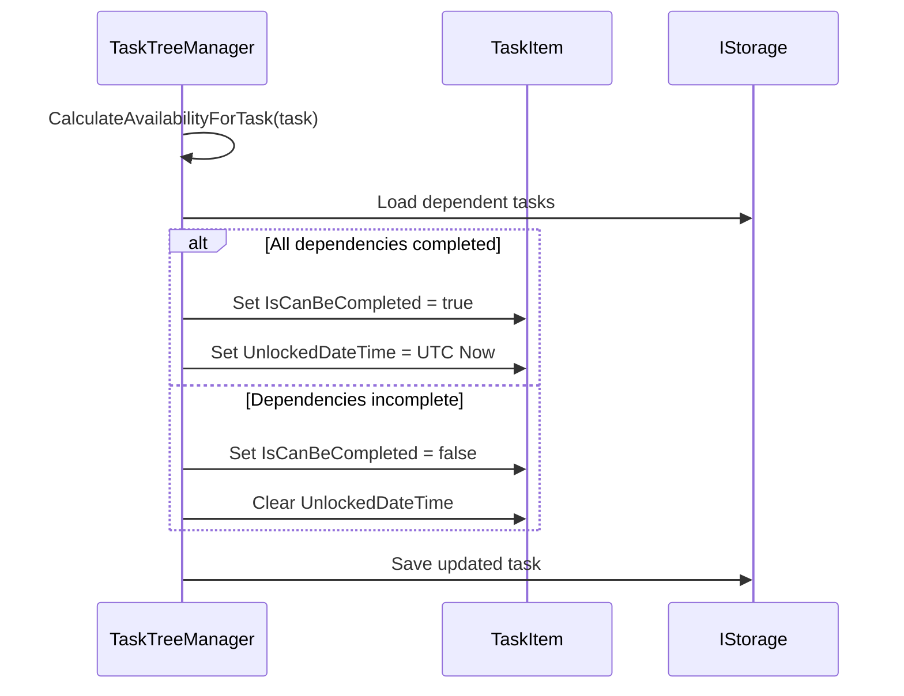
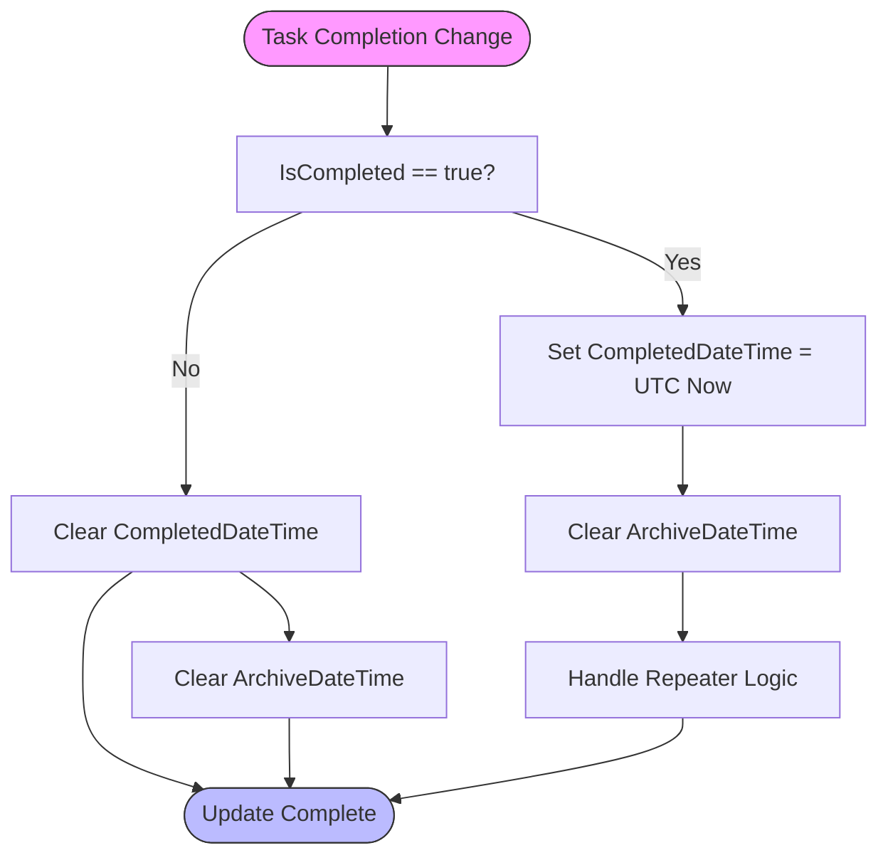
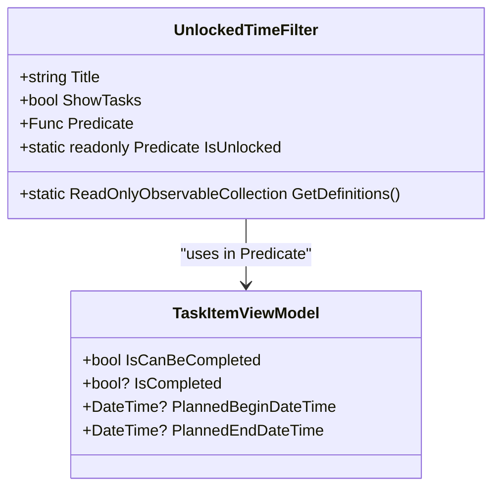
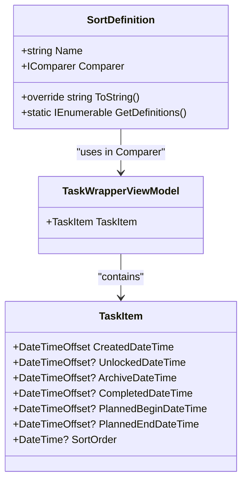
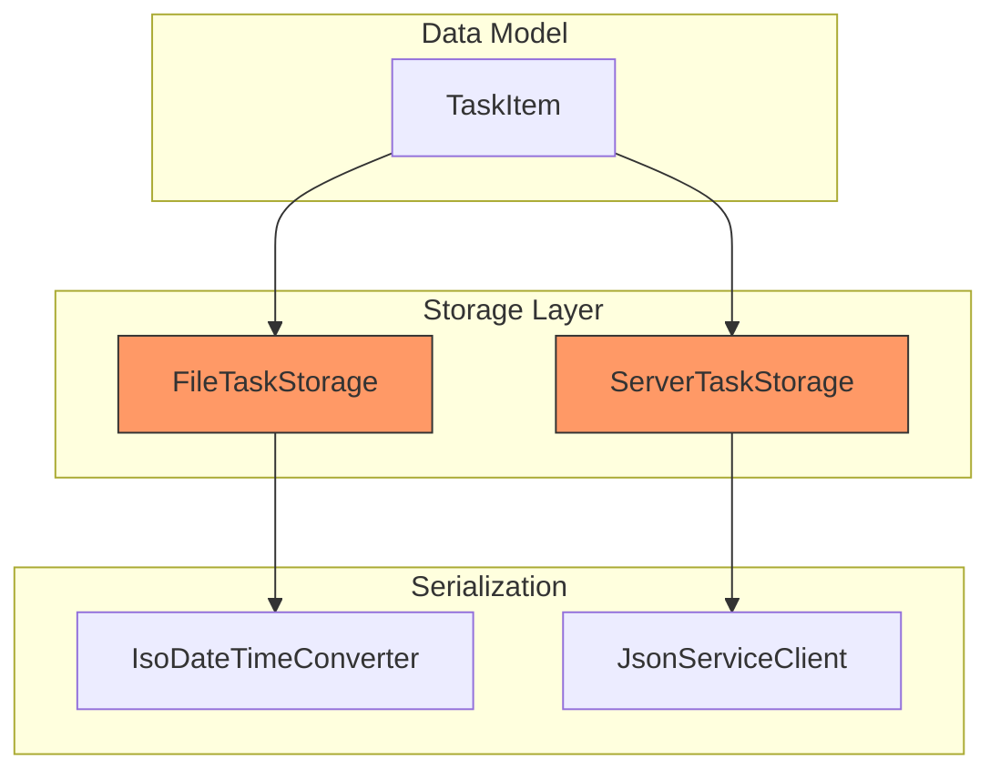

# Metadata and Timestamp Properties

<cite>
**Referenced Files in This Document**   
- [TaskItem.cs](file://src/Unlimotion.Domain/TaskItem.cs)
- [FileTaskStorage.cs](file://src/Unlimotion/FileTaskStorage.cs)
- [ServerTaskStorage.cs](file://src/Unlimotion/ServerTaskStorage.cs)
- [TaskTreeManager.cs](file://src/Unlimotion.TaskTreeManager/TaskTreeManager.cs)
- [TaskItemViewModel.cs](file://src/Unlimotion.ViewModel/TaskItemViewModel.cs)
- [UnlockedTimeFilter.cs](file://src/Unlimotion.ViewModel/UnlockedTimeFilter.cs)
- [SortDefinition.cs](file://src/Unlimotion.ViewModel/SortDefinition.cs)
</cite>

## Table of Contents
1. [Introduction](#introduction)
2. [Core Timestamp Properties](#core-timestamp-properties)
3. [Timestamp Management System](#timestamp-management-system)
4. [View Logic and Filtering](#view-logic-and-filtering)
5. [Sorting and UI Presentation](#sorting-and-ui-presentation)
6. [Time Zone Handling and Data Persistence](#time-zone-handling-and-data-persistence)
7. [Data Migration Considerations](#data-migration-considerations)
8. [Conclusion](#conclusion)

## Introduction
This document provides comprehensive documentation for the TaskItem metadata and timestamp properties in the Unlimotion task management system. The system employs a sophisticated timestamp management approach that drives view logic, roadmap visualization, and user interface behavior. The timestamp properties are automatically managed by the PlannedDurationBehavior and TaskTreeManager components, ensuring consistent state transitions across the application. This documentation covers the six key timestamp properties (CreatedDateTime, UnlockedDateTime, CompletedDateTime, ArchiveDateTime, PlannedBeginDateTime, and PlannedEndDateTime) along with the SortOrder property that influences UI presentation.

**Section sources**
- [TaskItem.cs](file://src/Unlimotion.Domain/TaskItem.cs#L1-L33)

## Core Timestamp Properties

### CreatedDateTime
The CreatedDateTime property represents the immutable creation timestamp of a task. This timestamp is automatically set when a task is first created and cannot be modified thereafter. The property is initialized to DateTimeOffset.UtcNow in the TaskItem constructor, ensuring that every task has a creation timestamp from the moment of instantiation. This timestamp serves as a permanent record of when the task entered the system and is used for chronological sorting and historical analysis.

### UnlockedDateTime
The UnlockedDateTime property represents the availability timestamp of a task, calculated based on its dependencies. This timestamp is automatically set when a task becomes available for completion (when IsCanBeCompleted transitions to true) and cleared when the task becomes blocked. The timestamp is set to DateTimeOffset.UtcNow when the task's availability changes, providing a precise record of when the task became actionable. This property drives the "Unlocked" view logic and is essential for tracking task availability over time.

### CompletedDateTime
The CompletedDateTime property captures the timestamp when a task's state changes to completed. This timestamp is automatically set when the IsCompleted property transitions from false to true. The timestamp is set to DateTimeOffset.UtcNow at the moment of completion, providing an accurate record of task completion time. This property is crucial for performance tracking, reporting, and determining task history.

### ArchiveDateTime
The ArchiveDateTime property represents the timestamp for soft-deleted tasks. When a task is archived (soft-deleted), this timestamp is set to DateTimeOffset.UtcNow, marking the exact time of archival. Unlike hard deletion, archiving preserves the task data while removing it from active views. This property enables recovery of archived tasks and maintains a complete audit trail of task lifecycle events.

### PlannedBeginDateTime and PlannedEndDateTime
These properties represent the user-defined execution window for a task. PlannedBeginDateTime indicates when the task is planned to start, while PlannedEndDateTime indicates when it should be completed. These timestamps are set by the user through the UI and are used for roadmap visualization, scheduling, and deadline tracking. They form the basis for various view filters such as "Overdue," "Urgent," and "Future" tasks.

### SortOrder
The SortOrder property serves as a sorting hint for UI presentation. It is set to DateTime.Now when a task is created or modified, providing a default chronological ordering. This property can be overridden by user-defined sorting preferences but serves as the fallback ordering mechanism when no other sorting criteria are applied.

**Section sources**
- [TaskItem.cs](file://src/Unlimotion.Domain/TaskItem.cs#L15-L27)

## Timestamp Management System

### Automatic Management by TaskTreeManager
The TaskTreeManager component is responsible for automatically managing timestamp properties based on business rules and state changes. The CalculateAndUpdateAvailability method in TaskTreeManager handles the UnlockedDateTime property by evaluating task dependencies. When a task becomes available (all contained and blocking tasks are completed), the UnlockedDateTime is set to the current UTC time. Conversely, when a task becomes blocked, the UnlockedDateTime is cleared (set to null).

**Diagram sources**
- [TaskTreeManager.cs](file://src/Unlimotion.TaskTreeManager/TaskTreeManager.cs#L662-L699)

### State Change Handling
The HandleTaskCompletionChange method in TaskTreeManager manages the CompletedDateTime and ArchiveDateTime properties when a task's completion state changes. When a task is completed (IsCompleted transitions to true), the CompletedDateTime is set to the current UTC time, and the ArchiveDateTime is cleared. This ensures that completed tasks are properly timestamped while maintaining the ability to archive them later if needed.

**Diagram sources**
- [TaskTreeManager.cs](file://src/Unlimotion.TaskTreeManager/TaskTreeManager.cs#L771-L794)

### Planned Duration Behavior
The PlannedDurationBehavior (implemented in the ViewModel layer) manages the relationship between PlannedBeginDateTime, PlannedEndDateTime, and PlannedDuration. When any of these values change, the system automatically recalculates the others to maintain consistency. For example, if the user sets a PlannedBeginDateTime and PlannedEndDateTime, the PlannedDuration is automatically calculated as the difference between these timestamps.

**Section sources**
- [TaskTreeManager.cs](file://src/Unlimotion.TaskTreeManager/TaskTreeManager.cs#L771-L794)
- [TaskItemViewModel.cs](file://src/Unlimotion.ViewModel/TaskItemViewModel.cs#L256-L285)

## View Logic and Filtering

### Unlocked View Logic
The "Unlocked" view filters tasks based on the UnlockedDateTime property and the IsCanBeCompleted flag. The UnlockedTimeFilter class defines several predicates that determine which tasks appear in different views. The IsUnlocked predicate combines IsCanBeCompleted and IsCompleted checks to show only tasks that are available but not yet completed.

**Diagram sources**
- [UnlockedTimeFilter.cs](file://src/Unlimotion.ViewModel/UnlockedTimeFilter.cs#L0-L57)

### View Filter Definitions
The system implements several view filters based on timestamp properties:

- **Unplanned**: Tasks without PlannedBeginDateTime and PlannedEndDateTime
- **Overdue**: Tasks where current date exceeds PlannedEndDateTime
- **Urgent**: Tasks where current date equals PlannedEndDateTime
- **Today**: Tasks where PlannedBeginDateTime equals current date
- **Maybe**: Tasks with various planned date conditions
- **Future**: Tasks where PlannedBeginDateTime is in the future

These filters enable users to focus on tasks relevant to their current context and priorities.

**Section sources**
- [UnlockedTimeFilter.cs](file://src/Unlimotion.ViewModel/UnlockedTimeFilter.cs#L0-L57)

## Sorting and UI Presentation

### SortOrder Implementation
The SortOrder property is used as a default sorting mechanism in the UI. When tasks are created or modified, the SortOrder is set to DateTime.Now, providing a chronological ordering. This property serves as the baseline for task presentation when no other sorting criteria are applied.

### Sorting Definitions
The SortDefinition class provides various sorting options based on timestamp properties. Users can sort tasks by different timestamp criteria, including:

- Created Ascending/Descending
- Unlocked Ascending/Descending
- Archive Ascending/Descending
- Completed Ascending/Descending
- Planned Begin Ascending/Descending
- Planned Finish Ascending/Descending

**Diagram sources**
- [SortDefinition.cs](file://src/Unlimotion.ViewModel/SortDefinition.cs#L0-L238)

The sorting system allows users to organize tasks according to their workflow preferences, with timestamp-based sorting being a primary method for chronological organization.

**Section sources**
- [SortDefinition.cs](file://src/Unlimotion.ViewModel/SortDefinition.cs#L0-L238)

## Time Zone Handling and Data Persistence

### UTC Enforcement
The system enforces UTC for all timestamp storage. The CreatedDateTime property is initialized to DateTimeOffset.UtcNow, ensuring that all creation timestamps are stored in UTC. When tasks are loaded from storage, the timestamps are preserved in their UTC form. The UI layer (TaskItemViewModel) converts these UTC timestamps to local time for display using the LocalDateTime property.

### Null vs. Default Values
The system distinguishes between null and default values for timestamp properties:
- **Null**: Indicates the timestamp has not been set or has been explicitly cleared
- **Default/Non-null**: Indicates the timestamp has been set to a specific value

For example, UnlockedDateTime is null when a task is blocked and has a DateTimeOffset value when the task is available. This distinction allows the system to differentiate between tasks that have never been unlocked and those that were previously unlocked but became blocked.

### Data Persistence in Storage Systems
Both FileTaskStorage and ServerTaskStorage handle timestamp persistence with proper formatting. The FileTaskStorage uses an IsoDateTimeConverter with the format "yyyy'-'MM'-'dd'T'HH':'mm':'ss'.'fffzzz" to ensure consistent timestamp serialization. The ServerTaskStorage uses JSON serialization through ServiceStack's JsonServiceClient, which preserves DateTimeOffset precision and timezone information.

**Diagram sources**
- [FileTaskStorage.cs](file://src/Unlimotion/FileTaskStorage.cs#L200-L210)
- [ServerTaskStorage.cs](file://src/Unlimotion/ServerTaskStorage.cs#L100-L120)

**Section sources**
- [FileTaskStorage.cs](file://src/Unlimotion/FileTaskStorage.cs#L200-L210)
- [ServerTaskStorage.cs](file://src/Unlimotion/ServerTaskStorage.cs#L100-L120)

## Data Migration Considerations

### Migration of Existing Data
When migrating existing data, special consideration must be given to timestamp properties. The FileTaskStorage includes a MigrateIsCanBeCompleted method that calculates availability for all existing tasks and updates their IsCanBeCompleted status. This migration process also sets the UnlockedDateTime for tasks that become available during the migration.

### Handling Legacy Data
For legacy data that may not have all timestamp properties set, the system follows these principles:
- CreatedDateTime defaults to DateTimeOffset.UtcNow if not present
- Other timestamp properties remain null if not explicitly set
- SortOrder defaults to DateTime.Now if not present

The JsonRepairingReader.DeserializeWithRepair method in FileTaskStorage handles corrupted or incomplete JSON data, attempting to repair and deserialize task data while preserving existing timestamp values.

### Migration Best Practices
When migrating data to the Unlimotion system:
1. Ensure all timestamps are converted to UTC before import
2. Preserve null values for timestamps that were not set in the source system
3. Set CreatedDateTime to the original creation time if available, or to the migration time if not
4. Calculate initial UnlockedDateTime based on task dependencies at migration time
5. Set SortOrder to ensure consistent initial presentation order

**Section sources**
- [FileTaskStorage.cs](file://src/Unlimotion/FileTaskStorage.cs#L100-L150)

## Conclusion
The TaskItem metadata and timestamp properties in Unlimotion provide a comprehensive system for tracking task lifecycle, availability, and planning. The automatic management of timestamps by the TaskTreeManager ensures consistent behavior across the application, while the UTC enforcement and proper null handling provide reliability and clarity. The integration of these timestamps with view logic, sorting, and filtering enables powerful task organization and visualization capabilities. Understanding the distinction between null and default values, along with proper time zone handling, is essential for maintaining data integrity during migration and ongoing use. The system's design balances automated timestamp management with user control over planning dates, creating a flexible yet robust task management framework.