# Relationship and Hierarchy Properties

<cite>
**Referenced Files in This Document**   
- [TaskItem.cs](file://src/Unlimotion.Domain/TaskItem.cs)
- [TaskTreeManager.cs](file://src/Unlimotion.TaskTreeManager/TaskTreeManager.cs)
- [ITaskTreeManager.cs](file://src/Unlimotion.TaskTreeManager/ITaskTreeManager.cs)
- [GraphControl.axaml.cs](file://src/Unlimotion/Views/GraphControl.axaml.cs)
- [MainControl.axaml.cs](file://src/Unlimotion/Views/MainControl.axaml.cs)
- [BlockEdge.cs](file://src/Unlimotion/Views/Graph/BlockEdge.cs)
- [ContainEdge.cs](file://src/Unlimotion/Views/Graph/ContainEdge.cs)
- [TaskStorageExtensions.cs](file://src/Unlimotion/TaskStorageExtensions.cs)
- [FileTaskMigrator.cs](file://src/Unlimotion/FileTaskMigrator.cs)
</cite>

## Table of Contents
1. [Introduction](#introduction)
2. [Core Relationship Properties](#core-relationship-properties)
3. [Task Tree Manager Operations](#task-tree-manager-operations)
4. [Availability Calculation and Cycle Detection](#availability-calculation-and-cycle-detection)
5. [Drag-and-Drop Operations](#drag-and-drop-operations)
6. [Graph Visualization](#graph-visualization)
7. [Relationship Validation and Integrity Checks](#relationship-validation-and-integrity-checks)
8. [Conclusion](#conclusion)

## Introduction
This document provides comprehensive documentation for the relationship and hierarchy properties in the Unlimotion task management system. The system implements a sophisticated task relationship model that supports both hierarchical containment and temporal blocking dependencies. These relationships enable complex task structures with unlimited nesting and dependency graphs, providing users with powerful tools for organizing and managing their tasks. The documentation covers the four core relationship properties (ContainsTasks, ParentTasks, BlocksTasks, and BlockedByTasks), their implementation in the TaskTreeManager, and how they are visualized in the Graph view.

## Core Relationship Properties

The TaskItem class implements four key relationship properties that define both hierarchical and dependency relationships between tasks. These properties are implemented as collections of task IDs, enabling flexible and scalable relationship management.

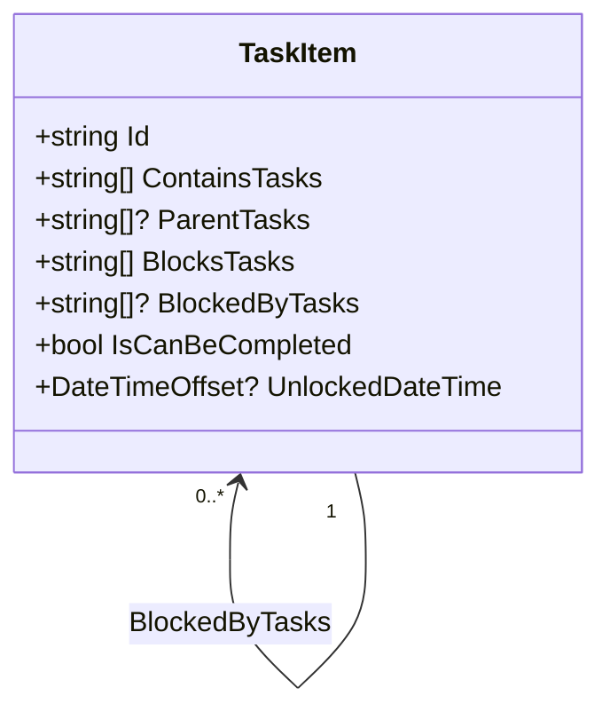
```mermaid
classDiagram
class TaskItem {
+string Id
+string[] ContainsTasks
+string[]? ParentTasks
+string[] BlocksTasks
+string[]? BlockedByTasks
+bool IsCanBeCompleted
+DateTimeOffset? UnlockedDateTime
}
TaskItem "1" *-- "0..*" TaskItem : ContainsTasks
TaskItem "0..*" --* "1" TaskItem : ParentTasks
TaskItem "1" --> "0..*" TaskItem : BlocksTasks
TaskItem "0..*" <-- "1" TaskItem : BlockedByTasks
```

**Diagram sources**
- [TaskItem.cs](file://src/Unlimotion.Domain/TaskItem.cs#L20-L23)

**Section sources**
- [TaskItem.cs](file://src/Unlimotion.Domain/TaskItem.cs#L20-L23)

### Containment Relationships (Hierarchical)

The containment relationships establish a parent-child hierarchy between tasks, enabling unlimited nesting and organizational structure.

#### ContainsTasks (Child Tasks)
The `ContainsTasks` property is a list of task IDs that represents the child tasks contained within the current task. This property defines the outbound containment relationship, indicating which tasks are children of the current task.

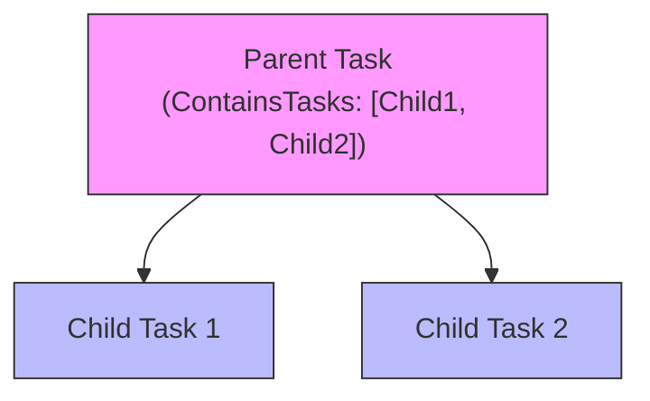
```mermaid
flowchart TD
ParentTask["Parent Task\n(ContainsTasks: [Child1, Child2])"] --> Child1["Child Task 1"]
ParentTask --> Child2["Child Task 2"]
style ParentTask fill:#f9f,stroke:#333
style Child1 fill:#bbf,stroke:#333
style Child2 fill:#bbf,stroke:#333
```

**Diagram sources**
- [TaskItem.cs](file://src/Unlimotion.Domain/TaskItem.cs#L20)

#### ParentTasks (Parent References)
The `ParentTasks` property is a nullable list of task IDs that represents the parent tasks of the current task. This property enables multiple inheritance, allowing a task to have multiple parents simultaneously.

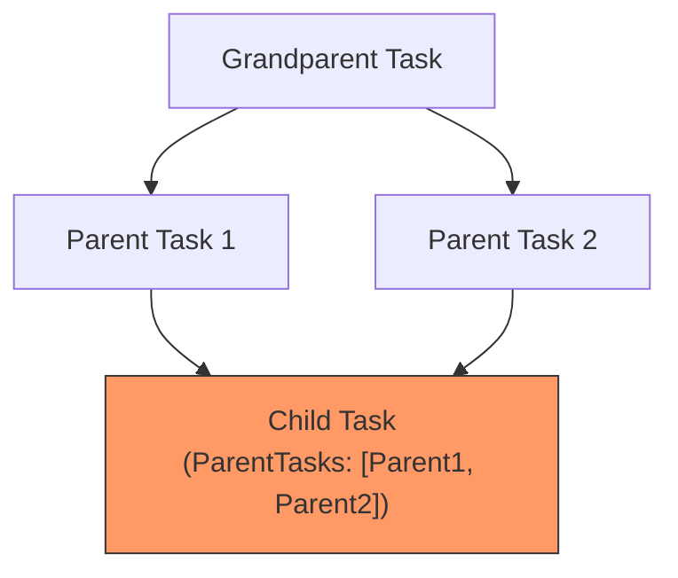
```mermaid
flowchart TD
Grandparent["Grandparent Task"]
Parent1["Parent Task 1"]
Parent2["Parent Task 2"]
Child["Child Task\n(ParentTasks: [Parent1, Parent2])"]
Grandparent --> Parent1
Grandparent --> Parent2
Parent1 --> Child
Parent2 --> Child
style Child fill:#f96,stroke:#333
```

**Diagram sources**
- [TaskItem.cs](file://src/Unlimotion.Domain/TaskItem.cs#L21)

### Blocking Relationships (Temporal Dependencies)

The blocking relationships establish temporal dependencies between tasks, determining task availability based on completion status.

#### BlocksTasks (Outbound Dependencies)
The `BlocksTasks` property is a list of task IDs that represents tasks blocked by the current task. When the current task is not completed, all tasks in this list cannot be completed.

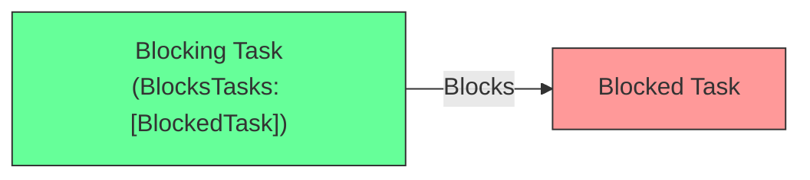
```mermaid
flowchart LR
BlockingTask["Blocking Task\n(BlocksTasks: [BlockedTask])"] --> |Blocks| BlockedTask["Blocked Task"]
style BlockingTask fill:#6f9,stroke:#333
style BlockedTask fill:#f99,stroke:#333
```

**Diagram sources**
- [TaskItem.cs](file://src/Unlimotion.Domain/TaskItem.cs#L22)

#### BlockedByTasks (Inbound Dependencies)
The `BlockedByTasks` property is a nullable list of task IDs that represents tasks that block the current task. The current task cannot be completed until all tasks in this list are completed.

```mermaid
flowchart RL
BlockedTask["Blocked Task\n(BlockedByTasks: [BlockingTask])"] <--|Blocked by| BlockingTask["Blocking Task"]
style BlockedTask fill:#f99,stroke:#333
style BlockingTask fill:#6f9,stroke:#333
```

**Diagram sources**
- [TaskItem.cs](file://src/Unlimotion.Domain/TaskItem.cs#L23)

## Task Tree Manager Operations

The TaskTreeManager class provides the core operations for managing task relationships, ensuring data integrity and proper availability calculations.

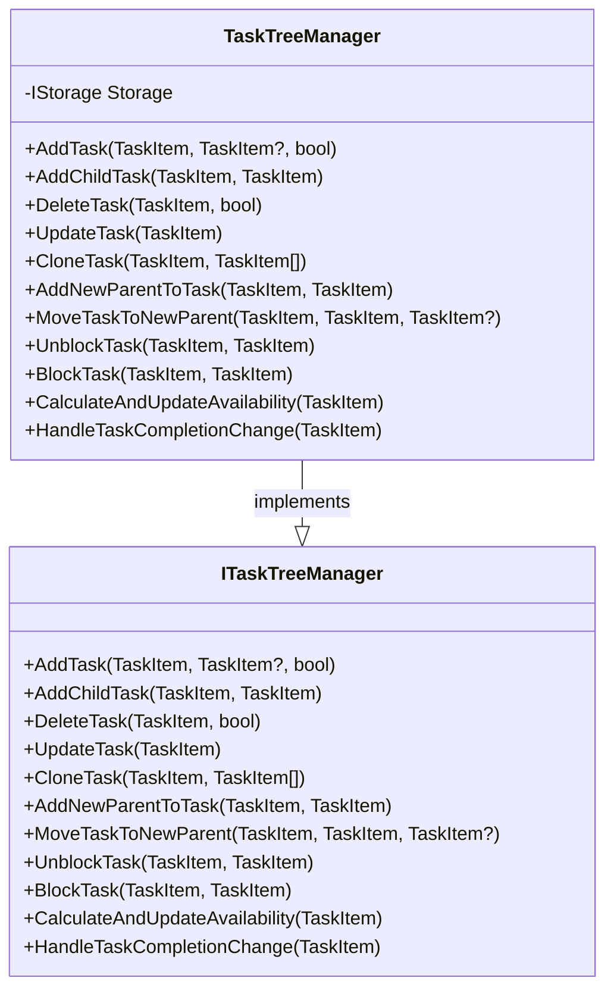
```mermaid
classDiagram
class ITaskTreeManager {
+AddTask(TaskItem, TaskItem?, bool)
+AddChildTask(TaskItem, TaskItem)
+DeleteTask(TaskItem, bool)
+UpdateTask(TaskItem)
+CloneTask(TaskItem, TaskItem[])
+AddNewParentToTask(TaskItem, TaskItem)
+MoveTaskToNewParent(TaskItem, TaskItem, TaskItem?)
+UnblockTask(TaskItem, TaskItem)
+BlockTask(TaskItem, TaskItem)
+CalculateAndUpdateAvailability(TaskItem)
+HandleTaskCompletionChange(TaskItem)
}
class TaskTreeManager {
-IStorage Storage
+AddTask(TaskItem, TaskItem?, bool)
+AddChildTask(TaskItem, TaskItem)
+DeleteTask(TaskItem, bool)
+UpdateTask(TaskItem)
+CloneTask(TaskItem, TaskItem[])
+AddNewParentToTask(TaskItem, TaskItem)
+MoveTaskToNewParent(TaskItem, TaskItem, TaskItem?)
+UnblockTask(TaskItem, TaskItem)
+BlockTask(TaskItem, TaskItem)
+CalculateAndUpdateAvailability(TaskItem)
+HandleTaskCompletionChange(TaskItem)
}
TaskTreeManager --|> ITaskTreeManager : implements
```

**Diagram sources**
- [ITaskTreeManager.cs](file://src/Unlimotion.TaskTreeManager/ITaskTreeManager.cs#L4-L42)
- [TaskTreeManager.cs](file://src/Unlimotion.TaskTreeManager/TaskTreeManager.cs#L10-L12)

**Section sources**
- [ITaskTreeManager.cs](file://src/Unlimotion.TaskTreeManager/ITaskTreeManager.cs#L4-L42)
- [TaskTreeManager.cs](file://src/Unlimotion.TaskTreeManager/TaskTreeManager.cs#L10-L12)

### Create Parent-Child Relation
The `CreateParentChildRelation` method establishes a hierarchical relationship between two tasks, updating both the parent's ContainsTasks and the child's ParentTasks collections.

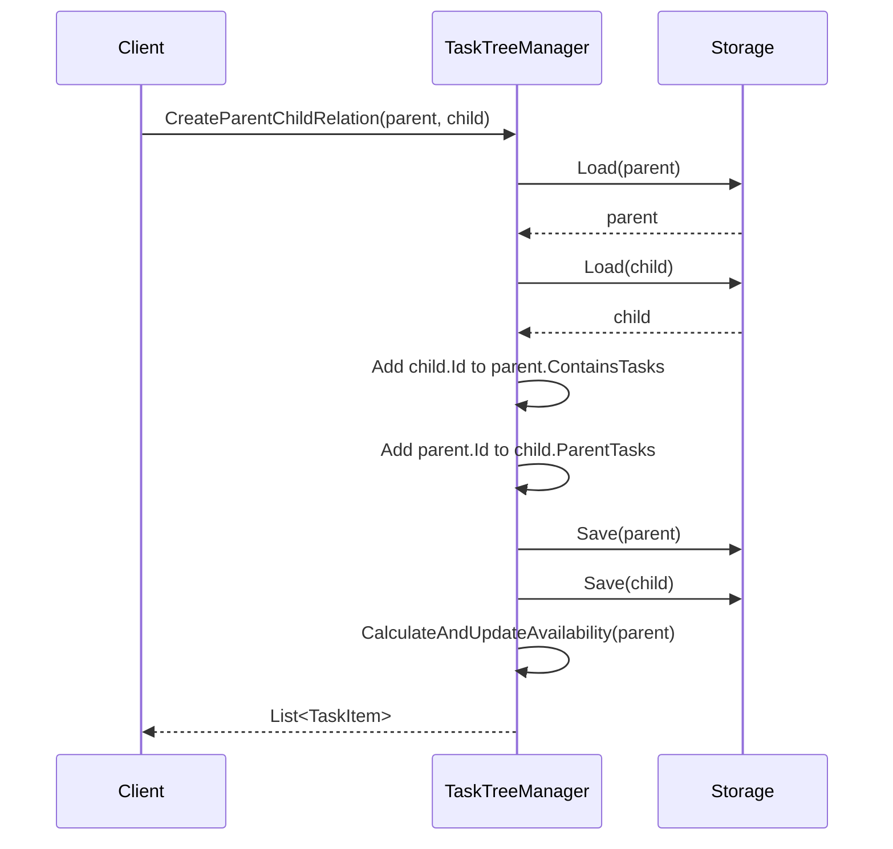
```mermaid
sequenceDiagram
participant Client
participant TaskTreeManager
participant Storage
Client->>TaskTreeManager : CreateParentChildRelation(parent, child)
TaskTreeManager->>Storage : Load(parent)
Storage-->>TaskTreeManager : parent
TaskTreeManager->>Storage : Load(child)
Storage-->>TaskTreeManager : child
TaskTreeManager->>TaskTreeManager : Add child.Id to parent.ContainsTasks
TaskTreeManager->>TaskTreeManager : Add parent.Id to child.ParentTasks
TaskTreeManager->>Storage : Save(parent)
TaskTreeManager->>Storage : Save(child)
TaskTreeManager->>TaskTreeManager : CalculateAndUpdateAvailability(parent)
TaskTreeManager-->>Client : List<TaskItem>
```

**Diagram sources**
- [TaskTreeManager.cs](file://src/Unlimotion.TaskTreeManager/TaskTreeManager.cs#L460-L500)

### Break Parent-Child Relation
The `BreakParentChildRelation` method removes a hierarchical relationship between two tasks, updating both the parent's ContainsTasks and the child's ParentTasks collections.

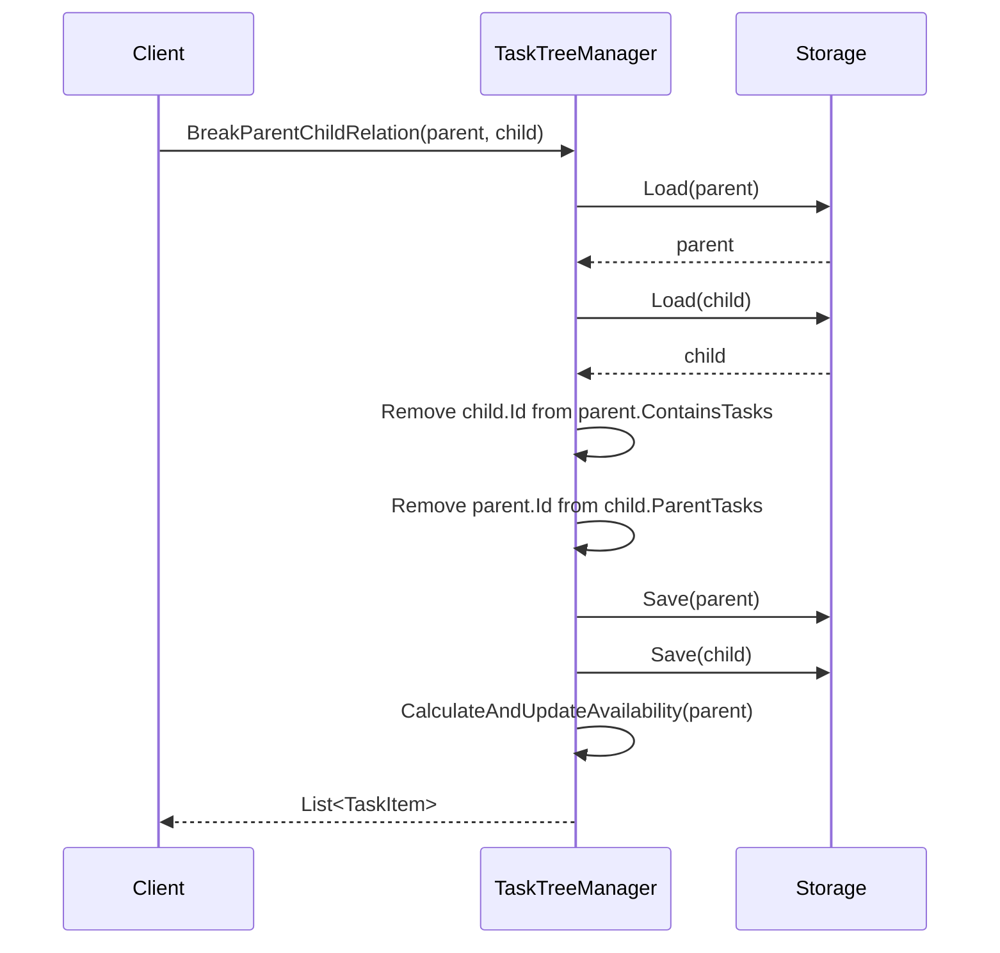
```mermaid
sequenceDiagram
participant Client
participant TaskTreeManager
participant Storage
Client->>TaskTreeManager : BreakParentChildRelation(parent, child)
TaskTreeManager->>Storage : Load(parent)
Storage-->>TaskTreeManager : parent
TaskTreeManager->>Storage : Load(child)
Storage-->>TaskTreeManager : child
TaskTreeManager->>TaskTreeManager : Remove child.Id from parent.ContainsTasks
TaskTreeManager->>TaskTreeManager : Remove parent.Id from child.ParentTasks
TaskTreeManager->>Storage : Save(parent)
TaskTreeManager->>Storage : Save(child)
TaskTreeManager->>TaskTreeManager : CalculateAndUpdateAvailability(parent)
TaskTreeManager-->>Client : List<TaskItem>
```

**Diagram sources**
- [TaskTreeManager.cs](file://src/Unlimotion.TaskTreeManager/TaskTreeManager.cs#L420-L459)

### Create Blocking-BlockedBy Relation
The `CreateBlockingBlockedByRelation` method establishes a temporal dependency between two tasks, where one task blocks another from being completed.

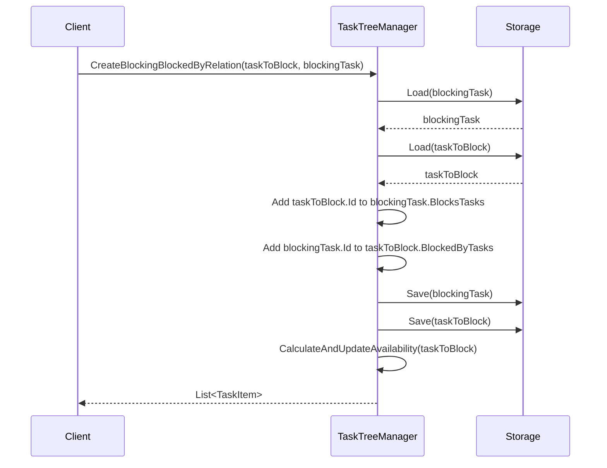
```mermaid
sequenceDiagram
participant Client
participant TaskTreeManager
participant Storage
Client->>TaskTreeManager : CreateBlockingBlockedByRelation(taskToBlock, blockingTask)
TaskTreeManager->>Storage : Load(blockingTask)
Storage-->>TaskTreeManager : blockingTask
TaskTreeManager->>Storage : Load(taskToBlock)
Storage-->>TaskTreeManager : taskToBlock
TaskTreeManager->>TaskTreeManager : Add taskToBlock.Id to blockingTask.BlocksTasks
TaskTreeManager->>TaskTreeManager : Add blockingTask.Id to taskToBlock.BlockedByTasks
TaskTreeManager->>Storage : Save(blockingTask)
TaskTreeManager->>Storage : Save(taskToBlock)
TaskTreeManager->>TaskTreeManager : CalculateAndUpdateAvailability(taskToBlock)
TaskTreeManager-->>Client : List<TaskItem>
```

**Diagram sources**
- [TaskTreeManager.cs](file://src/Unlimotion.TaskTreeManager/TaskTreeManager.cs#L528-L567)

### Break Blocking-BlockedBy Relation
The `BreakBlockingBlockedByRelation` method removes a temporal dependency between two tasks, unblocking a previously blocked task.

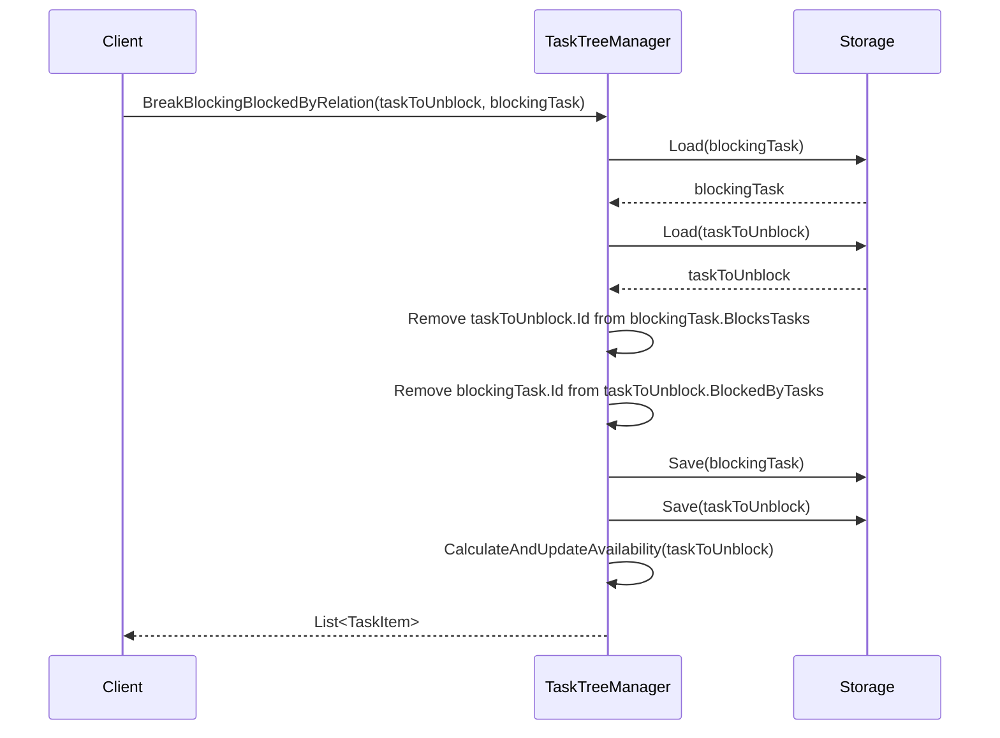
```mermaid
sequenceDiagram
participant Client
participant TaskTreeManager
participant Storage
Client->>TaskTreeManager : BreakBlockingBlockedByRelation(taskToUnblock, blockingTask)
TaskTreeManager->>Storage : Load(blockingTask)
Storage-->>TaskTreeManager : blockingTask
TaskTreeManager->>Storage : Load(taskToUnblock)
Storage-->>TaskTreeManager : taskToUnblock
TaskTreeManager->>TaskTreeManager : Remove taskToUnblock.Id from blockingTask.BlocksTasks
TaskTreeManager->>TaskTreeManager : Remove blockingTask.Id from taskToUnblock.BlockedByTasks
TaskTreeManager->>Storage : Save(blockingTask)
TaskTreeManager->>Storage : Save(taskToUnblock)
TaskTreeManager->>TaskTreeManager : CalculateAndUpdateAvailability(taskToUnblock)
TaskTreeManager-->>Client : List<TaskItem>
```

**Diagram sources**
- [TaskTreeManager.cs](file://src/Unlimotion.TaskTreeManager/TaskTreeManager.cs#L568-L607)

## Availability Calculation and Cycle Detection

The system implements sophisticated availability calculations that determine when tasks can be completed based on their relationships and dependencies.

### Availability Business Rules
A task can be completed when:
1. **All contained tasks are completed** (IsCompleted != false)
2. **All blocking tasks are completed** (IsCompleted != false)

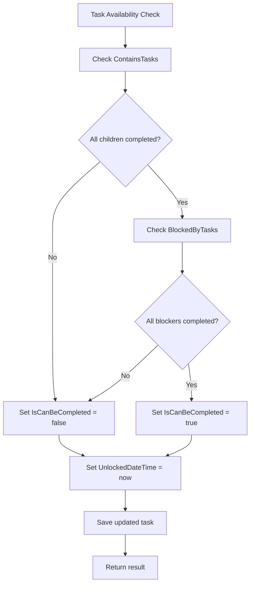
```mermaid
flowchart TD
Start["Task Availability Check"] --> CheckChildren["Check ContainsTasks"]
CheckChildren --> AllChildrenCompleted{"All children completed?"}
AllChildrenCompleted --> |No| NotAvailable["Set IsCanBeCompleted = false"]
AllChildrenCompleted --> |Yes| CheckBlockers["Check BlockedByTasks"]
CheckBlockers --> AllBlockersCompleted{"All blockers completed?"}
AllBlockersCompleted --> |No| NotAvailable
AllBlockersCompleted --> |Yes| Available["Set IsCanBeCompleted = true"]
NotAvailable --> UpdateUnlocked["Set UnlockedDateTime = null"]
Available --> UpdateUnlocked["Set UnlockedDateTime = now"]
UpdateUnlocked --> SaveTask["Save updated task"]
SaveTask --> End["Return result"]
```

**Diagram sources**
- [TaskTreeManager.cs](file://src/Unlimotion.TaskTreeManager/TaskTreeManager.cs#L680-L740)

**Section sources**
- [TaskTreeManager.cs](file://src/Unlimotion.TaskTreeManager/TaskTreeManager.cs#L680-L740)

### Calculate Availability for Task
The `CalculateAvailabilityForTask` method evaluates a task's completion eligibility based on its relationships.

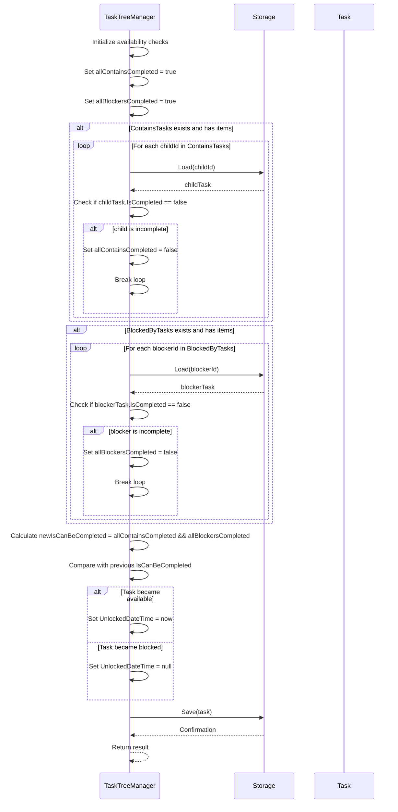
```mermaid
sequenceDiagram
participant TaskTreeManager
participant Storage
participant Task
TaskTreeManager->>TaskTreeManager : Initialize availability checks
TaskTreeManager->>TaskTreeManager : Set allContainsCompleted = true
TaskTreeManager->>TaskTreeManager : Set allBlockersCompleted = true
alt ContainsTasks exists and has items
loop For each childId in ContainsTasks
TaskTreeManager->>Storage : Load(childId)
Storage-->>TaskTreeManager : childTask
TaskTreeManager->>TaskTreeManager : Check if childTask.IsCompleted == false
alt child is incomplete
TaskTreeManager->>TaskTreeManager : Set allContainsCompleted = false
TaskTreeManager->>TaskTreeManager : Break loop
end
end
end
alt BlockedByTasks exists and has items
loop For each blockerId in BlockedByTasks
TaskTreeManager->>Storage : Load(blockerId)
Storage-->>TaskTreeManager : blockerTask
TaskTreeManager->>TaskTreeManager : Check if blockerTask.IsCompleted == false
alt blocker is incomplete
TaskTreeManager->>TaskTreeManager : Set allBlockersCompleted = false
TaskTreeManager->>TaskTreeManager : Break loop
end
end
end
TaskTreeManager->>TaskTreeManager : Calculate newIsCanBeCompleted = allContainsCompleted && allBlockersCompleted
TaskTreeManager->>TaskTreeManager : Compare with previous IsCanBeCompleted
alt Task became available
TaskTreeManager->>TaskTreeManager : Set UnlockedDateTime = now
else Task became blocked
TaskTreeManager->>TaskTreeManager : Set UnlockedDateTime = null
end
TaskTreeManager->>Storage : Save(task)
Storage-->>TaskTreeManager : Confirmation
TaskTreeManager-->>TaskTreeManager : Return result
```

**Diagram sources**
- [TaskTreeManager.cs](file://src/Unlimotion.TaskTreeManager/TaskTreeManager.cs#L680-L740)

### Get Affected Tasks
The `GetAffectedTasks` method identifies all tasks whose availability might be impacted by changes to a given task.

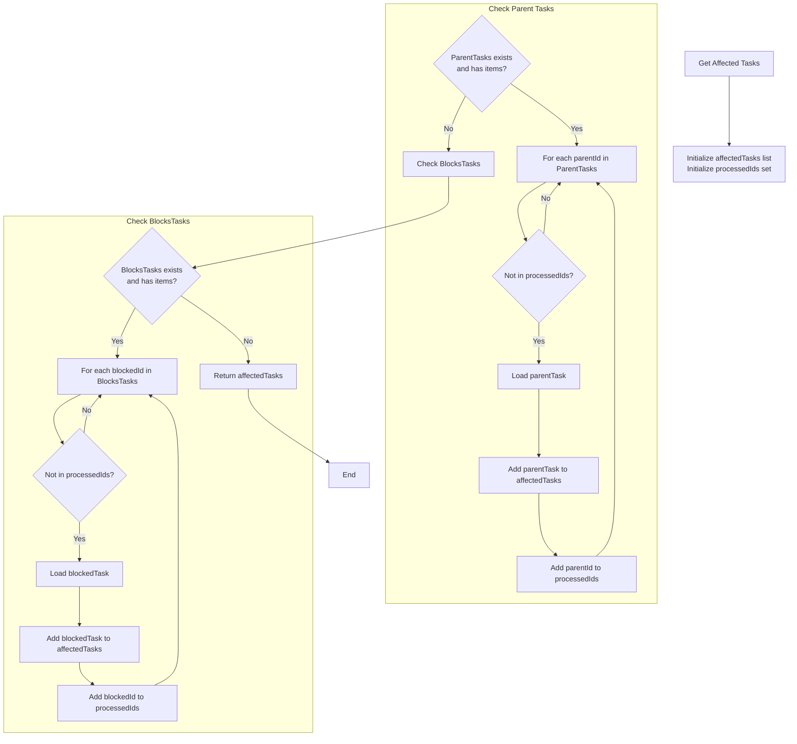
```mermaid
flowchart TD
Start["Get Affected Tasks"] --> Initialize["Initialize affectedTasks list<br/>Initialize processedIds set"]
subgraph ParentTasksCheck["Check Parent Tasks"]
direction LR
ParentExists{"ParentTasks exists<br/>and has items?"}
ParentExists --> |Yes| LoopParents["For each parentId in ParentTasks"]
LoopParents --> NotProcessed{"Not in processedIds?"}
NotProcessed --> |Yes| LoadParent["Load parentTask"]
LoadParent --> AddParent["Add parentTask to affectedTasks"]
AddParent --> AddToProcessed["Add parentId to processedIds"]
AddToProcessed --> LoopParents
NotProcessed --> |No| LoopParents
ParentExists --> |No| CheckBlocks["Check BlocksTasks"]
end
subgraph BlocksTasksCheck["Check BlocksTasks"]
direction LR
BlocksExists{"BlocksTasks exists<br/>and has items?"}
BlocksExists --> |Yes| LoopBlocked["For each blockedId in BlocksTasks"]
LoopBlocked --> NotProcessed2{"Not in processedIds?"}
NotProcessed2 --> |Yes| LoadBlocked["Load blockedTask"]
LoadBlocked --> AddBlocked["Add blockedTask to affectedTasks"]
AddBlocked --> AddToProcessed2["Add blockedId to processedIds"]
AddToProcessed2 --> LoopBlocked
NotProcessed2 --> |No| LoopBlocked
BlocksExists --> |No| Return["Return affectedTasks"]
end
CheckBlocks --> BlocksExists
Return --> End["End"]
```

**Diagram sources**
- [TaskTreeManager.cs](file://src/Unlimotion.TaskTreeManager/TaskTreeManager.cs#L742-L780)

## Drag-and-Drop Operations

The system supports intuitive drag-and-drop operations for managing task relationships, with different keyboard modifiers enabling different relationship types.

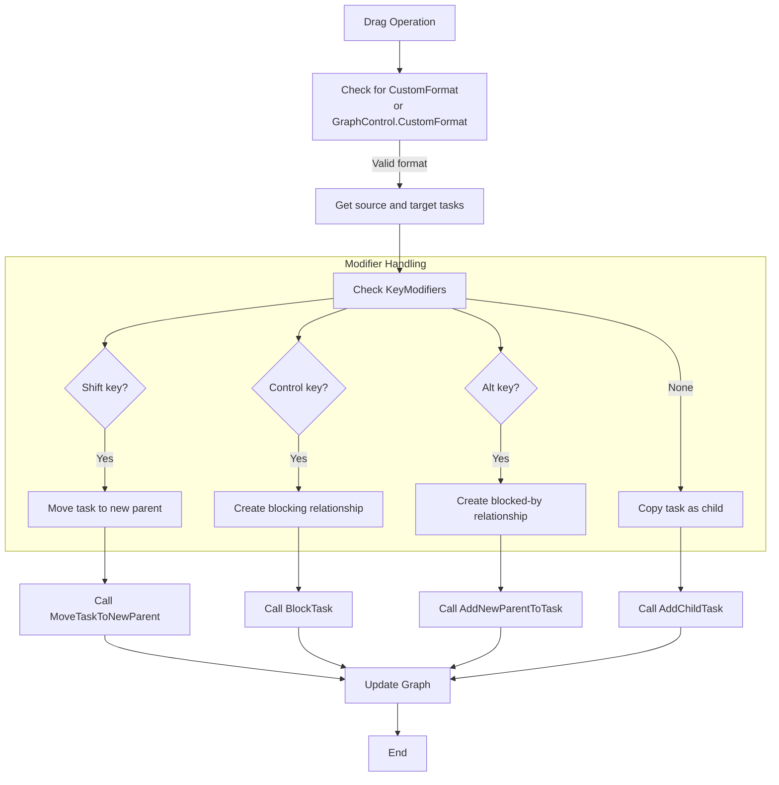
```mermaid
flowchart TD
Start["Drag Operation"] --> CheckFormat["Check for CustomFormat<br/>or GraphControl.CustomFormat"]
CheckFormat --> |Valid format| GetTasks["Get source and target tasks"]
GetTasks --> CheckModifiers["Check KeyModifiers"]
subgraph ModifierHandling["Modifier Handling"]
direction TB
CheckModifiers --> Shift{"Shift key?"}
Shift --> |Yes| Move["Move task to new parent"]
CheckModifiers --> Ctrl{"Control key?"}
Ctrl --> |Yes| Block["Create blocking relationship"]
CheckModifiers --> Alt{"Alt key?"}
Alt --> |Yes| BlockedBy["Create blocked-by relationship"]
CheckModifiers --> |None| Copy["Copy task as child"]
end
Move --> MoveOperation["Call MoveTaskToNewParent"]
Block --> BlockOperation["Call BlockTask"]
BlockedBy --> BlockedByOperation["Call AddNewParentToTask"]
Copy --> CopyOperation["Call AddChildTask"]
MoveOperation --> UpdateGraph["Update Graph"]
BlockOperation --> UpdateGraph
BlockedByOperation --> UpdateGraph
CopyOperation --> UpdateGraph
UpdateGraph --> End["End"]
```

**Diagram sources**
- [MainControl.axaml.cs](file://src/Unlimotion/Views/MainControl.axaml.cs#L150-L250)

**Section sources**
- [MainControl.axaml.cs](file://src/Unlimotion/Views/MainControl.axaml.cs#L150-L250)

### DragOver Event Handling
The `DragOver` method determines the allowed drag effects based on keyboard modifiers and task relationships.

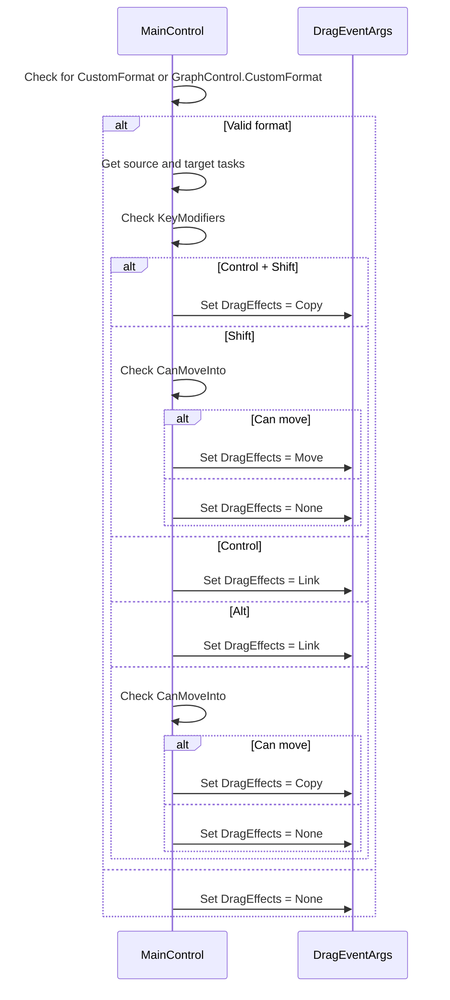
```mermaid
sequenceDiagram
participant MainControl
participant e as DragEventArgs
MainControl->>MainControl : Check for CustomFormat or GraphControl.CustomFormat
alt Valid format
MainControl->>MainControl : Get source and target tasks
MainControl->>MainControl : Check KeyModifiers
alt Control + Shift
MainControl->>e : Set DragEffects = Copy
else Shift
MainControl->>MainControl : Check CanMoveInto
alt Can move
MainControl->>e : Set DragEffects = Move
else
MainControl->>e : Set DragEffects = None
end
else Control
MainControl->>e : Set DragEffects = Link
else Alt
MainControl->>e : Set DragEffects = Link
else
MainControl->>MainControl : Check CanMoveInto
alt Can move
MainControl->>e : Set DragEffects = Copy
else
MainControl->>e : Set DragEffects = None
end
end
else
MainControl->>e : Set DragEffects = None
end
```

**Diagram sources**
- [MainControl.axaml.cs](file://src/Unlimotion/Views/MainControl.axaml.cs#L100-L149)

### Drop Event Handling
The `Drop` method executes the appropriate relationship operation based on keyboard modifiers.

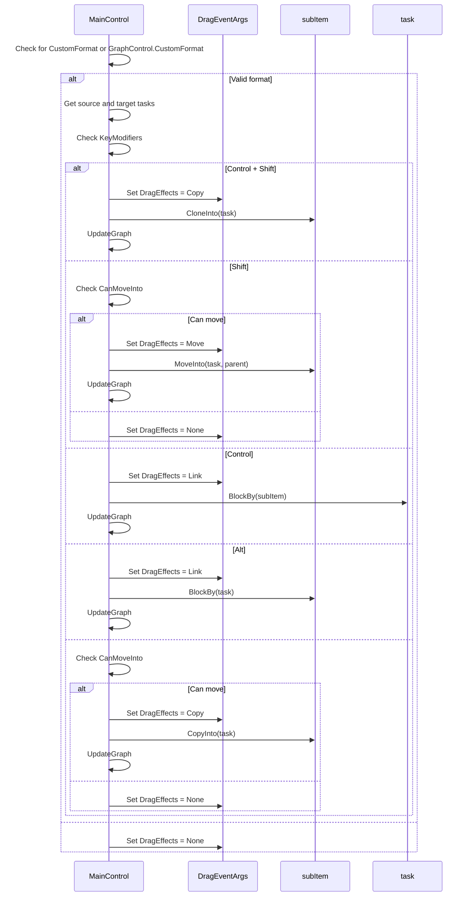
```mermaid
sequenceDiagram
participant MainControl
participant e as DragEventArgs
MainControl->>MainControl : Check for CustomFormat or GraphControl.CustomFormat
alt Valid format
MainControl->>MainControl : Get source and target tasks
MainControl->>MainControl : Check KeyModifiers
alt Control + Shift
MainControl->>e : Set DragEffects = Copy
MainControl->>subItem : CloneInto(task)
MainControl->>MainControl : UpdateGraph
else Shift
MainControl->>MainControl : Check CanMoveInto
alt Can move
MainControl->>e : Set DragEffects = Move
MainControl->>subItem : MoveInto(task, parent)
MainControl->>MainControl : UpdateGraph
else
MainControl->>e : Set DragEffects = None
end
else Control
MainControl->>e : Set DragEffects = Link
MainControl->>task : BlockBy(subItem)
MainControl->>MainControl : UpdateGraph
else Alt
MainControl->>e : Set DragEffects = Link
MainControl->>subItem : BlockBy(task)
MainControl->>MainControl : UpdateGraph
else
MainControl->>MainControl : Check CanMoveInto
alt Can move
MainControl->>e : Set DragEffects = Copy
MainControl->>subItem : CopyInto(task)
MainControl->>MainControl : UpdateGraph
else
MainControl->>e : Set DragEffects = None
end
end
else
MainControl->>e : Set DragEffects = None
end
```

**Diagram sources**
- [MainControl.axaml.cs](file://src/Unlimotion/Views/MainControl.axaml.cs#L150-L250)

## Graph Visualization

The system provides a visual representation of task relationships through the Graph view, using different edge types to distinguish between containment and blocking relationships.

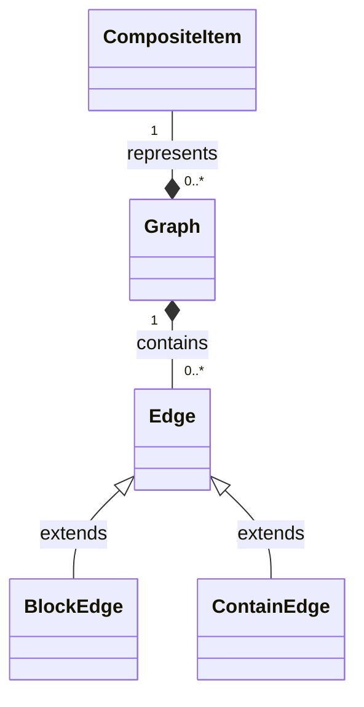
```mermaid
classDiagram
class Graph
class Edge
class BlockEdge
class ContainEdge
class CompositeItem
Graph "1" *-- "0..*" Edge : contains
Edge <|-- BlockEdge : extends
Edge <|-- ContainEdge : extends
CompositeItem "1" --* "0..*" Graph : represents
```

**Diagram sources**
- [GraphControl.axaml.cs](file://src/Unlimotion/Views/GraphControl.axaml.cs#L100-L180)
- [BlockEdge.cs](file://src/Unlimotion/Views/Graph/BlockEdge.cs#L4-L9)
- [ContainEdge.cs](file://src/Unlimotion/Views/Graph/ContainEdge.cs#L4-L11)
- [CompositeItem.cs](file://src/Unlimotion/Views/Graph/CompositeItem.cs#L3-L8)

**Section sources**
- [GraphControl.axaml.cs](file://src/Unlimotion/Views/GraphControl.axaml.cs#L100-L180)
- [BlockEdge.cs](file://src/Unlimotion/Views/Graph/BlockEdge.cs#L4-L9)
- [ContainEdge.cs](file://src/Unlimotion/Views/Graph/ContainEdge.cs#L4-L11)
- [CompositeItem.cs](file://src/Unlimotion/Views/Graph/CompositeItem.cs#L3-L8)

### Build From Tasks
The `BuildFromTasks` method constructs the visual graph representation from the task data.

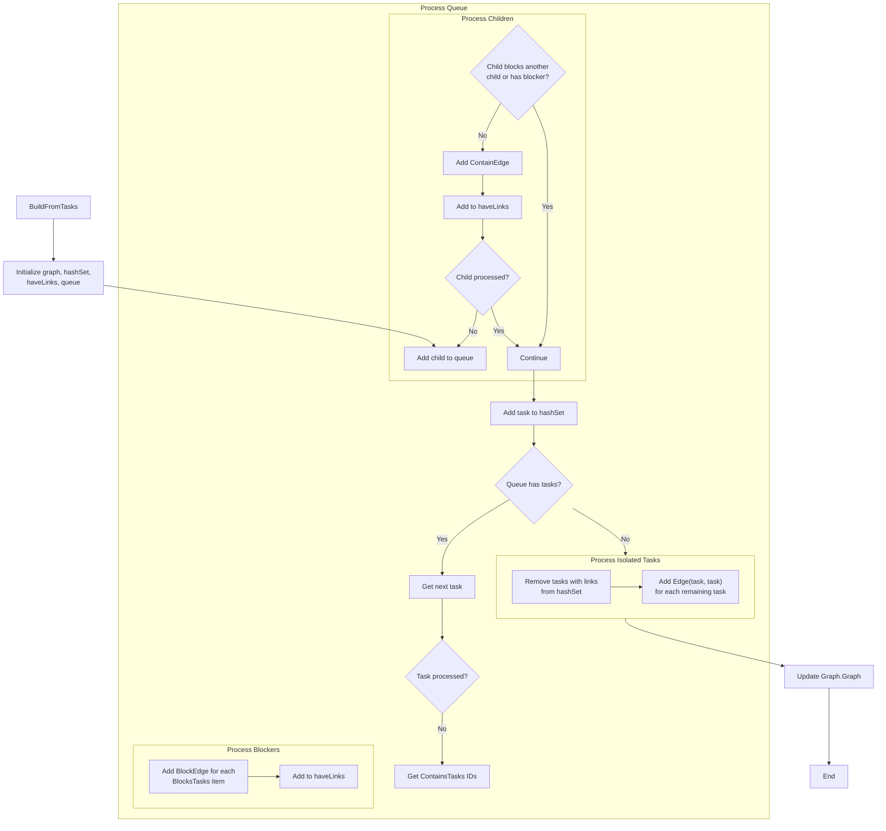
```mermaid
flowchart TD
Start["BuildFromTasks"] --> Initialize["Initialize graph, hashSet,<br/>haveLinks, queue"]
Initialize --> Enqueue["Add all tasks to queue"]
subgraph ProcessQueue["Process Queue"]
direction TB
Dequeue{"Queue has tasks?"}
Dequeue --> |Yes| GetTask["Get next task"]
GetTask --> CheckProcessed{"Task processed?"}
CheckProcessed --> |No| GetChildIds["Get ContainsTasks IDs"]
subgraph ProcessChildren["Process Children"]
direction LR
CheckChildBlocks{"Child blocks another<br/>child or has blocker?"}
CheckChildBlocks --> |No| AddContainEdge["Add ContainEdge"]
AddContainEdge --> AddToLinks["Add to haveLinks"]
AddToLinks --> EnqueueChild{"Child processed?"}
EnqueueChild --> |No| Enqueue["Add child to queue"]
EnqueueChild --> |Yes| Continue
CheckChildBlocks --> |Yes| Continue
end
subgraph ProcessBlockers["Process Blockers"]
direction LR
AddBlockEdge["Add BlockEdge for each<br/>BlocksTasks item"]
AddBlockEdge --> AddToLinks2["Add to haveLinks"]
end
Continue --> AddToHash["Add task to hashSet"]
AddToHash --> Dequeue
Dequeue --> |No| ProcessIsolated["Process isolated tasks"]
end
subgraph ProcessIsolated["Process Isolated Tasks"]
direction LR
RemoveLinked["Remove tasks with links<br/>from hashSet"]
RemoveLinked --> AddSelfEdges["Add Edge(task, task)<br/>for each remaining task"]
end
ProcessIsolated --> UpdateUI["Update Graph.Graph"]
UpdateUI --> End["End"]
```

**Diagram sources**
- [GraphControl.axaml.cs](file://src/Unlimotion/Views/GraphControl.axaml.cs#L100-L180)

## Relationship Validation and Integrity Checks

The system includes comprehensive validation and integrity checks to maintain data consistency and prevent relationship cycles.

### CompositeItem Usage
The CompositeItem class is used in the Graph view to represent composite elements, though it doesn't directly participate in relationship validation.

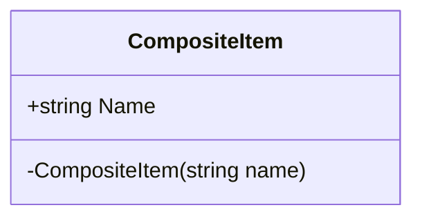
```mermaid
classDiagram
class CompositeItem {
+string Name
-CompositeItem(string name)
}
```

**Diagram sources**
- [CompositeItem.cs](file://src/Unlimotion/Views/Graph/CompositeItem.cs#L3-L8)

### TaskStorageExtensions
The TaskStorageExtensions class provides methods for identifying root tasks in the hierarchy.

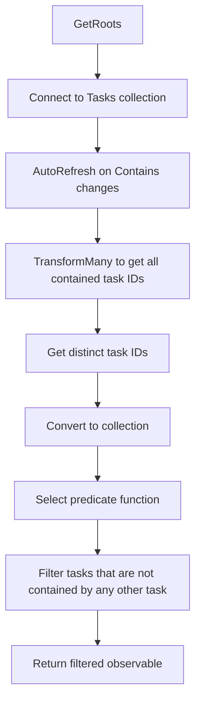
```mermaid
flowchart TD
Start["GetRoots"] --> ConnectTasks["Connect to Tasks collection"]
ConnectTasks --> AutoRefresh["AutoRefresh on Contains changes"]
AutoRefresh --> TransformMany["TransformMany to get all contained task IDs"]
TransformMany --> Distinct["Get distinct task IDs"]
Distinct --> ToCollection["Convert to collection"]
ToCollection --> Select["Select predicate function"]
Select --> FilterTasks["Filter tasks that are not contained by any other task"]
FilterTasks --> Return["Return filtered observable"]
```

**Diagram sources**
- [TaskStorageExtensions.cs](file://src/Unlimotion/TaskStorageExtensions.cs#L10-L34)

### FileTaskMigrator Integrity Checks
The FileTaskMigrator class includes integrity checks for task relationships during migration.

```mermaid
flowchart TD
Start["FileTaskMigrator"] --> Pass1["Pass 1: Read tasks and children"]
subgraph Pass1["Pass 1: Read Tasks"]
direction TB
ReadTask["Read each task file"]
ReadTask --> GetChildren["Get ContainsTasks"]
GetChildren --> CheckSelfLink["Check for self-links"]
CheckSelfLink --> |Self-link found| AddIssue["Add SelfLinkRemoved issue"]
CheckSelfLink --> |Valid| StoreChildren["Store children in linkInfo"]
end
Pass1 --> Pass2["Pass 2: Calculate Parents"]
subgraph Pass2["Pass 2: Calculate Parents"]
direction TB
InitializeParents["Initialize Parents dictionary"]
InitializeParents --> ProcessChildren["For each parent-child relationship"]
ProcessChildren --> AddParent["Add parent to child's Parents set"]
end
Pass2 --> Pass3["Pass 3: Update tasks"]
subgraph Pass3["Pass 3: Update Tasks"]
direction TB
ForEachTask["For each task"]
ForEachTask --> CompareParents["Compare old vs new Parents count"]
CompareParents --> CompareChildren["Compare old vs new Children count"]
CompareChildren --> UpdateTask["Update task with correct Parents"]
end
```

**Diagram sources**
- [FileTaskMigrator.cs](file://src/Unlimotion/FileTaskMigrator.cs#L68-L138)

## Conclusion
The Unlimotion task management system implements a sophisticated relationship model that combines hierarchical containment with temporal dependencies. The four core relationship properties—ContainsTasks, ParentTasks, BlocksTasks, and BlockedByTasks—enable unlimited nesting and complex dependency graphs, providing users with powerful tools for organizing their tasks. The TaskTreeManager ensures data integrity and proper availability calculations, while the Graph view provides intuitive visualization of these relationships. Drag-and-drop operations with keyboard modifiers make it easy to create and modify relationships, and comprehensive validation checks maintain data consistency. This flexible and robust relationship system supports complex task structures while maintaining usability and data integrity.