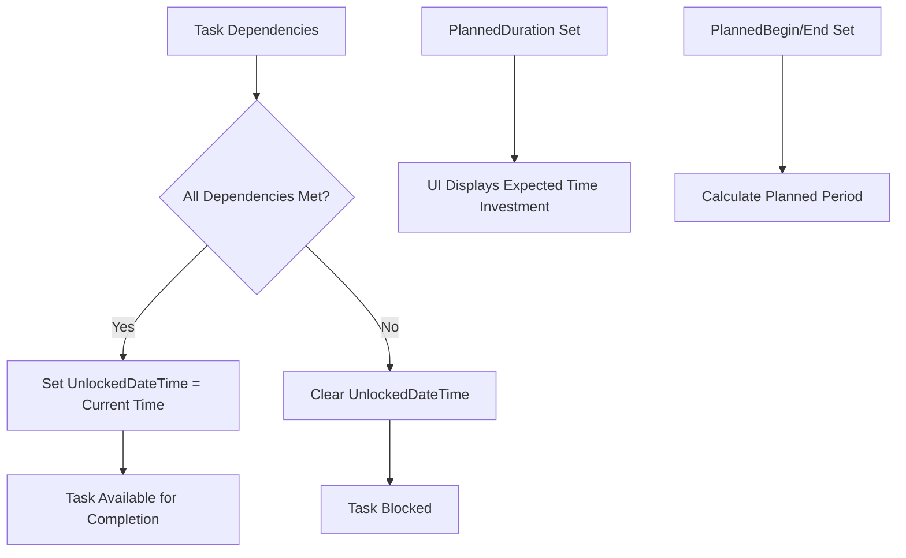
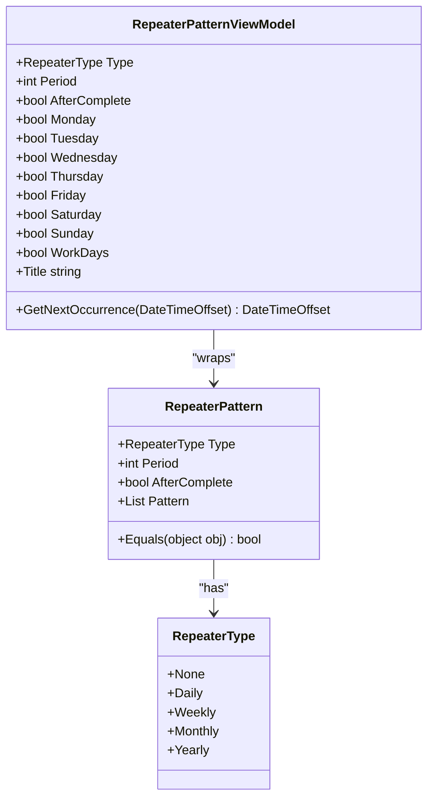
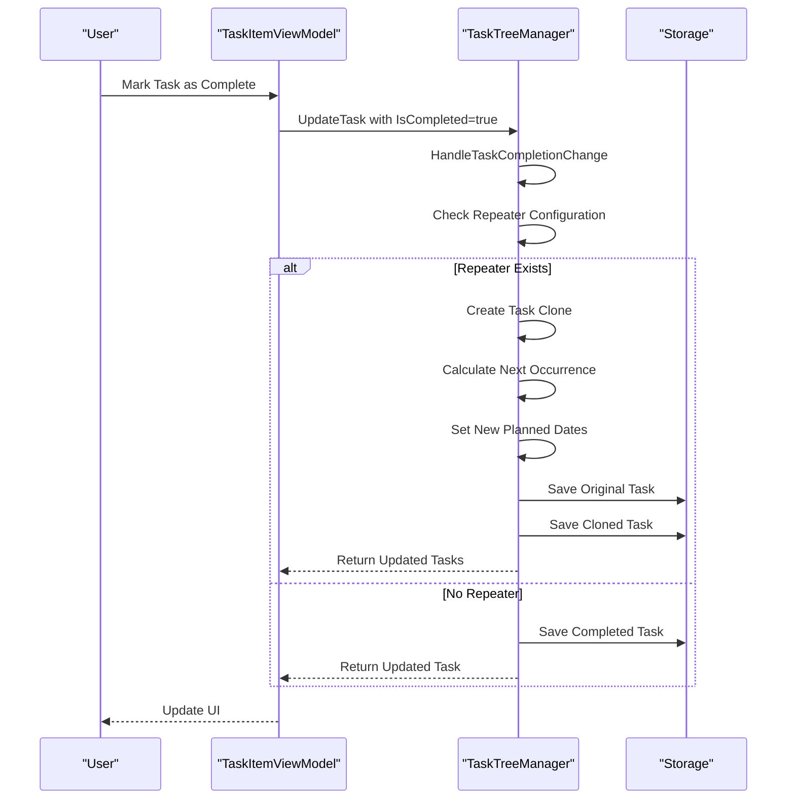
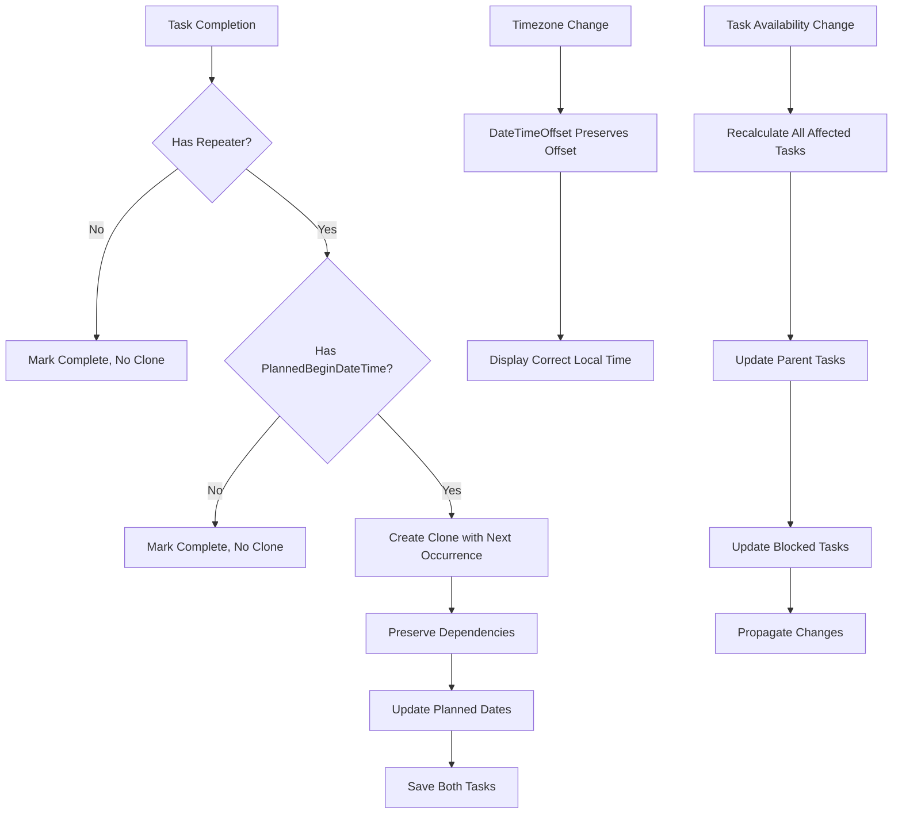

# Scheduling and Recurrence Properties

<cite>
**Referenced Files in This Document**   
- [TaskItem.cs](file://src/Unlimotion.Domain/TaskItem.cs)
- [RepeaterPattern.cs](file://src/Unlimotion.Domain/RepeaterPattern.cs)
- [RepeaterType.cs](file://src/Unlimotion.Domain/RepeaterType.cs)
- [RepeaterPatternExtensions.cs](file://src/Unlimotion.Domain/RepeaterPatternExtensions.cs)
- [TaskTreeManager.cs](file://src/Unlimotion.TaskTreeManager/TaskTreeManager.cs)
- [TaskItemViewModel.cs](file://src/Unlimotion.ViewModel/TaskItemViewModel.cs)
- [RepeaterPatternViewModel.cs](file://src/Unlimotion.ViewModel/RepeaterPatternViewModel.cs)
- [TaskAvailabilityCalculationTests.cs](file://src/Unlimotion.Test/TaskAvailabilityCalculationTests.cs)
- [TaskCompletionChangeTests.cs](file://src/Unlimotion.Test/TaskCompletionChangeTests.cs)
</cite>

## Table of Contents
1. [Introduction](#introduction)
2. [PlannedDuration and UnlockedDateTime Relationship](#plannedduration-and-unlockeddatetime-relationship)
3. [RepeaterPattern Structure and Functionality](#repeaterpattern-structure-and-functionality)
4. [Recurring Task Processing and Cloning](#recurring-task-processing-and-cloning)
5. [Edge Cases and Special Scenarios](#edge-cases-and-special-scenarios)
6. [Conclusion](#conclusion)

## Introduction
This document provides a comprehensive analysis of the scheduling and recurrence properties in the Unlimotion task management system. The focus is on two core properties: PlannedDuration and Repeater, which govern time investment expectations and recurring task behavior respectively. The system implements sophisticated logic for task availability, recurrence generation, and time-based scheduling that ensures tasks are properly managed throughout their lifecycle. This documentation will explore how these properties interact with the scheduling system, influence task availability calculations, and handle complex recurrence patterns.

## PlannedDuration and UnlockedDateTime Relationship

The PlannedDuration property represents the expected time investment for a task and plays a crucial role in the scheduling system. It is stored as a nullable TimeSpan in the TaskItem entity and can be set through various UI commands that provide predefined duration options (1 minute, 5 minutes, 1 hour, 1 day, etc.).

The relationship between PlannedDuration and UnlockedDateTime is indirect but significant. UnlockedDateTime is not directly calculated from PlannedDuration, but rather serves as a timestamp indicating when a task becomes available for completion. The actual calculation of UnlockedDateTime occurs in the TaskTreeManager's availability calculation logic, which determines when a task can be completed based on its dependencies.

When a task becomes available (i.e., all its contained tasks are completed and all blocking tasks are completed), the system sets the UnlockedDateTime to the current UTC timestamp. Conversely, when a task becomes blocked or unavailable, the UnlockedDateTime is cleared. This mechanism ensures that UnlockedDateTime accurately reflects the moment when a task transitions to an available state.

The PlannedDuration property influences scheduling through its interaction with PlannedBeginDateTime and PlannedEndDateTime. When these properties are set, the system can calculate the planned period and duration, which informs users about the expected time commitment. However, the actual UnlockedDateTime is determined by availability rules rather than duration calculations.

**Diagram sources**
- [TaskItem.cs](file://src/Unlimotion.Domain/TaskItem.cs#L1-L33)
- [TaskTreeManager.cs](file://src/Unlimotion.TaskTreeManager/TaskTreeManager.cs#L650-L700)

**Section sources**
- [TaskItem.cs](file://src/Unlimotion.Domain/TaskItem.cs#L1-L33)
- [TaskTreeManager.cs](file://src/Unlimotion.TaskTreeManager/TaskTreeManager.cs#L650-L750)
- [TaskAvailabilityCalculationTests.cs](file://src/Unlimotion.Test/TaskAvailabilityCalculationTests.cs#L231-L272)

## RepeaterPattern Structure and Functionality

The RepeaterPattern class defines the structure for recurring tasks in the Unlimotion system. It consists of four key properties that determine recurrence behavior:

- **Type**: An enumeration (RepeaterType) that specifies the recurrence frequency (None, Daily, Weekly, Monthly, Yearly)
- **Period**: An integer that defines the interval between recurrences (e.g., every 2 days, every 3 weeks)
- **AfterComplete**: A boolean flag that determines whether the next occurrence is calculated from the completion time or the original planned start time
- **Pattern**: A list of integers used for weekly recurrences to specify which days of the week the task should repeat (0=Monday, 1=Tuesday, etc.)

The RepeaterPattern is tightly integrated with the scheduling system through extension methods that calculate the next occurrence based on the current pattern. For daily, monthly, and yearly recurrences, the calculation is straightforward using the respective AddDays, AddMonths, or AddYears methods. Weekly recurrences are more complex, supporting both simple periodic repetition and specific day patterns.

The system provides a ViewModel wrapper (RepeaterPatternViewModel) that enhances the RepeaterPattern with additional functionality for the user interface, including properties for individual weekdays (Monday, Tuesday, etc.) and a WorkDays convenience property. This ViewModel also includes a GetNextOccurrence method that mirrors the domain logic, ensuring consistency between the UI and business layers.

**Diagram sources**
- [RepeaterPattern.cs](file://src/Unlimotion.Domain/RepeaterPattern.cs#L1-L24)
- [RepeaterType.cs](file://src/Unlimotion.Domain/RepeaterType.cs#L1-L10)
- [RepeaterPatternViewModel.cs](file://src/Unlimotion.ViewModel/RepeaterPatternViewModel.cs#L1-L173)

**Section sources**
- [RepeaterPattern.cs](file://src/Unlimotion.Domain/RepeaterPattern.cs#L1-L24)
- [RepeaterType.cs](file://src/Unlimotion.Domain/RepeaterType.cs#L1-L10)
- [RepeaterPatternExtensions.cs](file://src/Unlimotion.Domain/RepeaterPatternExtensions.cs#L1-L84)
- [RepeaterPatternViewModel.cs](file://src/Unlimotion.ViewModel/RepeaterPatternViewModel.cs#L1-L173)

## Recurring Task Processing and Cloning

The processing of recurring tasks occurs when a task is marked as completed. The system handles this through the HandleTaskCompletionChange method in the TaskTreeManager, which checks for repeater configuration and creates a new instance of the task when appropriate.

When a task with a RepeaterPattern is completed, the system creates a clone with the following properties preserved from the original:
- Title and description
- Dependency relationships (blocks, blocked by, contains, parent tasks)
- Importance and wanted status
- PlannedDuration
- Repeater configuration

The key scheduling properties that are modified in the clone are:
- **PlannedBeginDateTime**: Set to the next occurrence calculated using the RepeaterPattern's GetNextOccurrence method
- **PlannedEndDateTime**: If the original task had a planned end date, it is shifted by the same duration from the new planned begin date
- **CreatedDateTime**: Set to the current time
- **Id**: Generated as a new unique identifier

The AfterComplete flag in the RepeaterPattern determines the reference point for calculating the next occurrence. When AfterComplete is true, the next occurrence is calculated from the current date (DateTimeOffset.Now.Date), effectively starting the recurrence cycle from the completion date. When false, the recurrence follows the original schedule based on the initial PlannedBeginDateTime.

This cloning mechanism ensures that recurring tasks maintain their structural relationships while advancing through their recurrence cycle. The system preserves all dependency information, ensuring that the cloned task inherits the same blocking and containment relationships as the original.

**Diagram sources**
- [TaskTreeManager.cs](file://src/Unlimotion.TaskTreeManager/TaskTreeManager.cs#L750-L836)
- [TaskItem.cs](file://src/Unlimotion.Domain/TaskItem.cs#L1-L33)
- [TaskCompletionChangeTests.cs](file://src/Unlimotion.Test/TaskCompletionChangeTests.cs#L83-L118)

**Section sources**
- [TaskTreeManager.cs](file://src/Unlimotion.TaskTreeManager/TaskTreeManager.cs#L750-L836)
- [TaskItem.cs](file://src/Unlimotion.Domain/TaskItem.cs#L1-L33)
- [TaskCompletionChangeTests.cs](file://src/Unlimotion.Test/TaskCompletionChangeTests.cs#L83-L118)
- [TaskItemViewModel.cs](file://src/Unlimotion.ViewModel/TaskItemViewModel.cs#L250-L449)

## Edge Cases and Special Scenarios

The scheduling system handles several edge cases and special scenarios to ensure robust behavior in complex situations:

### Overlapping Recurrences
When a task has a very short recurrence interval (e.g., daily with AfterComplete=true), it's possible for multiple instances to overlap. The system handles this by treating each instance as independent. When a recurring task is completed, a new instance is created regardless of whether previous instances exist. This allows users to have multiple active instances of the same recurring task if they fall behind on completions.

### Timezone Shifts
The system uses DateTimeOffset for all date-time properties, which includes timezone information. This ensures that planned dates and times are preserved across different timezone contexts. When calculating next occurrences, the system maintains the same time component while advancing the date according to the recurrence pattern. This prevents tasks from shifting time due to timezone changes.

### Duration-Based Availability Cascades
The system implements a sophisticated dependency resolution system where changes to one task can cascade through the task hierarchy. When a task's availability changes (affecting its UnlockedDateTime), all parent tasks and tasks that it blocks are recalculated. This ensures that complex dependency chains are properly maintained. For example, if a recurring task is a prerequisite for other tasks, completing it will trigger availability recalculation for all dependent tasks.

### Recurrence with Missing Planned Dates
If a recurring task lacks a PlannedBeginDateTime, the system cannot calculate the next occurrence and will not create a clone. This prevents infinite recurrence loops for tasks that were not properly scheduled. The system requires a valid PlannedBeginDateTime to establish the recurrence pattern.

### Concurrent Modifications
The system uses an AutoUpdatingDictionary to manage concurrent modifications during availability calculations. This ensures thread safety when multiple tasks are being updated simultaneously, particularly important when handling cascading availability changes across complex task hierarchies.

**Diagram sources**
- [TaskTreeManager.cs](file://src/Unlimotion.TaskTreeManager/TaskTreeManager.cs#L650-L836)
- [TaskAvailabilityCalculationTests.cs](file://src/Unlimotion.Test/TaskAvailabilityCalculationTests.cs#L593-L624)
- [TaskItem.cs](file://src/Unlimotion.Domain/TaskItem.cs#L1-L33)

**Section sources**
- [TaskTreeManager.cs](file://src/Unlimotion.TaskTreeManager/TaskTreeManager.cs#L650-L836)
- [TaskAvailabilityCalculationTests.cs](file://src/Unlimotion.Test/TaskAvailabilityCalculationTests.cs#L593-L624)
- [TaskItem.cs](file://src/Unlimotion.Domain/TaskItem.cs#L1-L33)
- [IMPLEMENTATION_SUMMARY.md](file://IMPLEMENTATION_SUMMARY.md#L84-L93)

## Conclusion
The Unlimotion scheduling system provides a comprehensive framework for managing task duration expectations and recurrence patterns. The PlannedDuration property offers users a way to estimate time investment, while the RepeaterPattern enables sophisticated recurrence configurations with various frequencies and day patterns. The system's handling of UnlockedDateTime through availability calculations ensures that tasks are properly gated by their dependencies, creating a robust workflow management system.

The integration between these properties is well-designed, with recurring tasks automatically generating new instances upon completion while preserving their structural relationships. The system handles edge cases such as overlapping recurrences, timezone shifts, and complex dependency cascades through careful implementation of the TaskTreeManager's business logic.

This scheduling architecture supports both simple and complex use cases, from basic daily reminders to sophisticated project management workflows with interdependent recurring tasks. The separation of concerns between the domain model, business logic, and presentation layers ensures maintainability and extensibility of the scheduling features.