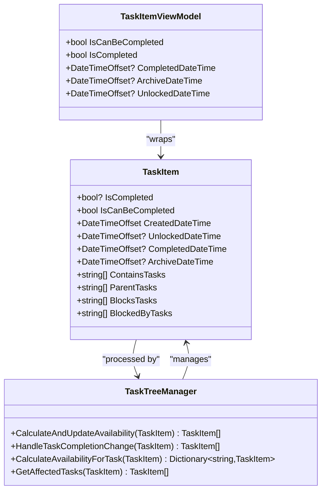
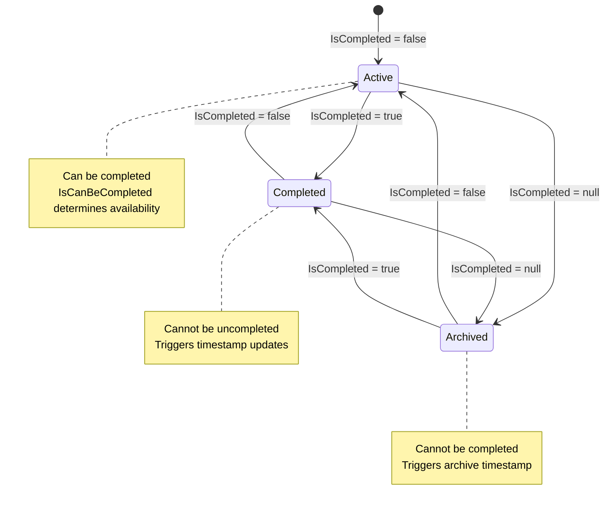
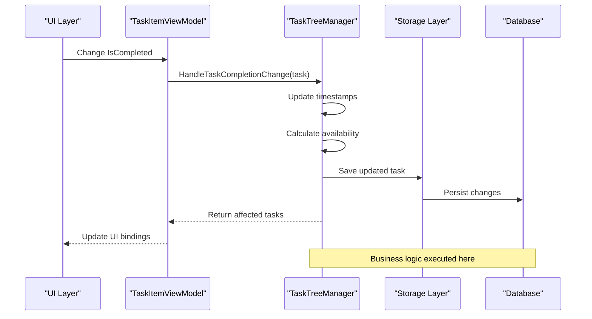
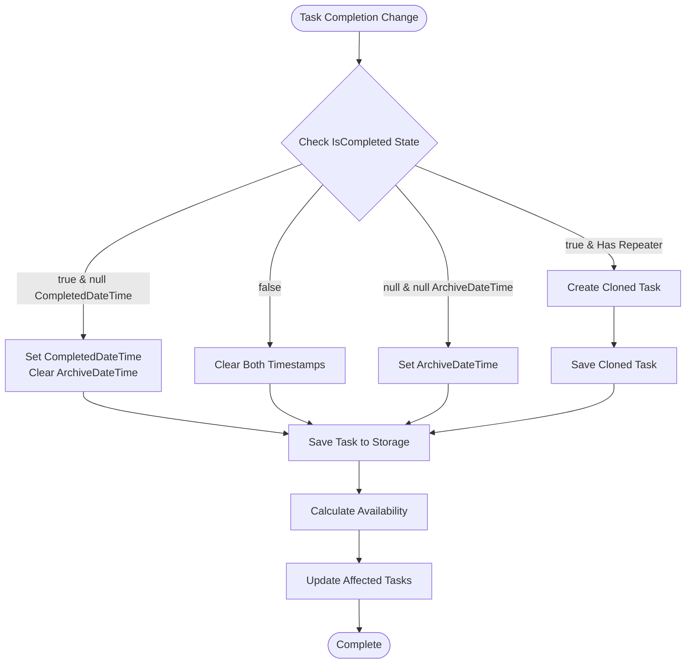
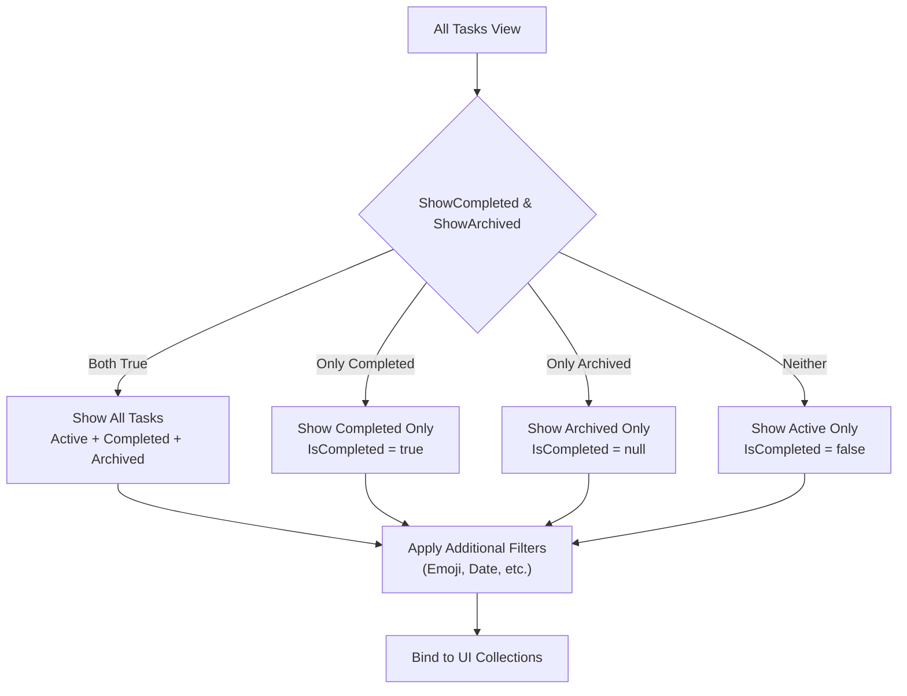
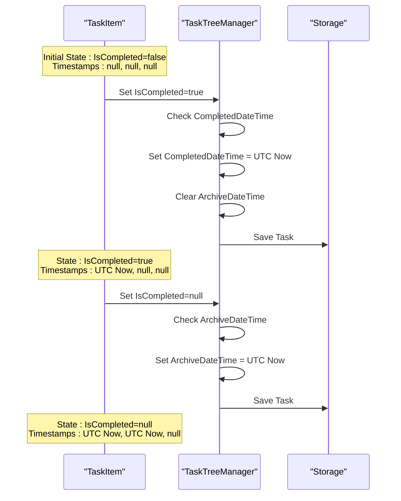
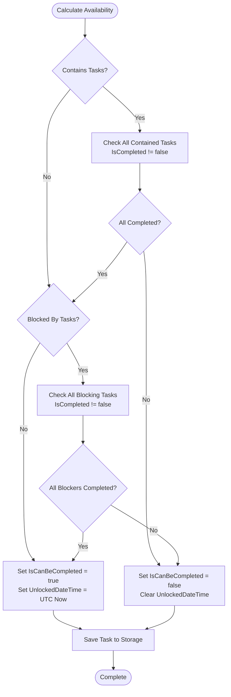
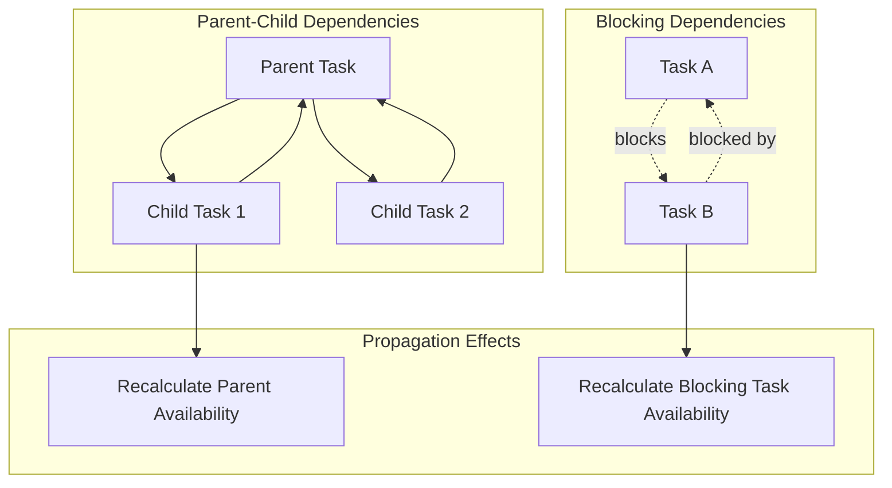
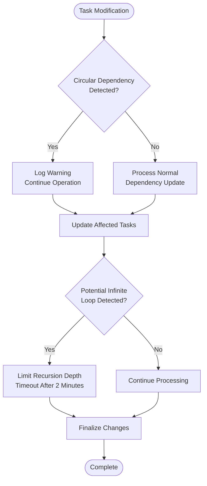
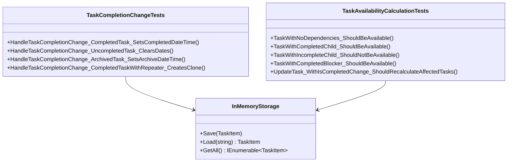

# State and Completion Properties

<cite>
**Referenced Files in This Document**
- [TaskItem.cs](file://src/Unlimotion.Domain/TaskItem.cs)
- [TaskTreeManager.cs](file://src/Unlimotion.TaskTreeManager/TaskTreeManager.cs)
- [ITaskTreeManager.cs](file://src/Unlimotion.TaskTreeManager/ITaskTreeManager.cs)
- [TaskItemViewModel.cs](file://src/Unlimotion.ViewModel/TaskItemViewModel.cs)
- [MainWindowViewModel.cs](file://src/Unlimotion.ViewModel/MainWindowViewModel.cs)
- [TaskCompletionChangeTests.cs](file://src/Unlimotion.Test/TaskCompletionChangeTests.cs)
- [TaskAvailabilityCalculationTests.cs](file://src/Unlimotion.Test/TaskAvailabilityCalculationTests.cs)
</cite>

## Table of Contents
1. [Introduction](#introduction)
2. [Core State Properties](#core-state-properties)
3. [Three-State Boolean System](#three-state-boolean-system)
4. [Business Logic Architecture](#business-logic-architecture)
5. [State Transition Management](#state-transition-management)
6. [View Filtering and UI Integration](#view-filtering-and-ui-integration)
7. [Timestamp Management](#timestamp-management)
8. [Dependency Calculation Engine](#dependency-calculation-engine)
9. [Edge Cases and Error Handling](#edge-cases-and-error-handling)
10. [Testing Framework](#testing-framework)
11. [Performance Considerations](#performance-considerations)
12. [Troubleshooting Guide](#troubleshooting-guide)

## Introduction

The Unlimotion task management system implements a sophisticated three-state boolean system for task completion tracking, complemented by a dependency-aware availability calculation engine. This system manages task states through two primary properties: `IsCompleted` and `IsCanBeCompleted`, which drive business logic, UI behavior, and data persistence throughout the application.

The state management architecture separates concerns between presentation layer UI bindings and business logic domain calculations, ensuring consistent behavior across all application interfaces while maintaining optimal performance and reliability.

## Core State Properties

### TaskItem State Properties

The TaskItem domain model defines four critical state properties that govern task lifecycle and availability:

**Diagram sources**
- [TaskItem.cs](file://src/Unlimotion.Domain/TaskItem.cs#L6-L32)
- [TaskTreeManager.cs](file://src/Unlimotion.TaskTreeManager/TaskTreeManager.cs#L10-L15)
- [TaskItemViewModel.cs](file://src/Unlimotion.ViewModel/TaskItemViewModel.cs#L18-L25)

**Section sources**
- [TaskItem.cs](file://src/Unlimotion.Domain/TaskItem.cs#L6-L32)

## Three-State Boolean System

### IsCompleted Property

The `IsCompleted` property implements a nullable boolean system with three distinct states:

| State | Value | Meaning |
|-------|-------|---------|
| Active | `false` | Task is currently in progress and can be completed |
| Completed | `true` | Task has been marked as finished |
| Archived | `null` | Task is archived and cannot be completed |

This three-state system enables flexible task lifecycle management without requiring separate boolean flags for each state.

### State Transitions and Validation

The system enforces strict state transition rules through the TaskTreeManager business logic:

**Section sources**
- [TaskCompletionChangeTests.cs](file://src/Unlimotion.Test/TaskCompletionChangeTests.cs#L12-L127)

## Business Logic Architecture

### TaskTreeManager Responsibility

The TaskTreeManager serves as the central orchestrator for all task state management operations, implementing the separation of concerns principle by moving business logic from the presentation layer to the domain layer.

**Diagram sources**
- [TaskTreeManager.cs](file://src/Unlimotion.TaskTreeManager/TaskTreeManager.cs#L758-L836)
- [TaskItemViewModel.cs](file://src/Unlimotion.ViewModel/TaskItemViewModel.cs#L130-L140)

### Interface Definition

The ITaskTreeManager interface defines the contract for all state management operations:

**Section sources**
- [ITaskTreeManager.cs](file://src/Unlimotion.TaskTreeManager/ITaskTreeManager.cs#L7-L42)

## State Transition Management

### HandleTaskCompletionChange Method

The HandleTaskCompletionChange method orchestrates all state transitions and associated side effects:

**Diagram sources**
- [TaskTreeManager.cs](file://src/Unlimotion.TaskTreeManager/TaskTreeManager.cs#L758-L836)

### Timestamp Management

Each state transition triggers specific timestamp updates:

| State Change | CompletedDateTime | ArchiveDateTime | Repeater Logic |
|--------------|-------------------|-----------------|----------------|
| Active → Completed | Set to UTC Now | Cleared | Create next occurrence |
| Active → Archived | Cleared | Set to UTC Now | No action |
| Completed → Active | Cleared | Cleared | No action |
| Completed → Archived | Cleared | Set to UTC Now | Create next occurrence |
| Archived → Active | Cleared | Cleared | No action |
| Archived → Completed | Set to UTC Now | Cleared | Create next occurrence |

**Section sources**
- [TaskTreeManager.cs](file://src/Unlimotion.TaskTreeManager/TaskTreeManager.cs#L765-L810)

## View Filtering and UI Integration

### MainWindowViewModel Filtering Logic

The MainWindowViewModel implements sophisticated filtering logic based on IsCompleted states:

**Diagram sources**
- [MainWindowViewModel.cs](file://src/Unlimotion.ViewModel/MainWindowViewModel.cs#L150-L170)

### Collection Binding Strategy

The MainWindowViewModel maintains separate collections for each view mode:

| View Mode | Filter Condition | Collection |
|-----------|------------------|------------|
| All Tasks | `IsCompleted == false \| IsCompleted == true \| IsCompleted == null` | `CurrentItems` |
| Unlocked | Available tasks with `IsCanBeCompleted = true` | `UnlockedItems` |
| Completed | `IsCompleted == true` | `CompletedItems` |
| Archived | `IsCompleted == null` | `ArchivedItems` |

**Section sources**
- [MainWindowViewModel.cs](file://src/Unlimotion.ViewModel/MainWindowViewModel.cs#L591-L628)

## Timestamp Management

### Automatic Timestamp Updates

The system automatically manages timestamp properties based on state transitions:

**Diagram sources**
- [TaskTreeManager.cs](file://src/Unlimotion.TaskTreeManager/TaskTreeManager.cs#L765-L810)

### Repeater Pattern Integration

When tasks have repeater patterns, the system creates cloned instances for future occurrences:

**Section sources**
- [TaskTreeManager.cs](file://src/Unlimotion.TaskTreeManager/TaskTreeManager.cs#L775-L810)

## Dependency Calculation Engine

### IsCanBeCompleted Calculation

The IsCanBeCompleted property determines whether a task can be marked as completed based on dependency satisfaction:

**Diagram sources**
- [TaskTreeManager.cs](file://src/Unlimotion.TaskTreeManager/TaskTreeManager.cs#L665-L710)

### Dependency Propagation

The system implements bidirectional dependency propagation:

**Diagram sources**
- [TaskTreeManager.cs](file://src/Unlimotion.TaskTreeManager/TaskTreeManager.cs#L690-L730)

**Section sources**
- [TaskTreeManager.cs](file://src/Unlimotion.TaskTreeManager/TaskTreeManager.cs#L665-L730)

## Edge Cases and Error Handling

### Circular Dependency Detection

The system handles potential circular dependencies through careful propagation logic:

**Diagram sources**
- [TaskTreeManager.cs](file://src/Unlimotion.TaskTreeManager/TaskTreeManager.cs#L597-L620)

### Forced Completion Scenarios

The system supports forced completion through various mechanisms:

| Scenario | Trigger | Behavior |
|----------|---------|----------|
| Manual Override | User action | Bypass availability checks |
| Bulk Operations | Administrative action | Process multiple tasks |
| Migration | Data import | Restore historical states |
| Recovery | System failure | Restore from backup |

**Section sources**
- [TaskAvailabilityCalculationTests.cs](file://src/Unlimotion.Test/TaskAvailabilityCalculationTests.cs#L593-L651)

## Testing Framework

### Unit Test Coverage

The testing framework provides comprehensive coverage of state management scenarios:

**Diagram sources**
- [TaskCompletionChangeTests.cs](file://src/Unlimotion.Test/TaskCompletionChangeTests.cs#L10-L127)
- [TaskAvailabilityCalculationTests.cs](file://src/Unlimotion.Test/TaskAvailabilityCalculationTests.cs#L10-L47)

### Test Scenarios

The test suite covers critical edge cases:

| Test Category | Scenarios Tested |
|---------------|------------------|
| State Transitions | Basic transitions, repeater patterns, timestamp management |
| Dependency Logic | Child completion, blocker resolution, availability calculation |
| Error Conditions | Circular dependencies, missing tasks, storage failures |
| Performance | Large task trees, recursive calculations, timeout handling |

**Section sources**
- [TaskCompletionChangeTests.cs](file://src/Unlimotion.Test/TaskCompletionChangeTests.cs#L10-L127)
- [TaskAvailabilityCalculationTests.cs](file://src/Unlimotion.Test/TaskAvailabilityCalculationTests.cs#L10-L47)

## Performance Considerations

### Optimization Strategies

The system implements several performance optimizations:

1. **Lazy Loading**: Dependencies are loaded only when needed
2. **Batch Operations**: Multiple state changes are batched for efficiency
3. **Caching**: Frequently accessed task data is cached
4. **Async Processing**: All I/O operations are asynchronous
5. **Timeout Protection**: Long-running operations are protected with timeouts

### Memory Management

The TaskTreeManager uses AutoUpdatingDictionary for efficient memory management during bulk operations, preventing memory leaks during complex dependency recalculations.

## Troubleshooting Guide

### Common Issues and Solutions

| Issue | Symptoms | Solution |
|-------|----------|----------|
| Stuck Tasks | Tasks remain unavailable despite dependencies completed | Run manual availability recalculation |
| Timestamp Errors | Incorrect timestamps on state changes | Verify timezone settings and UTC conversion |
| Circular Dependencies | Infinite loops during availability calculation | Review task relationships and break cycles |
| Performance Degradation | Slow response during bulk operations | Check for large task trees and optimize queries |

### Debugging State Issues

For debugging state-related problems:

1. **Verify Task Relationships**: Check ContainsTasks, ParentTasks, BlocksTasks, BlockedByTasks
2. **Inspect Availability Calculations**: Use CalculateAvailabilityForTask directly
3. **Monitor Timestamp Changes**: Track CompletedDateTime and ArchiveDateTime updates
4. **Validate State Transitions**: Ensure proper IsCompleted state changes

**Section sources**
- [TaskTreeManager.cs](file://src/Unlimotion.TaskTreeManager/TaskTreeManager.cs#L597-L620)