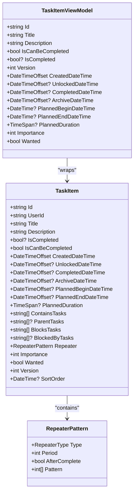
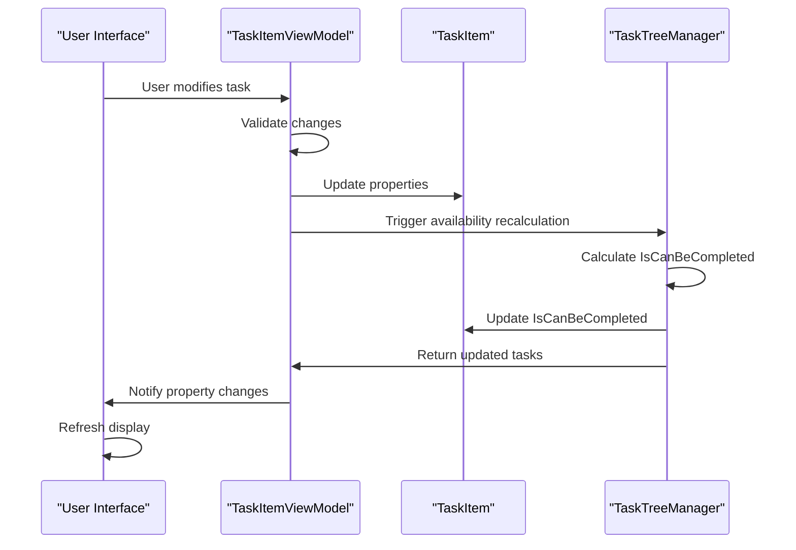
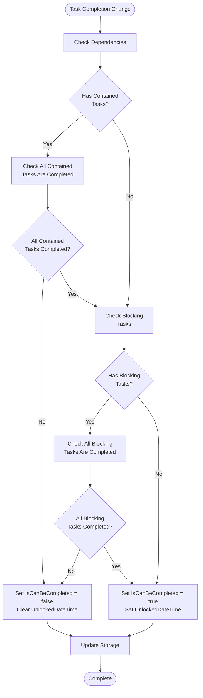
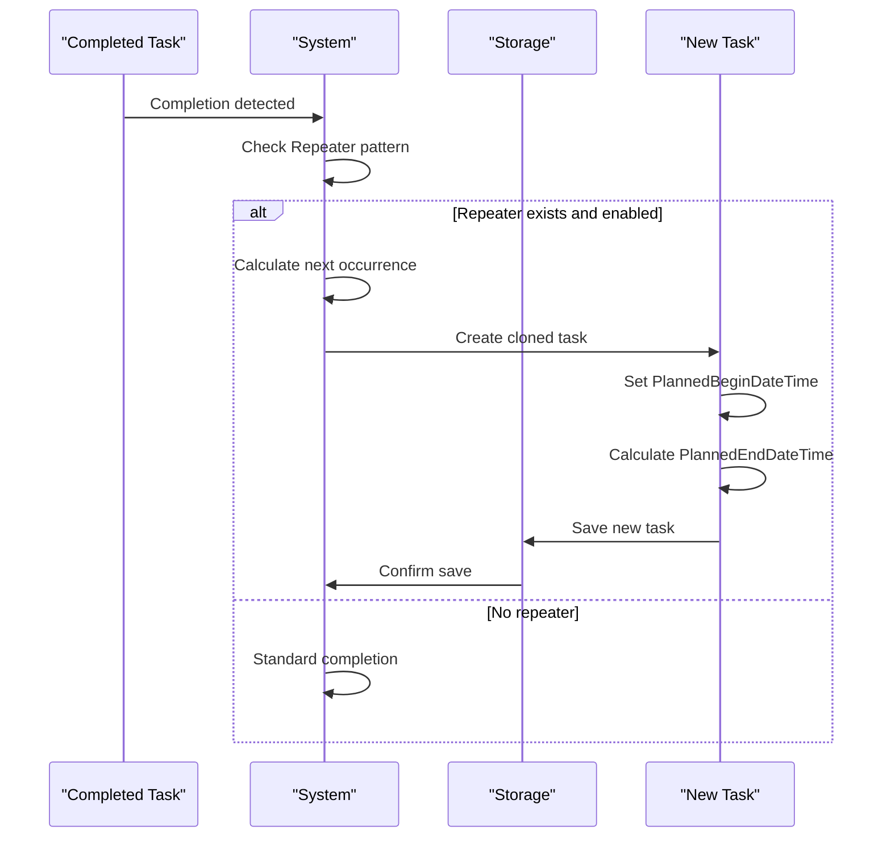

# TaskItem Properties

<cite>
**Referenced Files in This Document**
- [TaskItem.cs](file://src/Unlimotion.Domain/TaskItem.cs)
- [TaskItemViewModel.cs](file://src/Unlimotion.ViewModel/TaskItemViewModel.cs)
- [TaskTreeManager.cs](file://src/Unlimotion.TaskTreeManager/TaskTreeManager.cs)
- [TaskItemHubMold.cs](file://src/Unlimotion.Interface/TaskItemHubMold.cs)
- [RepeaterPattern.cs](file://src/Unlimotion.Domain/RepeaterPattern.cs)
- [RepeaterType.cs](file://src/Unlimotion.Domain/RepeaterType.cs)
- [TaskAvailabilityCalculationTests.cs](file://src/Unlimotion.Test\TaskAvailabilityCalculationTests.cs)
- [TaskCompletionChangeTests.cs](file://src\Unlimotion.Test\TaskCompletionChangeTests.cs)
- [SortDefinition.cs](file://src\Unlimotion.ViewModel\SortDefinition.cs)
</cite>

## Table of Contents
1. [Introduction](#introduction)
2. [Core Entity Structure](#core-entity-structure)
3. [Identification Properties](#identification-properties)
4. [Content Properties](#content-properties)
5. [State Management Properties](#state-management-properties)
6. [Temporal Properties](#temporal-properties)
7. [Planning Properties](#planning-properties)
8. [Relationship Properties](#relationship-properties)
9. [Business Logic Properties](#business-logic-properties)
10. [UI Integration Properties](#ui-integration-properties)
11. [Property Interactions and Business Rules](#property-interactions-and-business-rules)
12. [Performance Considerations](#performance-considerations)
13. [Conclusion](#conclusion)

## Introduction

The TaskItem entity serves as the core data model for task management within the Unlimotion system. This comprehensive documentation details each property of the TaskItem class, explaining its purpose, data type, default values, behavioral implications, and interactions with UI components and business logic. The TaskItem represents a fundamental unit of work with sophisticated state management, temporal tracking, and relationship modeling capabilities.

## Core Entity Structure

The TaskItem class is designed as a comprehensive data container that encapsulates all aspects of task management within the system. It follows a clean architecture pattern with clear separation between domain logic and presentation concerns.

**Diagram sources**
- [TaskItem.cs](file://src\Unlimotion.Domain\TaskItem.cs#L6-L31)
- [TaskItemViewModel.cs](file://src\Unlimotion.ViewModel\TaskItemViewModel.cs#L368-L400)
- [RepeaterPattern.cs](file://src\Unlimotion.Domain\RepeaterPattern.cs#L7-L12)

**Section sources**
- [TaskItem.cs](file://src\Unlimotion.Domain\TaskItem.cs#L1-L33)

## Identification Properties

### Id (Unique Identifier)
The `Id` property serves as the primary key for the TaskItem entity, uniquely identifying each task within the system.

| Property | Value |
|----------|-------|
| **Type** | `string` |
| **Nullable** | No |
| **Default Value** | Assigned during task creation |
| **Constraints** | Must be unique across all tasks |
| **Format** | Guid-like string representation |

**Significance**: The Id property enables efficient task retrieval, relationship establishment, and persistence operations. It serves as the foundation for all task references and maintains data integrity across distributed operations.

**UI Interaction**: Used as the key identifier in task collections, enabling efficient rendering and updates in the user interface.

### UserId (Ownership Reference)
The `UserId` property establishes ownership and access control for tasks.

| Property | Value |
|----------|-------|
| **Type** | `string` |
| **Nullable** | No |
| **Default Value** | Assigned during task creation |
| **Purpose** | Multi-user support and data isolation |

**Significance**: Enables multi-user environments by associating tasks with specific users. Provides the foundation for access control and data privacy.

**Section sources**
- [TaskItem.cs](file://src\Unlimotion.Domain\TaskItem.cs#L7-L8)

## Content Properties

### Title (Task Name with Emoji Support)
The `Title` property stores the human-readable name of the task, with built-in support for emoji characters.

| Property | Value |
|----------|-------|
| **Type** | `string` |
| **Nullable** | No |
| **Default Value** | Empty string |
| **Character Limit** | Unlimited (practical limits apply) |
| **Emoji Support** | Full Unicode emoji support |

**Significance**: The Title property serves as the primary display element for tasks, supporting rich text with emoji characters for visual categorization and personalization.

**Implementation Details**: The system includes specialized emoji extraction logic that parses the Title to extract emoji characters for filtering and grouping operations. This enables users to organize tasks visually using emoji categories.

**UI Integration**: The Title property drives multiple UI features including:
- Main task display in lists and views
- Emoji-based filtering and categorization
- Search functionality with partial matching
- Export and reporting with full formatting

**Section sources**
- [TaskItem.cs](file://src\Unlimotion.Domain\TaskItem.cs#L9)
- [TaskItemViewModel.cs](file://src\Unlimotion.ViewModel\TaskItemViewModel.cs#L474-L476)

### Description (Detailed Task Information)
The `Description` property provides a rich text field for detailed task information.

| Property | Value |
|----------|-------|
| **Type** | `string` |
| **Nullable** | Yes |
| **Default Value** | `null` |
| **Format Support** | Rich text with formatting |
| **Size Limit** | Practical limits apply |

**Significance**: The Description property enables comprehensive task documentation, supporting complex instructions, notes, and contextual information essential for task execution.

**UI Interaction**: Integrated with rich text editors and supports various formatting options for enhanced readability and information organization.

**Section sources**
- [TaskItem.cs](file://src\Unlimotion.Domain\TaskItem.cs#L10)

## State Management Properties

### IsCompleted (Three-State Boolean)
The `IsCompleted` property implements a sophisticated three-state system for task completion tracking.

| State | Value | Meaning | Behavioral Implications |
|-------|-------|---------|------------------------|
| **Active** | `false` | Task is in progress | Available for editing and completion |
| **Completed** | `true` | Task has been finished | Triggers completion logic and archiving |
| **Archived** | `null` | Task is hidden/deleted | Excluded from active views |

**Significance**: The three-state system provides flexible task lifecycle management, distinguishing between completed tasks awaiting archival, actively worked-on tasks, and permanently archived tasks.

**Business Logic**: The IsCompleted property triggers significant state transitions:
- **Completion Transition**: Setting to `true` triggers timestamp assignment and repeater logic
- **Archival Transition**: Setting to `null` triggers archival timestamp and UI exclusion
- **Reset Transition**: Setting to `false` clears timestamps and makes task available again

**UI Integration**: Different states trigger distinct visual treatments and functional behaviors in the user interface.

**Section sources**
- [TaskItem.cs](file://src\Unlimotion.Domain\TaskItem.cs#L11)
- [TaskTreeManager.cs](file://src\Unlimotion.TaskTreeManager\TaskTreeManager.cs#L771-L794)

### IsCanBeCompleted (Calculated Flag)
The `IsCanBeCompleted` property is a calculated flag that determines whether a task can be marked as completed based on dependency relationships.

| Property | Value |
|----------|-------|
| **Type** | `bool` |
| **Nullable** | No |
| **Default Value** | `true` |
| **Calculation Method** | Dependency-based evaluation |

**Significance**: This property implements the core business rule that a task can only be completed when all its dependencies are satisfied.

**Calculation Logic**: The system evaluates two types of dependencies:
1. **Contained Tasks**: All child tasks must be completed (IsCompleted != false)
2. **Blocking Tasks**: All blocking tasks must be completed (IsCompleted != false)

**Automatic Management**: The IsCanBeCompleted property is automatically recalculated whenever:
- Child task completion status changes
- Blocking task completion status changes
- Parent-child relationships are established or broken
- Blocking relationships are established or broken

**UI Impact**: Tasks with IsCanBeCompleted = false appear disabled or grayed out in the interface, preventing accidental completion.

**Section sources**
- [TaskItem.cs](file://src\Unlimotion.Domain\TaskItem.cs#L12)
- [TaskTreeManager.cs](file://src\Unlimotion.TaskTreeManager\TaskTreeManager.cs#L629-L699)

**Section sources**
- [TaskItem.cs](file://src\Unlimotion.Domain\TaskItem.cs#L11-L12)
- [TaskTreeManager.cs](file://src\Unlimotion.TaskTreeManager\TaskTreeManager.cs#L629-L699)

## Temporal Properties

### CreatedDateTime (Creation Timestamp)
The `CreatedDateTime` property records when a task was initially created.

| Property | Value |
|----------|-------|
| **Type** | `DateTimeOffset` |
| **Nullable** | No |
| **Default Value** | `DateTimeOffset.UtcNow` |
| **Precision** | Milliseconds |
| **Timezone** | UTC with offset |

**Significance**: The CreatedDateTime property provides accurate audit trail information and enables time-based filtering and reporting.

**Automatic Management**: This property is automatically set during task creation and never modified afterward, ensuring historical accuracy.

**UI Integration**: Used for sorting tasks chronologically and displaying creation information in task details.

**Section sources**
- [TaskItem.cs](file://src\Unlimotion.Domain\TaskItem.cs#L13)

### UnlockedDateTime (Automatically Managed Availability Timestamp)
The `UnlockedDateTime` property tracks when a task becomes available for completion.

| Property | Value |
|----------|-------|
| **Type** | `DateTimeOffset?` |
| **Nullable** | Yes |
| **Default Value** | `null` |
| **Automatic Management** | Set when task becomes available |
| **Clearing Condition** | When task becomes blocked |

**Significance**: The UnlockedDateTime property enables sophisticated task availability tracking and provides insights into task readiness and workflow efficiency.

**Automatic Timestamp Management**: The system automatically manages this property through availability calculations:
- **Setting**: When IsCanBeCompleted changes from false to true
- **Clearing**: When IsCanBeCompleted changes from true to false
- **Persistence**: Stored in the database for historical analysis

**Business Intelligence**: This property enables metrics such as:
- Average time to task availability
- Task readiness distribution
- Workflow bottleneck identification

**Section sources**
- [TaskItem.cs](file://src\Unlimotion.Domain\TaskItem.cs#L14)

### CompletedDateTime (Completion Timestamp)
The `CompletedDateTime` property records when a task was marked as completed.

| Property | Value |
|----------|-------|
| **Type** | `DateTimeOffset?` |
| **Nullable** | Yes |
| **Default Value** | `null` |
| **Trigger Condition** | IsCompleted set to `true` |
| **Automatic Assignment** | When completion occurs |

**Significance**: The CompletedDateTime property provides precise timing information for task completion events and enables accurate performance metrics.

**Automatic Assignment**: The system automatically sets this property when:
- IsCompleted transitions from `false` to `true`
- The task passes availability checks
- All prerequisite conditions are met

**Repeater Logic Integration**: For recurring tasks, this property helps calculate next occurrence dates and manage repetition cycles.

**Section sources**
- [TaskItem.cs](file://src\Unlimotion.Domain\TaskItem.cs#L15)

### ArchiveDateTime (Archival Timestamp)
The `ArchiveDateTime` property records when a task was moved to the archive state.

| Property | Value |
|----------|-------|
| **Type** | `DateTimeOffset?` |
| **Nullable** | Yes |
| **Default Value** | `null` |
| **Trigger Condition** | IsCompleted set to `null` |
| **Automatic Management** | Set during archival |

**Significance**: The ArchiveDateTime property enables historical tracking and provides insight into task lifecycle patterns.

**Archival Process**: When a task is archived:
- IsCompleted is set to `null`
- ArchiveDateTime is assigned the current timestamp
- The task is removed from active views
- Historical data is preserved for reporting

**Section sources**
- [TaskItem.cs](file://src\Unlimotion.Domain\TaskItem.cs#L16)

## Planning Properties

### PlannedBeginDateTime (Planned Execution Window - Start)
The `PlannedBeginDateTime` property defines the earliest date and time when a task can begin execution.

| Property | Value |
|----------|-------|
| **Type** | `DateTimeOffset?` |
| **Nullable** | Yes |
| **Default Value** | `null` |
| **Precision** | Milliseconds |
| **Timezone** | Configurable timezone support |

**Significance**: This property enables time-based task scheduling and provides the foundation for calendar integration and deadline management.

**UI Integration**: Used for:
- Calendar view rendering
- Deadline tracking
- Future task filtering
- Resource allocation planning

**Business Rules**: Tasks with PlannedBeginDateTime in the future are considered "future" tasks and may have different availability characteristics.

**Section sources**
- [TaskItem.cs](file://src\Unlimotion.Domain\TaskItem.cs#L17)

### PlannedEndDateTime (Planned Execution Window - End)
The `PlannedEndDateTime` property defines the latest date and time when a task should be completed.

| Property | Value |
|----------|-------|
| **Type** | `DateTimeOffset?` |
| **Nullable** | Yes |
| **Default Value** | `null` |
| **Relationship** | Must be >= PlannedBeginDateTime |
| **Purpose** | Defines task duration window |

**Significance**: Together with PlannedBeginDateTime, this property creates a time window for task execution and enables capacity planning.

**Duration Calculation**: The difference between PlannedEndDateTime and PlannedBeginDateTime represents the ideal task duration.

**UI Features**: Supports:
- Gantt chart visualization
- Resource scheduling
- Capacity utilization tracking
- Deadline monitoring

**Section sources**
- [TaskItem.cs](file://src\Unlimotion.Domain\TaskItem.cs#L18)

### PlannedDuration (Expected Task Duration)
The `PlannedDuration` property specifies the expected time required to complete the task.

| Property | Value |
|----------|-------|
| **Type** | `TimeSpan?` |
| **Nullable** | Yes |
| **Default Value** | `null` |
| **Units** | Days, hours, minutes, seconds |
| **Calculation** | Can be derived from PlannedEndDateTime - PlannedBeginDateTime |

**Significance**: The PlannedDuration property enables workload estimation, resource planning, and capacity management.

**Flexible Input**: Can be specified directly or calculated from the planned execution window.

**Planning Tools**: Used by:
- Resource allocation algorithms
- Workload balancing systems
- Capacity planning tools
- Performance forecasting

**Section sources**
- [TaskItem.cs](file://src\Unlimotion.Domain\TaskItem.cs#L19)

## Relationship Properties

### ContainsTasks (Child Task References)
The `ContainsTasks` property maintains references to child tasks that are part of this task's decomposition.

| Property | Value |
|----------|-------|
| **Type** | `List<string>` |
| **Nullable** | No |
| **Default Value** | Empty list |
| **Relationship Type** | Parent-Child (containment) |
| **Cardinality** | One-to-many |

**Significance**: This property enables hierarchical task organization and supports complex task structures with multiple levels of decomposition.

**Business Logic**: Child tasks must be completed before their parent can be marked as complete, implementing the "all children must be done" dependency rule.

**UI Representation**: Creates nested task displays and supports tree-view navigation.

**Section sources**
- [TaskItem.cs](file://src\Unlimotion.Domain\TaskItem.cs#L20)

### ParentTasks (Parent Task References)
The `ParentTasks` property maintains references to parent tasks that contain this task.

| Property | Value |
|----------|-------|
| **Type** | `List<string>?` |
| **Nullable** | Yes |
| **Default Value** | Empty list |
| **Relationship Type** | Child-Parent (containment) |
| **Cardinality** | Many-to-one |

**Significance**: Enables reverse navigation through task hierarchies and supports breadcrumb navigation and context awareness.

**Optional Nature**: Allows tasks to exist independently or as part of larger structures.

**Section sources**
- [TaskItem.cs](file://src\Unlimotion.Domain\TaskItem.cs#L21)

### BlocksTasks (Blocking Dependencies)
The `BlocksTasks` property maintains references to tasks that are blocked by this task.

| Property | Value |
|----------|-------|
| **Type** | `List<string>` |
| **Nullable** | No |
| **Default Value** | Empty list |
| **Relationship Type** | Blocking |
| **Direction** | Outgoing |

**Significance**: Implements blocking dependencies where this task prevents others from starting until it's completed.

**Business Logic**: Blocked tasks cannot become available (IsCanBeCompleted = false) until this task is completed.

**UI Impact**: Blocked tasks appear disabled or grayed out in the interface.

**Section sources**
- [TaskItem.cs](file://src\Unlimotion.Domain\TaskItem.cs#L22)

### BlockedByTasks (Blocked By Dependencies)
The `BlockedByTasks` property maintains references to tasks that block this task.

| Property | Value |
|----------|-------|
| **Type** | `List<string>?` |
| **Nullable** | Yes |
| **Default Value** | Empty list |
| **Relationship Type** | Blocking |
| **Direction** | Incoming |

**Significance**: Enables reverse dependency tracking and supports complex workflow scenarios.

**Optional Nature**: Allows tasks to be independent or part of blocking relationships.

**Section sources**
- [TaskItem.cs](file://src\Unlimotion.Domain\TaskItem.cs#L23)

## Business Logic Properties

### Repeater (Recurring Task Pattern)
The `Repeater` property defines the recurrence pattern for recurring tasks.

| Property | Value |
|----------|-------|
| **Type** | `RepeaterPattern` |
| **Nullable** | Yes |
| **Default Value** | `null` |
| **Pattern Types** | Daily, Weekly, Monthly, Yearly, None |

**Significance**: Enables automated task creation and recurrence management for ongoing activities.

**Repeater Types**:
- **None**: Single occurrence task
- **Daily**: Recurs every N days
- **Weekly**: Recurs every N weeks
- **Monthly**: Recurs every N months
- **Yearly**: Recurs every N years

**Automatic Creation**: When a recurring task is completed, the system automatically creates the next occurrence based on the repeater pattern.

**Section sources**
- [TaskItem.cs](file://src\Unlimotion.Domain\TaskItem.cs#L24)
- [RepeaterPattern.cs](file://src\Unlimotion.Domain\RepeaterPattern.cs#L7-L12)
- [RepeaterType.cs](file://src\Unlimotion.Domain\RepeaterType.cs#L3-L9)

### Importance (Priority Level 0-5)
The `Importance` property assigns a priority level to tasks ranging from 0 (lowest) to 5 (highest).

| Property | Value |
|----------|-------|
| **Type** | `int` |
| **Nullable** | No |
| **Default Value** | 0 |
| **Range** | 0-5 |
| **Purpose** | Priority-based sorting and filtering |

**Significance**: The Importance property enables priority-based task management and resource allocation.

**Sorting Integration**: Used by the sorting system to order tasks by priority:
- Highest importance tasks appear first
- Supports multiple sorting criteria
- Enables "focus on important tasks" workflows

**UI Treatment**: Higher importance tasks receive visual emphasis in the interface.

**Section sources**
- [TaskItem.cs](file://src\Unlimotion.Domain\TaskItem.cs#L25)
- [SortDefinition.cs](file://src\Unlimotion.ViewModel\SortDefinition.cs#L154-L191)

### Wanted (Favorite/Starred Status)
The `Wanted` property indicates whether a task is marked as a favorite or starred.

| Property | Value |
|----------|-------|
| **Type** | `bool` |
| **Nullable** | No |
| **Default Value** | `false` |
| **Purpose** | Quick access and organization |

**Significance**: The Wanted property enables users to mark important tasks for quick access and special treatment.

**UI Features**: Tasks marked as Wanted:
- Appear in dedicated "Favorites" view
- Receive special visual indicators
- Can be filtered separately
- May receive priority treatment in various operations

**Organization Tool**: Helps users quickly identify and access frequently used or important tasks.

**Section sources**
- [TaskItem.cs](file://src\Unlimotion.Domain\TaskItem.cs#L26)

### Version (Optimistic Concurrency Control)
The `Version` property implements optimistic concurrency control for conflict resolution.

| Property | Value |
|----------|-------|
| **Type** | `int` |
| **Nullable** | No |
| **Default Value** | 0 |
| **Increment Strategy** | Automatic on updates |
| **Conflict Detection** | Version mismatch detection |

**Significance**: The Version property prevents concurrent modification conflicts and ensures data consistency in multi-user environments.

**Concurrency Management**: Each update operation increments the version number:
- Successful updates increment the version
- Failed updates (conflicts) prevent data corruption
- Conflict resolution mechanisms handle version mismatches

**Persistence Integration**: Version information is stored with task data and validated during update operations.

**Section sources**
- [TaskItem.cs](file://src\Unlimotion.Domain\TaskItem.cs#L27)

### SortOrder (Sorting Hint)
The `SortOrder` property provides a timestamp-based sorting hint for task ordering.

| Property | Value |
|----------|-------|
| **Type** | `DateTime?` |
| **Nullable** | Yes |
| **Default Value** | `null` |
| **Precision** | Milliseconds |
| **Purpose** | Secondary sorting criteria |

**Significance**: The SortOrder property enables fine-grained control over task ordering when primary sorting criteria are equal.

**Automatic Management**: Automatically set during task creation and updates to establish consistent ordering.

**UI Integration**: Used by the sorting system to maintain stable task ordering across refreshes and updates.

**Section sources**
- [TaskItem.cs](file://src\Unlimotion.Domain\TaskItem.cs#L28)

## UI Integration Properties

### ViewModel Synchronization
The TaskItem entity integrates with the TaskItemViewModel for UI presentation and user interaction.

**Diagram sources**
- [TaskItemViewModel.cs](file://src\Unlimotion.ViewModel\TaskItemViewModel.cs#L571-L588)
- [TaskTreeManager.cs](file://src\Unlimotion.TaskTreeManager\TaskTreeManager.cs#L629-L699)

**Significance**: The ViewModel layer provides reactive property binding and automatic synchronization between domain model and UI state.

**Automatic Updates**: Property changes in the domain model automatically propagate to the UI through the reactive binding system.

**Section sources**
- [TaskItemViewModel.cs](file://src\Unlimotion.ViewModel\TaskItemViewModel.cs#L368-L400)

## Property Interactions and Business Rules

### State Transition Matrix

| Current State | Action | New State | Timestamps Modified | Business Logic Triggered |
|---------------|--------|-----------|-------------------|-------------------------|
| Active | Mark Complete | Completed | CompletedDateTime | Repeater logic, availability recalculation |
| Active | Mark Archived | Archived | ArchiveDateTime | UI exclusion, history preservation |
| Completed | Unmark | Active | Clear CompletedDateTime | Availability recalculation |
| Completed | Archive | Archived | ArchiveDateTime | Permanent removal from active view |
| Archived | Unarchive | Active | Clear ArchiveDateTime | Restoration to active state |
| Archived | Complete | Completed | CompletedDateTime | Normal completion process |

### Availability Calculation Rules

The system implements sophisticated availability calculation based on dependency relationships:

**Diagram sources**
- [TaskTreeManager.cs](file://src\Unlimotion.TaskTreeManager\TaskTreeManager.cs#L629-L699)

### Repeater Pattern Integration

For recurring tasks, the system implements automatic task creation:

**Diagram sources**
- [TaskTreeManager.cs](file://src\Unlimotion.TaskTreeManager\TaskTreeManager.cs#L771-L794)

**Section sources**
- [TaskTreeManager.cs](file://src\Unlimotion.TaskTreeManager\TaskTreeManager.cs#L629-L699)
- [TaskCompletionChangeTests.cs](file://src\Unlimotion.Test\TaskCompletionChangeTests.cs#L0-L86)

## Performance Considerations

### Indexing Strategy
The TaskItem properties support efficient querying through strategic indexing:

| Property | Index Type | Use Case |
|----------|------------|----------|
| Id | Primary Key | Fast task lookup |
| UserId | Partition Key | Multi-user isolation |
| IsCompleted | Composite Index | State-based filtering |
| CreatedDateTime | Range Index | Chronological queries |
| UnlockedDateTime | Range Index | Availability filtering |
| Importance | Range Index | Priority-based sorting |

### Memory Management
Large task collections require careful memory management:
- Lazy loading for task relationships
- Pagination for long task lists
- Efficient collection updates
- Garbage collection optimization

### Concurrency Control
The Version property enables efficient optimistic concurrency:
- Minimal locking during updates
- Automatic conflict detection
- Graceful resolution mechanisms
- High-concurrency support

## Conclusion

The TaskItem entity represents a sophisticated data model that balances flexibility with performance. Its comprehensive property set enables rich task management capabilities while maintaining clean separation between domain logic and presentation concerns.

Key strengths of the design include:

- **Flexible State Management**: Three-state completion system with automatic timestamp management
- **Rich Relationship Modeling**: Support for hierarchical and dependency-based task relationships  
- **Intelligent Automation**: Automatic availability calculation and recurring task management
- **Performance Optimization**: Efficient indexing and concurrency control mechanisms
- **UI Integration**: Seamless binding between domain model and presentation layer

The property interactions demonstrate the system's commitment to business rule enforcement while providing users with intuitive task management capabilities. The combination of automatic timestamp management, intelligent dependency calculation, and flexible state transitions creates a robust foundation for complex task management scenarios.